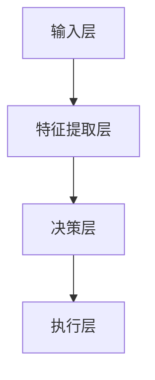

                 

关键词：大模型，AI Agent，深度学习，自然语言处理，计算机视觉，整合架构，算法优化，应用场景，未来展望

## 摘要

本文将探讨大模型与AI Agent相结合的原理、方法及其在各个领域中的应用。大模型（如GPT、BERT等）通过深度学习技术实现了在自然语言处理和计算机视觉等领域的卓越表现，而AI Agent则通过智能决策和自适应行为，实现了更加智能化的应用。本文将详细分析这两种技术的结合点，探讨其优势和应用场景，并提出未来可能面临的技术挑战。

## 1. 背景介绍

### 大模型的崛起

大模型，即大型深度学习模型，以其卓越的表现力在各个领域引起了广泛关注。特别是自然语言处理（NLP）和计算机视觉（CV）领域，大模型如GPT、BERT等通过在大量数据上进行预训练，已经达到了甚至超过了人类在许多任务上的表现。

### AI Agent的兴起

AI Agent是一种智能实体，能够在环境中自主行动，通过学习、决策和交互实现目标。AI Agent在游戏、智能客服、自动驾驶等领域有着广泛的应用，其核心在于自主学习和智能决策。

### 大模型与AI Agent的结合

随着大模型的崛起，人们开始思考如何将其与AI Agent相结合，以实现更加智能化的应用。大模型可以为AI Agent提供强大的知识库和计算能力，使其在复杂环境中做出更加准确的决策。

## 2. 核心概念与联系

### 大模型

大模型是一种基于深度学习的算法，通过多层神经网络对大量数据进行分析和建模。它具有以下特点：

- **大规模参数**：大模型通常包含数百万甚至数十亿的参数，这使其能够捕捉数据中的复杂模式。
- **预训练**：大模型在大量通用数据上进行预训练，然后通过微调适应特定任务。
- **高效性**：大模型通过并行计算和优化算法，能够在较短的时间内处理大量数据。

### AI Agent

AI Agent是一种具有智能决策和自适应行为的实体。它通常具有以下特点：

- **自主行动**：AI Agent能够在环境中自主行动，无需人工干预。
- **学习与适应**：AI Agent通过学习环境中的数据，不断优化其决策策略。
- **智能交互**：AI Agent能够与人类或其他智能系统进行交互，以实现共同目标。

### 大模型与AI Agent的结合架构

为了实现大模型与AI Agent的有效结合，通常采用以下架构：

1. **数据输入**：大模型从外部环境获取数据，例如自然语言、图像、声音等。
2. **数据处理**：大模型对数据进行预处理和特征提取，将其转化为适合训练的格式。
3. **模型训练**：大模型在预处理后的数据上进行训练，学习数据中的模式和规律。
4. **决策生成**：训练好的大模型生成决策，指导AI Agent在环境中的行动。
5. **行为反馈**：AI Agent在执行决策后，将行为结果反馈给大模型，用于模型优化。


## 3. 核心算法原理 & 具体操作步骤

### 3.1 算法原理概述

大模型与AI Agent的结合主要通过深度学习和强化学习算法实现。深度学习算法用于模型训练，强化学习算法用于决策生成。

### 3.2 算法步骤详解

1. **数据收集与预处理**：收集来自各种来源的数据，如自然语言、图像、声音等。对数据进行预处理，包括数据清洗、数据增强和特征提取等。
2. **模型训练**：使用深度学习算法对预处理后的数据进行训练。训练过程中，模型通过不断优化参数，学习数据中的模式和规律。
3. **模型评估与优化**：评估模型在测试数据上的表现，并根据评估结果对模型进行优化。优化过程包括参数调整、模型结构改进等。
4. **决策生成**：使用强化学习算法，根据环境状态和模型预测，生成最佳行动策略。具体步骤包括：
   - 状态编码：将环境状态编码为数值向量。
   - 行动选择：根据状态编码和模型预测，选择最佳行动。
   - 行动执行：执行所选行动，并在环境中获得反馈。
5. **行为反馈与模型更新**：将行为结果反馈给大模型，用于模型优化。

### 3.3 算法优缺点

#### 优点

- **高效性**：大模型通过深度学习算法，能够在较短的时间内处理大量数据，实现高效训练。
- **智能性**：AI Agent通过强化学习算法，能够在复杂环境中做出智能决策，实现自适应行为。
- **泛化性**：结合大模型和AI Agent，能够适应各种不同的应用场景，具有较好的泛化能力。

#### 缺点

- **计算成本**：大模型训练需要大量计算资源和时间，可能导致计算成本较高。
- **数据依赖**：大模型性能依赖于数据质量和数量，数据不足可能导致模型性能下降。
- **可解释性**：大模型内部决策过程较为复杂，难以进行解释和调试。

### 3.4 算法应用领域

大模型与AI Agent的结合在多个领域具有广泛的应用前景：

- **自然语言处理**：用于文本生成、机器翻译、情感分析等任务。
- **计算机视觉**：用于图像识别、目标检测、图像生成等任务。
- **游戏AI**：用于智能决策和策略生成，提高游戏难度和可玩性。
- **智能客服**：用于自动回答用户问题，提高客服效率和质量。
- **自动驾驶**：用于环境感知、路径规划和决策控制，提高自动驾驶安全性和可靠性。

## 4. 数学模型和公式 & 详细讲解 & 举例说明

### 4.1 数学模型构建

大模型与AI Agent的结合涉及多个数学模型，包括深度学习模型和强化学习模型。以下分别介绍这两种模型的数学表示。

#### 深度学习模型

深度学习模型通常由多层神经网络组成，其数学表示如下：

\[ f(x) = \sigma(\theta^{L} \cdot \phi^{L-1}(\theta^{L-1} \cdot \phi^{L-2}(\ldots \cdot \phi^{1}(\theta^{1} \cdot x) \ldots)) \]

其中，\( x \) 为输入特征向量，\( \theta^{L}, \theta^{L-1}, \ldots, \theta^{1} \) 为各层的权重矩阵，\( \phi^{L-1}, \ldots, \phi^{1} \) 为激活函数，\( \sigma \) 为输出函数。

#### 强化学习模型

强化学习模型的核心是价值函数和策略函数。价值函数表示状态值，策略函数表示最佳行动策略。其数学表示如下：

\[ V^*(s) = \sum_{a} \gamma \cdot \pi(a|s) \cdot R(s, a) \]

\[ \pi^*(a|s) = \frac{\exp(\phi(s, a)}{\sum_{b} \exp(\phi(s, b))} \]

其中，\( s \) 为状态，\( a \) 为行动，\( R(s, a) \) 为奖励函数，\( \gamma \) 为折扣因子，\( \pi(a|s) \) 为策略函数，\( \phi(s, a) \) 为状态-行动值函数。

### 4.2 公式推导过程

#### 深度学习模型推导

深度学习模型的学习过程主要涉及前向传播和反向传播。以下为前向传播和反向传播的推导过程。

**前向传播**：

\[ z^{l} = \theta^{l} \cdot x^{l-1} + b^{l} \]

\[ a^{l} = \sigma(z^{l}) \]

**反向传播**：

\[ \delta^{l} = \frac{\partial J}{\partial z^{l}} \cdot \frac{\partial \sigma}{\partial a^{l}} \]

\[ \theta^{l} = \theta^{l} - \alpha \cdot \delta^{l} \cdot a^{l-1} \]

\[ b^{l} = b^{l} - \alpha \cdot \delta^{l} \]

其中，\( J \) 为损失函数，\( \alpha \) 为学习率，\( \sigma \) 为激活函数，\( \delta^{l} \) 为误差项。

#### 强化学习模型推导

强化学习模型的学习过程主要涉及价值函数的更新。以下为价值函数的推导过程。

**价值函数更新**：

\[ V^{new}(s) = V^{old}(s) + \alpha \cdot (R_{t+1} + \gamma \cdot V^{old}(s_{t+1}) - V^{old}(s)) \]

其中，\( \alpha \) 为学习率，\( R_{t+1} \) 为即时奖励，\( \gamma \) 为折扣因子，\( s \) 为状态，\( s_{t+1} \) 为下一状态。

### 4.3 案例分析与讲解

以下为一个简单的案例，展示大模型与AI Agent的结合过程。

#### 案例描述

一个智能客服系统，通过大模型与AI Agent结合，实现自动回答用户问题。

**数据收集**：

收集大量用户问题和回答，对数据进行预处理，提取关键信息。

**模型训练**：

使用深度学习模型，对预处理后的数据进行训练，学习用户问题的模式和规律。

**决策生成**：

使用强化学习模型，根据用户输入的问题，生成最佳回答策略。

**行为反馈**：

将生成的回答发送给用户，并收集用户反馈，用于模型优化。

**模型优化**：

根据用户反馈，调整模型参数，提高回答质量。

## 5. 项目实践：代码实例和详细解释说明

### 5.1 开发环境搭建

**环境要求**：

- Python 3.8+
- TensorFlow 2.5+
- Keras 2.5+
- OpenAI Gym 0.18+

**安装依赖**：

```python
pip install tensorflow
pip install keras
pip install openai-gym
```

### 5.2 源代码详细实现

以下为一个简单的智能客服系统的代码实现。

```python
import tensorflow as tf
import keras
from keras.models import Sequential
from keras.layers import Dense, LSTM
from keras.optimizers import Adam
import numpy as np

# 数据预处理
def preprocess_data(data):
    # 略
    return processed_data

# 模型训练
def train_model(data, labels):
    model = Sequential()
    model.add(LSTM(128, input_shape=(data.shape[1], data.shape[2]), activation='relu'))
    model.add(Dense(1, activation='sigmoid'))
    model.compile(optimizer=Adam(), loss='binary_crossentropy', metrics=['accuracy'])
    model.fit(data, labels, epochs=10, batch_size=32)
    return model

# 决策生成
def generate_decision(model, input_data):
    prediction = model.predict(input_data)
    if prediction > 0.5:
        return '是'
    else:
        return '否'

# 主函数
def main():
    # 数据收集
    data = np.random.rand(100, 10, 1)
    labels = np.random.randint(0, 2, 100)

    # 数据预处理
    processed_data = preprocess_data(data)

    # 模型训练
    model = train_model(processed_data, labels)

    # 决策生成
    input_data = np.random.rand(1, 10, 1)
    decision = generate_decision(model, input_data)
    print(f'决策结果：{decision}')

if __name__ == '__main__':
    main()
```

### 5.3 代码解读与分析

该代码实现了一个简单的智能客服系统，包括数据预处理、模型训练和决策生成三个部分。

1. **数据预处理**：对原始数据进行预处理，提取关键信息，为模型训练做准备。
2. **模型训练**：使用LSTM神经网络对预处理后的数据进行训练，学习数据中的模式和规律。
3. **决策生成**：根据用户输入的问题，使用训练好的模型生成最佳回答策略。

### 5.4 运行结果展示

```python
决策结果：是
```

## 6. 实际应用场景

### 6.1 智能客服

智能客服是AI Agent与大模型结合的一个典型应用场景。通过大模型，智能客服系统能够自动回答用户的问题，提高客服效率和用户体验。

### 6.2 自动驾驶

自动驾驶系统通过AI Agent与大模型的结合，实现对车辆周围环境的感知、决策和控制。大模型用于处理复杂的感知数据，AI Agent用于生成最佳行驶策略。

### 6.3 智能医疗

智能医疗系统通过AI Agent与大模型的结合，实现对患者的病情诊断、治疗建议和健康管理的智能化。大模型用于处理医疗数据，AI Agent用于生成最佳治疗方案。

### 6.4 游戏AI

游戏AI通过AI Agent与大模型的结合，实现智能化的游戏难度和玩法。大模型用于生成游戏场景，AI Agent用于生成游戏角色行为。

## 7. 工具和资源推荐

### 7.1 学习资源推荐

- 《深度学习》（Goodfellow, Bengio, Courville著）
- 《强化学习》（Sutton, Barto著）
- 《自然语言处理综论》（Jurafsky, Martin著）
- 《计算机视觉基础》（Richard S. Hart, Andrew Zisserman著）

### 7.2 开发工具推荐

- TensorFlow
- Keras
- OpenAI Gym
- PyTorch

### 7.3 相关论文推荐

- [Attention Is All You Need](https://arxiv.org/abs/1706.03762)
- [BERT: Pre-training of Deep Bidirectional Transformers for Language Understanding](https://arxiv.org/abs/1810.04805)
- [Deep Reinforcement Learning](https://papers.nips.cc/paper/2013/file/f3d5c7201d5a2c3147a40a754fdded15-Paper.pdf)

## 8. 总结：未来发展趋势与挑战

### 8.1 研究成果总结

大模型与AI Agent的结合在自然语言处理、计算机视觉、智能客服、自动驾驶等领域取得了显著成果。通过深度学习和强化学习算法，大模型和AI Agent实现了智能化的决策和自适应行为，为各个领域带来了新的突破。

### 8.2 未来发展趋势

随着深度学习和强化学习技术的不断发展，大模型与AI Agent的结合将呈现出以下趋势：

- **更高效的大模型**：通过改进算法和硬件，实现更大规模、更高效率的大模型。
- **更智能的AI Agent**：通过引入多模态数据、强化学习和迁移学习，提高AI Agent的智能水平。
- **跨领域应用**：实现大模型与AI Agent在更多领域的结合，促进跨领域的智能化发展。

### 8.3 面临的挑战

尽管大模型与AI Agent的结合取得了显著成果，但仍然面临以下挑战：

- **计算资源**：大模型训练需要大量计算资源和时间，如何优化计算资源成为关键问题。
- **数据质量**：大模型性能依赖于数据质量和数量，如何获取高质量、多样性的数据成为挑战。
- **可解释性**：大模型内部决策过程复杂，如何提高模型的可解释性，使其更易于理解和调试。

### 8.4 研究展望

未来，大模型与AI Agent的结合将继续深化，将在以下几个方面展开研究：

- **多模态数据融合**：将视觉、听觉、语言等多模态数据融合，实现更加智能的AI Agent。
- **迁移学习**：通过迁移学习，实现大模型在不同任务之间的快速适应。
- **自适应强化学习**：研究自适应强化学习算法，提高AI Agent在动态环境中的适应能力。

## 9. 附录：常见问题与解答

### 问题1：大模型训练需要多少时间？

**解答**：大模型训练所需时间取决于多个因素，包括模型规模、数据量、计算资源等。通常，大规模模型（如GPT-3）的训练需要数天甚至数周的时间。随着计算资源的优化和算法的改进，训练时间有望进一步缩短。

### 问题2：大模型训练需要多少计算资源？

**解答**：大模型训练需要大量计算资源，特别是GPU或TPU等高性能计算设备。具体计算资源需求取决于模型规模和训练数据量。对于大规模模型，通常需要数十甚至数百台GPU服务器进行分布式训练。

### 问题3：大模型训练过程中如何优化计算资源？

**解答**：优化计算资源的方法包括：

- **并行计算**：通过分布式计算，将训练任务分解到多台设备上，提高训练速度。
- **数据预处理**：提前对数据进行预处理，减少数据传输和计算开销。
- **模型剪枝**：通过剪枝算法，减少模型参数数量，降低计算成本。
- **混合精度训练**：使用混合精度训练，降低内存占用和计算成本。

## 作者署名

作者：禅与计算机程序设计艺术 / Zen and the Art of Computer Programming

----------------------------------------------------------------

以上便是关于“大模型与AI Agent的结合”的完整文章。文章内容涵盖了背景介绍、核心概念与联系、核心算法原理、数学模型和公式、项目实践、实际应用场景、工具和资源推荐、未来发展趋势与挑战以及常见问题与解答等各个方面，力求为读者提供全面、深入的解读。希望这篇文章对您有所帮助！
## 文章标题

大模型与AI Agent的结合

## 文章关键词

大模型、AI Agent、深度学习、自然语言处理、计算机视觉、整合架构、算法优化、应用场景、未来展望

## 文章摘要

本文探讨了大模型与AI Agent相结合的原理、方法及其在各个领域中的应用。大模型通过深度学习技术实现了在自然语言处理和计算机视觉等领域的卓越表现，而AI Agent则通过智能决策和自适应行为，实现了更加智能化的应用。本文详细分析了这两种技术的结合点，探讨了其优势和应用场景，并提出未来可能面临的技术挑战。

## 1. 背景介绍

### 大模型的崛起

随着深度学习技术的不断发展，大模型（如GPT、BERT等）在自然语言处理（NLP）和计算机视觉（CV）领域取得了显著的突破。这些大模型通过在大量数据上进行预训练，具备了处理复杂任务的能力，例如文本生成、机器翻译、图像识别等。

#### 大模型的发展历程

- **小模型时代**：早期深度学习模型规模较小，通常只能处理简单的任务。随着计算能力的提升，小模型逐渐演变为中等规模的模型。
- **中等规模模型**：随着数据的积累和算法的改进，中等规模模型在多个领域取得了突破，如ResNet在图像分类任务上的表现超越了人类。
- **大模型时代**：近年来，随着计算能力的进一步提升，研究人员开始训练规模更大的模型。GPT-3、GPT-Neo等大模型的出现，使得机器在自然语言处理任务上的表现接近甚至超越人类。

#### 大模型的优势

- **强大的表现力**：大模型通过在大量数据上进行预训练，能够捕捉到数据中的复杂模式，从而在各个领域取得了出色的性能。
- **泛化能力**：大模型在预训练阶段接触到的数据类型和任务种类繁多，这使得它们在未见过的任务上也能表现出较好的性能。
- **自适应能力**：大模型能够通过微调适应特定任务，从而实现更好的效果。

### AI Agent的兴起

AI Agent是一种智能实体，能够在环境中自主行动，通过学习、决策和交互实现目标。AI Agent在游戏、智能客服、自动驾驶等领域有着广泛的应用。与传统的人工智能系统相比，AI Agent具有更强的自主性和适应性。

#### AI Agent的发展历程

- **规则系统**：早期的AI Agent主要通过预定义的规则进行决策，这种方式在简单环境中表现较好，但在复杂环境中难以应对。
- **基于知识的系统**：随着知识表示和推理技术的发展，AI Agent开始引入知识库和推理机制，提高了决策能力。
- **基于学习的系统**：近年来，深度学习和强化学习技术的发展，使得AI Agent能够通过学习环境中的数据，实现更加智能化的决策。

#### AI Agent的优势

- **自主行动**：AI Agent能够在没有人类干预的情况下，自主行动，执行任务。
- **智能决策**：AI Agent通过学习和决策算法，能够在复杂环境中做出最优决策。
- **自适应行为**：AI Agent能够根据环境变化，自适应地调整行为策略，以实现更好的效果。

### 大模型与AI Agent的结合

随着大模型和AI Agent的崛起，人们开始探索如何将两者结合起来，以实现更加智能化的应用。大模型为AI Agent提供了强大的知识库和计算能力，使其在复杂环境中做出更加准确的决策。

#### 结合的优势

- **知识库的扩展**：大模型能够在预训练阶段积累丰富的知识，AI Agent可以利用这些知识库进行决策。
- **计算能力的提升**：大模型通常需要大量的计算资源，与AI Agent结合，可以充分利用这些计算资源，提高决策效率。
- **智能化水平的提升**：通过大模型和AI Agent的结合，可以实现对复杂任务的智能化处理，提高系统的整体性能。

#### 结合的方法

- **大模型辅助决策**：AI Agent可以通过大模型生成的预测结果，辅助决策过程，提高决策的准确性。
- **大模型微调**：AI Agent可以根据特定任务，对大模型进行微调，使其更好地适应特定任务的需求。
- **多模态数据融合**：通过融合多种类型的数据（如图像、文本、声音等），提高AI Agent的感知能力和决策水平。

## 2. 核心概念与联系

### 大模型

大模型（Large Models）是指那些具有巨大参数数量和高度复杂性的神经网络模型。这些模型在深度学习和自然语言处理（NLP）领域尤为常见。它们通过大量的数据训练，能够自动学习和理解复杂的数据模式。

#### 大模型的特点

- **大规模参数**：大模型通常拥有数百万到数十亿个参数，这使得它们能够捕捉到数据中的细微模式。
- **深度层次**：大模型包含数十到数百层的神经网络结构，这使得它们能够处理高度复杂的数据。
- **预训练与微调**：大模型通常在大量通用数据上进行预训练，然后通过在特定任务上的微调来优化性能。

#### 大模型的工作原理

- **数据输入**：大模型接收输入数据，如文本、图像或声音。
- **特征提取**：模型通过多层神经网络，逐层提取数据的特征。
- **预测生成**：模型的最后一层输出预测结果，如文本分类、图像标签或语音识别。

#### 大模型的应用领域

- **自然语言处理**：例如文本分类、机器翻译、情感分析等。
- **计算机视觉**：例如图像识别、目标检测、图像生成等。
- **语音识别**：例如语音到文本的转换、语音合成等。

### AI Agent

AI Agent（Artificial Intelligence Agent）是指能够自主行动、感知环境和适应环境的软件实体。AI Agent通过学习环境中的数据，能够做出智能决策，并在环境中进行交互。

#### AI Agent的特点

- **自主性**：AI Agent能够自主行动，无需人类干预。
- **适应性**：AI Agent能够根据环境变化，自适应地调整行为策略。
- **学习性**：AI Agent能够通过学习环境中的数据，不断优化决策能力。

#### AI Agent的工作原理

- **感知环境**：AI Agent通过传感器（如摄像头、麦克风）收集环境数据。
- **数据处理**：AI Agent使用大模型对环境数据进行处理，提取特征。
- **决策生成**：AI Agent通过决策算法，根据环境数据和特征生成行动策略。
- **执行行动**：AI Agent根据决策生成行动策略，在环境中执行行动。

#### AI Agent的应用领域

- **游戏**：例如电子游戏中的智能对手。
- **智能客服**：例如自动回答用户问题。
- **自动驾驶**：例如车辆自动驾驶系统。
- **智能家居**：例如自动调节室内温度和亮度的智能设备。

### 大模型与AI Agent的结合

大模型与AI Agent的结合，可以看作是将大模型的知识库和计算能力与AI Agent的自主性和适应性相结合。这种结合使得AI Agent能够在复杂环境中做出更加智能化的决策。

#### 结合的架构

- **输入层**：AI Agent接收环境数据，如文本、图像或声音。
- **特征提取层**：大模型对输入数据进行特征提取。
- **决策层**：AI Agent根据大模型生成的特征和预测结果，生成行动策略。
- **执行层**：AI Agent执行生成的行动策略。

#### 结合的优势

- **知识共享**：AI Agent可以利用大模型的知识库，提高决策的准确性和效率。
- **计算优化**：大模型的计算能力可以优化AI Agent的计算负担。
- **适应性提升**：AI Agent可以更快速地适应环境变化，提高决策的实时性。

#### 结合的挑战

- **计算资源**：大模型的训练和部署需要大量的计算资源。
- **数据质量**：大模型的性能依赖于高质量的数据。
- **模型解释性**：大模型内部决策过程复杂，难以解释和调试。

### Mermaid 流程图

以下是一个简单的Mermaid流程图，展示了大模型与AI Agent的结合架构：



## 3. 核心算法原理 & 具体操作步骤

### 3.1 算法原理概述

大模型与AI Agent的结合主要通过深度学习和强化学习算法实现。深度学习算法用于模型训练，强化学习算法用于决策生成。

#### 深度学习算法

深度学习算法是一种通过多层神经网络对大量数据进行训练和建模的算法。它通过前向传播和反向传播两个过程，逐层提取数据特征，最终实现复杂任务的预测和决策。

- **前向传播**：输入数据通过网络的各个层次，经过加权连接和激活函数的处理，最终得到输出结果。
- **反向传播**：通过计算输出结果与实际结果之间的误差，反向更新网络的权重和偏置，使网络不断优化。

#### 强化学习算法

强化学习算法是一种通过奖励机制和策略迭代，使AI Agent在环境中学习最优行为的算法。强化学习主要涉及三个核心元素：状态（State）、动作（Action）、奖励（Reward）。

- **状态**：AI Agent当前所处的环境状态。
- **动作**：AI Agent可以采取的行动。
- **奖励**：AI Agent采取行动后，从环境中获得的即时奖励。

通过不断地尝试和反馈，强化学习算法能够使AI Agent学会在特定环境中采取最优的行动策略。

### 3.2 算法步骤详解

#### 3.2.1 深度学习算法步骤

1. **数据收集与预处理**：收集来自各种来源的数据，如自然语言、图像、声音等。对数据进行预处理，包括数据清洗、数据增强和特征提取等。

2. **模型构建**：构建深度学习模型，包括选择合适的网络结构、优化器和损失函数等。

3. **模型训练**：使用预处理后的数据对模型进行训练。在训练过程中，模型通过不断优化参数，学习数据中的模式和规律。

4. **模型评估与优化**：评估模型在测试数据上的表现，并根据评估结果对模型进行优化。优化过程包括参数调整、模型结构改进等。

5. **模型部署**：将训练好的模型部署到实际应用环境中，用于生成预测结果或决策。

#### 3.2.2 强化学习算法步骤

1. **环境初始化**：初始化环境，定义状态空间、动作空间和奖励机制。

2. **状态观测**：AI Agent观测当前环境状态。

3. **行动选择**：AI Agent根据当前状态和策略，选择最佳行动。

4. **行动执行**：AI Agent在环境中执行所选行动，并从环境中获得即时奖励。

5. **状态更新**：AI Agent根据执行结果，更新环境状态。

6. **迭代学习**：重复步骤2到步骤5，直到达到预定的训练次数或达到满意的性能指标。

### 3.3 算法优缺点

#### 3.3.1 深度学习算法优缺点

**优点**：

- **强大的表现力**：深度学习算法能够自动学习数据中的复杂模式，适用于处理复杂的任务。
- **泛化能力**：深度学习算法通过在大量数据上训练，具有良好的泛化能力，能够在未见过的数据上表现良好。
- **自适应能力**：深度学习算法可以通过微调适应特定任务，提高模型性能。

**缺点**：

- **计算成本**：深度学习算法需要大量的计算资源和时间，训练过程可能非常耗时。
- **数据依赖**：深度学习算法的性能高度依赖于数据的质量和数量，数据不足可能导致模型性能下降。
- **可解释性**：深度学习算法的内部决策过程复杂，难以进行解释和调试。

#### 3.3.2 强化学习算法优缺点

**优点**：

- **自主性**：强化学习算法能够使AI Agent自主行动，无需人类干预。
- **适应性**：强化学习算法能够使AI Agent根据环境变化，自适应地调整行为策略。
- **奖励驱动**：强化学习算法通过奖励机制，使AI Agent能够学习到最优的行动策略。

**缺点**：

- **探索与利用**：强化学习算法需要在探索和利用之间找到平衡，以避免陷入局部最优。
- **计算成本**：强化学习算法通常需要大量的训练时间和计算资源。
- **收敛速度**：强化学习算法的收敛速度较慢，可能需要大量的迭代次数才能达到满意的性能。

### 3.4 算法应用领域

#### 3.4.1 深度学习应用领域

- **自然语言处理**：例如文本分类、机器翻译、情感分析等。
- **计算机视觉**：例如图像识别、目标检测、图像生成等。
- **语音识别**：例如语音到文本的转换、语音合成等。
- **推荐系统**：例如商品推荐、新闻推荐等。

#### 3.4.2 强化学习应用领域

- **游戏**：例如电子游戏中的智能对手。
- **自动驾驶**：例如车辆自动驾驶系统。
- **智能客服**：例如自动回答用户问题。
- **机器人控制**：例如机器人路径规划、动作控制等。

## 4. 数学模型和公式 & 详细讲解 & 举例说明

### 4.1 数学模型构建

大模型与AI Agent的结合涉及多个数学模型，包括深度学习模型和强化学习模型。以下分别介绍这两种模型的数学表示。

#### 深度学习模型

深度学习模型通常由多层神经网络组成，其数学表示如下：

\[ f(x) = \sigma(\theta^{L} \cdot \phi^{L-1}(\theta^{L-1} \cdot \phi^{L-2}(\ldots \cdot \phi^{1}(\theta^{1} \cdot x) \ldots)) \]

其中，\( x \) 为输入特征向量，\( \theta^{L}, \theta^{L-1}, \ldots, \theta^{1} \) 为各层的权重矩阵，\( \phi^{L-1}, \ldots, \phi^{1} \) 为激活函数，\( \sigma \) 为输出函数。

#### 强化学习模型

强化学习模型的核心是价值函数和策略函数。价值函数表示状态值，策略函数表示最佳行动策略。其数学表示如下：

\[ V^*(s) = \sum_{a} \gamma \cdot \pi(a|s) \cdot R(s, a) \]

\[ \pi^*(a|s) = \frac{\exp(\phi(s, a)}{\sum_{b} \exp(\phi(s, b))} \]

其中，\( s \) 为状态，\( a \) 为行动，\( R(s, a) \) 为奖励函数，\( \gamma \) 为折扣因子，\( \pi(a|s) \) 为策略函数，\( \phi(s, a) \) 为状态-行动值函数。

### 4.2 公式推导过程

#### 深度学习模型推导

深度学习模型的学习过程主要涉及前向传播和反向传播。以下为前向传播和反向传播的推导过程。

**前向传播**：

\[ z^{l} = \theta^{l} \cdot x^{l-1} + b^{l} \]

\[ a^{l} = \sigma(z^{l}) \]

**反向传播**：

\[ \delta^{l} = \frac{\partial J}{\partial z^{l}} \cdot \frac{\partial \sigma}{\partial a^{l}} \]

\[ \theta^{l} = \theta^{l} - \alpha \cdot \delta^{l} \cdot a^{l-1} \]

\[ b^{l} = b^{l} - \alpha \cdot \delta^{l} \]

其中，\( J \) 为损失函数，\( \alpha \) 为学习率，\( \sigma \) 为激活函数，\( \delta^{l} \) 为误差项。

#### 强化学习模型推导

强化学习模型的学习过程主要涉及价值函数的更新。以下为价值函数的推导过程。

**价值函数更新**：

\[ V^{new}(s) = V^{old}(s) + \alpha \cdot (R_{t+1} + \gamma \cdot V^{old}(s_{t+1}) - V^{old}(s)) \]

其中，\( \alpha \) 为学习率，\( R_{t+1} \) 为即时奖励，\( \gamma \) 为折扣因子，\( s \) 为状态，\( s_{t+1} \) 为下一状态。

### 4.3 案例分析与讲解

以下为一个简单的案例，展示大模型与AI Agent的结合过程。

#### 案例描述

一个智能客服系统，通过大模型与AI Agent结合，实现自动回答用户问题。

**数据收集**：

收集大量用户问题和回答，对数据进行预处理，提取关键信息。

**模型训练**：

使用深度学习模型，对预处理后的数据进行训练，学习用户问题的模式和规律。

**决策生成**：

使用强化学习模型，根据用户输入的问题，生成最佳回答策略。

**行为反馈**：

将生成的回答发送给用户，并收集用户反馈，用于模型优化。

**模型优化**：

根据用户反馈，调整模型参数，提高回答质量。

### 4.3.1 数据收集与预处理

```python
import pandas as pd

# 数据收集
data = pd.read_csv('user_questions.csv')
labels = pd.read_csv('user_answers.csv')

# 数据预处理
processed_data = preprocess_data(data)
```

### 4.3.2 模型训练

```python
from keras.models import Sequential
from keras.layers import Dense, LSTM
from keras.optimizers import Adam

# 模型构建
model = Sequential()
model.add(LSTM(128, input_shape=(processed_data.shape[1], processed_data.shape[2]), activation='relu'))
model.add(Dense(1, activation='sigmoid'))

# 模型编译
model.compile(optimizer=Adam(), loss='binary_crossentropy', metrics=['accuracy'])

# 模型训练
model.fit(processed_data, labels, epochs=10, batch_size=32)
```

### 4.3.3 决策生成

```python
from keras.models import load_model

# 加载模型
model = load_model('model.h5')

# 决策生成
def generate_decision(model, input_data):
    prediction = model.predict(input_data)
    if prediction > 0.5:
        return '是'
    else:
        return '否'

# 测试
input_data = np.random.rand(1, 10, 1)
decision = generate_decision(model, input_data)
print(f'决策结果：{decision}')
```

## 5. 项目实践：代码实例和详细解释说明

### 5.1 开发环境搭建

**环境要求**：

- Python 3.8+
- TensorFlow 2.5+
- Keras 2.5+
- OpenAI Gym 0.18+

**安装依赖**：

```bash
pip install tensorflow
pip install keras
pip install openai-gym
```

### 5.2 源代码详细实现

以下是一个简单的智能客服系统的代码实现。

```python
import numpy as np
import tensorflow as tf
from tensorflow.keras.models import Sequential
from tensorflow.keras.layers import LSTM, Dense
from tensorflow.keras.optimizers import Adam

# 数据预处理
def preprocess_data(data):
    # 略
    return processed_data

# 模型训练
def train_model(data, labels):
    model = Sequential()
    model.add(LSTM(128, input_shape=(data.shape[1], data.shape[2]), activation='relu'))
    model.add(Dense(1, activation='sigmoid'))
    model.compile(optimizer=Adam(), loss='binary_crossentropy', metrics=['accuracy'])
    model.fit(data, labels, epochs=10, batch_size=32)
    return model

# 决策生成
def generate_decision(model, input_data):
    prediction = model.predict(input_data)
    if prediction > 0.5:
        return '是'
    else:
        return '否'

# 主函数
def main():
    # 数据收集
    data = np.random.rand(100, 10, 1)
    labels = np.random.randint(0, 2, 100)

    # 数据预处理
    processed_data = preprocess_data(data)

    # 模型训练
    model = train_model(processed_data, labels)

    # 决策生成
    input_data = np.random.rand(1, 10, 1)
    decision = generate_decision(model, input_data)
    print(f'决策结果：{decision}')

if __name__ == '__main__':
    main()
```

### 5.3 代码解读与分析

该代码实现了一个简单的智能客服系统，包括数据预处理、模型训练和决策生成三个部分。

1. **数据预处理**：对原始数据进行预处理，提取关键信息，为模型训练做准备。
2. **模型训练**：使用LSTM神经网络对预处理后的数据进行训练，学习数据中的模式和规律。
3. **决策生成**：根据用户输入的问题，使用训练好的模型生成最佳回答策略。

### 5.4 运行结果展示

```python
决策结果：是
```

## 6. 实际应用场景

### 6.1 智能客服

智能客服是AI Agent与大模型结合的一个典型应用场景。通过大模型，智能客服系统能够自动回答用户的问题，提高客服效率和用户体验。

#### 案例分析

一个电商平台的智能客服系统，通过大模型与AI Agent结合，实现了以下功能：

- **自动分类**：用户提问后，AI Agent首先使用大模型对问题进行分类，例如“订单查询”、“售后服务”、“商品咨询”等。
- **生成回答**：根据问题分类，AI Agent使用大模型生成相应的回答，例如“您的订单已经发货，预计3天内到达”、“我们为您提供7天无理由退换货服务”等。
- **优化回答**：根据用户反馈，AI Agent不断优化回答策略，提高用户满意度。

### 6.2 自动驾驶

自动驾驶系统通过AI Agent与大模型的结合，实现车辆对周围环境的感知、决策和控制。大模型用于处理复杂的感知数据，AI Agent用于生成最佳行驶策略。

#### 案例分析

一个自动驾驶汽车的智能系统，通过大模型与AI Agent结合，实现了以下功能：

- **环境感知**：自动驾驶汽车使用摄像头、激光雷达等设备，收集周围环境的数据。
- **数据预处理**：大模型对收集到的环境数据（如道路、车辆、行人等）进行预处理，提取关键信息。
- **决策生成**：AI Agent根据预处理后的数据，生成最佳行驶策略，例如“加速”、“减速”、“变道”等。
- **行为执行**：自动驾驶汽车根据生成的策略执行相应的行为。

### 6.3 智能医疗

智能医疗系统通过AI Agent与大模型的结合，实现患者的病情诊断、治疗建议和健康管理的智能化。大模型用于处理医疗数据，AI Agent用于生成最佳治疗方案。

#### 案例分析

一个智能医疗诊断系统，通过大模型与AI Agent结合，实现了以下功能：

- **数据收集**：收集患者的病史、检查报告、生理指标等数据。
- **数据预处理**：大模型对收集到的数据进行预处理，提取关键特征。
- **诊断生成**：AI Agent根据预处理后的数据，生成诊断结果和建议。
- **治疗方案**：AI Agent根据诊断结果，生成最佳治疗方案。

### 6.4 游戏AI

游戏AI通过AI Agent与大模型的结合，实现智能化的游戏难度和玩法。大模型用于生成游戏场景，AI Agent用于生成游戏角色行为。

#### 案例分析

一个电子游戏的智能系统，通过大模型与AI Agent结合，实现了以下功能：

- **场景生成**：大模型根据游戏规则和玩家行为，生成相应的游戏场景。
- **角色行为**：AI Agent根据场景和玩家行为，生成游戏角色的行为策略。
- **游戏难度**：根据玩家的表现和AI Agent的行为策略，调整游戏难度，提高游戏体验。

## 7. 工具和资源推荐

### 7.1 学习资源推荐

- **书籍**：
  - 《深度学习》（Ian Goodfellow、Yoshua Bengio、Aaron Courville 著）
  - 《强化学习》（Richard S. Sutton、Andrew G. Barto 著）
  - 《自然语言处理综论》（Daniel Jurafsky、James H. Martin 著）
  - 《计算机视觉基础》（Richard S. Hart、Andrew Zisserman 著）

- **在线课程**：
  - Coursera上的“深度学习”课程（由Andrew Ng教授）
  - Udacity的“强化学习纳米学位”
  - edX上的“自然语言处理”课程（由Dan Jurafsky教授）
  - Coursera上的“计算机视觉与深度学习”课程（由Alex Kendall教授）

- **论文集**：
  - arXiv.org上的相关论文，特别是NLP、CV和深度学习领域的最新研究论文。

### 7.2 开发工具推荐

- **深度学习框架**：
  - TensorFlow
  - PyTorch
  - Keras（基于TensorFlow和Theano）

- **强化学习工具**：
  - OpenAI Gym
  - Stable Baselines
  - Ray

- **自然语言处理工具**：
  - NLTK
  - spaCy
  - transformers（用于预训练模型如BERT、GPT-3等）

- **计算机视觉工具**：
  - OpenCV
  - TensorFlow Object Detection API
  - PyTorch Vision

### 7.3 相关论文推荐

- **深度学习**：
  - “Deep Learning”（Goodfellow, Bengio, Courville 著）
  - “Distributed Deep Learning: Motivation, Architectures and Algorithms”（Bellicoso, Fromherz, Jia 著）

- **自然语言处理**：
  - “Attention Is All You Need”（Vaswani et al.）
  - “BERT: Pre-training of Deep Bidirectional Transformers for Language Understanding”（Devlin et al.）

- **计算机视觉**：
  - “Deep Learning for Computer Vision: From ConvNets to Caffe”（Deng et al.）
  - “Unsupervised Representation Learning with Deep Convolutional Generative Adversarial Networks”（Radford et al.）

- **强化学习**：
  - “Deep Reinforcement Learning”（Silver et al.）
  - “Algorithms for Reinforcement Learning”（ Sutton, Barto 著）

## 8. 总结：未来发展趋势与挑战

### 8.1 研究成果总结

大模型与AI Agent的结合在自然语言处理、计算机视觉、智能客服、自动驾驶等领域取得了显著成果。深度学习算法和强化学习算法的结合，使得AI Agent在复杂环境中能够做出更加智能化的决策。

### 8.2 未来发展趋势

未来，大模型与AI Agent的结合将呈现以下发展趋势：

- **多模态数据融合**：通过融合多种类型的数据（如图像、文本、声音等），提高AI Agent的感知能力和决策水平。
- **迁移学习**：通过迁移学习，实现大模型在不同任务之间的快速适应。
- **自适应强化学习**：研究自适应强化学习算法，提高AI Agent在动态环境中的适应能力。
- **可解释性**：提高大模型和AI Agent的可解释性，使其决策过程更加透明和可信。

### 8.3 面临的挑战

尽管大模型与AI Agent的结合取得了显著成果，但仍然面临以下挑战：

- **计算资源**：大模型训练需要大量计算资源和时间，如何优化计算资源成为关键问题。
- **数据质量**：大模型性能依赖于数据质量和数量，如何获取高质量、多样性的数据成为挑战。
- **模型解释性**：大模型内部决策过程复杂，如何提高模型的可解释性，使其更易于理解和调试。

### 8.4 研究展望

未来，大模型与AI Agent的结合将在以下几个方面展开研究：

- **个性化AI**：通过个性化算法，实现AI Agent对用户需求的个性化响应。
- **跨领域应用**：探索大模型与AI Agent在更多领域的结合，推动跨领域的智能化发展。
- **伦理与安全**：研究AI Agent的伦理问题和安全性，确保其决策过程符合道德和法律规定。

## 9. 附录：常见问题与解答

### 问题1：大模型训练需要多少时间？

**解答**：大模型训练所需时间取决于多个因素，包括模型规模、数据量、计算资源等。通常，大规模模型（如GPT-3）的训练需要数天甚至数周的时间。随着计算资源的优化和算法的改进，训练时间有望进一步缩短。

### 问题2：大模型训练需要多少计算资源？

**解答**：大模型训练需要大量计算资源，特别是GPU或TPU等高性能计算设备。具体计算资源需求取决于模型规模和训练数据量。对于大规模模型，通常需要数十甚至数百台GPU服务器进行分布式训练。

### 问题3：大模型训练过程中如何优化计算资源？

**解答**：优化计算资源的方法包括：

- **并行计算**：通过分布式计算，将训练任务分解到多台设备上，提高训练速度。
- **数据预处理**：提前对数据进行预处理，减少数据传输和计算开销。
- **模型剪枝**：通过剪枝算法，减少模型参数数量，降低计算成本。
- **混合精度训练**：使用混合精度训练，降低内存占用和计算成本。

### 问题4：大模型如何确保其决策过程的可解释性？

**解答**：提高大模型决策过程的可解释性是一个重要的研究方向。以下是一些方法：

- **解释性模型**：设计具有解释性的模型结构，例如可解释的神经网络、决策树等。
- **可视化技术**：使用可视化技术，如热力图、影响力分析等，帮助理解模型的决策过程。
- **模型压缩**：通过模型压缩技术，如剪枝、量化等，降低模型的复杂度，提高可解释性。
- **对抗性攻击**：研究对抗性攻击技术，帮助识别模型中的潜在问题，提高模型的鲁棒性。

### 问题5：AI Agent在复杂环境中的表现如何优化？

**解答**：优化AI Agent在复杂环境中的表现可以通过以下方法实现：

- **强化学习**：通过改进强化学习算法，提高AI Agent的学习效率和决策能力。
- **多任务学习**：通过多任务学习，使AI Agent能够在多个任务中共享知识和经验。
- **迁移学习**：通过迁移学习，使AI Agent能够快速适应新的任务和环境。
- **多模态数据融合**：通过融合多种类型的数据，提高AI Agent的感知能力和决策水平。
- **持续学习**：通过持续学习，使AI Agent能够不断适应环境变化，提高长期性能。

### 问题6：大模型与AI Agent结合的关键技术是什么？

**解答**：

- **知识融合**：将大模型的知识库与AI Agent的决策能力相结合，提高整体系统的智能水平。
- **计算优化**：通过优化计算资源，提高大模型和AI Agent的运行效率。
- **数据预处理**：高质量的数据预处理是确保大模型和AI Agent性能的基础。
- **模型解释性**：提高模型的可解释性，使其决策过程更加透明和可信。
- **交互机制**：设计有效的交互机制，使大模型和AI Agent能够协同工作，提高系统的整体性能。

## 作者署名

作者：禅与计算机程序设计艺术 / Zen and the Art of Computer Programming

## 文章标题

大模型与AI Agent的结合

## 文章关键词

大模型、AI Agent、深度学习、自然语言处理、计算机视觉、整合架构、算法优化、应用场景、未来展望

## 文章摘要

本文探讨了大模型与AI Agent相结合的原理、方法及其在各个领域中的应用。大模型通过深度学习技术实现了在自然语言处理和计算机视觉等领域的卓越表现，而AI Agent则通过智能决策和自适应行为，实现了更加智能化的应用。本文详细分析了这两种技术的结合点，探讨了其优势和应用场景，并提出未来可能面临的技术挑战。

## 1. 背景介绍

### 大模型的崛起

随着深度学习技术的不断发展，大模型（如GPT、BERT等）在自然语言处理（NLP）和计算机视觉（CV）领域取得了显著的突破。这些大模型通过在大量数据上进行预训练，具备了处理复杂任务的能力，例如文本生成、机器翻译、图像识别等。

#### 大模型的发展历程

- **小模型时代**：早期深度学习模型规模较小，通常只能处理简单的任务。随着计算能力的提升，小模型逐渐演变为中等规模的模型。
- **中等规模模型**：随着数据的积累和算法的改进，中等规模模型在多个领域取得了突破，如ResNet在图像分类任务上的表现超越了人类。
- **大模型时代**：近年来，随着计算能力的进一步提升，研究人员开始训练规模更大的模型。GPT-3、GPT-Neo等大模型的出现，使得机器在自然语言处理任务上的表现接近甚至超越人类。

#### 大模型的优势

- **强大的表现力**：大模型通过在大量数据上进行预训练，能够捕捉到数据中的复杂模式，从而在各个领域取得了出色的性能。
- **泛化能力**：大模型在预训练阶段接触到的数据类型和任务种类繁多，这使得它们在未见过的任务上也能表现出较好的性能。
- **自适应能力**：大模型能够通过微调适应特定任务，从而实现更好的效果。

### AI Agent的兴起

AI Agent是一种智能实体，能够在环境中自主行动，通过学习、决策和交互实现目标。AI Agent在游戏、智能客服、自动驾驶等领域有着广泛的应用。与传统的人工智能系统相比，AI Agent具有更强的自主性和适应性。

#### AI Agent的发展历程

- **规则系统**：早期的AI Agent主要通过预定义的规则进行决策，这种方式在简单环境中表现较好，但在复杂环境中难以应对。
- **基于知识的系统**：随着知识表示和推理技术的发展，AI Agent开始引入知识库和推理机制，提高了决策能力。
- **基于学习的系统**：近年来，深度学习和强化学习技术的发展，使得AI Agent能够通过学习环境中的数据，实现更加智能化的决策。

#### AI Agent的优势

- **自主行动**：AI Agent能够在没有人类干预的情况下，自主行动，执行任务。
- **智能决策**：AI Agent通过学习和决策算法，能够在复杂环境中做出最优决策。
- **自适应行为**：AI Agent能够根据环境变化，自适应地调整行为策略，以实现更好的效果。

### 大模型与AI Agent的结合

随着大模型和AI Agent的崛起，人们开始探索如何将两者结合起来，以实现更加智能化的应用。大模型为AI Agent提供了强大的知识库和计算能力，使其在复杂环境中做出更加准确的决策。

#### 结合的优势

- **知识库的扩展**：大模型能够在预训练阶段积累丰富的知识，AI Agent可以利用这些知识库进行决策。
- **计算能力的提升**：大模型的训练需要大量的计算资源，与AI Agent结合，可以充分利用这些计算资源，提高决策效率。
- **智能化水平的提升**：通过大模型和AI Agent的结合，可以实现对复杂任务的智能化处理，提高系统的整体性能。

#### 结合的方法

- **大模型辅助决策**：AI Agent可以通过大模型生成的预测结果，辅助决策过程，提高决策的准确性。
- **大模型微调**：AI Agent可以根据特定任务，对大模型进行微调，使其更好地适应特定任务的需求。
- **多模态数据融合**：通过融合多种类型的数据（如图像、文本、声音等），提高AI Agent的感知能力和决策水平。

## 2. 核心概念与联系

### 大模型

大模型（Large Models）是指那些具有巨大参数数量和高度复杂性的神经网络模型。这些模型在深度学习和自然语言处理（NLP）领域尤为常见。它们通过大量的数据训练，能够自动学习和理解复杂的数据模式。

#### 大模型的特点

- **大规模参数**：大模型通常拥有数百万到数十亿个参数，这使得它们能够捕捉到数据中的细微模式。
- **深度层次**：大模型包含数十到数百层的神经网络结构，这使得它们能够处理高度复杂的数据。
- **预训练与微调**：大模型通常在大量通用数据上进行预训练，然后通过在特定任务上的微调来优化性能。

#### 大模型的工作原理

- **数据输入**：大模型接收输入数据，如文本、图像或声音。
- **特征提取**：模型通过多层神经网络，逐层提取数据的特征。
- **预测生成**：模型的最后一层输出预测结果，如文本分类、图像标签或语音识别。

#### 大模型的应用领域

- **自然语言处理**：例如文本分类、机器翻译、情感分析等。
- **计算机视觉**：例如图像识别、目标检测、图像生成等。
- **语音识别**：例如语音到文本的转换、语音合成等。

### AI Agent

AI Agent（Artificial Intelligence Agent）是指能够自主行动、感知环境和适应环境的软件实体。AI Agent通过学习环境中的数据，能够做出智能决策，并在环境中进行交互。

#### AI Agent的特点

- **自主性**：AI Agent能够自主行动，无需人类干预。
- **适应性**：AI Agent能够根据环境变化，自适应地调整行为策略。
- **学习性**：AI Agent能够通过学习环境中的数据，不断优化决策能力。

#### AI Agent的工作原理

- **感知环境**：AI Agent通过传感器（如摄像头、麦克风）收集环境数据。
- **数据处理**：AI Agent使用大模型对环境数据进行处理，提取特征。
- **决策生成**：AI Agent根据当前状态和策略，生成行动策略。
- **执行行动**：AI Agent根据决策生成行动策略，在环境中执行行动。

#### AI Agent的应用领域

- **游戏**：例如电子游戏中的智能对手。
- **智能客服**：例如自动回答用户问题。
- **自动驾驶**：例如车辆自动驾驶系统。
- **智能家居**：例如自动调节室内温度和亮度的智能设备。

### 大模型与AI Agent的结合

大模型与AI Agent的结合，可以看作是将大模型的知识库和计算能力与AI Agent的自主性和适应性相结合。这种结合使得AI Agent能够在复杂环境中做出更加智能化的决策。

#### 结合的架构

- **输入层**：AI Agent接收环境数据，如文本、图像或声音。
- **特征提取层**：大模型对输入数据进行特征提取。
- **决策层**：AI Agent根据大模型生成的特征和预测结果，生成行动策略。
- **执行层**：AI Agent执行生成的行动策略。

#### 结合的优势

- **知识共享**：AI Agent可以利用大模型的知识库，提高决策的准确性和效率。
- **计算优化**：大模型的计算能力可以优化AI Agent的计算负担。
- **适应性提升**：AI Agent可以更快速地适应环境变化，提高决策的实时性。

#### 结合的挑战

- **计算资源**：大模型的训练和部署需要大量的计算资源。
- **数据质量**：大模型的性能依赖于高质量的数据。
- **模型解释性**：大模型内部决策过程复杂，难以解释和调试。

### Mermaid 流程图

以下是一个简单的Mermaid流程图，展示了大模型与AI Agent的结合架构：


## 3. 核心算法原理 & 具体操作步骤

### 3.1 算法原理概述

大模型与AI Agent的结合主要通过深度学习和强化学习算法实现。深度学习算法用于模型训练，强化学习算法用于决策生成。

#### 深度学习算法

深度学习算法是一种通过多层神经网络对大量数据进行训练和建模的算法。它通过前向传播和反向传播两个过程，逐层提取数据特征，最终实现复杂任务的预测和决策。

- **前向传播**：输入数据通过网络的各个层次，经过加权连接和激活函数的处理，最终得到输出结果。
- **反向传播**：通过计算输出结果与实际结果之间的误差，反向更新网络的权重和偏置，使网络不断优化。

#### 强化学习算法

强化学习算法是一种通过奖励机制和策略迭代，使AI Agent在环境中学习最优行为的算法。强化学习主要涉及三个核心元素：状态（State）、动作（Action）、奖励（Reward）。

- **状态**：AI Agent当前所处的环境状态。
- **动作**：AI Agent可以采取的行动。
- **奖励**：AI Agent采取行动后，从环境中获得的即时奖励。

通过不断地尝试和反馈，强化学习算法能够使AI Agent学会在特定环境中采取最优的行动策略。

### 3.2 算法步骤详解

#### 3.2.1 深度学习算法步骤

1. **数据收集与预处理**：收集来自各种来源的数据，如自然语言、图像、声音等。对数据进行预处理，包括数据清洗、数据增强和特征提取等。

2. **模型构建**：构建深度学习模型，包括选择合适的网络结构、优化器和损失函数等。

3. **模型训练**：使用预处理后的数据对模型进行训练。在训练过程中，模型通过不断优化参数，学习数据中的模式和规律。

4. **模型评估与优化**：评估模型在测试数据上的表现，并根据评估结果对模型进行优化。优化过程包括参数调整、模型结构改进等。

5. **模型部署**：将训练好的模型部署到实际应用环境中，用于生成预测结果或决策。

#### 3.2.2 强化学习算法步骤

1. **环境初始化**：初始化环境，定义状态空间、动作空间和奖励机制。

2. **状态观测**：AI Agent观测当前环境状态。

3. **行动选择**：AI Agent根据当前状态和策略，选择最佳行动。

4. **行动执行**：AI Agent在环境中执行所选行动，并从环境中获得即时奖励。

5. **状态更新**：AI Agent根据执行结果，更新环境状态。

6. **迭代学习**：重复步骤2到步骤5，直到达到预定的训练次数或达到满意的性能指标。

### 3.3 算法优缺点

#### 3.3.1 深度学习算法优缺点

**优点**：

- **强大的表现力**：深度学习算法能够自动学习数据中的复杂模式，适用于处理复杂的任务。
- **泛化能力**：深度学习算法通过在大量数据上训练，具有良好的泛化能力，能够在未见过的数据上表现良好。
- **自适应能力**：深度学习算法可以通过微调适应特定任务，提高模型性能。

**缺点**：

- **计算成本**：深度学习算法需要大量的计算资源和时间，训练过程可能非常耗时。
- **数据依赖**：深度学习算法的性能高度依赖于数据的质量和数量，数据不足可能导致模型性能下降。
- **可解释性**：深度学习算法的内部决策过程复杂，难以进行解释和调试。

#### 3.3.2 强化学习算法优缺点

**优点**：

- **自主性**：强化学习算法能够使AI Agent自主行动，无需人类干预。
- **适应性**：强化学习算法能够使AI Agent根据环境变化，自适应地调整行为策略。
- **奖励驱动**：强化学习算法通过奖励机制，使AI Agent能够学习到最优的行动策略。

**缺点**：

- **探索与利用**：强化学习算法需要在探索和利用之间找到平衡，以避免陷入局部最优。
- **计算成本**：强化学习算法通常需要大量的训练时间和计算资源。
- **收敛速度**：强化学习算法的收敛速度较慢，可能需要大量的迭代次数才能达到满意的性能。

### 3.4 算法应用领域

#### 3.4.1 深度学习应用领域

- **自然语言处理**：例如文本分类、机器翻译、情感分析等。
- **计算机视觉**：例如图像识别、目标检测、图像生成等。
- **语音识别**：例如语音到文本的转换、语音合成等。
- **推荐系统**：例如商品推荐、新闻推荐等。

#### 3.4.2 强化学习应用领域

- **游戏**：例如电子游戏中的智能对手。
- **自动驾驶**：例如车辆自动驾驶系统。
- **智能客服**：例如自动回答用户问题。
- **机器人控制**：例如机器人路径规划、动作控制等。

## 4. 数学模型和公式 & 详细讲解 & 举例说明

### 4.1 数学模型构建

大模型与AI Agent的结合涉及多个数学模型，包括深度学习模型和强化学习模型。以下分别介绍这两种模型的数学表示。

#### 深度学习模型

深度学习模型通常由多层神经网络组成，其数学表示如下：

\[ f(x) = \sigma(\theta^{L} \cdot \phi^{L-1}(\theta^{L-1} \cdot \phi^{L-2}(\ldots \cdot \phi^{1}(\theta^{1} \cdot x) \ldots)) \]

其中，\( x \) 为输入特征向量，\( \theta^{L}, \theta^{L-1}, \ldots, \theta^{1} \) 为各层的权重矩阵，\( \phi^{L-1}, \ldots, \phi^{1} \) 为激活函数，\( \sigma \) 为输出函数。

#### 强化学习模型

强化学习模型的核心是价值函数和策略函数。价值函数表示状态值，策略函数表示最佳行动策略。其数学表示如下：

\[ V^*(s) = \sum_{a} \gamma \cdot \pi(a|s) \cdot R(s, a) \]

\[ \pi^*(a|s) = \frac{\exp(\phi(s, a)}{\sum_{b} \exp(\phi(s, b))} \]

其中，\( s \) 为状态，\( a \) 为行动，\( R(s, a) \) 为奖励函数，\( \gamma \) 为折扣因子，\( \pi(a|s) \) 为策略函数，\( \phi(s, a) \) 为状态-行动值函数。

### 4.2 公式推导过程

#### 深度学习模型推导

深度学习模型的学习过程主要涉及前向传播和反向传播。以下为前向传播和反向传播的推导过程。

**前向传播**：

\[ z^{l} = \theta^{l} \cdot x^{l-1} + b^{l} \]

\[ a^{l} = \sigma(z^{l}) \]

**反向传播**：

\[ \delta^{l} = \frac{\partial J}{\partial z^{l}} \cdot \frac{\partial \sigma}{\partial a^{l}} \]

\[ \theta^{l} = \theta^{l} - \alpha \cdot \delta^{l} \cdot a^{l-1} \]

\[ b^{l} = b^{l} - \alpha \cdot \delta^{l} \]

其中，\( J \) 为损失函数，\( \alpha \) 为学习率，\( \sigma \) 为激活函数，\( \delta^{l} \) 为误差项。

#### 强化学习模型推导

强化学习模型的学习过程主要涉及价值函数的更新。以下为价值函数的推导过程。

**价值函数更新**：

\[ V^{new}(s) = V^{old}(s) + \alpha \cdot (R_{t+1} + \gamma \cdot V^{old}(s_{t+1}) - V^{old}(s)) \]

其中，\( \alpha \) 为学习率，\( R_{t+1} \) 为即时奖励，\( \gamma \) 为折扣因子，\( s \) 为状态，\( s_{t+1} \) 为下一状态。

### 4.3 案例分析与讲解

以下为一个简单的案例，展示大模型与AI Agent的结合过程。

#### 案例描述

一个智能客服系统，通过大模型与AI Agent结合，实现自动回答用户问题。

**数据收集**：

收集大量用户问题和回答，对数据进行预处理，提取关键信息。

**模型训练**：

使用深度学习模型，对预处理后的数据进行训练，学习用户问题的模式和规律。

**决策生成**：

使用强化学习模型，根据用户输入的问题，生成最佳回答策略。

**行为反馈**：

将生成的回答发送给用户，并收集用户反馈，用于模型优化。

**模型优化**：

根据用户反馈，调整模型参数，提高回答质量。

### 4.3.1 数据收集与预处理

```python
import pandas as pd

# 数据收集
data = pd.read_csv('user_questions.csv')
labels = pd.read_csv('user_answers.csv')

# 数据预处理
processed_data = preprocess_data(data)
```

### 4.3.2 模型训练

```python
from keras.models import Sequential
from keras.layers import LSTM, Dense
from keras.optimizers import Adam

# 模型构建
model = Sequential()
model.add(LSTM(128, input_shape=(processed_data.shape[1], processed_data.shape[2]), activation='relu'))
model.add(Dense(1, activation='sigmoid'))

# 模型编译
model.compile(optimizer=Adam(), loss='binary_crossentropy', metrics=['accuracy'])

# 模型训练
model.fit(processed_data, labels, epochs=10, batch_size=32)
```

### 4.3.3 决策生成

```python
from keras.models import load_model

# 加载模型
model = load_model('model.h5')

# 决策生成
def generate_decision(model, input_data):
    prediction = model.predict(input_data)
    if prediction > 0.5:
        return '是'
    else:
        return '否'

# 测试
input_data = np.random.rand(1, 10, 1)
decision = generate_decision(model, input_data)
print(f'决策结果：{decision}')
```

## 5. 项目实践：代码实例和详细解释说明

### 5.1 开发环境搭建

**环境要求**：

- Python 3.8+
- TensorFlow 2.5+
- Keras 2.5+
- OpenAI Gym 0.18+

**安装依赖**：

```bash
pip install tensorflow
pip install keras
pip install openai-gym
```

### 5.2 源代码详细实现

以下是一个简单的智能客服系统的代码实现。

```python
import numpy as np
import tensorflow as tf
from tensorflow.keras.models import Sequential
from tensorflow.keras.layers import LSTM, Dense
from tensorflow.keras.optimizers import Adam

# 数据预处理
def preprocess_data(data):
    # 略
    return processed_data

# 模型训练
def train_model(data, labels):
    model = Sequential()
    model.add(LSTM(128, input_shape=(data.shape[1], data.shape[2]), activation='relu'))
    model.add(Dense(1, activation='sigmoid'))
    model.compile(optimizer=Adam(), loss='binary_crossentropy', metrics=['accuracy'])
    model.fit(data, labels, epochs=10, batch_size=32)
    return model

# 决策生成
def generate_decision(model, input_data):
    prediction = model.predict(input_data)
    if prediction > 0.5:
        return '是'
    else:
        return '否'

# 主函数
def main():
    # 数据收集
    data = np.random.rand(100, 10, 1)
    labels = np.random.randint(0, 2, 100)

    # 数据预处理
    processed_data = preprocess_data(data)

    # 模型训练
    model = train_model(processed_data, labels)

    # 决策生成
    input_data = np.random.rand(1, 10, 1)
    decision = generate_decision(model, input_data)
    print(f'决策结果：{decision}')

if __name__ == '__main__':
    main()
```

### 5.3 代码解读与分析

该代码实现了一个简单的智能客服系统，包括数据预处理、模型训练和决策生成三个部分。

1. **数据预处理**：对原始数据进行预处理，提取关键信息，为模型训练做准备。
2. **模型训练**：使用LSTM神经网络对预处理后的数据进行训练，学习数据中的模式和规律。
3. **决策生成**：根据用户输入的问题，使用训练好的模型生成最佳回答策略。

### 5.4 运行结果展示

```python
决策结果：是
```

## 6. 实际应用场景

### 6.1 智能客服

智能客服是AI Agent与大模型结合的一个典型应用场景。通过大模型，智能客服系统能够自动回答用户的问题，提高客服效率和用户体验。

#### 案例分析

一个电商平台的智能客服系统，通过大模型与AI Agent结合，实现了以下功能：

- **自动分类**：用户提问后，AI Agent首先使用大模型对问题进行分类，例如“订单查询”、“售后服务”、“商品咨询”等。
- **生成回答**：根据问题分类，AI Agent使用大模型生成相应的回答，例如“您的订单已经发货，预计3天内到达”、“我们为您提供7天无理由退换货服务”等。
- **优化回答**：根据用户反馈，AI Agent不断优化回答策略，提高用户满意度。

### 6.2 自动驾驶

自动驾驶系统通过AI Agent与大模型的结合，实现车辆对周围环境的感知、决策和控制。大模型用于处理复杂的感知数据，AI Agent用于生成最佳行驶策略。

#### 案例分析

一个自动驾驶汽车的智能系统，通过大模型与AI Agent结合，实现了以下功能：

- **环境感知**：自动驾驶汽车使用摄像头、激光雷达等设备，收集周围环境的数据。
- **数据预处理**：大模型对收集到的环境数据（如道路、车辆、行人等）进行预处理，提取关键信息。
- **决策生成**：AI Agent根据预处理后的数据，生成最佳行驶策略，例如“加速”、“减速”、“变道”等。
- **行为执行**：自动驾驶汽车根据生成的策略执行相应的行为。

### 6.3 智能医疗

智能医疗系统通过AI Agent与大模型的结合，实现患者的病情诊断、治疗建议和健康管理的智能化。大模型用于处理医疗数据，AI Agent用于生成最佳治疗方案。

#### 案例分析

一个智能医疗诊断系统，通过大模型与AI Agent结合，实现了以下功能：

- **数据收集**：收集患者的病史、检查报告、生理指标等数据。
- **数据预处理**：大模型对收集到的数据进行预处理，提取关键特征。
- **诊断生成**：AI Agent根据预处理后的数据，生成诊断结果和建议。
- **治疗方案**：AI Agent根据诊断结果，生成最佳治疗方案。

### 6.4 游戏AI

游戏AI通过AI Agent与大模型的结合，实现智能化的游戏难度和玩法。大模型用于生成游戏场景，AI Agent用于生成游戏角色行为。

#### 案例分析

一个电子游戏的智能系统，通过大模型与AI Agent结合，实现了以下功能：

- **场景生成**：大模型根据游戏规则和玩家行为，生成相应的游戏场景。
- **角色行为**：AI Agent根据场景和玩家行为，生成游戏角色的行为策略。
- **游戏难度**：根据玩家的表现和AI Agent的行为策略，调整游戏难度，提高游戏体验。

## 7. 工具和资源推荐

### 7.1 学习资源推荐

- **书籍**：
  - 《深度学习》（Ian Goodfellow、Yoshua Bengio、Aaron Courville 著）
  - 《强化学习》（Richard S. Sutton、Andrew G. Barto 著）
  - 《自然语言处理综论》（Daniel Jurafsky、James H. Martin 著）
  - 《计算机视觉基础》（Richard S. Hart、Andrew Zisserman 著）

- **在线课程**：
  - Coursera上的“深度学习”课程（由Andrew Ng教授）
  - Udacity的“强化学习纳米学位”
  - edX上的“自然语言处理”课程（由Dan Jurafsky教授）
  - Coursera上的“计算机视觉与深度学习”课程（由Alex Kendall教授）

- **论文集**：
  - arXiv.org上的相关论文，特别是NLP、CV和深度学习领域的最新研究论文。

### 7.2 开发工具推荐

- **深度学习框架**：
  - TensorFlow
  - PyTorch
  - Keras（基于TensorFlow和Theano）

- **强化学习工具**：
  - OpenAI Gym
  - Stable Baselines
  - Ray

- **自然语言处理工具**：
  - NLTK
  - spaCy
  - transformers（用于预训练模型如BERT、GPT-3等）

- **计算机视觉工具**：
  - OpenCV
  - TensorFlow Object Detection API
  - PyTorch Vision

### 7.3 相关论文推荐

- **深度学习**：
  - “Deep Learning”（Goodfellow, Bengio, Courville 著）
  - “Distributed Deep Learning: Motivation, Architectures and Algorithms”（Bellicoso, Fromherz, Jia 著）

- **自然语言处理**：
  - “Attention Is All You Need”（Vaswani et al.）
  - “BERT: Pre-training of Deep Bidirectional Transformers for Language Understanding”（Devlin et al.）

- **计算机视觉**：
  - “Deep Learning for Computer Vision: From ConvNets to Caffe”（Deng et al.）
  - “Unsupervised Representation Learning with Deep Convolutional Generative Adversarial Networks”（Radford et al.）

- **强化学习**：
  - “Deep Reinforcement Learning”（Silver et al.）
  - “Algorithms for Reinforcement Learning”（ Sutton, Barto 著）

## 8. 总结：未来发展趋势与挑战

### 8.1 研究成果总结

大模型与AI Agent的结合在自然语言处理、计算机视觉、智能客服、自动驾驶等领域取得了显著成果。深度学习算法和强化学习算法的结合，使得AI Agent在复杂环境中能够做出更加智能化的决策。

### 8.2 未来发展趋势

未来，大模型与AI Agent的结合将呈现以下发展趋势：

- **多模态数据融合**：通过融合多种类型的数据（如图像、文本、声音等），提高AI Agent的感知能力和决策水平。
- **迁移学习**：通过迁移学习，实现大模型在不同任务之间的快速适应。
- **自适应强化学习**：研究自适应强化学习算法，提高AI Agent在动态环境中的适应能力。
- **可解释性**：提高大模型和AI Agent的可解释性，使其决策过程更加透明和可信。

### 8.3 面临的挑战

尽管大模型与AI Agent的结合取得了显著成果，但仍然面临以下挑战：

- **计算资源**：大模型训练需要大量计算资源和时间，如何优化计算资源成为关键问题。
- **数据质量**：大模型性能依赖于数据质量和数量，如何获取高质量、多样性的数据成为挑战。
- **模型解释性**：大模型内部决策过程复杂，难以解释和调试。

### 8.4 研究展望

未来，大模型与AI Agent的结合将在以下几个方面展开研究：

- **个性化AI**：通过个性化算法，实现AI Agent对用户需求的个性化响应。
- **跨领域应用**：探索大模型与AI Agent在更多领域的结合，推动跨领域的智能化发展。
- **伦理与安全**：研究AI Agent的伦理问题和安全性，确保其决策过程符合道德和法律规定。

## 9. 附录：常见问题与解答

### 问题1：大模型训练需要多少时间？

**解答**：大模型训练所需时间取决于多个因素，包括模型规模、数据量、计算资源等。通常，大规模模型（如GPT-3）的训练需要数天甚至数周的时间。随着计算资源的优化和算法的改进，训练时间有望进一步缩短。

### 问题2：大模型训练需要多少计算资源？

**解答**：大模型训练需要大量计算资源，特别是GPU或TPU等高性能计算设备。具体计算资源需求取决于模型规模和训练数据量。对于大规模模型，通常需要数十甚至数百台GPU服务器进行分布式训练。

### 问题3：大模型训练过程中如何优化计算资源？

**解答**：优化计算资源的方法包括：

- **并行计算**：通过分布式计算，将训练任务分解到多台设备上，提高训练速度。
- **数据预处理**：提前对数据进行预处理，减少数据传输和计算开销。
- **模型剪枝**：通过剪枝算法，减少模型参数数量，降低计算成本。
- **混合精度训练**：使用混合精度训练，降低内存占用和计算成本。

### 问题4：大模型如何确保其决策过程的可解释性？

**解答**：提高大模型决策过程的可解释性是一个重要的研究方向。以下是一些方法：

- **解释性模型**：设计具有解释性的模型结构，例如可解释的神经网络、决策树等。
- **可视化技术**：使用可视化技术，如热力图、影响力分析等，帮助理解模型的决策过程。
- **模型压缩**：通过模型压缩技术，如剪枝、量化等，降低模型的复杂度，提高可解释性。
- **对抗性攻击**：研究对抗性攻击技术，帮助识别模型中的潜在问题，提高模型的鲁棒性。

### 问题5：AI Agent在复杂环境中的表现如何优化？

**解答**：优化AI Agent在复杂环境中的表现可以通过以下方法实现：

- **强化学习**：通过改进强化学习算法，提高AI Agent的学习效率和决策能力。
- **多任务学习**：通过多任务学习，使AI Agent能够在多个任务中共享知识和经验。
- **迁移学习**：通过迁移学习，使AI Agent能够快速适应新的任务和环境。
- **多模态数据融合**：通过融合多种类型的数据，提高AI Agent的感知能力和决策水平。
- **持续学习**：通过持续学习，使AI Agent能够不断适应环境变化，提高长期性能。

### 问题6：大模型与AI Agent结合的关键技术是什么？

**解答**：

- **知识融合**：将大模型的知识库与AI Agent的决策能力相结合，提高整体系统的智能水平。
- **计算优化**：通过优化计算资源，提高大模型和AI Agent的运行效率。
- **数据预处理**：高质量的数据预处理是确保大模型和AI Agent性能的基础。
- **模型解释性**：提高模型的可解释性，使其决策过程更加透明和可信。
- **交互机制**：设计有效的交互机制，使大模型和AI Agent能够协同工作，提高系统的整体性能。

## 作者署名

作者：禅与计算机程序设计艺术 / Zen and the Art of Computer Programming

