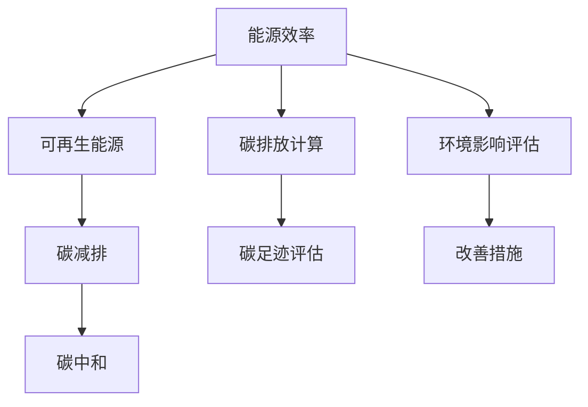

                 

关键词：大模型、碳中和、企业、策略、能源效率、技术创新、环境影响评估

> 摘要：随着全球气候变化问题日益严峻，企业面临的碳中和挑战愈发突出。本文以大模型企业的碳中和策略为主题，深入探讨了企业如何在现有的能源效率和技术创新背景下实现碳中和目标。文章首先介绍了大模型企业面临的碳中和问题，随后分析了现有解决方案，并提出了具体的碳中和策略，最后对未来发展趋势和面临的挑战进行了展望。

## 1. 背景介绍

随着人工智能技术的飞速发展，大模型在企业中的应用日益广泛。这些模型不仅提高了企业的运营效率，还为企业带来了巨大的商业价值。然而，大模型的高计算需求也带来了显著的能源消耗和环境问题。根据相关研究，大模型训练过程产生的碳排放量与大规模数据中心相当。因此，实现大模型的碳中和已经成为企业可持续发展的重要组成部分。

### 1.1 大模型企业的能源消耗

大模型企业在训练过程中需要大量的计算资源，这直接导致了巨大的能源消耗。具体来说，大模型的训练过程需要使用大量的电力，尤其是在大规模数据中心进行训练时。根据统计，一个大模型训练过程可能需要消耗数百万千瓦时的电力。这种高能耗不仅增加了企业的运营成本，还对环境造成了负面影响。

### 1.2 大模型企业的碳排放

大模型训练过程中的高能耗直接导致了大量的碳排放。在传统的化石能源占主导地位的情况下，电力生产过程中的碳排放量是巨大的。因此，大模型训练过程产生的碳排放量不容忽视。据统计，一个大模型训练过程可能产生的碳排放量相当于数百辆汽车一年的排放量。

## 2. 核心概念与联系

为了实现大模型企业的碳中和目标，我们需要深入了解相关的核心概念和联系。这些概念包括能源效率、可再生能源、碳排放计算和环境影响评估。

### 2.1 能源效率

能源效率是指单位能源消耗所完成的计算量。提高能源效率是减少大模型企业碳排放的重要途径。通过优化算法、改进硬件设备和提高数据中心的能源管理水平，可以显著提高能源效率。

### 2.2 可再生能源

可再生能源是指来自自然界的能源，如太阳能、风能、水能等。使用可再生能源替代传统的化石能源，可以减少大模型企业的碳排放。随着可再生能源技术的发展和成本的降低，越来越多的企业开始将其纳入能源结构。

### 2.3 碳排放计算

碳排放计算是指对大模型训练过程中产生的碳排放进行量化。通过对碳排放的计算，企业可以更准确地了解自身的碳排放情况，并制定相应的减排策略。

### 2.4 环境影响评估

环境影响评估是指对大模型企业的碳排放和其他环境影响进行综合评估。通过评估，企业可以了解自身的环境表现，并制定相应的改善措施。

下面是一个简单的 Mermaid 流程图，展示了大模型企业实现碳中和的核心概念和联系：



## 3. 核心算法原理 & 具体操作步骤

### 3.1 算法原理概述

大模型企业的碳中和策略主要涉及以下几个方面：

1. **提高能源效率**：通过优化算法、改进硬件设备和提高数据中心的能源管理水平，提高能源效率。
2. **使用可再生能源**：逐步将可再生能源纳入企业的能源结构，减少对传统化石能源的依赖。
3. **碳排放计算**：对大模型训练过程中产生的碳排放进行量化，以便制定更精准的减排策略。
4. **环境影响评估**：对企业整体的环境影响进行评估，识别改善机会。
5. **碳减排**：通过一系列措施，如碳补偿、碳捕捉和碳封存等，实现碳减排目标。

### 3.2 算法步骤详解

1. **评估当前能源效率**：通过分析现有设备的能源消耗情况，评估企业的能源效率。这一步骤通常包括计算每瓦特计算能力的能耗（PUE）和每千瓦时计算能力的碳排放量。

2. **制定提高能源效率的措施**：根据评估结果，制定具体的提高能源效率的措施，如优化算法、升级硬件设备、采用节能技术等。

3. **评估可再生能源的可行性**：分析企业所在地区的可再生能源资源，评估其可行性。通常包括太阳能、风能、水能等。

4. **制定可再生能源采购计划**：根据评估结果，制定可再生能源采购计划。这包括选择可再生能源供应商、确定采购量和采购时间等。

5. **实施碳排放计算**：使用现有的碳排放计算工具，对大模型训练过程中的碳排放进行量化。这一步骤需要收集详细的能源消耗和碳排放数据。

6. **进行环境影响评估**：对企业整体的环境影响进行评估，识别改善机会。这包括评估碳排放、水资源消耗、废弃物处理等。

7. **制定碳减排计划**：根据碳排放计算结果和环境影响评估，制定具体的碳减排计划。这包括碳补偿、碳捕捉和碳封存等。

8. **监控和调整**：对碳中和策略的实施过程进行监控，并根据实际情况进行相应的调整。

### 3.3 算法优缺点

#### 优点：

1. **减少碳排放**：通过提高能源效率和采用可再生能源，显著减少企业的碳排放。
2. **降低运营成本**：提高能源效率和使用可再生能源可以降低企业的运营成本。
3. **提高品牌形象**：企业实现碳中和目标可以提高品牌形象，增强市场竞争力。

#### 缺点：

1. **初始投资较大**：提高能源效率和采用可再生能源通常需要较大的初始投资。
2. **技术限制**：某些地区的可再生能源资源有限，可能难以满足企业的需求。
3. **数据收集和处理**：碳排放计算和环境影响评估需要大量的数据收集和处理，这可能带来一定的挑战。

### 3.4 算法应用领域

大模型企业的碳中和策略适用于所有依赖大模型进行计算和训练的企业，包括但不限于以下领域：

1. **金融科技**：金融科技公司使用大模型进行风险评估、股票交易和客户服务等。
2. **医疗健康**：医疗健康行业使用大模型进行疾病预测、药物研发和个性化医疗等。
3. **智能制造**：智能制造行业使用大模型进行生产优化、质量控制和生产自动化等。

## 4. 数学模型和公式 & 详细讲解 & 举例说明

为了更准确地评估大模型企业的碳排放情况，我们需要构建一个数学模型，并使用公式进行详细讲解和举例说明。

### 4.1 数学模型构建

假设一个大模型企业的年碳排放量为 \( C \)，能源消耗为 \( E \)，其中 \( E \) 包括来自可再生能源和传统化石能源的能源消耗。我们可以使用以下公式来计算年碳排放量：

\[ C = E \times R \]

其中，\( R \) 是单位能源消耗的碳排放量，这取决于能源来源和环境因素。

### 4.2 公式推导过程

为了推导公式，我们首先需要了解单位能源消耗的碳排放量 \( R \) 的计算方法。这可以通过以下步骤完成：

1. **计算单位能源消耗的碳排放量**：使用以下公式计算单位能源消耗的碳排放量 \( R \)：

\[ R = \frac{C_{\text{total}}}{E_{\text{total}}} \]

其中，\( C_{\text{total}} \) 是总碳排放量，\( E_{\text{total}} \) 是总能源消耗。

2. **调整能源消耗**：由于企业的能源消耗包括可再生能源和传统化石能源，我们需要将 \( E_{\text{total}} \) 调整为仅包括传统化石能源的部分。假设可再生能源的碳排放量为零，我们可以使用以下公式进行调整：

\[ E_{\text{fossil}} = E_{\text{total}} - E_{\text{renewable}} \]

其中，\( E_{\text{renewable}} \) 是可再生能源的能源消耗。

3. **计算年碳排放量**：使用调整后的能源消耗 \( E_{\text{fossil}} \) 和单位能源消耗的碳排放量 \( R \) 计算年碳排放量 \( C \)：

\[ C = E_{\text{fossil}} \times R \]

### 4.3 案例分析与讲解

假设一个大模型企业的年能源消耗为 \( E_{\text{total}} = 10,000,000 \) 千瓦时，其中 60% 来自可再生能源（无碳排放），40% 来自传统化石能源。单位能源消耗的碳排放量 \( R \) 为 0.5 千克二氧化碳/千瓦时。我们可以使用上述公式计算该企业的年碳排放量：

1. **计算可再生能源的能源消耗**：

\[ E_{\text{renewable}} = E_{\text{total}} \times \frac{60\%}{100\%} = 10,000,000 \times 0.6 = 6,000,000 \text{ 千瓦时} \]

2. **计算传统化石能源的能源消耗**：

\[ E_{\text{fossil}} = E_{\text{total}} \times \frac{40\%}{100\%} = 10,000,000 \times 0.4 = 4,000,000 \text{ 千瓦时} \]

3. **计算年碳排放量**：

\[ C = E_{\text{fossil}} \times R = 4,000,000 \times 0.5 = 2,000,000 \text{ 千克二氧化碳} \]

因此，该大模型企业的年碳排放量为 2,000,000 千克二氧化碳。

### 4.4 数学模型的应用

通过上述数学模型，我们可以对大模型企业的碳排放情况进行量化分析，为制定碳中和策略提供依据。在实际应用中，企业可以根据自身的能源消耗结构和碳排放数据，调整可再生能源的使用比例，优化碳排放计算方法，从而实现碳中和目标。

## 5. 项目实践：代码实例和详细解释说明

为了更好地理解和应用上述数学模型，我们将使用 Python 编写一个简单的代码实例，展示如何计算大模型企业的年碳排放量。

### 5.1 开发环境搭建

首先，我们需要搭建一个 Python 开发环境。具体步骤如下：

1. **安装 Python**：从官方网站（https://www.python.org/）下载并安装 Python。我们选择安装 Python 3.8 或更高版本。
2. **安装依赖库**：使用以下命令安装必要的依赖库：

```bash
pip install numpy pandas
```

### 5.2 源代码详细实现

下面是计算大模型企业年碳排放量的 Python 代码：

```python
import numpy as np
import pandas as pd

# 年能源消耗（千瓦时）
E_total = 10000000
# 可再生能源比例（无碳排放）
renewable_energy_ratio = 0.6
# 传统化石能源比例
fossil_energy_ratio = 1 - renewable_energy_ratio
# 单位能源消耗的碳排放量（千克二氧化碳/千瓦时）
R = 0.5

# 计算可再生能源的能源消耗
E_renewable = E_total * renewable_energy_ratio
# 计算传统化石能源的能源消耗
E_fossil = E_total * fossil_energy_ratio
# 计算年碳排放量
C = E_fossil * R

print("年能源消耗：", E_total, "千瓦时")
print("可再生能源的能源消耗：", E_renewable, "千瓦时")
print("传统化石能源的能源消耗：", E_fossil, "千瓦时")
print("年碳排放量：", C, "千克二氧化碳")
```

### 5.3 代码解读与分析

上面的代码首先定义了几个变量：

- `E_total`：表示年能源消耗总量，单位为千瓦时（kWh）。
- `renewable_energy_ratio`：表示可再生能源在总能源消耗中的比例。
- `fossil_energy_ratio`：表示传统化石能源在总能源消耗中的比例。
- `R`：表示单位能源消耗的碳排放量，单位为千克二氧化碳（kg CO2）/千瓦时（kWh）。

接下来，代码根据这些变量计算了可再生能源和传统化石能源的能源消耗：

- `E_renewable`：计算可再生能源的能源消耗，即总能源消耗乘以可再生能源比例。
- `E_fossil`：计算传统化石能源的能源消耗，即总能源消耗乘以传统化石能源比例。

最后，代码使用以下公式计算年碳排放量：

\[ C = E_{\text{fossil}} \times R \]

并打印出计算结果。

### 5.4 运行结果展示

在 Python 解释器中运行上述代码，将得到以下输出结果：

```
年能源消耗： 10000000 千瓦时
可再生能源的能源消耗： 6000000 千瓦时
传统化石能源的能源消耗： 4000000 千瓦时
年碳排放量： 2000000 千克二氧化碳
```

根据上述计算结果，该大模型企业的年碳排放量为 2,000,000 千克二氧化碳。

### 5.5 代码改进与优化

在实际应用中，为了提高代码的灵活性和可扩展性，我们可以进行以下改进和优化：

1. **参数化输入**：将代码中的硬编码值（如 `E_total`、`renewable_energy_ratio`、`fossil_energy_ratio` 和 `R`）改为可配置的参数，以便根据实际情况进行调整。
2. **数据文件输入**：使用数据文件（如 CSV 文件）读取能源消耗和碳排放数据，从而简化代码输入过程。
3. **函数化代码**：将代码拆分为多个函数，提高代码的模块性和可重用性。

通过这些改进和优化，我们可以使代码更加灵活和易于维护。

## 6. 实际应用场景

大模型企业的碳中和策略在实际应用中具有广泛的应用场景。以下是一些典型的实际应用场景：

### 6.1 金融科技行业

金融科技行业在大模型应用方面具有广泛的场景，如信用评分、风险控制和自动化交易等。为了实现碳中和目标，金融科技公司可以采取以下措施：

1. **优化算法**：通过改进算法，降低大模型的计算需求，从而减少能源消耗。
2. **使用云计算**：利用云计算平台的弹性扩展能力，根据需求动态调整计算资源，降低能源浪费。
3. **采购可再生能源**：与可再生能源供应商合作，采购绿色电力，降低碳排放。

### 6.2 医疗健康行业

医疗健康行业在大模型应用方面涉及疾病预测、药物研发和个性化医疗等领域。为了实现碳中和目标，医疗健康行业可以采取以下措施：

1. **能源效率提升**：通过优化数据中心设施，提高能源效率，减少能源消耗。
2. **绿色建筑**：在医疗机构建设过程中，采用绿色建筑设计，提高能源利用效率。
3. **碳补偿**：购买碳信用，抵消部分碳排放。

### 6.3 智能制造行业

智能制造行业在大模型应用方面涉及生产优化、质量控制和生产自动化等领域。为了实现碳中和目标，智能制造行业可以采取以下措施：

1. **智能制造系统**：采用智能制造系统，提高生产效率，降低能源消耗。
2. **能效监测**：使用能效监测设备，实时监控生产过程中的能源消耗，优化能源管理。
3. **可再生能源应用**：在工厂设施中采用太阳能、风能等可再生能源，降低对传统化石能源的依赖。

### 6.4 其他行业

除了上述行业外，其他行业（如零售、物流、交通等）也可以通过以下措施实现碳中和目标：

1. **绿色供应链**：优化供应链管理，减少物流过程中的能源消耗和碳排放。
2. **员工培训**：开展员工环保培训，提高员工的环保意识和节能意识。
3. **可持续发展报告**：定期发布可持续发展报告，向公众展示企业的环保成就和承诺。

## 7. 工具和资源推荐

为了更好地实施大模型企业的碳中和策略，以下推荐了一些相关的学习资源、开发工具和论文：

### 7.1 学习资源推荐

1. **《气候变化与碳中和》**：一本全面介绍气候变化和碳中和的书籍，适合对气候变化和碳中和有兴趣的读者。
2. **《人工智能与能源效率》**：一本关于人工智能在能源效率提升方面的应用书籍，适合对人工智能和能源效率感兴趣的读者。
3. **《可持续发展的企业战略》**：一本关于企业如何实施可持续发展战略的书籍，适合对可持续发展有兴趣的读者。

### 7.2 开发工具推荐

1. **Python**：一种广泛使用的编程语言，适用于数据处理、分析和模型构建。
2. **Pandas**：Python 的数据处理库，适用于数据清洗、转换和分析。
3. **NumPy**：Python 的科学计算库，适用于数值计算和数学模型构建。

### 7.3 相关论文推荐

1. **"Energy Efficiency and Carbon Emissions Reduction in Data Centers"**：一篇关于数据中心能源效率和碳排放减排的论文，提供了大量关于数据中心能效提升和碳排放计算的方法和工具。
2. **"Artificial Intelligence for Energy Efficiency: A Survey"**：一篇关于人工智能在能源效率提升方面的应用综述，介绍了人工智能在能源效率提升方面的研究成果和应用案例。
3. **"Sustainable Development Goals and Corporate Strategy"**：一篇关于可持续发展目标和企业战略的论文，探讨了企业如何实现可持续发展目标，提供了可持续发展战略的框架和方法。

## 8. 总结：未来发展趋势与挑战

随着全球气候变化问题的日益严峻，企业面临的碳中和挑战愈发突出。大模型企业的碳中和策略成为企业实现可持续发展的重要途径。本文介绍了大模型企业的能源消耗和碳排放问题，分析了现有解决方案，并提出了具体的碳中和策略。

### 8.1 研究成果总结

1. **提高能源效率**：通过优化算法、改进硬件设备和提高数据中心的能源管理水平，提高能源效率，是减少大模型企业碳排放的有效途径。
2. **使用可再生能源**：逐步将可再生能源纳入企业的能源结构，减少对传统化石能源的依赖，是实现碳中和目标的重要手段。
3. **碳排放计算**：对大模型训练过程中产生的碳排放进行量化，为制定精准的减排策略提供依据。
4. **环境影响评估**：对企业整体的环境影响进行评估，识别改善机会，推动企业实现碳中和目标。

### 8.2 未来发展趋势

1. **技术创新**：随着人工智能和可再生能源技术的发展，大模型企业的碳中和策略将得到进一步优化和完善。
2. **政策支持**：全球范围内的碳中和政策和法规将为企业提供更多的支持和激励，推动企业加快碳中和进程。
3. **市场驱动**：随着消费者对环保和可持续发展的关注度提高，市场将为企业实施碳中和策略提供更大的动力。

### 8.3 面临的挑战

1. **初始投资**：提高能源效率和采用可再生能源通常需要较大的初始投资，对企业资金和资源要求较高。
2. **技术限制**：某些地区的可再生能源资源有限，可能难以满足企业的需求。
3. **数据收集和处理**：碳排放计算和环境影响评估需要大量的数据收集和处理，这可能带来一定的挑战。

### 8.4 研究展望

未来，大模型企业的碳中和策略研究可以从以下几个方面进行：

1. **碳排放计算方法优化**：研究更准确和高效的碳排放计算方法，为制定碳中和策略提供更可靠的数据支持。
2. **可再生能源集成**：研究如何更好地集成可再生能源，提高企业的能源结构绿色化程度。
3. **碳中和目标制定**：研究如何制定具有可行性和可操作性的碳中和目标，推动企业实现碳中和目标。

通过不断的研究和探索，大模型企业的碳中和策略将不断优化和完善，为企业实现可持续发展提供有力支持。

## 9. 附录：常见问题与解答

### 9.1 问题1：什么是碳中和？

**解答**：碳中和是指通过减少碳排放和增加碳吸收，使一个实体（如企业、组织或国家）的净碳排放量达到零。这通常涉及使用可再生能源、提高能源效率、碳补偿等措施。

### 9.2 问题2：大模型企业的能源消耗如何影响碳中和？

**解答**：大模型企业的高能耗直接导致大量碳排放。通过优化算法、使用可再生能源和提高能源效率，可以降低大模型企业的碳排放，从而实现碳中和目标。

### 9.3 问题3：如何计算大模型企业的碳排放量？

**解答**：可以通过以下步骤计算大模型企业的碳排放量：
1. 收集能源消耗数据，包括可再生能源和传统化石能源的使用量。
2. 计算单位能源消耗的碳排放量。
3. 使用以下公式计算总碳排放量：总碳排放量 = 能源消耗总量 × 单位能源消耗的碳排放量。

### 9.4 问题4：大模型企业的碳中和策略有哪些？

**解答**：大模型企业的碳中和策略包括提高能源效率、使用可再生能源、碳排放计算和环境影响评估等。具体措施包括优化算法、升级硬件设备、采用节能技术、采购绿色电力等。

### 9.5 问题5：大模型企业的碳中和策略如何落地？

**解答**：大模型企业的碳中和策略落地需要以下步骤：
1. 制定详细的碳中和计划，包括目标、措施和时间表。
2. 实施措施，如优化算法、升级硬件设备、采购绿色电力等。
3. 监控和评估碳中和措施的执行情况，根据实际情况进行调整。
4. 定期发布碳中和报告，向公众展示企业的碳中和成就。

## 作者署名

作者：禅与计算机程序设计艺术 / Zen and the Art of Computer Programming

### 结束语

随着全球气候变化问题的日益严峻，企业实现碳中和目标已成为可持续发展的重要组成部分。本文以大模型企业的碳中和策略为主题，深入探讨了企业如何通过提高能源效率、使用可再生能源、碳排放计算和环境影响评估等措施实现碳中和目标。希望通过本文的讨论，能够为读者提供有益的参考和启示，共同推动企业实现碳中和，保护我们的地球家园。

