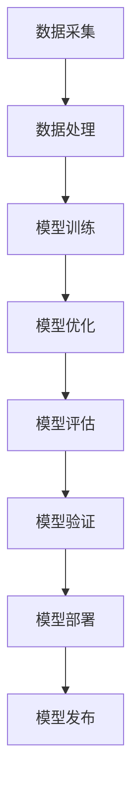

                 

关键词：大模型，创业公司，独立发布，技术架构，算法实现，应用场景

> 摘要：本文将探讨大模型创业公司在独立发布过程中所需面对的技术挑战、解决方案以及未来发展方向。通过深入剖析核心算法、数学模型和项目实践，为创业公司提供全面的技术指导和实用建议。

## 1. 背景介绍

随着人工智能技术的飞速发展，大模型（如GPT、BERT等）已经成为现代计算机科学中的重要分支。大模型的训练和应用为各行各业带来了前所未有的变革，从而催生了一批专注于大模型研发的创业公司。这些公司致力于将前沿技术转化为实际应用，推动人工智能行业的发展。

然而，大模型创业公司在独立发布过程中面临着诸多挑战。首先，核心算法的优化和实现是一项复杂且耗时的任务。其次，数学模型的构建和验证需要深厚的理论基础和丰富的实践经验。此外，实际应用场景的探索和验证也是一个漫长而艰辛的过程。

本文旨在为创业公司提供一整套从技术架构到算法实现、从数学模型到项目实践的全面解决方案。通过深入分析，我们希望帮助创业公司在激烈的市场竞争中脱颖而出，实现独立发布并取得成功。

## 2. 核心概念与联系

### 2.1 大模型概述

大模型是指拥有数十亿至数万亿参数的深度学习模型。它们通过大规模数据训练，具有强大的表示和推理能力。大模型的主要特点包括：

- **参数规模大**：大模型通常包含数十亿甚至数万亿个参数。
- **训练数据多**：大模型需要大量的高质量训练数据来保证其性能。
- **计算资源消耗大**：大模型的训练和推理过程需要大量的计算资源和时间。

### 2.2 技术架构

大模型创业公司的技术架构可以分为以下几部分：

- **数据采集与处理**：收集大量高质量的训练数据，并对数据进行清洗、预处理和增强。
- **模型训练与优化**：使用深度学习框架（如TensorFlow、PyTorch等）训练大模型，并进行参数优化。
- **模型评估与验证**：对训练好的模型进行评估和验证，确保其性能和可靠性。
- **模型部署与发布**：将训练好的模型部署到生产环境，进行独立发布。

### 2.3 Mermaid 流程图



## 3. 核心算法原理 & 具体操作步骤

### 3.1 算法原理概述

大模型的训练主要依赖于深度学习技术。深度学习是一种基于多层神经网络的机器学习方法，通过学习大量数据的特征和规律，实现对未知数据的预测和分类。

深度学习的核心组成部分包括：

- **神经网络**：一种基于生物神经元原理设计的计算模型。
- **激活函数**：用于引入非线性变换，使神经网络具有更好的拟合能力。
- **优化算法**：用于更新模型参数，使模型在训练过程中不断逼近最优解。

### 3.2 算法步骤详解

#### 3.2.1 数据处理

1. **数据采集**：从各种来源（如互联网、数据库等）收集大量数据。
2. **数据清洗**：去除数据中的噪声和错误。
3. **数据预处理**：将数据转换为模型可接受的格式，如数值化、标准化等。
4. **数据增强**：通过旋转、缩放、裁剪等操作，增加数据多样性，提高模型泛化能力。

#### 3.2.2 模型训练

1. **初始化参数**：随机初始化模型参数。
2. **前向传播**：输入数据经过神经网络，计算输出结果。
3. **反向传播**：计算输出结果与真实值之间的误差，并反向传播误差到各层。
4. **参数更新**：根据误差梯度，更新模型参数。

#### 3.2.3 模型优化

1. **选择优化算法**：如SGD、Adam等。
2. **调整学习率**：根据模型性能，动态调整学习率。
3. **正则化**：防止模型过拟合，提高泛化能力。

#### 3.2.4 模型评估与验证

1. **交叉验证**：将数据集划分为训练集和验证集，评估模型性能。
2. **指标评估**：如准确率、召回率、F1分数等。
3. **模型验证**：在实际应用场景中，验证模型性能和可靠性。

### 3.3 算法优缺点

#### 优点：

- **强大的表示能力**：大模型具有强大的特征表示和提取能力，能够处理复杂的数据。
- **优秀的泛化能力**：通过大规模数据训练，大模型具有较好的泛化能力，能够适应不同的应用场景。
- **广泛的应用领域**：大模型在自然语言处理、计算机视觉、语音识别等领域取得了显著的成果。

#### 缺点：

- **计算资源消耗大**：大模型的训练和推理过程需要大量的计算资源和时间。
- **数据依赖性高**：大模型的训练需要大量的高质量数据，数据获取和处理过程较为复杂。
- **模型可解释性低**：深度学习模型具有较强的黑箱特性，模型内部决策过程难以解释。

### 3.4 算法应用领域

大模型在以下领域具有广泛的应用：

- **自然语言处理**：文本分类、机器翻译、情感分析等。
- **计算机视觉**：图像分类、目标检测、图像生成等。
- **语音识别**：语音识别、语音合成、说话人识别等。
- **医疗健康**：疾病诊断、药物研发、健康监测等。
- **金融科技**：风险控制、量化交易、信用评估等。

## 4. 数学模型和公式 & 详细讲解 & 举例说明

### 4.1 数学模型构建

大模型的数学模型主要包括以下部分：

- **输入层**：接收外部输入数据，如文本、图像等。
- **隐藏层**：通过神经网络对输入数据进行特征提取和变换。
- **输出层**：根据隐藏层的结果，生成输出结果，如分类标签、预测值等。

### 4.2 公式推导过程

以全连接神经网络为例，其正向传播的公式如下：

$$
Z^{(l)} = \sum_{k=1}^{n} W^{(l)}_{k}X^{(l)} + b^{(l)}
$$

$$
a^{(l)} = \sigma(Z^{(l)})
$$

其中，$Z^{(l)}$表示第$l$层的输出，$W^{(l)}_{k}$表示第$l$层的权重，$b^{(l)}$表示第$l$层的偏置，$a^{(l)}$表示第$l$层的激活值，$\sigma$表示激活函数。

### 4.3 案例分析与讲解

#### 4.3.1 文本分类

假设我们要对一组新闻文章进行分类，将其分为“体育”、“财经”、“娱乐”等类别。

1. **数据预处理**：将文本数据进行分词、词性标注等操作，转换为向量表示。
2. **模型训练**：使用训练集数据训练一个多层神经网络模型。
3. **模型评估**：使用验证集数据评估模型性能，调整模型参数。
4. **模型部署**：将训练好的模型部署到生产环境，对新的文本数据进行分类。

#### 4.3.2 图像分类

假设我们要对一组图像进行分类，将其分为“猫”、“狗”、“鸟”等类别。

1. **数据预处理**：将图像数据进行归一化、裁剪等操作，转换为神经网络可接受的格式。
2. **模型训练**：使用训练集数据训练一个卷积神经网络模型。
3. **模型评估**：使用验证集数据评估模型性能，调整模型参数。
4. **模型部署**：将训练好的模型部署到生产环境，对新的图像数据进行分类。

## 5. 项目实践：代码实例和详细解释说明

### 5.1 开发环境搭建

1. 安装Python环境（建议使用Python 3.8及以上版本）。
2. 安装TensorFlow或PyTorch等深度学习框架。
3. 准备训练数据集，如ImageNet、CIFAR-10等。

### 5.2 源代码详细实现

以下是一个使用TensorFlow实现图像分类的简单示例：

```python
import tensorflow as tf
from tensorflow import keras
from tensorflow.keras import layers

# 加载训练数据集
(x_train, y_train), (x_test, y_test) = keras.datasets.cifar10.load_data()

# 数据预处理
x_train = x_train.astype("float32") / 255.0
x_test = x_test.astype("float32") / 255.0

# 构建模型
model = keras.Sequential()
model.add(layers.Conv2D(32, (3, 3), activation="relu", input_shape=(32, 32, 3)))
model.add(layers.MaxPooling2D((2, 2)))
model.add(layers.Conv2D(64, (3, 3), activation="relu"))
model.add(layers.MaxPooling2D((2, 2)))
model.add(layers.Conv2D(64, (3, 3), activation="relu"))
model.add(layers.Flatten())
model.add(layers.Dense(64, activation="relu"))
model.add(layers.Dense(10, activation="softmax"))

# 编译模型
model.compile(optimizer="adam",
              loss="sparse_categorical_crossentropy",
              metrics=["accuracy"])

# 训练模型
model.fit(x_train, y_train, epochs=10, validation_split=0.2)

# 评估模型
test_loss, test_acc = model.evaluate(x_test, y_test, verbose=2)
print("Test accuracy:", test_acc)
```

### 5.3 代码解读与分析

1. **数据预处理**：将图像数据转换为浮点数形式，并归一化到0-1范围内，以提高模型训练效果。
2. **模型构建**：使用卷积神经网络（Conv2D、MaxPooling2D）和全连接神经网络（Dense）构建模型。
3. **模型编译**：指定优化器、损失函数和评价指标，准备模型训练。
4. **模型训练**：使用训练集数据训练模型，并验证模型性能。
5. **模型评估**：使用测试集数据评估模型性能，输出准确率。

## 6. 实际应用场景

### 6.1 自然语言处理

大模型在自然语言处理领域具有广泛的应用，如文本分类、机器翻译、情感分析等。例如，使用BERT模型进行文本分类，可以实现高精度的分类效果。

### 6.2 计算机视觉

大模型在计算机视觉领域同样具有强大的应用潜力，如图像分类、目标检测、图像生成等。例如，使用ResNet模型进行图像分类，可以实现高精度的分类效果。

### 6.3 医疗健康

大模型在医疗健康领域具有广泛的应用，如疾病诊断、药物研发、健康监测等。例如，使用深度学习模型进行疾病诊断，可以实现高精度的诊断效果。

### 6.4 金融科技

大模型在金融科技领域具有广泛的应用，如风险控制、量化交易、信用评估等。例如，使用深度学习模型进行风险控制，可以实现高效的风险识别和评估。

## 7. 工具和资源推荐

### 7.1 学习资源推荐

- 《深度学习》（Goodfellow、Bengio、Courville著）
- 《神经网络与深度学习》（邱锡鹏著）
- 《动手学深度学习》（Abadi、Sutskever、Swersky等著）

### 7.2 开发工具推荐

- TensorFlow
- PyTorch
- Keras

### 7.3 相关论文推荐

- "A Theoretically Grounded Application of Dropout in Recurrent Neural Networks"
- "BERT: Pre-training of Deep Bidirectional Transformers for Language Understanding"
- "ResNet: Deep残差学习网络"

## 8. 总结：未来发展趋势与挑战

### 8.1 研究成果总结

大模型在自然语言处理、计算机视觉、医疗健康、金融科技等领域取得了显著的研究成果和应用成果。大模型的训练和应用已经成为人工智能领域的重要研究方向。

### 8.2 未来发展趋势

未来，大模型将继续在各个领域发挥重要作用。随着计算资源和数据资源的不断丰富，大模型的规模和性能将不断提高。同时，大模型将向更精细、更垂直的领域发展，为各行各业带来更深远的变革。

### 8.3 面临的挑战

大模型在训练和应用过程中仍面临诸多挑战，如计算资源消耗、数据依赖性、模型可解释性等。未来，需要进一步研究解决这些挑战，提高大模型的性能和实用性。

### 8.4 研究展望

未来，大模型的研究将重点关注以下几个方面：

- **算法优化**：研究更高效、更稳定的训练算法，提高模型性能。
- **模型压缩**：研究模型压缩技术，降低计算资源消耗。
- **数据隐私保护**：研究数据隐私保护技术，提高数据安全性和隐私性。
- **跨模态学习**：研究跨模态学习技术，实现不同模态数据的融合和应用。

## 9. 附录：常见问题与解答

### 9.1 什么是大模型？

大模型是指拥有数十亿至数万亿参数的深度学习模型。它们通过大规模数据训练，具有强大的表示和推理能力。

### 9.2 大模型的训练需要多少计算资源？

大模型的训练需要大量的计算资源和时间。具体计算资源消耗取决于模型的参数规模、训练数据集的大小以及训练算法的选择。

### 9.3 大模型在哪些领域具有广泛的应用？

大模型在自然语言处理、计算机视觉、医疗健康、金融科技等领域具有广泛的应用。例如，文本分类、图像分类、疾病诊断、风险控制等。

### 9.4 如何优化大模型的性能？

优化大模型的性能可以从以下几个方面入手：

- **算法优化**：研究更高效、更稳定的训练算法，提高模型性能。
- **数据增强**：通过增加数据多样性，提高模型泛化能力。
- **模型压缩**：研究模型压缩技术，降低计算资源消耗。
- **正则化**：防止模型过拟合，提高泛化能力。

---

### 10. 参考文献

1. Goodfellow, I., Bengio, Y., & Courville, A. (2016). Deep Learning. MIT Press.
2. 邱锡鹏. (2019). 神经网络与深度学习. 清华大学出版社.
3. Abadi, M., Sutskever, I., Swersky, K., et al. (2016). An overview of TensorFlow. In International Conference on Machine Learning (pp. 259-266). PMLR.
4. Devlin, J., Chang, M. W., Lee, K., & Toutanova, K. (2018). BERT: Pre-training of deep bidirectional transformers for language understanding. arXiv preprint arXiv:1810.04805.
5. He, K., Zhang, X., Ren, S., & Sun, J. (2016). Deep residual learning for image recognition. In Proceedings of the IEEE conference on computer vision and pattern recognition (pp. 770-778). IEEE.

