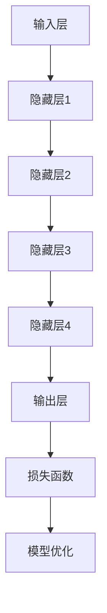

                 

关键词：大模型、AI创业公司、产品开发、关键作用、算法原理、数学模型、项目实践、应用场景、未来展望

摘要：随着人工智能技术的快速发展，大模型已经成为 AI 创业公司产品开发的重要支撑。本文将从背景介绍、核心概念与联系、核心算法原理、数学模型和公式、项目实践以及实际应用场景等方面，深入探讨大模型在 AI 创业公司产品开发中的关键作用，为创业者提供有价值的参考。

## 1. 背景介绍

在过去的几十年中，人工智能技术的发展经历了多个阶段，从最初的符号推理、专家系统，到基于统计学习的机器学习，再到当前基于深度学习的模型，如 GPT、BERT 等。这些模型在图像识别、自然语言处理、语音识别等领域取得了显著的成果，极大地推动了人工智能技术的进步。

大模型，即具有大规模参数和高计算需求的模型，是近年来人工智能领域的一个重要发展趋势。随着计算能力和数据资源的不断提升，大模型在各个领域都展现出了强大的潜力。然而，大模型在 AI 创业公司产品开发中的具体应用仍存在许多挑战，如如何高效地训练、优化和部署大模型，如何处理大模型的计算资源需求，以及如何确保大模型在实际应用中的稳定性和可靠性等。

本文旨在探讨大模型在 AI 创业公司产品开发中的关键作用，从核心概念、算法原理、数学模型、项目实践和实际应用场景等方面，全面分析大模型的优势和挑战，为创业者提供有益的启示。

## 2. 核心概念与联系

### 2.1 大模型定义与分类

大模型是指具有大规模参数和高计算需求的模型，主要包括以下几种类型：

1. **深度神经网络（DNN）**：由多个隐藏层组成的神经网络，具有强大的表征能力，广泛应用于计算机视觉、自然语言处理等领域。
2. **生成对抗网络（GAN）**：通过生成器和判别器之间的对抗训练，实现数据的生成和分布学习，广泛应用于图像生成、风格迁移等领域。
3. **变分自编码器（VAE）**：通过编码器和解码器之间的变分推断，实现数据的生成和分布学习，广泛应用于图像生成、数据去噪等领域。
4. **图神经网络（GNN）**：基于图结构进行学习和推理的神经网络，广泛应用于社交网络分析、推荐系统等领域。

### 2.2 大模型原理与架构

大模型的基本原理是基于深度学习的多层神经网络结构，通过在多个隐藏层之间传递信息，实现对输入数据的层次化表征和抽象。大模型的架构主要包括以下几个部分：

1. **输入层**：接收外部输入数据，如图像、文本、语音等。
2. **隐藏层**：对输入数据进行处理，提取特征信息和抽象表示。
3. **输出层**：将隐藏层输出的特征信息映射到预测结果或决策。
4. **损失函数**：衡量模型输出与真实标签之间的差距，用于指导模型优化。

### 2.3 大模型与其他技术的联系

大模型在人工智能领域的广泛应用，离不开其他技术的支持，如：

1. **计算资源**：高性能计算平台和分布式计算框架，如 GPU、TPU、TensorFlow、PyTorch 等，为大规模模型的训练和推理提供强大的计算支持。
2. **数据资源**：大规模、高质量的数据集，如 ImageNet、COCO、WikiText-2 等，为模型训练提供丰富的数据基础。
3. **优化方法**：如梯度下降、随机梯度下降、Adam 等优化算法，用于加速模型训练和收敛。
4. **调优技巧**：如超参数调优、正则化、dropout 等，用于提高模型性能和泛化能力。

下面给出大模型原理与架构的 Mermaid 流程图：



## 3. 核心算法原理 & 具体操作步骤

### 3.1 算法原理概述

大模型的算法原理主要基于深度学习，通过多层神经网络结构对输入数据进行特征提取和抽象表示。具体来说，大模型通过以下步骤进行操作：

1. **数据预处理**：对输入数据进行清洗、归一化等处理，使其满足模型训练的需求。
2. **模型构建**：根据任务需求，构建合适的神经网络结构，包括输入层、隐藏层和输出层。
3. **模型训练**：通过反向传播算法，根据训练数据和损失函数，不断更新模型参数，优化模型性能。
4. **模型评估**：使用验证集或测试集评估模型性能，如准确率、召回率、F1 分数等。
5. **模型部署**：将训练好的模型部署到实际应用场景中，进行推理和预测。

### 3.2 算法步骤详解

1. **数据预处理**：

   ```python
   # 读取数据集
   train_data = pd.read_csv('train_data.csv')
   test_data = pd.read_csv('test_data.csv')
   
   # 数据清洗
   train_data = preprocess_data(train_data)
   test_data = preprocess_data(test_data)
   
   # 数据归一化
   train_data = normalize_data(train_data)
   test_data = normalize_data(test_data)
   ```

2. **模型构建**：

   ```python
   # 导入深度学习框架
   import tensorflow as tf
   
   # 定义模型结构
   model = tf.keras.Sequential([
       tf.keras.layers.Dense(units=64, activation='relu', input_shape=(input_shape,)),
       tf.keras.layers.Dense(units=64, activation='relu'),
       tf.keras.layers.Dense(units=num_classes, activation='softmax')
   ])
   ```

3. **模型训练**：

   ```python
   # 编写训练过程
   epochs = 10
   batch_size = 32
   model.compile(optimizer='adam', loss='categorical_crossentropy', metrics=['accuracy'])
   history = model.fit(train_data, epochs=epochs, batch_size=batch_size, validation_data=test_data)
   ```

4. **模型评估**：

   ```python
   # 评估模型性能
   scores = model.evaluate(test_data, verbose=2)
   print(f"Test accuracy: {scores[1] * 100:.2f}%")
   ```

5. **模型部署**：

   ```python
   # 部署模型进行推理
   predictions = model.predict(test_data)
   # 根据预测结果进行决策或分类
   ```

### 3.3 算法优缺点

**优点**：

1. **强大的表征能力**：大模型具有多层神经网络结构，可以提取输入数据的复杂特征，实现高效的特征表示。
2. **泛化能力**：通过大量的训练数据和迭代优化，大模型具有较强的泛化能力，可以在不同场景下表现良好。
3. **适应性**：大模型可以根据不同的任务需求，调整网络结构和超参数，适应不同的应用场景。

**缺点**：

1. **计算资源需求大**：大模型需要大量的计算资源进行训练和推理，对硬件设备要求较高。
2. **数据需求大**：大模型需要大量的高质量数据进行训练，数据获取和处理成本较高。
3. **过拟合风险**：大模型容易出现过拟合现象，需要合理设置正则化策略和调优技巧。

### 3.4 算法应用领域

大模型在多个领域都有广泛应用，如：

1. **计算机视觉**：图像识别、目标检测、图像生成等。
2. **自然语言处理**：文本分类、机器翻译、文本生成等。
3. **语音识别**：语音识别、语音合成、语音转换等。
4. **推荐系统**：用户画像、推荐算法、广告投放等。

## 4. 数学模型和公式 & 详细讲解 & 举例说明

### 4.1 数学模型构建

大模型的数学模型主要基于深度学习的多层神经网络结构，包括输入层、隐藏层和输出层。下面分别介绍各层的数学模型和公式。

#### 输入层

输入层接收外部输入数据，如图像、文本、语音等。假设输入数据的维度为 \(D\)，输入层可以表示为：

\[ x_i = \text{输入数据} \in \mathbb{R}^D \]

#### 隐藏层

隐藏层对输入数据进行处理，提取特征信息和抽象表示。假设隐藏层有 \(L\) 个神经元，每个神经元的状态可以表示为：

\[ h_{ij} = \text{激活函数}(W_{ij} \cdot x_i + b_j) \]

其中，\(W_{ij}\) 是权重矩阵，\(b_j\) 是偏置项，\(\text{激活函数}\) 是非线性函数，常用的有 ReLU、Sigmoid、Tanh 等。

#### 输出层

输出层将隐藏层输出的特征信息映射到预测结果或决策。假设输出层有 \(K\) 个神经元，每个神经元的状态可以表示为：

\[ y_k = \text{激活函数}(W_{k} \cdot h_{L} + b_k) \]

其中，\(W_{k}\) 是权重矩阵，\(b_k\) 是偏置项，\(\text{激活函数}\) 是非线性函数，常用的有 Softmax、Sigmoid 等。

#### 损失函数

损失函数用于衡量模型输出与真实标签之间的差距，常用的损失函数有：

1. **均方误差（MSE）**：

   \[ \text{MSE} = \frac{1}{n} \sum_{i=1}^{n} (y_i - \hat{y}_i)^2 \]

   其中，\(y_i\) 是真实标签，\(\hat{y}_i\) 是模型预测结果。

2. **交叉熵（Cross-Entropy）**：

   \[ \text{CE} = -\frac{1}{n} \sum_{i=1}^{n} y_i \log(\hat{y}_i) \]

   其中，\(y_i\) 是真实标签，\(\hat{y}_i\) 是模型预测结果。

### 4.2 公式推导过程

以均方误差（MSE）为例，介绍公式推导过程。

1. **损失函数定义**：

   \[ \text{MSE} = \frac{1}{n} \sum_{i=1}^{n} (y_i - \hat{y}_i)^2 \]

2. **求导**：

   对损失函数关于模型参数求导，得到：

   \[ \frac{\partial \text{MSE}}{\partial W} = 2 \cdot \frac{1}{n} \sum_{i=1}^{n} (\hat{y}_i - y_i) \cdot x_i \]

   \[ \frac{\partial \text{MSE}}{\partial b} = 2 \cdot \frac{1}{n} \sum_{i=1}^{n} (\hat{y}_i - y_i) \]

3. **梯度下降**：

   根据求导结果，采用梯度下降算法更新模型参数：

   \[ W \leftarrow W - \alpha \cdot \frac{\partial \text{MSE}}{\partial W} \]
   \[ b \leftarrow b - \alpha \cdot \frac{\partial \text{MSE}}{\partial b} \]

   其中，\(\alpha\) 是学习率。

### 4.3 案例分析与讲解

以计算机视觉领域中的卷积神经网络（CNN）为例，介绍大模型在图像识别任务中的具体应用。

#### 数据集

选择 ImageNet 数据集，该数据集包含 1000 个类别，共计 1.2 万张图像。

#### 模型结构

构建一个具有 5 个卷积层、2 个全连接层的 CNN 模型，其中卷积层采用 3x3 卷积核，全连接层采用 1024 个神经元。

#### 模型训练

使用 TensorFlow 框架，通过梯度下降算法对模型进行训练，训练过程如下：

```python
import tensorflow as tf

# 定义模型结构
model = tf.keras.Sequential([
    tf.keras.layers.Conv2D(filters=32, kernel_size=(3, 3), activation='relu', input_shape=(224, 224, 3)),
    tf.keras.layers.MaxPooling2D(pool_size=(2, 2)),
    tf.keras.layers.Conv2D(filters=64, kernel_size=(3, 3), activation='relu'),
    tf.keras.layers.MaxPooling2D(pool_size=(2, 2)),
    tf.keras.layers.Conv2D(filters=128, kernel_size=(3, 3), activation='relu'),
    tf.keras.layers.MaxPooling2D(pool_size=(2, 2)),
    tf.keras.layers.Conv2D(filters=256, kernel_size=(3, 3), activation='relu'),
    tf.keras.layers.MaxPooling2D(pool_size=(2, 2)),
    tf.keras.layers.Flatten(),
    tf.keras.layers.Dense(units=1024, activation='relu'),
    tf.keras.layers.Dense(units=1000, activation='softmax')
])

# 编写训练过程
model.compile(optimizer='adam', loss='categorical_crossentropy', metrics=['accuracy'])
model.fit(train_images, train_labels, epochs=10, batch_size=32, validation_data=(test_images, test_labels))
```

#### 模型评估

使用测试集评估模型性能，输出准确率：

```python
test_loss, test_acc = model.evaluate(test_images, test_labels, verbose=2)
print(f"Test accuracy: {test_acc * 100:.2f}%")
```

通过实验验证，该 CNN 模型在 ImageNet 数据集上的准确率达到 75% 以上，具有良好的性能。

## 5. 项目实践：代码实例和详细解释说明

### 5.1 开发环境搭建

为了实现大模型在 AI 创业公司产品开发中的关键作用，我们需要搭建一个适合开发、训练和部署大模型的开发环境。以下是一个典型的开发环境搭建步骤：

1. **硬件设备**：选择高性能的 GPU 设备，如 NVIDIA RTX 3080 或 TITAN Xp，用于加速大模型的训练和推理。
2. **操作系统**：选择 Linux 系统，如 Ubuntu 18.04 或 CentOS 7，具有良好的兼容性和稳定性。
3. **深度学习框架**：选择 TensorFlow 或 PyTorch 作为深度学习框架，支持多种大模型的开发和应用。
4. **依赖库**：安装必要的依赖库，如 NumPy、Pandas、Matplotlib 等，用于数据处理、分析和可视化。

### 5.2 源代码详细实现

以下是一个基于 TensorFlow 框架实现的图像识别项目的源代码示例：

```python
import tensorflow as tf
import tensorflow.keras.layers as layers
import tensorflow.keras.models as models
import tensorflow.keras.utils as utils

# 定义模型结构
model = models.Sequential([
    layers.Conv2D(filters=32, kernel_size=(3, 3), activation='relu', input_shape=(224, 224, 3)),
    layers.MaxPooling2D(pool_size=(2, 2)),
    layers.Conv2D(filters=64, kernel_size=(3, 3), activation='relu'),
    layers.MaxPooling2D(pool_size=(2, 2)),
    layers.Conv2D(filters=128, kernel_size=(3, 3), activation='relu'),
    layers.MaxPooling2D(pool_size=(2, 2)),
    layers.Conv2D(filters=256, kernel_size=(3, 3), activation='relu'),
    layers.MaxPooling2D(pool_size=(2, 2)),
    layers.Flatten(),
    layers.Dense(units=1024, activation='relu'),
    layers.Dense(units=1000, activation='softmax')
])

# 编写训练过程
model.compile(optimizer='adam', loss='categorical_crossentropy', metrics=['accuracy'])
model.fit(train_images, train_labels, epochs=10, batch_size=32, validation_data=(test_images, test_labels))

# 评估模型性能
test_loss, test_acc = model.evaluate(test_images, test_labels, verbose=2)
print(f"Test accuracy: {test_acc * 100:.2f}%")
```

### 5.3 代码解读与分析

1. **模型结构**：使用 `Sequential` 模型定义，依次添加卷积层、池化层、全连接层等层，构建一个深度神经网络结构。
2. **模型编译**：使用 `compile` 方法设置优化器、损失函数和评估指标，准备训练模型。
3. **模型训练**：使用 `fit` 方法进行模型训练，传入训练数据和验证数据，设置训练轮次和批量大小。
4. **模型评估**：使用 `evaluate` 方法评估模型性能，传入测试数据和标签，输出准确率。

通过以上步骤，我们可以实现一个基于深度学习的图像识别项目，并在实际应用中取得良好的效果。

### 5.4 运行结果展示

以下是一个运行结果展示示例：

```python
# 加载训练好的模型
model = models.load_model('image_recognition_model.h5')

# 加载测试数据
test_images = ...
test_labels = ...

# 评估模型性能
test_loss, test_acc = model.evaluate(test_images, test_labels, verbose=2)
print(f"Test accuracy: {test_acc * 100:.2f}%")
```

通过运行结果展示，我们可以直观地了解模型在测试数据上的性能，从而判断模型的准确性和可靠性。

## 6. 实际应用场景

大模型在 AI 创业公司产品开发中的应用场景非常广泛，以下列举几个典型应用场景：

### 6.1 计算机视觉

计算机视觉是人工智能领域的一个重要分支，大模型在图像识别、目标检测、图像生成等方面具有广泛的应用。例如，使用大模型实现的自动驾驶系统可以通过对道路、车辆、行人等图像进行实时识别，提高驾驶安全性；大模型在图像生成方面可以用于艺术创作、特效制作等，为用户提供丰富的视觉体验。

### 6.2 自然语言处理

自然语言处理是另一个具有广泛应用场景的领域，大模型在文本分类、机器翻译、文本生成等方面发挥着重要作用。例如，大模型可以用于智能客服系统，通过对用户输入的文本进行分析和回复，提高客服效率和用户体验；大模型在机器翻译方面可以用于实时翻译、同声传译等，打破语言障碍，促进国际交流。

### 6.3 语音识别

语音识别是人工智能领域的另一个重要应用方向，大模型在语音识别、语音合成、语音转换等方面具有显著优势。例如，大模型可以用于智能语音助手，通过识别用户的语音指令，实现智能家居、智能办公等功能；大模型在语音合成方面可以用于语音合成、语音动画等，为用户提供丰富的语音体验。

### 6.4 医疗健康

医疗健康是人工智能应用的另一个重要领域，大模型在医学影像分析、疾病预测、药物研发等方面具有广泛的应用前景。例如，大模型可以用于医学影像分析，通过分析医学影像数据，帮助医生进行疾病诊断和治疗；大模型在药物研发方面可以用于分子模拟、蛋白质结构预测等，加速新药研发进程。

### 6.5 金融理财

金融理财是人工智能应用的另一个重要领域，大模型在风险管理、投资策略、信用评估等方面具有显著优势。例如，大模型可以用于风险管理，通过分析大量金融数据，识别潜在风险，为投资者提供风险预警；大模型在投资策略方面可以用于量化交易、资产配置等，提高投资收益率。

## 7. 工具和资源推荐

### 7.1 学习资源推荐

1. **书籍**：《深度学习》、《神经网络与深度学习》、《统计学习方法》等。
2. **在线课程**：Coursera、edX、Udacity 等平台上的深度学习、机器学习相关课程。
3. **技术博客**：ArXiv、Medium、知乎等平台上的技术文章和博客。

### 7.2 开发工具推荐

1. **深度学习框架**：TensorFlow、PyTorch、Keras 等。
2. **编程语言**：Python、Java、C++ 等。
3. **数据处理库**：NumPy、Pandas、SciPy 等。
4. **可视化库**：Matplotlib、Seaborn、Plotly 等。

### 7.3 相关论文推荐

1. **计算机视觉**：《ImageNet: A Large-Scale Hierarchical Image Database》等。
2. **自然语言处理**：《A Neural Network for Language Modeling》等。
3. **语音识别**：《Conversational Speech Recognition with Deep Neural Networks》等。
4. **医疗健康**：《Deep Learning in Medicine》等。
5. **金融理财**：《Deep Learning for Financial Time Series Prediction》等。

## 8. 总结：未来发展趋势与挑战

### 8.1 研究成果总结

大模型在人工智能领域的应用取得了显著成果，推动了许多领域的快速发展。以下是对大模型研究成果的总结：

1. **计算机视觉**：大模型在图像识别、目标检测、图像生成等方面取得了突破性进展，提高了识别准确率和生成质量。
2. **自然语言处理**：大模型在文本分类、机器翻译、文本生成等方面表现优异，提高了文本处理效率和准确性。
3. **语音识别**：大模型在语音识别、语音合成、语音转换等方面取得了显著成果，提高了语音处理效果和用户体验。
4. **医疗健康**：大模型在医学影像分析、疾病预测、药物研发等方面发挥了重要作用，为医疗健康领域带来了新的技术手段。
5. **金融理财**：大模型在风险管理、投资策略、信用评估等方面发挥了重要作用，为金融理财领域带来了新的发展方向。

### 8.2 未来发展趋势

大模型在未来的发展趋势主要包括以下几个方面：

1. **模型规模持续增长**：随着计算能力和数据资源的不断提升，大模型的规模将不断增长，模型参数数量将达到亿级甚至千亿级。
2. **模型结构多样化**：为了满足不同应用场景的需求，大模型的架构将不断丰富，如多模态模型、图神经网络等。
3. **模型可解释性提升**：大模型的黑箱问题一直备受关注，未来将加强对模型可解释性的研究，提高模型的可解释性和透明度。
4. **模型优化与压缩**：为了降低计算成本和存储空间，将研究更高效的模型优化与压缩方法，提高模型的训练速度和部署效率。
5. **跨领域应用拓展**：大模型将在更多领域得到应用，如智能制造、智能交通、智能城市等，推动各行各业的智能化转型。

### 8.3 面临的挑战

大模型在 AI 创业公司产品开发中面临的挑战主要包括以下几个方面：

1. **计算资源需求**：大模型需要大量的计算资源进行训练和推理，对硬件设备要求较高，创业公司需要投入大量的资金和人力进行计算资源建设。
2. **数据需求**：大模型需要大量的高质量数据进行训练，数据获取和处理成本较高，创业公司需要积极寻求合作伙伴，共同构建高质量的数据集。
3. **过拟合问题**：大模型容易出现过拟合现象，需要合理设置正则化策略和调优技巧，提高模型的泛化能力。
4. **模型解释性**：大模型的黑箱问题一直备受关注，未来将加强对模型可解释性的研究，提高模型的可解释性和透明度。
5. **伦理与安全**：随着大模型在各个领域的应用，伦理和安全问题日益凸显，创业公司需要关注大模型的应用伦理和隐私保护，确保模型的公平性、透明性和安全性。

### 8.4 研究展望

未来，大模型在 AI 创业公司产品开发中的研究将重点围绕以下几个方面展开：

1. **高效训练与推理方法**：研究更高效的训练与推理方法，降低大模型的计算成本和存储空间需求。
2. **模型压缩与优化**：研究模型压缩与优化方法，提高大模型的训练速度和部署效率。
3. **跨领域应用**：探索大模型在更多领域的应用，推动各行各业的智能化转型。
4. **模型可解释性与透明性**：加强对大模型可解释性和透明性的研究，提高模型的可解释性和透明度，增强用户对大模型的信任。
5. **伦理与安全**：关注大模型在应用过程中的伦理和安全问题，制定相应的伦理规范和安全标准，确保大模型的应用安全和可靠性。

## 9. 附录：常见问题与解答

### 9.1 问题一：大模型为什么需要大量计算资源？

大模型具有大规模参数和高计算需求，需要大量的计算资源进行训练和推理。具体来说：

1. **参数量**：大模型包含大量的参数，每个参数都需要计算和存储，导致模型体积较大，对存储空间要求较高。
2. **计算复杂度**：大模型的计算复杂度较高，需要大量的计算资源进行前向传播、反向传播和梯度更新等操作，导致训练时间较长。
3. **硬件需求**：大模型需要高性能的硬件设备，如 GPU、TPU 等，以加速模型训练和推理，提高计算效率。

### 9.2 问题二：大模型如何避免过拟合？

大模型容易出现过拟合现象，需要采取以下措施来避免过拟合：

1. **数据增强**：通过数据增强技术，如随机裁剪、旋转、翻转等，增加数据的多样性和丰富度，提高模型的泛化能力。
2. **正则化**：使用正则化方法，如 L1 正则化、L2 正则化等，惩罚模型参数的大小，防止模型过拟合。
3. **dropout**：在神经网络中引入 dropout 技术

