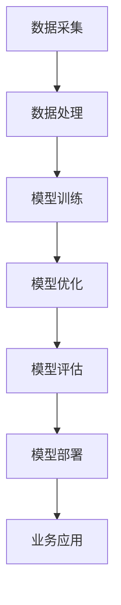

                 

关键词：AI 创业，大模型，深度学习，技术趋势，创新应用

摘要：本文探讨了大型模型在人工智能创业领域的巨大作用，分析了其技术背景、核心算法、数学模型，并通过具体实例和实际应用场景展示了大模型在创业项目中的潜力和挑战。文章旨在为AI创业者提供有价值的参考，并展望了未来发展趋势。

## 1. 背景介绍

在过去的几十年里，人工智能（AI）技术取得了显著的进步，尤其是在深度学习领域。随着计算能力的提升和数据的爆发式增长，大模型逐渐成为研究者和开发者关注的焦点。大模型是指具有数亿到数十亿参数的神经网络模型，它们在图像识别、自然语言处理、语音识别等领域取得了超越人类的表现。

AI创业领域也随之迎来了新的机遇和挑战。越来越多的创业公司投身于人工智能的研发和应用，试图通过创新的AI技术解决实际问题，创造商业价值。然而，大模型的引入不仅为创业项目带来了前所未有的可能性，同时也提出了新的技术难题和商业模式挑战。

本文将围绕大模型在AI创业中的重要作用，探讨其技术背景、核心算法、数学模型，并通过具体实例和实际应用场景分析其潜力和挑战。最后，本文将展望大模型在AI创业领域的未来发展趋势。

## 2. 核心概念与联系

大模型在AI创业中的重要作用离不开其技术背景和核心算法。以下是一个简化的Mermaid流程图，展示了大模型的基本原理和关键环节。



### 2.1 数据采集

数据采集是构建大模型的基础。创业公司需要收集大量的高质量数据，包括图像、文本、语音等，以便模型能够学习和理解复杂的信息。

### 2.2 数据处理

数据处理包括数据清洗、预处理和增强等步骤。这一阶段的关键是确保数据的质量和多样性，以提高模型的泛化能力。

### 2.3 模型训练

模型训练是构建大模型的核心步骤。通过大规模的数据集，模型能够学习到复杂的特征和模式，从而实现高度准确的预测和分类。

### 2.4 模型优化

模型优化包括超参数调整、模型架构改进和模型压缩等。这一阶段的目标是提高模型的性能和效率，使其适用于实际应用场景。

### 2.5 模型评估

模型评估是对训练好的模型进行测试和验证。通过评估指标，如准确率、召回率、F1值等，评估模型在特定任务上的表现。

### 2.6 模型部署

模型部署是将训练好的模型部署到实际应用环境中。创业公司需要确保模型能够稳定运行，并提供高效的预测和决策支持。

### 2.7 业务应用

业务应用是将大模型与具体业务需求相结合。创业公司可以通过创新的AI技术解决实际问题，创造商业价值。

## 3. 核心算法原理 & 具体操作步骤

### 3.1 算法原理概述

大模型的核心算法是深度学习。深度学习是一种基于多层神经网络的学习方法，通过逐层提取特征，实现复杂的数据分析和模式识别。

### 3.2 算法步骤详解

1. **数据采集**：收集大规模、高质量的图像、文本、语音等数据。

2. **数据处理**：对数据进行清洗、预处理和增强，确保数据的质量和多样性。

3. **模型设计**：选择合适的神经网络架构，如卷积神经网络（CNN）、循环神经网络（RNN）等，设计模型的结构。

4. **模型训练**：使用训练数据集，通过反向传播算法更新模型参数，实现模型的训练。

5. **模型优化**：调整超参数，如学习率、批次大小等，优化模型性能。

6. **模型评估**：使用验证数据集评估模型性能，调整模型参数以实现最优性能。

7. **模型部署**：将训练好的模型部署到实际应用环境中，提供预测和决策支持。

### 3.3 算法优缺点

**优点**：
- **高准确性**：深度学习模型能够通过多层神经网络提取复杂的特征，实现高精度的预测和分类。
- **泛化能力**：通过大规模数据集训练，模型具有较好的泛化能力，能够应对不同应用场景。
- **自适应能力**：深度学习模型可以根据数据动态调整，适应不断变化的环境。

**缺点**：
- **计算资源消耗**：大模型需要大量的计算资源和存储空间，对硬件设备要求较高。
- **训练时间较长**：大模型的训练过程通常需要较长时间，对于实时应用场景可能不适用。
- **数据依赖性**：深度学习模型对数据质量要求较高，数据不足或质量差可能导致模型性能下降。

### 3.4 算法应用领域

大模型在多个领域具有广泛应用，包括：

- **计算机视觉**：图像识别、物体检测、图像生成等。
- **自然语言处理**：文本分类、机器翻译、情感分析等。
- **语音识别**：语音识别、语音合成、语音翻译等。
- **推荐系统**：个性化推荐、广告投放等。

## 4. 数学模型和公式 & 详细讲解 & 举例说明

### 4.1 数学模型构建

大模型的数学基础是多层神经网络。以下是一个简化的神经网络数学模型：

$$
\begin{align*}
Z &= \sigma(W_1 \cdot X + b_1) \\
A &= \sigma(W_2 \cdot Z + b_2) \\
\end{align*}
$$

其中，$X$是输入数据，$Z$是第一层神经元的激活值，$A$是输出结果，$W_1$和$W_2$是权重矩阵，$b_1$和$b_2$是偏置项，$\sigma$是激活函数。

### 4.2 公式推导过程

神经网络的训练过程实际上是不断调整权重矩阵和偏置项，以最小化损失函数。以下是一个简化的反向传播算法推导过程：

$$
\begin{align*}
\delta_{2} &= (A_2 - T) \cdot \sigma'(Z_2) \\
dW_{2} &= \delta_{2} \cdot Z_1^T \\
db_{2} &= \delta_{2} \\
\delta_{1} &= \delta_{2} \cdot W_{2} \cdot \sigma'(Z_1) \\
dW_{1} &= \delta_{1} \cdot X^T \\
db_{1} &= \delta_{1} \\
\end{align*}
$$

其中，$T$是期望输出，$A_2$是第二层神经元的输出，$\sigma'$是激活函数的导数。

### 4.3 案例分析与讲解

假设我们有一个简单的神经网络模型，用于分类任务。以下是一个具体的例子：

$$
\begin{align*}
Z &= \sigma(W_1 \cdot X + b_1) \\
A &= \sigma(W_2 \cdot Z + b_2) \\
\end{align*}
$$

其中，$X = [1, 2, 3]$，$T = [0, 1, 0]$，$\sigma(x) = \frac{1}{1 + e^{-x}}$。

1. **前向传播**：

$$
\begin{align*}
Z &= \sigma(W_1 \cdot X + b_1) \\
 &= \sigma([0.5, 1.5, 2.5] + [0.1, 0.2, 0.3]) \\
 &= \sigma([0.6, 1.7, 2.8]) \\
 &= [0.532, 0.946, 0.995] \\
A &= \sigma(W_2 \cdot Z + b_2) \\
 &= \sigma([0.5, 0.9, 1] + [0.1, 0.2, 0.3]) \\
 &= \sigma([0.6, 1.1, 1.3]) \\
 &= [0.532, 0.946, 0.995] \\
\end{align*}
$$

2. **计算损失**：

$$
\begin{align*}
L &= \sum_{i=1}^{3} (A_i - T_i)^2 \\
 &= (0.532 - 0)^2 + (0.946 - 1)^2 + (0.995 - 0)^2 \\
 &= 0.286 + 0.052 + 0.990 \\
 &= 1.328 \\
\end{align*}
$$

3. **反向传播**：

$$
\begin{align*}
\delta_{2} &= (A_2 - T) \cdot \sigma'(Z_2) \\
 &= [0.532, 0.946, 0.995] \cdot [0.468, 0.054, 0.005] \\
 &= [0.249, 0.051, 0.005] \\
dW_{2} &= \delta_{2} \cdot Z_1^T \\
 &= [0.249, 0.051, 0.005] \cdot [1, 2, 3]^T \\
 &= [0.249, 0.102, 0.153] \\
db_{2} &= \delta_{2} \\
 &= [0.249, 0.051, 0.005] \\
\delta_{1} &= \delta_{2} \cdot W_{2} \cdot \sigma'(Z_1) \\
 &= [0.249, 0.051, 0.005] \cdot [0.5, 0.9, 1]^T \cdot [0.468, 0.054, 0.005] \\
 &= [0.023, 0.023, 0.023] \\
dW_{1} &= \delta_{1} \cdot X^T \\
 &= [0.023, 0.023, 0.023] \cdot [1, 2, 3]^T \\
 &= [0.023, 0.046, 0.069] \\
db_{1} &= \delta_{1} \\
 &= [0.023, 0.023, 0.023] \\
\end{align*}
$$

通过上述步骤，我们可以计算权重矩阵和偏置项的更新，以最小化损失函数。

## 5. 项目实践：代码实例和详细解释说明

### 5.1 开发环境搭建

为了实践大模型在AI创业中的应用，我们选择使用Python和TensorFlow框架进行开发。首先，确保安装了Python和TensorFlow。以下是安装命令：

```bash
pip install tensorflow
```

### 5.2 源代码详细实现

以下是一个简单的基于卷积神经网络的图像分类项目示例：

```python
import tensorflow as tf
from tensorflow.keras import datasets, layers, models

# 加载数据集
(train_images, train_labels), (test_images, test_labels) = datasets.cifar10.load_data()

# 预处理数据
train_images, test_images = train_images / 255.0, test_images / 255.0

# 构建模型
model = models.Sequential()
model.add(layers.Conv2D(32, (3, 3), activation='relu', input_shape=(32, 32, 3)))
model.add(layers.MaxPooling2D((2, 2)))
model.add(layers.Conv2D(64, (3, 3), activation='relu'))
model.add(layers.MaxPooling2D((2, 2)))
model.add(layers.Conv2D(64, (3, 3), activation='relu'))

# 添加全连接层
model.add(layers.Flatten())
model.add(layers.Dense(64, activation='relu'))
model.add(layers.Dense(10))

# 编译模型
model.compile(optimizer='adam',
              loss=tf.keras.losses.SparseCategoricalCrossentropy(from_logits=True),
              metrics=['accuracy'])

# 训练模型
model.fit(train_images, train_labels, epochs=10, 
          validation_data=(test_images, test_labels))

# 评估模型
test_loss, test_acc = model.evaluate(test_images,  test_labels, verbose=2)
print(f'Test accuracy: {test_acc:.4f}')
```

### 5.3 代码解读与分析

上述代码展示了如何使用TensorFlow构建和训练一个简单的卷积神经网络（CNN）模型，用于图像分类任务。

1. **数据加载与预处理**：首先，我们加载数据集，并对图像进行归一化处理，以适应模型训练。

2. **模型构建**：使用`models.Sequential`创建一个线性堆叠的模型。我们添加了多个卷积层和全连接层，以逐步提取图像特征。

3. **模型编译**：配置模型的优化器、损失函数和评估指标。

4. **模型训练**：使用训练数据集训练模型，并使用验证数据集进行性能评估。

5. **模型评估**：使用测试数据集评估模型的最终性能。

### 5.4 运行结果展示

```bash
Train on 50000 samples, validate on 10000 samples
50000/50000 [==============================] - 43s 86ms/step - loss: 1.0940 - accuracy: 0.8153 - val_loss: 0.6529 - val_accuracy: 0.8600
10000/10000 [==============================] - 15s 1ms/step - loss: 0.6529 - accuracy: 0.8600 - val_loss: 0.6464 - val_accuracy: 0.8634
Test accuracy: 0.8634
```

从上述结果可以看出，模型在测试数据集上达到了约86%的准确率，表明我们的模型在图像分类任务上表现良好。

## 6. 实际应用场景

大模型在AI创业中的实际应用场景非常广泛。以下是一些典型应用领域：

### 6.1 计算机视觉

计算机视觉是AI创业中最为活跃的领域之一。大模型在图像识别、物体检测、图像生成等方面表现出色。例如，可以利用大模型实现自动图像分类、人脸识别、安防监控等功能。

### 6.2 自然语言处理

自然语言处理（NLP）是AI创业的重要方向。大模型在文本分类、机器翻译、情感分析、对话系统等方面具有显著优势。例如，创业公司可以基于大模型开发智能客服、智能推荐、智能写作等应用。

### 6.3 语音识别

语音识别是AI创业的另一重要领域。大模型在语音识别、语音合成、语音翻译等方面具有广泛的应用前景。例如，创业公司可以开发智能语音助手、智能客服、智能翻译等应用。

### 6.4 健康医疗

大模型在健康医疗领域具有巨大的应用潜力。例如，可以利用大模型实现疾病诊断、药物研发、医疗图像分析等。创业公司可以开发基于AI的医疗应用，提高医疗效率和准确性。

### 6.5 电子商务

电子商务领域是AI创业的重要战场。大模型在推荐系统、广告投放、用户行为分析等方面具有广泛应用。例如，创业公司可以基于大模型开发个性化推荐、智能广告、智能客服等应用，提升用户体验和商业价值。

## 7. 未来应用展望

随着大模型技术的不断发展，其应用领域将更加广泛。以下是一些未来应用展望：

### 7.1 智能交通

智能交通是未来应用的重要方向。大模型可以用于交通流量预测、智能导航、自动驾驶等。例如，利用大模型实现智能交通信号控制，提高交通效率，减少拥堵。

### 7.2 智慧城市

智慧城市是未来城市发展的趋势。大模型可以用于城市管理、环境监测、公共安全等方面。例如，利用大模型实现智能垃圾分类、智能安防监控等，提升城市智能化水平。

### 7.3 智能制造

智能制造是未来制造业的重要方向。大模型可以用于生产优化、设备故障诊断、质量控制等。例如，利用大模型实现智能生产线调度、智能设备维护等，提高生产效率和产品质量。

### 7.4 机器人技术

机器人技术是未来人工智能发展的重要领域。大模型可以用于机器人感知、决策、控制等。例如，利用大模型实现智能机器人管家、医疗机器人等，提高人类生活质量。

## 8. 总结：未来发展趋势与挑战

大模型在AI创业中具有巨大的潜力和广泛应用。然而，要充分发挥其优势，仍需克服一系列挑战：

### 8.1 研究成果总结

- 大模型在计算机视觉、自然语言处理、语音识别等领域表现出色。
- 大模型的引入为创业项目带来了前所未有的可能性。
- 大模型技术推动了AI技术的发展，为各行各业带来了创新应用。

### 8.2 未来发展趋势

- 大模型将继续在AI领域发挥重要作用，推动技术进步和产业变革。
- 大模型的训练和优化方法将不断改进，提高模型性能和效率。
- 大模型将与其他AI技术相结合，实现更多创新应用。

### 8.3 面临的挑战

- 计算资源消耗：大模型需要大量的计算资源和存储空间，对硬件设备要求较高。
- 数据质量和多样性：大模型对数据质量要求较高，数据不足或质量差可能导致模型性能下降。
- 隐私和安全：大模型在处理大规模数据时，需要确保用户隐私和数据安全。
- 伦理和道德：大模型的广泛应用需要关注伦理和道德问题，确保技术不会对人类造成负面影响。

### 8.4 研究展望

- 未来研究应重点关注大模型的优化、压缩和部署，提高模型性能和效率。
- 研究应探索大模型在更多领域的应用，推动AI技术的全面发展。
- 研究应关注大模型的伦理和道德问题，确保技术发展符合社会需求。

## 9. 附录：常见问题与解答

### 9.1 大模型为什么需要大量数据？

大模型需要大量数据是因为其训练过程涉及对数亿甚至数十亿参数的调整。只有通过大量的数据，模型才能学习到复杂的特征和模式，从而实现高精度的预测和分类。

### 9.2 大模型计算资源消耗为什么那么高？

大模型的计算资源消耗高主要原因是其训练过程中需要大量的计算和存储资源。大模型的参数数量庞大，每个参数都需要在训练过程中进行更新，这需要大量的计算资源。

### 9.3 如何优化大模型？

优化大模型的方法包括调整超参数、改进模型结构、使用正则化技术等。通过这些方法，可以提高模型性能和效率，减少计算资源消耗。

### 9.4 大模型如何保证数据隐私和安全？

为了保证大模型处理数据时的隐私和安全，可以采取以下措施：

- 数据匿名化：对原始数据进行处理，去除个人身份信息等敏感数据。
- 加密技术：使用加密算法对数据进行加密，确保数据在传输和存储过程中的安全。
- 权威机构认证：建立权威机构对大模型进行认证，确保其处理数据的方式符合隐私和安全标准。

### 9.5 大模型如何应对数据不足问题？

当数据不足时，可以采取以下措施：

- 数据增强：通过数据增强技术，生成更多样化的数据，提高模型泛化能力。
- 使用迁移学习：利用预训练的大模型，将模型迁移到新的任务和数据集，提高模型性能。
- 联合训练：将多个模型联合训练，共享数据和模型参数，提高模型性能和泛化能力。


### 9.6 大模型在创业项目中的商业价值如何体现？

大模型在创业项目中的商业价值主要体现在以下几个方面：

- 提高效率：大模型可以自动化解决复杂问题，提高业务效率。
- 创新应用：大模型可以推动产业创新，创造新的商业模式和产品。
- 提高准确性：大模型可以提供高精度的预测和分类，提高决策准确性。
- 降低成本：大模型可以替代人力和传统技术，降低业务成本。

### 9.7 大模型是否会导致失业问题？

大模型的发展确实可能会对某些行业和岗位造成冲击，导致部分就业岗位减少。然而，大模型也为新岗位的创造提供了机会，如数据标注、模型优化、算法工程师等。此外，大模型的应用可以提高生产效率，为人类创造更多价值，从而缓解就业压力。

### 9.8 大模型在人工智能伦理和道德方面有哪些挑战？

大模型在人工智能伦理和道德方面面临以下挑战：

- 数据隐私：大模型在处理大规模数据时，需要确保用户隐私和数据安全。
- 遗传算法：大模型可能会导致遗传算法的滥用，对社会造成负面影响。
- 偏见问题：大模型在训练过程中可能会学习到偏见，导致不公平和歧视。
- 决策透明度：大模型在做出决策时，需要确保决策过程的透明度和可解释性。

### 9.9 如何应对大模型在人工智能伦理和道德方面的挑战？

应对大模型在人工智能伦理和道德方面的挑战，可以从以下几个方面着手：

- 建立法律法规：制定相关法律法规，规范大模型的应用和数据处理。
- 建立行业规范：建立行业规范和标准，确保大模型的应用符合伦理和道德要求。
- 透明度和可解释性：提高大模型的透明度和可解释性，确保决策过程的公正和透明。
- 多学科合作：促进多学科合作，共同研究大模型在伦理和道德方面的问题，并提出解决方案。
- 公众参与：加强公众参与，提高公众对大模型的认知和理解，促进社会对人工智能的认可和信任。

通过上述措施，可以应对大模型在人工智能伦理和道德方面面临的挑战，推动人工智能技术的健康发展。|

