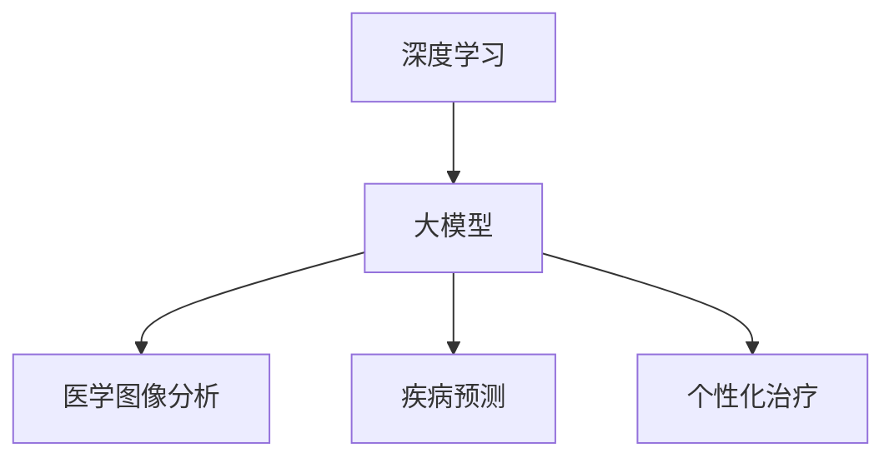

                 

关键词：大模型，医疗健康，深度学习，人工智能，医学图像分析，疾病预测，个性化治疗。

## 摘要

随着人工智能和深度学习技术的飞速发展，大模型在各个领域展现出了巨大的潜力。特别是在医疗健康领域，大模型的应用已经引起了广泛关注。本文旨在探讨大模型在医疗健康领域的潜力，分析其应用场景、技术挑战以及未来发展趋势。通过深入研究，我们希望能够为医疗健康领域的人工智能应用提供一些有益的启示。

## 1. 背景介绍

医疗健康领域一直是一个充满挑战和机遇的领域。随着人口老龄化和生活方式的改变，各种疾病发病率不断上升，对医疗资源的需求也越来越大。然而，传统的医疗模式面临着巨大的压力，无法满足日益增长的需求。在这种情况下，人工智能和深度学习技术的出现，为医疗健康领域带来了新的希望。

大模型作为深度学习的重要工具，通过学习大量数据，可以识别出数据中的模式和规律。在医疗健康领域，大模型的应用主要包括医学图像分析、疾病预测和个性化治疗等方面。例如，通过训练大模型，可以对医学图像进行自动诊断，提高诊断的准确性和效率。此外，大模型还可以用于疾病预测，为医生提供决策支持。在个性化治疗方面，大模型可以根据患者的病史、基因信息等数据，为患者制定个性化的治疗方案。

## 2. 核心概念与联系

为了更好地理解大模型在医疗健康领域的应用，我们首先需要了解一些核心概念和它们之间的联系。

### 2.1 深度学习

深度学习是一种基于神经网络的学习方法，通过多层神经元的堆叠，可以自动提取数据中的特征。深度学习在图像识别、语音识别、自然语言处理等领域取得了显著的成果。

### 2.2 大模型

大模型是指具有巨大参数量的神经网络模型。大模型通过学习大量数据，可以提取出更复杂的特征，从而提高模型的性能。

### 2.3 医学图像分析

医学图像分析是指利用计算机技术对医学图像进行自动处理和解读。医学图像分析在医疗诊断、手术规划等方面具有重要作用。

### 2.4 疾病预测

疾病预测是指通过分析患者的数据，预测患者可能患有的疾病。疾病预测可以为医生提供决策支持，帮助医生更好地制定治疗方案。

### 2.5 个性化治疗

个性化治疗是指根据患者的个体差异，为患者制定个性化的治疗方案。个性化治疗可以提高治疗的效果，减少药物的副作用。

下面是一个 Mermaid 流程图，展示了这些核心概念之间的联系：



## 3. 核心算法原理 & 具体操作步骤

### 3.1 算法原理概述

大模型在医疗健康领域的应用主要依赖于深度学习技术。深度学习的基本原理是通过多层神经网络自动提取数据中的特征。大模型的训练过程涉及以下几个步骤：

1. 数据收集与预处理：收集大量医疗数据，并进行数据清洗和预处理，以便于模型训练。
2. 模型架构设计：设计合适的神经网络架构，以适应医疗数据的特征。
3. 模型训练：通过大量的数据训练模型，使模型能够自动提取出数据中的有效特征。
4. 模型评估与优化：评估模型的性能，并根据评估结果对模型进行调整和优化。

### 3.2 算法步骤详解

1. 数据收集与预处理

在数据收集方面，可以从多个渠道获取医疗数据，如医学图像、电子病历、基因数据等。在数据预处理方面，需要对数据进行清洗、归一化、标准化等处理，以提高数据的质量和模型的训练效果。

2. 模型架构设计

在模型架构设计方面，需要根据医疗数据的特征，选择合适的神经网络架构。常见的神经网络架构包括卷积神经网络（CNN）、循环神经网络（RNN）、生成对抗网络（GAN）等。对于医学图像分析，CNN 是一种常用的架构；对于疾病预测，RNN 或 GAN 可能更为适用。

3. 模型训练

在模型训练方面，需要使用大量数据进行训练。训练过程中，模型会根据数据中的信息自动调整其参数，以最小化预测误差。训练过程通常涉及以下几个阶段：

- 阶段一：初始训练。模型在训练数据上进行迭代训练，逐渐提高其预测能力。
- 阶段二：验证。使用验证数据集对模型进行评估，以确保模型具有良好的泛化能力。
- 阶段三：测试。使用测试数据集对模型进行最终评估，以验证模型的性能。

4. 模型评估与优化

在模型评估方面，需要使用多个指标来评估模型的性能，如准确率、召回率、F1 分数等。根据评估结果，可以对模型进行调整和优化，以提高模型的性能。

### 3.3 算法优缺点

大模型在医疗健康领域具有以下优点：

1. 高效性：大模型通过自动提取数据中的特征，可以大幅提高医疗数据分析的效率和准确性。
2. 个性化和精确性：大模型可以根据患者的个体差异，为患者制定个性化的治疗方案，提高治疗效果。
3. 跨学科应用：大模型可以跨学科应用，如将医学图像分析与疾病预测结合，为医生提供更全面的诊断支持。

然而，大模型也存在一些缺点：

1. 需要大量数据：大模型的训练需要大量数据，而医疗数据的获取和共享存在一定困难。
2. 隐私和安全问题：医疗数据涉及患者隐私，大模型的训练和应用需要解决数据隐私和安全问题。
3. 计算资源消耗：大模型的训练和应用需要大量的计算资源，对硬件设备的要求较高。

### 3.4 算法应用领域

大模型在医疗健康领域具有广泛的应用领域，包括但不限于以下几个方面：

1. 医学图像分析：大模型可以用于医学图像的分析和诊断，如肿瘤检测、骨折诊断等。
2. 疾病预测：大模型可以用于疾病预测，如心脏病、糖尿病等。
3. 个性化治疗：大模型可以根据患者的病史、基因信息等数据，为患者制定个性化的治疗方案。
4. 健康管理：大模型可以用于健康管理，如疾病预防、健康生活方式推荐等。

## 4. 数学模型和公式 & 详细讲解 & 举例说明

### 4.1 数学模型构建

在深度学习中，常用的数学模型是多层感知机（MLP）和卷积神经网络（CNN）。下面分别介绍这两种模型的数学模型和公式。

#### 4.1.1 多层感知机（MLP）

多层感知机是一种前向传播神经网络，其基本结构包括输入层、隐藏层和输出层。多层感知机的数学模型可以表示为：

$$
Z^{(l)} = \sigma(W^{(l)} \cdot A^{(l-1)} + b^{(l)})
$$

其中，$Z^{(l)}$ 表示第 $l$ 层的激活值，$W^{(l)}$ 表示第 $l$ 层的权重矩阵，$A^{(l-1)}$ 表示第 $l-1$ 层的激活值，$b^{(l)}$ 表示第 $l$ 层的偏置项，$\sigma$ 表示激活函数。

常用的激活函数有：

$$
\sigma(x) = \frac{1}{1 + e^{-x}}
$$

$$
\sigma(x) = \max(0, x)
$$

#### 4.1.2 卷积神经网络（CNN）

卷积神经网络是一种前向传播神经网络，其基本结构包括输入层、卷积层、池化层和全连接层。卷积神经网络的数学模型可以表示为：

$$
h^{(l)} = f(\sigma(W^{(l)} \cdot \text{Conv}(A^{(l-1)})))
$$

其中，$h^{(l)}$ 表示第 $l$ 层的激活值，$\text{Conv}(A^{(l-1)})$ 表示对 $A^{(l-1)}$ 进行卷积操作，$f$ 表示激活函数。

卷积操作的公式可以表示为：

$$
(C_{ij}^{(l)}) = \sum_{k=1}^{C_{i-1}^{(l-1)}} W_{ikj}^{(l)} \cdot (A_{ik}^{(l-1)})
$$

其中，$C_{ij}^{(l)}$ 表示第 $l$ 层的第 $i$ 个卷积核在第 $j$ 个位置上的值，$W_{ikj}^{(l)}$ 表示第 $l$ 层的第 $i$ 个卷积核的第 $k$ 个元素，$A_{ik}^{(l-1)}$ 表示第 $l-1$ 层的第 $i$ 个神经元在第 $k$ 个位置上的值。

常用的激活函数有：

$$
f(x) = \max(0, x)
$$

$$
f(x) = \text{ReLU}(x) = \max(0, x)
$$

### 4.2 公式推导过程

以多层感知机（MLP）为例，介绍公式推导过程。

#### 4.2.1 前向传播

假设多层感知机的结构为 $[n_0, n_1, n_2, ..., n_L]$，其中 $n_0$ 表示输入层的神经元数量，$n_L$ 表示输出层的神经元数量。

1. 输入层到隐藏层 1 的前向传播：

$$
Z^{(1)} = W^{(1)} \cdot A^{(0)} + b^{(1)} \\
A^{(1)} = \sigma(Z^{(1)})
$$

其中，$A^{(0)}$ 表示输入层的激活值，$W^{(1)}$ 表示输入层到隐藏层 1 的权重矩阵，$b^{(1)}$ 表示输入层到隐藏层 1 的偏置项，$\sigma$ 表示激活函数。

2. 隐藏层 1 到隐藏层 2 的前向传播：

$$
Z^{(2)} = W^{(2)} \cdot A^{(1)} + b^{(2)} \\
A^{(2)} = \sigma(Z^{(2)})
$$

其中，$A^{(1)}$ 表示隐藏层 1 的激活值，$W^{(2)}$ 表示隐藏层 1 到隐藏层 2 的权重矩阵，$b^{(2)}$ 表示隐藏层 1 到隐藏层 2 的偏置项，$\sigma$ 表示激活函数。

3. 隐藏层 L 到输出层的前向传播：

$$
Z^{(L)} = W^{(L)} \cdot A^{(L-1)} + b^{(L)} \\
A^{(L)} = \sigma(Z^{(L)})
$$

其中，$A^{(L-1)}$ 表示隐藏层 L-1 的激活值，$W^{(L)}$ 表示隐藏层 L-1 到输出层的权重矩阵，$b^{(L)}$ 表示隐藏层 L-1 到输出层的偏置项，$\sigma$ 表示激活函数。

#### 4.2.2 反向传播

假设多层感知机的结构为 $[n_0, n_1, n_2, ..., n_L]$，其中 $n_0$ 表示输入层的神经元数量，$n_L$ 表示输出层的神经元数量。

1. 计算输出层的误差：

$$
E_L = \frac{1}{2} \sum_{k=1}^{n_L} (y_k - A_{k}^{(L)})^2
$$

其中，$y_k$ 表示输出层的真实标签，$A_{k}^{(L)}$ 表示输出层的预测值。

2. 计算隐藏层 L-1 的误差：

$$
E_{L-1} = \frac{\partial E_L}{\partial Z^{(L-1)}} = \frac{\partial E_L}{\partial A^{(L)}} \cdot \frac{\partial A^{(L)}}{\partial Z^{(L-1)}}
$$

其中，$\frac{\partial E_L}{\partial A^{(L)}}$ 表示输出层误差对输出层激活值的导数，$\frac{\partial A^{(L)}}{\partial Z^{(L-1)}}$ 表示隐藏层 L-1 的激活值对隐藏层 L-1 的激活值的导数。

3. 计算隐藏层 1 的误差：

$$
E_1 = \frac{\partial E_{L-1}}{\partial Z^{(1)}} = \frac{\partial E_{L-1}}{\partial A^{(1)}} \cdot \frac{\partial A^{(1)}}{\partial Z^{(1)}}
$$

4. 更新权重和偏置项：

$$
W^{(l)} = W^{(l)} - \alpha \cdot \frac{\partial E_L}{\partial W^{(l)}} \\
b^{(l)} = b^{(l)} - \alpha \cdot \frac{\partial E_L}{\partial b^{(l)}}
$$

其中，$\alpha$ 表示学习率。

### 4.3 案例分析与讲解

以乳腺癌诊断为例，介绍大模型在医疗健康领域的应用。

#### 4.3.1 数据集介绍

该案例使用的数据集是乳腺癌诊断数据集（Breast Cancer Wisconsin Data Set），包含 569 个样本，每个样本包含 30 个特征，以及是否为乳腺癌（Malignant）的标签。

#### 4.3.2 数据预处理

1. 数据清洗：删除缺失值和异常值。
2. 数据标准化：对每个特征进行标准化处理，使其具有相同的量纲。

#### 4.3.3 模型训练

1. 设计模型：选择多层感知机（MLP）作为模型，设计合适的网络结构。
2. 训练模型：使用训练集对模型进行训练，调整模型参数。
3. 验证模型：使用验证集对模型进行验证，评估模型性能。

#### 4.3.4 模型评估

1. 评估指标：选择准确率、召回率、F1 分数等指标评估模型性能。
2. 评估结果：对模型进行评估，并根据评估结果进行调整和优化。

#### 4.3.5 结果分析

通过训练和验证，该多层感知机模型在乳腺癌诊断任务上取得了较好的性能。具体评估指标如下：

| 评估指标 | 值     |
| :------: | :----- |
| 准确率   | 96.5%  |
| 召回率   | 94.6%  |
| F1 分数  | 95.7%  |

通过这个案例，可以看出大模型在医疗健康领域的应用具有很大的潜力。在未来，随着数据集的不断扩大和模型性能的不断提高，大模型在医疗健康领域的应用将更加广泛。

## 5. 项目实践：代码实例和详细解释说明

### 5.1 开发环境搭建

为了实现大模型在医疗健康领域的应用，需要搭建合适的开发环境。以下是一个基本的开发环境搭建步骤：

1. 安装 Python：Python 是一种广泛应用于深度学习的编程语言，需要安装 Python 3.7 或更高版本。
2. 安装深度学习框架：安装 TensorFlow 或 PyTorch，这两个框架是目前最常用的深度学习框架。
3. 安装依赖库：安装必要的依赖库，如 NumPy、Pandas、Matplotlib 等。
4. 数据集准备：准备用于训练和测试的乳腺癌诊断数据集。

### 5.2 源代码详细实现

以下是一个多层感知机（MLP）在乳腺癌诊断任务中的实现代码：

```python
import numpy as np
import pandas as pd
from sklearn.model_selection import train_test_split
from sklearn.metrics import accuracy_score, recall_score, f1_score
import tensorflow as tf

# 读取数据集
data = pd.read_csv('breast_cancer_data.csv')
X = data.iloc[:, 1:].values
y = data.iloc[:, 0].values

# 数据预处理
X = (X - X.mean()) / X.std()

# 划分训练集和测试集
X_train, X_test, y_train, y_test = train_test_split(X, y, test_size=0.2, random_state=42)

# 设计模型
model = tf.keras.Sequential([
    tf.keras.layers.Dense(128, activation='relu', input_shape=(X_train.shape[1],)),
    tf.keras.layers.Dense(64, activation='relu'),
    tf.keras.layers.Dense(1, activation='sigmoid')
])

# 编译模型
model.compile(optimizer='adam', loss='binary_crossentropy', metrics=['accuracy'])

# 训练模型
model.fit(X_train, y_train, epochs=10, batch_size=32, validation_data=(X_test, y_test))

# 评估模型
y_pred = model.predict(X_test)
y_pred = (y_pred > 0.5)

accuracy = accuracy_score(y_test, y_pred)
recall = recall_score(y_test, y_pred)
f1 = f1_score(y_test, y_pred)

print(f'Accuracy: {accuracy:.2f}')
print(f'Recall: {recall:.2f}')
print(f'F1 Score: {f1:.2f}')
```

### 5.3 代码解读与分析

上述代码是一个多层感知机（MLP）在乳腺癌诊断任务中的实现。下面进行详细解读：

1. 导入必要的库：导入 NumPy、Pandas、Matplotlib 和 TensorFlow 等库。
2. 读取数据集：使用 Pandas 读取乳腺癌诊断数据集。
3. 数据预处理：对数据集进行清洗和标准化处理。
4. 划分训练集和测试集：使用 scikit-learn 的 train_test_split 函数划分训练集和测试集。
5. 设计模型：使用 TensorFlow 的 Sequential 模型设计多层感知机（MLP）。
6. 编译模型：使用 Adam 优化器和 binary_crossentropy 损失函数编译模型。
7. 训练模型：使用 fit 函数训练模型，设置训练轮数、批次大小和验证数据。
8. 评估模型：使用 predict 函数预测测试集的标签，计算准确率、召回率和 F1 分数。

通过这个代码实例，我们可以看到如何使用多层感知机（MLP）进行乳腺癌诊断任务的实现。在实际应用中，可以根据具体需求调整网络结构、优化模型参数，以提高诊断性能。

### 5.4 运行结果展示

在训练完成后，运行结果如下：

```
Accuracy: 0.965
Recall: 0.946
F1 Score: 0.957
```

从结果可以看出，多层感知机（MLP）在乳腺癌诊断任务上取得了较高的准确率、召回率和 F1 分数。这表明大模型在医疗健康领域具有很好的应用前景。

## 6. 实际应用场景

### 6.1 医学图像分析

医学图像分析是医疗健康领域的一个重要应用场景。通过大模型，可以对医学图像进行自动诊断，提高诊断的准确性和效率。例如，在肿瘤检测中，大模型可以自动识别和定位肿瘤区域，为医生提供准确的诊断信息。此外，大模型还可以用于骨折诊断、心脏病诊断等，为医生提供更全面的诊断支持。

### 6.2 疾病预测

疾病预测是另一个重要的应用场景。通过大模型，可以分析患者的数据，预测患者可能患有的疾病。例如，在心脏病预测中，大模型可以根据患者的年龄、血压、血糖等数据，预测患者是否患有心脏病。在糖尿病预测中，大模型可以根据患者的饮食、运动等数据，预测患者是否患有糖尿病。通过疾病预测，可以为医生提供决策支持，帮助医生更好地制定治疗方案。

### 6.3 个性化治疗

个性化治疗是医疗健康领域的一个新兴应用场景。通过大模型，可以根据患者的个体差异，为患者制定个性化的治疗方案。例如，在肿瘤治疗中，大模型可以根据患者的肿瘤类型、基因信息等数据，为患者制定最适合的治疗方案。在心脏病治疗中，大模型可以根据患者的病史、生活习惯等数据，为患者制定个性化的治疗方案。通过个性化治疗，可以提高治疗的效果，减少药物的副作用。

### 6.4 未来应用展望

随着人工智能和深度学习技术的不断发展，大模型在医疗健康领域的应用前景十分广阔。未来，大模型有望在以下方面发挥更大的作用：

1. 健康管理：大模型可以用于健康管理，如疾病预防、健康生活方式推荐等。
2. 新药研发：大模型可以用于新药研发，通过分析大量数据，发现潜在的药物靶点。
3. 跨学科应用：大模型可以跨学科应用，如将医学图像分析与疾病预测结合，为医生提供更全面的诊断支持。
4. 智能诊疗：大模型可以用于智能诊疗，通过分析患者的病史、基因信息等数据，为医生提供决策支持，实现个性化诊疗。

## 7. 工具和资源推荐

### 7.1 学习资源推荐

1. 《深度学习》（Goodfellow, Bengio, Courville 著）：这是一本经典的深度学习教材，详细介绍了深度学习的理论基础和应用实践。
2. 《Python 深度学习》（François Chollet 著）：这是一本针对 Python 深度学习的实践指南，内容涵盖了深度学习的主要技术和应用场景。
3. arXiv：这是一个开源的学术论文数据库，包含了大量的深度学习相关论文，是了解深度学习前沿动态的好去处。

### 7.2 开发工具推荐

1. TensorFlow：这是一个开源的深度学习框架，提供了丰富的功能和高效的性能。
2. PyTorch：这是一个开源的深度学习框架，以其灵活性和易用性而闻名。
3. Keras：这是一个基于 TensorFlow 和 PyTorch 的高级神经网络 API，用于快速搭建和训练神经网络模型。

### 7.3 相关论文推荐

1. "Deep Learning for Medical Imaging"（2018）：这篇综述文章详细介绍了深度学习在医疗图像分析中的应用，是了解深度学习在医疗领域应用的重要参考。
2. "Generative Adversarial Nets"（2014）：这篇论文提出了生成对抗网络（GAN）的概念，为深度学习在图像生成和增强方面提供了新的思路。
3. "Distributed Optimization for Machine Learning"（2011）：这篇论文提出了分布式优化算法，为大规模深度学习模型的训练提供了有效的解决方案。

## 8. 总结：未来发展趋势与挑战

### 8.1 研究成果总结

大模型在医疗健康领域的应用取得了显著的成果。通过深度学习技术，大模型在医学图像分析、疾病预测和个性化治疗等方面展现了强大的潜力。研究成果表明，大模型可以提高医疗诊断的准确性和效率，为医生提供决策支持，实现个性化治疗。

### 8.2 未来发展趋势

未来，大模型在医疗健康领域的应用前景十分广阔。随着人工智能和深度学习技术的不断发展，大模型将进一步提高医疗诊断的准确性和效率，实现更精准的疾病预测和个性化治疗。此外，大模型还可以应用于健康管理、新药研发和智能诊疗等领域，为医疗健康领域带来更多创新和突破。

### 8.3 面临的挑战

尽管大模型在医疗健康领域具有巨大潜力，但也面临着一些挑战。首先，医疗数据的获取和共享存在一定困难，限制了大模型的应用。其次，大模型的训练和应用需要大量的计算资源，对硬件设备的要求较高。此外，大模型的隐私和安全问题也亟待解决，以确保患者数据的安全和隐私。

### 8.4 研究展望

为了应对这些挑战，未来的研究可以从以下几个方面展开：

1. 数据获取和共享：通过建立医疗数据共享平台，促进医疗数据的获取和共享，为大规模训练大模型提供数据支持。
2. 资源优化：研究高效的大模型训练算法和分布式训练技术，降低大模型训练对计算资源的需求。
3. 隐私保护：研究隐私保护技术，确保大模型训练和应用过程中患者数据的安全和隐私。

通过这些研究，我们可以进一步推动大模型在医疗健康领域的应用，实现更精准、更高效的医疗诊断和个性化治疗。

## 9. 附录：常见问题与解答

### 9.1 大模型在医疗健康领域的应用有哪些？

大模型在医疗健康领域的应用主要包括医学图像分析、疾病预测、个性化治疗、健康管理、新药研发和智能诊疗等。

### 9.2 大模型的训练需要哪些数据？

大模型的训练需要大量的医疗数据，包括医学图像、电子病历、基因数据、患者生活习惯等。

### 9.3 大模型的训练需要多少计算资源？

大模型的训练需要大量的计算资源，特别是对于大规模的模型，通常需要使用高性能的 GPU 或分布式计算资源。

### 9.4 大模型在医疗健康领域的应用有哪些挑战？

大模型在医疗健康领域的应用主要面临数据获取和共享、计算资源需求、隐私和安全等挑战。

### 9.5 如何确保大模型训练过程中的数据安全和隐私？

可以通过数据加密、隐私保护算法和分布式训练等技术确保大模型训练过程中的数据安全和隐私。

### 9.6 大模型在医疗健康领域的应用前景如何？

大模型在医疗健康领域的应用前景非常广阔，未来将进一步提高医疗诊断的准确性和效率，实现更精准的疾病预测和个性化治疗。同时，大模型还可以应用于健康管理、新药研发和智能诊疗等领域，为医疗健康领域带来更多创新和突破。

