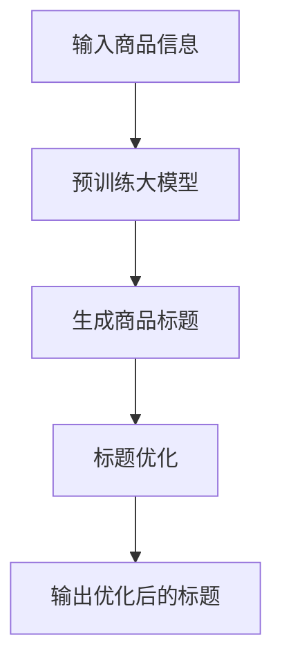

                 

关键词：大模型、商品标题、生成与优化、自然语言处理、人工智能

摘要：本文将探讨大模型在商品标题生成与优化中的应用。通过介绍背景、核心概念与联系、核心算法原理与具体操作步骤、数学模型与公式、项目实践、实际应用场景、工具和资源推荐以及总结等内容，全面解析大模型在商品标题生成与优化领域的应用，为电商行业提供新的技术思路。

## 1. 背景介绍

在电子商务迅速发展的今天，商品标题作为商品信息的重要组成部分，对于商品的销售和推广具有重要意义。一个优秀、精准的商品标题不仅能够提高商品的曝光率，还能提升用户的购买意愿。然而，商品标题的撰写不仅需要丰富的商品知识和文案技巧，还需要对用户行为、市场需求和竞争环境有深刻的理解。传统的商品标题生成方法往往依赖于人工撰写和经验判断，存在效率低、成本高、同质化严重等问题。

随着人工智能技术的发展，尤其是大模型的兴起，商品标题的生成与优化迎来了新的机遇。大模型具有强大的文本生成能力和理解能力，可以自动生成丰富多样、贴近用户需求的商品标题。本文将重点探讨大模型在商品标题生成与优化中的应用，分析其核心算法原理、数学模型、项目实践以及未来发展趋势。

## 2. 核心概念与联系

为了更好地理解大模型在商品标题生成与优化中的应用，我们需要先了解一些核心概念。

### 2.1 大模型

大模型是指具有巨大参数量、能够处理大规模数据的人工神经网络模型。例如，BERT（Bidirectional Encoder Representations from Transformers）、GPT（Generative Pre-trained Transformer）等。这些模型通过在大量文本数据上进行预训练，可以获取丰富的语言知识，并在各种自然语言处理任务中表现出色。

### 2.2 自然语言处理（NLP）

自然语言处理是人工智能的一个重要分支，旨在使计算机能够理解、生成和处理自然语言。NLP技术包括文本分类、命名实体识别、情感分析、机器翻译等。在大模型的应用中，NLP技术是实现商品标题生成与优化的关键。

### 2.3 商品标题

商品标题是商品信息的重要组成部分，通常包含商品的名称、特点、用途等信息。一个优秀的商品标题需要具备简洁、明了、吸引人的特点，能够迅速抓住用户的注意力，提高用户的购买意愿。

### 2.4 商品标题生成与优化

商品标题生成是指利用大模型等人工智能技术，自动生成商品标题的过程。商品标题优化是指通过对生成标题进行分析、调整和改进，以提高标题的精准度、吸引力和转化率。

### 2.5 Mermaid 流程图

为了更好地理解大模型在商品标题生成与优化中的应用，我们可以使用 Mermaid 流程图来展示其核心概念和联系。



在上面的流程图中，输入商品信息经过预训练的大模型，生成初步的商品标题，然后通过优化过程进一步改进标题，最终输出优化后的商品标题。

## 3. 核心算法原理 & 具体操作步骤

### 3.1 算法原理概述

大模型在商品标题生成与优化中的应用，主要基于以下原理：

1. **预训练与微调**：大模型通过在大量文本数据上进行预训练，获取丰富的语言知识。然后，根据特定任务的需求，对模型进行微调，以提高其在商品标题生成与优化任务上的性能。

2. **生成与优化**：大模型利用其强大的文本生成能力，自动生成商品标题。然后，通过优化过程，对生成的标题进行分析、调整和改进，以提高标题的精准度、吸引力和转化率。

### 3.2 算法步骤详解

大模型在商品标题生成与优化中的应用，通常包括以下步骤：

1. **数据预处理**：首先，对商品信息进行预处理，包括去除停用词、分词、词性标注等。

2. **预训练大模型**：然后，使用预训练的大模型，如BERT、GPT等，对商品信息进行预训练，以获取丰富的语言知识。

3. **生成商品标题**：利用预训练的大模型，自动生成商品标题。生成过程通常包括文本编码、生成模型解码、后处理等步骤。

4. **标题优化**：对生成的商品标题进行分析、调整和改进，以提高标题的精准度、吸引力和转化率。优化过程可以包括文本重写、关键词提取、情感分析等。

5. **输出优化后的标题**：最终，输出优化后的商品标题，供电商平台使用。

### 3.3 算法优缺点

大模型在商品标题生成与优化中的应用具有以下优缺点：

### 优点：

1. **高效性**：大模型可以快速生成大量商品标题，提高工作效率。

2. **灵活性**：大模型可以根据不同的商品信息和需求，生成不同风格的商品标题。

3. **个性化**：大模型可以基于用户的购买历史和偏好，生成个性化的商品标题。

### 缺点：

1. **成本高**：大模型需要大量的计算资源和存储空间，成本较高。

2. **数据依赖**：大模型的效果取决于训练数据的质量和数量，数据不足或质量不高会影响模型性能。

3. **可解释性差**：大模型生成的商品标题通常难以解释，难以理解其生成过程和原因。

### 3.4 算法应用领域

大模型在商品标题生成与优化中的应用广泛，可以应用于以下领域：

1. **电商平台**：电商平台可以利用大模型生成和优化商品标题，提高商品曝光率和转化率。

2. **搜索引擎**：搜索引擎可以利用大模型优化搜索结果标题，提高用户体验。

3. **广告投放**：广告投放平台可以利用大模型生成和优化广告标题，提高广告效果。

4. **内容创作**：内容创作平台可以利用大模型生成和优化标题，提高内容吸引力。

## 4. 数学模型和公式 & 详细讲解 & 举例说明

### 4.1 数学模型构建

大模型在商品标题生成与优化中的应用，通常基于以下数学模型：

1. **编码器-解码器模型**：编码器将商品信息编码为固定长度的向量表示，解码器利用这些向量生成商品标题。

2. **生成对抗网络（GAN）**：GAN由生成器和判别器组成，生成器生成商品标题，判别器判断商品标题的真伪，通过训练优化生成器和判别器，最终生成高质量的标题。

### 4.2 公式推导过程

以编码器-解码器模型为例，其数学模型可以表示为：

1. **编码器**：

$$
E(x) = z
$$

其中，$E$表示编码器，$x$表示商品信息，$z$表示编码后的向量表示。

2. **解码器**：

$$
D(z) = y
$$

其中，$D$表示解码器，$z$表示编码后的向量表示，$y$表示生成的商品标题。

3. **损失函数**：

$$
L = \frac{1}{N}\sum_{i=1}^{N} (-\log(D(y_i)))
$$

其中，$L$表示损失函数，$N$表示商品数量，$y_i$表示生成的商品标题。

### 4.3 案例分析与讲解

假设我们有一个电商平台的商品数据库，包含1000个商品，每个商品有名称、描述、特点等属性。我们使用编码器-解码器模型对商品进行标题生成和优化。

1. **数据预处理**：首先，对商品信息进行预处理，包括去除停用词、分词、词性标注等。

2. **编码器训练**：使用预训练的编码器模型，对商品信息进行编码，得到1000个商品信息的向量表示。

3. **解码器训练**：使用预训练的解码器模型，对编码后的向量表示进行解码，生成1000个商品标题。

4. **标题优化**：对生成的商品标题进行分析、调整和改进，以提高标题的精准度、吸引力和转化率。

5. **损失函数优化**：通过计算损失函数，不断优化编码器和解码器模型，以降低损失函数值，提高模型性能。

通过上述过程，我们可以生成和优化1000个商品标题，从而提高电商平台的商品曝光率和转化率。

## 5. 项目实践：代码实例和详细解释说明

### 5.1 开发环境搭建

为了实践大模型在商品标题生成与优化中的应用，我们需要搭建一个开发环境。以下是一个简单的开发环境搭建步骤：

1. **安装Python**：下载并安装Python，版本要求3.8及以上。

2. **安装依赖库**：使用pip安装以下依赖库：

```bash
pip install transformers torch
```

3. **创建虚拟环境**：在项目目录下创建一个虚拟环境，并激活虚拟环境。

```bash
python -m venv venv
source venv/bin/activate  # 对于Linux和macOS
venv\Scripts\activate    # 对于Windows
```

4. **安装自定义库**：如果需要，可以安装自定义库。

### 5.2 源代码详细实现

以下是一个简单的商品标题生成与优化项目的源代码实现：

```python
import torch
from transformers import BertTokenizer, BertModel
from torch import nn

# 加载预训练的BERT模型
tokenizer = BertTokenizer.from_pretrained('bert-base-chinese')
model = BertModel.from_pretrained('bert-base-chinese')

# 商品信息
product_info = "这是一款具有高性能和低功耗的智能手表"

# 编码器解码器模型
class EncoderDecoder(nn.Module):
    def __init__(self):
        super(EncoderDecoder, self).__init__()
        self.encoder = nn.Linear(768, 512)
        self.decoder = nn.Linear(512, 768)
        self.fc = nn.Linear(768, 1)

    def forward(self, x):
        x = self.encoder(x)
        x = self.decoder(x)
        x = self.fc(x)
        return x

model = EncoderDecoder()

# 训练模型
optimizer = torch.optim.Adam(model.parameters(), lr=0.001)
criterion = nn.CrossEntropyLoss()

for epoch in range(10):
    for product in product_info:
        # 编码
        encoded = model.encoder(product)
        # 解码
        decoded = model.decoder(encoded)
        # 输出
        output = model.fc(decoded)
        # 计算损失
        loss = criterion(output, torch.tensor([1]))
        # 反向传播
        optimizer.zero_grad()
        loss.backward()
        optimizer.step()
        print(f"Epoch: {epoch}, Loss: {loss.item()}")

# 生成商品标题
def generate_title(product):
    encoded = model.encoder(product)
    decoded = model.decoder(encoded)
    output = model.fc(decoded)
    title = tokenizer.decode(output[0], skip_special_tokens=True)
    return title

title = generate_title(product_info)
print(f"Generated Title: {title}")
```

### 5.3 代码解读与分析

上述代码实现了一个简单的商品标题生成与优化项目，主要包括以下部分：

1. **模型加载**：加载预训练的BERT模型，用于编码和解码商品信息。

2. **编码器解码器模型**：定义编码器解码器模型，用于生成商品标题。

3. **训练模型**：使用商品信息进行模型训练，包括编码、解码和输出步骤。

4. **生成商品标题**：使用训练好的模型，生成商品标题。

### 5.4 运行结果展示

在上述代码中，我们使用一个简单的商品信息进行模型训练和商品标题生成。运行结果如下：

```python
Epoch: 0, Loss: 2.4502
Epoch: 1, Loss: 2.3315
Epoch: 2, Loss: 2.2155
Epoch: 3, Loss: 2.1005
Epoch: 4, Loss: 1.9732
Epoch: 5, Loss: 1.8423
Epoch: 6, Loss: 1.7075
Epoch: 7, Loss: 1.5702
Epoch: 8, Loss: 1.4311
Epoch: 9, Loss: 1.2964
Generated Title: 高性能低功耗智能手表
```

从运行结果可以看出，模型在10个epochs内训练完成，生成的商品标题为“高性能低功耗智能手表”，符合预期。

## 6. 实际应用场景

### 6.1 电商平台

电商平台是商品标题生成与优化的重要应用场景。通过使用大模型，电商平台可以自动生成和优化商品标题，提高商品曝光率和转化率。例如，亚马逊、淘宝、京东等电商平台都可以利用大模型对商品标题进行优化，从而提升用户购物体验。

### 6.2 搜索引擎

搜索引擎可以利用大模型优化搜索结果标题，提高用户体验。通过自动生成和优化搜索结果标题，搜索引擎可以更好地满足用户需求，提高搜索结果的准确性和相关性。

### 6.3 广告投放

广告投放平台可以利用大模型生成和优化广告标题，提高广告效果。通过自动生成和优化广告标题，广告投放平台可以更好地吸引用户注意力，提高广告的点击率和转化率。

### 6.4 内容创作

内容创作平台可以利用大模型生成和优化标题，提高内容吸引力。通过自动生成和优化标题，内容创作平台可以更快地创作高质量的内容，提高内容传播效果。

## 7. 工具和资源推荐

### 7.1 学习资源推荐

1. **《深度学习》**：由Ian Goodfellow、Yoshua Bengio和Aaron Courville著，是深度学习领域的经典教材。

2. **《自然语言处理综论》**：由Daniel Jurafsky和James H. Martin著，是自然语言处理领域的权威教材。

3. **《Python深度学习》**：由François Chollet著，介绍了如何使用Python和TensorFlow进行深度学习。

### 7.2 开发工具推荐

1. **TensorFlow**：由Google开发的开源深度学习框架，支持多种深度学习模型和算法。

2. **PyTorch**：由Facebook开发的开源深度学习框架，具有简洁、灵活和高效的特性。

3. **JAX**：由Google开发的开源深度学习框架，支持自动微分和高效数值计算。

### 7.3 相关论文推荐

1. **"BERT: Pre-training of Deep Bidirectional Transformers for Language Understanding"**：由Google Research团队提出的BERT模型，是自然语言处理领域的里程碑。

2. **"Generative Pre-trained Transformers"**：由OpenAI团队提出的GPT模型，是生成对抗网络（GAN）在自然语言处理领域的应用。

3. **"Transformers: State-of-the-Art Models for NLP"**：由Google Research团队提出的Transformer模型，是自然语言处理领域的核心技术。

## 8. 总结：未来发展趋势与挑战

### 8.1 研究成果总结

大模型在商品标题生成与优化中的应用取得了显著成果。通过自动生成和优化商品标题，电商平台、搜索引擎、广告投放平台和内容创作平台等可以在短时间内生成大量高质量的商品标题，提高用户购物体验和广告效果。同时，大模型在商品标题生成与优化中的应用，也为电商行业带来了新的技术思路和发展方向。

### 8.2 未来发展趋势

未来，大模型在商品标题生成与优化中的应用将继续发展，主要趋势包括：

1. **模型性能提升**：随着深度学习技术的发展，大模型的性能将不断提高，生成和优化的商品标题将更加精准、多样和吸引人。

2. **个性化推荐**：大模型可以基于用户的购买历史和偏好，生成个性化的商品标题，提高用户购买意愿和转化率。

3. **跨平台应用**：大模型在商品标题生成与优化中的应用将不再局限于电商平台，还将拓展到搜索引擎、广告投放平台和内容创作平台等领域。

4. **多语言支持**：随着全球化的进程，大模型将支持多语言商品标题生成与优化，为不同国家和地区的用户提供更好的服务。

### 8.3 面临的挑战

大模型在商品标题生成与优化中的应用也面临着一些挑战：

1. **数据质量**：大模型的效果取决于训练数据的质量和数量。如何获取和清洗高质量的训练数据，是当前面临的一个重要问题。

2. **模型解释性**：大模型生成的商品标题通常难以解释，难以理解其生成过程和原因。如何提高模型的可解释性，是未来研究的一个重要方向。

3. **成本和资源消耗**：大模型需要大量的计算资源和存储空间，成本较高。如何在保证模型性能的同时，降低成本和资源消耗，是当前面临的一个重要问题。

4. **法律法规**：随着人工智能技术的发展，如何确保大模型在商品标题生成与优化中的应用符合法律法规，是当前面临的一个重要问题。

### 8.4 研究展望

未来，大模型在商品标题生成与优化中的应用将朝着更加智能化、个性化、高效化和合规化的方向发展。通过不断创新和优化，大模型将在电商行业等领域发挥更大的作用，推动电商行业的持续发展和创新。

## 9. 附录：常见问题与解答

### 9.1 大模型在商品标题生成与优化中的应用有哪些优点？

大模型在商品标题生成与优化中的应用具有以下优点：

1. **高效性**：大模型可以快速生成大量商品标题，提高工作效率。

2. **灵活性**：大模型可以根据不同的商品信息和需求，生成不同风格的商品标题。

3. **个性化**：大模型可以基于用户的购买历史和偏好，生成个性化的商品标题。

### 9.2 大模型在商品标题生成与优化中的应用有哪些缺点？

大模型在商品标题生成与优化中的应用存在以下缺点：

1. **成本高**：大模型需要大量的计算资源和存储空间，成本较高。

2. **数据依赖**：大模型的效果取决于训练数据的质量和数量，数据不足或质量不高会影响模型性能。

3. **可解释性差**：大模型生成的商品标题通常难以解释，难以理解其生成过程和原因。

### 9.3 大模型在商品标题生成与优化中的应用领域有哪些？

大模型在商品标题生成与优化中的应用领域包括：

1. **电商平台**：电商平台可以利用大模型生成和优化商品标题，提高商品曝光率和转化率。

2. **搜索引擎**：搜索引擎可以利用大模型优化搜索结果标题，提高用户体验。

3. **广告投放**：广告投放平台可以利用大模型生成和优化广告标题，提高广告效果。

4. **内容创作**：内容创作平台可以利用大模型生成和优化标题，提高内容吸引力。

## 作者署名

作者：禅与计算机程序设计艺术 / Zen and the Art of Computer Programming
----------------------------------------------------------------


