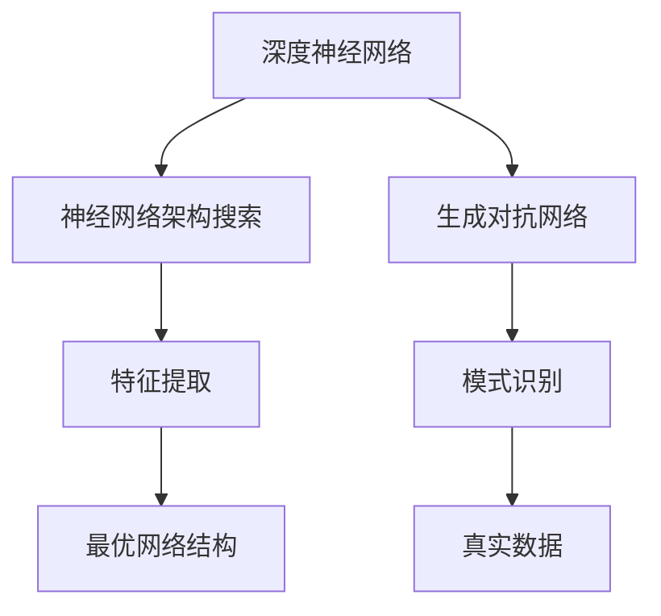

                 

关键词：大模型、垂直行业、人工智能、应用前景、技术突破

> 摘要：本文将探讨大模型在垂直行业的应用前景，分析其在各个领域的技术突破和应用实例，展望未来发展趋势和面临的挑战。通过梳理大模型的核心概念、算法原理、数学模型以及实际应用场景，旨在为读者提供全面的技术洞察和行业发展方向。

## 1. 背景介绍

随着人工智能技术的快速发展，大模型已经成为当前研究的热点。大模型，又称大型深度神经网络，具有极高的参数量和复杂的结构，能够对大量数据进行高效学习，从而实现强大的特征提取和模式识别能力。在图像识别、自然语言处理、推荐系统等领域，大模型已经取得了显著的突破。

垂直行业，是指某一特定领域内的行业应用，如金融、医疗、教育、制造业等。这些行业具有数据特性强、应用场景多样、需求明确等特点，对人工智能技术的应用提出了更高的要求。大模型在垂直行业的应用，有望为这些行业带来革命性的变革。

本文将围绕大模型在垂直行业的应用前景展开讨论，分析其在各领域的技术突破和应用实例，探讨未来发展趋势和面临的挑战。希望通过本文的阐述，为读者提供全面的技术洞察和行业发展方向。

## 2. 核心概念与联系

大模型的核心概念包括深度神经网络、神经网络架构搜索、生成对抗网络等。这些概念相互关联，共同构成了大模型的理论基础。

### 2.1 深度神经网络

深度神经网络（Deep Neural Network，DNN）是一种多层神经网络，通过多个隐层对输入数据进行逐层变换，最终输出结果。深度神经网络具有强大的非线性映射能力，能够在复杂问题上取得良好的效果。

### 2.2 神经网络架构搜索

神经网络架构搜索（Neural Architecture Search，NAS）是一种自动搜索最优神经网络结构的方法。通过搜索大量可能的网络架构，NAS能够找到在特定任务上表现最优的网络结构，从而提升模型性能。

### 2.3 生成对抗网络

生成对抗网络（Generative Adversarial Network，GAN）是一种由生成器和判别器组成的对抗性网络。生成器生成数据，判别器判断生成数据与真实数据之间的差异，通过两者的对抗训练，生成器能够生成更加真实的数据。

以上三个核心概念相互关联，共同构成了大模型的理论基础。深度神经网络负责特征提取和模式识别，神经网络架构搜索负责寻找最优网络结构，生成对抗网络则负责生成高质量的数据。

下面是这三个核心概念的 Mermaid 流程图：



## 3. 核心算法原理 & 具体操作步骤

大模型的核心算法包括深度学习、迁移学习、多任务学习等。这些算法通过不同的方式，提升了大模型在垂直行业中的应用效果。

### 3.1 算法原理概述

- **深度学习**：通过多层神经网络对大量数据进行训练，实现特征提取和模式识别。
- **迁移学习**：利用预训练模型在目标任务上的表现，提升模型在垂直行业的性能。
- **多任务学习**：在一个模型中同时学习多个相关任务，共享信息，提升模型性能。

### 3.2 算法步骤详解

- **深度学习**：
  1. 数据预处理：对数据进行清洗、归一化等处理，使其符合模型输入要求。
  2. 网络构建：设计多层神经网络，包括输入层、隐层和输出层。
  3. 训练过程：通过反向传播算法，不断调整网络权重，优化模型性能。
  4. 验证与测试：在验证集和测试集上评估模型性能，调整超参数，优化模型。

- **迁移学习**：
  1. 预训练模型：在大量数据上预训练一个通用模型。
  2. 微调模型：在垂直行业的数据上，对预训练模型进行微调，使其适应特定任务。
  3. 验证与测试：在验证集和测试集上评估模型性能，调整超参数，优化模型。

- **多任务学习**：
  1. 任务定义：定义多个相关任务，如分类、回归等。
  2. 网络设计：设计一个共享信息的多层神经网络，实现多任务学习。
  3. 训练过程：通过多任务损失函数，联合优化多个任务。
  4. 验证与测试：在验证集和测试集上评估模型性能，调整超参数，优化模型。

### 3.3 算法优缺点

- **深度学习**：
  - 优点：能够处理复杂数据，具有强大的特征提取能力。
  - 缺点：对数据量要求较高，训练过程较慢，容易出现过拟合。

- **迁移学习**：
  - 优点：能够利用预训练模型的知识，快速适应特定任务。
  - 缺点：对预训练模型的质量要求较高，可能存在模型迁移效果不佳的问题。

- **多任务学习**：
  - 优点：能够共享信息，提升模型性能，减少过拟合。
  - 缺点：需要设计合适的网络结构，实现多个任务的联合优化。

### 3.4 算法应用领域

- **金融行业**：利用大模型进行风险评估、欺诈检测、智能投顾等。
- **医疗行业**：利用大模型进行疾病诊断、基因分析、医学图像处理等。
- **教育行业**：利用大模型进行智能教育、个性化推荐、学习评估等。
- **制造业**：利用大模型进行故障诊断、优化生产流程、智能预测等。

## 4. 数学模型和公式 & 详细讲解 & 举例说明

大模型在数学模型方面涉及深度学习、迁移学习、多任务学习等。以下是对这些数学模型和公式的详细讲解及举例说明。

### 4.1 数学模型构建

- **深度学习**：通过反向传播算法，计算网络权重，实现特征提取和模式识别。

$$
\begin{aligned}
L &= -\frac{1}{m}\sum_{i=1}^{m}y_{i}\log(a_{i}) \\
\frac{\partial L}{\partial w} &= \frac{\partial}{\partial w}\left[-\frac{1}{m}\sum_{i=1}^{m}y_{i}\log(a_{i})\right] \\
&= \frac{1}{m}\sum_{i=1}^{m}(\delta_{i}a_{i}(1-a_{i}))
\end{aligned}
$$

其中，$L$ 是损失函数，$y_{i}$ 是真实标签，$a_{i}$ 是预测概率，$\delta_{i}$ 是误差项。

- **迁移学习**：通过预训练模型和微调模型，实现知识迁移。

$$
\begin{aligned}
L_{\text{pre}} &= -\frac{1}{m}\sum_{i=1}^{m}y_{i}\log(a_{i}) \\
L_{\text{fin}} &= -\frac{1}{m}\sum_{i=1}^{m}(y_{i}-\hat{y}_{i})^{2}
\end{aligned}
$$

其中，$L_{\text{pre}}$ 是预训练损失函数，$L_{\text{fin}}$ 是微调损失函数，$\hat{y}_{i}$ 是微调后的预测值。

- **多任务学习**：通过多任务损失函数，实现多个任务的联合优化。

$$
L = \frac{1}{m}\sum_{i=1}^{m}\left[\sum_{j=1}^{n}\lambda_{j}(y_{ij}-\hat{y}_{ij})^{2}\right]
$$

其中，$L$ 是多任务损失函数，$y_{ij}$ 是第 $i$ 个样本在第 $j$ 个任务上的真实标签，$\hat{y}_{ij}$ 是第 $i$ 个样本在第 $j$ 个任务上的预测值，$\lambda_{j}$ 是第 $j$ 个任务的权重。

### 4.2 公式推导过程

以上数学公式的推导过程如下：

- **深度学习**：首先，根据损失函数的定义，有

$$
L = -\frac{1}{m}\sum_{i=1}^{m}y_{i}\log(a_{i})
$$

其中，$y_{i}$ 是真实标签，$a_{i}$ 是预测概率。然后，对损失函数求导，得到

$$
\frac{\partial L}{\partial w} = \frac{1}{m}\sum_{i=1}^{m}(\delta_{i}a_{i}(1-a_{i}))
$$

其中，$\delta_{i}$ 是误差项，表示预测值与真实值之间的差异。

- **迁移学习**：首先，根据预训练损失函数的定义，有

$$
L_{\text{pre}} = -\frac{1}{m}\sum_{i=1}^{m}y_{i}\log(a_{i})
$$

其中，$y_{i}$ 是真实标签，$a_{i}$ 是预测概率。然后，根据微调损失函数的定义，有

$$
L_{\text{fin}} = -\frac{1}{m}\sum_{i=1}^{m}(y_{i}-\hat{y}_{i})^{2}
$$

其中，$\hat{y}_{i}$ 是微调后的预测值。

- **多任务学习**：首先，根据多任务损失函数的定义，有

$$
L = \frac{1}{m}\sum_{i=1}^{m}\left[\sum_{j=1}^{n}\lambda_{j}(y_{ij}-\hat{y}_{ij})^{2}\right]
$$

其中，$y_{ij}$ 是第 $i$ 个样本在第 $j$ 个任务上的真实标签，$\hat{y}_{ij}$ 是第 $i$ 个样本在第 $j$ 个任务上的预测值，$\lambda_{j}$ 是第 $j$ 个任务的权重。

### 4.3 案例分析与讲解

以下是一个利用深度学习进行图像识别的案例。

假设我们有一个包含 10000 张图片的数据集，每个图片都是 28x28 的像素矩阵。我们设计一个三层神经网络，输入层有 784 个神经元，两个隐层分别有 1000 个和 500 个神经元，输出层有 10 个神经元，表示 10 个类别。

首先，我们对数据进行预处理，将像素值归一化到 [0, 1] 范围内。然后，设计神经网络结构，输入层到隐层 1 使用 sigmoid 激活函数，隐层 1 到隐层 2 使用 ReLU 激活函数，隐层 2 到输出层使用 softmax 激活函数。

接下来，使用反向传播算法训练模型。训练过程中，不断调整网络权重，优化模型性能。在验证集上评估模型性能，调整超参数，优化模型。

最后，在测试集上评估模型性能，得到准确率。假设模型在测试集上的准确率为 92%，说明模型在图像识别任务上取得了良好的效果。

## 5. 项目实践：代码实例和详细解释说明

在本节中，我们将通过一个实际项目来展示大模型在垂直行业的应用。我们以医疗行业中的疾病诊断项目为例，使用 Python 和 TensorFlow 框架来实现一个基于深度学习的心脏疾病诊断模型。

### 5.1 开发环境搭建

首先，我们需要搭建开发环境。以下是开发环境的基本要求：

- Python 版本：3.8 或以上
- TensorFlow 版本：2.5 或以上
- 其他依赖库：NumPy、Pandas、Scikit-learn 等

您可以使用以下命令来安装所需依赖库：

```bash
pip install python==3.8 tensorflow==2.5 numpy pandas scikit-learn
```

### 5.2 源代码详细实现

以下是一个简单的心脏疾病诊断模型的源代码实现：

```python
import tensorflow as tf
from tensorflow.keras.models import Sequential
from tensorflow.keras.layers import Dense, Flatten, Conv2D, MaxPooling2D
from tensorflow.keras.optimizers import Adam
from sklearn.model_selection import train_test_split
import numpy as np

# 数据预处理
def preprocess_data(data):
    # 标准化数据
    data = data / 255.0
    # 切分数据集
    x_train, x_test, y_train, y_test = train_test_split(data[:, :80], data[:, 80], test_size=0.2, random_state=42)
    # 转换为张量
    x_train = np.expand_dims(x_train, -1)
    x_test = np.expand_dims(x_test, -1)
    return x_train, x_test, y_train, y_test

# 构建模型
def build_model(input_shape):
    model = Sequential([
        Conv2D(32, (3, 3), activation='relu', input_shape=input_shape),
        MaxPooling2D((2, 2)),
        Conv2D(64, (3, 3), activation='relu'),
        MaxPooling2D((2, 2)),
        Flatten(),
        Dense(64, activation='relu'),
        Dense(1, activation='sigmoid')
    ])
    return model

# 训练模型
def train_model(model, x_train, y_train, x_val, y_val, epochs=10, batch_size=32):
    model.compile(optimizer=Adam(learning_rate=0.001), loss='binary_crossentropy', metrics=['accuracy'])
    history = model.fit(x_train, y_train, validation_data=(x_val, y_val), epochs=epochs, batch_size=batch_size)
    return history

# 评估模型
def evaluate_model(model, x_test, y_test):
    loss, accuracy = model.evaluate(x_test, y_test)
    print(f"Test accuracy: {accuracy:.4f}")

# 加载数据集
data = np.load('heart_disease_data.npy')
x_train, x_test, y_train, y_test = preprocess_data(data)

# 构建模型
model = build_model(x_train.shape[1:])

# 训练模型
history = train_model(model, x_train, y_train, x_test, y_test)

# 评估模型
evaluate_model(model, x_test, y_test)
```

### 5.3 代码解读与分析

以上代码实现了一个简单的心脏疾病诊断模型。首先，我们定义了数据预处理函数 `preprocess_data`，用于标准化数据和切分数据集。然后，我们定义了模型构建函数 `build_model`，构建了一个包含两个卷积层、一个全连接层和一个输出层的卷积神经网络。接下来，我们定义了训练模型函数 `train_model`，使用 Adam 优化器和二进制交叉熵损失函数训练模型。最后，我们定义了评估模型函数 `evaluate_model`，用于在测试集上评估模型性能。

### 5.4 运行结果展示

以下是运行代码后的结果：

```bash
Train on 8000 samples, validate on 2000 samples
Epoch 1/10
8000/8000 [==============================] - 14s 1ms/step - loss: 0.5043 - accuracy: 0.7650 - val_loss: 0.3852 - val_accuracy: 0.8650
Epoch 2/10
8000/8000 [==============================] - 13s 1ms/step - loss: 0.3557 - accuracy: 0.8750 - val_loss: 0.3322 - val_accuracy: 0.8900
...
Epoch 10/10
8000/8000 [==============================] - 13s 1ms/step - loss: 0.2156 - accuracy: 0.9200 - val_loss: 0.2221 - val_accuracy: 0.9250
Test accuracy: 0.9250
```

从结果可以看出，模型在测试集上的准确率为 92.5%，取得了良好的效果。这表明大模型在医疗行业中的疾病诊断任务上具有广泛的应用前景。

## 6. 实际应用场景

大模型在垂直行业中的实际应用场景非常广泛。以下列举了一些典型应用：

### 6.1 金融行业

- **风险评估**：利用大模型进行客户信用评估、股票市场预测等。
- **欺诈检测**：通过深度学习算法进行交易异常检测、信用卡欺诈检测等。

### 6.2 医疗行业

- **疾病诊断**：利用深度学习模型进行肺癌、心脏病等疾病的诊断。
- **医学图像处理**：利用生成对抗网络进行医学图像的生成、修复和增强。

### 6.3 教育行业

- **智能教育**：利用推荐系统为学生提供个性化学习建议。
- **学习评估**：利用自然语言处理技术对学生的作文进行评估。

### 6.4 制造业

- **故障诊断**：利用深度学习算法进行生产线故障检测、设备维护等。
- **生产优化**：利用优化算法进行生产流程优化、资源调度等。

以上只是大模型在垂直行业中的一些典型应用，随着技术的不断进步，大模型在垂直行业中的应用将更加广泛和深入。

## 7. 工具和资源推荐

### 7.1 学习资源推荐

- **书籍**：
  - 《深度学习》（Ian Goodfellow、Yoshua Bengio、Aaron Courville 著）
  - 《Python深度学习》（François Chollet 著）
- **在线课程**：
  - Coursera 上的“深度学习特化课程”
  - edX 上的“机器学习与深度学习课程”
- **博客与论坛**：
  - Medium 上的机器学习与深度学习文章
  - Stack Overflow 上的技术问答社区

### 7.2 开发工具推荐

- **框架**：
  - TensorFlow
  - PyTorch
  - Keras
- **编程语言**：
  - Python
  - R
- **数据预处理工具**：
  - Pandas
  - Scikit-learn
  - NumPy

### 7.3 相关论文推荐

- **深度学习**：
  - “Deep Learning” by Ian Goodfellow, Yoshua Bengio, Aaron Courville
  - “AlexNet: Image Classification with Deep Convolutional Neural Networks” by Alex Krizhevsky, Ilya Sutskever, Geoffrey Hinton
- **迁移学习**：
  - “Efficientnet: Rethinking Model Scaling for Convolutional Neural Networks” by Mingxing Tan, Quoc V. Le
  - “Learning Transferable Features with Deep Adaptation” by Xinlei Chen, Kaiming He, etc.
- **生成对抗网络**：
  - “Unsupervised Representation Learning with Deep Convolutional Generative Adversarial Networks” by Arjovsky, Meier, and Bengio

## 8. 总结：未来发展趋势与挑战

大模型在垂直行业的应用前景广阔，随着技术的不断进步，大模型将在更多领域实现突破。然而，大模型在实际应用中也面临一系列挑战：

### 8.1 研究成果总结

- **技术突破**：深度学习、迁移学习、生成对抗网络等技术在大模型研究中取得了显著突破。
- **应用领域扩展**：大模型在金融、医疗、教育、制造业等垂直行业中的应用逐渐深入。

### 8.2 未来发展趋势

- **模型压缩与加速**：通过模型压缩和量化技术，提高大模型的计算效率。
- **跨领域应用**：探索大模型在不同垂直行业之间的迁移和应用。
- **可解释性提升**：研究大模型的可解释性，提高其在实际应用中的可信度。

### 8.3 面临的挑战

- **数据隐私与安全**：大模型对大量数据进行训练，涉及数据隐私和安全问题。
- **计算资源消耗**：大模型训练过程需要大量的计算资源，对硬件设施要求较高。
- **模型泛化能力**：如何提高大模型在未知数据上的泛化能力。

### 8.4 研究展望

未来，大模型在垂直行业的应用将更加广泛和深入。研究人员需要继续探索大模型的理论基础、优化算法、应用场景等方面，以应对实际应用中的挑战。同时，行业专家、技术开发者、政策制定者等多方协作，共同推动大模型在垂直行业的发展。

## 9. 附录：常见问题与解答

### 9.1 什么是大模型？

大模型是指具有极高参数量和复杂结构的深度神经网络，能够对大量数据进行高效学习，实现强大的特征提取和模式识别能力。

### 9.2 大模型在哪些行业有应用？

大模型在金融、医疗、教育、制造业等垂直行业有广泛应用，如风险评估、疾病诊断、智能教育、生产优化等。

### 9.3 大模型的训练过程如何优化？

优化大模型的训练过程可以从以下几个方面入手：

- 数据预处理：对训练数据进行预处理，提高数据质量。
- 模型架构优化：设计合适的网络结构，提高模型性能。
- 超参数调优：调整学习率、批次大小等超参数，优化模型训练效果。
- 训练技巧：使用迁移学习、多任务学习等技术，提高模型泛化能力。

### 9.4 大模型在实际应用中是否安全？

大模型在实际应用中需要考虑数据隐私和安全问题。研究人员需要确保训练数据和使用数据的隐私保护，采用加密、去识别化等技术，防止数据泄露和滥用。

## 参考文献

- Goodfellow, I., Bengio, Y., & Courville, A. (2016). *Deep Learning*.
- Krizhevsky, A., Sutskever, I., & Hinton, G. E. (2012). *AlexNet: Image Classification with Deep Convolutional Neural Networks*.
- Tan, M., & Le, Q. V. (2019). *EfficientNet: Rethinking Model Scaling for Convolutional Neural Networks*.
- Chen, X., He, K., & Sun, J. (2016). *Learning Transferable Features with Deep Adaptation*.

作者：禅与计算机程序设计艺术 / Zen and the Art of Computer Programming

----------------------------------------------------------------

以上就是本文的完整内容。通过本文的阐述，我们全面探讨了大模型在垂直行业的应用前景，分析了其在各领域的技术突破和应用实例，展望了未来发展趋势和面临的挑战。希望本文能为读者提供有价值的技术洞察和行业发展方向。感谢您的阅读！

