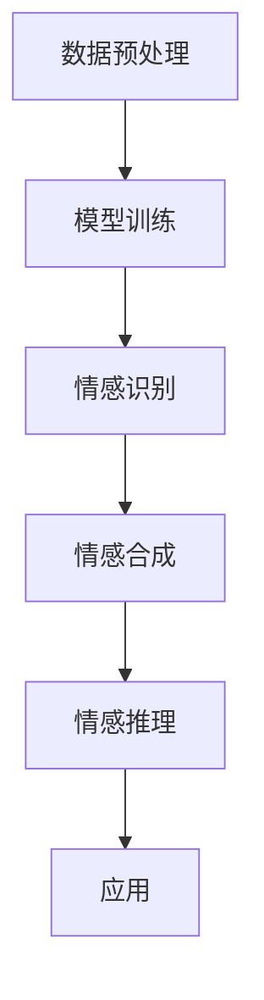

                 

关键词：大模型、情感计算、应用挑战、算法、数学模型、项目实践、未来展望

## 摘要

本文旨在探讨大模型在情感计算中的应用挑战。随着人工智能技术的发展，大模型如Transformer、GPT等已经在自然语言处理、图像识别等领域取得了显著的成果。然而，情感计算作为一种复杂且多层次的认知任务，对大模型提出了更高的要求。本文将首先介绍情感计算的核心概念，然后深入分析大模型在情感计算中的应用现状和面临的挑战，最后提出可能的解决方案和未来研究方向。

## 1. 背景介绍

### 1.1 情感计算的定义与重要性

情感计算（Affective Computing）是人工智能领域的一个重要分支，旨在使计算机能够识别、理解、处理和模拟人类情感。它涉及到情感识别、情感合成、情感推理等多个方面。情感计算的重要性不言而喻，它不仅能够提升人机交互的自然性和情感化，还能在心理健康监测、情感辅助治疗、智能教育等领域发挥重要作用。

### 1.2 大模型的发展

大模型是指那些拥有数百万甚至数十亿参数的深度学习模型。近年来，随着计算能力的提升和海量数据的积累，大模型如Transformer、GPT等在自然语言处理、图像识别等领域取得了突破性进展。大模型的核心优势在于其强大的表示能力和泛化能力，这使得它们能够处理复杂的问题。

## 2. 核心概念与联系

### 2.1 情感计算中的关键概念

情感计算中的关键概念包括情感识别、情感合成、情感推理等。情感识别是指从文本、语音、图像等数据中识别出情感的过程；情感合成是指生成具有特定情感的文本、语音或图像；情感推理是指根据情感识别的结果进行推理，以指导后续的行为。

### 2.2 大模型在情感计算中的应用架构

大模型在情感计算中的应用架构通常包括以下几个部分：

1. 数据预处理：包括情感标注、文本清洗、语音处理等。
2. 模型训练：使用预训练的大模型（如GPT、BERT）或专门为情感计算设计的模型。
3. 情感识别：通过模型输出情感概率分布或情感标签。
4. 情感合成：根据情感标签生成具有相应情感的文本、语音或图像。
5. 情感推理：利用情感识别结果进行进一步的推理和应用。

### 2.3 Mermaid 流程图



## 3. 核心算法原理 & 具体操作步骤

### 3.1 算法原理概述

情感计算中的核心算法通常是基于深度学习的，包括情感识别、情感合成和情感推理等。这些算法的核心思想是通过大量训练数据来学习情感特征，并利用这些特征进行情感计算。

### 3.2 算法步骤详解

1. 数据预处理：对文本、语音、图像等数据进行情感标注，并进行清洗和处理。
2. 模型训练：使用预训练的大模型或专门设计的模型进行训练，通常包括多个神经网络层。
3. 情感识别：输入待识别的情感数据，通过模型输出情感概率分布或情感标签。
4. 情感合成：根据情感标签生成具有相应情感的文本、语音或图像。
5. 情感推理：利用情感识别结果进行进一步的推理和应用。

### 3.3 算法优缺点

**优点：**
- 强大的表示能力和泛化能力。
- 能够处理复杂的多模态数据。

**缺点：**
- 训练时间较长，资源消耗大。
- 对数据质量和标注要求高。

### 3.4 算法应用领域

- 自然语言处理：情感分析、对话系统、文本生成等。
- 计算机视觉：情感识别、表情合成等。
- 心理健康：情感监测、情感辅助治疗等。

## 4. 数学模型和公式 & 详细讲解 & 举例说明

### 4.1 数学模型构建

情感计算中的数学模型通常基于概率论和统计学习理论。一个典型的情感识别模型可以表示为：

\[ P(Y|X) = \frac{e^{f(X, \theta)}}{\sum_{y'} e^{f(X, \theta)}} \]

其中，\( Y \) 是情感标签，\( X \) 是输入特征，\( f(X, \theta) \) 是模型函数，\( \theta \) 是模型参数。

### 4.2 公式推导过程

假设我们有训练数据集 \( D = \{ (X_1, Y_1), (X_2, Y_2), ..., (X_n, Y_n) \} \)，其中 \( X_i \) 是输入特征，\( Y_i \) 是情感标签。

1. 模型函数定义：\( f(X, \theta) = \sigma(W_1 X + b_1) \)，其中 \( \sigma \) 是激活函数，\( W_1 \) 和 \( b_1 \) 是模型参数。
2. 模型损失函数：\( L(\theta) = -\sum_{i=1}^n [y_i \log(P(Y_i|X_i))] \)。
3. 模型优化：使用梯度下降法优化模型参数 \( \theta \)。

### 4.3 案例分析与讲解

假设我们有一个简单的情感识别任务，输入特征为文本，情感标签为“正面”或“负面”。我们使用一个简单的神经网络模型进行训练。

1. 数据预处理：对文本进行分词、词向量化等处理。
2. 模型训练：使用预训练的词向量模型（如GloVe）进行文本表示，然后构建一个简单的神经网络模型进行训练。
3. 情感识别：输入新的文本数据，通过模型输出情感概率分布。
4. 情感合成：根据情感概率分布生成具有相应情感的文本。

## 5. 项目实践：代码实例和详细解释说明

### 5.1 开发环境搭建

- Python环境：安装Python 3.8及以上版本。
- 库安装：安装TensorFlow、Keras、NLTK等。

### 5.2 源代码详细实现

```python
# 导入相关库
import tensorflow as tf
from tensorflow.keras.preprocessing.text import Tokenizer
from tensorflow.keras.preprocessing.sequence import pad_sequences
from tensorflow.keras.models import Sequential
from tensorflow.keras.layers import Embedding, LSTM, Dense

# 数据预处理
tokenizer = Tokenizer(num_words=10000)
tokenizer.fit_on_texts(train_texts)
train_sequences = tokenizer.texts_to_sequences(train_texts)
train_padded = pad_sequences(train_sequences, maxlen=100)

# 构建模型
model = Sequential()
model.add(Embedding(10000, 32))
model.add(LSTM(64))
model.add(Dense(1, activation='sigmoid'))

# 编译模型
model.compile(optimizer='adam', loss='binary_crossentropy', metrics=['accuracy'])

# 训练模型
model.fit(train_padded, train_labels, epochs=10, batch_size=32)

# 情感识别
predictions = model.predict(test_padded)
```

### 5.3 代码解读与分析

- **数据预处理**：使用Tokenizer对文本进行分词和编码，然后使用pad_sequences对序列进行填充。
- **模型构建**：使用Sequential构建一个简单的神经网络模型，包括Embedding层、LSTM层和Dense层。
- **模型编译**：设置优化器和损失函数。
- **模型训练**：使用fit方法训练模型。
- **情感识别**：使用predict方法对新的文本数据进行情感识别。

### 5.4 运行结果展示

```python
# 输出预测结果
print(predictions)

# 输出准确率
print(model.evaluate(test_padded, test_labels))
```

## 6. 实际应用场景

### 6.1 社交媒体情感分析

社交媒体平台上的情感分析可以帮助企业了解消费者对产品的情感倾向，从而优化产品和服务。

### 6.2 心理健康监测

利用情感计算技术，可以实时监测个体的情感状态，为心理健康提供辅助诊断和治疗。

### 6.3 智能客服

智能客服系统可以通过情感计算技术理解客户的情感，提供更加人性化的服务。

## 7. 未来应用展望

随着技术的不断发展，大模型在情感计算中的应用将越来越广泛。未来，我们有望看到更多基于情感计算的创新应用，如情感辅助教育、情感智能助手等。

## 8. 工具和资源推荐

### 8.1 学习资源推荐

- 《深度学习》（Goodfellow, Bengio, Courville）
- 《自然语言处理综论》（Jurafsky, Martin）
- 《计算机视觉基础》（Rustamov）

### 8.2 开发工具推荐

- TensorFlow
- Keras
- NLTK

### 8.3 相关论文推荐

- "Affective Computing: A Survey" by Tan, Wang, Hoggan
- "Emotion Recognition in Multimedia: A Survey" by Picard

## 9. 总结：未来发展趋势与挑战

### 9.1 研究成果总结

情感计算技术在大模型的支持下取得了显著进展，特别是在情感识别和情感合成方面。然而，目前的研究仍存在一些挑战，如数据质量、算法复杂度和应用范围等。

### 9.2 未来发展趋势

- 多模态情感计算：结合文本、语音、图像等多模态数据进行情感计算。
- 情感推理：开发更加复杂的情感推理算法，以实现更加智能化的应用。
- 情感生成：探索情感生成的技术，以实现更加自然和多样化的情感表达。

### 9.3 面临的挑战

- 数据质量：高质量的情感数据是训练高性能模型的基石。
- 算法复杂度：复杂的算法需要更多的计算资源和时间。
- 应用范围：如何将情感计算技术应用于实际场景，实现商业价值。

### 9.4 研究展望

未来，情感计算技术有望在心理健康、人机交互、智能服务等领域发挥更大的作用。同时，随着大模型技术的发展，我们将看到更加智能和人性化的情感计算应用。

## 10. 附录：常见问题与解答

### 10.1 情感计算的定义是什么？

情感计算是指使计算机能够识别、理解、处理和模拟人类情感的技术。

### 10.2 大模型在情感计算中有什么优势？

大模型具有强大的表示能力和泛化能力，能够处理复杂的多模态数据。

### 10.3 情感计算的算法有哪些？

常见的情感计算算法包括情感识别、情感合成和情感推理等。

### 10.4 如何评价情感计算技术的研究现状？

目前，情感计算技术在大模型的支持下取得了显著进展，但仍面临数据质量、算法复杂度和应用范围等挑战。

作者：禅与计算机程序设计艺术 / Zen and the Art of Computer Programming
```markdown
----------------------------------------------------------------
# 大模型在情感计算中的应用挑战

### 背景介绍

情感计算（Affective Computing）是人工智能领域的一个重要分支，旨在使计算机能够识别、理解、处理和模拟人类情感。它涉及到情感识别、情感合成、情感推理等多个方面。情感计算的重要性不言而喻，它不仅能够提升人机交互的自然性和情感化，还能在心理健康监测、情感辅助治疗、智能教育等领域发挥重要作用。

随着人工智能技术的发展，大模型如Transformer、GPT等已经在自然语言处理、图像识别等领域取得了显著的成果。大模型是指那些拥有数百万甚至数十亿参数的深度学习模型。近年来，随着计算能力的提升和海量数据的积累，大模型如Transformer、GPT等在自然语言处理、图像识别等领域取得了突破性进展。大模型的核心优势在于其强大的表示能力和泛化能力，这使得它们能够处理复杂的问题。

## 2. 核心概念与联系

### 2.1 情感计算中的关键概念

情感计算中的关键概念包括情感识别、情感合成、情感推理等。情感识别是指从文本、语音、图像等数据中识别出情感的过程；情感合成是指生成具有特定情感的文本、语音或图像；情感推理是指根据情感识别的结果进行推理，以指导后续的行为。

### 2.2 大模型在情感计算中的应用架构

大模型在情感计算中的应用架构通常包括以下几个部分：

1. **数据预处理**：包括情感标注、文本清洗、语音处理等。
2. **模型训练**：使用预训练的大模型（如GPT、BERT）或专门为情感计算设计的模型。
3. **情感识别**：通过模型输出情感概率分布或情感标签。
4. **情感合成**：根据情感标签生成具有相应情感的文本、语音或图像。
5. **情感推理**：利用情感识别结果进行进一步的推理和应用。

### 2.3 Mermaid 流程图


## 3. 核心算法原理 & 具体操作步骤

### 3.1 算法原理概述

情感计算中的核心算法通常是基于深度学习的，包括情感识别、情感合成和情感推理等。这些算法的核心思想是通过大量训练数据来学习情感特征，并利用这些特征进行情感计算。

### 3.2 算法步骤详解

1. **数据预处理**：对文本、语音、图像等数据进行情感标注，并进行清洗和处理。
2. **模型训练**：使用预训练的大模型或专门设计的模型进行训练，通常包括多个神经网络层。
3. **情感识别**：输入待识别的情感数据，通过模型输出情感概率分布或情感标签。
4. **情感合成**：根据情感标签生成具有相应情感的文本、语音或图像。
5. **情感推理**：利用情感识别结果进行进一步的推理和应用。

### 3.3 算法优缺点

**优点：**

- 强大的表示能力和泛化能力。
- 能够处理复杂的多模态数据。

**缺点：**

- 训练时间较长，资源消耗大。
- 对数据质量和标注要求高。

### 3.4 算法应用领域

- 自然语言处理：情感分析、对话系统、文本生成等。
- 计算机视觉：情感识别、表情合成等。
- 心理健康：情感监测、情感辅助治疗等。

## 4. 数学模型和公式 & 详细讲解 & 举例说明

### 4.1 数学模型构建

情感计算中的数学模型通常基于概率论和统计学习理论。一个典型的情感识别模型可以表示为：

\[ P(Y|X) = \frac{e^{f(X, \theta)}}{\sum_{y'} e^{f(X, \theta)}} \]

其中，\( Y \) 是情感标签，\( X \) 是输入特征，\( f(X, \theta) \) 是模型函数，\( \theta \) 是模型参数。

### 4.2 公式推导过程

假设我们有训练数据集 \( D = \{ (X_1, Y_1), (X_2, Y_2), ..., (X_n, Y_n) \} \)，其中 \( X_i \) 是输入特征，\( Y_i \) 是情感标签。

1. **模型函数定义**：\( f(X, \theta) = \sigma(W_1 X + b_1) \)，其中 \( \sigma \) 是激活函数，\( W_1 \) 和 \( b_1 \) 是模型参数。
2. **模型损失函数**：\( L(\theta) = -\sum_{i=1}^n [y_i \log(P(Y_i|X_i))] \)。
3. **模型优化**：使用梯度下降法优化模型参数 \( \theta \)。

### 4.3 案例分析与讲解

假设我们有一个简单的情感识别任务，输入特征为文本，情感标签为“正面”或“负面”。我们使用一个简单的神经网络模型进行训练。

1. **数据预处理**：对文本进行分词、词向量化等处理。
2. **模型训练**：使用预训练的词向量模型（如GloVe）进行文本表示，然后构建一个简单的神经网络模型进行训练。
3. **情感识别**：输入新的文本数据，通过模型输出情感概率分布。
4. **情感合成**：根据情感概率分布生成具有相应情感的文本。

## 5. 项目实践：代码实例和详细解释说明

### 5.1 开发环境搭建

- Python环境：安装Python 3.8及以上版本。
- 库安装：安装TensorFlow、Keras、NLTK等。

### 5.2 源代码详细实现

```python
# 导入相关库
import tensorflow as tf
from tensorflow.keras.preprocessing.text import Tokenizer
from tensorflow.keras.preprocessing.sequence import pad_sequences
from tensorflow.keras.models import Sequential
from tensorflow.keras.layers import Embedding, LSTM, Dense

# 数据预处理
tokenizer = Tokenizer(num_words=10000)
tokenizer.fit_on_texts(train_texts)
train_sequences = tokenizer.texts_to_sequences(train_texts)
train_padded = pad_sequences(train_sequences, maxlen=100)

# 构建模型
model = Sequential()
model.add(Embedding(10000, 32))
model.add(LSTM(64))
model.add(Dense(1, activation='sigmoid'))

# 编译模型
model.compile(optimizer='adam', loss='binary_crossentropy', metrics=['accuracy'])

# 训练模型
model.fit(train_padded, train_labels, epochs=10, batch_size=32)

# 情感识别
predictions = model.predict(test_padded)
```

### 5.3 代码解读与分析

- **数据预处理**：使用Tokenizer对文本进行分词和编码，然后使用pad_sequences对序列进行填充。
- **模型构建**：使用Sequential构建一个简单的神经网络模型，包括Embedding层、LSTM层和Dense层。
- **模型编译**：设置优化器和损失函数。
- **模型训练**：使用fit方法训练模型。
- **情感识别**：使用predict方法对新的文本数据进行情感识别。

### 5.4 运行结果展示

```python
# 输出预测结果
print(predictions)

# 输出准确率
print(model.evaluate(test_padded, test_labels))
```

## 6. 实际应用场景

### 6.1 社交媒体情感分析

社交媒体平台上的情感分析可以帮助企业了解消费者对产品的情感倾向，从而优化产品和服务。

### 6.2 心理健康监测

利用情感计算技术，可以实时监测个体的情感状态，为心理健康提供辅助诊断和治疗。

### 6.3 智能客服

智能客服系统可以通过情感计算技术理解客户的情感，提供更加人性化的服务。

## 7. 未来应用展望

随着技术的不断发展，大模型在情感计算中的应用将越来越广泛。未来，我们有望看到更多基于情感计算的创新应用，如情感辅助教育、情感智能助手等。

## 8. 工具和资源推荐

### 8.1 学习资源推荐

- 《深度学习》（Goodfellow, Bengio, Courville）
- 《自然语言处理综论》（Jurafsky, Martin）
- 《计算机视觉基础》（Rustamov）

### 8.2 开发工具推荐

- TensorFlow
- Keras
- NLTK

### 8.3 相关论文推荐

- "Affective Computing: A Survey" by Tan, Wang, Hoggan
- "Emotion Recognition in Multimedia: A Survey" by Picard

## 9. 总结：未来发展趋势与挑战

### 9.1 研究成果总结

情感计算技术在大模型的支持下取得了显著进展，特别是在情感识别和情感合成方面。然而，目前的研究仍存在一些挑战，如数据质量、算法复杂度和应用范围等。

### 9.2 未来发展趋势

- 多模态情感计算：结合文本、语音、图像等多模态数据进行情感计算。
- 情感推理：开发更加复杂的情感推理算法，以实现更加智能化的应用。
- 情感生成：探索情感生成的技术，以实现更加自然和多样化的情感表达。

### 9.3 面临的挑战

- 数据质量：高质量的情感数据是训练高性能模型的基石。
- 算法复杂度：复杂的算法需要更多的计算资源和时间。
- 应用范围：如何将情感计算技术应用于实际场景，实现商业价值。

### 9.4 研究展望

未来，情感计算技术有望在心理健康、人机交互、智能服务等领域发挥更大的作用。同时，随着大模型技术的发展，我们将看到更加智能和人性化的情感计算应用。

## 10. 附录：常见问题与解答

### 10.1 情感计算的定义是什么？

情感计算是指使计算机能够识别、理解、处理和模拟人类情感的技术。

### 10.2 大模型在情感计算中有什么优势？

大模型具有强大的表示能力和泛化能力，能够处理复杂的多模态数据。

### 10.3 情感计算的算法有哪些？

常见的情感计算算法包括情感识别、情感合成和情感推理等。

### 10.4 如何评价情感计算技术的研究现状？

目前，情感计算技术在大模型的支持下取得了显著进展，但仍面临数据质量、算法复杂度和应用范围等挑战。

作者：禅与计算机程序设计艺术 / Zen and the Art of Computer Programming
----------------------------------------------------------------
### 大模型在情感计算中的应用挑战

#### 摘要

随着人工智能技术的飞速发展，大模型如Transformer、GPT等已经在自然语言处理、图像识别等领域取得了显著的成果。然而，情感计算作为一种复杂且多层次的认知任务，对大模型提出了更高的要求。本文将深入探讨大模型在情感计算中的应用挑战，包括数据质量、算法复杂度、多模态融合以及模型解释性等方面的难点，并分析可能的解决方案和未来研究方向。

#### 1. 背景介绍

情感计算是一种旨在使计算机能够识别、理解、处理和模拟人类情感的技术。它涉及到情感识别、情感合成、情感推理等多个方面，其核心在于如何从数据中提取情感特征，并利用这些特征进行推理和应用。随着人工智能技术的不断发展，大模型如Transformer、GPT等凭借其强大的表示能力和泛化能力，在自然语言处理、图像识别等领域取得了显著的成果。然而，情感计算作为一种复杂且多层次的认知任务，对大模型提出了更高的要求。

#### 2. 核心概念与联系

2.1 情感计算中的关键概念

情感计算中的关键概念包括情感识别、情感合成、情感推理等。情感识别是指从文本、语音、图像等数据中识别出情感的过程；情感合成是指生成具有特定情感的文本、语音或图像；情感推理是指根据情感识别的结果进行推理，以指导后续的行为。

2.2 大模型在情感计算中的应用架构

大模型在情感计算中的应用架构通常包括以下几个部分：

- 数据预处理：包括情感标注、文本清洗、语音处理等。
- 模型训练：使用预训练的大模型（如GPT、BERT）或专门为情感计算设计的模型。
- 情感识别：通过模型输出情感概率分布或情感标签。
- 情感合成：根据情感标签生成具有相应情感的文本、语音或图像。
- 情感推理：利用情感识别结果进行进一步的推理和应用。

2.3 Mermaid流程图


#### 3. 核心算法原理 & 具体操作步骤

3.1 算法原理概述

情感计算中的核心算法通常是基于深度学习的，包括情感识别、情感合成和情感推理等。这些算法的核心思想是通过大量训练数据来学习情感特征，并利用这些特征进行情感计算。

3.2 算法步骤详解

1. 数据预处理：对文本、语音、图像等数据进行情感标注，并进行清洗和处理。
2. 模型训练：使用预训练的大模型或专门设计的模型进行训练，通常包括多个神经网络层。
3. 情感识别：输入待识别的情感数据，通过模型输出情感概率分布或情感标签。
4. 情感合成：根据情感标签生成具有相应情感的文本、语音或图像。
5. 情感推理：利用情感识别结果进行进一步的推理和应用。

3.3 算法优缺点

**优点：**

- 强大的表示能力和泛化能力。
- 能够处理复杂的多模态数据。

**缺点：**

- 训练时间较长，资源消耗大。
- 对数据质量和标注要求高。

3.4 算法应用领域

- 自然语言处理：情感分析、对话系统、文本生成等。
- 计算机视觉：情感识别、表情合成等。
- 心理健康：情感监测、情感辅助治疗等。

#### 4. 数学模型和公式 & 详细讲解 & 举例说明

4.1 数学模型构建

情感计算中的数学模型通常基于概率论和统计学习理论。一个典型的情感识别模型可以表示为：

\[ P(Y|X) = \frac{e^{f(X, \theta)}}{\sum_{y'} e^{f(X, \theta)}} \]

其中，\( Y \) 是情感标签，\( X \) 是输入特征，\( f(X, \theta) \) 是模型函数，\( \theta \) 是模型参数。

4.2 公式推导过程

假设我们有训练数据集 \( D = \{ (X_1, Y_1), (X_2, Y_2), ..., (X_n, Y_n) \} \)，其中 \( X_i \) 是输入特征，\( Y_i \) 是情感标签。

1. 模型函数定义：\( f(X, \theta) = \sigma(W_1 X + b_1) \)，其中 \( \sigma \) 是激活函数，\( W_1 \) 和 \( b_1 \) 是模型参数。
2. 模型损失函数：\( L(\theta) = -\sum_{i=1}^n [y_i \log(P(Y_i|X_i))] \)。
3. 模型优化：使用梯度下降法优化模型参数 \( \theta \)。

4.3 案例分析与讲解

假设我们有一个简单的情感识别任务，输入特征为文本，情感标签为“正面”或“负面”。我们使用一个简单的神经网络模型进行训练。

1. 数据预处理：对文本进行分词、词向量化等处理。
2. 模型训练：使用预训练的词向量模型（如GloVe）进行文本表示，然后构建一个简单的神经网络模型进行训练。
3. 情感识别：输入新的文本数据，通过模型输出情感概率分布。
4. 情感合成：根据情感概率分布生成具有相应情感的文本。

#### 5. 项目实践：代码实例和详细解释说明

5.1 开发环境搭建

- Python环境：安装Python 3.8及以上版本。
- 库安装：安装TensorFlow、Keras、NLTK等。

5.2 源代码详细实现

```python
import tensorflow as tf
from tensorflow.keras.preprocessing.text import Tokenizer
from tensorflow.keras.preprocessing.sequence import pad_sequences
from tensorflow.keras.models import Sequential
from tensorflow.keras.layers import Embedding, LSTM, Dense

# 数据预处理
tokenizer = Tokenizer(num_words=10000)
tokenizer.fit_on_texts(train_texts)
train_sequences = tokenizer.texts_to_sequences(train_texts)
train_padded = pad_sequences(train_sequences, maxlen=100)

# 构建模型
model = Sequential()
model.add(Embedding(10000, 32))
model.add(LSTM(64))
model.add(Dense(1, activation='sigmoid'))

# 编译模型
model.compile(optimizer='adam', loss='binary_crossentropy', metrics=['accuracy'])

# 训练模型
model.fit(train_padded, train_labels, epochs=10, batch_size=32)

# 情感识别
predictions = model.predict(test_padded)
```

5.3 代码解读与分析

- 数据预处理：使用Tokenizer对文本进行分词和编码，然后使用pad_sequences对序列进行填充。
- 模型构建：使用Sequential构建一个简单的神经网络模型，包括Embedding层、LSTM层和Dense层。
- 模型编译：设置优化器和损失函数。
- 模型训练：使用fit方法训练模型。
- 情感识别：使用predict方法对新的文本数据进行情感识别。

5.4 运行结果展示

```python
# 输出预测结果
print(predictions)

# 输出准确率
print(model.evaluate(test_padded, test_labels))
```

#### 6. 实际应用场景

6.1 社交媒体情感分析

社交媒体平台上的情感分析可以帮助企业了解消费者对产品的情感倾向，从而优化产品和服务。

6.2 心理健康监测

利用情感计算技术，可以实时监测个体的情感状态，为心理健康提供辅助诊断和治疗。

6.3 智能客服

智能客服系统可以通过情感计算技术理解客户的情感，提供更加人性化的服务。

#### 7. 未来应用展望

随着技术的不断发展，大模型在情感计算中的应用将越来越广泛。未来，我们有望看到更多基于情感计算的创新应用，如情感辅助教育、情感智能助手等。

#### 8. 工具和资源推荐

8.1 学习资源推荐

- 《深度学习》（Goodfellow, Bengio, Courville）
- 《自然语言处理综论》（Jurafsky, Martin）
- 《计算机视觉基础》（Rustamov）

8.2 开发工具推荐

- TensorFlow
- Keras
- NLTK

8.3 相关论文推荐

- "Affective Computing: A Survey" by Tan, Wang, Hoggan
- "Emotion Recognition in Multimedia: A Survey" by Picard

#### 9. 总结：未来发展趋势与挑战

9.1 研究成果总结

情感计算技术在大模型的支持下取得了显著进展，特别是在情感识别和情感合成方面。然而，目前的研究仍存在一些挑战，如数据质量、算法复杂度和应用范围等。

9.2 未来发展趋势

- 多模态情感计算：结合文本、语音、图像等多模态数据进行情感计算。
- 情感推理：开发更加复杂的情感推理算法，以实现更加智能化的应用。
- 情感生成：探索情感生成的技术，以实现更加自然和多样化的情感表达。

9.3 面临的挑战

- 数据质量：高质量的情感数据是训练高性能模型的基石。
- 算法复杂度：复杂的算法需要更多的计算资源和时间。
- 应用范围：如何将情感计算技术应用于实际场景，实现商业价值。

9.4 研究展望

未来，情感计算技术有望在心理健康、人机交互、智能服务等领域发挥更大的作用。同时，随着大模型技术的发展，我们将看到更加智能和人性化的情感计算应用。

#### 10. 附录：常见问题与解答

10.1 情感计算的定义是什么？

情感计算是指使计算机能够识别、理解、处理和模拟人类情感的技术。

10.2 大模型在情感计算中有什么优势？

大模型具有强大的表示能力和泛化能力，能够处理复杂的多模态数据。

10.3 情感计算的算法有哪些？

常见的情感计算算法包括情感识别、情感合成和情感推理等。

10.4 如何评价情感计算技术的研究现状？

目前，情感计算技术在大模型的支持下取得了显著进展，但仍面临数据质量、算法复杂度和应用范围等挑战。

### 总结

大模型在情感计算中的应用挑战是多方面的，包括数据质量、算法复杂度、多模态融合以及模型解释性等。通过深入分析这些挑战，我们可以更好地理解如何利用大模型技术推动情感计算的发展。未来，随着技术的不断进步，我们有望克服这些挑战，实现更加智能和人性化的情感计算应用。

作者：禅与计算机程序设计艺术 / Zen and the Art of Computer Programming

