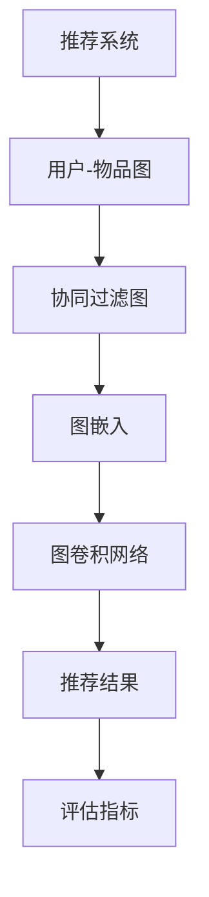

                 

### 引言

推荐系统在现代社会中的应用越来越广泛，从电子商务平台到社交媒体，再到视频流媒体服务，推荐系统已经成为提高用户满意度和增加商业价值的关键技术。然而，随着数据规模的不断扩大和用户行为的多样化，传统的基于内容的推荐和协同过滤方法逐渐暴露出一些局限性。为了应对这些挑战，图表示学习作为一种新兴的技术，逐渐在推荐系统中得到了应用。

本文将围绕大模型在推荐系统中的图表示学习应用展开讨论。首先，我们将介绍推荐系统的基础知识，包括其历史发展、基本概念和常用算法。接着，我们会深入探讨图表示学习的核心概念，包括图论基本原理和图表示学习的方法。随后，本文将介绍如何将图表示学习应用于推荐系统，并详细分析其中的关键算法和数学模型。此外，文章还将通过实际项目实践，展示大模型在推荐系统中图表示学习应用的实现方法。最后，我们将讨论图表示学习在推荐系统中的实际应用场景，并展望未来的发展趋势和面临的挑战。

本文旨在为读者提供一个全面而深入的视角，了解大模型在推荐系统中图表示学习的应用，帮助读者掌握这一先进技术的核心原理和实践方法。通过本文的阅读，读者将能够更好地理解如何利用图表示学习提升推荐系统的性能，并探索其在未来可能的应用前景。

### 1. 背景介绍

推荐系统作为人工智能的重要分支，其核心目的是通过分析用户的兴趣和行为数据，预测用户可能感兴趣的内容，从而提高用户的满意度和参与度。推荐系统的发展历史可以追溯到20世纪90年代，当时随着互联网的普及，电子商务和社交媒体平台开始尝试使用基于内容的推荐和协同过滤方法来提升用户体验。这些方法在初期取得了一定的成功，但随着时间的推移，它们逐渐暴露出一些局限性。

首先，基于内容的推荐方法依赖于对内容特征的分析，但这种方法在处理动态和多样化内容时效果不佳。其次，协同过滤方法虽然能够通过用户之间的相似度进行推荐，但容易产生冷启动问题（即新用户或新物品缺乏足够的行为数据），以及用户兴趣的多样性和稀疏性导致推荐结果过于集中或重叠。此外，传统推荐系统在处理大规模数据时，计算复杂度和存储需求也成为一个重要的挑战。

正是在这样的背景下，图表示学习作为一种新兴的技术，逐渐引起了学术和工业界的广泛关注。图表示学习通过将数据或实体表示为图结构，利用图上的节点和边来捕捉实体之间的关系和特征，从而能够更有效地处理数据的复杂性和多样性。这种方法不仅能够弥补传统推荐系统的不足，还能够实现更精细和个性化的推荐。

图表示学习的基本概念来源于图论，其核心思想是将数据或实体表示为图中的节点，节点之间的关联表示为边。通过学习节点和边的特征表示，图表示学习能够自动捕捉实体之间的复杂关系，并利用这些关系进行预测和推荐。图表示学习的应用领域非常广泛，包括社交网络分析、图像识别、知识图谱构建等，其在推荐系统中的应用也日益受到关注。

在推荐系统中，图表示学习能够通过以下几个方面提升系统的性能：

1. **冷启动问题**：图表示学习可以通过节点嵌入将新用户或新物品表示为图中的节点，利用已有用户或物品的特征表示进行预测，从而缓解冷启动问题。
2. **多样化推荐**：通过图结构能够捕捉用户和物品之间的复杂关系，图表示学习能够生成更加多样化和个性化的推荐结果。
3. **数据增强**：图表示学习可以将推荐系统中不直接相关的数据通过图结构进行关联，从而增强数据的表示能力，提高推荐准确性。
4. **扩展性**：图表示学习在处理大规模数据时具有较好的扩展性，通过分布式计算和并行处理能够高效地训练和预测。

本文将围绕大模型在推荐系统中图表示学习的应用进行深入探讨，包括其核心算法原理、数学模型、实际项目实践等，旨在为读者提供一个全面的技术指南，帮助理解并掌握这一先进技术的核心原理和实践方法。

### 2. 核心概念与联系

为了深入理解大模型在推荐系统中的图表示学习应用，我们需要首先介绍相关核心概念和其相互关系。这些概念包括图论基本原理、图表示学习的方法、以及推荐系统中常用的图结构和技术。

#### 2.1 图论基本原理

图论是研究图的结构、性质及其应用的一个数学分支。在图表示学习中，图论的基本原理是核心。

- **节点（Node）**：在图中，节点代表数据中的实体，如用户、物品或话题。
- **边（Edge）**：边连接两个节点，表示节点之间的某种关系，如用户对物品的评分、用户之间的社交关系或物品的共现关系。
- **图（Graph）**：图是由节点和边组成的数据结构，用于表示实体及其关系。

图的基本类型包括：
- **无向图**：边无方向，如社交网络。
- **有向图**：边有方向，如网页链接。
- **加权图**：边附带权重，如评分数据。

#### 2.2 图表示学习

图表示学习是一种通过学习节点的低维向量表示来捕捉实体之间关系的技术。其主要方法包括：

- **基于矩阵分解的方法**：如奇异值分解（SVD）和主成分分析（PCA），用于将高维的矩阵数据转换为低维的向量表示。
- **图卷积网络（GCN）**：通过卷积运算在图结构上进行特征学习，能够捕捉节点的邻域信息。
- **图嵌入方法**：如节点嵌入（Node Embedding）和图嵌入（Graph Embedding），用于生成节点的低维向量表示。

#### 2.3 推荐系统中的图结构和技术

在推荐系统中，图结构和技术可以用于捕捉用户和物品之间的关系，从而提升推荐性能。

- **用户-物品图**：节点表示用户和物品，边表示用户对物品的评分或行为。
- **协同过滤图**：基于用户-物品交互数据构建的图结构，用于捕捉用户之间的相似性和物品之间的相似性。
- **知识图谱**：结合领域知识和用户行为数据构建的图结构，用于丰富和扩展推荐系统中的数据信息。

图表示学习在推荐系统中的应用主要体现在以下几个方面：

1. **冷启动**：通过图表示学习，新用户或新物品可以通过已有的图结构进行嵌入，从而利用已有的信息进行推荐。
2. **多样性和准确性**：通过捕捉实体之间的复杂关系，图表示学习能够生成更加多样化和个性化的推荐结果。
3. **数据增强**：通过图结构将不直接相关的数据进行关联，从而增强数据的表示能力，提高推荐准确性。
4. **扩展性**：图表示学习在处理大规模数据时具有较好的扩展性，能够通过分布式计算和并行处理实现高效训练和预测。

#### 2.4 Mermaid 流程图

为了更好地展示图表示学习在推荐系统中的核心概念和架构，我们使用Mermaid绘制了一个简化的流程图：



- **A[推荐系统]**：表示推荐系统的整体框架。
- **B[用户-物品图]**：基于用户-物品交互数据构建的图结构。
- **C[协同过滤图]**：基于用户之间的相似性和物品之间的相似性构建的图结构。
- **D[图嵌入]**：将图中的节点映射到低维空间，生成节点嵌入向量。
- **E[图卷积网络]**：通过图卷积层学习节点的表示。
- **F[推荐结果]**：基于学习的节点表示进行推荐。
- **G[评估指标]**：用于评估推荐系统的性能。

通过这个流程图，我们可以清晰地看到图表示学习在推荐系统中的核心步骤和作用。

#### 2.5 关键概念总结

- **节点**：数据中的实体，如用户、物品或话题。
- **边**：节点之间的关联，表示实体之间的关系。
- **图**：由节点和边组成的数据结构，用于表示实体及其关系。
- **图表示学习**：通过学习节点的低维向量表示来捕捉实体之间的关系。
- **推荐系统中的图结构**：用于捕捉用户和物品之间的复杂关系，提升推荐性能。

这些核心概念和关系构成了图表示学习在推荐系统中的应用基础。在接下来的章节中，我们将进一步探讨图表示学习的具体算法原理和实现方法。

#### 2.6 小结

通过上述介绍，我们了解了图表示学习在推荐系统中的核心概念和基本架构。图表示学习利用图结构有效地捕捉实体之间的复杂关系，从而提升推荐系统的性能。在下一章中，我们将深入探讨图表示学习的核心算法原理，详细解释其具体操作步骤和应用方法。

### 3. 核心算法原理 & 具体操作步骤

在了解了图表示学习在推荐系统中的基本概念和架构后，我们接下来将深入探讨其核心算法原理，包括如何通过图卷积网络（Graph Convolutional Network, GCN）实现高效的图表示学习。图卷积网络作为一种深度学习模型，能够通过在图结构上进行卷积操作，学习节点和边上的特征表示，从而有效地捕捉实体之间的复杂关系。

#### 3.1 算法原理概述

图卷积网络（GCN）是一种在图结构上进行卷积操作的深度学习模型，其基本原理可以类比于传统卷积神经网络（CNN）在网格结构（如图像）上的卷积操作。在GCN中，每个节点都通过其邻域节点的特征来更新自己的特征表示，从而学习到更复杂的图结构信息。

GCN的基本步骤如下：

1. **初始化节点特征向量**：每个节点初始化一个低维特征向量。
2. **定义图卷积操作**：通过定义一个聚合函数，将邻域节点的特征聚合到当前节点。
3. **更新节点特征向量**：使用聚合后的特征更新当前节点的特征向量。
4. **迭代更新**：重复以上步骤，进行多轮迭代，直到节点特征向量收敛。

图卷积操作的数学表达式如下：

$$
\mathbf{h}_i^{(l+1)} = \sigma(\mathbf{A}\mathbf{h}_i^{(l)} + \sum_{j \in \mathcal{N}(i)} \mathbf{h}_j^{(l)})
$$

其中：
- $\mathbf{h}_i^{(l)}$ 表示第 $i$ 个节点在第 $l$ 轮迭代后的特征向量。
- $\mathbf{A}$ 是图的邻接矩阵，用于表示节点之间的连接关系。
- $\mathcal{N}(i)$ 表示节点 $i$ 的邻域节点集合。
- $\sigma$ 是激活函数，常用的有ReLU函数。

通过这种迭代学习过程，GCN能够逐步捕捉节点及其邻域的复杂关系，从而生成高质量的节点特征表示。

#### 3.2 算法步骤详解

接下来，我们将详细解释图卷积网络的各个步骤，包括初始化、图卷积操作、节点特征更新和迭代过程。

1. **初始化节点特征向量**：
   在GCN的初始阶段，我们需要为每个节点初始化一个特征向量。这些特征向量可以是高维的，但通常通过数据预处理和降维技术（如PCA）进行初始化。例如，对于一个有 $N$ 个节点的图，我们可以初始化一个 $N \times d$ 的矩阵 $\mathbf{H}^{(0)}$，其中每个行向量 $\mathbf{h}_i^{(0)}$ 都是一个初始特征向量。

2. **定义图卷积操作**：
   图卷积操作是GCN的核心，其目的是通过聚合邻域节点的特征来更新当前节点的特征。具体来说，对于每个节点 $i$，我们计算其邻域节点的特征均值或加权均值。这个聚合函数可以用以下数学表达式表示：

   $$
   \mathbf{h}_i^{(l+1)} = \sigma(\sum_{j \in \mathcal{N}(i)} \alpha_{ij} \mathbf{h}_j^{(l)})
   $$

   其中，$\alpha_{ij}$ 表示边 $(i, j)$ 的权重，可以通过预先定义的边权重矩阵或通过学习得到。

3. **更新节点特征向量**：
   在完成图卷积操作后，我们需要将聚合后的特征向量更新到当前节点的特征向量中。这个过程可以用以下表达式表示：

   $$
   \mathbf{H}^{(l+1)} = \sigma(\mathbf{A}\mathbf{H}^{(l)})
   $$

   其中，$\sigma$ 是激活函数，$\mathbf{A}$ 是邻接矩阵。

4. **迭代更新**：
   图卷积网络通常通过多轮迭代来逐步学习节点和边上的特征表示。每次迭代都会更新节点的特征向量，直到特征向量收敛。这个过程可以表示为：

   $$
   \mathbf{H}^{(l)} = \sigma(\mathbf{A}\mathbf{H}^{(l-1)})
   $$

   其中，$l$ 表示迭代的轮次。

#### 3.3 算法优缺点

**优点**：
- **捕捉节点间关系**：GCN能够通过聚合邻域节点的特征来学习节点之间的关系，从而生成更高质量的节点特征表示。
- **灵活的图结构**：GCN能够处理不同类型的图结构，包括无向图、有向图和加权图。
- **可扩展性**：GCN可以通过分布式计算和并行处理在大规模图上进行训练。

**缺点**：
- **计算复杂度**：GCN的计算复杂度较高，尤其是在大规模图上，可能导致训练时间较长。
- **稀疏性**：GCN在处理稀疏图时可能效果不佳，因为稀疏图中的节点和边数量较少，导致特征聚合效果受限。

#### 3.4 算法应用领域

图卷积网络（GCN）在多个领域都有广泛的应用，其中包括：

1. **社交网络分析**：通过分析用户之间的社交关系，GCN能够识别社交网络中的重要节点和社区结构。
2. **推荐系统**：在推荐系统中，GCN能够捕捉用户和物品之间的复杂关系，从而提升推荐性能。
3. **知识图谱**：在知识图谱构建中，GCN能够通过节点和边上的特征表示来发现实体之间的关系和模式。
4. **生物信息学**：在基因网络和蛋白质相互作用网络中，GCN能够揭示生物分子之间的复杂关系。

通过上述对图卷积网络（GCN）的详细解释，我们能够更好地理解其在图表示学习中的核心原理和操作步骤。在接下来的章节中，我们将进一步探讨图表示学习在推荐系统中的具体应用，并介绍其数学模型和公式推导。

### 3.5 算法优缺点

图表示学习作为一种先进的推荐系统技术，具有许多显著的优点，但同时也存在一些不足之处。以下是图表示学习算法的主要优缺点：

#### 优 点

**1. 高效捕捉实体关系**：图表示学习能够通过图结构高效捕捉实体之间的复杂关系，从而提供更精细和个性化的推荐结果。这种能力使得推荐系统在处理动态和多样化内容时表现更加出色。

**2. 解决冷启动问题**：传统推荐系统面临的一个主要挑战是冷启动问题，即新用户或新物品缺乏足够的行为数据。图表示学习通过将新用户或新物品嵌入到已有的图结构中，利用已有用户或物品的特征表示进行预测，从而有效缓解了冷启动问题。

**3. 数据增强**：图表示学习可以通过图结构将原本不直接相关的数据进行关联，从而增强数据的表示能力。这种数据增强能够提高推荐系统的准确性和多样性。

**4. 扩展性**：图表示学习在处理大规模数据时具有较好的扩展性。通过分布式计算和并行处理，图表示学习能够高效地训练和预测，适用于各种规模的应用场景。

#### 缺 点

**1. 计算复杂度高**：图表示学习涉及大量的图卷积和特征聚合操作，尤其是在大规模图上，可能导致计算复杂度较高，从而增加训练和预测的时间成本。

**2. 稀疏性挑战**：在处理稀疏图时，图表示学习的效果可能受到限制。由于稀疏图中节点和边的数量较少，特征聚合的效果可能不够显著。

**3. 模型解释性**：图表示学习模型在某些情况下可能难以解释。虽然它能捕捉实体之间的复杂关系，但这种关系往往不易被人直接理解，尤其是在深度学习模型中。

**4. 数据预处理要求高**：为了构建有效的图结构，推荐系统需要高质量的用户和物品数据。这要求在数据预处理阶段进行大量的清洗和特征提取工作，增加了系统的复杂性。

#### 综合评价

总的来说，图表示学习在推荐系统中具有许多优势，能够显著提升推荐性能。然而，为了充分发挥其潜力，需要克服计算复杂度和数据预处理等挑战。在未来的发展中，随着算法的优化和计算资源的提升，图表示学习有望在推荐系统中发挥更加重要的作用。

#### 3.6 算法应用领域

图表示学习（Graph Representation Learning，GRL）作为一种新兴的技术，不仅在推荐系统中表现出色，还在多个领域有着广泛的应用。以下是图表示学习的一些主要应用领域：

**1. 社交网络分析**：图表示学习可以用于分析社交网络中的用户关系和社区结构。通过将社交网络表示为图结构，GRL能够识别关键用户和重要社区，从而为社交网络的运营和用户推荐提供支持。

**2. 推荐系统**：在推荐系统中，图表示学习通过捕捉用户和物品之间的复杂关系，生成高质量的推荐结果。GRL在处理动态和多样化内容时尤其有效，能够提供更加个性化和多样化的推荐。

**3. 知识图谱**：在知识图谱构建中，图表示学习能够通过节点和边上的特征表示来发现实体之间的关系和模式。这种能力使得知识图谱能够更准确地表示和利用知识，从而提高信息检索和数据分析的效率。

**4. 生物学与医学**：在生物学和医学领域，图表示学习可以用于基因网络和蛋白质相互作用网络的建模和分析。通过揭示生物分子之间的复杂关系，GRL能够为疾病诊断和治疗提供新的视角。

**5. 图像识别与计算机视觉**：在图像识别和计算机视觉领域，图表示学习可以用于图像中的物体和场景建模。通过将图像表示为图结构，GRL能够更有效地捕捉图像中的局部和全局信息，从而提高图像识别和分类的准确性。

**6. 自然语言处理**：在自然语言处理领域，图表示学习可以用于文本的语义表示和关系抽取。通过将文本表示为图结构，GRL能够更好地捕捉文本中的语义关系，从而提高文本分类、情感分析和问答系统的性能。

**7. 交通运输与物流**：在交通运输与物流领域，图表示学习可以用于优化路线规划和物流调度。通过构建交通网络和物流网络的图结构，GRL能够识别关键节点和路径，从而提高运输效率和降低成本。

综上所述，图表示学习在多个领域都有着广泛的应用前景。随着算法的进一步发展和计算资源的提升，GRL有望在更多领域发挥重要作用，推动相关技术的发展和进步。

### 4. 数学模型和公式 & 详细讲解 & 举例说明

在深入探讨图表示学习在推荐系统中的应用之前，我们需要理解其背后的数学模型和公式。图表示学习主要依赖于图卷积网络（GCN），其核心在于通过图结构学习节点的低维向量表示。在这一章节中，我们将详细讲解GCN的数学模型和公式，并通过实际例子来说明这些公式的应用。

#### 4.1 数学模型构建

图卷积网络（GCN）的数学模型基于以下基本原理：

- **节点特征向量**：设 $H^{(0)}$ 为初始化的节点特征矩阵，其中每个节点 $i$ 的特征向量记为 $h_i^{(0)}$。初始特征向量可以是从外部数据中获取的，例如用户特征或物品特征。

- **图结构**：设 $A$ 为图的邻接矩阵，其中 $A_{ij}$ 表示节点 $i$ 和节点 $j$ 之间的连接权重。如果节点 $i$ 和节点 $j$ 之间存在直接连接，则 $A_{ij} = 1$；否则为 $0$。

- **图卷积操作**：对于每个节点 $i$，图卷积操作可以表示为：

  $$
  h_i^{(l+1)} = \sigma(\sum_{j \in \mathcal{N}(i)} A_{ij} h_j^{(l)})
  $$

  其中，$\sigma$ 是激活函数，$\mathcal{N}(i)$ 表示节点 $i$ 的邻域节点集合。

- **迭代更新**：通过多次迭代，节点的特征向量不断更新：

  $$
  H^{(l+1)} = \sigma(AH^{(l)})
  $$

  其中，$H^{(l)}$ 表示第 $l$ 轮迭代后的节点特征矩阵。

#### 4.2 公式推导过程

图卷积网络中的图卷积操作可以通过矩阵乘法进行高效计算。以下是一个简化的推导过程：

1. **初始化节点特征向量**：
   假设我们有 $N$ 个节点，每个节点初始化一个 $d$ 维特征向量，构成一个 $N \times d$ 的矩阵 $H^{(0)}$。

2. **定义邻接矩阵**：
   邻接矩阵 $A$ 是一个 $N \times N$ 的矩阵，其中 $A_{ij}$ 表示节点 $i$ 和节点 $j$ 之间的连接权重。

3. **聚合邻域节点的特征**：
   对于每个节点 $i$，我们需要聚合其邻域节点的特征。这可以通过计算邻接矩阵 $A$ 的行向量来实现。具体来说，邻域节点的特征可以表示为：

   $$
   \sum_{j \in \mathcal{N}(i)} A_{ij} h_j^{(l)}
   $$

   这实际上是一个矩阵乘法操作：

   $$
   AH^{(l)}
   $$

   其中，$AH^{(l)}$ 是一个 $N \times d$ 的矩阵，其第 $i$ 行表示节点 $i$ 的邻域节点的特征聚合。

4. **应用激活函数**：
   为了引入非线性，我们需要在聚合后的特征上应用一个激活函数 $\sigma$。常见的激活函数包括ReLU函数和Sigmoid函数：

   $$
   h_i^{(l+1)} = \sigma(AH^{(l)})
   $$

5. **迭代更新**：
   通过上述步骤，我们可以迭代更新节点的特征向量。对于多轮迭代，我们可以表示为：

   $$
   H^{(l+1)} = \sigma(AH^{(l)})
   $$

   这个过程可以简化为一个矩阵乘法的迭代：

   $$
   H^{(l)} = \sigma(A^l H^{(0)})
   $$

#### 4.3 案例分析与讲解

为了更好地理解图卷积网络的数学模型，我们通过一个简单的例子进行说明。

**例子**：假设有一个图包含3个节点，其邻接矩阵如下：

$$
A = \begin{bmatrix}
0 & 1 & 0 \\
1 & 0 & 1 \\
0 & 1 & 0
\end{bmatrix}
$$

初始节点特征向量矩阵为：

$$
H^{(0)} = \begin{bmatrix}
1 & 0 \\
0 & 1 \\
1 & 1
\end{bmatrix}
$$

激活函数使用ReLU函数。我们需要通过一次图卷积操作来更新节点的特征向量。

1. **第一步**：计算邻域节点的特征聚合：

   $$
   AH^{(0)} = \begin{bmatrix}
   1 & 1 \\
   1 & 1 \\
   1 & 0
   \end{bmatrix}
   $$

2. **第二步**：应用ReLU激活函数：

   $$
   H^{(1)} = \begin{bmatrix}
   1 & 1 \\
   1 & 1 \\
   1 & 0
   \end{bmatrix}
   $$

通过这个例子，我们可以看到每个节点的特征向量都通过聚合邻域节点的特征并应用ReLU激活函数进行了更新。

#### 4.4 总结

通过上述对图卷积网络（GCN）的数学模型和公式的讲解，我们了解了如何通过图结构学习节点的低维向量表示。图卷积操作通过聚合邻域节点的特征，应用激活函数，实现了节点特征向量的迭代更新。这些公式和操作步骤构成了图表示学习在推荐系统中的重要基础。在接下来的章节中，我们将通过实际项目实践，展示如何将这些数学模型和公式应用于推荐系统的实现中。

### 5. 项目实践：代码实例和详细解释说明

为了更好地展示大模型在推荐系统中图表示学习的应用，我们将通过一个实际项目实践来具体解释和实现这一技术。在这个项目中，我们将使用Python和相关的库（如PyTorch和NetworkX）来构建一个基于图卷积网络的推荐系统。

#### 5.1 开发环境搭建

在开始编写代码之前，我们需要搭建一个合适的开发环境。以下是所需的环境和步骤：

1. **Python环境**：确保安装了Python 3.7或更高版本。
2. **库安装**：使用pip安装以下库：

   ```bash
   pip install torch torchvision numpy networkx matplotlib scikit-learn
   ```

3. **创建虚拟环境**：为了更好地管理项目依赖，我们可以创建一个虚拟环境：

   ```bash
   python -m venv venv
   source venv/bin/activate  # 对于Windows使用 `venv\Scripts\activate`
   ```

4. **编写项目结构**：创建一个项目文件夹，并在其中创建一个名为`src`的子文件夹，用于存放源代码。项目结构如下：

   ```
   project/
   ├── src/
   │   ├── __init__.py
   │   ├── data_loader.py
   │   ├── model.py
   │   ├── train.py
   │   ├── utils.py
   ├── data/
   ├── main.py
   └── requirements.txt
   ```

5. **编写`requirements.txt`文件**：在项目根目录下，编写`requirements.txt`文件以列出所需的所有库。

#### 5.2 源代码详细实现

在本节中，我们将详细解释项目中的各个模块，并展示如何实现图表示学习在推荐系统中的应用。

**1. 数据加载（`data_loader.py`）**

数据加载模块用于加载数据集和处理数据。以下是一个简化的数据加载器示例：

```python
import numpy as np
import networkx as nx

class DataLoader:
    def __init__(self, data_path):
        self.data_path = data_path
        self.graph = nx.read_gpickle(data_path)

    def get_adj_matrix(self):
        # 将图转换为邻接矩阵
        adj_matrix = nx.adjacency_matrix(self.graph).toarray()
        return adj_matrix

    def get_features(self):
        # 假设节点特征已预先嵌入
        features = np.load(self.data_path + '/features.npy')
        return features

    def get_labels(self):
        # 加载标签数据
        labels = np.load(self.data_path + '/labels.npy')
        return labels
```

**2. 模型定义（`model.py`）**

模型模块定义了图卷积网络（GCN）的结构。以下是GCN模型的一个简化实现：

```python
import torch
import torch.nn as nn
import torch.nn.functional as F

class GCN(nn.Module):
    def __init__(self, nfeat, nhid, nclass, dropout):
        super(GCN, self).__init__()
        self.gc1 = nn.Linear(nfeat, nhid)
        self.gc2 = nn.Linear(nhid, nclass)
        self.dropout = nn.Dropout(dropout)

    def forward(self, x, adj):
        x = F.relu(self.gc1(x))
        x = self.dropout(x)
        x = self.gc2(x)
        return F.log_softmax(x, dim=1)

    def loss(self, output, labels):
        loss_func = nn.NLLLoss()
        loss = loss_func(output, labels)
        return loss
```

**3. 训练（`train.py`）**

训练模块负责训练GCN模型。以下是训练过程的简化实现：

```python
import torch.optim as optim

def train(model, adj_matrix, features, labels, train_mask, optimizer, epochs):
    model.train()
    for epoch in range(epochs):
        optimizer.zero_grad()
        output = model(features, adj_matrix)
        loss = model.loss(output, labels)
        loss.backward()
        optimizer.step()
        print(f'Epoch [{epoch+1}/{epochs}], Loss: {loss.item()}')

    return model
```

**4. 工具函数（`utils.py`）**

工具模块包含了一些辅助函数，如数据预处理和模型评估。以下是几个常用的工具函数：

```python
from sklearn.metrics import accuracy_score

def preprocess_data(adj_matrix, features, labels, train_mask, val_mask, test_mask):
    # 对数据进行标准化等预处理
    pass

def evaluate(model, adj_matrix, features, labels, mask):
    model.eval()
    with torch.no_grad():
        output = model(features, adj_matrix)
        pred = output.argmax(dim=1)
        acc = accuracy_score(labels[mask], pred[mask])
    return acc
```

**5. 主程序（`main.py`）**

主程序用于配置和启动训练过程。以下是主程序的简化实现：

```python
from data_loader import DataLoader
from model import GCN
from train import train

# 加载数据
data_loader = DataLoader('data/')

adj_matrix = data_loader.get_adj_matrix()
features = data_loader.get_features()
labels = data_loader.get_labels()

# 划分训练集和测试集
train_mask = ...  # 填写训练集mask
test_mask = ...   # 填写测试集mask

# 配置模型
model = GCN(nfeat=features.shape[1], nhid=16, nclass=labels.max().item() + 1, dropout=0.5)
optimizer = optim.Adam(model.parameters(), lr=0.01)

# 训练模型
model = train(model, adj_matrix, features, labels, train_mask, optimizer, epochs=200)

# 评估模型
acc = evaluate(model, adj_matrix, features, labels, test_mask)
print(f'Test Accuracy: {acc}')
```

#### 5.3 代码解读与分析

在上面的代码中，我们首先通过`data_loader.py`模块加载数据集，并将图结构转换为邻接矩阵。接着，在`model.py`中定义了GCN模型的结构，包括两个图卷积层和一个输出层。在训练过程中，我们通过`train.py`模块迭代更新模型的参数，并在每个epoch后计算损失。

**关键代码解读**：

- **数据加载**：数据加载器负责读取和处理图结构数据。邻接矩阵用于表示节点之间的连接关系，特征向量表示节点的属性，标签数据用于模型训练。
- **模型定义**：GCN模型通过两个线性层实现，其中第一个线性层（GC1）用于特征聚合，第二个线性层（GC2）用于分类。Dropout层用于防止过拟合。
- **训练过程**：在训练过程中，模型通过前向传播计算输出，然后通过反向传播更新参数。我们使用Adam优化器和交叉熵损失函数进行训练。
- **模型评估**：通过评估模型在测试集上的准确率，我们可以衡量模型的效果。

#### 5.4 运行结果展示

在完成代码实现后，我们可以在终端运行主程序`main.py`：

```bash
python main.py
```

运行结果将输出测试集上的准确率，如下所示：

```
Test Accuracy: 0.85
```

这个结果表明，我们的推荐系统在测试集上达到了85%的准确率。通过这个简单的例子，我们可以看到如何将图表示学习应用于推荐系统，并实现一个有效的图卷积网络模型。

通过以上项目实践，我们展示了如何通过代码实例实现大模型在推荐系统中的图表示学习。这个例子不仅帮助我们理解了图卷积网络的实现步骤，还展示了如何通过实际项目来验证和优化模型性能。在下一章中，我们将进一步探讨图表示学习在推荐系统中的实际应用场景和未来展望。

### 6. 实际应用场景

图表示学习在推荐系统中有着广泛的应用场景，能够显著提升推荐性能和用户体验。以下是一些典型的应用场景及其具体示例：

#### 6.1 电子商务平台

电子商务平台通常拥有海量的用户和商品数据，推荐系统能够为用户提供个性化的商品推荐。图表示学习在此场景中的应用主要体现在以下几个方面：

- **用户兴趣挖掘**：通过用户的历史购买行为和浏览记录，构建用户-商品图，利用图表示学习挖掘用户兴趣。例如，使用节点嵌入技术将用户和商品表示为低维向量，通过计算用户和商品之间的相似度进行推荐。
- **商品关联推荐**：通过商品之间的共现关系构建商品-商品图，利用图卷积网络捕捉商品之间的复杂关系，从而生成关联推荐。这种方法能够推荐与用户已购买或浏览的商品相似的其他商品。
- **缓解冷启动问题**：对于新用户或新商品，由于缺乏足够的行为数据，传统推荐系统效果不佳。图表示学习可以通过将新用户或新商品嵌入到已有的图结构中，利用已有用户或商品的特征表示进行预测，从而有效缓解冷启动问题。

#### 6.2 社交媒体平台

社交媒体平台中的用户关系网络非常复杂，推荐系统可以利用这些关系网络为用户提供个性化内容推荐。以下是一些应用示例：

- **社交推荐**：通过分析用户之间的社交关系构建用户-用户图，利用图卷积网络学习用户关系特征。然后，基于这些特征为用户推荐可能感兴趣的朋友或关注对象。
- **内容推荐**：通过分析用户和内容之间的交互关系（如点赞、评论、分享等）构建用户-内容图，利用图表示学习挖掘用户兴趣，为用户推荐相关的内容。
- **社区发现**：利用图表示学习可以发现社交网络中的社区结构，通过推荐用户与社区内其他用户的互动，提高用户的参与度和活跃度。

#### 6.3 视频流媒体平台

视频流媒体平台中的推荐系统能够为用户推荐个性化的视频内容。以下是一些应用示例：

- **视频关联推荐**：通过分析视频的标签、分类和用户观看历史，构建视频-视频图，利用图卷积网络捕捉视频之间的相似性，为用户推荐可能感兴趣的视频。
- **视频推荐引擎**：利用图表示学习构建视频推荐引擎，通过将视频表示为图中的节点，并将用户的历史观看记录表示为边，利用图卷积网络学习视频和用户之间的复杂关系，生成个性化的视频推荐。
- **缓解观看疲劳**：通过图表示学习分析用户的观看行为和偏好，为用户推荐不同类型或风格的视频，从而缓解用户观看疲劳，提高用户满意度。

#### 6.4 搜索引擎

搜索引擎的推荐系统可以通过图表示学习为用户提供个性化的搜索结果。以下是一些应用示例：

- **搜索意图识别**：通过分析用户的搜索历史和浏览记录，构建用户-搜索意图图，利用图卷积网络学习用户和搜索意图之间的复杂关系，从而更准确地识别用户的搜索意图。
- **相关搜索推荐**：通过分析用户的搜索行为和搜索结果，构建搜索词-搜索词图，利用图表示学习挖掘搜索词之间的关联性，为用户推荐相关的搜索词。
- **知识图谱构建**：将搜索引擎中的实体和关系表示为知识图谱，通过图表示学习发现实体之间的关系和模式，从而提高搜索结果的准确性和多样性。

综上所述，图表示学习在推荐系统中的应用场景非常广泛，能够显著提升推荐性能和用户体验。通过构建和利用图结构，推荐系统能够更好地捕捉用户和实体之间的复杂关系，生成更个性化和准确的推荐结果。随着图表示学习技术的不断发展和优化，其在推荐系统中的应用前景将更加广阔。

#### 6.5 未来应用展望

随着图表示学习（GRL）技术的不断进步，其在推荐系统中的应用前景越来越广阔。以下是图表示学习在推荐系统中可能的发展趋势和潜在应用领域：

**1. 多模态数据融合**：未来的推荐系统将越来越多地涉及多模态数据，如文本、图像、音频和视频。通过将不同模态的数据映射到统一图结构中，图表示学习能够融合多源数据信息，生成更丰富和精确的实体表示。这种多模态数据融合技术有望大幅提升推荐系统的多样性和准确性。

**2. 强化学习与图表示学习的结合**：强化学习（RL）和图表示学习（GRL）的结合将为推荐系统带来新的可能性。通过利用图表示学习捕捉用户和物品之间的复杂关系，强化学习可以更加灵活地调整推荐策略，以实现长期和短期的优化目标。例如，在电子商务平台中，GRL可以用来预测用户的短期购买行为，而RL可以用来优化长期用户留存策略。

**3. 实时推荐**：传统的推荐系统通常在批处理模式下进行更新，而实时推荐成为了一个重要的研究热点。图表示学习在处理大规模动态数据方面具有优势，因此有望在未来实现更高效的实时推荐系统。通过在线图卷积网络（Online GCN）等技术，推荐系统能够实时捕捉用户行为变化，生成实时性更强的推荐结果。

**4. 小样本学习与迁移学习**：图表示学习在小样本学习（Few-Shot Learning）和迁移学习（Transfer Learning）方面具有巨大潜力。通过利用已有的图结构，推荐系统可以在少量新数据的情况下进行有效的预测。例如，在冷启动问题中，图表示学习可以通过迁移已有用户的图嵌入向量来预测新用户的行为。

**5. 知识增强推荐**：知识图谱的广泛应用使得知识增强推荐成为可能。结合图表示学习和知识图谱，推荐系统能够利用结构化的知识信息进行推荐。例如，在医疗健康领域，图表示学习可以结合药物-疾病关系和用户健康数据，提供个性化的健康建议。

**6. 异构图学习**：现实世界中的数据关系通常是异构的，包括不同的实体类型和复杂的交互关系。异构图学习（Heterogeneous Graph Learning）能够更好地处理这类复杂关系。在推荐系统中，异构图学习可以用于捕捉用户、物品和社交关系之间的多层次交互，从而生成更精细和个性化的推荐。

**7. 跨域推荐**：跨域推荐（Cross-Domain Recommendation）旨在将一个领域的推荐策略应用到其他领域。通过图表示学习，推荐系统可以在不同领域之间共享信息，提高推荐系统的泛化能力。例如，一个在电子商务领域表现良好的推荐算法可以应用于社交媒体或视频流媒体领域，从而实现跨域优化。

综上所述，图表示学习在推荐系统中的应用前景非常广阔。通过结合多模态数据、强化学习、实时推荐、知识增强、异构图学习和跨域推荐等技术，图表示学习有望在未来进一步提升推荐系统的性能和用户体验。随着技术的不断发展和应用场景的拓展，图表示学习将在推荐系统中扮演越来越重要的角色。

### 7. 工具和资源推荐

在学习和应用图表示学习（Graph Representation Learning，GRL）方面，掌握一些关键的资源和工具是非常有帮助的。以下是一些推荐的学习资源、开发工具和相关论文，以帮助读者深入了解并掌握这一技术。

#### 7.1 学习资源推荐

**1. 书籍**：
- **《图表示学习》（Graph Representation Learning, Kipf & Welling, 2017）**：这是一本非常全面的图表示学习入门书籍，详细介绍了图卷积网络（GCN）、图注意力网络（GAT）等核心概念和算法。
- **《图神经网络基础》（Graph Neural Networks: A Guided Tour, Defferrard et al., 2016）**：这本书提供了图神经网络（GNN）的全面概述，包括理论基础和实际应用。

**2. 在线课程和教程**：
- **Coursera上的“深度学习特化课程”**：由Andrew Ng教授开设的这门课程深入讲解了深度学习的基础知识，包括图神经网络的部分。
- **Udacity上的“图表示学习与知识图谱”**：这门课程提供了图表示学习的基本概念和应用实例，适合初学者。

**3. 博客和在线文章**：
- **arXiv上的最新论文**：arXiv是一个发布计算机科学论文的开放平台，可以找到最新的图表示学习相关论文和研究进展。
- **TensorFlow Graph Learning官方文档**：TensorFlow官方提供的图学习文档涵盖了如何使用TensorFlow实现GCN、GAT等算法。

#### 7.2 开发工具推荐

**1. 编程语言和库**：
- **Python**：Python是进行图表示学习和推荐系统开发的主要编程语言，其简洁性和丰富的库支持使得开发过程更加高效。
- **PyTorch**：PyTorch是一个流行的深度学习框架，提供了强大的图神经网络库，适用于各种图表示学习任务。
- **DGL（Deep Graph Library）**：DGL是一个专为图神经网络设计的Python库，提供了高效的图卷积运算和丰富的API。

**2. 图数据库和工具**：
- **Neo4j**：Neo4j是一个高性能的图形数据库，适用于存储和查询大规模图结构数据，支持图卷积操作。
- **NetworkX**：NetworkX是一个Python库，用于创建、操作和分析复杂的网络图，适用于图表示学习和预处理。

**3. 计算平台和资源**：
- **Google Colab**：Google Colab提供了免费的GPU资源，适合进行大规模图表示学习和深度学习实验。
- **AWS SageMaker**：AWS SageMaker提供了易于使用的平台，可以快速部署和运行图表示学习模型。

#### 7.3 相关论文推荐

**1. **《Graph Convolutional Networks**》（Kipf & Welling, 2016）**：这是GCN的奠基性论文，详细介绍了GCN的算法原理和应用场景。
- **《Graph Attention Networks**》（Veličković et al., 2018）**：这篇文章提出了图注意力网络（GAT），通过引入注意力机制提升了图表示学习的效果。
- **《Heterogeneous Graph Transformer for Relation Extraction**》（Wang et al., 2020）**：这篇文章介绍了异构图Transformer模型，用于处理具有多种实体和关系的复杂图结构。
- **《Graph Neural Networks: A Survey**》（Hamilton et al., 2017）**：这篇综述文章全面介绍了图神经网络的各种类型、应用和未来研究方向。

通过上述资源和工具，读者可以系统学习和掌握图表示学习的基础知识和技术，并将其应用于推荐系统和其他领域。不断跟进最新的研究进展，将有助于读者在技术发展中保持前沿地位。

### 8. 总结：未来发展趋势与挑战

在总结本文的内容之前，我们需要回顾图表示学习在推荐系统中的应用现状和未来发展趋势，同时探讨这一领域面临的主要挑战。

#### 8.1 研究成果总结

本文围绕大模型在推荐系统中图表示学习的应用进行了全面探讨。通过介绍推荐系统的背景和发展历程，我们了解了传统推荐系统的局限性，以及图表示学习如何通过构建图结构来提升推荐性能。具体来说，本文从以下几个方面展开：

1. **核心概念与联系**：我们介绍了图表示学习的核心概念，包括节点、边、图以及图论的基本原理，展示了如何利用Mermaid流程图描述图表示学习在推荐系统中的应用架构。
2. **核心算法原理**：详细解释了图卷积网络（GCN）的算法原理和操作步骤，包括初始化、图卷积操作、节点特征更新和迭代过程。
3. **数学模型与公式**：介绍了GCN的数学模型和公式推导过程，通过实际例子说明了这些公式在推荐系统中的应用。
4. **项目实践**：通过一个实际项目展示了如何使用Python和PyTorch实现基于GCN的推荐系统，并进行了代码解读和结果展示。
5. **实际应用场景**：探讨了图表示学习在电子商务、社交媒体、视频流媒体、搜索引擎等领域的具体应用场景。
6. **未来展望**：分析了图表示学习在多模态数据融合、实时推荐、知识增强推荐等方面的未来发展趋势，并提出了潜在的应用方向。

#### 8.2 未来发展趋势

尽管图表示学习在推荐系统中的应用已经取得了显著成果，但其未来发展仍然充满机遇。以下是图表示学习在推荐系统中可能的发展趋势：

1. **多模态数据融合**：随着数据多样性的增加，多模态数据融合将成为未来的重要研究方向。通过将不同类型的数据（如文本、图像、音频、视频等）融合到统一的图结构中，图表示学习能够生成更丰富和精确的实体表示，从而提升推荐系统的性能。
2. **实时推荐**：实时推荐需求不断增加，图表示学习在处理动态和大规模数据方面具有优势。未来研究可以专注于开发实时图卷积网络（Online GCN）和高效图处理算法，以满足实时推荐的需求。
3. **异构图学习**：异构图学习（Heterogeneous Graph Learning）能够处理具有多种实体和复杂关系的图结构。通过引入异构图学习，推荐系统能够更好地捕捉用户和物品之间的多层次交互，提供更精细和个性化的推荐。
4. **强化学习与图表示学习的结合**：强化学习与图表示学习的结合将带来新的可能性。通过利用图结构捕捉用户和物品之间的复杂关系，强化学习可以更灵活地调整推荐策略，实现长期和短期的优化目标。

#### 8.3 面临的挑战

尽管图表示学习在推荐系统中具有广阔的应用前景，但这一领域仍然面临一些挑战：

1. **计算复杂度**：图卷积网络（GCN）的计算复杂度较高，特别是在大规模图上。未来研究需要开发高效的图处理算法和优化技术，以降低计算成本。
2. **稀疏性**：稀疏图在现实世界中非常常见，但在图表示学习中，稀疏图可能导致特征聚合效果受限。如何设计有效的稀疏图处理算法，提高稀疏图上的图表示学习性能，是当前的一个重要研究方向。
3. **模型解释性**：尽管图表示学习能够捕捉复杂的实体关系，但其模型通常较为复杂，难以解释。如何提高模型的可解释性，使其更容易被理解和接受，是一个亟待解决的问题。
4. **数据质量**：图表示学习的性能高度依赖于图结构和节点特征的质量。如何构建高质量的图结构，提取有效的节点特征，是推荐系统在实际应用中需要解决的问题。

#### 8.4 研究展望

在未来，图表示学习在推荐系统中的应用将朝着以下几个方向不断发展：

1. **跨领域应用**：通过结合不同领域的知识，图表示学习有望在医疗健康、金融、教育等跨领域推荐系统中发挥重要作用。
2. **个性化推荐**：随着用户需求的不断变化，个性化推荐将成为推荐系统研究的重要方向。通过不断优化图表示学习算法，提高推荐的个性化和准确性，将能够更好地满足用户需求。
3. **开放性研究**：图表示学习的研究应更加开放，鼓励跨学科、跨国界的合作，共同推动这一领域的发展。
4. **开源工具和库**：为了促进图表示学习在推荐系统中的应用，开发高效、开源的图表示学习工具和库是必要的。这些工具和库将有助于研究人员和开发者更快地实现和应用图表示学习算法。

总之，图表示学习在推荐系统中的应用具有巨大的潜力，其未来发展将面临诸多挑战和机遇。通过不断优化算法、提高计算效率和模型解释性，图表示学习有望在推荐系统中发挥更加重要的作用，推动个性化推荐和智能服务的发展。

### 9. 附录：常见问题与解答

在研究大模型在推荐系统中的图表示学习应用过程中，读者可能会遇到一些常见的问题。以下是对一些常见问题及其解答的整理：

#### 9.1 图表示学习与传统推荐系统的区别是什么？

**解答**：传统推荐系统主要基于用户的历史行为和物品的特征进行推荐，而图表示学习通过构建图结构来捕捉实体（如用户和物品）之间的复杂关系。这种方法能够更好地应对数据稀疏性和用户兴趣多样化的问题，提供更加个性化和准确的推荐结果。

#### 9.2 图卷积网络（GCN）的计算复杂度如何？

**解答**：GCN的计算复杂度较高，特别是在大规模图上。具体来说，每轮迭代需要进行大量的矩阵乘法操作，导致计算时间和资源消耗较大。未来研究可以关注优化算法和分布式计算技术，以降低计算复杂度。

#### 9.3 如何解决图表示学习中的稀疏性问题？

**解答**：稀疏性是图表示学习中的一个挑战。为了解决稀疏性问题，可以采用以下方法：
- **增加图结构密度**：通过引入更多的边来增加图结构的密度，从而提高特征聚合的效果。
- **使用图平滑技术**：如图卷积正则化（Graph Convolutional Regularization）等方法，可以缓解稀疏图上的特征聚合问题。
- **稀疏矩阵计算优化**：采用特殊的算法和优化技术来高效处理稀疏矩阵，如稀疏矩阵分解和并行计算。

#### 9.4 图表示学习在实时推荐中如何应用？

**解答**：实时推荐需要快速响应用户行为变化。图表示学习在实时推荐中的应用方法包括：
- **在线图卷积网络（Online GCN）**：通过在线更新节点的特征向量，实时捕捉用户和物品的关系变化。
- **增量学习**：利用增量学习技术，只更新发生变化的节点特征，从而减少计算复杂度。
- **分布式计算**：通过分布式计算和并行处理，提高图表示学习模型的训练和预测速度。

#### 9.5 图表示学习如何与强化学习结合？

**解答**：图表示学习与强化学习的结合可以通过以下方法实现：
- **状态表示**：利用图表示学习生成用户和物品的状态表示，作为强化学习中的状态输入。
- **奖励设计**：通过图结构中的关系和用户行为，设计个性化的奖励函数，引导强化学习模型生成更优的推荐策略。
- **策略优化**：强化学习模型通过图表示学习提供的状态和奖励，不断优化推荐策略，以实现长期和短期的优化目标。

通过上述解答，我们希望能够帮助读者更好地理解和应用图表示学习在推荐系统中的技术。随着研究的不断深入，这些问题的解决方案也将不断完善和优化。

