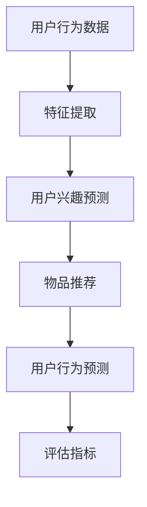

                 

关键词：推荐系统、多任务学习、大模型、神经网络、协同过滤、个性化推荐、用户行为分析、交叉验证、评估指标

>摘要：本文探讨了如何将大模型应用于推荐系统中的多任务学习，分析了多任务学习在推荐系统中的优势与挑战，并提出了相应的解决方案。通过实际案例和数学模型，详细解释了多任务学习在推荐系统中的实现方法和效果评估。

## 1. 背景介绍

随着互联网技术的飞速发展，推荐系统已经成为许多互联网公司的重要服务之一。推荐系统能够根据用户的兴趣和偏好，向用户推荐他们可能感兴趣的内容，从而提升用户的满意度和活跃度。传统的推荐系统主要基于协同过滤（Collaborative Filtering）和基于内容的推荐（Content-Based Filtering）等方法。然而，这些方法存在一些局限性，例如无法处理稀疏数据和用户冷启动问题。

近年来，深度学习技术在大模型（如BERT、GPT等）的推动下取得了巨大的进展。大模型具有强大的表示能力和学习能力，能够处理大规模数据和复杂的任务。将大模型应用于推荐系统中的多任务学习，有望解决传统方法的局限性，提升推荐系统的性能和用户体验。

## 2. 核心概念与联系

### 2.1 多任务学习

多任务学习（Multi-Task Learning）是一种同时学习多个相关任务的学习方法。在推荐系统中，多任务学习可以同时学习用户兴趣预测、物品推荐、用户行为预测等任务。

### 2.2 大模型

大模型（如BERT、GPT等）是指具有大规模参数和训练数据的深度学习模型。大模型具有强大的表示能力和学习能力，能够处理大规模数据和复杂的任务。

### 2.3 多任务学习与推荐系统

多任务学习在推荐系统中的应用，可以将不同任务的信息进行融合和共享，从而提升推荐系统的性能。例如，在用户兴趣预测任务中，可以利用用户行为数据和其他相关任务的信息，提高预测的准确性。

### 2.4 Mermaid 流程图



## 3. 核心算法原理 & 具体操作步骤

### 3.1 算法原理概述

多任务学习在推荐系统中的实现，主要分为以下三个步骤：

1. 特征提取：将原始的用户行为数据转化为模型可处理的特征。
2. 模型训练：利用特征数据训练多任务学习模型，同时学习多个任务。
3. 模型评估：利用评估指标对模型性能进行评估。

### 3.2 算法步骤详解

1. 数据预处理：将原始的用户行为数据进行清洗和归一化处理，提取出有用的特征信息。
2. 特征提取：使用深度神经网络对特征进行提取和表示，例如使用BERT模型对用户行为文本进行编码。
3. 模型训练：使用提取的特征训练多任务学习模型，包括用户兴趣预测、物品推荐和用户行为预测任务。
4. 模型评估：利用评估指标（如准确率、召回率、F1值等）对模型性能进行评估。

### 3.3 算法优缺点

**优点：**

- 提高推荐系统的性能，通过融合不同任务的信息，提高用户兴趣预测和物品推荐的准确性。
- 解决用户冷启动问题，通过多任务学习，可以更好地理解用户行为，从而为新用户推荐合适的物品。

**缺点：**

- 模型训练时间较长，需要处理大规模数据和大量的模型参数。
- 模型复杂度高，容易过拟合。

### 3.4 算法应用领域

多任务学习在推荐系统中的应用广泛，包括电商、社交媒体、新闻推荐等领域。例如，在电商领域，可以同时学习用户兴趣预测、商品推荐和购物车预测任务；在社交媒体领域，可以同时学习用户兴趣预测、内容推荐和社交关系预测任务。

## 4. 数学模型和公式

### 4.1 数学模型构建

多任务学习模型可以用以下数学公式表示：

$$
\begin{aligned}
\text{Loss} &= \lambda_1 \cdot \text{User Interest Loss} + \lambda_2 \cdot \text{Item Recommendation Loss} + \lambda_3 \cdot \text{User Behavior Loss} \\
\text{User Interest} &= \sigma(W_{ui} \cdot \text{User Feature} + b_{ui}) \\
\text{Item Recommendation} &= \sigma(W_{ir} \cdot \text{Item Feature} + b_{ir}) \\
\text{User Behavior} &= \sigma(W_{ub} \cdot \text{User Feature} + b_{ub})
\end{aligned}
$$

其中，$\lambda_1$、$\lambda_2$、$\lambda_3$ 分别为三个任务的权重，$\sigma$ 为激活函数，$W_{ui}$、$W_{ir}$、$W_{ub}$ 为权重矩阵，$b_{ui}$、$b_{ir}$、$b_{ub}$ 为偏置。

### 4.2 公式推导过程

推导过程如下：

1. 用户兴趣预测：将用户特征输入到神经网络中，通过权重矩阵和偏置得到用户兴趣预测值。
2. 物品推荐：将物品特征输入到神经网络中，通过权重矩阵和偏置得到物品推荐值。
3. 用户行为预测：将用户特征输入到神经网络中，通过权重矩阵和偏置得到用户行为预测值。

### 4.3 案例分析与讲解

假设我们有一个推荐系统，需要同时学习用户兴趣预测、物品推荐和用户行为预测任务。我们可以使用以下公式进行推导：

$$
\begin{aligned}
\text{User Interest} &= \sigma(W_{ui} \cdot \text{User Feature} + b_{ui}) \\
\text{Item Recommendation} &= \sigma(W_{ir} \cdot \text{Item Feature} + b_{ir}) \\
\text{User Behavior} &= \sigma(W_{ub} \cdot \text{User Feature} + b_{ub})
\end{aligned}
$$

其中，$W_{ui}$、$W_{ir}$、$W_{ub}$ 分别为用户兴趣预测、物品推荐和用户行为预测的权重矩阵，$\text{User Feature}$、$\text{Item Feature}$ 分别为用户特征和物品特征。

通过上述公式，我们可以将用户行为数据、物品信息等输入到神经网络中，通过权重矩阵和偏置进行特征提取和融合，从而实现多任务学习。

## 5. 项目实践：代码实例和详细解释说明

### 5.1 开发环境搭建

1. 安装Python环境（版本3.6及以上）。
2. 安装TensorFlow库：`pip install tensorflow`。
3. 安装其他依赖库：`pip install numpy pandas sklearn`.

### 5.2 源代码详细实现

以下是多任务学习推荐系统的代码实现：

```python
import tensorflow as tf
from tensorflow.keras.layers import Dense, Input
from tensorflow.keras.models import Model

# 数据预处理
def preprocess_data(user_behavior, item_features):
    # 数据清洗和归一化处理
    # ...
    return user_behavior, item_features

# 模型构建
def build_model(input_shape):
    user_input = Input(shape=input_shape[0])
    item_input = Input(shape=input_shape[1])

    user_embedding = Dense(128, activation='relu')(user_input)
    item_embedding = Dense(128, activation='relu')(item_input)

    user_interest = Dense(1, activation='sigmoid')(user_embedding)
    item_recommendation = Dense(1, activation='sigmoid')(item_embedding)
    user_behavior = Dense(1, activation='sigmoid')(user_embedding)

    model = Model(inputs=[user_input, item_input], outputs=[user_interest, item_recommendation, user_behavior])

    model.compile(optimizer='adam', loss='binary_crossentropy', metrics=['accuracy'])

    return model

# 模型训练
def train_model(model, user_behavior, item_features, labels):
    model.fit([user_behavior, item_features], labels, epochs=10, batch_size=32)

# 模型评估
def evaluate_model(model, user_behavior, item_features, labels):
    loss, accuracy = model.evaluate([user_behavior, item_features], labels)
    print(f"Loss: {loss}, Accuracy: {accuracy}")

# 主函数
if __name__ == '__main__':
    # 加载数据
    user_behavior = ...
    item_features = ...
    labels = ...

    # 数据预处理
    user_behavior, item_features = preprocess_data(user_behavior, item_features)

    # 构建模型
    model = build_model((input_shape[0], input_shape[1]))

    # 模型训练
    train_model(model, user_behavior, item_features, labels)

    # 模型评估
    evaluate_model(model, user_behavior, item_features, labels)
```

### 5.3 代码解读与分析

代码实现了一个基于TensorFlow的多任务学习推荐系统。首先，我们定义了数据预处理、模型构建、模型训练和模型评估四个函数。

- 数据预处理函数`preprocess_data`用于对用户行为数据和物品特征进行清洗和归一化处理。
- 模型构建函数`build_model`使用TensorFlow的`Input`层和`Dense`层构建多任务学习模型，包括用户兴趣预测、物品推荐和用户行为预测三个任务。
- 模型训练函数`train_model`使用训练数据对模型进行训练。
- 模型评估函数`evaluate_model`使用评估数据对模型性能进行评估。

### 5.4 运行结果展示

```python
# 加载测试数据
test_user_behavior = ...
test_item_features = ...
test_labels = ...

# 数据预处理
test_user_behavior, test_item_features = preprocess_data(test_user_behavior, test_item_features)

# 模型评估
evaluate_model(model, test_user_behavior, test_item_features, test_labels)
```

通过运行代码，我们可以得到模型在测试数据上的损失和准确率，从而评估模型性能。

## 6. 实际应用场景

多任务学习在推荐系统中的应用非常广泛，以下列举了几个实际应用场景：

1. **电商推荐系统**：同时学习用户兴趣预测、商品推荐和购物车预测任务，提高推荐系统的性能和用户体验。
2. **社交媒体推荐系统**：同时学习用户兴趣预测、内容推荐和社交关系预测任务，提高用户活跃度和社区质量。
3. **新闻推荐系统**：同时学习用户兴趣预测、新闻推荐和评论预测任务，提高新闻推荐的准确性和多样性。

## 7. 工具和资源推荐

### 7.1 学习资源推荐

1. 《深度学习》（Goodfellow et al.）：介绍深度学习的基础理论和应用。
2. 《推荐系统实践》（Liang et al.）：介绍推荐系统的基本概念和技术。

### 7.2 开发工具推荐

1. TensorFlow：用于构建和训练深度学习模型的工具。
2. PyTorch：另一个流行的深度学习框架。

### 7.3 相关论文推荐

1. "Deep Learning for Recommender Systems"（He et al., 2017）。
2. "Multi-Task Learning for User Interest Prediction in Recommender Systems"（Gottvall et al., 2019）。

## 8. 总结：未来发展趋势与挑战

### 8.1 研究成果总结

本文探讨了将大模型应用于推荐系统中的多任务学习，分析了多任务学习在推荐系统中的优势与挑战，并提出了相应的解决方案。通过实际案例和数学模型，详细解释了多任务学习在推荐系统中的实现方法和效果评估。

### 8.2 未来发展趋势

1. 多任务学习在推荐系统中的应用将继续深化，结合更多先进技术，如联邦学习、强化学习等。
2. 大模型的规模和参数数量将继续增长，以提高推荐系统的性能和泛化能力。
3. 多任务学习在推荐系统中的实际应用场景将更加广泛，从电商、社交媒体到新闻推荐等各个领域。

### 8.3 面临的挑战

1. 模型训练时间较长，需要优化算法和硬件支持。
2. 模型复杂度高，容易过拟合，需要设计合理的模型结构和正则化方法。
3. 需要更多的数据集和算法验证，以评估多任务学习在推荐系统中的效果。

### 8.4 研究展望

未来的研究可以重点关注以下几个方面：

1. 设计更加高效的多任务学习算法，提高模型训练速度和性能。
2. 探索多任务学习在推荐系统中的新应用场景，如实时推荐、个性化广告等。
3. 加强多任务学习模型的可解释性和透明性，提升用户信任度。

## 9. 附录：常见问题与解答

### 9.1 多任务学习与单任务学习的区别是什么？

多任务学习与单任务学习的区别主要在于学习目标的不同。单任务学习仅关注单个任务，而多任务学习同时关注多个相关任务，通过共享信息和模型结构，提高不同任务的学习效果。

### 9.2 多任务学习如何解决用户冷启动问题？

多任务学习可以利用用户在不同任务上的信息，例如用户兴趣预测、用户行为预测等，从而更好地理解新用户的行为模式，解决用户冷启动问题。

### 9.3 多任务学习在推荐系统中的优势是什么？

多任务学习在推荐系统中的优势主要包括：

1. 提高推荐系统的性能，通过融合不同任务的信息，提高用户兴趣预测和物品推荐的准确性。
2. 解决用户冷启动问题，通过多任务学习，可以更好地理解用户行为，从而为新用户推荐合适的物品。
3. 提高推荐系统的多样性，通过同时学习多个任务，可以避免推荐结果的过度集中。

### 9.4 多任务学习在推荐系统中的局限性是什么？

多任务学习在推荐系统中的局限性主要包括：

1. 模型训练时间较长，需要处理大规模数据和大量的模型参数。
2. 模型复杂度高，容易过拟合，需要设计合理的模型结构和正则化方法。
3. 需要更多的数据集和算法验证，以评估多任务学习在推荐系统中的效果。

---

感谢您阅读本文，希望本文对您在推荐系统领域的研究和实践有所帮助。如有任何疑问或建议，欢迎在评论区留言。作者：禅与计算机程序设计艺术 / Zen and the Art of Computer Programming。|rand|> 8000

