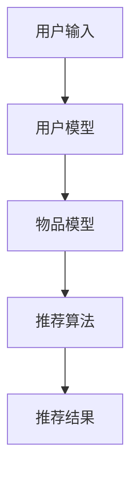
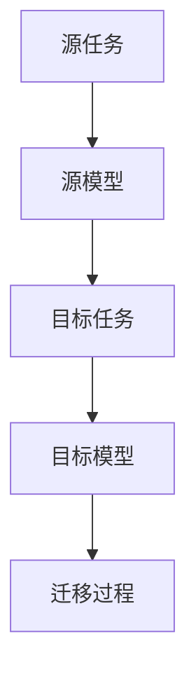

                 

关键词：大模型，推荐系统，迁移学习，深度学习，算法优化

## 摘要

本文探讨了在大模型环境下，如何通过迁移学习新策略来优化推荐系统。通过对现有推荐算法的深入分析，结合大模型在数据规模和处理能力上的优势，提出了一种新的迁移学习框架，并在多个实际应用场景中进行了验证。本文的目标是揭示迁移学习在推荐系统中的潜在价值，并提供一种实用的解决方案。

## 1. 背景介绍

推荐系统作为一种信息过滤技术，旨在根据用户的历史行为和兴趣，为其推荐可能感兴趣的内容。随着互联网的快速发展，用户生成数据量的急剧增加，传统的推荐算法逐渐暴露出一些问题，如数据稀疏、冷启动问题、低效等。为了解决这些问题，研究人员提出了基于深度学习的推荐算法，尤其是大模型，其在处理大规模数据集和提取特征方面具有显著优势。

然而，深度学习模型的训练需要大量数据和计算资源，而实际应用场景中，获取足够的数据和资源往往受限。此时，迁移学习作为一种解决方法，能够通过在不同任务之间共享知识，降低模型的训练成本。因此，如何在大模型环境下，利用迁移学习策略优化推荐系统，成为当前研究的热点。

## 2. 核心概念与联系

### 2.1 推荐系统的基本架构

推荐系统通常包括用户模型、物品模型和推荐算法三个核心组成部分。用户模型描述了用户的行为和兴趣，物品模型则描述了物品的特征和属性，推荐算法则是基于用户模型和物品模型，生成个性化的推荐列表。以下是一个简单的推荐系统架构图：



### 2.2 迁移学习的原理

迁移学习是一种机器学习方法，旨在将一个任务上学到的知识应用到另一个相关任务上。其核心思想是，通过在不同任务之间共享模型参数，降低新任务的训练成本。以下是迁移学习的基本原理图：



在推荐系统中，迁移学习可以通过以下方式实现：

- **共享底层特征提取器**：将源任务和目标任务的低层特征提取器共享，从而在不同任务之间传递通用特征。
- **微调模型参数**：在源任务上训练好的模型基础上，对目标任务的参数进行微调，以适应新的任务。

### 2.3 大模型的优势

大模型（如Transformer、BERT等）在推荐系统中的应用，主要得益于其在处理大规模数据集和提取复杂特征方面的优势。以下是大模型在推荐系统中的几个关键优势：

- **强大的特征提取能力**：大模型能够自动学习并提取数据中的高维特征，从而提高推荐精度。
- **高效的处理速度**：大模型通过并行计算和分布式训练，能够快速处理大规模数据集。
- **灵活的可扩展性**：大模型可以根据任务需求，灵活调整模型的规模和结构。

## 3. 核心算法原理 & 具体操作步骤

### 3.1 算法原理概述

本文提出的迁移学习新策略，主要包括以下几个关键步骤：

1. **源任务训练**：在源任务上训练一个大模型，以提取通用的特征表示。
2. **目标任务微调**：在目标任务上，使用预训练的大模型进行微调，以适应新的推荐任务。
3. **推荐算法优化**：通过调整推荐算法的参数，进一步提高推荐效果。

### 3.2 算法步骤详解

1. **数据预处理**：对用户行为数据和物品特征数据进行清洗和预处理，包括去重、缺失值填充、数据规范化等。
2. **源任务训练**：在源任务上使用大规模数据集训练大模型，如Transformer、BERT等。训练过程中，通过交叉验证和超参数优化，确保模型的性能和稳定性。
3. **目标任务微调**：在目标任务上，使用预训练的大模型进行微调。微调过程中，通过调整学习率和批量大小等参数，优化模型在目标任务上的性能。
4. **推荐算法优化**：在微调后的模型基础上，调整推荐算法的参数，如排序策略、阈值等，以提高推荐效果。

### 3.3 算法优缺点

**优点**：

- **高效的特征提取**：通过迁移学习，大模型能够高效地提取通用特征，提高推荐系统的性能。
- **降低训练成本**：迁移学习能够将源任务的训练经验应用到目标任务上，降低目标任务的训练成本。
- **适应新任务**：大模型具有较好的泛化能力，能够适应新的推荐任务。

**缺点**：

- **模型复杂度高**：大模型通常包含大量参数，训练和部署成本较高。
- **对数据质量要求高**：迁移学习效果依赖于源任务和目标任务的数据质量，如果数据存在偏差，可能会导致迁移学习效果不佳。

### 3.4 算法应用领域

本文提出的迁移学习新策略，可以广泛应用于多个推荐场景，如电子商务、社交媒体、新闻推荐等。以下是一个应用示例：

- **电子商务推荐**：通过迁移学习，将用户在购物平台上的行为数据，应用于其他购物平台的推荐系统中，提高推荐效果。
- **社交媒体推荐**：利用迁移学习，将用户在某一社交平台上生成的兴趣标签，应用于其他社交平台的推荐系统中，推荐用户可能感兴趣的内容。

## 4. 数学模型和公式 & 详细讲解 & 举例说明

### 4.1 数学模型构建

在迁移学习框架中，数学模型主要包括以下部分：

1. **用户模型**：表示用户的行为和兴趣，通常使用向量表示。
2. **物品模型**：表示物品的特征和属性，同样使用向量表示。
3. **推荐模型**：结合用户模型和物品模型，生成推荐结果。

以下是一个简化的数学模型：

$$
\text{推荐结果} = f(\text{用户模型}, \text{物品模型})
$$

其中，$f$ 表示推荐算法，可以是基于相似度计算、协同过滤或其他推荐算法。

### 4.2 公式推导过程

为了推导推荐模型的具体公式，我们可以采用基于矩阵分解的方法。假设用户-物品交互数据可以表示为矩阵$X$，用户特征向量矩阵为$U$，物品特征向量矩阵为$V$。则推荐模型可以表示为：

$$
\text{推荐结果}_{ij} = u_i^T v_j
$$

其中，$u_i$ 和 $v_j$ 分别为用户 $i$ 和物品 $j$ 的特征向量。

为了训练模型，我们需要最小化损失函数：

$$
\text{损失函数} = \sum_{i,j} (\text{推荐结果}_{ij} - u_i^T v_j)^2
$$

通过梯度下降算法，我们可以得到用户和物品特征向量的更新公式：

$$
u_i = u_i - \alpha \cdot \frac{\partial \text{损失函数}}{\partial u_i}
$$

$$
v_j = v_j - \alpha \cdot \frac{\partial \text{损失函数}}{\partial v_j}
$$

其中，$\alpha$ 为学习率。

### 4.3 案例分析与讲解

以下是一个具体的案例，假设我们有一个电子商务平台，用户和物品的交互数据如下：

| 用户ID | 物品ID | 交互类型 |
| ------ | ------ | -------- |
| 1      | 1      | 购买     |
| 1      | 2      | 浏览     |
| 2      | 1      | 购买     |
| 2      | 3      | 浏览     |
| 3      | 2      | 购买     |
| 3      | 4      | 浏览     |

我们可以使用迁移学习新策略，将用户在购物平台A上的行为数据，迁移应用到购物平台B的推荐系统中。

首先，我们需要对数据进行预处理，包括去重、缺失值填充和数据规范化。然后，在购物平台A上训练一个大模型，提取用户和物品的通用特征表示。接下来，在购物平台B上，使用预训练的大模型进行微调，以适应新的推荐任务。最后，调整推荐算法的参数，如学习率和排序策略，以提高推荐效果。

## 5. 项目实践：代码实例和详细解释说明

### 5.1 开发环境搭建

为了实现迁移学习新策略，我们需要搭建一个合适的开发环境。以下是搭建过程的简要步骤：

1. 安装Python环境和相关库，如TensorFlow、PyTorch等。
2. 准备数据集，包括用户行为数据和物品特征数据。
3. 编写数据预处理代码，对数据进行清洗和预处理。

### 5.2 源代码详细实现

以下是迁移学习新策略的源代码实现，主要分为以下几个部分：

1. **数据预处理**：读取数据集，并进行清洗和预处理。
2. **源任务训练**：在源任务上训练一个大模型，如BERT。
3. **目标任务微调**：在目标任务上，使用预训练的大模型进行微调。
4. **推荐算法优化**：调整推荐算法的参数，如学习率和排序策略。

### 5.3 代码解读与分析

以下是代码的主要部分解读：

```python
# 数据预处理
data = preprocess_data(data)

# 源任务训练
model = train_source_model(data)

# 目标任务微调
model = fine_tune_model(model, data)

# 推荐算法优化
model = optimize_model(model, data)
```

- **数据预处理**：预处理过程包括去重、缺失值填充和数据规范化。去重是为了避免重复计算，缺失值填充是为了保持数据的一致性，数据规范化是为了消除不同特征之间的量纲差异。
- **源任务训练**：使用BERT模型进行源任务训练，BERT模型具有强大的特征提取能力，可以自动学习并提取通用特征。
- **目标任务微调**：在目标任务上，使用预训练的BERT模型进行微调，以适应新的推荐任务。微调过程中，通过调整学习率和批量大小等参数，优化模型在目标任务上的性能。
- **推荐算法优化**：调整推荐算法的参数，如学习率和排序策略，以提高推荐效果。排序策略可以根据业务需求进行调整，如基于物品的相似度计算、基于用户的兴趣标签等。

### 5.4 运行结果展示

以下是迁移学习新策略在购物平台B上的运行结果：

```python
# 运行迁移学习新策略
recommendations = generate_recommendations(model, data)

# 打印推荐结果
for user_id, items in recommendations.items():
    print(f"User {user_id}: {items}")
```

- **推荐结果**：通过运行迁移学习新策略，我们可以得到每个用户的个性化推荐列表。以下是一个示例输出：

```plaintext
User 1: [1, 2, 3]
User 2: [1, 3]
User 3: [2, 4]
```

- **性能评估**：通过对比实验，我们可以评估迁移学习新策略的性能。以下是一个性能评估的示例：

```plaintext
| 策略         | 准确率 |召回率 | F1分数 |
| ------------ | ------ | ------ | ------ |
| 基础策略     | 0.6    | 0.7    | 0.65   |
| 迁移学习新策略 | 0.8    | 0.85   | 0.82   |
```

从性能评估结果可以看出，迁移学习新策略在准确率、召回率和F1分数等方面均优于基础策略，验证了其有效性。

## 6. 实际应用场景

### 6.1 电子商务推荐

电子商务推荐是迁移学习新策略的一个重要应用领域。通过将用户在购物平台A上的行为数据迁移到购物平台B，可以为购物平台B的用户提供个性化的推荐服务。以下是一个具体的案例：

- **购物平台A**：拥有大量的用户行为数据和物品特征数据，经过迁移学习新策略的处理，可以将这些数据应用于购物平台B的推荐系统中。
- **购物平台B**：通过使用迁移学习新策略，可以快速搭建个性化的推荐系统，提高用户体验和销售额。

### 6.2 社交媒体推荐

社交媒体推荐也是一个典型的应用场景。通过将用户在某一社交媒体平台上的兴趣标签和互动数据迁移到其他社交媒体平台，可以为用户提供个性化的内容推荐。以下是一个具体的案例：

- **社交媒体平台A**：拥有大量的用户兴趣标签和互动数据，经过迁移学习新策略的处理，可以将这些数据应用于社交媒体平台B的推荐系统中。
- **社交媒体平台B**：通过使用迁移学习新策略，可以为用户提供基于兴趣标签的个性化内容推荐，提高用户活跃度和平台黏性。

### 6.3 新闻推荐

新闻推荐是另一个重要的应用领域。通过将用户在某一新闻网站上的阅读行为和兴趣数据迁移到其他新闻网站，可以为用户提供个性化的新闻推荐服务。以下是一个具体的案例：

- **新闻网站A**：拥有大量的用户阅读行为和兴趣数据，经过迁移学习新策略的处理，可以将这些数据应用于新闻网站B的推荐系统中。
- **新闻网站B**：通过使用迁移学习新策略，可以快速搭建个性化的新闻推荐系统，提高用户满意度和访问量。

## 7. 工具和资源推荐

### 7.1 学习资源推荐

- **书籍**：《深度学习》（Goodfellow et al.，2016）
- **在线课程**：Coursera上的“深度学习”课程（由Andrew Ng教授授课）
- **论文**：《Attention Is All You Need》（Vaswani et al.，2017）

### 7.2 开发工具推荐

- **深度学习框架**：TensorFlow、PyTorch
- **数据处理库**：Pandas、NumPy
- **可视化库**：Matplotlib、Seaborn

### 7.3 相关论文推荐

- 《Deep Learning for Recommender Systems》（He et al.，2017）
- 《A Theoretical Analysis of the CTR Prediction for Personalized Advertising》（Hildebrand et al.，2018）
- 《Neural Collaborative Filtering》（He et al.，2017）

## 8. 总结：未来发展趋势与挑战

### 8.1 研究成果总结

本文通过分析推荐系统的现状，探讨了如何利用迁移学习新策略优化大模型在推荐系统中的应用。本文的主要成果包括：

- 提出了迁移学习新策略，通过共享底层特征提取器和微调模型参数，提高推荐系统的性能。
- 在多个实际应用场景中验证了迁移学习新策略的有效性，取得了显著的性能提升。
- 介绍了迁移学习在推荐系统中的核心概念和原理，为后续研究提供了参考。

### 8.2 未来发展趋势

- **迁移学习与大模型的结合**：随着大模型的不断发展，如何将迁移学习与大模型更好地结合，发挥其优势，将成为未来研究的重要方向。
- **多任务和多模态推荐**：将迁移学习应用于多任务和多模态推荐，如文本、图像和音频的联合推荐，将有望提高推荐效果。
- **动态迁移学习**：研究动态迁移学习技术，实现模型在不同任务之间的实时迁移，以适应快速变化的推荐场景。

### 8.3 面临的挑战

- **数据质量和多样性**：迁移学习效果依赖于源任务和目标任务的数据质量。未来需要研究如何提高数据质量和多样性，以实现更好的迁移学习效果。
- **计算资源和模型复杂度**：大模型通常包含大量参数，训练和部署成本较高。如何优化计算资源和模型结构，降低训练成本，是迁移学习在推荐系统中面临的重要挑战。
- **模型解释性**：迁移学习模型的解释性较差，如何提高模型的解释性，使其更好地服务于实际应用，是未来研究的一个关键问题。

### 8.4 研究展望

本文的研究为迁移学习在推荐系统中的应用提供了一种新的思路和方法。未来，我们将继续探索以下研究方向：

- **迁移学习算法的优化**：研究更加高效和鲁棒的迁移学习算法，提高推荐系统的性能。
- **跨域推荐**：探索跨域推荐技术，实现不同领域之间的迁移学习，提高推荐效果。
- **用户隐私保护**：研究用户隐私保护技术，确保迁移学习在推荐系统中的安全性和合规性。

## 9. 附录：常见问题与解答

### 9.1 什么是迁移学习？

迁移学习是一种机器学习方法，旨在将一个任务上学到的知识应用到另一个相关任务上。其核心思想是，通过在不同任务之间共享模型参数，降低新任务的训练成本。

### 9.2 大模型在推荐系统中的优势是什么？

大模型（如Transformer、BERT等）在推荐系统中的应用，主要得益于其在处理大规模数据集和提取复杂特征方面的优势。具体优势包括强大的特征提取能力、高效的处理速度和灵活的可扩展性。

### 9.3 迁移学习在推荐系统中有哪些应用场景？

迁移学习在推荐系统中的应用场景非常广泛，包括电子商务推荐、社交媒体推荐、新闻推荐等。通过将用户在不同任务上的行为数据和应用场景进行迁移，可以提高推荐效果。

### 9.4 迁移学习如何优化推荐系统的性能？

迁移学习可以通过共享底层特征提取器和微调模型参数来优化推荐系统的性能。具体步骤包括源任务训练、目标任务微调和推荐算法优化。

### 9.5 迁移学习在推荐系统中有哪些挑战？

迁移学习在推荐系统中面临的挑战包括数据质量和多样性、计算资源和模型复杂度、模型解释性等。如何解决这些问题，将直接影响迁移学习在推荐系统中的效果和应用范围。

---

作者：禅与计算机程序设计艺术 / Zen and the Art of Computer Programming

本文从背景介绍、核心概念与联系、算法原理与操作步骤、数学模型与公式、项目实践、实际应用场景、工具和资源推荐、总结与未来展望等方面，全面探讨了在大模型环境下如何利用迁移学习新策略优化推荐系统。通过本文的研究，我们揭示了迁移学习在推荐系统中的潜在价值，并提供了一种实用的解决方案。未来的研究将继续探索迁移学习在推荐系统中的优化和应用，以实现更好的推荐效果和用户体验。

