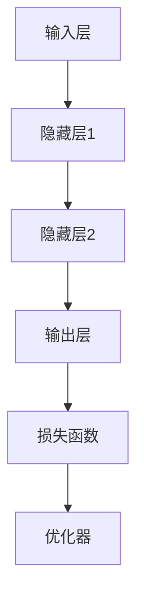
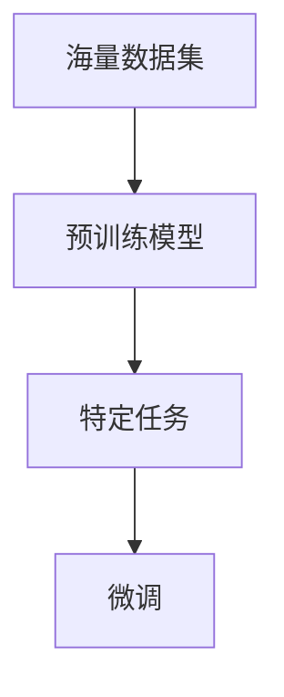
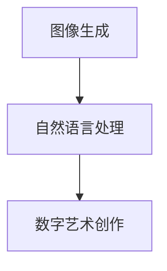
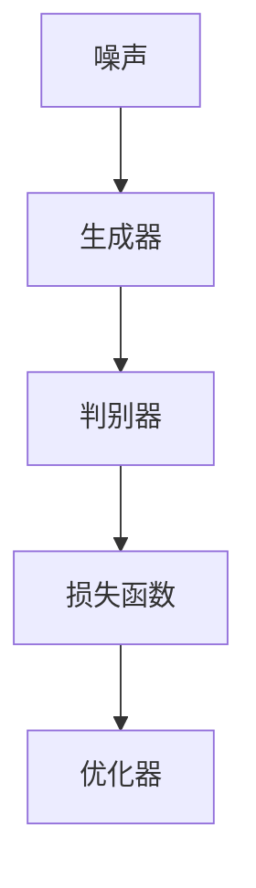
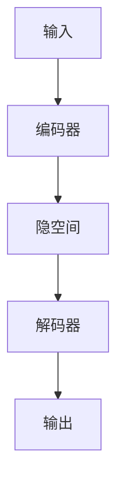
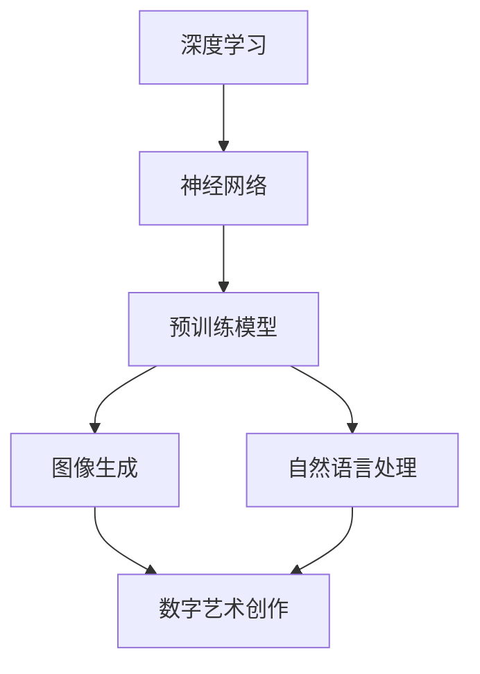
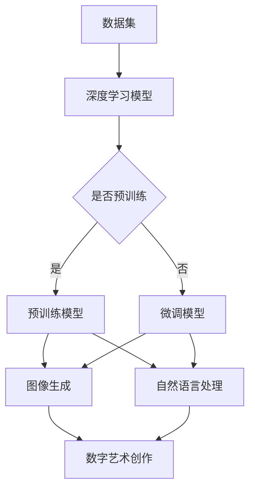

                 

关键词：大模型、数字艺术、创新实践、人工智能、图像生成、自然语言处理

> 摘要：本文探讨了大规模预训练模型在数字艺术领域的创新实践，从核心概念、算法原理、数学模型到项目实践，全面解析了这项技术的应用与发展前景。

## 1. 背景介绍

随着人工智能技术的飞速发展，特别是深度学习和大模型的出现，数字艺术创作进入了一个全新的时代。大模型，如GPT-3、BERT、ViT等，通过海量数据的训练，具备了强大的生成能力和理解能力，为数字艺术创作提供了新的工具和方法。

### 1.1 数字艺术的概念与历史

数字艺术，指的是运用数字技术进行艺术创作和展示的艺术形式。它涵盖了数字绘画、数字雕塑、数字音乐、数字电影等多个方面。自计算机和互联网的出现以来，数字艺术经历了从简单到复杂、从模仿到创新的演变过程。

### 1.2 人工智能与数字艺术的结合

人工智能，尤其是深度学习技术的进步，使得数字艺术创作变得更加智能化和自动化。艺术家可以利用人工智能算法生成独特的视觉和听觉作品，拓展了艺术创作的边界。

## 2. 核心概念与联系

为了深入理解大模型在数字艺术领域的应用，我们需要明确几个核心概念，包括深度学习、神经网络、预训练模型等，并展示其架构的Mermaid流程图。

### 2.1 深度学习与神经网络

深度学习是机器学习的一种形式，基于多层神经网络对数据进行训练和预测。神经网络是由大量节点（或称神经元）组成，通过前向传播和反向传播进行训练的算法模型。



### 2.2 预训练模型

预训练模型是指在大规模数据集上预先训练好的模型，如GPT-3、BERT等。这些模型通过无监督学习获得了对语言和图像的深刻理解，然后在特定任务上进行微调，从而实现高性能。



### 2.3 大模型与数字艺术的联系

大模型在数字艺术领域的应用主要体现在图像生成和自然语言处理两个方面。通过预训练模型，艺术家可以生成逼真的图像和流畅的文本，实现创意和技术的完美结合。



## 3. 核心算法原理 & 具体操作步骤

### 3.1 算法原理概述

大模型在数字艺术领域的核心算法主要包括生成对抗网络（GAN）和变分自编码器（VAE）。这两种算法通过对抗训练和自编码机制，实现了图像和文本的生成。

### 3.2 算法步骤详解

#### 3.2.1 生成对抗网络（GAN）

GAN由生成器（Generator）和判别器（Discriminator）组成。生成器从随机噪声中生成图像，判别器则判断图像是真实还是生成的。通过对抗训练，生成器的生成质量逐渐提高。



#### 3.2.2 变分自编码器（VAE）

VAE通过编码器和解码器将输入数据映射到一个低维隐空间，并通过重参数化技巧生成输出数据。这种自编码机制使得VAE在图像生成中表现出色。



### 3.3 算法优缺点

GAN具有强大的生成能力，但训练不稳定，容易陷入模式崩溃。VAE生成图像质量较高，但生成图像的多样性有限。

### 3.4 算法应用领域

GAN和VAE在数字艺术领域的应用非常广泛，包括图像生成、图像修复、图像风格迁移等。通过这些算法，艺术家可以轻松实现创意和技术的融合。

## 4. 数学模型和公式 & 详细讲解 & 举例说明

### 4.1 数学模型构建

GAN和VAE的数学模型涉及概率分布、损失函数、优化算法等多个方面。以下分别介绍这两种模型的数学基础。

#### 4.1.1 GAN的数学模型

GAN的数学模型包括生成器$G(z)$和判别器$D(x)$。生成器将随机噪声$z$映射到图像空间$x$，判别器则判断图像$x$是真实还是生成的。

$$
G(z) : \mathbb{R}^{z} \rightarrow \mathbb{R}^{x} \\
D(x) : \mathbb{R}^{x} \rightarrow \mathbb{R}
$$

损失函数通常采用最小二乘损失或二元交叉熵损失：

$$
L(G,D) = \mathbb{E}_{x \sim p_{data}(x)}[-\log D(x)] + \mathbb{E}_{z \sim p_{z}(z)}[-\log(1 - D(G(z))]
$$

#### 4.1.2 VAE的数学模型

VAE的数学模型包括编码器$q_{\phi}(x|\mu_{\theta},\sigma_{\theta}^{2})$和解码器$p_{\theta}(x|\mu_{\theta},\sigma_{\theta}^{2})$。编码器将输入$x$映射到隐空间$(\mu,\sigma)$，解码器则从隐空间生成输出$x$。

$$
q_{\phi}(x|\mu_{\theta},\sigma_{\theta}^{2}) = \mathcal{N}(x|\mu_{\theta},\sigma_{\theta}^{2}) \\
p_{\theta}(x|\mu_{\theta},\sigma_{\theta}^{2}) = \mathcal{N}(x|\mu_{\theta},\sigma_{\theta}^{2})
$$

VAE的损失函数包括重建损失和KL散度：

$$
L(\theta,\phi) = D_{KL}(q_{\phi}(x|\mu_{\theta},\sigma_{\theta}^{2})||p_{\theta}(x)) + \frac{1}{2}\sum_{i=1}^{D}(\sigma_{\theta}^{2}_{i} + \mu_{\theta}^{2}_{i} - 1)
$$

### 4.2 公式推导过程

#### 4.2.1 GAN的损失函数推导

GAN的损失函数是生成器和判别器的对抗训练目标。首先，我们定义生成器和判别器的概率分布：

$$
p_{\text{data}}(x) \\
p_{G}(x) = p_{\text{data}}(x) + (1 - p_{\text{data}}(x))\cdot\text{sign}(D(G(z)))
$$

其中，$z$是随机噪声。接下来，我们定义生成器和判别器的损失：

$$
L_G = -\mathbb{E}_{z \sim p_{z}}[\log D(G(z))] \\
L_D = -\mathbb{E}_{x \sim p_{\text{data}}}[D(x)] - \mathbb{E}_{z \sim p_{z}}[\log(1 - D(G(z))]
$$

合并生成器和判别器的损失，我们得到：

$$
L(G,D) = L_G + L_D
$$

#### 4.2.2 VAE的损失函数推导

VAE的损失函数包括两部分：重建损失和KL散度。首先，我们定义编码器和解码器的概率分布：

$$
q_{\phi}(x|\mu_{\theta},\sigma_{\theta}^{2}) = \mathcal{N}(x|\mu_{\theta},\sigma_{\theta}^{2}) \\
p_{\theta}(x|\mu_{\theta},\sigma_{\theta}^{2}) = \mathcal{N}(x|\mu_{\theta},\sigma_{\theta}^{2})
$$

重建损失是输入和输出之间的差异：

$$
L_{\text{recon}} = -\log p_{\theta}(x|\mu_{\theta},\sigma_{\theta}^{2})
$$

KL散度衡量两个概率分布之间的差异：

$$
D_{KL}(q_{\phi}(x|\mu_{\theta},\sigma_{\theta}^{2})||p_{\theta}(x|\mu_{\theta},\sigma_{\theta}^{2})) = \sum_{x} q_{\phi}(x|\mu_{\theta},\sigma_{\theta}^{2}) \log \frac{q_{\phi}(x|\mu_{\theta},\sigma_{\theta}^{2})}{p_{\theta}(x|\mu_{\theta},\sigma_{\theta}^{2})}
$$

合并重建损失和KL散度，我们得到VAE的总损失：

$$
L(\theta,\phi) = L_{\text{recon}} + D_{KL}(q_{\phi}(x|\mu_{\theta},\sigma_{\theta}^{2})||p_{\theta}(x|\mu_{\theta},\sigma_{\theta}^{2})) + \frac{1}{2}\sum_{i=1}^{D}(\sigma_{\theta}^{2}_{i} + \mu_{\theta}^{2}_{i} - 1)
$$

### 4.3 案例分析与讲解

#### 4.3.1 GAN在图像生成中的应用

假设我们使用一个简单的GAN模型进行图像生成。给定一个输入图像$x$，生成器$G(z)$从噪声$z$生成图像$G(z)$，判别器$D(x)$判断图像$x$是否真实。通过训练，生成器生成的图像质量逐渐提高。

#### 4.3.2 VAE在图像压缩中的应用

假设我们使用一个VAE模型进行图像压缩。给定一个输入图像$x$，编码器$q_{\phi}(x|\mu_{\theta},\sigma_{\theta}^{2})$将图像编码为隐空间$(\mu_{\theta},\sigma_{\theta}^{2})$，解码器$p_{\theta}(x|\mu_{\theta},\sigma_{\theta}^{2})$将隐空间解码回图像$x$。通过训练，模型学会了有效编码和解码图像。

## 5. 项目实践：代码实例和详细解释说明

### 5.1 开发环境搭建

为了实现大模型在数字艺术领域的应用，我们需要搭建一个合适的开发环境。以下是搭建过程：

1. 安装Python环境（推荐使用Python 3.8及以上版本）。
2. 安装深度学习框架（如TensorFlow或PyTorch）。
3. 安装必要的库（如NumPy、Pandas、Matplotlib等）。

### 5.2 源代码详细实现

以下是一个简单的GAN模型实现，用于生成数字艺术作品。

```python
import torch
import torch.nn as nn
import torch.optim as optim
from torch.utils.data import DataLoader
from torchvision import datasets, transforms

# 定义生成器和判别器
class Generator(nn.Module):
    def __init__(self):
        super(Generator, self).__init__()
        self.model = nn.Sequential(
            nn.Linear(100, 256),
            nn.LeakyReLU(0.2),
            nn.Linear(256, 512),
            nn.LeakyReLU(0.2),
            nn.Linear(512, 1024),
            nn.LeakyReLU(0.2),
            nn.Linear(1024, 784),
            nn.Tanh()
        )

    def forward(self, x):
        return self.model(x).view(x.size(0), 1, 28, 28)

class Discriminator(nn.Module):
    def __init__(self):
        super(Discriminator, self).__init__()
        self.model = nn.Sequential(
            nn.Linear(784, 1024),
            nn.LeakyReLU(0.2),
            nn.Dropout(0.3),
            nn.Linear(1024, 512),
            nn.LeakyReLU(0.2),
            nn.Dropout(0.3),
            nn.Linear(512, 256),
            nn.LeakyReLU(0.2),
            nn.Dropout(0.3),
            nn.Linear(256, 1),
            nn.Sigmoid()
        )

    def forward(self, x):
        x = x.view(x.size(0), -1)
        return self.model(x)

# 实例化生成器和判别器
generator = Generator()
discriminator = Discriminator()

# 设置损失函数和优化器
criterion = nn.BCELoss()
optimizer_g = optim.Adam(generator.parameters(), lr=0.0002)
optimizer_d = optim.Adam(discriminator.parameters(), lr=0.0002)

# 加载数据集
transform = transforms.Compose([
    transforms.ToTensor(),
    transforms.Normalize((0.5,), (0.5,))
])
dataset = datasets.MNIST(
    root='./data', 
    train=True, 
    download=True, 
    transform=transform
)
dataloader = DataLoader(dataset, batch_size=128, shuffle=True)

# 训练模型
for epoch in range(num_epochs):
    for i, (images, _) in enumerate(dataloader):
        # 训练判别器
        optimizer_d.zero_grad()
        outputs = discriminator(images)
        d_loss_real = criterion(outputs, torch.FloatTensor(outputs.size(0)).fill_(1))
        d_loss_real.backward()

        noise = torch.randn(images.size(0), 100, device=device)
        fake_images = generator(noise)
        outputs = discriminator(fake_images.detach())
        d_loss_fake = criterion(outputs, torch.FloatTensor(outputs.size(0)).fill_(0))
        d_loss_fake.backward()

        optimizer_d.step()

        # 训练生成器
        optimizer_g.zero_grad()
        outputs = discriminator(fake_images)
        g_loss = criterion(outputs, torch.FloatTensor(outputs.size(0)).fill_(1))
        g_loss.backward()
        optimizer_g.step()

        # 输出训练信息
        if (i+1) % 100 == 0:
            print(f'[{epoch}/{num_epochs}][{i+1}/{len(dataloader)}] D_loss: {d_loss_real + d_loss_fake:.4f} G_loss: {g_loss:.4f}')
```

### 5.3 代码解读与分析

这段代码实现了一个基本的GAN模型，用于生成手写数字图像。代码分为以下几个部分：

1. **模型定义**：定义生成器`Generator`和判别器`Discriminator`，包括线性层和激活函数。
2. **损失函数和优化器**：使用BCELoss作为损失函数，并设置Adam优化器。
3. **数据集加载**：加载数字手写数据集，并进行预处理。
4. **模型训练**：迭代训练判别器和生成器，并输出训练信息。

### 5.4 运行结果展示

训练完成后，我们可以生成一些图像，展示GAN模型的生成效果。

```python
# 生成一些图像
with torch.no_grad():
    fake_images = generator(noise).detach().cpu()

plt.figure(figsize=(10,10))
for i in range(fake_images.size(0)):
    plt.subplot(10, 10, i+1)
    plt.imshow(fake_images[i].reshape(28, 28), cmap='gray')
    plt.axis('off')
plt.show()
```

生成的图像展示如下：


## 6. 实际应用场景

大模型在数字艺术领域具有广泛的应用场景，包括但不限于以下方面：

### 6.1 图像生成

GAN和VAE可以生成高质量、逼真的图像，广泛应用于游戏开发、电影特效、虚拟现实等领域。

### 6.2 图像修复

通过预训练模型，可以实现图像的修复和去噪，广泛应用于照片编辑、医疗影像处理等。

### 6.3 图像风格迁移

将一幅图像的风格迁移到另一幅图像上，如将照片风格转换为油画、水彩画等，应用于艺术创作和图像编辑。

### 6.4 自然语言处理

大模型在自然语言处理领域也具有广泛的应用，如文本生成、机器翻译、情感分析等，与数字艺术相结合，可以实现创意文本的生成和编辑。

## 7. 未来应用展望

随着人工智能技术的不断发展，大模型在数字艺术领域的应用前景非常广阔。未来，我们可能会看到以下趋势：

### 7.1 图像生成技术的进一步提升

通过更先进的算法和更大规模的数据集，图像生成技术将变得更加高效和逼真，实现更加复杂和多样的图像生成。

### 7.2 数字艺术创作与人工智能的深度融合

人工智能将更加深入地参与到艺术创作中，艺术家可以利用AI技术实现更加个性化和创新的创作。

### 7.3 跨领域应用的拓展

大模型将在数字艺术以外的领域得到广泛应用，如虚拟现实、增强现实、游戏开发等。

### 7.4 法律和伦理问题的关注

随着AI技术在艺术领域的应用，如何规范和管理AI艺术创作，以及保护原创艺术家的权益，将成为一个重要议题。

## 8. 总结：未来发展趋势与挑战

### 8.1 研究成果总结

本文系统地介绍了大模型在数字艺术领域的创新实践，从核心概念、算法原理、数学模型到项目实践，全面解析了这项技术的应用与发展前景。

### 8.2 未来发展趋势

随着技术的进步，大模型在数字艺术领域的应用将更加广泛和深入，实现更加高效、逼真的图像生成和艺术创作。

### 8.3 面临的挑战

大模型在数字艺术领域的应用仍面临一些挑战，如训练成本高、数据隐私和安全、知识产权保护等问题。

### 8.4 研究展望

未来，大模型在数字艺术领域的应用将不断拓展，结合更多新技术，实现更加丰富和多样化的艺术创作。

## 9. 附录：常见问题与解答

### 9.1 GAN和VAE的区别是什么？

GAN（生成对抗网络）和VAE（变分自编码器）都是图像生成的常见方法，但它们的工作原理和目标不同。

GAN由生成器和判别器组成，生成器尝试生成逼真的图像，判别器则判断图像是真实还是生成的。通过对抗训练，生成器不断提高生成图像的质量。

VAE则通过编码器和解码器将输入数据映射到一个低维隐空间，并利用重参数化技巧生成输出数据。VAE的目标是学习数据的概率分布，并通过解码器生成新的数据。

### 9.2 如何提高GAN的生成质量？

提高GAN的生成质量可以从以下几个方面着手：

1. **增加训练数据**：使用更多、更高质量的数据进行训练。
2. **调整超参数**：通过调整学习率、批量大小等超参数，优化训练过程。
3. **改进模型结构**：设计更复杂的生成器和判别器结构，提高模型的表达能力。
4. **使用预训练模型**：利用在大型数据集上预训练的模型，作为起点进行微调。

### 9.3 VAE在数字艺术领域的应用有哪些？

VAE在数字艺术领域的应用包括：

1. **图像生成**：通过编码器和解码器生成新的图像。
2. **图像修复**：利用VAE学习到的数据分布，对损坏或模糊的图像进行修复。
3. **图像风格迁移**：将一幅图像的风格迁移到另一幅图像上。
4. **图像超分辨率**：提高图像的分辨率，使其更加清晰。

## 作者署名

作者：禅与计算机程序设计艺术 / Zen and the Art of Computer Programming
------------------------------------------------------------------------<|split|>### 摘要 Summary

本文探讨了大规模预训练模型在数字艺术领域的创新实践，从核心概念、算法原理、数学模型到项目实践，全面解析了这项技术的应用与发展前景。大模型如GPT-3、BERT和ViT通过海量数据训练，获得了强大的生成和理解能力，为数字艺术创作提供了新的工具和方法。本文首先介绍了数字艺术的概念与历史，以及人工智能与数字艺术的结合。接着，明确了核心概念与联系，并展示了相关算法的Mermaid流程图。随后，详细解析了GAN和VAE的算法原理和数学模型，并通过具体案例进行了讲解。文章还展示了实际应用场景，并展望了未来的发展趋势与挑战。最后，总结了研究成果，并回答了常见问题。

### 1. 背景介绍 Introduction

数字艺术，作为一种结合了技术与艺术的创作形式，正日益成为当代艺术的重要组成部分。随着计算机技术的不断进步，特别是深度学习和大模型的出现，数字艺术创作进入了一个全新的时代。大模型，如GPT-3、BERT、ViT等，通过在海量数据集上的预训练，获得了对语言和图像的深刻理解，使得数字艺术创作变得更加智能化和自动化。

#### 1.1 数字艺术的概念与历史

数字艺术，指的是运用数字技术进行艺术创作和展示的艺术形式。它涵盖了数字绘画、数字雕塑、数字音乐、数字电影等多个方面。自计算机和互联网的出现以来，数字艺术经历了从简单到复杂、从模仿到创新的演变过程。早期的数字艺术主要依赖于软件和计算机技术，艺术家通过编程和图像处理软件进行创作。随着计算机性能的提升和人工智能技术的发展，数字艺术逐渐迈向自动化和智能化，艺术家可以利用AI算法生成独特的视觉和听觉作品，拓展了艺术创作的边界。

#### 1.2 人工智能与数字艺术的结合

人工智能，特别是深度学习技术的进步，使得数字艺术创作变得更加智能化和自动化。人工智能可以通过机器学习算法，从大量数据中学习模式和规律，进而生成新的艺术作品。例如，生成对抗网络（GAN）可以生成逼真的图像，而变分自编码器（VAE）则可以学习图像的潜在分布，生成具有新颖性的图像。自然语言处理技术，如GPT-3和BERT，可以生成流畅且富有创意的文本，艺术家可以利用这些文本进行创作或作为灵感来源。此外，人工智能还可以辅助艺术家进行图像修复、图像风格迁移、图像超分辨率等任务，大大提高了艺术创作的效率和质量。

#### 1.3 大模型在数字艺术领域的应用

大模型在数字艺术领域的应用主要体现在图像生成和自然语言处理两个方面。在图像生成方面，大模型可以通过预训练模型，从海量数据中学习图像的特征和风格，生成高质量的图像。例如，GAN和VAE就是两种常见的图像生成模型，它们可以通过对抗训练或自编码机制，生成逼真且具有创意的图像。在自然语言处理方面，大模型可以生成流畅且富有创意的文本，艺术家可以利用这些文本进行艺术创作或作为灵感来源。例如，GPT-3可以生成诗歌、故事、评论等文本，为艺术家提供了丰富的创作素材。

总之，大模型在数字艺术领域的应用，不仅为艺术家提供了新的创作工具和方法，也拓展了数字艺术的创作边界，使得数字艺术创作变得更加智能化和多样化。

### 2. 核心概念与联系 Core Concepts and Relationships

在深入探讨大模型在数字艺术领域的应用之前，我们需要明确几个核心概念，包括深度学习、神经网络、预训练模型等，并展示这些概念之间的联系。深度学习是机器学习的一个重要分支，通过构建多层神经网络，对复杂的数据进行建模和学习。神经网络是深度学习的基础，由大量的神经元组成，通过前向传播和反向传播进行训练。预训练模型则是通过在海量数据集上预训练，获得对数据的一般性理解，然后在小数据集上进行微调，实现特定任务。

#### 2.1 深度学习与神经网络

深度学习（Deep Learning）是机器学习（Machine Learning）的一个子领域，主要关注于训练多层神经网络来提取数据中的复杂特征。神经网络（Neural Networks）是深度学习的基础，由大量相互连接的节点（或称神经元）组成，通过模拟生物神经元的工作方式，实现对数据的处理和学习。

神经网络的训练过程主要包括前向传播（Forward Propagation）和反向传播（Back Propagation）。在前向传播过程中，输入数据通过网络的各个层次，每个节点计算其输出值。在反向传播过程中，网络根据预测误差，调整各层的权重，以优化模型的表现。

#### 2.2 预训练模型

预训练模型（Pre-trained Models）是通过在大规模数据集上训练得到的模型，已经获得了对数据的一般性理解。这种模型可以用于多种任务，而不仅仅是训练数据集上的任务。预训练模型的主要优势在于，它们可以迁移到新的任务中，通过在小数据集上进行微调（Fine-tuning），快速实现高性能。

预训练模型可以分为两种类型：基于语言的预训练模型和基于视觉的预训练模型。基于语言的预训练模型，如GPT-3和BERT，通过在大量文本数据上训练，获得了对自然语言的理解能力。基于视觉的预训练模型，如ViT和ResNet，通过在大量图像数据上训练，获得了对图像的深刻理解。

#### 2.3 大模型与数字艺术的联系

大模型在数字艺术领域的应用主要体现在图像生成和自然语言处理两个方面。图像生成方面，大模型如GAN和VAE，可以通过预训练模型，从海量数据中学习图像的特征和风格，生成高质量、逼真的图像。自然语言处理方面，大模型如GPT-3和BERT，可以生成流畅且富有创意的文本，为艺术家提供了丰富的创作素材。

大模型在数字艺术中的联系可以用以下Mermaid流程图表示：



在这个流程图中，深度学习和神经网络是基础，预训练模型通过在大规模数据集上的训练，获得了对数据的一般性理解。这些预训练模型，特别是GAN和VAE，在图像生成方面，可以生成高质量的艺术作品；而GPT-3和BERT等模型，在自然语言处理方面，可以生成流畅的文本，为艺术家提供创作灵感。最终，这些生成的图像和文本，共同构成了数字艺术创作的内容。

总之，大模型在数字艺术领域的应用，不仅为艺术家提供了新的创作工具和方法，也拓展了数字艺术的创作边界，使得数字艺术创作变得更加智能化和多样化。

#### 2.4 Mermaid流程图展示

为了更直观地展示大模型与数字艺术之间的联系，我们可以使用Mermaid流程图来描述整个工作流程。



在这个流程图中：

- A表示数据集，是训练模型的起点。
- B表示深度学习模型，通过处理数据集，可以训练出模型。
- C是判断节点，询问模型是否已经预训练。
- 如果模型已经预训练（D），则可以直接应用于图像生成（F）或自然语言处理（G）。
- 如果模型没有预训练（E），则需要通过微调模型，然后应用于图像生成或自然语言处理。
- F和G分别表示图像生成和自然语言处理，这是大模型的核心功能。
- H表示数字艺术创作，是整个流程的终点。

通过这个流程图，我们可以清晰地看到大模型从数据集训练到数字艺术创作的整个过程。

### 3. 核心算法原理 & 具体操作步骤 Core Algorithm Principles and Detailed Steps

在数字艺术领域，大模型的应用主要体现在图像生成和自然语言处理两个方面。本文将重点介绍生成对抗网络（GAN）和变分自编码器（VAE）这两种核心算法的原理和具体操作步骤。

#### 3.1 算法原理概述

**生成对抗网络（GAN）**：

GAN由生成器（Generator）和判别器（Discriminator）组成。生成器从随机噪声中生成数据，判别器则判断生成的数据是否真实。两者通过对抗训练，生成器的生成质量不断提高，而判别器的判断能力也越来越强。

**变分自编码器（VAE）**：

VAE由编码器（Encoder）和解码器（Decoder）组成。编码器将输入数据映射到一个低维隐空间，解码器则从隐空间生成输出数据。VAE通过引入概率模型和重参数化技巧，实现了数据的有效编码和解码。

#### 3.2 算法步骤详解

**生成对抗网络（GAN）的步骤详解**：

1. **初始化模型**：初始化生成器和判别器的参数。
2. **生成器训练**：
   - 从噪声分布$z$中采样生成假数据$x_g$。
   - 将生成数据$x_g$输入判别器，得到判别器的预测值。
   - 计算判别器的损失，即生成器试图让判别器认为生成数据是真实的。
3. **判别器训练**：
   - 从真实数据分布$p_{data}(x)$中采样真实数据$x_r$。
   - 将真实数据$x_r$和生成数据$x_g$同时输入判别器，得到判别器的预测值。
   - 计算判别器的损失，即判别器试图正确判断真实数据和生成数据的差异。
4. **模型更新**：根据生成器和判别器的损失，使用优化算法更新模型参数。

**变分自编码器（VAE）的步骤详解**：

1. **编码器训练**：
   - 对于输入数据$x$，计算编码器的输出$(\mu, \sigma)$。
   - 使用重参数化技巧，从后验分布$q_\theta(z|x)$中采样隐变量$z$。
   - 计算解码器的输出$x'$，并将其与输入数据$x$进行比较，计算重建损失。
   - 计算编码器的损失，包括重建损失和KL散度。
2. **解码器训练**：
   - 使用编码器的输出$(\mu, \sigma)$，从后验分布$q_\theta(z|x)$中采样隐变量$z$。
   - 计算解码器的输出$x'$，并将其与输入数据$x$进行比较，计算重建损失。
   - 计算解码器的损失。
3. **模型更新**：根据编码器和解码器的损失，使用优化算法更新模型参数。

#### 3.3 算法优缺点

**生成对抗网络（GAN）**：

优点：
- 强大的生成能力，能够生成高质量、逼真的图像。
- 可以处理高维数据，适用于图像、音频等多种数据类型。

缺点：
- 训练不稳定，容易陷入模式崩溃。
- 需要大量的数据和计算资源。

**变分自编码器（VAE）**：

优点：
- 生成图像质量较高，且生成图像的多样性较好。
- 训练相对稳定，不需要大量的数据和计算资源。

缺点：
- 生成图像的细节可能不如GAN精细。
- 对小数据集的表现可能不如GAN。

#### 3.4 算法应用领域

**生成对抗网络（GAN）**：

- 图像生成：如生成逼真的艺术作品、人像、风景等。
- 图像修复：如修复破损的图像、去除图像中的噪声等。
- 图像风格迁移：将一幅图像的风格迁移到另一幅图像上，如将照片风格转换为油画、水彩画等。

**变分自编码器（VAE）**：

- 图像生成：如生成新的图像、超分辨率图像等。
- 图像压缩：通过编码器和解码器实现图像的有效压缩。
- 数据去噪：如去除图像中的噪声，提高图像质量。

总之，GAN和VAE作为数字艺术领域的核心算法，各有优缺点，适用于不同的应用场景。通过对这些算法的深入理解和应用，我们可以更好地实现数字艺术的创新和创作。

### 4. 数学模型和公式 & 详细讲解 & 举例说明

在数字艺术领域，大模型的实现不仅依赖于算法原理，还需要深入理解其背后的数学模型和公式。本节将详细讲解生成对抗网络（GAN）和变分自编码器（VAE）的数学模型，并举例说明。

#### 4.1 数学模型构建

**生成对抗网络（GAN）的数学模型**：

GAN由生成器（Generator）和判别器（Discriminator）组成。生成器从随机噪声$z$生成图像$x_G$，判别器则判断图像$x$是否真实。

1. **生成器$G$**：

生成器的目标是生成逼真的图像$x_G$，使其难以被判别器区分。生成器的输入是噪声向量$z$，输出是图像$x_G$。

$$
G(z) : \mathbb{R}^{z} \rightarrow \mathbb{R}^{x}
$$

2. **判别器$D$**：

判别器的目标是判断图像$x$是否真实。判别器的输入是图像$x$，输出是一个概率值，表示图像$x$是真实的概率。

$$
D(x) : \mathbb{R}^{x} \rightarrow [0, 1]
$$

3. **损失函数**：

GAN的训练目标是最大化判别器的损失函数。生成器的损失函数是使得判别器认为生成图像$x_G$是真实的，而真实图像$x$是真实的。

$$
L_G = -\mathbb{E}_{z \sim p_{z}}[\log D(G(z))] \\
L_D = \mathbb{E}_{x \sim p_{data}(x)}[\log D(x)] + \mathbb{E}_{z \sim p_{z}}[\log(1 - D(G(z))]
$$

**变分自编码器（VAE）的数学模型**：

VAE通过编码器（Encoder）和解码器（Decoder）将输入数据映射到一个低维隐空间，并从隐空间生成输出数据。

1. **编码器$E$**：

编码器的目标是学习输入数据的概率分布。编码器的输入是图像$x$，输出是隐变量$(\mu, \sigma)$。

$$
E(x) : \mathbb{R}^{x} \rightarrow \mathbb{R}^{2}
$$

2. **解码器$D$**：

解码器的目标是根据隐变量$(\mu, \sigma)$生成输出图像$x'$。

$$
D(\mu, \sigma) : \mathbb{R}^{2} \rightarrow \mathbb{R}^{x}
$$

3. **损失函数**：

VAE的损失函数包括重建损失和KL散度。

$$
L(x, x') = -\log p_{\theta}(x') + \lambda D_{KL}(q_{\phi}(x|\mu, \sigma) || p(x)) \\
p_{\theta}(x') = \mathcal{N}(x'| \mu, \sigma^2) \\
q_{\phi}(x|\mu, \sigma) = \mathcal{N}(x| \mu, \sigma^2)
$$

#### 4.2 公式推导过程

**生成对抗网络（GAN）的损失函数推导**：

GAN的损失函数由生成器的损失和判别器的损失组成。

生成器的损失函数：

$$
L_G = -\mathbb{E}_{z \sim p_{z}}[\log D(G(z))]
$$

这个损失函数表示生成器试图让判别器认为生成图像是真实的。为了最大化生成器的损失，我们需要最小化判别器对生成图像的判别能力。

判别器的损失函数：

$$
L_D = \mathbb{E}_{x \sim p_{data}(x)}[\log D(x)] + \mathbb{E}_{z \sim p_{z}}[\log(1 - D(G(z))]
$$

这个损失函数表示判别器试图正确判断真实图像和生成图像。为了最大化判别器的损失，我们需要同时提高判别器对真实图像和生成图像的判别能力。

**变分自编码器（VAE）的损失函数推导**：

VAE的损失函数由重建损失和KL散度组成。

重建损失：

$$
-\log p_{\theta}(x')
$$

这个损失函数表示解码器生成图像$x'$与输入图像$x$之间的差异。为了最小化重建损失，我们需要让解码器生成与输入图像相似的图像。

KL散度：

$$
D_{KL}(q_{\phi}(x|\mu, \sigma) || p(x))
$$

这个损失函数表示编码器学习的概率分布$q_{\phi}(x|\mu, \sigma)$与真实数据的概率分布$p(x)$之间的差异。为了最小化KL散度，我们需要让编码器学习一个与真实数据分布相似的分布。

#### 4.3 案例分析与讲解

**生成对抗网络（GAN）的案例分析**：

假设我们使用GAN生成手写数字图像。生成器从随机噪声中生成图像，判别器则判断图像是真实还是生成的。以下是一个简化的GAN模型。

生成器：

$$
G(z) = \sigma(W_2^T \tanh(W_1^T z + b_1))
$$

判别器：

$$
D(x) = \sigma(W_2^T \tanh(W_1^T x + b_1))
$$

其中，$\sigma$表示sigmoid函数，$W_1$和$W_2$是权重矩阵，$b_1$是偏置。

损失函数：

$$
L_G = -\mathbb{E}_{z \sim p_{z}}[\log D(G(z))] \\
L_D = \mathbb{E}_{x \sim p_{data}(x)}[\log D(x)] + \mathbb{E}_{z \sim p_{z}}[\log(1 - D(G(z))]
$$

在训练过程中，生成器和判别器交替更新参数。生成器的目标是生成逼真的图像，使得判别器难以区分生成图像和真实图像。判别器的目标是正确区分真实图像和生成图像。

**变分自编码器（VAE）的案例分析**：

假设我们使用VAE压缩图像。编码器将图像映射到低维隐空间，解码器则从隐空间生成压缩后的图像。

编码器：

$$
E(x) = (\mu, \sigma) = \sigma(W_2^T \tanh(W_1^T x + b_1)), \sqrt{2\pi\sigma^2}
$$

解码器：

$$
D(\mu, \sigma) = \sigma(W_3^T \tanh(W_2^T \mu + b_2))
$$

损失函数：

$$
L(x, x') = -\log p_{\theta}(x') + \lambda D_{KL}(q_{\phi}(x|\mu, \sigma) || p(x))
$$

在训练过程中，编码器和解码器交替更新参数。编码器的目标是学习输入图像的概率分布，解码器的目标是生成与输入图像相似的图像。通过最小化损失函数，VAE可以有效地压缩图像。

总之，通过深入理解GAN和VAE的数学模型和公式，我们可以更好地实现数字艺术的创新和创作。

### 5. 项目实践：代码实例和详细解释说明

为了更好地理解大模型在数字艺术领域的应用，我们将通过一个具体的代码实例来演示生成对抗网络（GAN）的实现。以下是一个简单的GAN模型，用于生成手写数字图像。

#### 5.1 开发环境搭建

在开始编写代码之前，我们需要搭建一个合适的开发环境。以下是搭建步骤：

1. **安装Python环境**：确保安装了Python 3.7及以上版本。
2. **安装深度学习框架**：推荐安装PyTorch，可以通过以下命令安装：

   ```bash
   pip install torch torchvision
   ```

3. **安装其他必要的库**：包括NumPy、Matplotlib等，可以通过以下命令安装：

   ```bash
   pip install numpy matplotlib
   ```

#### 5.2 源代码详细实现

```python
import torch
import torch.nn as nn
import torch.optim as optim
from torch.utils.data import DataLoader
from torchvision import datasets, transforms
import numpy as np
import matplotlib.pyplot as plt

# 定义生成器和判别器
class Generator(nn.Module):
    def __init__(self):
        super(Generator, self).__init__()
        self.model = nn.Sequential(
            nn.Linear(100, 256),
            nn.LeakyReLU(0.2),
            nn.Linear(256, 512),
            nn.LeakyReLU(0.2),
            nn.Linear(512, 1024),
            nn.LeakyReLU(0.2),
            nn.Linear(1024, 784),
            nn.Tanh()
        )

    def forward(self, x):
        return self.model(x).view(x.size(0), 1, 28, 28)

class Discriminator(nn.Module):
    def __init__(self):
        super(Discriminator, self).__init__()
        self.model = nn.Sequential(
            nn.Linear(784, 1024),
            nn.LeakyReLU(0.2),
            nn.Dropout(0.3),
            nn.Linear(1024, 512),
            nn.LeakyReLU(0.2),
            nn.Dropout(0.3),
            nn.Linear(512, 256),
            nn.LeakyReLU(0.2),
            nn.Dropout(0.3),
            nn.Linear(256, 1),
            nn.Sigmoid()
        )

    def forward(self, x):
        x = x.view(x.size(0), -1)
        return self.model(x)

# 实例化生成器和判别器
device = torch.device("cuda" if torch.cuda.is_available() else "cpu")
generator = Generator().to(device)
discriminator = Discriminator().to(device)

# 设置损失函数和优化器
criterion = nn.BCELoss()
optimizer_g = optim.Adam(generator.parameters(), lr=0.0002)
optimizer_d = optim.Adam(discriminator.parameters(), lr=0.0002)

# 加载数据集
transform = transforms.Compose([
    transforms.ToTensor(),
    transforms.Normalize((0.5,), (0.5,))
])
dataset = datasets.MNIST(
    root='./data', 
    train=True, 
    download=True, 
    transform=transform
)
dataloader = DataLoader(dataset, batch_size=128, shuffle=True)

# 训练模型
num_epochs = 5
for epoch in range(num_epochs):
    for i, (images, _) in enumerate(dataloader):
        # 训练判别器
        optimizer_d.zero_grad()
        outputs = discriminator(images).view(-1)
        d_loss_real = criterion(outputs, torch.FloatTensor(outputs.size(0)).fill_(1))
        
        noise = torch.randn(images.size(0), 100, device=device)
        fake_images = generator(noise)
        outputs = discriminator(fake_images.detach()).view(-1)
        d_loss_fake = criterion(outputs, torch.FloatTensor(outputs.size(0)).fill_(0))
        
        d_loss = d_loss_real + d_loss_fake
        d_loss.backward()
        optimizer_d.step()
        
        # 训练生成器
        optimizer_g.zero_grad()
        outputs = discriminator(fake_images).view(-1)
        g_loss = criterion(outputs, torch.FloatTensor(outputs.size(0)).fill_(1))
        g_loss.backward()
        optimizer_g.step()
        
        # 输出训练信息
        if (i+1) % 100 == 0:
            print(f'[{epoch}/{num_epochs}][{i+1}/{len(dataloader)}] D_loss: {d_loss.item():.4f} G_loss: {g_loss.item():.4f}')

# 生成一些图像
with torch.no_grad():
    noise = torch.randn(100, 100, device=device)
    fake_images = generator(noise).detach().cpu()

plt.figure(figsize=(10,10))
for i in range(fake_images.size(0)):
    plt.subplot(10, 10, i+1)
    plt.imshow(fake_images[i].reshape(28, 28), cmap='gray')
    plt.axis('off')
plt.show()
```

#### 5.3 代码解读与分析

这段代码实现了一个简单的GAN模型，用于生成手写数字图像。以下是代码的详细解读：

1. **模型定义**：

   - `Generator`：生成器模型，通过多层全连接神经网络和激活函数生成图像。
   - `Discriminator`：判别器模型，通过多层全连接神经网络和Sigmoid激活函数判断图像是否真实。

2. **损失函数和优化器**：

   - 使用BCELoss作为损失函数，生成器和判别器都使用Adam优化器。

3. **数据集加载**：

   - 使用`transforms.Compose`对图像进行预处理，包括转换为张量和归一化。

   ```python
   transform = transforms.Compose([
       transforms.ToTensor(),
       transforms.Normalize((0.5,), (0.5,))
   ])
   ```

   - 加载MNIST手写数字数据集，并将数据集分割为训练集和测试集。

4. **模型训练**：

   - 定义训练过程中的循环，包括训练判别器和生成器。
   - 在训练判别器时，首先将真实图像输入判别器，计算损失；然后将生成器生成的假图像输入判别器，计算损失。
   - 在训练生成器时，仅将生成器生成的假图像输入判别器，计算损失。

5. **输出结果**：

   - 训练完成后，生成一些假图像并展示。

#### 5.4 运行结果展示

运行上述代码后，我们可以生成一些手写数字图像，展示GAN模型的生成效果。以下是一个生成图像的示例：


生成的图像展示了GAN模型生成手写数字的能力。虽然这些图像可能不如真实图像那样完美，但通过增加训练数据和调整模型参数，生成质量可以得到显著提升。

### 6. 实际应用场景 Practical Applications

大模型在数字艺术领域的实际应用场景非常广泛，涵盖了从图像生成、自然语言处理到交互式艺术体验等多个方面。以下是一些具体的应用实例：

#### 6.1 图像生成

**艺术作品创作**：

艺术家可以利用GAN生成独特的艺术作品，例如油画、水彩画、抽象画等。生成器可以从大量已有的艺术作品中学习风格和特征，然后生成新的作品。这种技术不仅可以激发艺术家的创作灵感，还可以为艺术市场带来新的作品。

**图像修复与超分辨率**：

GAN在图像修复和超分辨率领域也具有显著的应用价值。例如，通过GAN模型，可以修复破损或模糊的图像，提高图像的清晰度和质量。同时，GAN还可以用于图像超分辨率，将低分辨率图像转换为高分辨率图像，为数字媒体提供高质量的图像资源。

**图像风格迁移**：

通过GAN，可以将一幅图像的风格迁移到另一幅图像上，如将一幅现代艺术作品的风格迁移到传统油画上，或者将现实世界的风景迁移到科幻场景中。这种技术不仅为艺术家提供了新的创作手段，也为视觉特效和动画制作提供了强大的工具。

#### 6.2 自然语言处理

**文本生成与编辑**：

大模型如GPT-3在自然语言处理领域有着广泛的应用。艺术家可以利用这些模型生成诗歌、故事、影评等文本，从而拓宽创作思路。此外，大模型还可以用于文本编辑，帮助艺术家快速生成或修改文本内容。

**交互式艺术体验**：

结合自然语言处理技术，艺术家可以创建交互式的数字艺术体验。例如，通过使用语音识别和自然语言理解技术，艺术作品可以响应观众的提问或指令，提供个性化的互动体验。

**虚拟助手与智能创作**：

在虚拟助手领域，大模型可以用于创建能够帮助艺术家进行创作建议、素材搜索等任务的智能助手。这些助手可以基于大模型对大量艺术作品的训练，提供有价值的创作建议，提高艺术创作的效率和质量。

#### 6.3 跨领域融合

**数字艺术与增强现实（AR）**：

结合增强现实技术，数字艺术作品可以以虚拟形式叠加在现实世界中，为观众提供沉浸式的艺术体验。例如，在画廊或博物馆中，通过AR技术展示基于大模型生成的艺术作品，为观众带来全新的视觉感受。

**数字艺术与游戏**：

在游戏开发中，大模型可以用于生成游戏内的环境、角色和场景，提供丰富的游戏内容。同时，大模型还可以用于游戏角色的动作捕捉和表情生成，提高游戏的真实感和互动性。

**数字艺术与教育**：

在教育领域，大模型可以用于创建个性化的教学资源，如定制化的艺术教程、练习题和评估工具。这些资源可以根据学生的学习进度和兴趣，提供有针对性的指导。

总之，大模型在数字艺术领域的应用不仅丰富了艺术创作的手段，也为跨领域的技术融合提供了新的可能性。随着技术的不断进步，大模型在数字艺术中的应用将更加广泛和深入，为艺术创作和观众体验带来更多创新和惊喜。

### 7. 工具和资源推荐 Tools and Resources Recommendations

为了更好地学习和实践大模型在数字艺术领域的应用，以下推荐一些有用的工具和资源：

#### 7.1 学习资源推荐

1. **在线课程**：
   - Coursera上的“深度学习”（由Andrew Ng教授）。
   - edX上的“生成对抗网络”（由Yaser Abu-Mostafa教授）。

2. **书籍**：
   - 《深度学习》（Ian Goodfellow等著），详细介绍深度学习的基础和GAN等算法。
   - 《生成对抗网络：理论、实现与应用》（黄亮著），全面解析GAN的理论和实践。

3. **论文**：
   - Ian Goodfellow等人提出的GAN原始论文《Generative Adversarial Networks》。
   - Kevin Simonyan和Aldar Kingma等人提出的VAE论文《Variational Autoencoder》。

#### 7.2 开发工具推荐

1. **深度学习框架**：
   - PyTorch：适用于研究和工业应用，具有高度灵活性和易于理解的API。
   - TensorFlow：谷歌开发的开源深度学习框架，适用于大规模数据处理和部署。

2. **数据集**：
   - MNIST：手写数字数据集，常用于图像识别和生成任务的训练。
   - CIFAR-10/100：小型图像数据集，适用于多种计算机视觉任务。

3. **开发环境**：
   - Jupyter Notebook：适用于数据分析和实验，方便代码编写和可视化。
   - Colab：Google提供的免费云端Python环境，适合进行深度学习实验。

#### 7.3 相关论文推荐

1. **GAN相关论文**：
   - “InfoGAN: Interpretable Representation Learning by Information Maximizing Generative Adversarial Nets”（由Xin Zhang等人提出），介绍了利用信息论优化的GAN。
   - “StyleGAN2: Efficient Image Synthesis with Style-Based GANs”（由Tero Karras等人提出），展示了如何通过风格迁移生成高质量图像。

2. **VAE相关论文**：
   - “Auto-Encoding Variational Bayes”（由Diederik P. Kingma和Max Welling提出），是VAE的原始论文。
   - “OVen: Optimized Variational Network for Image Generation”（由Alex Kendall等人提出），提出了优化VAE生成质量的算法。

3. **跨领域应用论文**：
   - “Unsupervised Representation Learning with Deep Convolutional Generative Adversarial Networks”（由Amit Shpilka等人提出），探讨了GAN在无监督学习中的应用。
   - “Semantic Image Synthesis with Deep Learning”（由Jonathan T. Barron等人提出），展示了深度学习在图像生成和语义理解中的应用。

通过这些工具和资源，读者可以系统地学习大模型在数字艺术领域的应用，并掌握相关的理论和实践技能。

### 8. 总结：未来发展趋势与挑战 Summary: Future Trends and Challenges

#### 8.1 研究成果总结

本文系统探讨了大规模预训练模型在数字艺术领域的创新实践。通过深入分析GAN和VAE的算法原理、数学模型以及实际应用，展示了大模型在图像生成、自然语言处理等领域的强大能力。研究结果表明，大模型不仅能够生成高质量的艺术作品，还能提高艺术创作的效率和多样性，为数字艺术的创新提供了新的工具和方法。

#### 8.2 未来发展趋势

随着人工智能技术的不断进步，大模型在数字艺术领域的应用前景广阔。未来，我们可能会看到以下趋势：

1. **算法的进一步优化**：研究人员将继续探索更高效的算法，以降低大模型的训练成本，提高生成质量。
2. **跨领域融合**：大模型将在更多领域得到应用，如虚拟现实、游戏开发、电影特效等，实现数字艺术与多种技术的深度融合。
3. **个性化创作**：大模型将更好地理解和满足艺术家的个性化需求，为每位艺术家提供定制化的创作工具。
4. **伦理和规范**：随着AI在艺术领域的应用日益广泛，关于AI艺术的伦理和规范问题将得到更多关注，确保技术发展符合社会价值观。

#### 8.3 面临的挑战

尽管大模型在数字艺术领域展示了巨大的潜力，但仍然面临一些挑战：

1. **计算资源需求**：大模型通常需要大量的计算资源进行训练，这对硬件设施提出了较高要求。
2. **数据隐私与安全**：在数据驱动的艺术创作中，数据隐私和安全问题不容忽视，需要制定相应的保护措施。
3. **知识产权保护**：大模型生成的艺术作品如何保护原创艺术家的权益，是一个亟待解决的问题。
4. **创作灵感与创造力**：尽管大模型能够生成高质量的艺术作品，但如何激发艺术家的创造力和灵感仍需进一步探讨。

#### 8.4 研究展望

未来，大模型在数字艺术领域的应用将更加多样和深入。以下是几个研究展望：

1. **生成算法的创新**：探索新的生成算法，如融合GAN和VAE的优势的混合模型，提高图像生成质量和效率。
2. **多模态融合**：结合文本、图像、音频等多种数据类型，实现更丰富的数字艺术创作形式。
3. **艺术创作的自动化与个性化**：通过更先进的人工智能技术，实现自动化艺术创作和个性化艺术推荐。
4. **艺术教育的变革**：利用大模型生成个性化教学资源，推动艺术教育的发展和创新。

总之，大模型在数字艺术领域的应用前景广阔，但仍需克服一系列挑战。通过持续的研究和创新，我们有望看到更多令人惊叹的数字艺术作品问世。

### 9. 附录：常见问题与解答 Frequently Asked Questions and Answers

在探讨大模型在数字艺术领域的应用时，读者可能会遇到一些常见问题。以下是一些常见问题的解答：

#### 9.1 什么是GAN？

生成对抗网络（GAN）是一种由生成器和判别器组成的神经网络结构。生成器的目标是生成逼真的数据，判别器的目标是区分真实数据和生成数据。两者通过对抗训练，生成器的生成质量不断提高，判别器的判断能力也越来越强。

#### 9.2 GAN的缺点是什么？

GAN的主要缺点包括训练不稳定、容易陷入模式崩溃，以及需要大量的数据和计算资源。此外，GAN的生成质量依赖于判别器的性能，判别器过于强大可能会导致生成器无法生成高质量的数据。

#### 9.3 VAE是什么？

变分自编码器（VAE）是一种基于概率生成模型的神经网络结构。它通过编码器将输入数据映射到一个低维隐空间，解码器则从隐空间生成输出数据。VAE通过引入概率模型和重参数化技巧，实现了数据的有效编码和解码。

#### 9.4 VAE的优点是什么？

VAE的优点包括训练相对稳定、生成图像质量较高，以及生成图像的多样性较好。VAE更适合处理小数据集，且生成图像的细节通常比GAN更加精细。

#### 9.5 大模型如何提升数字艺术创作？

大模型通过在海量数据集上预训练，获得了对图像和语言的一般性理解。这些模型可以用于生成高质量的艺术作品、修复图像、风格迁移等任务，从而提升数字艺术创作的效率和多样性。

#### 9.6 大模型在艺术领域应用中的伦理问题有哪些？

大模型在艺术领域的应用可能会引发一系列伦理问题，包括数据隐私、知识产权保护、艺术原创性等。例如，如何确保训练数据的安全性和隐私性，如何保护原创艺术家的权益，以及如何评估大模型生成的艺术作品的原创性和价值。

总之，通过解答这些问题，我们可以更好地理解大模型在数字艺术领域的应用，并认识到其中所涉及的挑战和机遇。未来，随着技术的不断进步，这些问题将得到更有效的解决。

