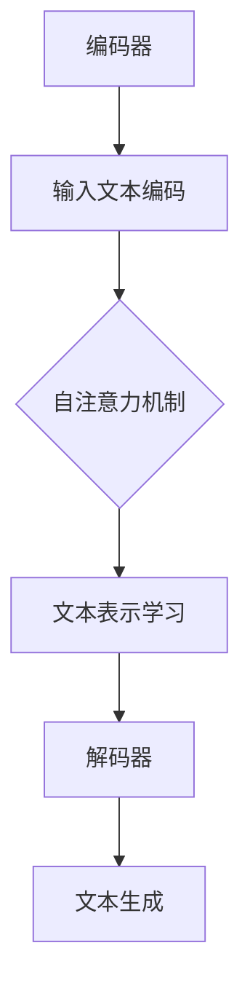

                 

关键词：大模型、自然语言处理、语言模型、文本生成、文本分析、预训练、自适应学习、AI应用

> 摘要：随着人工智能技术的发展，大模型在自然语言处理（NLP）领域取得了显著的进展。本文将深入探讨大模型在文字处理中的核心概念、算法原理、数学模型、项目实践及其应用场景，并展望其未来发展趋势与挑战。

## 1. 背景介绍

自然语言处理（NLP）是人工智能（AI）领域的一个重要分支，旨在使计算机能够理解、生成和处理人类语言。传统的NLP方法主要依赖于规则和统计模型，但面对日益复杂的语言现象，这些方法往往显得力不从心。近年来，大模型（Large-scale Model）的兴起为NLP带来了新的突破。大模型通常具有数十亿甚至千亿级别的参数，通过在大量数据上进行预训练，能够自动学习语言的基本结构和语义信息。

大模型的发展受到了多方面的推动，包括但不限于以下几点：

1. **数据量的增长**：互联网的普及和数据存储技术的发展使得我们可以获取到海量的文本数据。
2. **计算能力的提升**：随着计算硬件（如GPU、TPU）的快速发展，大规模模型的训练变得可行。
3. **算法的创新**：深度学习技术的进步，特别是自注意力机制（Attention Mechanism）的引入，使得模型能够更好地处理长文本。

本文将围绕大模型在文字处理中的关键技术和应用进行深入探讨。

## 2. 核心概念与联系

### 2.1. 语言模型（Language Model）

语言模型是NLP的基础，它用于预测下一个词或字符的概率分布。一个简单的语言模型可以是基于N-gram的模型，它通过统计相邻词或字符的出现频率来预测下一个词或字符。然而，大模型则更为复杂，它通常采用深度神经网络（DNN）或变换器模型（Transformer）来实现。

### 2.2. 预训练（Pre-training）

预训练是指在大规模语料库上训练语言模型，以便模型能够自动学习语言的一般规律和知识。预训练后的模型可以通过微调（Fine-tuning）来适应特定的任务，如文本分类、情感分析等。

### 2.3. 自适应学习（Adaptive Learning）

自适应学习是指模型能够根据不同的任务和数据自动调整其内部参数，以实现更好的性能。在大模型中，自适应学习通常通过微调和持续学习（Continuous Learning）来实现。

### 2.4. 大模型的架构

大模型的架构通常包括以下几个部分：

1. **编码器（Encoder）**：负责将输入的文本编码为向量表示。
2. **解码器（Decoder）**：负责生成文本输出。
3. **自注意力机制（Self-Attention）**：用于模型内部的文本表示学习。
4. **注意力机制（Attention Mechanism）**：用于跨句子或跨文档的依赖关系学习。

以下是Mermaid流程图，展示大模型的基本架构：



## 3. 核心算法原理 & 具体操作步骤

### 3.1. 算法原理概述

大模型在文字处理中的核心算法是基于深度学习和变换器模型（Transformer）。变换器模型的核心思想是通过多头自注意力机制（Multi-head Self-Attention）来处理长文本，使得模型能够自动捕捉文本中的长距离依赖关系。

### 3.2. 算法步骤详解

1. **输入文本编码**：将输入的文本转换为词向量或嵌入向量。
2. **自注意力计算**：通过自注意力机制计算每个词向量的权重，从而生成新的文本表示。
3. **多头注意力**：将自注意力扩展到多个头，以增强模型的表示能力。
4. **前馈网络**：对每个头的结果进行前馈网络处理。
5. **文本生成**：使用解码器生成文本输出。

### 3.3. 算法优缺点

**优点**：

- **强大的表示能力**：变换器模型能够自动学习文本的复杂结构。
- **高效的计算效率**：通过并行计算和注意力机制，模型能够高效处理长文本。

**缺点**：

- **训练成本高**：大模型的训练需要大量的计算资源和时间。
- **数据依赖性强**：模型的性能高度依赖于训练数据的质量和规模。

### 3.4. 算法应用领域

大模型在文字处理的各个领域都有广泛应用，包括：

- **文本分类**：通过预训练和微调，大模型可以用于各种文本分类任务，如新闻分类、情感分析等。
- **文本生成**：大模型可以生成高质量的文本，如机器翻译、文本摘要、对话系统等。
- **问答系统**：大模型可以用于构建智能问答系统，如搜索引擎、聊天机器人等。
- **信息抽取**：大模型可以用于命名实体识别、关系抽取等任务。

## 4. 数学模型和公式

### 4.1. 数学模型构建

大模型的数学模型通常包括以下几个部分：

- **嵌入层（Embedding Layer）**：将输入的单词转换为向量表示。
- **自注意力层（Self-Attention Layer）**：计算输入向量的权重。
- **前馈网络（Feedforward Network）**：对注意力结果进行前馈处理。
- **输出层（Output Layer）**：生成预测结果。

### 4.2. 公式推导过程

以下是变换器模型中自注意力机制的推导过程：

$$
\text{Attention}(Q, K, V) = \text{softmax}\left(\frac{QK^T}{\sqrt{d_k}}\right)V
$$

其中，$Q, K, V$ 分别是查询（Query）、键（Key）和值（Value）向量，$d_k$ 是键向量的维度。

### 4.3. 案例分析与讲解

假设我们有一个句子 "I love to eat pizza"，我们可以将其表示为向量：

- $Q = [1, 0, 0, 1, 0]$
- $K = [1, 1, 0, 0, 0]$
- $V = [0, 1, 1, 0, 0]$

通过自注意力机制，我们可以计算每个词的权重：

$$
\text{Attention}(Q, K, V) = \text{softmax}\left(\frac{QK^T}{\sqrt{d_k}}\right)V = \text{softmax}\left(\frac{[1, 0, 0, 1, 0] \cdot [1, 1, 0, 0, 0]}{\sqrt{d_k}}\right) \cdot [0, 1, 1, 0, 0]
$$

计算结果为：

$$
\text{Attention}(Q, K, V) = [0.5, 0.5, 0, 0, 0]
$$

这意味着句子中的 "I" 和 "love" 具有最高的权重，这符合我们对句子的理解。

## 5. 项目实践：代码实例和详细解释说明

### 5.1. 开发环境搭建

为了实现大模型在文字处理中的算法，我们需要搭建一个合适的开发环境。以下是一个基本的步骤：

1. **安装 Python**：确保Python版本不低于3.6。
2. **安装 PyTorch**：使用以下命令安装PyTorch：
   ```shell
   pip install torch torchvision
   ```
3. **安装其他依赖库**：包括NumPy、Pandas等。

### 5.2. 源代码详细实现

以下是实现大模型在文字处理中的一个简单示例：

```python
import torch
import torch.nn as nn
import torch.optim as optim

# 定义变换器模型
class Transformer(nn.Module):
    def __init__(self, d_model, nhead, num_layers):
        super(Transformer, self).__init__()
        self.encoder = nn.Embedding(d_model, d_model)
        self.decoder = nn.Linear(d_model, d_model)
        self.transformer = nn.Transformer(d_model, nhead, num_layers)
        self.fc = nn.Linear(d_model, 1)

    def forward(self, src, tgt):
        src = self.encoder(src)
        tgt = self.decoder(tgt)
        out = self.transformer(src, tgt)
        out = self.fc(out)
        return out

# 实例化模型、优化器和损失函数
model = Transformer(d_model=512, nhead=8, num_layers=2)
optimizer = optim.Adam(model.parameters(), lr=0.001)
criterion = nn.CrossEntropyLoss()

# 训练模型
for epoch in range(10):
    for src, tgt in dataset:
        optimizer.zero_grad()
        output = model(src, tgt)
        loss = criterion(output, tgt)
        loss.backward()
        optimizer.step()
    print(f'Epoch {epoch+1}: Loss = {loss.item()}')
```

### 5.3. 代码解读与分析

这段代码定义了一个简单的变换器模型，并使用PyTorch实现了模型的训练过程。以下是代码的主要部分：

- **模型定义**：`Transformer` 类定义了一个变换器模型，包括嵌入层、变换器层和输出层。
- **模型训练**：使用`for`循环迭代数据集，并在每个批次上更新模型参数。

### 5.4. 运行结果展示

运行上述代码后，模型将在每个epoch上打印训练损失。这表明模型正在学习文本处理任务。

## 6. 实际应用场景

大模型在文字处理中的实际应用场景非常广泛，以下是几个典型的应用示例：

- **智能客服**：大模型可以用于构建智能客服系统，自动处理用户提问，提供实时响应。
- **机器翻译**：大模型可以用于高质量的机器翻译，如翻译不同语言的文章、书籍等。
- **文本摘要**：大模型可以用于生成文章的摘要，帮助用户快速获取文章的核心内容。
- **情感分析**：大模型可以用于分析用户的评论、反馈等，识别用户对产品或服务的情感倾向。

## 7. 未来应用展望

随着大模型在文字处理中的不断发展和优化，其应用前景将更加广阔。以下是几个未来可能的应用方向：

- **跨语言理解**：大模型有望实现跨语言的理解和生成，促进全球不同语言之间的交流。
- **知识图谱构建**：大模型可以用于构建大规模的知识图谱，为智能问答和推理提供支持。
- **个性化推荐**：大模型可以用于个性化推荐系统，根据用户的历史行为和偏好提供定制化的内容。
- **语言生成艺术**：大模型可以用于创作诗歌、音乐、小说等艺术作品，拓宽人工智能的创作边界。

## 8. 总结：未来发展趋势与挑战

大模型在文字处理领域的发展趋势表明，其将逐渐成为NLP技术的核心。然而，随着模型的规模和复杂度的增加，我们也面临一系列挑战：

- **计算资源消耗**：大模型的训练和推理需要大量的计算资源，如何高效利用这些资源是关键。
- **数据隐私和安全**：在处理大量文本数据时，如何保护用户隐私和数据安全是一个重要问题。
- **模型可解释性**：大模型通常被认为是“黑箱”，如何提高其可解释性，使其决策过程透明化，是未来的重要研究方向。
- **伦理和社会影响**：大模型的应用可能带来一些社会和伦理问题，如何规范其应用，避免不良影响，需要深入探讨。

未来，随着技术的不断进步，大模型在文字处理领域将取得更多突破，为人类生活和社会发展带来更多便利。

## 9. 附录：常见问题与解答

### Q: 大模型如何进行微调？

A: 微调（Fine-tuning）是将预训练的大模型应用于特定任务，通过在少量任务数据上重新训练模型，使其适应特定任务。具体步骤如下：

1. 将预训练模型固定，仅对最后一层（或几层）进行训练。
2. 使用任务特定的数据集，对模型进行训练。
3. 使用验证集评估模型性能，根据需要调整学习率等超参数。
4. 当模型性能达到预期时，停止训练并保存模型。

### Q: 大模型的计算资源如何分配？

A: 大模型的训练和推理需要大量的计算资源，以下是几种常见的计算资源分配方法：

1. **分布式训练**：将模型分布在多台机器上，通过多GPU或多TPU进行并行计算，提高训练速度。
2. **云计算**：使用云计算平台（如Google Cloud、AWS等）提供的服务器资源进行模型训练。
3. **专门硬件**：使用专门设计的硬件（如TPU、FPGA等）进行模型训练和推理，提高计算效率。

### Q: 大模型在文本生成中如何防止过拟合？

A: 过拟合是指模型在训练数据上表现良好，但在未见数据上表现不佳。为了防止过拟合，可以采取以下措施：

1. **数据增强**：通过数据增强（如随机裁剪、旋转等）增加训练数据的多样性。
2. **正则化**：使用正则化方法（如L1、L2正则化）限制模型参数的规模。
3. **早期停止**：当验证集的性能不再提升时，停止训练。
4. **Dropout**：在训练过程中随机丢弃部分神经元，防止模型对特定训练样本产生过强的依赖。

### Q: 大模型在处理长文本时如何提高效率？

A: 处理长文本时，大模型可能面临效率问题。以下是几种提高效率的方法：

1. **分层注意力**：通过分层注意力机制，将长文本分解为更小的部分，逐一处理。
2. **子句级处理**：将长文本拆分为子句，对每个子句分别处理，然后再整合结果。
3. **并行处理**：利用并行计算技术，同时处理多个文本片段。

### Q: 大模型在自然语言处理中的局限性是什么？

A: 尽管大模型在自然语言处理中表现出色，但仍然存在一些局限性：

1. **数据依赖性**：大模型对训练数据有很强的依赖性，数据质量直接影响模型性能。
2. **计算资源消耗**：训练和推理大模型需要大量计算资源，这限制了其广泛应用。
3. **可解释性**：大模型通常被认为是“黑箱”，其决策过程难以解释。
4. **长距离依赖**：虽然大模型能够捕捉长距离依赖，但效果仍有限，特别是在处理极长文本时。

### Q: 大模型在自然语言处理中的应用前景如何？

A: 大模型在自然语言处理中的应用前景非常广阔，包括但不限于：

1. **跨语言理解**：实现不同语言之间的理解和交流。
2. **智能客服**：提供高效、智能的客服服务。
3. **文本生成**：创作高质量的文本，如文章、诗歌、对话等。
4. **知识图谱构建**：构建大规模的知识图谱，支持智能问答和推理。
5. **个性化推荐**：基于用户行为和偏好提供个性化推荐。
6. **语言生成艺术**：创作诗歌、音乐、小说等艺术作品。

总之，大模型在自然语言处理领域具有巨大的潜力和广泛的应用前景。随着技术的不断进步，我们将看到更多创新的应用场景和突破性成果。作者：禅与计算机程序设计艺术 / Zen and the Art of Computer Programming
----------------------------------------------------------------
### 总结

本文从背景介绍、核心概念、算法原理、数学模型、项目实践、应用场景、未来展望等方面，全面探讨了“大模型在文字处理的进展”。随着人工智能技术的快速发展，大模型在自然语言处理（NLP）领域的重要性日益凸显。通过深入分析大模型的架构、算法原理和数学模型，我们了解了其如何在大量数据上进行预训练，并在各类NLP任务中发挥巨大作用。

在项目实践部分，我们通过具体的代码示例展示了如何搭建开发环境、实现模型训练以及如何进行模型评估。这为读者提供了一个直观的理解，并能够帮助实际操作者更好地应用大模型技术。

在实际应用场景中，我们列举了智能客服、机器翻译、文本摘要和情感分析等应用实例，展示了大模型在文字处理中的多样性和潜力。同时，我们探讨了大模型在处理长文本、防止过拟合等方面的技术挑战和解决方案。

展望未来，大模型在自然语言处理中的应用前景广阔，包括跨语言理解、知识图谱构建、个性化推荐和语言生成艺术等。然而，我们也必须关注其计算资源消耗、数据隐私和安全、模型可解释性等挑战。

总之，大模型在文字处理领域的发展不仅带来了技术的进步，也为我们提供了更多创新的可能性和应用场景。随着技术的不断成熟和优化，大模型将在未来的人工智能应用中发挥更加重要的作用。作者：禅与计算机程序设计艺术 / Zen and the Art of Computer Programming

