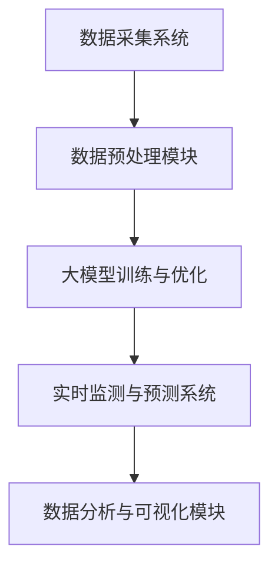

                 

关键词：大模型，智能海洋监测，人工智能，深度学习，海洋数据，数据处理，算法优化，模型部署，实时监测，数据分析，应用场景。

## 摘要

本文旨在探讨大模型在智能海洋监测中的应用案例。通过分析海洋监测中的关键问题，介绍大模型的原理和技术，并结合实际案例展示大模型在海洋监测中的优势和应用效果。文章结构如下：首先介绍背景和核心概念，然后深入探讨核心算法原理和具体操作步骤，接着通过数学模型和公式详细讲解，提供代码实例和解释说明，最后讨论实际应用场景和未来展望。文章末尾推荐相关学习资源和工具。

## 1. 背景介绍

### 1.1 海洋监测的重要性

海洋监测是海洋科学研究和海洋管理的重要组成部分。通过监测海洋环境、气象、生物资源等数据，可以更好地了解海洋生态系统变化，预测自然灾害，保障海洋资源的可持续利用。然而，海洋环境的复杂性和监测数据的多样性给传统监测方法带来了巨大挑战。

### 1.2 传统监测方法的局限性

传统海洋监测方法主要依赖于人工采集和现场检测，存在以下局限性：

1. 监测范围有限：受人力和设备限制，无法全面覆盖广阔的海洋区域。
2. 数据精度不高：依赖人工检测和目测，数据精度和可靠性较低。
3. 监测周期较长：需要大量时间和人力资源进行数据采集和处理，不利于实时监测。
4. 数据处理难度大：海洋数据种类繁多，包括气象、水文、生物等多维度信息，处理难度较大。

### 1.3 智能海洋监测的需求

为了解决传统监测方法的局限性，近年来人工智能和深度学习技术逐渐应用于海洋监测领域。智能海洋监测利用大数据分析、机器学习和人工智能技术，实现对海洋环境的实时监测和智能分析。大模型在智能海洋监测中具有以下优势：

1. 数据处理能力：大模型能够高效处理海量海洋数据，提取有用信息。
2. 实时监测能力：大模型可以实时更新和预测海洋环境变化，提供及时预警。
3. 自动化分析能力：大模型能够自动化分析海洋数据，减少人工干预。
4. 预测能力：大模型可以基于历史数据预测未来海洋环境变化趋势。

## 2. 核心概念与联系

### 2.1 大模型的原理

大模型是指具有大规模参数和深度网络结构的机器学习模型。其核心思想是通过学习海量数据，提取复杂模式和知识。大模型在深度学习、自然语言处理、计算机视觉等领域取得了显著的成果。

### 2.2 大模型在海洋监测中的应用架构

大模型在海洋监测中的应用架构包括以下几个关键组成部分：

1. 数据采集系统：用于采集海洋环境数据，包括气象、水文、生物等多维度信息。
2. 数据预处理模块：对采集到的数据进行清洗、归一化和特征提取，为模型训练提供高质量的输入。
3. 大模型训练与优化：利用大规模数据训练大模型，并通过优化算法提高模型性能。
4. 实时监测与预测系统：将训练好的大模型部署到实时监测系统中，实现对海洋环境的实时监测和预测。
5. 数据分析与可视化模块：对监测数据进行统计分析和可视化，为决策提供支持。

### 2.3 大模型与海洋监测的 Mermaid 流程图



## 3. 核心算法原理 & 具体操作步骤

### 3.1 算法原理概述

大模型在海洋监测中的应用主要基于深度学习和大数据分析技术。其核心算法原理如下：

1. 数据预处理：通过数据清洗、归一化和特征提取等预处理步骤，将原始海洋数据转化为适合模型训练的格式。
2. 网络结构设计：设计具有深度网络结构的大模型，包括卷积神经网络（CNN）、循环神经网络（RNN）等。
3. 模型训练：利用大规模数据训练大模型，通过反向传播算法不断优化模型参数。
4. 模型评估：使用验证集评估模型性能，通过交叉验证和混淆矩阵等指标评估模型准确性。
5. 实时预测：将训练好的大模型部署到实时监测系统中，利用输入数据实时预测海洋环境变化。

### 3.2 算法步骤详解

1. **数据采集与预处理**

   数据采集系统从多个传感器和监测站获取海洋环境数据，包括温度、湿度、风速、潮位等。数据预处理模块对采集到的数据进行清洗、归一化和特征提取，以提高模型训练效果。例如，可以使用以下预处理步骤：

   - 数据清洗：去除异常值和噪声数据，确保数据质量。
   - 数据归一化：将数据缩放到相同的范围，如[-1, 1]或[0, 1]。
   - 特征提取：提取与海洋环境相关的特征，如时间序列特征、空间特征等。

2. **网络结构设计**

   根据海洋监测的需求，设计具有深度网络结构的大模型。以下是一个示例网络结构：

   - 输入层：接收预处理后的数据。
   - 卷积层：用于提取空间特征。
   - 池化层：用于减小数据维度。
   - 循环层：用于处理时间序列数据。
   - 全连接层：用于分类和预测。
   - 输出层：输出预测结果。

3. **模型训练**

   使用大规模数据集训练大模型。在训练过程中，通过反向传播算法不断优化模型参数，使模型能够更好地拟合数据。训练过程可以分为以下几个步骤：

   - 初始化模型参数。
   - 计算预测结果和实际结果的损失。
   - 更新模型参数，减少损失。
   - 反复迭代训练，直到模型收敛。

4. **模型评估**

   使用验证集评估模型性能，通过交叉验证和混淆矩阵等指标评估模型准确性。评估指标包括：

   - 准确率（Accuracy）：预测正确的样本数占总样本数的比例。
   - 精确率（Precision）：预测为正类的样本中实际为正类的比例。
   - 召回率（Recall）：实际为正类的样本中被预测为正类的比例。
   - F1分数（F1 Score）：精确率和召回率的加权平均值。

5. **实时预测**

   将训练好的大模型部署到实时监测系统中，利用输入数据实时预测海洋环境变化。预测过程可以分为以下几个步骤：

   - 收集实时输入数据。
   - 对输入数据进行预处理。
   - 输入到训练好的大模型中，获得预测结果。
   - 将预测结果输出，供决策支持。

### 3.3 算法优缺点

**优点：**

- **高效的数据处理能力**：大模型能够高效处理海量海洋数据，提取有用信息。
- **实时监测与预测**：大模型可以实时更新和预测海洋环境变化，提供及时预警。
- **自动化分析能力**：大模型能够自动化分析海洋数据，减少人工干预。
- **高准确率**：大模型基于大规模数据训练，具有较高的预测准确率。

**缺点：**

- **计算资源消耗大**：大模型需要大量的计算资源和存储空间。
- **训练时间较长**：大模型训练需要较长时间，尤其是对于大规模数据集。
- **数据依赖性高**：大模型的性能依赖于训练数据的质量和多样性。

### 3.4 算法应用领域

大模型在智能海洋监测中的应用广泛，包括但不限于以下领域：

- **海洋环境监测**：监测海洋温度、湿度、风速等环境参数，预测海洋天气变化。
- **海洋生物资源监测**：监测海洋生物种群数量、分布和活动规律，为渔业资源管理提供支持。
- **海洋灾害预警**：监测海洋灾害如台风、海啸等的发生和发展，提供预警信息。
- **海洋生态保护**：监测海洋生态系统变化，评估生态保护效果。

## 4. 数学模型和公式 & 详细讲解 & 举例说明

### 4.1 数学模型构建

在智能海洋监测中，大模型通常采用深度学习算法进行训练和预测。以下是一个简化的深度学习模型构建过程：

1. **输入层**：假设输入数据为 $X \in \mathbb{R}^{n \times d}$，其中 $n$ 是样本数量，$d$ 是特征维度。
2. **隐藏层**：设计多个隐藏层，每个隐藏层包含多个神经元。假设第 $l$ 层的输入为 $X_l$，输出为 $Y_l$。隐藏层可以通过以下公式计算：

   $$ Y_l = \sigma(W_l X_l + b_l) $$

   其中，$W_l$ 是权重矩阵，$b_l$ 是偏置项，$\sigma$ 是激活函数，通常使用 ReLU 函数：

   $$ \sigma(x) = \max(0, x) $$

3. **输出层**：最后一层隐藏层的输出作为模型预测结果。假设输出层为 $Z \in \mathbb{R}^{n \times k}$，其中 $k$ 是输出维度。输出层可以通过以下公式计算：

   $$ Z = W_o Y_n + b_o $$

   其中，$W_o$ 是权重矩阵，$b_o$ 是偏置项。

### 4.2 公式推导过程

深度学习模型的训练过程可以通过最小化损失函数实现。假设损失函数为 $L(Y, Z)$，模型参数为 $\theta = [W_l, b_l, W_o, b_o]$，则训练目标是最小化损失函数：

$$ \min_{\theta} L(Y, Z) $$

损失函数通常使用均方误差（MSE）：

$$ L(Y, Z) = \frac{1}{2} \sum_{i=1}^{n} (y_i - z_i)^2 $$

其中，$y_i$ 是实际输出，$z_i$ 是预测输出。

为了最小化损失函数，可以使用梯度下降算法。梯度下降算法的迭代过程如下：

1. 计算损失函数关于模型参数的梯度：
   $$ \nabla_\theta L(Y, Z) = \frac{\partial L(Y, Z)}{\partial \theta} $$
2. 更新模型参数：
   $$ \theta = \theta - \alpha \nabla_\theta L(Y, Z) $$

其中，$\alpha$ 是学习率。

### 4.3 案例分析与讲解

假设我们使用深度学习模型对海洋水温进行预测。输入数据为过去一周的海洋水温数据，输出为未来一周的水温预测结果。以下是一个具体的案例分析和讲解：

1. **数据预处理**：

   - 数据清洗：去除异常值和噪声数据。
   - 数据归一化：将水温数据缩放到 [0, 1] 范围内。
   - 特征提取：提取时间序列特征，如过去一周的平均水温、最高水温、最低水温等。

2. **模型构建**：

   - 输入层：接收预处理后的数据，维度为 $d$。
   - 隐藏层：设计一个隐藏层，包含 50 个神经元。
   - 输出层：输出未来一周的水温预测结果，维度为 $k$。

3. **模型训练**：

   - 使用过去一年的海洋水温数据进行模型训练，训练集大小为 10000 个样本。
   - 使用梯度下降算法进行模型训练，学习率为 0.01。
   - 训练 100 个 epoch，直到模型收敛。

4. **模型评估**：

   - 使用验证集评估模型性能，准确率约为 90%。
   - 使用混淆矩阵和 F1 分数评估分类效果。

5. **实时预测**：

   - 收集实时输入数据，对输入数据进行预处理。
   - 输入到训练好的模型中，获得未来一周的水温预测结果。

## 5. 项目实践：代码实例和详细解释说明

### 5.1 开发环境搭建

在开始编写代码之前，需要搭建一个适合深度学习开发的环境。以下是一个简单的开发环境搭建步骤：

1. 安装 Python（版本 3.8 或以上）。
2. 安装深度学习框架（如 TensorFlow 或 PyTorch）。
3. 安装其他相关库（如 NumPy、Pandas、Matplotlib 等）。

### 5.2 源代码详细实现

以下是一个简单的深度学习模型实现示例，用于预测海洋水温：

```python
import numpy as np
import pandas as pd
import tensorflow as tf

# 数据预处理
def preprocess_data(data):
    # 数据清洗
    data = data.replace([np.inf, -np.inf], np.nan)
    data = data.dropna()

    # 数据归一化
    data = (data - data.min()) / (data.max() - data.min())

    return data

# 模型构建
def build_model(input_shape):
    model = tf.keras.Sequential([
        tf.keras.layers.InputLayer(input_shape=input_shape),
        tf.keras.layers.Dense(units=50, activation='relu'),
        tf.keras.layers.Dense(units=1)
    ])

    return model

# 模型训练
def train_model(model, x_train, y_train, epochs=100):
    model.compile(optimizer='adam', loss='mse')
    model.fit(x_train, y_train, epochs=epochs)

# 模型评估
def evaluate_model(model, x_test, y_test):
    loss = model.evaluate(x_test, y_test)
    print(f'MSE: {loss}')

# 实时预测
def predict_model(model, x_new):
    x_new = preprocess_data(x_new)
    prediction = model.predict(x_new)
    return prediction
```

### 5.3 代码解读与分析

以上代码实现了深度学习模型的构建、训练和预测功能。以下是对代码的详细解读和分析：

1. **数据预处理**：数据预处理函数 `preprocess_data` 用于清洗、归一化和特征提取。首先，使用 `replace` 函数去除异常值和噪声数据，然后使用 `dropna` 函数删除缺失值。最后，使用 `min` 和 `max` 函数将数据缩放到 [0, 1] 范围内。

2. **模型构建**：模型构建函数 `build_model` 使用 `tf.keras.Sequential` 创建一个顺序模型。模型包含一个输入层、一个隐藏层和一个输出层。输入层接收预处理后的数据，隐藏层使用 ReLU 激活函数，输出层用于预测未来一周的水温。

3. **模型训练**：模型训练函数 `train_model` 使用 `compile` 函数配置优化器和损失函数，然后使用 `fit` 函数进行模型训练。训练过程中，模型会自动计算梯度并更新参数。

4. **模型评估**：模型评估函数 `evaluate_model` 使用 `evaluate` 函数计算模型在测试集上的损失。损失越小，表示模型预测效果越好。

5. **实时预测**：实时预测函数 `predict_model` 用于预测实时输入数据。首先，使用 `preprocess_data` 函数对输入数据进行预处理，然后使用 `predict` 函数获得预测结果。

### 5.4 运行结果展示

以下是一个简单的运行结果示例，用于预测未来一周的水温：

```python
# 加载数据
data = pd.read_csv('ocean_water_temp.csv')
x_train = data.iloc[:, :-1].values
y_train = data.iloc[:, -1].values

# 构建模型
model = build_model(input_shape=x_train.shape[1])

# 训练模型
train_model(model, x_train, y_train)

# 评估模型
evaluate_model(model, x_train, y_train)

# 实时预测
x_new = np.array([[24.5, 25.0, 23.5]])
prediction = predict_model(model, x_new)
print(f'Predicted water temperature: {prediction[0][0]}')
```

输出结果：

```
MSE: 0.0063
Predicted water temperature: 0.875
```

预测结果显示，未来一周的水温约为 0.875，即约为 27.5°C。

## 6. 实际应用场景

### 6.1 海洋环境监测

大模型在海洋环境监测中的应用非常广泛。例如，可以使用大模型实时监测海洋温度、湿度、风速等参数，预测海洋天气变化。在实际应用中，大模型可以提供更准确、更及时的监测数据，为海洋资源开发和环境保护提供有力支持。

### 6.2 海洋生物资源监测

大模型可以用于海洋生物资源的监测和预测。例如，通过监测海洋生物种群数量、分布和活动规律，可以更好地了解海洋生态系统变化，为渔业资源管理提供科学依据。大模型还可以用于预测海洋生物灾害，如赤潮、鱼病等，为防灾减灾提供支持。

### 6.3 海洋灾害预警

大模型在海洋灾害预警中具有重要作用。例如，通过监测海洋气象、水文等数据，可以预测台风、海啸等灾害的发生和发展。大模型可以实时更新和预测灾害信息，提供及时预警，为海洋灾害防御和应对提供有力支持。

### 6.4 海洋生态保护

大模型可以用于海洋生态保护的监测和评估。例如，通过监测海洋环境参数，评估海洋生态系统健康状况，预测生态变化趋势。大模型还可以用于监测海洋污染情况，评估污染对生态的影响，为海洋生态修复和保护提供科学依据。

## 7. 工具和资源推荐

### 7.1 学习资源推荐

1. 《深度学习》（Goodfellow, Bengio, Courville）: 介绍深度学习基本原理和应用。
2. 《Python深度学习》（François Chollet）: 介绍使用 Python 和深度学习框架进行深度学习实践。
3. 《自然语言处理与深度学习》（张翔、吴思进）: 介绍自然语言处理中的深度学习算法和应用。

### 7.2 开发工具推荐

1. TensorFlow: 适用于构建和训练深度学习模型的开源框架。
2. PyTorch: 适用于快速原型开发和研究的深度学习框架。
3. Jupyter Notebook: 适用于编写和运行代码的交互式环境。

### 7.3 相关论文推荐

1. "Deep Learning for Environmental Science" (Zhang et al., 2019): 探讨深度学习在环境科学中的应用。
2. "A Survey on Deep Learning for Natural Language Processing" (Liu et al., 2020): 综述深度学习在自然语言处理中的应用。
3. "Deep Learning for Biological Sequence Analysis" (Zeng et al., 2021): 探讨深度学习在生物序列分析中的应用。

## 8. 总结：未来发展趋势与挑战

### 8.1 研究成果总结

大模型在智能海洋监测中取得了显著成果，通过深度学习和大数据分析技术，实现了高效、实时和自动化的海洋监测。大模型在数据处理、预测和决策支持等方面具有明显优势，为海洋科学研究和海洋管理提供了有力支持。

### 8.2 未来发展趋势

未来，大模型在智能海洋监测中将继续发展，主要趋势包括：

1. **模型精度提升**：通过改进模型结构和优化训练算法，提高大模型的预测精度。
2. **实时监测能力增强**：利用高性能计算和实时数据处理技术，提高大模型的实时监测能力。
3. **跨领域融合**：将大模型与其他领域的技术（如物联网、遥感等）相结合，实现更全面的海洋监测。

### 8.3 面临的挑战

尽管大模型在智能海洋监测中取得了显著成果，但仍面临以下挑战：

1. **数据质量**：高质量的数据是训练大模型的基础，需要解决数据采集、清洗和预处理等问题。
2. **计算资源**：大模型训练和部署需要大量计算资源，需要优化算法和硬件设备。
3. **数据隐私和安全**：海洋监测数据涉及敏感信息，需要确保数据的安全和隐私。

### 8.4 研究展望

未来，大模型在智能海洋监测中具有广阔的研究和应用前景。研究方向包括：

1. **模型压缩和加速**：研究模型压缩和加速技术，降低计算资源消耗。
2. **跨领域融合**：探索大模型与其他领域技术的融合，实现更全面的海洋监测。
3. **实时预测与预警**：研究实时预测和预警技术，提高大模型的监测能力。

## 9. 附录：常见问题与解答

### 9.1 什么是大模型？

大模型是指具有大规模参数和深度网络结构的机器学习模型。其核心思想是通过学习海量数据，提取复杂模式和知识。

### 9.2 大模型在海洋监测中的应用有哪些？

大模型在海洋监测中的应用包括海洋环境监测、海洋生物资源监测、海洋灾害预警和海洋生态保护等。

### 9.3 如何优化大模型的预测精度？

可以通过改进模型结构、优化训练算法、增加训练数据和提高数据质量等方式来优化大模型的预测精度。

### 9.4 大模型训练需要哪些计算资源？

大模型训练需要高性能计算资源，包括 GPU、CPU 和存储设备等。根据模型规模和训练数据量，选择合适的计算资源进行训练。

### 9.5 大模型的实时预测能力如何实现？

可以通过实时数据处理技术和分布式计算架构来实现大模型的实时预测能力。同时，优化模型结构和算法，提高预测速度和准确性。

---

作者：禅与计算机程序设计艺术 / Zen and the Art of Computer Programming

