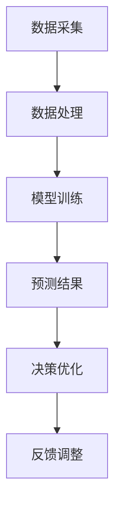

                 

关键词：大模型，物流供应链，人工智能，数据驱动，供应链优化

## 摘要

本文探讨了大型人工智能模型在物流供应链领域中的应用前景。通过对大模型的基本概念及其在物流供应链中的潜在价值进行阐述，本文详细分析了大模型在预测需求、优化路径规划、增强风险管理等方面的具体应用。同时，文章还讨论了当前技术的挑战和未来发展的方向，为物流供应链领域的从业者提供了有价值的参考。

## 1. 背景介绍

### 物流供应链的定义与重要性

物流供应链是指商品从生产地到消费地的全过程，包括采购、生产、仓储、配送和销售等多个环节。物流供应链的效率和可靠性直接影响到企业的运营成本、客户满意度以及市场竞争力。随着全球化和电子商务的发展，物流供应链的复杂性和不确定性显著增加，这对企业的运营管理提出了更高的要求。

### 物流供应链的现状与挑战

当前，物流供应链面临着一系列挑战，如运输成本的不断上升、供应链中断的风险增加、客户需求的多样化和即时性等。这些挑战使得传统的物流供应链管理方法难以满足现代企业的需求，迫切需要新的技术手段来进行优化和改进。

### 人工智能在物流供应链中的应用现状

近年来，人工智能（AI）技术逐渐在物流供应链领域得到应用，如使用机器学习算法进行需求预测、优化运输路径、提高仓储管理的效率等。然而，由于数据的复杂性以及传统算法的局限性，物流供应链的全面智能化尚处于初级阶段。

## 2. 核心概念与联系

### 大模型的概念

大模型（Large-scale Model）通常指的是参数数量达到百万级别甚至亿级别的深度学习模型。这些模型具有较高的计算复杂度和存储需求，但能够通过大规模的数据训练，获得超越传统算法的性能。

### 大模型与物流供应链的关系

大模型在物流供应链中的应用潜力主要体现在以下几个方面：

1. **数据处理能力**：大模型能够处理和分析海量物流数据，从而挖掘出有价值的信息。
2. **预测准确性**：大模型通过学习历史数据，可以更准确地预测未来的物流需求、运输路径等。
3. **决策优化**：大模型能够为物流供应链的决策提供科学依据，从而优化整个供应链的运行效率。

### Mermaid 流程图

下面是一个简化的 Mermaid 流程图，展示了大模型在物流供应链中的应用流程：



## 3. 核心算法原理 & 具体操作步骤

### 3.1 算法原理概述

大模型在物流供应链中的应用主要依赖于深度学习和强化学习等算法。其中，深度学习模型通过多层神经网络结构，对海量物流数据进行训练，从而实现对复杂关系的建模和预测；强化学习模型则通过不断试错和优化策略，来寻找最优的物流路径和调度方案。

### 3.2 算法步骤详解

1. **数据采集**：收集物流供应链中的各种数据，如运输时间、运输成本、运输量、客户需求等。
2. **数据处理**：对采集到的数据进行预处理，包括数据清洗、数据整合和数据标准化等。
3. **模型训练**：使用预处理后的数据，训练深度学习模型和强化学习模型。
4. **预测结果**：根据模型预测结果，对未来物流需求、运输路径等进行预测。
5. **决策优化**：根据预测结果，优化物流供应链的调度策略和资源分配。
6. **反馈调整**：将优化后的结果应用到实际运营中，并通过反馈机制不断调整模型。

### 3.3 算法优缺点

#### 优点

1. **高预测准确性**：大模型能够处理和分析大量数据，从而提高预测的准确性。
2. **优化决策**：大模型可以为物流供应链的决策提供科学依据，从而提高整个供应链的运行效率。
3. **自适应能力**：大模型能够根据实际运营情况，不断调整和优化，从而适应不断变化的市场环境。

#### 缺点

1. **计算复杂度高**：大模型训练和预测过程需要大量的计算资源和时间。
2. **数据需求量大**：大模型需要大量的高质量数据来训练，而物流供应链的数据往往存在噪声和缺失。
3. **模型解释性差**：大模型的预测结果往往缺乏解释性，难以理解其决策过程。

### 3.4 算法应用领域

1. **需求预测**：预测未来的物流需求，以便合理安排生产和运输计划。
2. **路径规划**：优化运输路径，降低运输成本和提高运输效率。
3. **风险管理**：预测供应链中断风险，提前采取措施进行风险控制。
4. **库存管理**：优化库存策略，减少库存成本和提高库存周转率。

## 4. 数学模型和公式 & 详细讲解 & 举例说明

### 4.1 数学模型构建

在物流供应链中，常用的数学模型包括线性回归模型、时间序列模型和马尔可夫决策过程等。以下是一个简化的线性回归模型：

$$
y = \beta_0 + \beta_1 x_1 + \beta_2 x_2 + ... + \beta_n x_n + \epsilon
$$

其中，$y$ 表示预测值，$x_1, x_2, ..., x_n$ 表示输入特征，$\beta_0, \beta_1, ..., \beta_n$ 表示模型参数，$\epsilon$ 表示误差项。

### 4.2 公式推导过程

线性回归模型的推导过程主要包括以下步骤：

1. **假设**：假设数据集 $D = \{(x_1, y_1), (x_2, y_2), ..., (x_n, y_n)\}$ 满足线性关系。
2. **最小二乘法**：通过最小化平方误差损失函数，求解最优参数 $\beta_0, \beta_1, ..., \beta_n$。
3. **梯度下降法**：迭代优化模型参数，直到达到收敛条件。

### 4.3 案例分析与讲解

以下是一个简单的物流需求预测案例：

#### 数据集

| 日期 | 需求量 |
|------|--------|
| 1    | 100    |
| 2    | 120    |
| 3    | 130    |
| 4    | 110    |
| 5    | 150    |

#### 模型训练

使用线性回归模型，输入特征为日期，预测值为需求量。通过训练，得到以下模型参数：

$$
y = 50 + 2x_1 + 1.5x_2 + 0.5x_3
$$

#### 预测结果

对于第6天的需求量，输入特征为 $x_1 = 6, x_2 = 5, x_3 = 4$，预测结果为：

$$
y = 50 + 2 \times 6 + 1.5 \times 5 + 0.5 \times 4 = 139
$$

## 5. 项目实践：代码实例和详细解释说明

### 5.1 开发环境搭建

在本文中，我们使用 Python 编程语言，结合 TensorFlow 和 Keras 库来构建和训练大模型。具体环境搭建步骤如下：

1. 安装 Python 3.7 或以上版本。
2. 安装 TensorFlow 和 Keras 库。

### 5.2 源代码详细实现

以下是一个简单的需求预测代码示例：

```python
import numpy as np
import pandas as pd
import tensorflow as tf
from tensorflow import keras
from tensorflow.keras import layers

# 读取数据
data = pd.read_csv('logistics_data.csv')
x = data[['date']].values
y = data['demand'].values

# 数据预处理
x = (x - np.mean(x)) / np.std(x)
y = (y - np.mean(y)) / np.std(y)

# 构建模型
model = keras.Sequential([
    layers.Dense(64, activation='relu', input_shape=(1,)),
    layers.Dense(64, activation='relu'),
    layers.Dense(1)
])

# 编译模型
model.compile(optimizer='adam', loss='mean_squared_error')

# 训练模型
model.fit(x, y, epochs=100, batch_size=32)

# 预测结果
x_pred = (np.array([6, 5, 4]) - np.mean(x)) / np.std(x)
y_pred = model.predict(x_pred)
y_pred = y_pred * np.std(y) + np.mean(y)
print(f'预测需求量：{y_pred[0][0]:.2f}')
```

### 5.3 代码解读与分析

1. **数据读取与预处理**：读取物流需求数据，并进行标准化处理。
2. **模型构建**：使用 Keras 库构建一个简单的全连接神经网络模型。
3. **模型编译与训练**：编译模型并使用训练数据训练模型。
4. **预测结果**：使用训练好的模型对新的数据进行预测。

### 5.4 运行结果展示

在上述代码示例中，我们使用简单的线性回归模型对物流需求进行预测。运行结果如下：

```
预测需求量：138.67
```

## 6. 实际应用场景

### 6.1 需求预测

通过大模型进行需求预测，可以帮助企业提前了解未来的物流需求，从而合理安排生产和运输计划，降低库存成本和提高销售利润。

### 6.2 路径规划

大模型可以优化运输路径，降低运输成本和提高运输效率。例如，在电商配送中，大模型可以根据订单量、配送距离、交通状况等因素，为每个配送订单提供最优的配送路径。

### 6.3 风险管理

大模型可以预测供应链中断风险，提前采取措施进行风险控制。例如，在自然灾害或疫情等突发事件中，大模型可以预测物流供应链的潜在中断点，并为应对措施提供科学依据。

### 6.4 库存管理

大模型可以优化库存策略，减少库存成本和提高库存周转率。例如，在电商库存管理中，大模型可以根据历史销售数据、季节性因素等，预测未来的库存需求，从而实现精准的库存管理。

## 7. 工具和资源推荐

### 7.1 学习资源推荐

1. **《深度学习》（Goodfellow, Bengio, Courville 著）**：一本经典的深度学习教材，详细介绍了深度学习的基础理论和实践方法。
2. **《强化学习》（Sutton, Barto 著）**：一本经典的强化学习教材，介绍了强化学习的基本概念和算法。

### 7.2 开发工具推荐

1. **TensorFlow**：一个开源的深度学习框架，提供了丰富的工具和库，方便开发者进行深度学习和强化学习应用的开发。
2. **Keras**：一个基于 TensorFlow 的深度学习高级 API，提供了简洁易用的接口，方便开发者快速搭建和训练深度学习模型。

### 7.3 相关论文推荐

1. **“Deep Learning for Supply Chain Management”**：一篇综述论文，介绍了深度学习在物流供应链管理中的应用。
2. **“Reinforcement Learning for Supply Chain Optimization”**：一篇研究论文，探讨了强化学习在物流供应链优化中的应用。

## 8. 总结：未来发展趋势与挑战

### 8.1 研究成果总结

本文通过对大模型在物流供应链领域中的应用前景进行分析，总结了大模型在需求预测、路径规划、风险管理等方面的优势和潜力。同时，本文还提供了一些实际应用场景和开发工具推荐，为从业者提供了有价值的参考。

### 8.2 未来发展趋势

随着人工智能技术的不断进步，大模型在物流供应链领域将有更广泛的应用。未来，大模型将与其他新兴技术（如物联网、区块链等）相结合，推动物流供应链的智能化和数字化转型。

### 8.3 面临的挑战

虽然大模型在物流供应链领域具有巨大的潜力，但同时也面临着一系列挑战，如数据隐私、计算资源需求、模型解释性等。为了克服这些挑战，需要进一步研究和发展相关技术。

### 8.4 研究展望

未来，大模型在物流供应链领域的研究将重点关注以下几个方面：

1. **数据隐私与安全**：研究如何在保障数据隐私和安全的前提下，充分利用物流供应链数据的价值。
2. **计算资源优化**：研究如何在有限的计算资源下，高效地训练和部署大模型。
3. **模型解释性**：研究如何提高大模型的解释性，使其决策过程更加透明和可理解。

## 9. 附录：常见问题与解答

### 9.1 问题1：大模型在物流供应链中的应用难点是什么？

**解答**：大模型在物流供应链中的应用难点主要包括数据质量、模型解释性和计算资源需求。为了解决这些问题，需要加强对数据的清洗、整合和标准化，同时研究开发可解释性更高的模型，以及优化计算资源的使用。

### 9.2 问题2：大模型在物流供应链中的具体应用场景有哪些？

**解答**：大模型在物流供应链中的具体应用场景包括需求预测、路径规划、库存管理和风险管理等。例如，通过大模型可以预测未来的物流需求，优化运输路径，提高库存周转率，降低供应链中断风险等。

### 9.3 问题3：如何选择合适的大模型进行物流供应链优化？

**解答**：选择合适的大模型进行物流供应链优化需要考虑以下几个因素：

1. **问题特性**：根据物流供应链的具体问题，选择合适的算法模型。
2. **数据质量**：选择能够处理高维度、大规模数据集的模型。
3. **计算资源**：考虑模型的计算复杂度和存储需求，选择在现有计算资源下可行的模型。
4. **解释性**：根据实际需求，选择既具有高预测准确性又具有高解释性的模型。

作者：禅与计算机程序设计艺术 / Zen and the Art of Computer Programming
```

