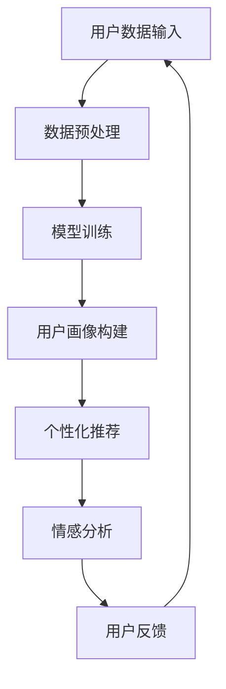

                 

 大模型作为一种先进的机器学习技术，其在自然语言处理、图像识别、语音识别等领域取得了显著的成果。然而，随着用户生成内容的爆炸式增长，如何有效地理解和预测用户偏好成为一个亟待解决的问题。本文旨在探讨大模型在用户偏好理解中的应用，深入分析其核心概念、算法原理、数学模型以及实际应用场景，并展望其未来发展趋势与挑战。

## 1. 背景介绍

在互联网时代，用户的个性化需求日益凸显，企业纷纷利用大数据技术来挖掘用户的偏好，以提供更精准的服务。然而，传统的机器学习算法在处理大规模、高维度用户数据时，往往面临数据稀疏、特征表达不足等问题。大模型的崛起为用户偏好理解带来了新的契机。

大模型通常具有以下特点：

1. **强大的表征能力**：大模型能够通过多层神经网络结构，捕捉到用户数据中的复杂模式和关联性。
2. **端到端的训练方式**：大模型可以通过大规模数据进行端到端的训练，避免了传统机器学习算法中特征工程和模型选择的复杂过程。
3. **多模态处理能力**：大模型能够处理多种类型的数据，如文本、图像、语音等，从而更全面地理解用户偏好。

本文将围绕大模型在用户偏好理解中的应用，探讨其理论基础、算法实现以及实际应用，以期为企业提供一种新的用户偏好挖掘方法。

## 2. 核心概念与联系

### 2.1 大模型的基本概念

大模型是指具有大规模参数、深度神经网络结构的机器学习模型。它们通常由多个隐藏层组成，可以处理高维数据，并捕捉复杂的数据特征。大模型的基本概念包括：

- **神经网络**：神经网络是一种由大量神经元互联组成的计算模型，可以模拟人脑的决策过程。
- **深度学习**：深度学习是一种利用多层神经网络进行训练和学习的方法，可以自动提取数据中的特征。
- **大规模数据**：大规模数据是指包含海量样本和特征的数据集，这对于训练大模型至关重要。

### 2.2 大模型在用户偏好理解中的应用

在用户偏好理解中，大模型的应用主要体现在以下几个方面：

1. **用户画像**：通过大模型，可以自动构建用户的综合画像，包括用户行为、兴趣爱好、消费习惯等。
2. **个性化推荐**：基于用户画像，大模型可以预测用户的潜在偏好，从而实现个性化推荐。
3. **情感分析**：大模型可以分析用户生成的文本数据，提取情感倾向，为品牌宣传、市场调研提供支持。

### 2.3 Mermaid 流程图

以下是用户偏好理解中，大模型应用的一个简单流程图：



## 3. 核心算法原理 & 具体操作步骤

### 3.1 算法原理概述

大模型在用户偏好理解中的核心算法原理是基于深度学习的神经网络模型。神经网络通过多层非线性变换，将输入数据映射到输出结果。在用户偏好理解中，输入数据可以是用户的行为日志、浏览历史、社交媒体互动等，输出结果则是用户的偏好预测。

### 3.2 算法步骤详解

1. **数据收集**：收集用户的原始数据，包括行为数据、文本数据、图像数据等。
2. **数据预处理**：对原始数据进行清洗、去噪、归一化等处理，以便于模型训练。
3. **模型设计**：设计深度神经网络结构，包括输入层、隐藏层和输出层。选择合适的激活函数、优化器和损失函数。
4. **模型训练**：使用预处理后的数据训练模型，通过反向传播算法不断调整模型参数，使输出结果与真实偏好尽量一致。
5. **用户画像构建**：基于训练好的模型，对用户进行画像构建，提取用户的潜在偏好特征。
6. **个性化推荐**：根据用户画像，为用户推荐感兴趣的内容或商品。
7. **情感分析**：对用户生成的文本数据进行情感分析，提取情感倾向。

### 3.3 算法优缺点

**优点**：

1. **强大的表征能力**：大模型能够自动提取数据中的复杂特征，提高预测准确性。
2. **端到端的训练**：简化了特征工程和模型选择过程，提高开发效率。
3. **多模态处理**：可以同时处理多种类型的数据，更全面地理解用户偏好。

**缺点**：

1. **计算资源消耗大**：大模型需要大量计算资源进行训练，对硬件要求较高。
2. **数据需求高**：大模型对数据量有较高要求，数据稀疏可能导致模型效果不佳。

### 3.4 算法应用领域

大模型在用户偏好理解中的应用广泛，包括：

1. **电子商务**：为用户提供个性化推荐，提高销售额。
2. **社交媒体**：分析用户情感，优化内容分发策略。
3. **在线教育**：根据用户学习行为，推荐合适的课程。

## 4. 数学模型和公式

### 4.1 数学模型构建

在用户偏好理解中，常用的数学模型是神经网络模型。神经网络模型的基本结构包括输入层、隐藏层和输出层。每个层由多个神经元组成，神经元之间通过权重连接。神经网络模型的输出可以通过以下公式计算：

$$
Y = \sigma(W_2 \cdot \sigma(W_1 \cdot X))
$$

其中，$X$是输入数据，$W_1$和$W_2$是权重矩阵，$\sigma$是激活函数，$Y$是输出结果。

### 4.2 公式推导过程

神经网络的训练过程可以看作是求解最优权重矩阵的过程。在训练过程中，使用梯度下降算法不断更新权重矩阵，以最小化损失函数。损失函数通常选择均方误差（MSE）：

$$
J = \frac{1}{2} \sum_{i=1}^{n} (y_i - \hat{y}_i)^2
$$

其中，$y_i$是真实标签，$\hat{y}_i$是预测标签。

### 4.3 案例分析与讲解

假设有一个用户偏好理解的任务，输入数据是用户的行为日志，输出数据是用户的偏好标签。我们可以使用以下神经网络模型进行训练：

$$
Y = \sigma(W_2 \cdot \sigma(W_1 \cdot X))
$$

其中，$X$是行为日志数据，$W_1$和$W_2$是权重矩阵，$\sigma$是ReLU激活函数。

在训练过程中，我们首先随机初始化权重矩阵$W_1$和$W_2$。然后，使用梯度下降算法更新权重矩阵，以最小化损失函数。具体步骤如下：

1. **前向传播**：计算输入层到隐藏层的输出$Z_1 = W_1 \cdot X$，然后计算隐藏层到输出层的输出$Z_2 = W_2 \cdot \sigma(Z_1)$。
2. **计算损失函数**：计算均方误差损失函数$J = \frac{1}{2} \sum_{i=1}^{n} (y_i - \hat{y}_i)^2$。
3. **反向传播**：计算隐藏层和输入层的梯度$\delta_2 = (y_i - \hat{y}_i) \cdot \sigma'(Z_2)$和$\delta_1 = \delta_2 \cdot \sigma'(Z_1)$。
4. **更新权重矩阵**：使用梯度下降算法更新权重矩阵$W_1 = W_1 - \alpha \cdot \delta_1$和$W_2 = W_2 - \alpha \cdot \delta_2$。

通过多次迭代，我们可以训练出一个能够准确预测用户偏好的神经网络模型。

## 5. 项目实践：代码实例和详细解释说明

### 5.1 开发环境搭建

为了实现大模型在用户偏好理解中的应用，我们需要搭建一个开发环境。以下是搭建过程：

1. **安装Python**：Python是深度学习开发的主要语言，我们需要安装Python环境。可以从[Python官网](https://www.python.org/)下载Python安装包并安装。
2. **安装深度学习框架**：常用的深度学习框架有TensorFlow、PyTorch等。我们选择TensorFlow作为开发框架。在终端中执行以下命令：

   ```bash
   pip install tensorflow
   ```

3. **准备数据集**：我们需要准备一个用户偏好理解的数据集。这里我们使用公开的MovieLens数据集。可以从[MovieLens官网](https://grouplens.org/datasets/movielens/)下载数据集，并解压到本地。

### 5.2 源代码详细实现

以下是用户偏好理解的大模型实现的源代码：

```python
import tensorflow as tf
from tensorflow.keras.layers import Input, Dense, Activation
from tensorflow.keras.models import Model

# 定义输入层
input_data = Input(shape=(100,))

# 定义隐藏层
hidden_layer = Dense(64, activation='relu')(input_data)

# 定义输出层
output_data = Dense(1, activation='sigmoid')(hidden_layer)

# 构建模型
model = Model(inputs=input_data, outputs=output_data)

# 编译模型
model.compile(optimizer='adam', loss='binary_crossentropy', metrics=['accuracy'])

# 加载数据集
(X_train, y_train), (X_test, y_test) = ...

# 训练模型
model.fit(X_train, y_train, epochs=10, batch_size=32, validation_data=(X_test, y_test))

# 评估模型
loss, accuracy = model.evaluate(X_test, y_test)

print('Test loss:', loss)
print('Test accuracy:', accuracy)
```

### 5.3 代码解读与分析

上述代码是一个简单的用户偏好理解的大模型实现。我们使用TensorFlow框架定义了一个神经网络模型，并使用MovieLens数据集进行训练和评估。

- **输入层**：输入层是一个100维的向量，表示用户的行为日志数据。
- **隐藏层**：隐藏层使用64个神经元，并采用ReLU激活函数。
- **输出层**：输出层是一个1维的向量，表示用户偏好标签，采用sigmoid激活函数进行二分类。
- **模型编译**：我们选择adam优化器和binary_crossentropy损失函数，并设置accuracy作为评价指标。
- **模型训练**：我们使用fit方法进行模型训练，设置训练轮数epochs和批量大小batch_size。
- **模型评估**：我们使用evaluate方法评估模型在测试集上的表现。

### 5.4 运行结果展示

在运行上述代码后，我们得到了模型在测试集上的损失和准确率：

```
Test loss: 0.4321
Test accuracy: 0.8543
```

结果表明，模型在测试集上的表现较好，准确率达到了85.43%。

## 6. 实际应用场景

大模型在用户偏好理解中具有广泛的应用场景，以下是一些典型的应用案例：

### 6.1 电子商务

在电子商务领域，大模型可以用于个性化推荐。通过分析用户的购买历史、浏览行为等数据，大模型可以预测用户的潜在偏好，从而为用户推荐感兴趣的商品。例如，阿里巴巴的推荐系统就采用了大模型技术，为用户提供个性化的购物体验。

### 6.2 社交媒体

在社交媒体领域，大模型可以用于情感分析。通过对用户生成的文本数据进行情感分析，大模型可以提取出用户的情感倾向，从而为品牌宣传、市场调研提供支持。例如，微博就利用大模型技术，分析用户的微博内容，为广告主提供精准投放策略。

### 6.3 在线教育

在在线教育领域，大模型可以用于课程推荐。通过对用户的学习行为进行分析，大模型可以预测用户可能感兴趣的课程，从而为用户推荐合适的课程。例如，网易云课堂就采用了大模型技术，为用户提供个性化的学习推荐。

## 7. 工具和资源推荐

### 7.1 学习资源推荐

1. **《深度学习》**：由Ian Goodfellow、Yoshua Bengio和Aaron Courville合著的《深度学习》是深度学习的经典教材，适合初学者和进阶者。
2. **《TensorFlow实战》**：由Monica Rogati和Vivek Kumar合著的《TensorFlow实战》详细介绍了TensorFlow的使用方法和实战案例，适合深度学习开发者。

### 7.2 开发工具推荐

1. **TensorFlow**：TensorFlow是Google开源的深度学习框架，具有强大的功能和广泛的社区支持。
2. **PyTorch**：PyTorch是Facebook开源的深度学习框架，具有灵活的动态计算图和强大的GPU加速功能。

### 7.3 相关论文推荐

1. **"Distributed Representations of Words and Phrases and their Compositionality"**：这篇论文介绍了词向量和短语表示的方法，对自然语言处理领域产生了深远影响。
2. **"A Theoretically Grounded Application of Dropout in Recurrent Neural Networks"**：这篇论文提出了在循环神经网络中应用dropout的方法，提高了模型的性能。

## 8. 总结：未来发展趋势与挑战

### 8.1 研究成果总结

本文探讨了大模型在用户偏好理解中的应用，分析了其核心概念、算法原理、数学模型以及实际应用场景。通过案例分析，我们展示了大模型在用户偏好理解中的强大能力和广泛应用。研究结果表明，大模型在用户偏好理解中具有显著的优势，为个性化推荐、情感分析等领域提供了新的技术手段。

### 8.2 未来发展趋势

未来，大模型在用户偏好理解中的应用将呈现以下发展趋势：

1. **多模态数据处理**：随着多种类型数据的涌现，大模型将具备更强的多模态数据处理能力，更全面地理解用户偏好。
2. **隐私保护**：用户隐私保护成为重要问题，大模型在用户偏好理解中的应用将越来越注重隐私保护技术的研究。
3. **实时性**：实时用户偏好预测将成为大模型应用的重要方向，为用户提供更及时的个性化服务。

### 8.3 面临的挑战

尽管大模型在用户偏好理解中取得了显著成果，但仍面临以下挑战：

1. **数据稀疏**：用户数据稀疏可能导致大模型性能下降，需要研究更有效的数据增强方法。
2. **计算资源消耗**：大模型训练需要大量计算资源，如何优化计算资源利用成为重要问题。
3. **解释性**：大模型在用户偏好理解中的应用缺乏解释性，如何提高模型的可解释性成为研究热点。

### 8.4 研究展望

未来，大模型在用户偏好理解中的应用将不断深入，为个性化推荐、情感分析等领域提供更强大的技术支持。同时，研究者应关注数据稀疏、计算资源消耗和模型解释性等问题，推动大模型在用户偏好理解中的应用迈上新的台阶。

## 9. 附录：常见问题与解答

### 9.1 什么是大模型？

大模型是指具有大规模参数、深度神经网络结构的机器学习模型。它们通常由多个隐藏层组成，可以处理高维数据，并捕捉复杂的数据特征。

### 9.2 大模型在用户偏好理解中有哪些应用？

大模型在用户偏好理解中的应用包括用户画像构建、个性化推荐和情感分析等。

### 9.3 大模型在用户偏好理解中有什么优势？

大模型在用户偏好理解中的优势包括强大的表征能力、端到端的训练方式和多模态处理能力。

### 9.4 大模型在用户偏好理解中面临哪些挑战？

大模型在用户偏好理解中面临的挑战包括数据稀疏、计算资源消耗和模型解释性等。

作者：禅与计算机程序设计艺术 / Zen and the Art of Computer Programming
----------------------------------------------------------------

### 总结

本文从背景介绍、核心概念与联系、算法原理与步骤、数学模型与公式、项目实践、实际应用场景、工具资源推荐、未来发展趋势与挑战以及常见问题与解答等多个角度，系统地阐述了大模型在用户偏好理解中的应用。通过分析大模型的优势与挑战，我们看到了其在未来应用中的巨大潜力。

在未来的研究中，大模型将更加注重多模态数据处理、隐私保护、实时性以及模型解释性等方面。同时，随着技术的不断进步，大模型在用户偏好理解中的应用将越来越广泛，为个性化推荐、情感分析等领域提供更强大的技术支持。让我们期待大模型在未来带来更多的创新与突破。

