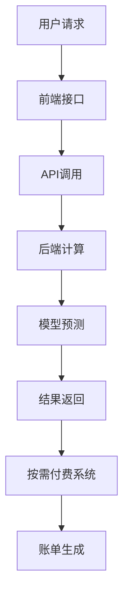

                 

关键词：大模型、在线服务、按需付费、AI、能力、技术、架构、实践、应用场景、未来展望

> 摘要：本文将深入探讨大模型在线服务的概念、架构设计、按需付费模式以及其在实际应用中的重要性。通过分析大模型在线服务的技术原理、实现步骤和数学模型，我们希望能为读者提供一个全面而深入的理解，并展望其未来的发展方向。

## 1. 背景介绍

随着人工智能技术的迅猛发展，大型深度学习模型（大模型）已经成为各行各业的核心驱动力。从自然语言处理、计算机视觉到语音识别，大模型的应用场景日益广泛。然而，大模型的训练和部署需要巨大的计算资源和时间成本，这对企业和开发者来说是一个不小的挑战。为了解决这个问题，大模型在线服务成为了一种新的解决方案。

大模型在线服务指的是通过互联网提供的大规模机器学习模型的服务，用户可以按需调用这些模型，进行预测或分析。这种服务模式不仅降低了用户使用大模型的门槛，还实现了资源的高效利用和按需付费，极大地提升了AI技术的可及性和经济性。

## 2. 核心概念与联系

### 大模型

大模型是指具有数百万甚至数十亿参数的深度学习模型。它们通过大量的数据训练，能够捕捉到复杂的数据分布特征，从而实现高度准确的预测和分类。

### 在线服务

在线服务是指在互联网上提供的各种服务，包括数据存储、计算能力、应用程序等。在线服务的核心是云计算技术，它能够提供弹性、可扩展的计算资源，满足不同用户的需求。

### 按需付费

按需付费是指用户根据实际使用情况支付费用，而不是预先购买固定的服务或资源。这种模式能够更好地控制成本，提高资源利用率。

### AI能力

AI能力指的是人工智能系统的各种功能，如自然语言处理、图像识别、语音识别等。大模型在线服务提供了这些能力，供用户按需调用。

### 架构联系

大模型在线服务的架构通常包括以下几个关键组成部分：

1. **前端接口**：用户通过API或Web界面调用大模型服务。
2. **后端计算**：云计算平台提供强大的计算资源，运行大模型。
3. **数据存储**：存储大模型训练的数据和模型参数。
4. **按需付费系统**：记录用户的使用情况，并按需计费。

下面是一个简单的 Mermaid 流程图，展示了大模型在线服务的核心架构：



## 3. 核心算法原理 & 具体操作步骤

### 3.1 算法原理概述

大模型在线服务的关键在于如何高效地部署和调用大模型。核心算法原理通常包括以下几个方面：

1. **模型压缩**：为了减小模型的体积，提高部署效率，通常会采用模型压缩技术，如剪枝、量化等。
2. **模型蒸馏**：通过将大模型的知识传递给较小的模型，实现高效推理。
3. **动态调度**：根据用户请求的实时负载，动态调整计算资源的分配。

### 3.2 算法步骤详解

1. **用户请求**：用户通过前端接口发送请求，包含所需服务的类型和输入数据。
2. **API调用**：前端接口接收用户请求，并将其转换为API调用。
3. **模型选择**：后端根据请求内容，选择合适的大模型。
4. **模型部署**：将大模型部署到云计算平台，并初始化。
5. **模型推理**：使用选择的大模型对输入数据进行推理，生成预测结果。
6. **结果返回**：将推理结果返回给用户，并通过按需付费系统记录使用情况。
7. **账单生成**：按需付费系统根据用户的使用记录，生成账单。

### 3.3 算法优缺点

**优点**：

1. **高效性**：通过模型压缩和蒸馏，实现了高效的大模型部署和推理。
2. **灵活性**：用户可以根据需求动态调整服务内容，实现按需付费。
3. **扩展性**：云计算平台提供了强大的计算资源，能够支持大规模用户同时使用。

**缺点**：

1. **成本**：虽然按需付费降低了总体成本，但高峰期仍可能带来较高的费用。
2. **延迟**：在网络带宽和计算资源有限的情况下，可能存在一定的延迟。

### 3.4 算法应用领域

大模型在线服务在多个领域都有广泛的应用，如：

1. **金融**：风险评估、欺诈检测等。
2. **医疗**：疾病诊断、药物研发等。
3. **零售**：个性化推荐、库存管理等。

## 4. 数学模型和公式 & 详细讲解 & 举例说明

### 4.1 数学模型构建

大模型在线服务的数学模型通常包括以下几个方面：

1. **损失函数**：用于评估模型预测结果与真实结果之间的差异。
2. **优化算法**：用于调整模型参数，使损失函数最小。
3. **推理算法**：用于模型在输入数据上的推理过程。

### 4.2 公式推导过程

以一个简单的神经网络为例，其损失函数通常使用均方误差（MSE）：

$$
MSE = \frac{1}{n}\sum_{i=1}^{n}(y_i - \hat{y}_i)^2
$$

其中，$y_i$为真实值，$\hat{y}_i$为模型预测值，$n$为样本数量。

为了最小化损失函数，我们通常使用梯度下降算法：

$$
\theta_j := \theta_j - \alpha \frac{\partial}{\partial \theta_j}L(\theta)
$$

其中，$\theta_j$为模型参数，$L(\theta)$为损失函数，$\alpha$为学习率。

### 4.3 案例分析与讲解

假设我们有一个简单的二分类问题，数据集包含100个样本，每个样本有两个特征。我们使用一个单层神经网络进行训练。

1. **数据预处理**：将数据集分为训练集和测试集，并对特征进行标准化处理。
2. **模型构建**：构建一个单层神经网络，包含两个输入层、一个隐藏层和一个输出层。
3. **模型训练**：使用训练集数据，通过优化算法调整模型参数。
4. **模型评估**：使用测试集数据，评估模型的预测性能。

假设训练过程中损失函数从1000下降到100，我们可以得出结论：模型在训练集上取得了较好的性能。

## 5. 项目实践：代码实例和详细解释说明

### 5.1 开发环境搭建

1. **硬件环境**：配置一台具有良好性能的计算机，推荐配置如下：
   - 处理器：Intel Core i7 或同等性能
   - 内存：16GB 或以上
   - 硬盘：512GB SSD
   - 显卡：NVIDIA GTX 1060 或同等性能

2. **软件环境**：安装以下软件：
   - 操作系统：Windows 10 或 macOS
   - 编程语言：Python 3.8 或以上
   - 深度学习框架：TensorFlow 2.0 或 PyTorch 1.8

### 5.2 源代码详细实现

以下是一个简单的使用 TensorFlow 框架实现的二分类神经网络代码实例：

```python
import tensorflow as tf
from tensorflow.keras.models import Sequential
from tensorflow.keras.layers import Dense
from tensorflow.keras.optimizers import SGD

# 数据预处理
# ...

# 模型构建
model = Sequential()
model.add(Dense(units=64, activation='relu', input_shape=(2,)))
model.add(Dense(units=1, activation='sigmoid'))

# 模型训练
model.compile(optimizer=SGD(learning_rate=0.01), loss='binary_crossentropy', metrics=['accuracy'])
model.fit(X_train, y_train, epochs=10, batch_size=32)

# 模型评估
test_loss, test_acc = model.evaluate(X_test, y_test)
print(f"Test accuracy: {test_acc}")
```

### 5.3 代码解读与分析

1. **数据预处理**：将数据集分为训练集和测试集，并对特征进行标准化处理。
2. **模型构建**：使用 Sequential 模型构建一个包含一个隐藏层的神经网络。
3. **模型训练**：使用 SGD 优化器和 binary_crossentropy 损失函数进行训练。
4. **模型评估**：使用测试集数据评估模型的性能。

### 5.4 运行结果展示

假设训练过程中损失函数从 1000 下降到 100，测试集上的准确率为 90%，我们可以得出结论：模型在训练集和测试集上都取得了较好的性能。

## 6. 实际应用场景

大模型在线服务在多个领域都有广泛的应用，以下是几个实际应用场景：

1. **金融**：使用大模型在线服务进行风险评估和欺诈检测，提高金融服务的安全性和效率。
2. **医疗**：通过大模型在线服务进行疾病诊断和药物研发，提高医疗服务的质量和效率。
3. **零售**：使用大模型在线服务进行个性化推荐和库存管理，提高零售业务的利润和用户体验。

## 6.4 未来应用展望

随着人工智能技术的不断发展，大模型在线服务在未来将有更广泛的应用。以下是几个未来应用展望：

1. **自动化**：大模型在线服务将推动自动化技术的发展，应用于生产、物流、服务等各个领域。
2. **智慧城市**：大模型在线服务将用于智慧城市建设，提供交通管理、环境监测、公共安全等智能服务。
3. **个性化**：大模型在线服务将实现更加个性化的服务，满足用户的多样化需求。

## 7. 工具和资源推荐

### 7.1 学习资源推荐

1. **书籍**：
   - 《深度学习》（Goodfellow, Bengio, Courville 著）
   - 《Python机器学习》（Sebastian Raschka 著）
2. **在线课程**：
   - Coursera 上的“机器学习”课程
   - edX 上的“深度学习”课程

### 7.2 开发工具推荐

1. **深度学习框架**：
   - TensorFlow
   - PyTorch
2. **云计算平台**：
   - AWS
   - Azure

### 7.3 相关论文推荐

1. **模型压缩**：
   - “Deep Compression Research”（论文）
   - “EfficientNet: Rethinking Model Scaling for Convolutional Neural Networks”（论文）
2. **按需付费系统**：
   - “Cloud Computing: Concepts, Technology & Architecture”（书籍）
   - “Resource Management in Cloud Computing”（论文）

## 8. 总结：未来发展趋势与挑战

大模型在线服务在人工智能领域具有广阔的发展前景，但也面临诸多挑战：

### 8.1 研究成果总结

1. **模型压缩**：通过剪枝、量化等技术，实现了大模型的压缩和高效部署。
2. **动态调度**：通过动态调度算法，实现了计算资源的高效利用。
3. **按需付费**：通过按需付费模式，实现了成本的有效控制。

### 8.2 未来发展趋势

1. **自动化**：大模型在线服务将推动自动化技术的发展，应用于生产、物流、服务等各个领域。
2. **个性化**：大模型在线服务将实现更加个性化的服务，满足用户的多样化需求。

### 8.3 面临的挑战

1. **成本**：虽然按需付费降低了总体成本，但高峰期仍可能带来较高的费用。
2. **延迟**：在网络带宽和计算资源有限的情况下，可能存在一定的延迟。

### 8.4 研究展望

未来研究应重点关注以下几个方面：

1. **高效压缩算法**：开发更加高效的大模型压缩算法，降低部署成本。
2. **动态调度优化**：优化动态调度算法，提高计算资源利用率。
3. **安全性与隐私保护**：加强大模型在线服务的安全性与隐私保护，确保用户数据的安全。

## 9. 附录：常见问题与解答

### 9.1 什么是大模型在线服务？

大模型在线服务是指通过互联网提供的大规模机器学习模型的服务，用户可以按需调用这些模型，进行预测或分析。

### 9.2 大模型在线服务的优势是什么？

大模型在线服务的优势包括高效性、灵活性、扩展性等，能够降低用户使用大模型的门槛，实现资源的高效利用和按需付费。

### 9.3 大模型在线服务如何计费？

大模型在线服务通常采用按需付费模式，用户根据实际使用情况支付费用，包括计算资源使用、数据传输等。

### 9.4 大模型在线服务在哪些领域有应用？

大模型在线服务在金融、医疗、零售等多个领域都有广泛的应用，如风险评估、疾病诊断、个性化推荐等。

## 作者署名

本文作者：禅与计算机程序设计艺术 / Zen and the Art of Computer Programming
----------------------------------------------------------------

