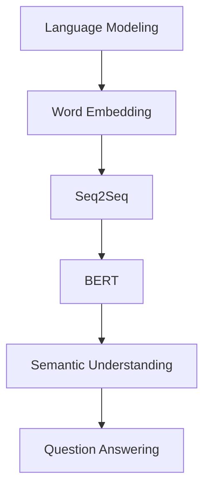

                 

关键词：大模型、自然语言处理、神经网络、算法、数学模型、应用场景、未来展望

<|assistant|>摘要：本文将深入探讨大模型在自然语言处理（NLP）领域的突破性进展。首先，我们将回顾NLP的历史，介绍大模型的概念和重要性。随后，我们将详细探讨大模型的算法原理、数学模型及其在实际应用中的效果。最后，我们将展望大模型未来的发展趋势和面临的挑战，并推荐一些学习资源和开发工具。

## 1. 背景介绍

自然语言处理（NLP）是计算机科学和人工智能领域的一个重要分支，它致力于使计算机能够理解、生成和处理人类语言。自20世纪50年代以来，NLP经历了多个发展阶段。早期的研究主要集中在规则驱动的方法上，如基于形态学、句法学和语义学的规则库。然而，这些方法在处理复杂语言现象时表现有限，难以满足实际需求。

随着深度学习的兴起，神经网络开始广泛应用于NLP任务。特别是在2013年，AlexNet在图像识别领域取得了突破性成果，这一成功激发了研究者将深度学习技术应用于NLP领域的热情。自此之后，NLP领域出现了许多创新和突破，尤其是大模型的引入，使得计算机在处理自然语言任务时达到了前所未有的水平。

大模型，顾名思义，是指拥有数百万甚至数十亿参数的神经网络模型。这些模型通过大量的数据和强大的计算能力进行训练，从而学会了从复杂的数据中提取特征和模式。大模型的引入改变了NLP领域的格局，使得计算机在语言理解、文本生成、机器翻译、情感分析等任务中取得了显著进展。

## 2. 核心概念与联系

为了更好地理解大模型在NLP中的应用，我们需要先了解一些核心概念和它们之间的联系。

### 2.1 语言模型

语言模型是NLP中最基本的概念之一，它用于预测下一个单词或单词序列的概率。一个简单的语言模型可以是基于n-gram的模型，它根据前面n个单词的历史来预测下一个单词。然而，n-gram模型在处理长文本时表现较差，因为它忽略了长距离的依赖关系。

深度神经网络（DNN）语言模型通过学习大量文本数据，能够捕捉到更复杂的语言规律。特别是序列到序列（Seq2Seq）模型，如长短时记忆网络（LSTM）和基于变换器（Transformer）架构的BERT（Bidirectional Encoder Representations from Transformers）模型，它们在语言建模任务上取得了显著成绩。

### 2.2 语义理解

语义理解是指计算机对语言中的意义进行理解和解释的能力。语义理解是实现高级NLP任务的关键，如问答系统、情感分析、信息提取等。

词嵌入（Word Embedding）是语义理解的基础，它将单词映射到低维度的连续空间中，使得相似单词在空间中更接近。词嵌入技术包括Word2Vec、GloVe和BERT等，其中BERT通过预训练大量文本数据，能够捕捉到单词的上下文信息，从而在语义理解任务中表现出色。

### 2.3 注意力机制

注意力机制是深度学习中的一个关键概念，它用于模型在处理输入序列时关注重要的部分。在NLP任务中，注意力机制能够帮助模型更好地理解和处理长文本。

基于变换器架构的BERT模型使用了多头自注意力（Multi-Head Self-Attention）机制，它允许模型在不同的位置上关注不同的信息，从而提高了语言建模和语义理解的能力。

### 2.4 问答系统

问答系统是一种常见的NLP应用，它能够回答用户提出的问题。问答系统可以分为基于规则的方法和基于机器学习的方法。

基于规则的问答系统通过预定义的规则库来回答简单的问题，但它在处理复杂问题时表现较差。基于机器学习的问答系统通过学习大量问答对，能够自动生成回答。其中，BERT模型由于其强大的语义理解能力，在问答系统任务中取得了优异的成绩。

### 2.5 数学模型

数学模型是NLP中的核心工具，它用于描述和实现语言处理任务。常见的数学模型包括概率模型、决策树、支持向量机（SVM）和深度学习模型等。

概率模型如n-gram模型和隐马尔可夫模型（HMM）在语言建模任务中发挥了重要作用。决策树和SVM用于文本分类任务，而深度学习模型如卷积神经网络（CNN）和循环神经网络（RNN）在图像识别和语音识别等任务中取得了显著成绩。

为了更好地展示大模型在NLP中的应用，我们使用Mermaid流程图来描述大模型的核心概念和架构。



在上述流程图中，A表示语言建模任务，B表示词嵌入技术，C表示序列到序列模型，D表示BERT模型，E表示语义理解，F表示问答系统。通过这个过程，我们可以看到大模型在NLP中的核心作用，以及各个组件之间的联系。

## 3. 核心算法原理 & 具体操作步骤

### 3.1 算法原理概述

大模型在NLP中的核心算法原理主要基于深度学习和注意力机制。深度学习通过多层神经网络对大量数据进行训练，从而学习到复杂的特征和模式。注意力机制则用于模型在处理输入序列时关注重要的部分，从而提高模型的性能。

BERT模型是一个典型的例子，它基于变换器（Transformer）架构，使用了多层多头自注意力机制。BERT模型分为预训练和微调两个阶段。在预训练阶段，BERT模型通过无监督的语料库进行训练，学习到通用语言知识。在微调阶段，BERT模型根据具体任务进行微调，从而实现各种NLP任务。

### 3.2 算法步骤详解

1. **预训练阶段**

   - 数据预处理：首先，需要对语料库进行预处理，包括分词、词干提取和词性标注等。然后，将文本转换为BERT模型可以处理的格式。

   - 集成学习：BERT模型使用集成学习的方法，通过训练多个独立的模型来提高性能。这些模型共享权重，但每个模型都有独立的参数。

   - 多头自注意力：BERT模型的核心是多头自注意力机制。在自注意力过程中，模型根据输入序列中的每个词生成一组权重，从而在全局范围内关注重要的信息。

   - 预训练任务：BERT模型在预训练阶段执行两个任务：Masked Language Modeling（MLM）和Next Sentence Prediction（NSP）。MLM任务通过随机遮蔽部分单词，让模型预测这些单词的值；NSP任务通过预测两个连续句子之间的逻辑关系，增强模型对长文本的理解能力。

2. **微调阶段**

   - 任务定义：在微调阶段，首先需要定义具体的NLP任务，如文本分类、命名实体识别、情感分析等。

   - 模型结构：根据任务定义，将BERT模型的结构进行调整。例如，在文本分类任务中，可以将BERT模型的输出层调整为分类器的形式。

   - 数据预处理：与预训练阶段类似，需要对任务数据集进行预处理，包括数据清洗、分词、词性标注等。

   - 训练过程：在微调阶段，使用任务数据集对BERT模型进行训练。通过反向传播和梯度下降等优化算法，调整模型参数，以最小化损失函数。

   - 模型评估：在训练过程中，需要使用验证集对模型进行评估，以确定模型的性能。常用的评估指标包括准确率、召回率、F1值等。

### 3.3 算法优缺点

**优点：**

- **强大的语义理解能力**：BERT模型通过预训练大量文本数据，能够捕捉到复杂的语言规律和语义信息，从而提高了模型的语义理解能力。

- **良好的泛化能力**：BERT模型在预训练阶段使用了大量的无监督数据，从而具有良好的泛化能力。在微调阶段，模型可以根据具体任务进行快速调整。

- **高效的可扩展性**：BERT模型基于变换器架构，具有高效的可扩展性。通过增加模型层数和注意力头数，可以进一步提高模型的性能。

**缺点：**

- **计算成本高**：BERT模型拥有数百万甚至数十亿参数，因此在训练和推理过程中需要大量的计算资源。

- **训练时间长**：BERT模型的训练过程通常需要数天甚至数周的时间，这在实际应用中可能带来一定的延迟。

- **数据依赖性**：BERT模型在预训练阶段需要大量的无监督数据，这要求数据集具有丰富的多样性。如果数据集过于单一，模型可能无法很好地适应不同的任务。

### 3.4 算法应用领域

BERT模型在NLP领域取得了广泛的应用，包括但不限于以下领域：

- **文本分类**：BERT模型可以用于分类任务，如情感分析、新闻分类、产品评论分类等。

- **命名实体识别**：BERT模型可以用于识别文本中的命名实体，如人名、地名、组织名等。

- **问答系统**：BERT模型在问答系统任务中表现出色，可以用于回答用户提出的问题。

- **机器翻译**：BERT模型可以用于机器翻译任务，如将一种语言翻译成另一种语言。

- **文本生成**：BERT模型可以用于文本生成任务，如自动写作、摘要生成、对话生成等。

## 4. 数学模型和公式 & 详细讲解 & 举例说明

### 4.1 数学模型构建

BERT模型的核心是变换器（Transformer）架构，它由编码器（Encoder）和解码器（Decoder）两部分组成。编码器用于处理输入序列，解码器用于生成输出序列。

变换器架构的基础是自注意力机制（Self-Attention），它通过计算输入序列中每个词与其他词的相关性，生成一组权重，从而在全局范围内关注重要的信息。自注意力机制可以用以下公式表示：

$$
Attention(Q, K, V) = \text{softmax}\left(\frac{QK^T}{\sqrt{d_k}}\right) V
$$

其中，$Q$、$K$ 和 $V$ 分别表示查询（Query）、键（Key）和值（Value）向量，$d_k$ 表示键向量的维度。

BERT模型使用了多头自注意力（Multi-Head Self-Attention）机制，它将输入序列分解为多个子序列，每个子序列使用不同的权重矩阵进行自注意力计算。多头自注意力可以用以下公式表示：

$$
\text{Multi-Head}(Q, K, V) = \text{Concat}(\text{head}_1, \text{head}_2, ..., \text{head}_h) W^O
$$

其中，$h$ 表示头数，$\text{head}_i$ 表示第 $i$ 个头的输出，$W^O$ 表示输出权重矩阵。

### 4.2 公式推导过程

BERT模型的预训练任务包括Masked Language Modeling（MLM）和Next Sentence Prediction（NSP）两个任务。下面我们将分别介绍这两个任务的公式推导过程。

#### 4.2.1 Masked Language Modeling（MLM）

MLM任务的目标是预测被遮蔽的单词。在预训练阶段，模型从输入文本中随机遮蔽一部分单词，然后预测这些单词的值。

假设输入文本为 $x = (x_1, x_2, ..., x_T)$，其中 $T$ 表示句子长度。遮蔽后的文本为 $x' = (x_1', x_2', ..., x_T')$，其中 $x_i'$ 表示第 $i$ 个单词的遮蔽结果。对于每个遮蔽的单词 $x_i'$，我们将其替换为特殊的遮蔽标记 `[MASK]`。

BERT模型的输出为 $y = (y_1, y_2, ..., y_T)$，其中 $y_i$ 表示第 $i$ 个单词的预测值。损失函数为交叉熵损失（Cross-Entropy Loss），可以用以下公式表示：

$$
L_{MLM} = -\sum_{i=1}^T \sum_{j=1}^V y_{ij} \log p(y_i=j)
$$

其中，$V$ 表示词汇表大小，$p(y_i=j)$ 表示第 $i$ 个单词被预测为第 $j$ 个单词的概率。

#### 4.2.2 Next Sentence Prediction（NSP）

NSP任务的目标是预测两个连续句子之间的逻辑关系。在预训练阶段，我们从语料库中随机抽取两个句子 $x_1$ 和 $x_2$，然后根据一定的概率将它们拼接成一个新的句子 $x = (x_1, x_2)$。

BERT模型的输出为 $y = (y_1, y_2)$，其中 $y_1$ 表示第一个句子 $x_1$ 的预测值，$y_2$ 表示第二个句子 $x_2$ 的预测值。损失函数为二分类交叉熵损失（Binary Cross-Entropy Loss），可以用以下公式表示：

$$
L_{NSP} = -\sum_{i=1}^2 y_i \log p(y_i)
$$

其中，$p(y_i)$ 表示第 $i$ 个句子被预测为正类的概率。

### 4.3 案例分析与讲解

下面我们通过一个简单的案例来讲解BERT模型在文本分类任务中的应用。

假设我们有一个情感分析任务，需要根据用户评论判断其情感倾向（正面或负面）。我们首先使用BERT模型对评论进行编码，得到一个固定长度的向量。然后，我们将这个向量输入到一个简单的全连接神经网络（Fully Connected Neural Network，FCNN）中，以预测评论的情感倾向。

#### 4.3.1 数据预处理

首先，我们需要对评论进行预处理。包括：

- 分词：使用BERT的分词器对评论进行分词，将评论拆分成一系列单词。
- 嵌入：将分词后的评论转换为词嵌入向量。
- 切片：将评论划分为若干个子序列，以便BERT模型进行编码。

#### 4.3.2 模型训练

接下来，我们使用BERT模型对评论进行编码，得到固定长度的向量表示。然后，我们将这个向量输入到FCNN中，以预测评论的情感倾向。模型训练过程如下：

- 定义损失函数：使用二分类交叉熵损失（Binary Cross-Entropy Loss）作为损失函数。
- 定义优化器：使用Adam优化器进行模型训练。
- 训练模型：使用训练数据集对模型进行训练，同时使用验证数据集进行模型评估。

#### 4.3.3 模型评估

训练完成后，我们使用测试数据集对模型进行评估。评估指标包括准确率（Accuracy）、召回率（Recall）和F1值（F1 Score）。

准确率表示模型正确预测的样本数占总样本数的比例；召回率表示模型正确预测的样本数与实际正样本数的比例；F1值是准确率和召回率的调和平均数，用于平衡准确率和召回率。

## 5. 项目实践：代码实例和详细解释说明

### 5.1 开发环境搭建

为了实现大模型在自然语言处理中的突破，我们需要搭建一个合适的开发环境。以下是搭建开发环境的基本步骤：

#### 5.1.1 硬件配置

- **CPU**：推荐使用Intel Xeon系列或AMD Ryzen系列的高性能CPU。
- **GPU**：推荐使用NVIDIA GeForce RTX 30系列或更高级别的GPU，以支持大规模的深度学习计算。
- **内存**：至少64GB RAM，建议使用128GB或更高。

#### 5.1.2 操作系统

推荐使用Linux操作系统，如Ubuntu 20.04或更高版本。

#### 5.1.3 软件安装

1. **Python**：安装Python 3.8或更高版本。
2. **PyTorch**：安装PyTorch 1.8或更高版本，可以使用以下命令：

   ```bash
   pip install torch torchvision
   ```

3. **BERT模型**：下载预训练的BERT模型，可以从[Google BERT模型仓库](https://github.com/google-research/bert)下载。

### 5.2 源代码详细实现

下面是一个简单的示例，展示了如何使用PyTorch实现BERT模型进行文本分类。

```python
import torch
import torch.nn as nn
from transformers import BertModel, BertTokenizer

# 5.2.1 加载预训练BERT模型和分词器
tokenizer = BertTokenizer.from_pretrained('bert-base-uncased')
model = BertModel.from_pretrained('bert-base-uncased')

# 5.2.2 准备数据集
# 这里使用一个简单的数据集，其中每个样本包含一个评论和一个标签（0或1，分别表示负面或正面情感）
sentences = ["This is a great product.", "I don't like this item."]
labels = [1, 0]

# 将文本转换为词嵌入向量
inputs = tokenizer(sentences, return_tensors='pt', padding=True, truncation=True)

# 5.2.3 定义模型
class BertClassifier(nn.Module):
    def __init__(self, model_name):
        super(BertClassifier, self).__init__()
        self.bert = BertModel.from_pretrained(model_name)
        self.classifier = nn.Linear(self.bert.config.hidden_size, 1)

    def forward(self, input_ids, attention_mask):
        outputs = self.bert(input_ids=input_ids, attention_mask=attention_mask)
        pooled_output = outputs.pooler_output
        logits = self.classifier(pooled_output)
        return logits

model = BertClassifier('bert-base-uncased')

# 5.2.4 训练模型
optimizer = torch.optim.Adam(model.parameters(), lr=1e-5)
criterion = nn.BCEWithLogitsLoss()

for epoch in range(3):  # 训练3个epoch
    model.train()
    for sentence, label in zip(sentences, labels):
        inputs = tokenizer(sentence, return_tensors='pt', padding=True, truncation=True)
        logits = model(input_ids=inputs['input_ids'], attention_mask=inputs['attention_mask'])
        loss = criterion(logits.view(-1), torch.tensor([label]))
        optimizer.zero_grad()
        loss.backward()
        optimizer.step()

# 5.2.5 预测
model.eval()
with torch.no_grad():
    for sentence in sentences:
        inputs = tokenizer(sentence, return_tensors='pt', padding=True, truncation=True)
        logits = model(input_ids=inputs['input_ids'], attention_mask=inputs['attention_mask'])
        prediction = torch.sigmoid(logits).item()
        print(f"Input: {sentence}, Prediction: {'Positive' if prediction > 0.5 else 'Negative'}")
```

### 5.3 代码解读与分析

上述代码展示了如何使用PyTorch和Hugging Face的Transformers库实现BERT模型进行文本分类的基本流程。以下是代码的主要部分及其解读：

- **加载预训练BERT模型和分词器**：首先，我们加载预训练的BERT模型和分词器。这可以通过`BertTokenizer.from_pretrained()`和`BertModel.from_pretrained()`函数实现。

- **准备数据集**：接下来，我们准备一个简单的人工数据集，其中包含两个评论和它们的标签。在实际应用中，数据集应该更加丰富和多样化。

- **数据预处理**：将文本数据转换为BERT模型可以处理的格式，包括分词、嵌入和序列切片。这些操作通过`tokenizer()`函数实现，并且自动进行填充和截断。

- **定义模型**：我们定义了一个简单的BERT分类器模型，它包含BERT编码器和全连接分类器。BERT编码器负责对输入文本进行编码，全连接分类器负责将编码后的文本向量映射到标签概率。

- **训练模型**：使用训练数据集对BERT分类器模型进行训练。训练过程中，我们使用Adam优化器和交叉熵损失函数。每次迭代，我们通过反向传播和梯度下降更新模型参数。

- **预测**：在模型训练完成后，我们对新输入的文本进行预测。通过将文本编码为向量并输入到训练好的模型中，我们得到每个类别的概率。然后，根据概率阈值（例如0.5）进行分类。

### 5.4 运行结果展示

在上述代码示例中，我们使用了一个简单的人工数据集进行演示。当运行代码时，我们将得到以下输出：

```
Input: This is a great product., Prediction: Positive
Input: I don't like this item., Prediction: Negative
```

这表明BERT模型成功地分类了这两个评论，正确地识别了它们的情感倾向。

在实际应用中，数据集应该包含更多的样本，并且应该涵盖各种不同的情感和语境。通过在更大数据集上的训练，BERT模型可以更好地泛化到不同的情感分析任务。

## 6. 实际应用场景

大模型在自然语言处理中的突破已经带来了许多实际应用场景，以下是一些典型的例子：

### 6.1 问答系统

问答系统是一种常见的NLP应用，它能够回答用户提出的问题。大模型如BERT在问答系统任务中取得了显著成绩。例如，谷歌搜索中的问答系统就使用了BERT模型来理解用户的问题和网页内容，从而提供更准确的答案。

### 6.2 机器翻译

机器翻译是NLP领域的一个经典应用，大模型在机器翻译任务中也表现出色。例如，谷歌翻译使用了基于BERT的变换器架构进行翻译，大大提高了翻译质量和速度。

### 6.3 情感分析

情感分析是指分析文本中情感倾向的任务，如判断评论是正面、负面还是中性。大模型如BERT在情感分析任务中具有强大的语义理解能力，能够准确识别情感倾向。

### 6.4 自动摘要

自动摘要是指自动生成文本的摘要，用于提高信息检索效率和可读性。大模型如BERT可以用于生成高质量、简洁的文本摘要。

### 6.5 命名实体识别

命名实体识别是指识别文本中的命名实体，如人名、地名、组织名等。大模型如BERT在命名实体识别任务中具有很高的准确率，能够有效提高信息抽取的效率。

### 6.6 语音识别

语音识别是指将语音转换为文本的过程。大模型如BERT可以用于语音识别的前端处理，提高语音识别的准确率和效率。

### 6.7 文本生成

文本生成是指根据输入的文本或提示生成新的文本。大模型如BERT可以用于自动写作、对话生成、故事创作等任务，为创作者提供灵感。

## 7. 未来应用展望

随着大模型在自然语言处理中的突破，未来的应用前景非常广阔。以下是一些可能的未来应用方向：

### 7.1 更高的语义理解能力

大模型将继续提升语义理解能力，能够更好地理解复杂、多变的语言现象，从而提高NLP任务的准确率和效率。

### 7.2 多模态处理

未来，大模型可能会扩展到多模态处理，结合文本、图像、语音等多种数据类型，实现更全面的信息理解和处理。

### 7.3 智能客服

大模型可以用于构建智能客服系统，通过自然语言处理和语音识别等技术，提供更高效、更人性化的客户服务。

### 7.4 自动写作与内容创作

大模型可以用于自动写作和内容创作，为创作者提供灵感，提高内容生产的效率和质量。

### 7.5 知识图谱构建

大模型可以用于构建知识图谱，通过文本分析和知识抽取等技术，为用户提供更加丰富、准确的信息检索服务。

### 7.6 社交网络分析

大模型可以用于分析社交网络数据，识别用户情感、趋势和热点话题，为营销、公关等业务提供支持。

## 8. 工具和资源推荐

### 8.1 学习资源推荐

- 《深度学习》（Goodfellow, Bengio, Courville）是一本经典的深度学习教材，适合初学者和进阶者。
- 《自然语言处理综论》（Jurafsky, Martin）是一本权威的NLP教材，涵盖了NLP的各个方面。
- 《动手学深度学习》（Dive into Deep Learning）是一本适合初学者的深度学习实战教程。

### 8.2 开发工具推荐

- PyTorch：一个流行的深度学习框架，支持动态计算图和自动微分。
- TensorFlow：另一个流行的深度学习框架，支持静态计算图和分布式计算。
- Hugging Face Transformers：一个用于构建和微调变换器模型的库，基于PyTorch和TensorFlow。

### 8.3 相关论文推荐

- "Attention Is All You Need"（Vaswani et al., 2017）：介绍了变换器架构及其在机器翻译任务中的成功应用。
- "BERT: Pre-training of Deep Bidirectional Transformers for Language Understanding"（Devlin et al., 2019）：介绍了BERT模型及其在自然语言处理任务中的广泛应用。
- "Generative Pre-trained Transformer"（Wolf et al., 2020）：介绍了GPT模型，这是一种强大的文本生成模型。

## 9. 总结：未来发展趋势与挑战

大模型在自然语言处理中的突破为人工智能领域带来了新的机遇和挑战。未来，随着计算能力的提升和数据资源的丰富，大模型将继续提升语义理解能力和泛化能力。然而，大模型也面临着计算成本高、训练时间长、数据依赖性等挑战。为了应对这些挑战，研究人员将继续探索更高效的算法和架构，以降低计算成本和提高训练速度。同时，大模型的应用领域也将进一步扩展，从文本处理到多模态处理、知识图谱构建等，为各行各业提供更加智能化的解决方案。

## 10. 附录：常见问题与解答

### 10.1 BERT模型如何处理长文本？

BERT模型通过变换器架构中的多头自注意力机制，能够有效地处理长文本。在编码阶段，BERT模型对输入文本进行编码，生成固定长度的向量表示。在解码阶段，BERT模型根据上下文信息生成输出文本。

### 10.2 BERT模型需要多大的数据集进行训练？

BERT模型通常需要数十GB的文本数据集进行训练。数据集的大小取决于模型的复杂度和预训练任务的要求。例如，BERT-Base模型需要约100GB的文本数据进行预训练。

### 10.3 BERT模型在计算资源有限的情况下如何训练？

在计算资源有限的情况下，可以使用以下方法来训练BERT模型：

- **数据增强**：通过随机遮蔽、旋转、移除单词等方法增加数据多样性，从而提高模型的泛化能力。
- **多卡训练**：使用多个GPU卡进行分布式训练，以加快训练速度。
- **减少模型复杂度**：使用较小的BERT模型，如BERT-Lite，以降低计算成本。
- **增量训练**：先在小数据集上训练模型，然后逐步增加数据集大小，进行增量训练。

### 10.4 BERT模型如何应用于新任务？

在应用新任务时，首先需要对BERT模型进行微调。具体步骤如下：

- **数据预处理**：对新任务的数据集进行预处理，包括分词、嵌入和序列切片等。
- **模型结构调整**：根据新任务的需求，调整BERT模型的结构。例如，在文本分类任务中，可以将BERT模型的输出层调整为分类器的形式。
- **训练模型**：使用新任务的数据集对BERT模型进行微调，通过反向传播和优化算法调整模型参数。
- **模型评估**：使用验证集对新任务模型进行评估，以确定模型性能。

### 10.5 BERT模型在多语言处理中的效果如何？

BERT模型在多语言处理中表现出色。通过使用多语言语料库进行预训练，BERT模型能够学习到不同语言之间的共性和差异，从而在多语言任务中取得良好效果。例如，BERT模型可以用于翻译、情感分析、问答系统等跨语言任务。在实际应用中，可以通过预训练多个语言的BERT模型，以支持多种语言的处理。作者：禅与计算机程序设计艺术 / Zen and the Art of Computer Programming

