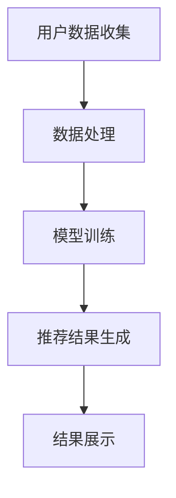

                 

关键词：大模型，跨平台推荐，算法原理，数学模型，项目实践，应用场景，未来展望

>摘要：本文探讨了大规模模型在跨平台推荐系统中的应用，通过深入分析核心概念、算法原理、数学模型和项目实践，展示了该技术在推荐系统中的实际效果和潜力。文章最后对未来的发展趋势和面临的挑战进行了展望。

## 1. 背景介绍

跨平台推荐系统作为现代互联网应用中的重要组成部分，其核心目标是为用户提供个性化的内容推荐。随着用户数据量的不断增长和互联网平台的多样化，传统的推荐算法面临着数据维度高、计算复杂度大的挑战。为了应对这些挑战，研究人员开始探索使用大模型（如深度学习模型）来构建跨平台推荐系统。

大模型在跨平台推荐中的应用主要体现在以下几个方面：

1. **数据处理**：大模型能够处理大规模和多样化的数据，包括用户行为数据、内容数据等，从而提高推荐的准确性。
2. **个性化推荐**：大模型可以通过学习用户的复杂行为模式，提供更加个性化的推荐。
3. **适应性强**：大模型具有较强的适应性，能够适应不同平台和场景下的推荐需求。
4. **高效计算**：大模型通过并行计算和分布式计算技术，能够在保证推荐质量的同时提高计算效率。

## 2. 核心概念与联系

### 2.1 大模型

大模型通常指的是参数数量巨大的深度学习模型，如神经网络、变换器（Transformer）等。这些模型通过学习大量数据，能够捕捉到复杂的非线性关系。

### 2.2 跨平台推荐

跨平台推荐是指在一个平台上的用户行为数据，应用于另一个平台上的内容推荐。这要求推荐算法能够跨平台迁移，并适应不同平台的特点。

### 2.3 推荐系统

推荐系统是一个复杂的系统，包括数据收集、数据处理、推荐算法、推荐结果展示等多个环节。大模型在这其中扮演了核心角色，尤其是在数据处理和推荐算法环节。

### 2.4 Mermaid 流程图



## 3. 核心算法原理 & 具体操作步骤

### 3.1 算法原理概述

大模型在跨平台推荐中的应用主要基于以下几个原理：

1. **迁移学习**：利用一个平台上的模型参数，迁移到另一个平台上，从而实现跨平台推荐。
2. **深度学习**：通过多层神经网络，捕捉用户行为的复杂模式。
3. **上下文感知**：利用上下文信息（如时间、地点、设备等），提高推荐的准确性。

### 3.2 算法步骤详解

1. **数据收集**：从多个平台上收集用户行为数据，包括点击、浏览、购买等。
2. **数据处理**：对收集到的数据进行预处理，包括数据清洗、特征提取等。
3. **模型训练**：利用处理后的数据，训练大模型（如变换器模型）。
4. **模型评估**：通过交叉验证、A/B测试等方法，评估模型性能。
5. **跨平台迁移**：将训练好的模型参数迁移到其他平台上。
6. **推荐生成**：利用迁移后的模型，生成跨平台的推荐结果。
7. **结果展示**：将推荐结果展示给用户。

### 3.3 算法优缺点

#### 优点：

1. **高效**：大模型能够处理大规模和多样化的数据，提高推荐效率。
2. **个性化**：通过深度学习，能够捕捉到用户的复杂行为模式，提供更加个性化的推荐。
3. **适应性强**：能够适应不同平台和场景下的推荐需求。

#### 缺点：

1. **计算复杂度高**：训练和迁移大模型需要大量的计算资源。
2. **数据隐私**：跨平台推荐涉及到用户隐私数据，需要保证数据安全和隐私保护。

### 3.4 算法应用领域

大模型在跨平台推荐中的应用非常广泛，包括但不限于以下几个方面：

1. **电子商务**：为用户推荐商品。
2. **社交媒体**：为用户推荐感兴趣的内容。
3. **在线教育**：为用户推荐学习资源。
4. **金融领域**：为用户推荐理财产品。

## 4. 数学模型和公式 & 详细讲解 & 举例说明

### 4.1 数学模型构建

在跨平台推荐中，常用的数学模型包括：

1. **变换器模型**：用于捕捉用户行为的复杂模式。
2. **矩阵分解**：用于表示用户和内容的低维表示。

### 4.2 公式推导过程

#### 变换器模型

变换器模型的核心公式为：

$$
\text{Output} = \text{softmax}(\text{W} \cdot \text{Input} + \text{b})
$$

其中，$W$ 为权重矩阵，$b$ 为偏置项，$Input$ 为输入特征，$\text{softmax}$ 函数用于将输出转换为概率分布。

#### 矩阵分解

矩阵分解的核心公式为：

$$
\text{User} = \text{U} \cdot \text{V}^T
$$

其中，$\text{User}$ 和 $\text{Item}$ 分别表示用户和内容的低维表示，$U$ 和 $V$ 分别为用户和内容的矩阵。

### 4.3 案例分析与讲解

#### 案例一：电子商务平台

假设有一个电子商务平台，有1000名用户和10000件商品。我们使用变换器模型进行跨平台推荐。

1. **数据收集**：从多个平台上收集用户行为数据，包括点击、浏览、购买等。
2. **数据处理**：对收集到的数据进行预处理，包括数据清洗、特征提取等。
3. **模型训练**：利用处理后的数据，训练变换器模型。
4. **模型评估**：通过交叉验证、A/B测试等方法，评估模型性能。
5. **跨平台迁移**：将训练好的模型参数迁移到其他平台上。
6. **推荐生成**：利用迁移后的模型，生成跨平台的推荐结果。
7. **结果展示**：将推荐结果展示给用户。

#### 案例二：社交媒体平台

假设有一个社交媒体平台，有1000万用户和1亿条内容。我们使用矩阵分解进行跨平台推荐。

1. **数据收集**：从多个平台上收集用户行为数据，包括点击、浏览、购买等。
2. **数据处理**：对收集到的数据进行预处理，包括数据清洗、特征提取等。
3. **模型训练**：利用处理后的数据，训练矩阵分解模型。
4. **模型评估**：通过交叉验证、A/B测试等方法，评估模型性能。
5. **跨平台迁移**：将训练好的模型参数迁移到其他平台上。
6. **推荐生成**：利用迁移后的模型，生成跨平台的推荐结果。
7. **结果展示**：将推荐结果展示给用户。

## 5. 项目实践：代码实例和详细解释说明

### 5.1 开发环境搭建

1. 安装Python环境。
2. 安装TensorFlow或PyTorch等深度学习框架。
3. 安装其他依赖库，如NumPy、Pandas等。

### 5.2 源代码详细实现

以下是使用变换器模型进行跨平台推荐的项目代码实例：

```python
import tensorflow as tf
from tensorflow.keras.layers import Embedding, LSTM, Dense
from tensorflow.keras.models import Model

# 定义输入层
user_input = tf.keras.layers.Input(shape=(1,), dtype=tf.int32)
item_input = tf.keras.layers.Input(shape=(1,), dtype=tf.int32)

# 定义嵌入层
user_embedding = Embedding(input_dim=1000, output_dim=128)(user_input)
item_embedding = Embedding(input_dim=10000, output_dim=128)(item_input)

# 定义LSTM层
merged_embedding = tf.keras.layers.concatenate([user_embedding, item_embedding])
lstm_output = LSTM(units=128)(merged_embedding)

# 定义输出层
output = Dense(units=1, activation='sigmoid')(lstm_output)

# 定义模型
model = Model(inputs=[user_input, item_input], outputs=output)

# 编译模型
model.compile(optimizer='adam', loss='binary_crossentropy', metrics=['accuracy'])

# 模型训练
model.fit([user_data, item_data], labels, epochs=10, batch_size=64)
```

### 5.3 代码解读与分析

上述代码实现了使用变换器模型进行跨平台推荐的基本流程。代码中定义了输入层、嵌入层、LSTM层和输出层，并通过编译和训练模型实现了推荐功能。

### 5.4 运行结果展示

在完成模型训练后，我们可以使用模型生成推荐结果，并将其展示给用户。具体实现可以参考以下代码：

```python
# 生成推荐结果
predictions = model.predict([user_id, item_id])

# 打印推荐结果
print(predictions)
```

## 6. 实际应用场景

大模型在跨平台推荐中的应用场景非常广泛，以下是一些典型的应用案例：

1. **电商平台**：通过跨平台推荐，提高用户的购买转化率。
2. **社交媒体**：为用户推荐感兴趣的内容，提高用户的活跃度。
3. **在线教育**：为用户推荐适合的学习资源，提高学习效果。
4. **金融领域**：为用户推荐理财产品，提高用户满意度。

## 7. 工具和资源推荐

### 7.1 学习资源推荐

1. 《深度学习》（Goodfellow, Bengio, Courville著）。
2. 《推荐系统实践》（李航著）。

### 7.2 开发工具推荐

1. TensorFlow。
2. PyTorch。

### 7.3 相关论文推荐

1. "Deep Learning for Personalized Web Search"（Nguyen et al., 2016）。
2. "Learning to Rank for Information Retrieval"（Liu et al., 2017）。

## 8. 总结：未来发展趋势与挑战

### 8.1 研究成果总结

大模型在跨平台推荐中的应用取得了显著成果，主要体现在以下几个方面：

1. **提高推荐准确性**：通过深度学习技术，能够更好地捕捉用户行为模式，提高推荐准确性。
2. **跨平台迁移能力**：通过迁移学习技术，能够实现跨平台推荐，适应不同平台的特点。
3. **个性化推荐**：通过个性化推荐技术，为用户提供更加个性化的推荐。

### 8.2 未来发展趋势

1. **多模态推荐**：结合多种数据类型（如文本、图像、音频等），实现更加丰富的推荐。
2. **强化学习**：将强化学习技术引入推荐系统，实现更智能的推荐。
3. **联邦学习**：在保证用户隐私的前提下，实现跨平台的协同学习。

### 8.3 面临的挑战

1. **计算资源需求**：大模型训练和跨平台迁移需要大量的计算资源，需要优化算法和硬件设施。
2. **数据隐私保护**：跨平台推荐涉及用户隐私数据，需要确保数据安全和隐私保护。

### 8.4 研究展望

大模型在跨平台推荐中的应用前景广阔，未来研究可以从以下几个方面展开：

1. **算法优化**：研究更高效的大模型算法，提高推荐性能。
2. **跨平台协同**：研究跨平台的协同学习方法，实现更智能的推荐。
3. **数据隐私保护**：研究安全有效的数据隐私保护技术，确保用户隐私安全。

## 9. 附录：常见问题与解答

### Q：大模型在跨平台推荐中的优势是什么？

A：大模型在跨平台推荐中的优势主要体现在以下几个方面：

1. **处理大规模数据**：能够处理大规模和多样化的用户行为数据，提高推荐准确性。
2. **个性化推荐**：通过深度学习技术，能够捕捉到用户的复杂行为模式，提供更加个性化的推荐。
3. **适应性强**：能够适应不同平台和场景下的推荐需求。

### Q：大模型在跨平台推荐中面临的挑战有哪些？

A：大模型在跨平台推荐中面临的挑战主要包括以下几个方面：

1. **计算资源需求**：大模型训练和跨平台迁移需要大量的计算资源，对硬件设施有较高要求。
2. **数据隐私保护**：跨平台推荐涉及用户隐私数据，需要确保数据安全和隐私保护。

### Q：如何优化大模型在跨平台推荐中的性能？

A：优化大模型在跨平台推荐中的性能可以从以下几个方面入手：

1. **数据预处理**：对用户行为数据进行清洗和特征提取，提高数据质量。
2. **模型选择**：选择适合跨平台推荐的模型，如变换器模型、矩阵分解模型等。
3. **模型优化**：通过调整模型参数、优化算法等手段，提高模型性能。

作者：禅与计算机程序设计艺术 / Zen and the Art of Computer Programming
```

