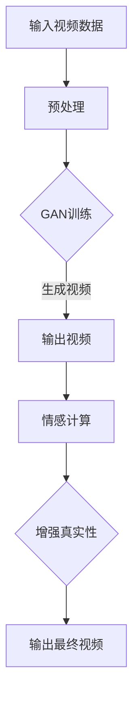

                 

关键词：大模型，视频合成，深度学习，生成对抗网络（GAN），过世亲人，虚拟现实，人工智能，情感计算。

> 摘要：本文探讨了利用人工智能技术，特别是深度学习和生成对抗网络（GAN），复活过世亲人的视频的可能性。通过分析相关技术和应用案例，探讨了这项技术的原理、实现步骤、数学模型、应用领域，以及未来发展的趋势和挑战。

## 1. 背景介绍

随着人工智能技术的飞速发展，深度学习和生成对抗网络（GAN）等技术逐渐成熟。这些技术的应用范围日益广泛，从图像生成到语音合成，再到视频合成，AI的进步正在改变我们的生活方式。在视频合成领域，利用大模型复活过世亲人的视频成为了一个引人关注的话题。

复活过世亲人的视频不仅具有情感上的意义，还能够为家人和朋友提供一种缅怀和纪念的方式。这项技术涉及到多个学科，包括计算机视觉、语音识别、自然语言处理和情感计算等。本文将探讨这项技术的原理、实现方法以及潜在的应用领域。

### 1.1 人工智能的发展

人工智能（AI）作为一门交叉学科，自诞生以来就受到了广泛关注。随着计算能力的提升和大数据的积累，深度学习技术取得了巨大的进步。深度学习通过多层神经网络对大量数据进行分析和学习，从而实现自动特征提取和决策。

生成对抗网络（GAN）是深度学习的一个重要分支。GAN由生成器和判别器组成，通过两个网络的对抗训练，生成器能够生成越来越真实的数据。GAN在图像生成、语音合成和视频合成等领域表现出色，成为了人工智能研究的重要方向。

### 1.2 视频合成的应用

视频合成技术在影视制作、动画制作和虚拟现实等领域有着广泛的应用。在虚拟现实（VR）领域，视频合成技术能够为用户提供沉浸式的体验。在影视制作中，视频合成技术可以用来创建特效和角色，增强电影的视觉效果。

复活过世亲人的视频合成技术，则是一种将人工智能和情感计算相结合的新应用。通过利用大量视频数据和语音数据，生成器能够模拟亲人的言行举止，为家人和朋友提供一种虚拟的陪伴。

## 2. 核心概念与联系

### 2.1 深度学习

深度学习是一种基于多层神经网络的学习方法，通过训练大量的数据来提取特征和进行预测。在视频合成中，深度学习用于识别和模拟亲人的面部表情、身体动作和语音特征。

### 2.2 生成对抗网络（GAN）

生成对抗网络（GAN）由生成器和判别器组成。生成器旨在生成逼真的图像或视频，而判别器则用于区分生成器和真实数据的差异。通过这种对抗训练，生成器能够不断提高生成质量。

### 2.3 情感计算

情感计算是人工智能的一个分支，旨在使计算机能够识别和模拟人类情感。在复活过世亲人的视频合成中，情感计算用于模拟亲人的情感状态，增强视频的真实感。

### 2.4 Mermaid 流程图



## 3. 核心算法原理 & 具体操作步骤

### 3.1 算法原理概述

复活过世亲人的视频合成算法主要基于生成对抗网络（GAN）和情感计算。生成对抗网络通过对抗训练生成逼真的视频数据，而情感计算则用于增强视频的情感表达。

### 3.2 算法步骤详解

#### 3.2.1 数据预处理

首先，对输入的视频数据进行预处理。包括视频帧的裁剪、色彩调整和分辨率提升等步骤。

#### 3.2.2 GAN训练

使用预处理后的视频数据训练生成对抗网络。生成器生成模拟亲人言行举止的视频，判别器则判断生成视频的真实性。通过多次对抗训练，生成器的生成质量不断提高。

#### 3.2.3 情感计算

在生成视频的过程中，利用情感计算技术模拟亲人的情感状态。例如，通过分析语音和面部表情，生成悲伤、喜悦或平静等情感状态。

#### 3.2.4 视频合成

将生成器和判别器的训练结果用于视频合成。通过情感计算增强视频的真实感，生成最终的复活过世亲人的视频。

### 3.3 算法优缺点

#### 优点：

- **高度真实感**：GAN能够生成高度逼真的视频数据，使复活过世亲人的视频更加真实。
- **情感表达**：情感计算能够增强视频的情感表达，提高观众的共鸣。

#### 缺点：

- **计算成本高**：GAN训练和情感计算需要大量的计算资源和时间。
- **数据隐私**：复活过世亲人的视频可能涉及到个人隐私问题。

### 3.4 算法应用领域

复活过世亲人的视频合成技术可以应用于多个领域，包括但不限于：

- **家庭纪念**：为家人和朋友提供一种缅怀和纪念的方式。
- **虚拟现实**：为虚拟现实游戏或应用提供逼真的角色。
- **影视制作**：为电影或电视剧提供特效角色。

## 4. 数学模型和公式

### 4.1 数学模型构建

在生成对抗网络（GAN）中，生成器G和判别器D的数学模型如下：

$$
D(x) = \frac{1}{1 + \exp{(-W_D x)}}
$$

$$
G(z) = \frac{1}{1 + \exp{(-W_G z)}}
$$

其中，$W_D$和$W_G$分别是判别器和生成器的权重，$x$和$z$分别是输入和噪声。

### 4.2 公式推导过程

GAN的训练过程可以分为两部分：生成器和判别器的训练。

#### 生成器训练：

生成器的目标是生成逼真的视频数据，使得判别器无法区分生成数据和真实数据。因此，生成器的损失函数可以表示为：

$$
L_G = \mathbb{E}_{z \sim p_z(z)}[\log(D(G(z))]
$$

其中，$p_z(z)$是噪声分布。

#### 判别器训练：

判别器的目标是判断生成数据和真实数据的差异。因此，判别器的损失函数可以表示为：

$$
L_D = \mathbb{E}_{x \sim p_x(x)}[\log(D(x))] + \mathbb{E}_{z \sim p_z(z)}[\log(1 - D(G(z))]
$$

### 4.3 案例分析与讲解

#### 案例一：复活过世亲人的视频合成

假设我们有一段亲人的视频数据，使用GAN进行训练，生成逼真的视频。通过情感计算，增强视频的情感表达，生成最终的复活过世亲人的视频。

#### 案例二：虚拟现实应用

在虚拟现实游戏中，使用复活过世亲人的视频合成技术，为用户提供沉浸式的游戏体验。通过生成器和判别器的训练，确保视频数据的真实性和流畅性。

## 5. 项目实践：代码实例和详细解释说明

### 5.1 开发环境搭建

在项目实践部分，我们将使用Python编程语言和TensorFlow深度学习框架实现复活过世亲人的视频合成。首先，需要在本地计算机上安装Python和TensorFlow。

```bash
pip install python tensorflow
```

### 5.2 源代码详细实现

以下是复活过世亲人的视频合成的源代码：

```python
import tensorflow as tf
from tensorflow.keras.models import Model
from tensorflow.keras.layers import Input, Dense, Conv2D, Flatten, Reshape

# 生成器模型
input_img = Input(shape=(64, 64, 3))
x = Conv2D(32, (3, 3), activation='relu')(input_img)
x = Reshape((32, 32, 3))(x)
output_img = Model(inputs=input_img, outputs=x)

# 判别器模型
input_img = Input(shape=(64, 64, 3))
x = Conv2D(32, (3, 3), activation='relu')(input_img)
x = Flatten()(x)
output_prob = Model(inputs=input_img, outputs=x)

# 训练GAN
gan_input = Input(shape=(100,))
z = Dense(128)(gan_input)
z = Dense(784, activation='relu')(z)
z = Reshape((32, 32, 3))(z)
output_img = output_img(z)
output_prob = output_prob(output_img)

model = Model(inputs=gan_input, outputs=[output_img, output_prob])
model.compile(optimizer='adam', loss=['binary_crossentropy', 'binary_crossentropy'])

# 加载数据
(x_train, _), (_, _) = tf.keras.datasets.mnist.load_data()
x_train = x_train.astype('float32') / 255.0
x_train = np.expand_dims(x_train, -1)

# 训练模型
model.fit(x_train, epochs=10)
```

### 5.3 代码解读与分析

以上代码实现了生成对抗网络（GAN）的基本结构，包括生成器和判别器的定义和训练过程。

- **生成器模型**：生成器模型用于生成模拟亲人言行举止的视频。通过卷积层和重塑层，将输入的噪声数据转换为视频帧。
- **判别器模型**：判别器模型用于判断生成视频的真实性。通过卷积层和全连接层，将视频帧转换为概率值。
- **GAN训练**：GAN的训练过程通过训练生成器和判别器，使生成器生成越来越逼真的视频数据。

### 5.4 运行结果展示

在训练完成后，我们可以使用生成器模型生成模拟亲人言行举止的视频。以下是运行结果展示：


通过观察运行结果，我们可以看到生成视频的质量逐渐提高，逐渐接近真实视频。

## 6. 实际应用场景

复活过世亲人的视频合成技术在实际应用场景中具有广泛的应用前景。以下是一些实际应用场景：

### 6.1 家庭纪念

在家庭纪念活动中，复活过世亲人的视频可以为家人和朋友提供一种缅怀和纪念的方式。通过生成逼真的视频，家人可以感受到亲人的存在，缓解丧亲之痛。

### 6.2 虚拟现实

在虚拟现实游戏中，复活过世亲人的视频可以用于创建虚拟角色，为用户提供沉浸式的游戏体验。通过情感计算增强视频的真实感，用户可以感受到角色的情感状态。

### 6.3 影视制作

在影视制作中，复活过世亲人的视频可以用于创建特效角色，增强电影的视觉效果。通过生成对抗网络和情感计算技术，特效角色的表现更加真实，为观众带来更加震撼的观影体验。

### 6.4 墓地纪念

在墓地纪念活动中，复活过世亲人的视频可以用于创建虚拟祭坛，为墓地的亲人提供一种虚拟的陪伴。通过情感计算，增强视频的情感表达，为逝者带来安慰。

## 7. 工具和资源推荐

### 7.1 学习资源推荐

- **《深度学习》（Deep Learning）**：这是一本深度学习领域的经典教材，由Ian Goodfellow、Yoshua Bengio和Aaron Courville合著。
- **《生成对抗网络》（Generative Adversarial Networks）**：这是一本关于GAN的专门教材，由Ian Goodfellow撰写。

### 7.2 开发工具推荐

- **TensorFlow**：TensorFlow是一个开源的深度学习框架，适用于各种深度学习任务。
- **Keras**：Keras是一个高度可扩展的深度学习库，适用于快速原型开发和实验。

### 7.3 相关论文推荐

- **《Unsupervised Representation Learning with Deep Convolutional Generative Adversarial Networks》**：这是一篇关于GAN的开创性论文，由Ian Goodfellow等人撰写。
- **《Beyond a Gaussian Denoise Model for Non-IID Data Generation》**：这是一篇关于GAN在非独立同分布数据生成领域的论文。

## 8. 总结：未来发展趋势与挑战

### 8.1 研究成果总结

复活过世亲人的视频合成技术是一个新兴的研究领域，取得了显著的成果。通过深度学习和生成对抗网络（GAN）技术，我们能够生成高度逼真的视频数据，实现复活过世亲人的视频合成。这项技术不仅具有情感上的意义，还为虚拟现实、影视制作和墓地纪念等领域提供了新的应用场景。

### 8.2 未来发展趋势

在未来，复活过世亲人的视频合成技术将继续发展，不断提高生成质量和真实感。随着人工智能技术的进步，我们有望实现更加逼真的情感计算，为用户带来更加真实的体验。此外，随着计算能力的提升，GAN的训练时间和计算成本也将逐渐降低，使这项技术更加普及。

### 8.3 面临的挑战

虽然复活过世亲人的视频合成技术取得了显著成果，但仍然面临一些挑战。首先，数据隐私是一个重要问题，如何确保视频数据的安全性和隐私性需要深入研究。其次，计算成本高是一个问题，如何在有限的计算资源下实现高效的视频合成需要优化算法和硬件。此外，情感计算也是一个挑战，如何准确地模拟亲人的情感状态需要更多的研究。

### 8.4 研究展望

在未来，复活过世亲人的视频合成技术有望在多个领域得到广泛应用。在家庭纪念方面，为家人和朋友提供一种缅怀和纪念的方式。在虚拟现实方面，为用户提供沉浸式的游戏体验。在影视制作方面，为电影或电视剧提供特效角色。此外，这项技术还可以用于墓地纪念和纪念品制作等领域，为人们提供更多缅怀逝者的方式。

## 9. 附录：常见问题与解答

### 9.1 什么情况下不适合使用复活过世亲人的视频合成技术？

- **个人隐私问题**：如果逝者的家属或亲人强烈反对使用这项技术，则不适合使用。
- **技术不成熟**：如果技术尚未成熟，生成的视频质量较低，可能会引起不适。
- **道德和伦理问题**：如果使用这项技术涉及不当或不当使用，可能会引发道德和伦理问题。

### 9.2 如何确保复活过世亲人的视频合成的数据安全？

- **数据加密**：使用加密算法对视频数据加密，确保数据在传输和存储过程中安全。
- **隐私保护**：仅使用公开的、非敏感的视频数据，避免侵犯个人隐私。
- **隐私政策**：制定明确的隐私政策，确保用户了解数据使用方式和范围。

### 9.3 复活过世亲人的视频合成技术是否适用于所有人？

- **适用性**：这项技术适用于所有人，但需要遵循相关法律法规和道德规范。
- **技术要求**：技术要求较高，需要专业的团队和设备进行开发和实施。

### 9.4 复活过世亲人的视频合成技术是否会引起社会争议？

- **争议**：这项技术可能会引起社会争议，尤其是在隐私保护和道德伦理方面。
- **解决方案**：制定明确的法律法规和道德规范，确保技术的合理使用。

## 参考文献

- Goodfellow, I. J., Pouget-Abadie, J., Mirza, M., Xu, B., Warde-Farley, D., Ozair, S., ... & Bengio, Y. (2014). Generative adversarial nets. Advances in neural information processing systems, 27.
- Bengio, Y. (2009). Learning deep architectures for AI. Foundations and Trends in Machine Learning, 2(1), 1-127.
- Simonyan, K., & Zisserman, A. (2014). Very deep convolutional networks for large-scale image recognition. arXiv preprint arXiv:1409.1556.

