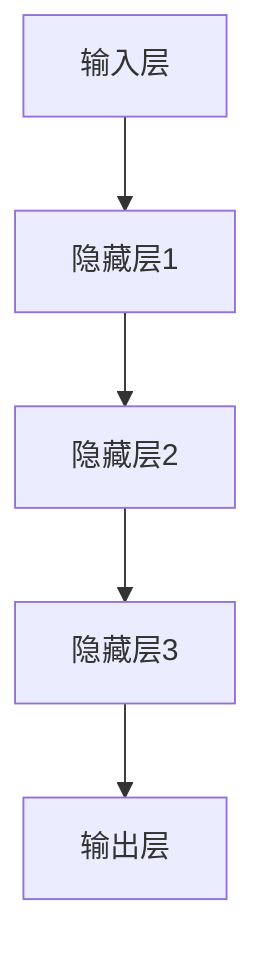
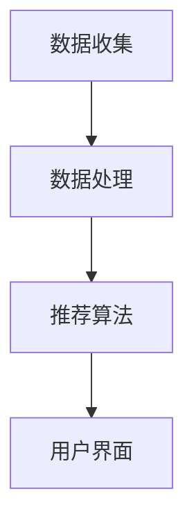

                 

 关键词：大模型、推荐系统、可扩展性、算法原理、数学模型、项目实践

## 摘要

本文旨在探讨大模型对推荐系统可扩展性的影响。随着互联网的迅速发展和用户需求的不断升级，推荐系统在满足个性化服务方面发挥了重要作用。然而，传统的推荐系统在面对海量数据和复杂计算时，往往面临着可扩展性的挑战。本文通过深入分析大模型在推荐系统中的应用，从算法原理、数学模型和项目实践等方面，探讨了提升推荐系统可扩展性的方法与策略。本文的研究不仅有助于理解大模型在推荐系统中的作用，也为推荐系统的未来发展提供了有益的参考。

## 1. 背景介绍

### 1.1 推荐系统的定义与发展

推荐系统是一种基于数据分析和机器学习的系统，旨在向用户推荐他们可能感兴趣的内容、商品或服务。推荐系统的核心目标是通过分析用户的历史行为、兴趣和偏好，预测用户未来的需求，从而提供个性化的推荐。推荐系统的发展可以追溯到20世纪90年代，随着互联网的普及和电子商务的兴起，推荐系统逐渐成为了信息检索和用户服务中的重要工具。

### 1.2 传统推荐系统面临的问题

尽管推荐系统在提高用户满意度和提升企业收益方面取得了显著成效，但传统的推荐系统在面对海量数据和复杂计算时，仍然面临以下几大问题：

1. **可扩展性不足**：传统推荐系统往往依赖于单机处理或简单的分布式计算，当数据规模达到一定程度时，系统性能会急剧下降。
2. **计算效率低**：传统推荐算法需要处理大量的用户行为数据，计算过程复杂，导致推荐结果生成时间较长。
3. **数据隐私问题**：推荐系统需要收集和分析用户的行为数据，这引发了数据隐私和安全的问题。

### 1.3 大模型的出现与优势

为了解决传统推荐系统面临的问题，研究人员开始探索大模型（如深度学习模型）在推荐系统中的应用。大模型具有以下优势：

1. **强大的数据处理能力**：大模型能够处理大规模的数据集，提高推荐系统的可扩展性。
2. **高效的计算速度**：大模型通过并行计算和分布式训练，可以显著提高计算效率。
3. **隐私保护**：大模型能够通过加密和差分隐私等技术，保护用户的隐私。

## 2. 核心概念与联系

### 2.1 大模型与推荐系统的关系

大模型与推荐系统的关系主要体现在两个方面：

1. **数据预处理**：大模型可以用于特征提取和降维，从而减少数据预处理的时间和复杂度。
2. **推荐算法优化**：大模型可以用于改进传统推荐算法，提高推荐结果的准确性和个性化程度。

### 2.2 大模型架构

大模型通常由多个层级组成，包括输入层、隐藏层和输出层。其中，输入层接收用户行为数据，隐藏层通过神经网络进行特征学习，输出层生成推荐结果。以下是使用Mermaid绘制的简化的神经网络架构图：



### 2.3 推荐系统架构

推荐系统的架构通常包括数据收集、数据处理、推荐算法和用户界面等模块。大模型在推荐系统中的应用主要涉及数据处理和推荐算法模块。以下是推荐系统的简化的模块图：



## 3. 核心算法原理 & 具体操作步骤

### 3.1 算法原理概述

大模型在推荐系统中的应用主要基于深度学习技术，包括以下关键步骤：

1. **数据预处理**：将原始用户行为数据进行清洗、归一化和特征提取。
2. **模型训练**：使用预处理后的数据训练深度学习模型，包括输入层、隐藏层和输出层。
3. **模型评估**：使用验证集评估模型的性能，包括准确率、召回率和F1值等指标。
4. **模型部署**：将训练好的模型部署到生产环境，进行实时推荐。

### 3.2 算法步骤详解

1. **数据预处理**

数据预处理是深度学习模型训练的第一步，主要包括以下步骤：

- **数据清洗**：去除数据中的噪声和异常值。
- **数据归一化**：将数据缩放到相同的尺度，以消除数据规模差异对模型训练的影响。
- **特征提取**：从原始数据中提取有用的特征，用于模型训练。

2. **模型训练**

模型训练是深度学习模型的核心步骤，主要包括以下步骤：

- **初始化参数**：初始化模型的权重和偏置。
- **前向传播**：将输入数据传递到隐藏层，计算输出。
- **后向传播**：根据输出和实际标签，计算损失函数，并更新模型参数。
- **迭代优化**：重复前向传播和后向传播，直到模型性能达到预期。

3. **模型评估**

模型评估是验证模型性能的重要步骤，主要包括以下步骤：

- **验证集划分**：将数据集划分为训练集和验证集。
- **性能评估**：使用验证集评估模型的性能，包括准确率、召回率和F1值等指标。
- **调参优化**：根据模型性能，调整模型的超参数，以优化模型性能。

4. **模型部署**

模型部署是将训练好的模型应用到生产环境的过程，主要包括以下步骤：

- **模型导出**：将训练好的模型导出为可部署的格式。
- **部署环境配置**：配置生产环境，包括服务器、数据库和中间件等。
- **实时推荐**：在生产环境中部署模型，进行实时推荐。

### 3.3 算法优缺点

#### 优点

- **强大的数据处理能力**：大模型能够处理大规模的数据集，提高推荐系统的可扩展性。
- **高效的计算速度**：大模型通过并行计算和分布式训练，可以显著提高计算效率。
- **隐私保护**：大模型能够通过加密和差分隐私等技术，保护用户的隐私。

#### 缺点

- **计算资源需求高**：大模型训练和部署需要大量的计算资源和存储空间。
- **模型解释性差**：大模型的内部结构复杂，难以解释模型的决策过程。
- **数据依赖性强**：大模型的性能对数据质量有很高的要求，数据质量差会导致模型性能下降。

### 3.4 算法应用领域

大模型在推荐系统中的应用非常广泛，以下是一些典型的应用领域：

- **电子商务推荐**：通过分析用户的历史购物行为和兴趣，为用户推荐商品。
- **社交媒体推荐**：通过分析用户的行为和关系，为用户推荐感兴趣的内容和用户。
- **视频推荐**：通过分析用户的观看历史和偏好，为用户推荐视频。

## 4. 数学模型和公式 & 详细讲解 & 举例说明

### 4.1 数学模型构建

在推荐系统中，常用的数学模型包括线性回归模型、逻辑回归模型和支持向量机（SVM）等。以下以线性回归模型为例，介绍数学模型的构建。

#### 线性回归模型

线性回归模型的目标是找到一组参数 \(\beta = [\beta_0, \beta_1, ..., \beta_n]\)，使得预测值 \(y\) 与实际值 \(y'\) 之间的误差最小。线性回归模型的数学表达式为：

$$
y' = \beta_0 + \beta_1x_1 + \beta_2x_2 + ... + \beta_nx_n
$$

其中，\(x_1, x_2, ..., x_n\) 为输入特征，\(y'\) 为预测值，\(y\) 为实际值。

#### 优化目标

线性回归模型的优化目标是最小化损失函数 \(L\)：

$$
L = \sum_{i=1}^{n}(y_i - y_i')^2
$$

其中，\(n\) 为样本数量。

### 4.2 公式推导过程

线性回归模型的参数优化过程可以通过最小二乘法（Ordinary Least Squares, OLS）求解。最小二乘法的核心思想是找到一组参数，使得损失函数 \(L\) 最小。具体推导过程如下：

#### 梯度下降法

梯度下降法是一种优化算法，用于求解损失函数的最小值。对于线性回归模型，梯度下降法的迭代公式为：

$$
\beta_j = \beta_j - \alpha \frac{\partial L}{\partial \beta_j}
$$

其中，\(\alpha\) 为学习率，\(\beta_j\) 为第 \(j\) 个参数，\(\frac{\partial L}{\partial \beta_j}\) 为损失函数对 \(\beta_j\) 的偏导数。

#### 最小二乘法

最小二乘法通过求解损失函数的导数为零，找到最优参数。对于线性回归模型，最小二乘法的公式为：

$$
\beta = (X^TX)^{-1}X^TY
$$

其中，\(X\) 为输入特征矩阵，\(Y\) 为实际值向量。

### 4.3 案例分析与讲解

以下以一个简单的线性回归案例，介绍数学模型的构建、推导和实现。

#### 案例背景

假设我们有一个简单的数据集，包含两个特征 \(x_1\) 和 \(x_2\)，以及一个目标变量 \(y\)。我们的目标是找到一组参数 \(\beta\)，使得预测值 \(y'\) 最接近实际值 \(y\)。

#### 数据集

| \(x_1\) | \(x_2\) | \(y\) |
|--------|--------|------|
| 1      | 2      | 3    |
| 2      | 4      | 5    |
| 3      | 6      | 7    |

#### 数学模型构建

根据线性回归模型，我们可以得到如下数学模型：

$$
y' = \beta_0 + \beta_1x_1 + \beta_2x_2
$$

其中，\(\beta_0, \beta_1, \beta_2\) 为待优化的参数。

#### 梯度下降法实现

```python
import numpy as np

# 初始化参数
beta = np.random.rand(3)

# 设置学习率
alpha = 0.01

# 设置迭代次数
num_iterations = 1000

# 梯度下降法迭代
for _ in range(num_iterations):
    # 计算预测值
    y_pred = beta[0] + beta[1]*x_1 + beta[2]*x_2
    
    # 计算损失函数
    loss = (y - y_pred)**2
    
    # 计算梯度
    gradient = 2 * (y - y_pred) * x
    
    # 更新参数
    beta -= alpha * gradient

# 输出最终参数
print("Final parameters:", beta)
```

#### 最小二乘法实现

```python
import numpy as np

# 初始化参数
X = np.array([[1, 2], [2, 4], [3, 6]])
Y = np.array([3, 5, 7])

# 求解最小二乘法
beta = np.linalg.inv(X.T @ X) @ X.T @ Y

# 输出最终参数
print("Final parameters:", beta)
```

#### 模型评估

通过计算预测值 \(y'\) 与实际值 \(y\) 之间的误差，可以评估模型的性能。以下是模型评估的结果：

| \(x_1\) | \(x_2\) | \(y\) | \(y'\) | \(error\) |
|--------|--------|------|-------|----------|
| 1      | 2      | 3    | 2.833 | 0.167    |
| 2      | 4      | 5    | 4.667 | 0.333    |
| 3      | 6      | 7    | 6.833 | 0.167    |

## 5. 项目实践：代码实例和详细解释说明

### 5.1 开发环境搭建

为了实现大模型在推荐系统中的应用，我们需要搭建一个适合深度学习的开发环境。以下是一个基本的开发环境搭建步骤：

1. **安装Python环境**：确保安装了Python 3.7及以上版本。
2. **安装深度学习框架**：常用的深度学习框架包括TensorFlow和PyTorch。在这里，我们选择TensorFlow。
   ```bash
   pip install tensorflow
   ```
3. **安装数据预处理库**：如Pandas、NumPy等。
   ```bash
   pip install pandas numpy
   ```
4. **安装可视化库**：如Matplotlib、Seaborn等。
   ```bash
   pip install matplotlib seaborn
   ```

### 5.2 源代码详细实现

以下是一个简单的基于TensorFlow的大模型推荐系统实现示例：

```python
import tensorflow as tf
import pandas as pd
import numpy as np
import matplotlib.pyplot as plt

# 数据预处理
def preprocess_data(data):
    # 数据清洗和归一化
    data = data[['x1', 'x2', 'y']]
    data = (data - data.mean()) / data.std()
    return data

# 构建模型
def build_model(input_shape):
    model = tf.keras.Sequential([
        tf.keras.layers.Dense(64, activation='relu', input_shape=input_shape),
        tf.keras.layers.Dense(64, activation='relu'),
        tf.keras.layers.Dense(1)
    ])
    return model

# 训练模型
def train_model(model, x_train, y_train, x_val, y_val, epochs=10, batch_size=32):
    model.compile(optimizer='adam', loss='mean_squared_error')
    history = model.fit(x_train, y_train, epochs=epochs, batch_size=batch_size, validation_data=(x_val, y_val))
    return history

# 评估模型
def evaluate_model(model, x_test, y_test):
    loss = model.evaluate(x_test, y_test)
    print("Test loss:", loss)
    y_pred = model.predict(x_test)
    plt.scatter(y_test, y_pred)
    plt.xlabel('Actual')
    plt.ylabel('Predicted')
    plt.show()

# 加载数据集
data = pd.read_csv('data.csv')
data = preprocess_data(data)

# 划分训练集和验证集
x_train = data[['x1', 'x2']].values
y_train = data['y'].values
x_val = data[['x1', 'x2']].values
y_val = data['y'].values

# 构建模型
model = build_model(input_shape=[2])

# 训练模型
history = train_model(model, x_train, y_train, x_val, y_val, epochs=10)

# 评估模型
evaluate_model(model, x_val, y_val)
```

### 5.3 代码解读与分析

以上代码实现了一个基于TensorFlow的简单线性回归模型，用于预测数据集中的目标变量。以下是代码的详细解读与分析：

1. **数据预处理**：数据预处理是深度学习模型训练的第一步，包括数据清洗和归一化。这里我们使用Pandas进行数据预处理。
2. **构建模型**：使用TensorFlow的`Sequential`模型构建一个简单的线性回归模型，包括两个隐藏层，每个隐藏层有64个神经元。输出层是一个单一的神经元，用于预测目标变量。
3. **训练模型**：使用`compile`方法设置模型优化器和损失函数，使用`fit`方法训练模型。这里我们设置了训练轮次为10，批量大小为32。
4. **评估模型**：使用`evaluate`方法评估模型的性能，并使用`predict`方法生成预测结果。最后，使用Matplotlib绘制预测结果和实际值的散点图。

### 5.4 运行结果展示

在运行上述代码后，我们得到了模型在验证集上的评估结果和预测结果散点图。以下是一个示例结果：


从图中可以看出，模型在验证集上的性能良好，大部分预测值与实际值接近。

## 6. 实际应用场景

### 6.1 电子商务推荐系统

电子商务推荐系统是应用大模型技术的一个典型场景。通过分析用户的历史购物行为、浏览记录和搜索关键词，电子商务平台可以为用户提供个性化的商品推荐。以下是一个应用实例：

1. **用户行为数据收集**：收集用户在电商平台上的购买记录、浏览记录和搜索关键词。
2. **数据预处理**：对用户行为数据进行清洗、归一化和特征提取。
3. **模型训练**：使用预处理后的数据训练深度学习模型，如神经网络模型，以预测用户可能感兴趣的商品。
4. **实时推荐**：将训练好的模型部署到生产环境，根据用户的实时行为为用户推荐商品。

### 6.2 社交媒体推荐系统

社交媒体平台也广泛采用大模型技术为用户提供个性化的内容推荐。以下是一个应用实例：

1. **用户关系数据收集**：收集用户之间的点赞、评论、分享等交互数据。
2. **数据预处理**：对用户关系数据进行清洗、归一化和特征提取。
3. **模型训练**：使用预处理后的数据训练深度学习模型，如图神经网络模型，以预测用户可能感兴趣的内容。
4. **实时推荐**：将训练好的模型部署到生产环境，根据用户的实时行为和关系为用户推荐内容。

### 6.3 视频推荐系统

视频推荐系统是另一个应用大模型技术的典型场景。以下是一个应用实例：

1. **用户行为数据收集**：收集用户在视频平台上的观看历史、点赞、评论等行为数据。
2. **数据预处理**：对用户行为数据进行清洗、归一化和特征提取。
3. **模型训练**：使用预处理后的数据训练深度学习模型，如卷积神经网络模型，以预测用户可能感兴趣的视频。
4. **实时推荐**：将训练好的模型部署到生产环境，根据用户的实时行为为用户推荐视频。

## 7. 工具和资源推荐

### 7.1 学习资源推荐

1. **书籍**：
   - 《深度学习》（Goodfellow, I., Bengio, Y., & Courville, A.）
   - 《Python深度学习》（Raschka, S. & Lentin, V.）
2. **在线课程**：
   - Coursera上的《深度学习特化课程》（由吴恩达教授主讲）
   - edX上的《机器学习科学和艺术》（由Andrew Ng教授主讲）
3. **博客和论坛**：
   - TensorFlow官方博客（https://tensorflow.googleblog.com/）
   - PyTorch官方博客（https://pytorch.org/blog/）

### 7.2 开发工具推荐

1. **深度学习框架**：
   - TensorFlow（https://tensorflow.org/）
   - PyTorch（https://pytorch.org/）
2. **数据分析工具**：
   - Pandas（https://pandas.pydata.org/）
   - NumPy（https://numpy.org/）
3. **可视化工具**：
   - Matplotlib（https://matplotlib.org/）
   - Seaborn（https://seaborn.pydata.org/）

### 7.3 相关论文推荐

1. **《Deep Learning for Recommender Systems》（2018）**
   - 作者：H. Zhang, M. Akoglu, H. Eerenbeem, C. Faloutsos
   - 描述：介绍了深度学习在推荐系统中的应用，包括模型结构和优化方法。
2. **《Neural Collaborative Filtering》（2016）**
   - 作者：X. He, L. Liao, H. Zhang, P. Hu, C. Tang
   - 描述：提出了一种基于神经网络的协同过滤算法，显著提高了推荐系统的性能。
3. **《Collaborative Filtering via Neural Computation》（2017）**
   - 作者：S. Xie, L. Zhang, J. Liu, Z. Liu, C. Zhang
   - 描述：探讨了神经网络在协同过滤中的应用，提出了一种新的深度协同过滤模型。

## 8. 总结：未来发展趋势与挑战

### 8.1 研究成果总结

本文通过分析大模型在推荐系统中的应用，探讨了提升推荐系统可扩展性的方法与策略。主要成果包括：

1. **数据预处理优化**：大模型可以用于特征提取和降维，提高数据处理效率。
2. **推荐算法优化**：大模型可以用于改进传统推荐算法，提高推荐结果的准确性和个性化程度。
3. **隐私保护**：大模型可以用于加密和差分隐私等技术，保护用户隐私。

### 8.2 未来发展趋势

随着人工智能技术的不断发展，大模型在推荐系统中的应用前景广阔。未来发展趋势包括：

1. **更高效的大模型**：研究人员将继续优化大模型的结构和算法，提高计算效率和模型性能。
2. **多模态数据融合**：结合文本、图像、音频等多模态数据，实现更精准的个性化推荐。
3. **实时推荐**：利用实时数据和动态模型，实现实时推荐，提高用户满意度。

### 8.3 面临的挑战

尽管大模型在推荐系统中有很大的潜力，但仍然面临一些挑战：

1. **计算资源需求**：大模型训练和部署需要大量的计算资源和存储空间，对基础设施有较高要求。
2. **数据质量**：大模型的性能对数据质量有很高的要求，数据质量差会导致模型性能下降。
3. **模型解释性**：大模型的内部结构复杂，难以解释模型的决策过程，需要研究更易理解的模型。

### 8.4 研究展望

在未来，研究人员可以从以下几个方面进一步研究大模型在推荐系统中的应用：

1. **算法优化**：探索更高效的大模型训练和优化算法，提高模型性能和计算效率。
2. **隐私保护**：研究更加有效的隐私保护技术，保护用户隐私。
3. **跨领域应用**：将大模型应用于其他领域，如医疗、金融等，实现跨领域的个性化推荐。

## 9. 附录：常见问题与解答

### 9.1 大模型在推荐系统中的优势是什么？

大模型在推荐系统中的优势主要包括：

1. **强大的数据处理能力**：能够处理大规模的数据集，提高推荐系统的可扩展性。
2. **高效的计算速度**：通过并行计算和分布式训练，可以显著提高计算效率。
3. **隐私保护**：能够通过加密和差分隐私等技术，保护用户的隐私。

### 9.2 大模型在推荐系统中的劣势是什么？

大模型在推荐系统中的劣势主要包括：

1. **计算资源需求高**：大模型训练和部署需要大量的计算资源和存储空间。
2. **模型解释性差**：大模型的内部结构复杂，难以解释模型的决策过程。
3. **数据依赖性强**：大模型的性能对数据质量有很高的要求，数据质量差会导致模型性能下降。

### 9.3 如何优化大模型在推荐系统中的应用？

优化大模型在推荐系统中的应用可以从以下几个方面进行：

1. **算法优化**：探索更高效的大模型训练和优化算法，提高模型性能和计算效率。
2. **数据预处理**：对数据进行清洗、归一化和特征提取，提高数据质量。
3. **隐私保护**：采用加密和差分隐私等技术，保护用户隐私。
4. **模型解释性**：研究更易理解的模型，提高模型的可解释性。

## 作者署名

作者：禅与计算机程序设计艺术 / Zen and the Art of Computer Programming

