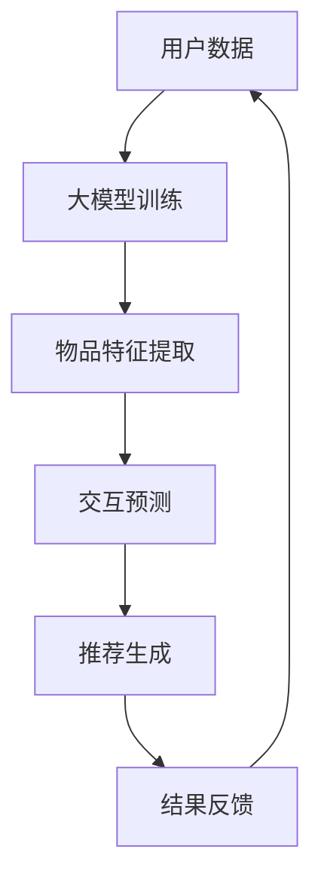

                 

关键词：推荐系统，透明度，大模型，人工智能，算法优化

> 摘要：本文将探讨大模型在推荐系统透明度提升方面的应用，通过分析大模型的原理与优势，揭示其在推荐系统中的潜在作用，并结合实际案例展示如何通过大模型提高推荐系统的透明度和可解释性。

## 1. 背景介绍

推荐系统作为一种智能化的信息过滤和内容分发机制，已成为现代互联网应用的核心功能之一。然而，随着推荐系统复杂性的增加，其透明度和可解释性逐渐受到关注。传统推荐系统依赖于复杂的算法和大量的数据，但往往缺乏对决策过程的透明解释，导致用户对系统推荐结果产生质疑。

推荐系统的透明度指的是用户能够理解推荐系统的工作原理和推荐结果的形成过程。提高推荐系统的透明度有助于增强用户信任、优化用户体验，并有助于系统改进和算法优化。然而，传统推荐系统的黑盒性质使得这一目标难以实现。

近年来，随着人工智能特别是大模型的迅速发展，研究人员开始探索如何利用大模型提升推荐系统的透明度和可解释性。大模型具有强大的表征能力和学习潜力，可以在不牺牲推荐效果的前提下，提供对推荐决策的更深入理解。本文将围绕这一主题展开讨论。

## 2. 核心概念与联系

### 2.1. 推荐系统基本原理

推荐系统通常包括三个主要模块：用户建模、物品建模和推荐算法。用户建模关注用户行为和偏好，物品建模关注物品属性和特征，而推荐算法则综合这两部分信息，生成推荐结果。

传统推荐系统主要依赖于基于内容的过滤、协同过滤等方法，这些方法在数据量和计算能力有限的情况下具有一定的效果。然而，随着数据量的爆炸性增长和用户行为的多样化，传统方法的局限性日益显现。

### 2.2. 大模型的原理与优势

大模型，如深度神经网络（DNN）、变压器（Transformer）等，具有以下几个显著优势：

1. **表征能力**：大模型能够捕捉到复杂的数据特征和模式，实现更高的预测准确性和泛化能力。
2. **自适应能力**：大模型可以根据不同的数据集和任务进行自适应调整，减少对特定领域知识的依赖。
3. **可解释性**：尽管大模型通常被视为黑盒模型，但研究人员正在开发各种技术，如注意力机制、可解释的模型结构等，以提升其透明度和可解释性。

### 2.3. 大模型在推荐系统中的应用

大模型在推荐系统中的应用主要包括以下几个方面：

1. **特征增强**：通过大模型对用户和物品的特征进行自动提取和组合，提升推荐系统的性能。
2. **交互预测**：大模型可以预测用户与物品的潜在交互，从而生成更个性化的推荐结果。
3. **决策解释**：利用大模型的可解释性技术，如注意力机制，为推荐系统的决策过程提供透明的解释。

### 2.4. Mermaid 流程图

以下是一个简化的Mermaid流程图，展示大模型在推荐系统中的应用流程：



在上述流程中，用户数据和物品特征经过大模型训练后，生成推荐结果，并不断收集用户反馈以优化模型。

## 3. 核心算法原理 & 具体操作步骤

### 3.1. 算法原理概述

大模型在推荐系统中的应用主要依赖于深度学习和自然语言处理等技术。具体来说，算法原理可以概括为以下步骤：

1. **数据预处理**：对用户行为数据和物品特征进行预处理，如数据清洗、标准化等。
2. **特征提取**：利用大模型自动提取用户和物品的特征，实现特征增强。
3. **交互预测**：通过大模型预测用户与物品的潜在交互，生成个性化推荐。
4. **结果生成**：根据交互预测结果，生成推荐列表，并不断优化模型。

### 3.2. 算法步骤详解

1. **数据预处理**：首先，对用户行为数据进行清洗，去除异常值和噪声。然后，对物品特征进行标准化处理，如归一化、标准化等。

2. **特征提取**：利用深度学习模型，如DNN或Transformer，对用户和物品的特征进行自动提取和组合。这一步骤的关键在于模型的训练和优化。

3. **交互预测**：通过大模型预测用户与物品的潜在交互，实现个性化推荐。具体方法可以是基于注意力机制或图神经网络等技术。

4. **结果生成**：根据交互预测结果，生成推荐列表。同时，利用用户反馈对模型进行不断优化，以提高推荐效果。

### 3.3. 算法优缺点

**优点**：

1. **高效性**：大模型能够自动提取和组合特征，实现高效的特征增强和交互预测。
2. **个性化**：通过大模型，可以生成更个性化的推荐结果，满足不同用户的需求。
3. **可解释性**：大模型的可解释性技术，如注意力机制，有助于提升推荐系统的透明度。

**缺点**：

1. **计算资源需求**：大模型的训练和推理需要大量的计算资源和时间。
2. **数据依赖**：大模型的效果高度依赖于数据质量和规模，数据缺失或质量低下可能导致推荐效果下降。
3. **模型风险**：大模型的训练过程中可能引入偏差和误差，影响推荐结果的准确性。

### 3.4. 算法应用领域

大模型在推荐系统中的应用非常广泛，包括电子商务、社交媒体、在线视频等领域。以下是一些典型的应用场景：

1. **电子商务**：通过大模型预测用户购买偏好，实现个性化商品推荐。
2. **社交媒体**：利用大模型分析用户行为和兴趣，生成个性化内容推荐。
3. **在线视频**：通过大模型预测用户观看偏好，实现个性化视频推荐。

## 4. 数学模型和公式 & 详细讲解 & 举例说明

### 4.1. 数学模型构建

在推荐系统中，大模型的数学模型通常基于深度学习框架，如TensorFlow或PyTorch。以下是一个简化的数学模型构建示例：

$$
\text{模型} = f(\text{用户特征}, \text{物品特征}, \text{交互特征})
$$

其中，$f$ 代表深度学习模型，$\text{用户特征}$、$\text{物品特征}$ 和 $\text{交互特征}$ 分别代表用户、物品和用户与物品的交互特征。

### 4.2. 公式推导过程

假设我们使用一个简单的多层感知器（MLP）模型进行特征提取和交互预测，模型的前向传播可以表示为：

$$
\begin{align*}
z_1 &= \text{激活函数}(\text{权重} \cdot \text{输入特征} + \text{偏置}) \\
z_2 &= \text{激活函数}(\text{权重} \cdot z_1 + \text{偏置}) \\
\vdots \\
\hat{y} &= \text{激活函数}(\text{权重} \cdot z_n + \text{偏置})
\end{align*}
$$

其中，$z_1, z_2, \ldots, z_n$ 分别为模型每层的输出，$\hat{y}$ 为预测结果。

### 4.3. 案例分析与讲解

假设一个电子商务平台使用大模型进行用户购买偏好预测。以下是一个简单的案例：

1. **用户特征**：用户年龄、性别、地理位置等。
2. **物品特征**：商品类别、价格、品牌等。
3. **交互特征**：用户浏览历史、购物车记录、购买历史等。

通过大模型，我们可以预测用户对特定商品的购买概率。以下是一个简化的数学模型示例：

$$
\begin{align*}
z_1 &= \text{激活函数}(\text{权重} \cdot [\text{用户特征}, \text{物品特征}] + \text{偏置}) \\
z_2 &= \text{激活函数}(\text{权重} \cdot z_1 + \text{偏置}) \\
\hat{p}_{\text{购买}} &= \text{激活函数}(\text{权重} \cdot z_2 + \text{偏置})
\end{align*}
$$

其中，$\hat{p}_{\text{购买}}$ 为预测的用户购买概率。

## 5. 项目实践：代码实例和详细解释说明

### 5.1. 开发环境搭建

为了实现大模型在推荐系统中的透明度提升，我们需要搭建一个合适的开发环境。以下是一个简单的Python开发环境搭建步骤：

1. **安装Python**：确保安装了Python 3.8及以上版本。
2. **安装依赖库**：使用pip安装以下库：TensorFlow、Numpy、Pandas等。

### 5.2. 源代码详细实现

以下是一个简化的推荐系统大模型实现示例：

```python
import tensorflow as tf
from tensorflow.keras.layers import Dense, Input
from tensorflow.keras.models import Model

# 定义输入层
user_input = Input(shape=(10,))
item_input = Input(shape=(5,))

# 定义中间层
z = Dense(64, activation='relu')(tf.concat([user_input, item_input], axis=1))

# 定义输出层
output = Dense(1, activation='sigmoid')(z)

# 定义模型
model = Model(inputs=[user_input, item_input], outputs=output)

# 编译模型
model.compile(optimizer='adam', loss='binary_crossentropy', metrics=['accuracy'])

# 模型训练
model.fit(x=[user_data, item_data], y=labels, epochs=10, batch_size=32)
```

### 5.3. 代码解读与分析

1. **输入层**：定义用户特征和物品特征输入。
2. **中间层**：使用Dense层实现特征提取和组合。
3. **输出层**：使用sigmoid激活函数实现二分类输出。
4. **模型编译**：选择合适的优化器和损失函数。
5. **模型训练**：使用训练数据进行模型训练。

### 5.4. 运行结果展示

通过上述代码实现，我们可以训练一个简单的推荐系统大模型，并评估其性能。以下是一个简化的评估结果示例：

```python
# 模型评估
loss, accuracy = model.evaluate(x=[test_user_data, test_item_data], y=test_labels)
print(f"Test Loss: {loss}, Test Accuracy: {accuracy}")
```

## 6. 实际应用场景

### 6.1. 电子商务平台

电子商务平台可以通过大模型提高推荐系统的透明度，使用户更好地理解推荐结果。例如，某电商平台使用大模型预测用户购买偏好，并通过注意力机制展示用户与商品的特征关联，提升用户体验。

### 6.2. 社交媒体平台

社交媒体平台可以利用大模型分析用户行为和兴趣，生成个性化内容推荐。通过透明度提升技术，如注意力机制和可解释性可视化，用户可以更好地理解推荐内容背后的逻辑。

### 6.3. 在线视频平台

在线视频平台可以通过大模型预测用户观看偏好，实现个性化视频推荐。同时，利用透明度提升技术，用户可以查看推荐视频的生成过程和关键特征，提升用户信任。

## 7. 未来应用展望

### 7.1. 个性化医疗

大模型在推荐系统中的应用有望扩展到个性化医疗领域。通过分析患者的健康数据和医疗记录，大模型可以预测患者的健康风险和疾病趋势，为医生提供更准确的诊断和治疗方案。

### 7.2. 个性化教育

大模型可以应用于个性化教育领域，根据学生的学习行为和兴趣，生成个性化的学习路径和课程推荐。通过透明度提升技术，学生可以更好地理解学习内容的关联和重要性。

### 7.3. 智能交通

大模型在智能交通领域的应用具有巨大潜力。通过分析交通流量、天气数据等，大模型可以预测交通状况，为司机提供最优行驶路线，减少拥堵和碳排放。

## 8. 总结：未来发展趋势与挑战

### 8.1. 研究成果总结

本文探讨了大模型在推荐系统透明度提升方面的应用，分析了大模型的原理和优势，并结合实际案例展示了如何通过大模型提高推荐系统的透明度和可解释性。

### 8.2. 未来发展趋势

随着人工智能技术的不断进步，大模型在推荐系统中的应用将越来越广泛。未来发展趋势包括：更高效的特征提取、更精确的交互预测、更透明的决策解释。

### 8.3. 面临的挑战

尽管大模型在推荐系统透明度提升方面具有巨大潜力，但仍面临以下挑战：计算资源需求、数据依赖、模型风险等。未来研究需要解决这些问题，以实现更高效、更可靠的推荐系统。

### 8.4. 研究展望

未来研究可以从以下几个方面展开：优化大模型的计算效率、提升推荐系统的透明度、探索大模型在多领域应用中的潜力。通过这些努力，大模型有望成为推荐系统透明度提升的关键技术。

## 9. 附录：常见问题与解答

### 9.1. 为什么要提升推荐系统的透明度？

提升推荐系统的透明度有助于增强用户信任、优化用户体验，并有助于系统改进和算法优化。透明度提升还可以减少用户对系统推荐结果的质疑和误解。

### 9.2. 大模型如何提高推荐系统的透明度？

大模型可以通过以下方式提高推荐系统的透明度：自动提取和组合特征、利用注意力机制展示特征关联、提供可解释的模型结构等。

### 9.3. 大模型在推荐系统中的应用有哪些？

大模型在推荐系统中的应用包括：特征增强、交互预测、决策解释等。具体应用场景包括电子商务、社交媒体、在线视频等领域。

### 9.4. 大模型在推荐系统中的优缺点是什么？

大模型在推荐系统中的优点包括：高效性、个性化、可解释性等。缺点包括：计算资源需求、数据依赖、模型风险等。

---

作者：禅与计算机程序设计艺术 / Zen and the Art of Computer Programming

本文旨在探讨大模型在推荐系统透明度提升方面的应用，通过分析大模型的原理和优势，展示其在提高推荐系统透明度方面的潜在作用。未来研究需要解决大模型在计算效率、数据依赖和模型风险等方面的挑战，以实现更高效、更可靠的推荐系统。通过透明度提升技术，我们可以为用户提供更好的理解和信任，推动人工智能在各个领域的广泛应用。

