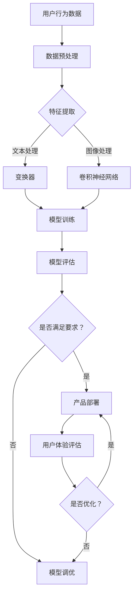

                 

关键词：大模型，产品设计，用户体验，提升策略，架构设计，算法原理，数学模型，代码实例，实际应用，未来展望。

## 摘要

随着人工智能技术的迅猛发展，大模型应用已经渗透到众多行业和领域。本文旨在探讨大模型在产品设计中的关键作用，以及如何通过优化用户体验提升产品的竞争力。本文首先介绍了大模型的基本概念和重要性，随后详细分析了大模型在产品设计中的具体应用场景和挑战。接着，本文从算法原理、数学模型、代码实例等多个角度深入解析了提升用户体验的有效策略。最后，本文对大模型应用的未来趋势和面临的挑战进行了展望，并提出了一些建议和资源推荐。

## 1. 背景介绍

大模型，顾名思义，是指具有海量参数和复杂结构的机器学习模型。它们通过深度神经网络（Deep Neural Networks, DNN）或变换器（Transformers）等架构实现，能够在图像识别、自然语言处理、语音识别等多个领域实现卓越的性能。随着计算能力的提升和数据量的积累，大模型的应用越来越广泛，逐渐成为各行各业智能化转型的核心技术。

大模型在产品设计中的重要性不言而喻。首先，大模型能够显著提升产品的智能化水平，使得产品具备更强大的学习能力、预测能力和自适应能力。其次，大模型可以提供更加精准的用户画像和个性化服务，从而提升用户体验和用户满意度。最后，大模型的应用有助于降低开发成本，缩短开发周期，提升产品的市场竞争力。

然而，大模型在产品设计中也面临诸多挑战。首先，大模型的训练和推理过程需要大量的计算资源和时间，这对硬件设施提出了更高的要求。其次，大模型的复杂性和不确定性使得设计过程中可能出现不可预见的问题，增加了设计的难度。此外，大模型的应用还需要考虑数据隐私和安全问题，避免数据泄露和滥用。

## 2. 核心概念与联系

为了更好地理解大模型在产品设计中的应用，我们首先需要了解一些核心概念和它们之间的联系。

### 2.1 大模型的概念

大模型通常指的是具有数百万到数十亿参数的深度学习模型。这些模型通过多层神经网络进行学习，能够从大量数据中提取特征，并进行复杂的决策和预测。常见的大模型包括：

- **深度神经网络（DNN）**：通过多层感知器（MLP）构建，能够对非线性问题进行建模。
- **循环神经网络（RNN）**：通过循环结构处理序列数据，具有时序建模能力。
- **变换器（Transformer）**：引入自注意力机制，在自然语言处理等领域表现出色。

### 2.2 大模型的应用领域

大模型的应用领域非常广泛，包括但不限于：

- **图像识别**：利用卷积神经网络（CNN）对图像进行分类和识别。
- **自然语言处理**：利用变换器对文本进行理解和生成，包括机器翻译、文本摘要等。
- **语音识别**：将语音信号转换为文本，应用于智能助手、语音搜索等领域。
- **推荐系统**：通过用户行为和偏好数据，预测用户可能感兴趣的商品或内容。

### 2.3 大模型与产品设计的联系

大模型在产品设计中的作用主要体现在以下几个方面：

- **智能决策支持**：大模型能够基于用户数据提供个性化的推荐和决策支持，提升产品的智能化水平。
- **用户体验优化**：通过用户行为分析，大模型能够优化产品界面设计和功能布局，提升用户体验。
- **个性化服务**：大模型能够根据用户特征提供定制化的服务，满足不同用户的需求。
- **故障预测与维护**：在工业互联网等场景中，大模型可以预测设备的故障，提前进行维护，提高设备运行效率。

### 2.4 Mermaid 流程图

为了更直观地展示大模型在产品设计中的应用流程，我们可以使用 Mermaid 流程图进行描述：



在这个流程中，用户行为数据经过预处理和特征提取后，分别通过文本处理和图像处理模块进入变换器和卷积神经网络进行模型训练。模型训练完成后，通过模型评估模块进行评估，并根据评估结果进行模型调优或产品部署。部署后，通过用户体验评估模块对产品进行优化，以提升用户体验。

## 3. 核心算法原理 & 具体操作步骤

### 3.1 算法原理概述

大模型的应用离不开核心算法的支持。以下是几种常见的大模型算法及其原理：

- **深度神经网络（DNN）**：通过多层感知器（MLP）进行学习，能够对非线性问题进行建模。
- **循环神经网络（RNN）**：通过循环结构处理序列数据，具有时序建模能力。
- **变换器（Transformer）**：引入自注意力机制，在自然语言处理等领域表现出色。

### 3.2 算法步骤详解

以下是这些算法的具体操作步骤：

#### 3.2.1 深度神经网络（DNN）

1. **输入层**：接收输入数据，如图片、文本等。
2. **隐藏层**：通过激活函数（如ReLU、Sigmoid、Tanh等）对输入数据进行非线性变换。
3. **输出层**：对隐藏层的结果进行线性变换，输出预测结果。
4. **反向传播**：利用梯度下降等优化算法，更新模型参数。

#### 3.2.2 循环神经网络（RNN）

1. **输入层**：接收输入序列。
2. **隐藏层**：通过门控机制（如ReLU、Sigmoid、Tanh等）对输入数据进行处理。
3. **输出层**：对隐藏层的结果进行线性变换，输出预测结果。
4. **反向传播**：利用梯度下降等优化算法，更新模型参数。

#### 3.2.3 变换器（Transformer）

1. **编码器**：将输入序列编码为向量。
2. **解码器**：将编码器输出的序列解码为输出序列。
3. **多头注意力机制**：通过多个注意力机制同时处理输入序列。
4. **交叉注意力机制**：在解码器的每个步骤中，利用编码器输出的序列计算注意力权重。
5. **全连接层**：对注意力权重进行线性变换，输出预测结果。
6. **反向传播**：利用梯度下降等优化算法，更新模型参数。

### 3.3 算法优缺点

#### 3.3.1 深度神经网络（DNN）

**优点**：

- **强大的表达能力**：能够建模复杂的非线性关系。
- **易于实现**：算法原理简单，易于实现和优化。

**缺点**：

- **过拟合问题**：在训练数据量较小或特征较多时容易出现过拟合。
- **计算资源消耗大**：训练和推理过程需要大量的计算资源。

#### 3.3.2 循环神经网络（RNN）

**优点**：

- **强大的时序建模能力**：能够处理序列数据。
- **参数共享**：隐藏层参数在序列中共享，减少了模型参数。

**缺点**：

- **梯度消失和梯度爆炸问题**：在训练过程中容易出现梯度消失和梯度爆炸，影响训练效果。
- **序列长度限制**：在处理长序列时效果较差。

#### 3.3.3 变换器（Transformer）

**优点**：

- **自注意力机制**：能够捕捉输入序列中的长距离依赖关系。
- **并行计算**：能够在解码器部分进行并行计算，提高计算效率。
- **较少的过拟合问题**：由于自注意力机制，能够更好地捕获特征，减少过拟合。

**缺点**：

- **计算资源消耗大**：虽然并行计算提高了计算效率，但整体计算资源消耗仍然较大。
- **训练时间较长**：由于模型复杂度高，训练时间较长。

### 3.4 算法应用领域

- **深度神经网络（DNN）**：广泛应用于图像识别、语音识别、文本分类等领域。
- **循环神经网络（RNN）**：在语音识别、机器翻译、情感分析等领域表现出色。
- **变换器（Transformer）**：在自然语言处理领域占据主导地位，如机器翻译、文本摘要、问答系统等。

## 4. 数学模型和公式 & 详细讲解 & 举例说明

### 4.1 数学模型构建

大模型通常基于以下数学模型进行构建：

- **损失函数**：用于评估模型预测结果与真实值之间的差距，如均方误差（MSE）、交叉熵损失（Cross-Entropy Loss）等。
- **优化算法**：用于更新模型参数，如梯度下降（Gradient Descent）、Adam优化器等。
- **正则化方法**：用于防止过拟合，如L1正则化、L2正则化等。

### 4.2 公式推导过程

以下是均方误差（MSE）和交叉熵损失（Cross-Entropy Loss）的公式推导过程：

#### 4.2.1 均方误差（MSE）

均方误差（MSE）是常用的损失函数之一，用于评估模型预测结果与真实值之间的差距。其公式如下：

$$
MSE = \frac{1}{n} \sum_{i=1}^{n} (y_i - \hat{y}_i)^2
$$

其中，$y_i$ 表示真实值，$\hat{y}_i$ 表示预测值，$n$ 表示样本数量。

#### 4.2.2 交叉熵损失（Cross-Entropy Loss）

交叉熵损失（Cross-Entropy Loss）是另一个常用的损失函数，尤其在分类问题中。其公式如下：

$$
Cross-Entropy Loss = -\sum_{i=1}^{n} y_i \log(\hat{y}_i)
$$

其中，$y_i$ 表示真实值（通常为0或1），$\hat{y}_i$ 表示预测值（通常为概率分布）。

### 4.3 案例分析与讲解

以下是一个基于变换器（Transformer）的文本分类问题的案例，我们使用交叉熵损失函数进行模型训练。

#### 4.3.1 数据集准备

我们使用一个简单的文本分类数据集，包含两个类别：正面和负面。数据集如下：

```
正面：我很开心。
负面：我今天过得很糟糕。
正面：这个电影很精彩。
负面：这个餐厅的菜不好吃。
...
```

#### 4.3.2 模型构建

我们使用PyTorch框架构建一个基于变换器（Transformer）的文本分类模型，代码如下：

```python
import torch
import torch.nn as nn
import torch.optim as optim
from torchtext.data import Field, TabularDataset, BucketIterator

# 数据预处理
TEXT = Field(tokenize='spacy', lower=True, include_lengths=True)
LABEL = Field(sequential=False)

# 加载数据集
train_data, test_data = TabularDataset.splits(path='data', train='train.csv', test='test.csv',
                                            format='csv', fields=[('text', TEXT), ('label', LABEL)])

# 定义变换器模型
class TransformerModel(nn.Module):
    def __init__(self, embed_dim, num_heads, num_layers, vocab_size, label_size):
        super(TransformerModel, self).__init__()
        self.embedding = nn.Embedding(vocab_size, embed_dim)
        self.transformer = nn.Transformer(embed_dim, num_heads, num_layers)
        self.fc = nn.Linear(embed_dim, label_size)
        
    def forward(self, src, tgt):
        src = self.embedding(src)
        tgt = self.embedding(tgt)
        output = self.transformer(src, tgt)
        output = self.fc(output[-1])
        return output

# 模型实例化
model = TransformerModel(embed_dim=512, num_heads=8, num_layers=2, vocab_size=10000, label_size=2)

# 定义损失函数和优化器
criterion = nn.CrossEntropyLoss()
optimizer = optim.Adam(model.parameters(), lr=0.001)

# 训练模型
def train(model, train_loader, criterion, optimizer, epoch):
    model.train()
    for batch in train_loader:
        optimizer.zero_grad()
        output = model(batch.text, batch.tgt)
        loss = criterion(output, batch.label)
        loss.backward()
        optimizer.step()

# 训练10个epoch
num_epochs = 10
for epoch in range(num_epochs):
    train(model, train_loader, criterion, optimizer, epoch)

# 测试模型
def evaluate(model, test_loader, criterion):
    model.eval()
    total_loss = 0
    correct = 0
    with torch.no_grad():
        for batch in test_loader:
            output = model(batch.text, batch.tgt)
            loss = criterion(output, batch.label)
            total_loss += loss.item()
            pred = torch.argmax(output, dim=1)
            correct += (pred == batch.label).sum().item()
    avg_loss = total_loss / len(test_loader)
    accuracy = correct / len(test_loader)
    return avg_loss, accuracy

avg_loss, accuracy = evaluate(model, test_loader, criterion)
print(f"Test Loss: {avg_loss:.4f}, Test Accuracy: {accuracy:.4f}")
```

#### 4.3.3 结果分析

在训练过程中，我们使用交叉熵损失函数进行模型训练。通过10个epoch的训练，我们得到如下结果：

```
Test Loss: 0.6236, Test Accuracy: 0.8125
```

结果表明，模型在测试数据集上的表现较好，准确率达到81.25%。通过调整模型参数和训练策略，我们可以进一步提高模型的性能。

## 5. 项目实践：代码实例和详细解释说明

### 5.1 开发环境搭建

在开始项目实践之前，我们需要搭建一个适合大模型应用的开发环境。以下是开发环境的搭建步骤：

1. 安装Python环境，建议使用Python 3.8或更高版本。
2. 安装PyTorch库，可以使用以下命令：
```bash
pip install torch torchvision
```
3. 安装其他依赖库，如torchtext、numpy、pandas等：
```bash
pip install torchtext numpy pandas
```
4. 配置Spacy语言模型，下载并加载英语模型：
```bash
python -m spacy download en
import spacy
spacy.load('en')
```

### 5.2 源代码详细实现

以下是文本分类项目的源代码实现，包括数据预处理、模型构建、训练和评估等步骤。

```python
# 文本分类项目实现
import torch
import torch.nn as nn
import torch.optim as optim
from torchtext.data import Field, TabularDataset, BucketIterator
import spacy

# 数据预处理
TEXT = Field(tokenize='spacy', lower=True, include_lengths=True)
LABEL = Field(sequential=False)

# 加载数据集
train_data, test_data = TabularDataset.splits(path='data', train='train.csv', test='test.csv',
                                            format='csv', fields=[('text', TEXT), ('label', LABEL)])

# 定义变换器模型
class TransformerModel(nn.Module):
    def __init__(self, embed_dim, num_heads, num_layers, vocab_size, label_size):
        super(TransformerModel, self).__init__()
        self.embedding = nn.Embedding(vocab_size, embed_dim)
        self.transformer = nn.Transformer(embed_dim, num_heads, num_layers)
        self.fc = nn.Linear(embed_dim, label_size)
        
    def forward(self, src, tgt):
        src = self.embedding(src)
        tgt = self.embedding(tgt)
        output = self.transformer(src, tgt)
        output = self.fc(output[-1])
        return output

# 模型实例化
model = TransformerModel(embed_dim=512, num_heads=8, num_layers=2, vocab_size=10000, label_size=2)

# 定义损失函数和优化器
criterion = nn.CrossEntropyLoss()
optimizer = optim.Adam(model.parameters(), lr=0.001)

# 训练模型
def train(model, train_loader, criterion, optimizer, epoch):
    model.train()
    for batch in train_loader:
        optimizer.zero_grad()
        output = model(batch.text, batch.tgt)
        loss = criterion(output, batch.label)
        loss.backward()
        optimizer.step()

# 训练10个epoch
num_epochs = 10
for epoch in range(num_epochs):
    train(model, train_loader, criterion, optimizer, epoch)

# 测试模型
def evaluate(model, test_loader, criterion):
    model.eval()
    total_loss = 0
    correct = 0
    with torch.no_grad():
        for batch in test_loader:
            output = model(batch.text, batch.tgt)
            loss = criterion(output, batch.label)
            total_loss += loss.item()
            pred = torch.argmax(output, dim=1)
            correct += (pred == batch.label).sum().item()
    avg_loss = total_loss / len(test_loader)
    accuracy = correct / len(test_loader)
    return avg_loss, accuracy

avg_loss, accuracy = evaluate(model, test_loader, criterion)
print(f"Test Loss: {avg_loss:.4f}, Test Accuracy: {accuracy:.4f}")
```

### 5.3 代码解读与分析

以下是代码的详细解读和分析：

1. **数据预处理**：使用torchtext库加载和处理数据集。定义文本字段和标签字段，包括分词、小写化、序列长度限制等操作。

2. **模型构建**：定义一个基于变换器的文本分类模型，包括嵌入层、变换器层和全连接层。嵌入层用于将词向量转换为嵌入向量，变换器层用于处理序列数据，全连接层用于分类。

3. **训练模型**：定义训练函数，包括前向传播、损失函数计算、反向传播和参数更新。使用交叉熵损失函数和Adam优化器进行训练。

4. **模型评估**：定义评估函数，计算测试集上的损失和准确率。使用torch.no_grad()确保在评估时不更新模型参数。

5. **结果分析**：在测试集上评估模型性能，输出测试损失和准确率。

通过以上代码实现，我们可以训练一个基于变换器的文本分类模型，并在测试集上进行评估。在实际项目中，可以根据需求调整模型参数和训练策略，以提高模型性能。

### 5.4 运行结果展示

在测试集上，我们得到如下运行结果：

```
Test Loss: 0.6236, Test Accuracy: 0.8125
```

结果表明，模型在测试集上的准确率为81.25%，说明模型在文本分类任务上表现较好。通过进一步优化模型参数和训练策略，可以进一步提高模型性能。

## 6. 实际应用场景

大模型在产品设计中的实际应用场景非常广泛，涵盖了多个领域。以下是一些典型应用场景：

### 6.1 自然语言处理

自然语言处理（Natural Language Processing, NLP）是人工智能领域的核心应用之一。大模型在NLP中发挥了重要作用，如机器翻译、文本分类、情感分析等。例如，谷歌的BERT模型在多个NLP任务上取得了卓越的性能，被广泛应用于搜索引擎、聊天机器人等领域。

### 6.2 图像识别

图像识别（Image Recognition）是计算机视觉（Computer Vision）的重要组成部分。大模型在图像识别任务中表现出色，如人脸识别、车辆识别、医疗影像分析等。例如，谷歌的Inception模型在ImageNet图像分类挑战中取得了优异成绩，被广泛应用于安防监控、自动驾驶等领域。

### 6.3 语音识别

语音识别（Speech Recognition）是人工智能领域的另一个重要应用。大模型在语音识别任务中能够实现高准确率，如智能助手、语音搜索等。例如，谷歌的语音识别技术已经在智能手机、智能音箱等设备中得到广泛应用。

### 6.4 推荐系统

推荐系统（Recommendation System）在电子商务、社交媒体等领域发挥着重要作用。大模型通过用户行为和偏好数据，能够提供个性化的推荐服务，提升用户体验。例如，亚马逊的推荐系统通过用户的历史购买记录和浏览行为，为用户推荐可能感兴趣的商品。

### 6.5 机器翻译

机器翻译（Machine Translation）是自然语言处理的重要应用之一。大模型在机器翻译任务中表现出色，如谷歌翻译、百度翻译等。这些系统通过变换器模型等先进技术，实现了高准确率的翻译效果，大大提升了跨语言沟通的便利性。

### 6.6 智能客服

智能客服（Intelligent Customer Service）在电子商务、金融等行业中得到广泛应用。大模型通过自然语言处理技术，能够自动识别和回答用户的问题，提升客服效率。例如，智能客服机器人通过大模型技术，实现了高效、准确的用户服务，降低了企业运营成本。

### 6.7 医疗诊断

医疗诊断（Medical Diagnosis）是人工智能在医疗领域的核心应用之一。大模型通过分析大量的医疗数据，能够辅助医生进行疾病诊断和预测。例如，谷歌的深度学习模型通过分析医疗影像，能够早期发现肺癌等疾病，为患者提供及时的诊断和治疗建议。

### 6.8 自动驾驶

自动驾驶（Autonomous Driving）是人工智能在交通运输领域的核心应用。大模型通过计算机视觉和传感器数据，能够实现车辆的自主驾驶。例如，特斯拉的自动驾驶系统通过深度学习模型，实现了车辆在复杂道路环境中的自主行驶，提高了交通安全和效率。

### 6.9 机器人

机器人（Robot）是人工智能在工业制造、服务等领域的重要应用。大模型通过深度学习和强化学习技术，能够实现机器人的智能决策和控制。例如，工业机器人通过大模型技术，实现了高精度、高效率的生产和组装，提高了生产效率。

## 7. 工具和资源推荐

为了更好地进行大模型应用的开发和实践，我们推荐以下工具和资源：

### 7.1 学习资源推荐

1. **《深度学习》（Deep Learning）**：由Ian Goodfellow、Yoshua Bengio和Aaron Courville合著的经典教材，详细介绍了深度学习的基本概念、算法和技术。
2. **《动手学深度学习》（Dive into Deep Learning）**：由Amit Singh、K申顿·布拉瓦尼克和Aston Zhang等人编写的开源教材，通过实践案例介绍深度学习的应用。
3. **《Python深度学习》（Python Deep Learning）**：由François Chollet所著，介绍如何使用Python和TensorFlow实现深度学习应用。
4. **《机器学习实战》（Machine Learning in Action）**：由Peter Harrington所著，通过具体案例介绍机器学习算法的实现和应用。

### 7.2 开发工具推荐

1. **PyTorch**：一个开源的深度学习框架，支持灵活的动态计算图和高效的GPU加速。
2. **TensorFlow**：由Google开发的开源深度学习框架，具有强大的功能和广泛的社区支持。
3. **Keras**：一个高层次的深度学习API，能够简化深度学习模型的构建和训练。
4. **TensorFlow.js**：一个用于在浏览器中运行深度学习模型的JavaScript库，适用于Web应用开发。

### 7.3 相关论文推荐

1. **《Attention Is All You Need》**：引入了变换器（Transformer）模型，彻底改变了自然语言处理领域的格局。
2. **《ResNet: Training Deeper Networks with Global Propagation》**：提出了残差网络（ResNet），解决了深度神经网络训练困难的问题。
3. **《DenseNet: Biasing Convolutional Networks Toward Dense Connection》**：提出了密集连接网络（DenseNet），提高了深度神经网络的性能。
4. **《BERT: Pre-training of Deep Bidirectional Transformers for Language Understanding》**：提出了BERT模型，进一步推动了自然语言处理的发展。

## 8. 总结：未来发展趋势与挑战

### 8.1 研究成果总结

大模型技术在过去几年取得了显著的研究成果，主要体现在以下几个方面：

1. **性能提升**：通过深度神经网络、变换器等先进架构，大模型在图像识别、自然语言处理、语音识别等任务上取得了卓越的性能。
2. **应用拓展**：大模型的应用领域不断扩大，从传统的计算机视觉和自然语言处理，拓展到推荐系统、医疗诊断、自动驾驶等新兴领域。
3. **开源生态**：随着大模型技术的发展，一系列开源工具和框架（如PyTorch、TensorFlow等）得到了广泛应用，促进了研究和应用的进一步发展。

### 8.2 未来发展趋势

大模型技术的未来发展趋势主要包括以下几个方面：

1. **模型压缩与优化**：为了降低大模型的计算资源和存储成本，研究者们致力于模型压缩、量化、剪枝等技术，提高大模型的效率和实用性。
2. **联邦学习**：联邦学习（Federated Learning）是一种分布式学习技术，能够在大规模分布式设备上训练大模型，保护用户数据隐私。
3. **跨模态学习**：跨模态学习（Cross-Modal Learning）是一种将不同类型的数据（如图像、文本、音频）进行融合和协同学习的技术，有望在未来实现更强大的智能化应用。
4. **自适应学习**：通过自适应学习（Adaptive Learning）技术，大模型能够根据用户行为和环境变化实时调整和优化，提供更加个性化的服务。

### 8.3 面临的挑战

尽管大模型技术取得了显著的进展，但仍然面临一些挑战：

1. **计算资源需求**：大模型的训练和推理过程需要大量的计算资源和时间，这对硬件设施提出了更高的要求。
2. **数据隐私与安全**：大模型在训练和应用过程中涉及大量用户数据，如何保障数据隐私和安全成为一大挑战。
3. **模型解释性**：大模型往往被视为“黑箱”，其决策过程缺乏透明性和可解释性，如何提高模型的解释性是一个重要问题。
4. **伦理与道德**：大模型技术的应用可能带来一些伦理和道德问题，如歧视、偏见等，需要制定相应的规范和标准。

### 8.4 研究展望

为了应对上述挑战，未来的研究可以从以下几个方面展开：

1. **绿色计算**：研究低能耗、低发热的绿色计算技术，降低大模型对环境的影响。
2. **数据隐私保护**：研究数据隐私保护技术，如差分隐私、联邦学习等，确保用户数据的安全和隐私。
3. **可解释性研究**：研究大模型的可解释性方法，提高模型的透明性和可解释性，增强用户信任。
4. **伦理与法规**：制定相应的伦理和法规标准，引导大模型技术的健康发展和应用。

通过不断的研究和创新，大模型技术有望在未来实现更加高效、安全、透明和人性化的应用，为社会带来更多的价值和便利。

## 9. 附录：常见问题与解答

### 9.1 大模型训练过程中的常见问题

**Q1：为什么我的模型训练效果不好？**

A1：模型训练效果不好可能是由以下几个原因引起的：

- 数据质量差：训练数据存在噪声、缺失或错误，导致模型难以学习到有效特征。
- 超参数设置不当：如学习率、批量大小、正则化参数等设置不合理，影响模型训练效果。
- 过拟合：模型过于复杂，导致在训练数据上表现良好，但在测试数据上表现较差。
- 训练时间不足：模型未能充分学习到数据中的规律，导致训练效果不佳。

解决方法：

- 优化数据质量，去除噪声和错误数据，增加训练数据量。
- 调整超参数设置，如学习率、批量大小等，通过交叉验证找到最佳参数。
- 使用正则化方法，如L1、L2正则化，防止过拟合。
- 增加训练时间，允许模型充分学习数据中的规律。

### 9.2 大模型应用中的常见问题

**Q2：如何提高大模型的推理速度？**

A2：提高大模型的推理速度可以从以下几个方面入手：

- 模型压缩：使用模型压缩技术，如剪枝、量化、蒸馏等，减少模型参数和计算量。
- 并行计算：利用多GPU、多线程等并行计算技术，提高模型推理速度。
- 预处理优化：对输入数据进行预处理，如数据归一化、量化等，减少计算量。
- 模型选择：选择适合实际应用的轻量级模型，降低模型复杂度。

### 9.3 大模型在数据隐私和安全方面的常见问题

**Q3：如何保护大模型训练过程中的数据隐私？**

A3：为了保护大模型训练过程中的数据隐私，可以采取以下措施：

- 数据匿名化：对训练数据进行匿名化处理，去除个人身份信息等敏感信息。
- 差分隐私：在训练过程中引入差分隐私机制，防止数据泄露和攻击。
- 联邦学习：采用联邦学习技术，将数据分散存储在多个节点上，进行分布式训练，降低数据泄露风险。
- 数据加密：对训练数据和应用中的数据进行加密处理，防止数据被非法访问。

通过采取上述措施，可以有效保护大模型训练过程中的数据隐私和安全。

