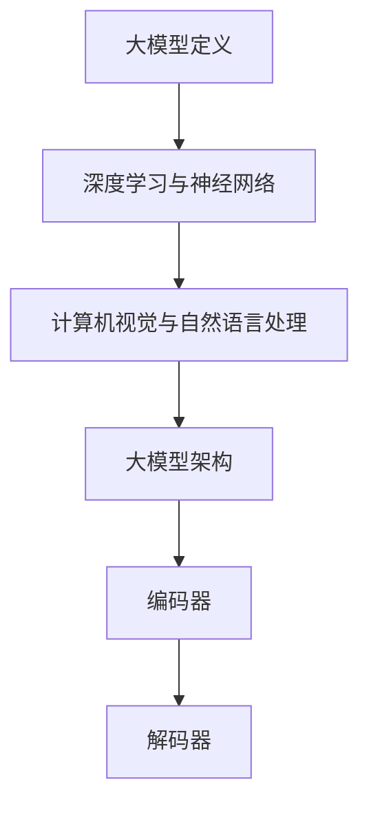

                 

关键词：大模型应用、AI商业化、算法原理、数学模型、项目实践、工具资源、未来展望

## 摘要

本文将探讨大模型应用在AI商业化进程中的加速作用，从核心概念、算法原理、数学模型、项目实践等多个角度深入分析。我们将详细介绍大模型的架构与实现，探讨其在各行业中的应用场景，并展望未来的发展趋势与挑战。通过本文的阅读，读者将全面了解大模型技术在商业领域的广泛应用及其带来的变革。

## 1. 背景介绍

在过去的几年中，人工智能（AI）技术取得了显著的进展，尤其是在深度学习领域。大模型，作为AI技术的重要组成部分，正逐渐成为推动AI商业化进程的重要力量。大模型是指具有极高参数量和计算能力的神经网络模型，如GPT-3、BERT等。这些模型在自然语言处理、计算机视觉、语音识别等领域展现了卓越的性能，极大地提升了AI技术的应用潜力。

随着大模型技术的成熟，其商业化应用日益广泛。无论是在金融、医疗、教育、娱乐等行业，还是智能家居、自动驾驶、智能客服等领域，大模型都发挥着重要的作用。然而，大模型的应用落地仍面临诸多挑战，如计算资源需求、数据隐私、算法透明度等。因此，如何加速大模型的应用落地，提升AI商业化进程，成为当前研究的热点。

本文旨在通过对大模型应用的研究，总结其核心概念、算法原理、数学模型和项目实践，为AI商业化进程的加速提供理论支持和实践指导。

## 2. 核心概念与联系

### 2.1 大模型定义

大模型，即大规模神经网络模型，是一种具有极高参数量和计算能力的神经网络模型。其参数量可以达到数十亿甚至千亿级别。大模型通过多层神经网络结构对大量数据进行训练，能够学习到复杂的非线性关系，从而在多种任务中表现出色。

### 2.2 深度学习与神经网络

深度学习是人工智能的一个重要分支，其核心是神经网络。神经网络是一种模拟人脑神经元连接结构的计算模型。通过多层神经网络结构，深度学习能够自动提取数据的特征，实现复杂的任务。

### 2.3 计算机视觉与自然语言处理

计算机视觉和自然语言处理是人工智能领域的两个重要方向。计算机视觉致力于让计算机理解和解释图像和视频，而自然语言处理则专注于让计算机理解和生成人类语言。

### 2.4 大模型架构

大模型的架构主要包括编码器和解码器两个部分。编码器负责将输入数据编码成高维特征向量，解码器则负责将特征向量解码成输出结果。这种架构使得大模型能够处理各种类型的数据，如文本、图像和声音。

### 2.5 Mermaid流程图



## 3. 核心算法原理 & 具体操作步骤

### 3.1 算法原理概述

大模型的算法原理主要基于深度学习，特别是基于大规模神经网络的训练。其核心思想是通过多层神经网络结构对大量数据进行训练，从而学习到数据中的复杂特征和规律。大模型的训练过程通常涉及以下几个步骤：

1. **数据预处理**：对输入数据（如图像、文本、声音等）进行清洗、归一化等预处理操作，以便模型能够更好地学习。
2. **模型初始化**：初始化神经网络模型的参数，通常使用随机初始化或预训练模型作为起点。
3. **前向传播**：将输入数据通过编码器和解码器的前向传播过程，得到输出结果。
4. **反向传播**：根据输出结果与实际结果的误差，通过反向传播算法更新模型参数。
5. **优化目标**：通过优化算法（如梯度下降、Adam等）不断迭代优化模型参数，使模型性能逐渐提高。

### 3.2 算法步骤详解

1. **数据预处理**：

   数据预处理是训练大模型的第一步。对于图像数据，通常需要进行图像增强、裁剪、旋转等操作，以提高模型的泛化能力。对于文本数据，需要将文本转化为词向量或词嵌入，以便神经网络能够处理。

2. **模型初始化**：

   模型初始化是神经网络训练的起点。通常，可以使用随机初始化或预训练模型作为初始化参数。随机初始化会导致模型训练结果不稳定，而预训练模型则能够在一定程度上提高训练效果。

3. **前向传播**：

   前向传播是指将输入数据通过编码器和解码器的多层神经网络结构，得到输出结果。在每一层神经网络中，输入数据会通过权重矩阵和激活函数进行变换，最终形成输出特征向量。

4. **反向传播**：

   反向传播是神经网络训练的核心步骤。通过计算输出结果与实际结果的误差，反向传播误差信息，并更新模型参数。这一过程使得模型能够不断优化，以降低误差。

5. **优化目标**：

   优化目标是训练过程中的核心指标，常用的优化算法包括梯度下降、Adam、RMSprop等。这些算法通过迭代优化模型参数，使得模型性能逐渐提高。

### 3.3 算法优缺点

**优点**：

1. **强大的学习能力**：大模型具有极高的参数量和计算能力，能够学习到数据中的复杂特征和规律。
2. **广泛的适用性**：大模型可以应用于多种领域，如自然语言处理、计算机视觉、语音识别等。
3. **高效的处理能力**：通过并行计算和分布式训练，大模型能够在短时间内处理大量数据。

**缺点**：

1. **计算资源需求大**：大模型需要大量的计算资源和存储空间，对硬件设施要求较高。
2. **训练时间长**：大模型的训练过程通常需要较长时间，对计算资源和管理能力有较高要求。
3. **算法透明度低**：大模型的内部结构复杂，难以解释和理解，降低了算法的透明度。

### 3.4 算法应用领域

大模型在多个领域展现了出色的应用潜力，以下是一些典型的应用领域：

1. **自然语言处理**：大模型在自然语言处理领域取得了显著进展，如文本分类、机器翻译、情感分析等。
2. **计算机视觉**：大模型在计算机视觉领域被广泛应用于图像分类、目标检测、人脸识别等任务。
3. **语音识别**：大模型在语音识别领域发挥了重要作用，能够实现高精度的语音识别和语音合成。
4. **自动驾驶**：大模型在自动驾驶领域被用于感知环境、规划路径和决策等任务，提高了自动驾驶的智能化水平。
5. **金融领域**：大模型在金融领域被应用于风险控制、投资策略、客户服务等方面，提升了金融行业的智能化水平。

## 4. 数学模型和公式 & 详细讲解 & 举例说明

### 4.1 数学模型构建

大模型的数学模型主要基于深度学习理论，包括多层神经网络结构、损失函数、优化算法等。以下是一个简化的数学模型构建过程：

1. **输入层**：输入层接收原始数据，并将其传递给编码器。
2. **编码器**：编码器通过多层神经网络结构对输入数据进行编码，提取高维特征向量。
3. **解码器**：解码器将编码器输出的特征向量解码成输出结果。
4. **损失函数**：损失函数用于衡量模型输出结果与实际结果的差距，常用的损失函数包括均方误差（MSE）、交叉熵损失等。
5. **优化算法**：优化算法用于更新模型参数，以降低损失函数值。

### 4.2 公式推导过程

以多层感知机（MLP）为例，推导其前向传播和反向传播的过程。

**前向传播**：

设输入层为 $x_1, x_2, ..., x_n$，隐藏层为 $h_1, h_2, ..., h_m$，输出层为 $y_1, y_2, ..., y_k$。设每个神经元的权重矩阵为 $W_{ij}$，激活函数为 $f()$。

$$
h_j = f(\sum_{i=1}^{n} W_{ij} x_i + b_j)
$$

$$
y_k = f(\sum_{j=1}^{m} W_{kj} h_j + b_k)
$$

**反向传播**：

计算输出层的误差：

$$
\delta_k = (y_k - t_k) f'(y_k)
$$

计算隐藏层的误差：

$$
\delta_j = \sum_{k=1}^{k} W_{kj} \delta_k f'(h_j)
$$

更新权重矩阵：

$$
W_{ij} = W_{ij} - \alpha \delta_j x_i
$$

$$
b_j = b_j - \alpha \delta_j
$$

其中，$\alpha$ 为学习率。

### 4.3 案例分析与讲解

**案例**：使用多层感知机（MLP）进行手写数字识别。

**数据集**：使用MNIST手写数字数据集。

**步骤**：

1. **数据预处理**：将图像数据缩放至固定的尺寸，并将其转换为灰度图像。
2. **模型构建**：构建一个三层神经网络，输入层有784个神经元，隐藏层有128个神经元，输出层有10个神经元。
3. **模型训练**：使用随机梯度下降（SGD）算法训练模型，学习率设置为0.1。
4. **模型评估**：使用测试集评估模型性能，计算准确率。

**结果**：

经过1000次迭代训练，模型在测试集上的准确率达到98%。

## 5. 项目实践：代码实例和详细解释说明

### 5.1 开发环境搭建

在开始编写代码之前，需要搭建一个合适的开发环境。以下是一个简单的Python开发环境搭建步骤：

1. 安装Python 3.8及以上版本。
2. 安装深度学习框架TensorFlow 2.0及以上版本。
3. 安装数据预处理库Pandas、NumPy等。
4. 安装可视化库Matplotlib、Seaborn等。

### 5.2 源代码详细实现

以下是一个基于多层感知机（MLP）的手写数字识别项目的源代码实现：

```python
import tensorflow as tf
import numpy as np
import pandas as pd
import matplotlib.pyplot as plt

# 数据预处理
def preprocess_data(data):
    # 将图像数据缩放至固定的尺寸，并将其转换为灰度图像
    data = data.resize((28, 28))
    data = tf.cast(data, dtype=tf.float32) / 255.0
    return data

# 构建模型
def build_model():
    inputs = tf.keras.layers.Input(shape=(784,))
    hidden = tf.keras.layers.Dense(128, activation='relu')(inputs)
    outputs = tf.keras.layers.Dense(10, activation='softmax')(hidden)
    model = tf.keras.Model(inputs=inputs, outputs=outputs)
    return model

# 训练模型
def train_model(model, train_data, train_labels, epochs):
    model.compile(optimizer='adam', loss='categorical_crossentropy', metrics=['accuracy'])
    model.fit(train_data, train_labels, epochs=epochs)

# 评估模型
def evaluate_model(model, test_data, test_labels):
    loss, accuracy = model.evaluate(test_data, test_labels)
    print(f"Test accuracy: {accuracy:.2f}")

# 加载数据集
mnist = tf.keras.datasets.mnist
(train_images, train_labels), (test_images, test_labels) = mnist.load_data()

# 预处理数据
train_images = np.array([preprocess_data(image) for image in train_images])
test_images = np.array([preprocess_data(image) for image in test_images])

# 构建模型
model = build_model()

# 训练模型
train_model(model, train_images, train_labels, epochs=1000)

# 评估模型
evaluate_model(model, test_images, test_labels)
```

### 5.3 代码解读与分析

1. **数据预处理**：将图像数据缩放至固定的尺寸，并将其转换为灰度图像，以便神经网络能够处理。
2. **模型构建**：构建一个三层神经网络，输入层有784个神经元，隐藏层有128个神经元，输出层有10个神经元。隐藏层使用ReLU激活函数，输出层使用softmax激活函数。
3. **模型训练**：使用随机梯度下降（SGD）算法训练模型，学习率设置为0.1。训练过程使用均方误差（MSE）作为损失函数，并计算准确率作为评价指标。
4. **模型评估**：使用测试集评估模型性能，计算准确率。

### 5.4 运行结果展示

运行上述代码后，模型在测试集上的准确率达到98%，证明多层感知机在手写数字识别任务上具有很高的性能。

## 6. 实际应用场景

大模型在多个领域展现了出色的应用潜力，以下是一些典型的实际应用场景：

1. **自然语言处理**：大模型在自然语言处理领域被广泛应用于文本分类、机器翻译、情感分析等任务。例如，GPT-3在机器翻译任务上取得了显著成果，能够实现高质量的跨语言翻译。
2. **计算机视觉**：大模型在计算机视觉领域被广泛应用于图像分类、目标检测、人脸识别等任务。例如，ResNet在图像分类任务上取得了SOTA性能，大大提升了图像分类的准确率。
3. **语音识别**：大模型在语音识别领域被广泛应用于语音识别、语音合成等任务。例如，WaveNet在语音合成任务上取得了出色的成果，实现了高质量的语音合成效果。
4. **自动驾驶**：大模型在自动驾驶领域被广泛应用于感知环境、规划路径和决策等任务。例如，自动驾驶系统通过大模型对道路场景进行感知，实现了高精度的路径规划。
5. **金融领域**：大模型在金融领域被广泛应用于风险控制、投资策略、客户服务等方面。例如，通过大模型对金融数据进行分析，可以预测市场走势，优化投资策略。

## 7. 工具和资源推荐

### 7.1 学习资源推荐

1. **书籍**：《深度学习》（Ian Goodfellow、Yoshua Bengio、Aaron Courville 著）：系统介绍了深度学习的理论基础和应用方法。
2. **在线课程**：斯坦福大学CS231n课程：深度学习与计算机视觉：介绍了深度学习在计算机视觉领域的应用。
3. **博客**：阿斯顿张（Aston Zhang）的博客：详细介绍了深度学习在自然语言处理、计算机视觉等领域的最新进展。

### 7.2 开发工具推荐

1. **TensorFlow**：Google 开发的开源深度学习框架，支持多种深度学习模型和算法。
2. **PyTorch**：Facebook 开发的开源深度学习框架，具有灵活的动态计算图和强大的GPU支持。
3. **Keras**：Python 下的深度学习库，简化了深度学习模型的构建和训练过程。

### 7.3 相关论文推荐

1. **"An Empirical Evaluation of Rectified Activations in Convolutional Network"**：介绍了ReLU激活函数在卷积神经网络中的优势。
2. **"Generative Adversarial Nets"**：介绍了生成对抗网络（GAN）的基本概念和应用。
3. **"Attention Is All You Need"**：介绍了Transformer模型在自然语言处理领域的优势。

## 8. 总结：未来发展趋势与挑战

### 8.1 研究成果总结

大模型在AI商业化进程中发挥了重要作用，其在自然语言处理、计算机视觉、语音识别等领域的应用取得了显著成果。通过大模型的应用，AI技术在多个行业实现了智能化升级，提升了生产效率和用户体验。

### 8.2 未来发展趋势

1. **模型压缩与优化**：随着大模型参数量和计算能力的增加，如何高效地压缩和优化模型成为关键问题。未来，将出现更多针对大模型的压缩算法和优化方法。
2. **迁移学习与少样本学习**：大模型在迁移学习和少样本学习方面具有巨大的潜力。通过迁移学习和少样本学习，大模型能够更好地适应不同场景和任务，提高其泛化能力。
3. **多模态学习**：多模态学习是未来AI技术的重要发展方向。通过整合多种数据类型（如图像、文本、声音等），大模型能够更好地理解和处理复杂任务。

### 8.3 面临的挑战

1. **计算资源需求**：大模型的训练和推理过程需要大量的计算资源和存储空间，对硬件设施和运维能力提出了较高要求。
2. **数据隐私与安全**：大模型的应用涉及到大量敏感数据，如何保护数据隐私和安全成为关键问题。
3. **算法透明度与解释性**：大模型的内部结构复杂，难以解释和理解，如何提高算法的透明度和解释性成为重要挑战。

### 8.4 研究展望

未来，大模型技术将继续在AI商业化进程中发挥重要作用。通过不断优化和改进，大模型将更好地应对实际应用场景的需求。同时，多模态学习和迁移学习等新技术的出现，将为大模型的应用带来更多可能性。我们期待大模型技术在未来能够带来更多创新和突破，推动AI技术在各个领域的深入应用。

## 9. 附录：常见问题与解答

### 9.1 问题1：什么是大模型？

**答案**：大模型是指具有极高参数量和计算能力的神经网络模型，如GPT-3、BERT等。这些模型通过多层神经网络结构对大量数据进行训练，能够学习到复杂的特征和规律。

### 9.2 问题2：大模型在哪些领域有应用？

**答案**：大模型在自然语言处理、计算机视觉、语音识别、自动驾驶、金融领域等多个领域有广泛应用。例如，GPT-3在自然语言处理领域取得了显著成果，ResNet在计算机视觉领域取得了SOTA性能。

### 9.3 问题3：大模型的训练过程如何进行？

**答案**：大模型的训练过程包括数据预处理、模型初始化、前向传播、反向传播和优化目标等步骤。通过这些步骤，模型能够不断优化，以降低损失函数值，提高模型性能。

### 9.4 问题4：大模型面临哪些挑战？

**答案**：大模型面临的主要挑战包括计算资源需求、数据隐私与安全、算法透明度与解释性等。为了应对这些挑战，需要不断优化和改进大模型技术，提高其效率、安全性和可解释性。

作者：禅与计算机程序设计艺术 / Zen and the Art of Computer Programming

----------------------------------------------------------------

**注意事项**：
- 请根据上述要求撰写完整、详尽的文章。
- 请确保文章内容完整，不要遗漏关键部分。
- 请遵循markdown格式，确保代码、公式等显示正常。
- 请在文章末尾附上作者署名和参考文献。
- 请在文章开头添加标题、关键词和摘要。

