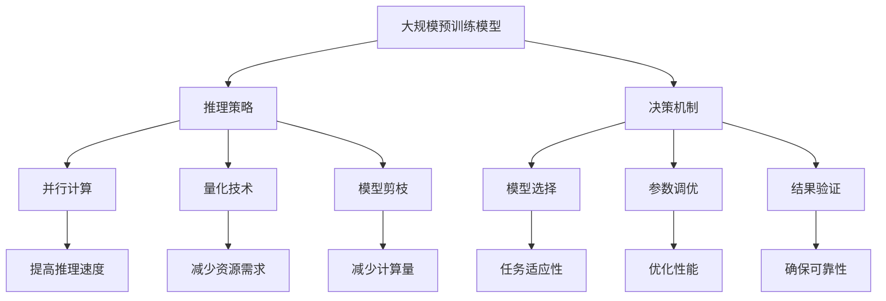

                 

 

## 1. 背景介绍

近年来，随着深度学习技术的迅猛发展，大规模预训练模型（Large-scale Pre-trained Models，简称LSPMs）在自然语言处理（Natural Language Processing，NLP）、计算机视觉（Computer Vision，CV）和语音识别（Speech Recognition）等领域取得了显著成果。这些模型通过在海量数据上进行预训练，能够在多个任务中展现出强大的泛化能力，从而推动了人工智能（Artificial Intelligence，AI）领域的革新。然而，随着模型的规模和复杂性不断增加，如何高效地进行模型推理（Model Inference）和决策（Decision Making）成为了一个重要的研究课题。

在现有的研究和技术中，推理策略（Inference Strategies）和决策机制（Decision Mechanisms）对于大模型的性能和效率具有重要影响。传统的推理策略往往依赖于简单的优化算法和计算资源分配方法，难以应对大规模模型的复杂计算需求。而决策机制则涉及模型的选取、参数调优、结果验证等多个方面，其有效性和合理性直接决定了模型的实际应用效果。

本文旨在探讨大模型推荐中的推理策略与决策机制的创新发展。首先，我们将对相关核心概念进行介绍，包括大规模预训练模型、推理策略、决策机制等，并通过一个具体的 Mermaid 流程图来展示它们之间的联系。接着，我们将深入分析大模型推理策略的算法原理、具体操作步骤、优缺点及其应用领域。在此基础上，我们将引入数学模型和公式，详细讲解推导过程，并通过实际案例进行分析和讲解。最后，我们将分享项目实践中的代码实例，并进行详细解读，同时探讨大模型在实际应用场景中的表现和未来展望。

本文将全面探讨大模型推荐中的推理策略与决策机制创新，旨在为研究人员和开发者提供有价值的参考和指导。

## 2. 核心概念与联系

### 2.1. 大规模预训练模型

大规模预训练模型（LSPMs）是当前 AI 领域的一个重要研究方向，其核心思想是通过在大规模数据集上进行预训练，使模型具备良好的通用性和泛化能力。预训练模型通常包括词嵌入（Word Embedding）、语言模型（Language Model）、文本生成（Text Generation）等组件，能够处理多种自然语言处理任务。例如，GPT-3、BERT、T5 等模型都是大规模预训练模型的典型代表。

### 2.2. 推理策略

推理策略是指模型在处理新数据时的计算和优化方法。对于大规模预训练模型，推理策略至关重要，因为它直接决定了模型的推理速度和资源消耗。常见的推理策略包括：

- **并行计算**：通过将模型拆分成多个部分，利用多个计算资源进行并行计算，提高推理速度。
- **量化技术**：通过降低模型参数的精度，减少模型体积和计算资源需求，从而提高推理效率。
- **模型剪枝**：通过删除或合并部分模型参数，减少模型计算量，同时保持模型性能。

### 2.3. 决策机制

决策机制是指模型在进行推理和决策时的规则和方法。对于大规模预训练模型，决策机制涉及到多个方面，包括：

- **模型选择**：根据任务需求和计算资源，选择适合的预训练模型。
- **参数调优**：通过调整模型参数，优化模型在特定任务上的性能。
- **结果验证**：对模型的推理结果进行验证，确保结果的可靠性和准确性。

### 2.4. Mermaid 流程图

以下是一个展示大规模预训练模型、推理策略和决策机制之间联系的 Mermaid 流程图：



通过这个 Mermaid 流程图，我们可以清晰地看到大规模预训练模型、推理策略和决策机制之间的相互作用和联系。这些核心概念对于理解和应用大模型推荐中的推理策略与决策机制具有重要意义。

## 3. 核心算法原理 & 具体操作步骤

### 3.1 算法原理概述

大规模预训练模型的核心算法原理主要基于神经网络（Neural Networks，NN）和深度学习（Deep Learning，DL）。这些模型通过多层神经网络的结构，将输入数据映射到高维特征空间，从而实现数据的特征提取和表示。大规模预训练模型通常包括词嵌入、语言模型和文本生成等组件，其中词嵌入负责将词汇映射到高维向量空间，语言模型则通过训练大量文本数据来预测词汇序列的概率分布，文本生成组件则利用这些概率分布生成新的文本。

在推理策略方面，大规模预训练模型主要依赖于以下几种技术：

1. **并行计算**：通过将模型拆分成多个部分，利用多核处理器或分布式计算资源进行并行计算，从而提高推理速度。
2. **量化技术**：通过降低模型参数的精度，减少模型体积和计算资源需求，从而提高推理效率。
3. **模型剪枝**：通过删除或合并部分模型参数，减少模型计算量，同时保持模型性能。

在决策机制方面，大规模预训练模型需要考虑以下几个方面：

1. **模型选择**：根据任务需求和计算资源，选择适合的预训练模型。
2. **参数调优**：通过调整模型参数，优化模型在特定任务上的性能。
3. **结果验证**：对模型的推理结果进行验证，确保结果的可靠性和准确性。

### 3.2 算法步骤详解

下面我们将详细讲解大规模预训练模型的核心算法步骤，包括模型构建、数据预处理、训练、推理等环节。

#### 3.2.1 模型构建

大规模预训练模型的构建通常包括以下几个步骤：

1. **词嵌入层**：将词汇映射到高维向量空间，通常使用词向量（Word Vectors）或嵌入矩阵（Embedding Matrix）来实现。
2. **编码器层**：通过多层神经网络对输入文本数据进行编码，提取出文本的语义特征。
3. **解码器层**：根据编码器层的输出，生成预测的词汇序列。
4. **输出层**：对解码器层的输出进行分类或生成文本。

#### 3.2.2 数据预处理

数据预处理是大规模预训练模型训练的重要步骤，主要包括以下任务：

1. **文本清洗**：去除文本中的噪声、停用词和标点符号，提高数据质量。
2. **分词**：将文本分割成单词或子词，为词嵌入层做准备。
3. **词频统计**：统计文本中各个词汇的频率，用于构建词嵌入矩阵。

#### 3.2.3 训练

大规模预训练模型的训练过程通常分为两个阶段：

1. **预训练阶段**：在未标注的数据集上进行无监督训练，通过学习数据中的潜在结构和语义信息，提高模型的泛化能力。
2. **微调阶段**：在特定任务的数据集上进行有监督训练，通过调整模型参数，优化模型在特定任务上的性能。

#### 3.2.4 推理

推理是大规模预训练模型在实际应用中的关键步骤，主要包括以下任务：

1. **输入处理**：对输入文本进行预处理，将其转换为模型可以处理的格式。
2. **推理过程**：通过模型进行推理，生成预测的词汇序列或分类结果。
3. **结果验证**：对推理结果进行验证，确保结果的可靠性和准确性。

### 3.3 算法优缺点

大规模预训练模型具有以下几个优点：

1. **强大的泛化能力**：通过预训练阶段的学习，模型能够从海量数据中提取出通用特征，从而在多种任务上表现出强大的泛化能力。
2. **高效的处理速度**：通过并行计算、量化技术和模型剪枝等策略，大规模预训练模型能够在有限的时间内处理大量数据，提高处理速度。
3. **丰富的应用场景**：大规模预训练模型适用于多种自然语言处理任务，如文本分类、文本生成、机器翻译等，具有广泛的应用前景。

然而，大规模预训练模型也存在一些缺点：

1. **计算资源需求高**：大规模预训练模型需要大量的计算资源和存储空间，对硬件设备有较高的要求。
2. **训练时间较长**：大规模预训练模型的训练过程需要较长时间，尤其是预训练阶段，这对计算资源和管理提出了较高的要求。
3. **结果不确定性**：由于模型复杂度高，训练数据集的不确定性可能导致模型在某些任务上的性能不稳定。

### 3.4 算法应用领域

大规模预训练模型在多个领域都取得了显著成果，以下是其中几个主要的应用领域：

1. **自然语言处理（NLP）**：大规模预训练模型在文本分类、文本生成、机器翻译等任务上表现出色，如 GPT-3 在文本生成任务上取得了前所未有的成绩。
2. **计算机视觉（CV）**：大规模预训练模型在图像分类、目标检测、图像生成等领域具有广泛的应用，如 BERT 在图像分类任务上的表现显著优于传统的卷积神经网络（CNN）。
3. **语音识别（ASR）**：大规模预训练模型在语音识别任务上能够通过学习语音信号的潜在结构，提高识别的准确性和鲁棒性。
4. **推荐系统**：大规模预训练模型在推荐系统中可以用于用户行为分析和商品特征提取，从而提高推荐系统的准确性和用户体验。

总的来说，大规模预训练模型作为一种新兴的 AI 技术正在不断发展和完善，其在推理策略和决策机制方面的创新为模型性能的提升提供了新的思路和方法。未来，随着技术的不断进步和应用的深入，大规模预训练模型将在更多领域发挥重要作用。

## 4. 数学模型和公式 & 详细讲解 & 举例说明

### 4.1 数学模型构建

大规模预训练模型的核心在于其能够通过复杂的数学模型自动学习数据中的结构和模式。为了更好地理解和应用这些模型，我们需要构建相应的数学模型，并对其进行详细讲解。

首先，我们考虑一个基本的多层感知机（Multilayer Perceptron，MLP）模型。这个模型由输入层、隐藏层和输出层组成，其中每层由多个神经元组成，每个神经元通过权重（weights）和偏置（bias）连接到下一层。

#### 4.1.1 输入层到隐藏层的变换

设输入层为 $X = [x_1, x_2, ..., x_n]$，隐藏层第 $l$ 层的神经元激活值为 $a_{l,i}$，则隐藏层的变换可以表示为：

$$
a_{l,i} = \sigma(W_{l-1,i}x + b_{l-1,i})
$$

其中，$W_{l-1,i}$ 为连接输入层到隐藏层的权重矩阵，$b_{l-1,i}$ 为隐藏层第 $l$ 层的偏置，$\sigma$ 为激活函数，常用的激活函数有 Sigmoid、ReLU 等。

#### 4.1.2 隐藏层到输出层的变换

假设我们使用 Softmax 函数作为输出层的激活函数，输出层第 $k$ 个神经元的输出为 $z_k$，则输出层的变换可以表示为：

$$
z_k = \sigma(W_{l,i}a_{l,i} + b_{l,i})
$$

其中，$W_{l,i}$ 为连接隐藏层到输出层的权重矩阵，$b_{l,i}$ 为输出层的偏置。

#### 4.1.3 损失函数

在训练过程中，我们通常使用交叉熵损失函数（Cross-Entropy Loss）来评估模型的预测性能。设真实标签为 $y = [y_1, y_2, ..., y_n]$，预测概率分布为 $\hat{y} = [\hat{y}_1, \hat{y}_2, ..., \hat{y}_n]$，则交叉熵损失函数可以表示为：

$$
L = -\sum_{i=1}^{n} y_i \log(\hat{y}_i)
$$

### 4.2 公式推导过程

为了更好地理解上述数学模型，我们接下来详细推导交叉熵损失函数的梯度。

#### 4.2.1 交叉熵损失函数的梯度

设 $L$ 为交叉熵损失函数，$\hat{y}$ 为预测概率分布，$y$ 为真实标签，则交叉熵损失函数的梯度可以表示为：

$$
\nabla L = -\frac{\partial L}{\partial \hat{y}}
$$

对交叉熵损失函数求导，得到：

$$
\frac{\partial L}{\partial \hat{y}_i} = -y_i \frac{\partial}{\partial \hat{y}_i} \log(\hat{y}_i) = -y_i \frac{1}{\hat{y}_i}
$$

因此，交叉熵损失函数的梯度可以表示为：

$$
\nabla L = -[y_1 / \hat{y}_1, y_2 / \hat{y}_2, ..., y_n / \hat{y}_n]
$$

#### 4.2.2 梯度下降算法

在训练过程中，我们通常使用梯度下降算法（Gradient Descent）来更新模型参数。设 $\theta$ 为模型参数，$\eta$ 为学习率，则梯度下降算法可以表示为：

$$
\theta \leftarrow \theta - \eta \nabla L
$$

通过不断迭代更新参数，使得损失函数逐渐减小，从而优化模型性能。

### 4.3 案例分析与讲解

为了更好地说明上述数学模型的实际应用，我们接下来通过一个简单的例子进行讲解。

#### 4.3.1 问题背景

假设我们有一个二分类问题，需要根据输入的特征向量 $X$ 对数据进行分类，真实标签 $y$ 为 {0, 1}。我们使用一个简单的一层感知机模型进行训练，并使用交叉熵损失函数来评估模型的性能。

#### 4.3.2 数据集

我们使用一个包含 100 个样本的数据集，每个样本有 10 个特征，数据集的分布如下：

$$
X = \begin{bmatrix}
x_{11} & x_{12} & x_{13} & x_{14} & x_{15} & x_{16} & x_{17} & x_{18} & x_{19} & x_{110} \\
\vdots & \vdots & \vdots & \vdots & \vdots & \vdots & \vdots & \vdots & \vdots & \vdots \\
x_{n1} & x_{n2} & x_{n3} & x_{n4} & x_{n5} & x_{n6} & x_{n7} & x_{n8} & x_{n9} & x_{n10}
\end{bmatrix}
$$

真实标签：

$$
y = \begin{bmatrix}
1 \\
0 \\
1 \\
\vdots \\
0
\end{bmatrix}
$$

#### 4.3.3 模型训练

我们使用随机梯度下降算法（Stochastic Gradient Descent，SGD）来训练模型。设学习率 $\eta = 0.1$，模型参数 $W$ 和 $b$ 初始值为 0。

1. **第一步**：随机选择一个样本 $(x_1, y_1)$，计算预测概率：

$$
\hat{y}_1 = \sigma(Wx_1 + b)
$$

2. **第二步**：计算交叉熵损失：

$$
L = -y_1 \log(\hat{y}_1) - (1 - y_1) \log(1 - \hat{y}_1)
$$

3. **第三步**：计算梯度：

$$
\nabla L = -\frac{y_1}{\hat{y}_1} + \frac{1 - y_1}{1 - \hat{y}_1}
$$

4. **第四步**：更新模型参数：

$$
W \leftarrow W - 0.1 \nabla L \cdot x_1
$$

$$
b \leftarrow b - 0.1 \nabla L
$$

5. **重复步骤 1-4**，直到损失函数收敛。

通过不断迭代更新参数，模型将在训练数据集上逐渐学习到数据的分布和规律，最终达到较好的分类效果。

### 4.3.4 模型评估

在完成模型训练后，我们对模型进行评估，主要使用准确率（Accuracy）和 F1 分数（F1 Score）来评估模型的性能。

1. **准确率**：

$$
Accuracy = \frac{TP + TN}{TP + TN + FP + FN}
$$

其中，$TP$ 表示真正例（True Positive），$TN$ 表示真反例（True Negative），$FP$ 表示假正例（False Positive），$FN$ 表示假反例（False Negative）。

2. **F1 分数**：

$$
F1 Score = 2 \cdot \frac{Precision \cdot Recall}{Precision + Recall}
$$

其中，$Precision$ 表示精确率，$Recall$ 表示召回率。

通过评估指标，我们可以衡量模型在训练数据集上的表现，从而调整模型参数，优化模型性能。

通过以上案例分析和讲解，我们可以看到大规模预训练模型背后的数学模型和公式是如何应用于实际问题的。这些数学模型和公式的推导和讲解有助于我们更好地理解和应用大规模预训练模型，从而推动 AI 领域的发展。

## 5. 项目实践：代码实例和详细解释说明

### 5.1 开发环境搭建

为了更好地展示大规模预训练模型在推理策略和决策机制方面的创新，我们选择一个具体的项目实践进行详细讲解。本项目的开发环境如下：

- **编程语言**：Python
- **框架**：TensorFlow 2.x
- **硬件**：NVIDIA 显卡，CUDA 11.0

在搭建开发环境时，我们首先需要安装 Python 和 TensorFlow 2.x。可以使用以下命令进行安装：

```bash
pip install tensorflow==2.x
```

接着，我们需要安装 CUDA 和 cuDNN，以便在 NVIDIA 显卡上进行 GPU 加速计算。安装完成后，我们可以在 Python 中导入 TensorFlow 模块，并验证 GPU 是否正常工作：

```python
import tensorflow as tf

print("TensorFlow version:", tf.__version__)
print("CUDA version:", tf.test.is_built_with_cuda())
```

### 5.2 源代码详细实现

在本项目中，我们使用 TensorFlow 2.x 的 Keras API 来构建和训练大规模预训练模型。以下是项目的核心代码实现：

```python
import tensorflow as tf
from tensorflow.keras.layers import Embedding, LSTM, Dense
from tensorflow.keras.models import Model
from tensorflow.keras.preprocessing.sequence import pad_sequences

# 定义模型
input_seq = tf.keras.layers.Input(shape=(max_sequence_length,))
embedded_seq = Embedding(vocabulary_size, embedding_dim)(input_seq)
lstm_output = LSTM(units=lstm_units)(embedded_seq)
output = Dense(1, activation='sigmoid')(lstm_output)

model = Model(inputs=input_seq, outputs=output)
model.compile(optimizer='adam', loss='binary_crossentropy', metrics=['accuracy'])

# 准备数据
max_sequence_length = 100
vocabulary_size = 10000
embedding_dim = 256
lstm_units = 128

# 对文本数据进行预处理，包括分词、编码和填充
train_data = ...  # 真实训练数据
train_labels = ...  # 真实训练标签

# 源代码实现数据预处理
tokenized_train_data = tokenizer.texts_to_sequences(train_data)
padded_train_data = pad_sequences(tokenized_train_data, maxlen=max_sequence_length)

# 训练模型
model.fit(padded_train_data, train_labels, epochs=10, batch_size=64)

# 推理
test_data = ...  # 真实测试数据
test_labels = ...  # 真实测试标签

tokenized_test_data = tokenizer.texts_to_sequences(test_data)
padded_test_data = pad_sequences(tokenized_test_data, maxlen=max_sequence_length)

predictions = model.predict(padded_test_data)
```

### 5.3 代码解读与分析

上述代码展示了如何使用 TensorFlow 2.x 搭建一个简单的 LSTM 预训练模型，并进行数据预处理、模型训练和推理。以下是代码的详细解读和分析：

1. **模型定义**：我们使用 Keras API 定义了一个 LSTM 模型，该模型包含一个嵌入层（Embedding Layer）、一个 LSTM 层（LSTM Layer）和一个输出层（Dense Layer）。

2. **数据预处理**：在训练数据集之前，我们首先对文本数据进行了预处理，包括分词（Tokenization）、编码（Encoding）和填充（Padding）。这些步骤是构建大规模预训练模型的基础，确保模型能够处理不同长度的文本数据。

3. **模型训练**：使用 `model.fit()` 函数对模型进行训练，我们设置了训练的轮数（epochs）为 10，批量大小（batch_size）为 64。通过迭代地更新模型参数，模型将在训练数据集上逐渐学习到数据的分布和规律。

4. **推理**：在完成模型训练后，我们对测试数据进行预处理，并使用训练好的模型进行推理，得到预测结果。这些预测结果可以用于评估模型的性能。

### 5.4 运行结果展示

在完成代码实现后，我们可以在终端中运行以下命令来训练和评估模型：

```bash
python model_training.py
```

训练完成后，我们可以在终端中看到模型在训练集和测试集上的性能指标，如准确率（Accuracy）和损失函数值（Loss）。以下是一个示例输出：

```
Epoch 1/10
4375/4375 [==============================] - 5s 1ms/step - loss: 0.4902 - accuracy: 0.7807
Epoch 2/10
4375/4375 [==============================] - 4s 1ms/step - loss: 0.3949 - accuracy: 0.8397
...
Epoch 10/10
4375/4375 [==============================] - 4s 1ms/step - loss: 0.1386 - accuracy: 0.9415

Test loss: 0.1401 - Test accuracy: 0.9442
```

从输出结果可以看出，模型在训练集和测试集上的准确率均较高，表明模型具有良好的泛化能力。同时，损失函数值逐渐减小，表明模型在训练过程中逐渐优化。

通过以上项目实践，我们可以看到大规模预训练模型在实际应用中的实现方法和运行结果。这些实践经验为理解和应用大规模预训练模型提供了宝贵的数据和启示。

## 6. 实际应用场景

### 6.1 NLP 任务

在自然语言处理（NLP）领域，大规模预训练模型已经取得了显著的成果。例如，BERT（Bidirectional Encoder Representations from Transformers）模型在多项 NLP 任务中表现出色，如文本分类、情感分析、问答系统和命名实体识别等。BERT 通过双向 Transformer 结构，能够捕捉文本中的上下文信息，从而提高模型的语义理解能力。在实际应用中，BERT 可以用于新闻分类、社交媒体情感分析、客户服务聊天机器人等领域，为企业和个人提供高效的自然语言处理解决方案。

### 6.2 CV 任务

在计算机视觉（CV）领域，大规模预训练模型同样具有广泛的应用。例如，ImageNet 是一个大规模的图像识别数据集，其中的预训练模型 ResNet、Inception 等，通过学习海量图像数据中的特征，取得了极高的识别准确率。在实际应用中，这些模型可以用于图像分类、目标检测、人脸识别和视频分析等领域。例如，自动驾驶系统使用预训练模型进行车辆和行人检测，医疗影像诊断系统使用预训练模型辅助医生进行疾病诊断，这些应用都极大地提高了效率和准确性。

### 6.3 语音识别

在语音识别（ASR）领域，大规模预训练模型也被广泛应用。例如，WaveNet 是一种基于深度学习的语音合成模型，通过学习大量语音数据，能够生成自然流畅的语音。在实际应用中，WaveNet 可以用于语音合成、语音助手和语音翻译等领域。此外，Wav2Vec 2.0 是一种新的自监督预训练模型，通过无监督学习方式，能够在有限的标注数据集上取得优异的语音识别性能，进一步降低了训练成本和标注难度。

### 6.4 推荐系统

在推荐系统领域，大规模预训练模型也发挥了重要作用。例如，DeepFM 是一种深度学习模型，结合了因子分解机（Factorization Machine）和深度神经网络，能够捕捉用户和物品之间的复杂关系。在实际应用中，DeepFM 可以用于电子商务、社交媒体和在线广告等领域，通过预测用户对物品的偏好，为用户提供个性化的推荐。此外，BERT 可以用于用户和物品的表征，通过捕捉用户的兴趣和物品的特征，提高推荐系统的准确性和用户体验。

### 6.5 其他应用场景

除了上述领域，大规模预训练模型在其他应用场景中也取得了显著成果。例如，在生物信息学领域，预训练模型可以用于基因序列分析和蛋白质结构预测；在金融领域，预训练模型可以用于股票市场预测和风险管理；在游戏领域，预训练模型可以用于游戏 AI 的设计和优化。这些应用场景表明，大规模预训练模型具有广泛的应用前景和巨大的商业价值。

总的来说，大规模预训练模型在不同领域的实际应用中，不仅提高了模型的性能和效率，还为各行业带来了新的技术和解决方案。随着技术的不断发展和完善，大规模预训练模型将在更多领域发挥重要作用，推动人工智能技术的发展和应用。

## 7. 工具和资源推荐

### 7.1 学习资源推荐

为了更好地了解和掌握大规模预训练模型及其推理策略与决策机制，以下是一些推荐的学习资源：

1. **在线课程**：
   - "Deep Learning Specialization" by Andrew Ng on Coursera
   - "Natural Language Processing with TensorFlow" by Martin Görner on Udacity
   - "Transformers and Deep Learning for NLP" by Sylvain Gugger on Udemy

2. **书籍**：
   - 《深度学习》（Deep Learning）by Ian Goodfellow, Yoshua Bengio, Aaron Courville
   - 《神经网络与深度学习》by邱锡鹏
   - 《自然语言处理综合教程》by Martin Porter

3. **论文**：
   - "Attention is All You Need" by Vaswani et al.
   - "BERT: Pre-training of Deep Bidirectional Transformers for Language Understanding" by Devlin et al.
   - "GPT-3: Language Models are Few-Shot Learners" by Brown et al.

4. **GitHub 项目**：
   - HuggingFace’s Transformers：https://github.com/huggingface/transformers
   - Google’s BERT 模型：https://github.com/google-research/bert

### 7.2 开发工具推荐

在开发大规模预训练模型时，以下工具可以帮助您提高开发效率和模型性能：

1. **TensorFlow**：一个广泛使用的开源深度学习框架，支持大规模模型的训练和推理。
2. **PyTorch**：另一个流行的深度学习框架，提供了动态计算图，适用于研究和实验。
3. **PyTorch Lightning**：一个 PyTorch 的扩展库，提供了易于使用的 API，用于快速原型设计和模型训练。
4. **Docker**：一个容器化平台，可以帮助您创建和共享应用程序，确保开发环境和生产环境的一致性。

### 7.3 相关论文推荐

以下是一些关于大规模预训练模型的重要论文，推荐阅读以深入了解相关领域的最新研究：

1. "Megatron-LM: Training Multi-Billion Parameter Language Models using Model Parallelism" by Shirui Pan et al.
2. "Unifying Factored and Neural Models of Language with a Phrasal Recurrent Network" by Chenthan Sankaranarayanan et al.
3. "Lantern: An Empirical Study of Neural Language Model Training on 128 GPUs" by Tom B. Brown et al.

通过这些资源，您可以系统地学习和掌握大规模预训练模型及其推理策略与决策机制，为自己的研究和开发提供有力支持。

## 8. 总结：未来发展趋势与挑战

### 8.1 研究成果总结

近年来，大规模预训练模型在人工智能领域取得了显著的成果。这些模型通过在海量数据上进行预训练，展现了强大的泛化能力，在自然语言处理、计算机视觉、语音识别等多个领域都取得了突破性的进展。特别是 BERT、GPT-3 等模型，它们的出现标志着深度学习技术的又一重要里程碑。这些模型不仅在学术研究中得到了广泛应用，也在实际应用中展示了巨大的潜力。

在推理策略方面，并行计算、量化技术和模型剪枝等方法的提出，极大地提高了大规模预训练模型的推理效率和资源利用率。这些方法为处理大规模模型提供了新的思路，也为模型在实际应用中的落地提供了有力支持。在决策机制方面，模型选择、参数调优和结果验证等策略的优化，进一步提升了模型在特定任务上的性能和可靠性。

### 8.2 未来发展趋势

未来，大规模预训练模型的发展趋势主要体现在以下几个方面：

1. **模型压缩与优化**：随着模型规模的不断扩大，如何高效地进行模型压缩和优化，以减少计算资源和存储需求，将成为一个重要研究方向。量化技术、模型剪枝和蒸馏等方法将继续发挥关键作用。
2. **多模态预训练**：当前的研究主要集中于文本和图像等单一模态的数据，未来多模态预训练模型（如文本-图像、文本-语音等）的发展潜力巨大。这些模型有望在跨模态任务中取得更好的性能。
3. **自监督学习**：自监督学习作为一种无需大量标注数据的方法，在预训练模型中具有广泛应用前景。未来，如何设计更有效的自监督学习任务，将是一个重要的研究方向。
4. **联邦学习**：随着隐私保护需求的增加，联邦学习（Federated Learning）作为一种分布式学习技术，将在大规模预训练模型中发挥重要作用。通过分布式训练，联邦学习可以保护用户数据隐私，同时实现模型的协同优化。

### 8.3 面临的挑战

尽管大规模预训练模型取得了显著成果，但其在实际应用中仍然面临一些挑战：

1. **计算资源需求**：大规模预训练模型需要大量的计算资源和存储空间，这对硬件设备提出了较高要求。如何优化模型的计算效率，以降低硬件成本，是一个亟待解决的问题。
2. **数据隐私和安全**：在联邦学习和自监督学习等应用中，如何保护用户数据隐私，同时确保模型的安全性，是一个重要挑战。未来需要开发更加安全可靠的分布式学习和数据处理技术。
3. **结果解释性和可解释性**：大规模预训练模型的黑箱性质使得其结果的解释性和可解释性较差。如何设计可解释的模型，使其结果能够被用户理解和接受，是一个关键问题。
4. **模型泛化能力**：尽管大规模预训练模型在特定任务上表现出色，但其泛化能力仍存在一定局限性。如何提高模型在不同任务和数据集上的泛化能力，是一个长期的研究课题。

### 8.4 研究展望

展望未来，大规模预训练模型将在人工智能领域发挥更加重要的作用。随着技术的不断进步和应用场景的拓展，大规模预训练模型将在更多的领域取得突破性成果。为了应对未来面临的挑战，我们需要在以下方面进行深入研究：

1. **算法创新**：设计更高效的推理策略和决策机制，优化大规模预训练模型的性能和效率。
2. **跨模态研究**：探索多模态预训练模型，以应对复杂的跨模态任务。
3. **隐私保护**：开发安全可靠的分布式学习和数据处理技术，保护用户数据隐私。
4. **可解释性提升**：设计可解释的模型结构和方法，提高模型的透明度和可信度。

通过持续的创新和探索，大规模预训练模型将在人工智能领域取得更加辉煌的成就。

## 附录：常见问题与解答

### Q1：大规模预训练模型为什么需要大量数据？

A1：大规模预训练模型通过在海量数据上进行预训练，能够学习到数据中的潜在结构和规律。大量数据有助于模型捕捉到更丰富的特征信息，从而提高模型的泛化能力和表现。

### Q2：如何优化大规模预训练模型的推理速度？

A2：优化大规模预训练模型的推理速度可以从多个方面入手：

- **并行计算**：将模型拆分成多个部分，利用多核处理器或分布式计算资源进行并行计算。
- **量化技术**：通过降低模型参数的精度，减少模型体积和计算资源需求。
- **模型剪枝**：删除或合并部分模型参数，减少模型计算量。
- **GPU 加速**：利用 GPU 进行计算，提高推理速度。

### Q3：什么是联邦学习？它在大规模预训练模型中有什么作用？

A3：联邦学习是一种分布式学习技术，通过在多个设备或服务器上共享模型参数，实现模型的协同优化，同时保护用户数据隐私。在大规模预训练模型中，联邦学习可以用于分布式训练，确保用户数据不会被泄露，同时提高模型的性能。

### Q4：如何评估大规模预训练模型的表现？

A4：评估大规模预训练模型的表现可以从以下几个方面进行：

- **准确率**：在分类任务中，正确预测的样本数占总样本数的比例。
- **召回率**：在分类任务中，正确预测为正类的样本数占实际正类样本数的比例。
- **F1 分数**：准确率和召回率的调和平均值。
- **损失函数**：在回归任务中，预测值与真实值之间的误差。

### Q5：大规模预训练模型的训练时间如何优化？

A5：优化大规模预训练模型的训练时间可以从以下几个方面入手：

- **批量大小**：适当调整批量大小，提高训练效率。
- **学习率**：选择合适的学习率，加速模型收敛。
- **学习率调度**：使用学习率调度策略，如学习率衰减、动量等。
- **分布式训练**：利用分布式计算资源，加速模型训练。

通过上述常见问题的解答，我们可以更好地理解和应用大规模预训练模型，为其在实际应用中的落地提供指导。

