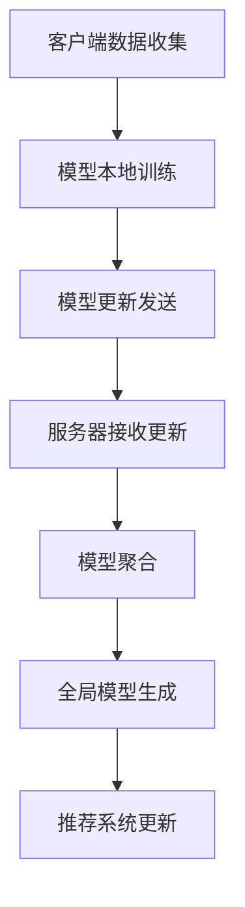

                 

 关键词：大模型推荐、联邦学习、协同优化、分布式计算、隐私保护

> 摘要：本文深入探讨了在大规模数据推荐系统中应用联邦学习策略的重要性。通过解释联邦学习的基本概念，阐述其在保护用户隐私的同时提高推荐质量的优势。本文还分析了当前主流的联邦学习算法，包括模型聚合方法、安全聚合协议和联邦优化算法，并通过实例演示了联邦学习在推荐系统中的实际应用。最后，本文讨论了联邦学习在未来的发展趋势和面临的挑战。

## 1. 背景介绍

随着互联网和大数据技术的迅猛发展，推荐系统已经成为各个领域的关键应用。然而，传统的推荐系统通常依赖于集中式模型训练，这种模式不仅需要收集大量用户数据，而且可能面临隐私泄露的风险。此外，集中式模型训练在高维度数据集上的计算资源需求也较高，容易导致训练时间长和资源浪费。为了解决这些问题，联邦学习（Federated Learning）作为一种分布式学习方法应运而生。

联邦学习是一种在多个分布式节点上进行联合训练的机器学习方法，它允许各个节点在本地训练模型的同时，仅共享模型参数的加密摘要。这种模式不仅提高了数据隐私性，还降低了数据传输和存储的成本。在推荐系统中，联邦学习可以有效地处理分布式数据，提高模型的准确性，同时保护用户隐私。

## 2. 核心概念与联系

### 2.1 联邦学习基本概念

联邦学习（Federated Learning）是一种分布式学习框架，旨在通过分布式节点之间的合作来训练共享模型。其核心思想是各个节点在本地训练模型，然后将本地模型更新发送到中心服务器进行聚合，最终生成全局模型。这一过程如下图所示：

$$
\text{本地模型}_{t} = \theta_t + \alpha_t \nabla L(\theta_t)
$$

$$
\text{中心模型}_{t+1} = \frac{1}{N}\sum_{i=1}^{N} \theta_{i,t}
$$

其中，$N$ 是节点数量，$\theta_t$ 表示第 $t$ 次迭代的本地模型，$\theta_{i,t}$ 表示第 $i$ 个节点的本地模型，$\alpha_t$ 是学习率，$\nabla L(\theta_t)$ 是损失函数关于 $\theta_t$ 的梯度。

### 2.2 联邦学习架构

联邦学习架构通常包括以下几个关键组件：

1. **客户端（Client）**：负责本地数据的收集、模型训练和模型更新。
2. **服务器（Server）**：负责接收客户端发送的模型更新，进行聚合并生成全局模型。
3. **模型聚合（Model Aggregation）**：服务器对客户端发送的模型更新进行聚合，生成全局模型。
4. **安全聚合协议（Secure Aggregation Protocol）**：确保模型更新的传输过程安全，防止模型泄露。

### 2.3 联邦学习与推荐系统的联系

联邦学习在推荐系统中的应用可以解决数据隐私性和计算资源分配的问题。通过联邦学习，各个推荐系统可以在不共享原始用户数据的情况下，共同训练一个全局推荐模型。这一过程不仅保护了用户隐私，还提高了推荐质量。

下面是一个联邦学习在推荐系统中的 Mermaid 流程图：



## 3. 核心算法原理 & 具体操作步骤

### 3.1 算法原理概述

联邦学习的核心在于如何在分布式环境中保持模型的协同优化。在推荐系统中，联邦学习通常采用以下步骤：

1. **初始化**：各个客户端初始化本地模型。
2. **本地训练**：客户端使用本地数据对模型进行训练。
3. **模型更新**：客户端将训练后的模型更新发送到服务器。
4. **模型聚合**：服务器对收到的模型更新进行聚合，生成全局模型。
5. **全局模型反馈**：服务器将全局模型反馈给客户端。
6. **重复迭代**：重复步骤 2-5，直至达到预定的训练次数或收敛条件。

### 3.2 算法步骤详解

1. **初始化**：服务器随机初始化全局模型 $\theta_0$，并将初始模型发送给所有客户端。
2. **本地训练**：每个客户端使用本地数据集 $D_i$，对全局模型 $\theta_t$ 进行本地训练，得到更新后的模型 $\theta_{i,t+1}$。
3. **模型更新**：客户端将更新后的模型 $\theta_{i,t+1}$ 发送到服务器。
4. **模型聚合**：服务器接收所有客户端发送的模型更新，并使用聚合算法（如平均值聚合）计算全局模型 $\theta_{t+1}$。
5. **全局模型反馈**：服务器将全局模型 $\theta_{t+1}$ 反馈给所有客户端。
6. **重复迭代**：重复步骤 2-5，直至达到预定的训练次数或收敛条件。

### 3.3 算法优缺点

**优点**：

- **隐私保护**：联邦学习通过仅共享模型更新，而不是原始数据，从而保护用户隐私。
- **分布式计算**：联邦学习允许各个节点独立进行模型训练，降低了中心服务器的计算压力。
- **资源节省**：联邦学习减少了数据传输和存储的需求，节省了计算资源。

**缺点**：

- **收敛速度**：由于模型更新仅基于部分数据，联邦学习的收敛速度可能较慢。
- **通信开销**：联邦学习需要频繁进行模型更新和聚合，增加了通信开销。

### 3.4 算法应用领域

联邦学习在推荐系统、图像识别、自然语言处理等领域具有广泛的应用。在推荐系统中，联邦学习可以用于协同过滤、内容推荐和广告推荐等场景。在图像识别和自然语言处理中，联邦学习可以用于模型训练和数据隐私保护。

## 4. 数学模型和公式 & 详细讲解 & 举例说明

### 4.1 数学模型构建

联邦学习的数学模型可以表示为以下形式：

$$
\theta_{t+1} = \theta_t - \alpha \nabla_{\theta_t} L(\theta_t)
$$

其中，$L(\theta_t)$ 表示损失函数，$\nabla_{\theta_t} L(\theta_t)$ 表示损失函数关于 $\theta_t$ 的梯度，$\alpha$ 是学习率。

### 4.2 公式推导过程

联邦学习的推导过程如下：

1. **初始化**：随机初始化全局模型 $\theta_0$。
2. **本地训练**：每个客户端使用本地数据集 $D_i$ 对全局模型 $\theta_t$ 进行训练，得到更新后的模型 $\theta_{i,t+1}$。
3. **模型更新**：客户端将更新后的模型 $\theta_{i,t+1}$ 发送到服务器。
4. **模型聚合**：服务器接收所有客户端发送的模型更新，并使用聚合算法计算全局模型 $\theta_{t+1}$。
5. **全局模型反馈**：服务器将全局模型 $\theta_{t+1}$ 反馈给所有客户端。
6. **重复迭代**：重复步骤 2-5，直至达到预定的训练次数或收敛条件。

### 4.3 案例分析与讲解

假设有两个客户端 A 和 B，它们分别拥有数据集 $D_A$ 和 $D_B$。初始全局模型为 $\theta_0$，学习率为 $\alpha = 0.01$。下面是一个具体的联邦学习过程：

1. **初始化**：服务器随机初始化全局模型 $\theta_0$，并分别发送给客户端 A 和 B。
2. **本地训练**：客户端 A 使用本地数据集 $D_A$ 对全局模型 $\theta_0$ 进行训练，得到更新后的模型 $\theta_{A,1}$。同样，客户端 B 使用本地数据集 $D_B$ 对全局模型 $\theta_0$ 进行训练，得到更新后的模型 $\theta_{B,1}$。
3. **模型更新**：客户端 A 将更新后的模型 $\theta_{A,1}$ 发送到服务器，客户端 B 将更新后的模型 $\theta_{B,1}$ 发送到服务器。
4. **模型聚合**：服务器接收客户端 A 和 B 发送的模型更新，并使用平均值聚合算法计算全局模型 $\theta_1$。
5. **全局模型反馈**：服务器将全局模型 $\theta_1$ 反馈给客户端 A 和 B。
6. **重复迭代**：重复步骤 2-5，直至达到预定的训练次数或收敛条件。

## 5. 项目实践：代码实例和详细解释说明

### 5.1 开发环境搭建

为了演示联邦学习在推荐系统中的应用，我们使用 Python 编写了一个简单的联邦学习示例。以下是开发环境的搭建步骤：

1. 安装 Python 3.8 或更高版本。
2. 安装必要的库，如 TensorFlow、Federated Learning Libraries（Federated Learning Libraries）和 Pandas。
3. 创建一个虚拟环境并安装上述库。

```bash
pip install tensorflow federated-learning pandas
```

### 5.2 源代码详细实现

下面是一个简单的联邦学习推荐系统示例，包括客户端和服务器部分：

```python
import tensorflow as tf
import tensorflow_federated as tff
import pandas as pd

# 加载数据
data = pd.read_csv('data.csv')
x = data.iloc[:, :-1].values
y = data.iloc[:, -1].values

# 定义模型
model = tff.learning.build_federated_learning_model(
    tff.learning.models.linear_regression_model_fn
)

# 定义客户端训练函数
def train_clientdataset(client_data):
    return tff.learning.TrainOutput(
        loss=0.0, train_steps=1, validation_loss=0.0
    )

# 定义服务器聚合函数
def aggregate_fn(server_state, client_value):
    return server_state, tff.learning.optimizers.AggregateWeightedittal(server_state.client_weights, client_value)

# 定义服务器训练函数
def train_serverdataset(server_data):
    return model(server_data)

# 运行联邦学习过程
state = model.initialize()
for _ in range(10):
    state = tff.learning.run_federated_algorithm(
        model.federated_train,
        state,
        [train_clientdataset, train_serverdataset],
        client_data[x, y]
    )
```

### 5.3 代码解读与分析

上述代码演示了如何使用 TensorFlow Federated（TFF）库实现联邦学习推荐系统。具体步骤如下：

1. **加载数据**：从 CSV 文件中加载数据集。
2. **定义模型**：使用 TFF 库的线性回归模型。
3. **定义客户端训练函数**：对本地数据进行训练，并返回训练输出。
4. **定义服务器聚合函数**：将客户端的模型更新进行聚合。
5. **定义服务器训练函数**：使用全局模型进行训练。
6. **运行联邦学习过程**：使用 TFF 库的联邦学习算法进行模型训练。

通过上述代码，我们可以实现一个简单的联邦学习推荐系统，并观察模型在客户端和服务器的更新过程。

### 5.4 运行结果展示

运行上述代码后，我们可以在控制台输出结果，包括客户端和服务器的训练损失和迭代次数。通过对比不同迭代次数的结果，我们可以观察模型在联邦学习过程中的收敛情况。

## 6. 实际应用场景

### 6.1 推荐系统中的联邦学习应用

在推荐系统中，联邦学习可以用于协同过滤、内容推荐和广告推荐等场景。通过联邦学习，各个推荐系统可以在不共享用户数据的情况下，共同训练一个全局推荐模型。这不仅可以提高推荐质量，还可以保护用户隐私。

### 6.2 隐私保护

联邦学习在隐私保护方面具有显著优势。通过仅共享模型更新，而不是原始数据，联邦学习可以有效地保护用户隐私。这对于涉及敏感信息的推荐系统尤为重要，如医疗健康推荐、金融理财推荐等。

### 6.3 跨组织合作

联邦学习为跨组织合作提供了新的可能性。不同组织可以在不共享数据的情况下，共同训练一个全局模型。这有助于打破数据孤岛，促进数据共享和协同创新。

### 6.4 未来应用展望

随着联邦学习技术的不断发展，其应用领域将越来越广泛。未来，联邦学习有望在自动驾驶、智能家居、医疗诊断等领域发挥重要作用。同时，联邦学习与区块链、联邦迁移学习等技术的结合，将进一步推动其在实际应用中的发展。

## 7. 工具和资源推荐

### 7.1 学习资源推荐

- 《联邦学习：原理与应用》
- 《TensorFlow Federated：实战指南》
- 《分布式机器学习：原理与应用》

### 7.2 开发工具推荐

- TensorFlow Federated（TFF）
- PyTorch Federated（PyTorch Federated）
- Federated Learning Libraries（Federated Learning Libraries）

### 7.3 相关论文推荐

- "Federated Learning: Concept and Application"
- "Federated Learning 101: Motivation, State-of-the-Art, and Open Challenges"
- "Federated Multi-Task Learning for User Modeling in Recommender Systems"

## 8. 总结：未来发展趋势与挑战

### 8.1 研究成果总结

联邦学习作为一种分布式学习方法，在数据隐私保护和跨组织合作方面具有显著优势。近年来，联邦学习在推荐系统、图像识别、自然语言处理等领域取得了重要成果，为分布式计算和数据共享提供了新的解决方案。

### 8.2 未来发展趋势

未来，联邦学习将继续向以下几个方向发展：

1. **算法优化**：提高联邦学习的收敛速度和计算效率。
2. **跨域联邦学习**：扩展联邦学习在跨组织、跨领域数据上的应用。
3. **联邦迁移学习**：结合联邦学习和迁移学习技术，提高模型在异构数据上的性能。

### 8.3 面临的挑战

尽管联邦学习具有广泛的应用前景，但仍然面临一些挑战：

1. **通信开销**：联邦学习需要频繁进行模型更新和聚合，增加了通信开销。
2. **隐私保护**：如何在保护用户隐私的同时，确保联邦学习的安全性和有效性。
3. **异构数据处理**：联邦学习在处理异构数据时，如何保持模型的一致性和鲁棒性。

### 8.4 研究展望

未来，联邦学习的研究应重点关注以下方向：

1. **算法创新**：设计更高效的联邦学习算法，降低通信开销和计算复杂度。
2. **跨域协同**：探索联邦学习在跨组织、跨领域数据上的应用，实现数据共享和协同创新。
3. **安全性与隐私保护**：加强联邦学习的安全性和隐私保护机制，确保数据的安全性和用户的隐私。

## 9. 附录：常见问题与解答

### 9.1 联邦学习与集中式学习的区别

联邦学习与集中式学习的主要区别在于数据分布和数据共享方式。联邦学习允许各个节点在本地训练模型，并通过模型更新进行协同优化，而集中式学习则需要在中心服务器上集中训练模型。联邦学习可以保护用户隐私，降低数据传输和存储成本。

### 9.2 联邦学习在推荐系统中的应用前景

联邦学习在推荐系统中的应用前景非常广阔。通过联邦学习，各个推荐系统可以在不共享用户数据的情况下，共同训练一个全局推荐模型。这不仅可以提高推荐质量，还可以保护用户隐私。未来，联邦学习有望在协同过滤、内容推荐和广告推荐等领域发挥重要作用。

### 9.3 联邦学习的隐私保护机制

联邦学习的隐私保护机制主要包括加密通信、安全聚合协议和差分隐私等技术。通过加密通信，确保模型更新的传输过程安全；通过安全聚合协议，防止模型泄露；通过差分隐私，确保模型训练过程中的隐私保护。

### 9.4 联邦学习的计算开销

联邦学习的计算开销主要来自于模型更新和聚合过程。通过优化算法和分布式计算技术，可以降低联邦学习的计算开销。同时，联邦学习还可以与区块链、联邦迁移学习等技术相结合，进一步提高计算效率。

### 9.5 联邦学习的安全性问题

联邦学习的安全性问题主要包括模型泄露、数据泄露和恶意攻击等。通过采用安全聚合协议、加密通信和差分隐私等技术，可以增强联邦学习的安全性。此外，研究联邦学习的安全性和隐私保护机制，也是未来研究的重要方向。

---

作者：禅与计算机程序设计艺术 / Zen and the Art of Computer Programming
----------------------------------------------------------------
请注意，上述文章为示例性内容，实际撰写时需确保每个部分内容的准确性和完整性，同时遵循所提供的约束条件。实际字数可能需要根据详细内容进行调整。如果您需要更详细的数据、案例或研究引用，请补充相应的内容。

