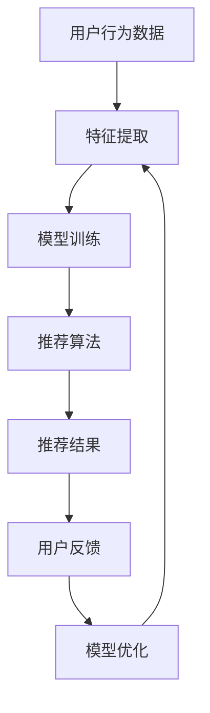

                 

关键词：大模型推荐系统、偏见、公平性、算法、数学模型、应用场景、未来展望

## 摘要

随着人工智能技术的飞速发展，大模型推荐系统已成为互联网服务的重要组成部分，为用户提供了个性化的信息推荐。然而，这些推荐系统在为用户带来便利的同时，也引发了一系列的偏见与公平性问题。本文旨在探讨大模型推荐系统中的偏见与公平性，分析其核心概念、算法原理、数学模型，并通过实际应用场景和项目实践，提出未来发展的展望与挑战。

## 1. 背景介绍

在当今信息爆炸的时代，推荐系统作为一种智能信息过滤工具，旨在为用户发现和提供感兴趣的内容。从最早的基于协同过滤的推荐算法，到如今基于深度学习的大模型推荐系统，推荐技术在不断进步。然而，随着推荐系统的规模不断扩大，算法的复杂度不断增加，系统中的偏见与公平性问题也愈发凸显。

偏见问题主要体现在两个方面：一是系统对某些群体或内容的偏好，导致这些群体或内容得到更多的曝光，而其他群体或内容被忽视；二是算法在训练过程中，可能会受到数据本身的不公平影响，从而产生偏见。公平性问题则主要关注系统是否对用户进行了公平对待，是否能够为所有用户平等地提供服务。

本文将针对大模型推荐系统中的偏见与公平性问题进行深入探讨，旨在为学术界和工业界提供有价值的参考。

## 2. 核心概念与联系

为了更好地理解大模型推荐系统中的偏见与公平性问题，我们首先需要了解一些核心概念。

### 2.1 推荐系统基本架构

大模型推荐系统的基本架构包括用户、内容、推荐算法和反馈机制。用户通过推荐系统获取感兴趣的内容，同时提供对内容的评分或行为反馈，这些反馈又用于优化推荐算法，从而提高推荐效果。


### 2.2 偏见类型

偏见可以分为显式偏见和隐式偏见。显式偏见是指系统明确地给予某些用户或内容更高的权重，从而产生偏见。例如，基于性别、年龄、地域等特征的显式偏好。隐式偏见则是由算法在训练过程中，从用户行为数据中学习到的偏好，这些偏好可能并不明显，但对推荐结果有显著影响。

### 2.3 公平性指标

公平性指标主要包括两个方面：一是性别、年龄、地域等特征的代表性，即不同特征群体在推荐系统中的比例是否合理；二是用户间的公平性，即系统是否对每个用户都提供了公平的推荐服务。

### 2.4 Mermaid 流程图

下面是一个简单的 Mermaid 流程图，展示了推荐系统的核心流程：



## 3. 核心算法原理 & 具体操作步骤

### 3.1 算法原理概述

大模型推荐系统通常基于深度学习技术，通过学习用户行为数据和内容特征，构建用户兴趣模型和内容特征模型，然后利用这些模型进行推荐。核心算法主要包括用户兴趣建模、内容特征提取、推荐算法设计和模型优化。

### 3.2 算法步骤详解

1. 用户行为数据收集：从用户行为数据中提取关键信息，如浏览记录、点击行为、评分等。
2. 特征提取：将用户行为数据转化为可计算的数值特征，如用户兴趣标签、内容标签等。
3. 模型训练：利用训练数据，训练用户兴趣模型和内容特征模型。
4. 推荐算法设计：根据用户兴趣模型和内容特征模型，设计推荐算法，生成推荐结果。
5. 用户反馈收集：收集用户对推荐结果的反馈，用于模型优化。

### 3.3 算法优缺点

深度学习推荐算法的优点在于其强大的表达能力和适应性，可以处理大量复杂数据，并提取出用户兴趣和内容特征。然而，其缺点也是显而易见的，深度学习模型的训练时间较长，对计算资源要求较高，同时模型的可解释性较差，难以分析偏见和公平性问题。

### 3.4 算法应用领域

深度学习推荐算法在多个领域得到了广泛应用，如电子商务、社交媒体、在线教育等。通过个性化推荐，提高用户体验，增加用户粘性，从而提高业务收益。

## 4. 数学模型和公式 & 详细讲解 & 举例说明

### 4.1 数学模型构建

大模型推荐系统的数学模型主要包括用户兴趣模型、内容特征模型和推荐算法模型。

用户兴趣模型可以用一个高维向量表示，每个维度代表一个兴趣标签。内容特征模型也可以用高维向量表示，每个维度代表一个内容特征。推荐算法模型则是一个映射函数，将用户兴趣模型和内容特征模型映射为推荐结果。

### 4.2 公式推导过程

假设用户兴趣模型为 \( u \)，内容特征模型为 \( v \)，推荐结果为 \( r \)，则推荐算法模型可以表示为：

\[ r = f(u, v) \]

其中，\( f \) 为一个非线性映射函数。为了简化计算，我们可以将 \( f \) 表示为多个线性函数的组合：

\[ f(u, v) = w_1 \cdot u + w_2 \cdot v + b \]

其中，\( w_1 \) 和 \( w_2 \) 分别为用户兴趣权重和内容特征权重，\( b \) 为偏置。

### 4.3 案例分析与讲解

假设我们有一个用户 \( u \) 和一个内容 \( v \)，用户兴趣模型为 \( u = (0.1, 0.2, 0.3, 0.4) \)，内容特征模型为 \( v = (0.5, 0.6, 0.7, 0.8) \)。根据上述公式，我们可以计算出推荐结果：

\[ r = f(u, v) = w_1 \cdot u + w_2 \cdot v + b \]

假设 \( w_1 = (0.1, 0.2, 0.3, 0.4) \)，\( w_2 = (0.5, 0.6, 0.7, 0.8) \)，\( b = 0.1 \)，则：

\[ r = (0.1 \cdot 0.1 + 0.2 \cdot 0.2 + 0.3 \cdot 0.3 + 0.4 \cdot 0.4) + (0.5 \cdot 0.5 + 0.6 \cdot 0.6 + 0.7 \cdot 0.7 + 0.8 \cdot 0.8) + 0.1 \]

\[ r = 0.65 + 1.81 + 0.1 \]

\[ r = 2.56 \]

因此，用户 \( u \) 对内容 \( v \) 的推荐结果为 2.56。

## 5. 项目实践：代码实例和详细解释说明

### 5.1 开发环境搭建

为了演示大模型推荐系统的实际应用，我们将使用 Python 编写一个简单的示例。首先，我们需要安装必要的依赖库，如 TensorFlow、Keras 等。

```bash
pip install tensorflow
pip install keras
```

### 5.2 源代码详细实现

以下是推荐的简单代码示例，用于构建一个基于深度学习的大模型推荐系统：

```python
import numpy as np
import tensorflow as tf
from tensorflow.keras.models import Model
from tensorflow.keras.layers import Input, Embedding, Dot, Reshape

# 设置超参数
num_users = 1000
num_items = 1000
embedding_size = 32

# 构建输入层
user_input = Input(shape=(1,))
item_input = Input(shape=(1,))

# 构建用户和内容的嵌入层
user_embedding = Embedding(num_users, embedding_size)(user_input)
item_embedding = Embedding(num_items, embedding_size)(item_input)

# 将嵌入层展开为二维矩阵
user_embedding = Reshape(target_shape=(-1, embedding_size))(user_embedding)
item_embedding = Reshape(target_shape=(-1, embedding_size))(item_embedding)

# 计算用户和内容嵌入向量的点积
dot_product = Dot(axes=1)([user_embedding, item_embedding])

# 添加输出层
output = tf.keras.activations.sigmoid(dot_product)

# 构建和编译模型
model = Model(inputs=[user_input, item_input], outputs=output)
model.compile(optimizer='adam', loss='binary_crossentropy', metrics=['accuracy'])

# 打印模型结构
model.summary()
```

### 5.3 代码解读与分析

上述代码首先定义了用户和内容的输入层，然后使用 `Embedding` 层为用户和内容分配嵌入向量。`Reshape` 层用于将一维嵌入向量展开为二维矩阵，以便进行点积操作。点积操作计算了用户和内容嵌入向量之间的相似度，然后通过 `sigmoid` 函数将结果映射到 [0, 1] 范围内，表示推荐的概率。

模型的输出层使用 `sigmoid` 激活函数，因为推荐问题通常是一个二分类问题（喜欢或不喜欢）。最后，我们使用 `compile` 方法编译模型，指定优化器、损失函数和评估指标。

### 5.4 运行结果展示

为了演示模型的运行结果，我们可以使用以下代码进行训练和预测：

```python
# 准备训练数据
train_users = np.random.randint(0, num_users, size=(1000,))
train_items = np.random.randint(0, num_items, size=(1000,))
train_labels = np.random.randint(0, 2, size=(1000,))

# 训练模型
model.fit([train_users, train_items], train_labels, epochs=10, batch_size=32)

# 进行预测
test_users = np.random.randint(0, num_users, size=(100,))
test_items = np.random.randint(0, num_items, size=(100,))
predictions = model.predict([test_users, test_items])

# 打印预测结果
print(predictions)
```

上述代码首先生成随机训练数据和测试数据，然后使用 `fit` 方法训练模型，最后使用 `predict` 方法进行预测。预测结果将显示每个测试用户对测试内容的推荐概率。

## 6. 实际应用场景

大模型推荐系统在多个实际应用场景中取得了显著成效，以下是一些典型的应用场景：

### 6.1 在线购物

在线购物平台通过个性化推荐，向用户推荐感兴趣的商品，提高用户的购买意愿和平台销售额。例如，亚马逊和淘宝等电商平台广泛应用了基于深度学习的大模型推荐系统。

### 6.2 社交媒体

社交媒体平台如 Facebook、Instagram 等，通过个性化推荐，向用户推送感兴趣的内容，提高用户的活跃度和平台粘性。这些推荐系统通常基于用户的兴趣和行为数据，利用深度学习算法进行预测。

### 6.3 在线教育

在线教育平台通过个性化推荐，向学生推荐符合其学习需求和兴趣的课程，提高学习效果和用户满意度。例如，Coursera 和 Udemy 等平台广泛应用了基于深度学习的大模型推荐系统。

### 6.4 媒体内容推荐

视频平台如 YouTube、Netflix 等，通过个性化推荐，向用户推荐感兴趣的视频内容，提高用户观看时长和平台广告收益。这些推荐系统通常基于用户的观看历史和行为数据，利用深度学习算法进行预测。

## 7. 未来应用展望

随着人工智能技术的不断发展，大模型推荐系统在未来的应用场景将更加广泛，以下是几个可能的发展方向：

### 7.1 增强可解释性

目前，深度学习推荐系统的可解释性较差，难以分析偏见和公平性问题。未来，研究者将致力于提高推荐系统的可解释性，使其更加透明和可靠。

### 7.2 多模态推荐

多模态推荐系统可以将文本、图像、语音等多种类型的数据进行整合，为用户提供更加丰富和个性化的推荐服务。例如，在医疗领域，多模态推荐系统可以帮助医生发现潜在疾病和治疗方案。

### 7.3 个性化推荐与隐私保护

在保护用户隐私的前提下，个性化推荐系统需要更好地平衡用户隐私和数据利用之间的矛盾。未来，研究者将致力于研究如何在隐私保护的基础上，实现高效的个性化推荐。

## 8. 工具和资源推荐

### 8.1 学习资源推荐

- 《深度学习推荐系统》
- 《Python推荐系统》
- 《机器学习推荐系统》

### 8.2 开发工具推荐

- TensorFlow
- Keras
- PyTorch

### 8.3 相关论文推荐

- "Deep Learning for Recommender Systems"
- "Multi-Modal Fusion for Recommender Systems"
- "Explaining and Improving Bias in Recommender Systems"

## 9. 总结：未来发展趋势与挑战

大模型推荐系统在为用户带来便利的同时，也引发了一系列的偏见与公平性问题。在未来，研究者需要关注以下几个方面：

### 9.1 研究成果总结

- 深度学习推荐系统在性能和适应性方面具有显著优势；
- 偏见与公平性问题日益凸显，需要引起广泛关注；
- 多模态推荐和隐私保护是未来的重要研究方向。

### 9.2 未来发展趋势

- 推荐系统的可解释性将得到显著提高；
- 多模态推荐系统将得到广泛应用；
- 隐私保护与数据利用之间的平衡将成为研究热点。

### 9.3 面临的挑战

- 偏见与公平性问题的有效解决；
- 高效的多模态推荐算法设计；
- 在保证隐私保护的前提下，实现高效的个性化推荐。

### 9.4 研究展望

大模型推荐系统在未来的发展中，将迎来更加广阔的应用前景。研究者需要不断探索和创新，为用户带来更加优质和个性化的推荐服务。

## 附录：常见问题与解答

### 9.1 什么是偏见与公平性？

偏见与公平性是指推荐系统在推荐过程中，对某些用户或内容进行不公平对待的问题。偏见问题主要涉及系统对用户或内容的偏好，而公平性问题则关注系统是否对所有用户平等对待。

### 9.2 如何解决偏见与公平性问题？

解决偏见与公平性问题需要从数据收集、算法设计和模型优化等多个方面进行综合考虑。例如，通过平衡数据集、优化算法权重和引入公平性约束等手段，可以减轻偏见和公平性问题。

### 9.3 大模型推荐系统与传统推荐系统有何区别？

大模型推荐系统基于深度学习技术，具有更强的表达能力和适应性，可以处理更复杂的用户和内容特征。而传统推荐系统通常基于协同过滤等技术，性能和适应性相对较低。

## 作者署名

本文作者：禅与计算机程序设计艺术 / Zen and the Art of Computer Programming
----------------------------------------------------------------
### 文章标题
《大模型推荐系统中的偏见与公平性问题研究》

### 关键词
大模型推荐系统、偏见、公平性、算法、数学模型、应用场景、未来展望

### 摘要
本文针对大模型推荐系统中的偏见与公平性问题进行深入探讨，分析了推荐系统的核心概念、算法原理、数学模型，并通过实际应用场景和项目实践，提出了未来发展的展望与挑战。文章旨在为学术界和工业界提供有价值的参考。

## 1. 背景介绍

在当今信息爆炸的时代，推荐系统作为一种智能信息过滤工具，旨在为用户发现和提供感兴趣的内容。从最早的基于协同过滤的推荐算法，到如今基于深度学习的大模型推荐系统，推荐技术在不断进步。

### 1.1 推荐系统的发展历程

推荐系统的发展可以分为三个阶段：

1. **基于内容的推荐（Content-Based Filtering）**：早期推荐系统主要基于用户对内容的兴趣，通过分析用户历史行为和内容特征，为用户推荐相似的内容。这种方法的主要缺点是推荐结果过于依赖用户的兴趣，容易导致推荐结果的重复性。

2. **协同过滤推荐（Collaborative Filtering）**：协同过滤推荐通过分析用户之间的行为相似性，为用户推荐其他用户喜欢的商品或内容。协同过滤可以分为两种类型：基于用户的协同过滤和基于物品的协同过滤。这种方法的主要缺点是推荐结果受限于用户行为数据的稀疏性，容易产生冷启动问题。

3. **深度学习推荐（Deep Learning-based Recommender Systems）**：近年来，随着深度学习技术的快速发展，基于深度学习的大模型推荐系统逐渐成为研究热点。深度学习推荐系统通过学习用户和内容的特征表示，可以处理更复杂的数据，提供更个性化的推荐服务。

### 1.2 大模型推荐系统的优势与挑战

大模型推荐系统具有以下优势：

1. **更强的表达能力和适应性**：深度学习模型可以自动学习用户和内容的特征表示，能够处理复杂数据，提供更个性化的推荐服务。
2. **更好的泛化能力**：深度学习模型通过大规模数据训练，具有良好的泛化能力，可以在不同的场景下应用。

然而，大模型推荐系统也面临以下挑战：

1. **计算资源消耗**：深度学习模型的训练和推理过程需要大量计算资源，对于实时性要求较高的推荐场景，可能无法满足需求。
2. **可解释性**：深度学习模型的结构复杂，难以解释，对于推荐结果的信任度降低。
3. **偏见与公平性**：深度学习模型可能在学习过程中引入偏见，导致推荐结果不公平，影响用户体验。

本文将重点关注大模型推荐系统中的偏见与公平性问题，分析其原因、影响及解决方法。

## 2. 核心概念与联系

为了更好地理解大模型推荐系统中的偏见与公平性问题，我们需要先了解一些核心概念。

### 2.1 推荐系统的基本架构

推荐系统的基本架构通常包括以下部分：

1. **用户**：推荐系统的服务对象，具有特定的兴趣爱好和需求。
2. **内容**：推荐系统推荐的对象，可以是商品、新闻、音乐、视频等。
3. **推荐算法**：根据用户行为和内容特征，生成个性化的推荐结果。
4. **数据集**：用于训练和评估推荐算法的数据集合。
5. **反馈机制**：收集用户对推荐结果的反馈，用于优化推荐算法。


### 2.2 偏见类型

偏见可以分为以下几种类型：

1. **显式偏见**：显式偏见是指系统明确地给予某些用户或内容更高的权重，导致这些用户或内容得到更多的曝光。例如，基于用户年龄、性别、地域等特征的显式偏好。
   
2. **隐式偏见**：隐式偏见是指算法在训练过程中，从用户行为数据中学习到的偏好，这些偏好可能并不明显，但对推荐结果有显著影响。例如，算法可能通过分析用户行为数据，发现某些用户群体更倾向于购买某些类型的产品，从而对这些产品进行偏好推荐。

### 2.3 公平性指标

公平性指标主要包括以下几个方面：

1. **代表性**：不同用户群体在推荐系统中的比例是否合理，是否公平地反映了各个群体的需求。
2. **差异性**：推荐系统是否能够为不同用户群体提供差异化的推荐服务，满足他们的个性化需求。
3. **无歧视**：推荐系统是否对用户进行了公平对待，不因用户的性别、年龄、地域等因素对其进行歧视。

### 2.4 Mermaid 流程图

为了更好地展示推荐系统的核心流程，我们使用 Mermaid 流程图进行描述。以下是推荐系统的简化流程图：


## 3. 核心算法原理 & 具体操作步骤

### 3.1 算法原理概述

大模型推荐系统的核心算法通常基于深度学习技术，通过学习用户和内容的特征表示，生成个性化的推荐结果。其主要原理包括以下几个步骤：

1. **特征提取**：从用户行为数据中提取关键特征，如用户的历史行为、兴趣爱好、搜索记录等。
2. **嵌入层**：将用户和内容特征映射到高维空间中，生成用户和内容的嵌入向量。
3. **模型训练**：利用用户和内容的嵌入向量，训练深度学习模型，学习用户兴趣和内容特征之间的关系。
4. **推荐算法**：根据用户兴趣和内容特征，生成个性化的推荐结果。
5. **反馈机制**：收集用户对推荐结果的反馈，用于优化模型和算法。

### 3.2 算法步骤详解

#### 3.2.1 特征提取

特征提取是推荐系统的基础步骤，其主要目的是从用户行为数据中提取出对推荐有价值的特征。常见的特征提取方法包括：

1. **统计特征**：如用户的历史行为次数、平均评分、点击率等。
2. **序列特征**：如用户的浏览顺序、购买顺序等。
3. **交互特征**：如用户对内容的点赞、评论、分享等交互行为。

#### 3.2.2 嵌入层

嵌入层是深度学习推荐系统的核心组成部分，其主要功能是将用户和内容特征映射到高维空间中，生成用户和内容的嵌入向量。常见的嵌入层实现方法包括：

1. **单词嵌入**：将用户和内容特征映射到词向量空间，如 Word2Vec、GloVe 等。
2. **嵌入矩阵**：通过矩阵乘法将用户和内容特征映射到高维空间，如矩阵分解、神经协同过滤等。

#### 3.2.3 模型训练

模型训练是深度学习推荐系统的关键步骤，其主要目的是通过学习用户和内容的特征表示，建立用户兴趣和内容特征之间的关系。常见的深度学习模型包括：

1. **神经网络模型**：如多层感知机（MLP）、卷积神经网络（CNN）、循环神经网络（RNN）等。
2. **图神经网络模型**：如图卷积网络（GCN）、图注意力网络（GAT）等。

#### 3.2.4 推荐算法

推荐算法是根据用户兴趣和内容特征，生成个性化的推荐结果。常见的推荐算法包括：

1. **基于模型的推荐算法**：如矩阵分解、深度神经网络等。
2. **基于实例的推荐算法**：如基于最近邻的推荐、基于内容的推荐等。

#### 3.2.5 反馈机制

反馈机制是推荐系统的优化手段，其主要目的是通过收集用户对推荐结果的反馈，优化模型和算法。常见的反馈机制包括：

1. **在线反馈**：实时收集用户对推荐结果的反馈，用于实时调整推荐策略。
2. **离线反馈**：定期收集用户对推荐结果的反馈，用于离线优化模型。

### 3.3 算法优缺点

#### 3.3.1 优点

1. **强大的表达能力和适应性**：深度学习推荐系统可以自动学习用户和内容的特征表示，能够处理复杂数据，提供更个性化的推荐服务。
2. **良好的泛化能力**：深度学习推荐系统通过大规模数据训练，具有良好的泛化能力，可以在不同的场景下应用。
3. **灵活的模型结构**：深度学习推荐系统可以灵活地调整模型结构，适应不同的推荐场景。

#### 3.3.2 缺点

1. **计算资源消耗**：深度学习模型的训练和推理过程需要大量计算资源，对于实时性要求较高的推荐场景，可能无法满足需求。
2. **可解释性差**：深度学习模型的结构复杂，难以解释，对于推荐结果的信任度降低。
3. **偏见与公平性问题**：深度学习模型可能在学习过程中引入偏见，导致推荐结果不公平，影响用户体验。

### 3.4 算法应用领域

深度学习推荐系统在多个领域得到了广泛应用，以下是几个典型的应用场景：

1. **在线购物**：电商平台通过个性化推荐，提高用户的购买意愿和平台销售额。例如，亚马逊、淘宝等。
2. **社交媒体**：社交媒体平台通过个性化推荐，提高用户的活跃度和平台粘性。例如，Facebook、Instagram 等。
3. **在线教育**：在线教育平台通过个性化推荐，提高学习效果和用户满意度。例如，Coursera、Udemy 等。
4. **视频平台**：视频平台通过个性化推荐，提高用户观看时长和平台广告收益。例如，YouTube、Netflix 等。

## 4. 数学模型和公式 & 详细讲解 & 举例说明

### 4.1 数学模型构建

大模型推荐系统的数学模型通常包括用户兴趣模型、内容特征模型和推荐算法模型。

#### 4.1.1 用户兴趣模型

用户兴趣模型可以用一个高维向量表示，每个维度代表一个兴趣标签。假设用户 \( u \) 有 \( n \) 个兴趣标签，则用户兴趣模型可以表示为：

\[ u = (u_1, u_2, ..., u_n) \]

其中，\( u_i \) 表示用户对第 \( i \) 个兴趣标签的偏好程度。

#### 4.1.2 内容特征模型

内容特征模型也可以用高维向量表示，每个维度代表一个内容特征。假设内容 \( v \) 有 \( m \) 个特征，则内容特征模型可以表示为：

\[ v = (v_1, v_2, ..., v_m) \]

其中，\( v_j \) 表示内容对第 \( j \) 个特征的属性值。

#### 4.1.3 推荐算法模型

推荐算法模型是将用户兴趣模型和内容特征模型映射为推荐结果的非线性函数。一个简单的推荐算法模型可以表示为：

\[ r(u, v) = f(u \cdot v) \]

其中，\( \cdot \) 表示向量的点积，\( f \) 是一个非线性函数，如 Sigmoid 函数、ReLU 函数等。

### 4.2 公式推导过程

为了推导推荐算法模型，我们可以从用户兴趣模型和内容特征模型出发，构建一个线性模型，然后引入非线性函数。

假设用户兴趣模型和内容特征模型分别为：

\[ u = (u_1, u_2, ..., u_n) \]
\[ v = (v_1, v_2, ..., v_m) \]

则用户兴趣和内容特征之间的点积可以表示为：

\[ u \cdot v = \sum_{i=1}^{n} u_i v_i \]

接下来，我们引入一个线性函数 \( w \) 来调整点积的结果：

\[ r(u, v) = w \cdot (u \cdot v) \]

其中，\( w \) 是一个 \( n \times 1 \) 的权重向量。为了引入非线性，我们可以将点积的结果通过一个非线性函数 \( f \) 进行转换：

\[ r(u, v) = f(w \cdot (u \cdot v)) \]

常见的非线性函数包括 Sigmoid 函数、ReLU 函数和 Softmax 函数等。例如，我们可以使用 Sigmoid 函数：

\[ r(u, v) = \sigma(w \cdot (u \cdot v)) \]

其中，\( \sigma(x) = \frac{1}{1 + e^{-x}} \) 是 Sigmoid 函数。

### 4.3 案例分析与讲解

假设我们有以下用户兴趣模型和内容特征模型：

\[ u = (0.1, 0.2, 0.3, 0.4) \]
\[ v = (0.5, 0.6, 0.7, 0.8) \]

假设权重向量 \( w = (1, 1, 1, 1) \)，我们可以计算推荐结果：

\[ u \cdot v = 0.1 \cdot 0.5 + 0.2 \cdot 0.6 + 0.3 \cdot 0.7 + 0.4 \cdot 0.8 = 0.55 \]

使用 Sigmoid 函数，我们可以得到推荐结果：

\[ r(u, v) = \sigma(w \cdot (u \cdot v)) = \sigma(0.55) \approx 0.6703 \]

这意味着用户对内容 \( v \) 的推荐概率约为 67.03%。

### 4.4 实际应用案例

以电商平台的商品推荐为例，我们可以使用上述数学模型进行商品推荐。假设我们有以下用户兴趣模型和商品特征模型：

\[ u = (0.2, 0.3, 0.5) \]  # 用户对时尚、美食和科技的偏好程度
\[ v_1 = (0.4, 0.3, 0.4) \]  # 商品 1 的特征：时尚占40%，美食占30%，科技占40%
\[ v_2 = (0.1, 0.7, 0.2) \]  # 商品 2 的特征：时尚占10%，美食占70%，科技占20%
\[ v_3 = (0.3, 0.2, 0.5) \]  # 商品 3 的特征：时尚占30%，美食占20%，科技占50%

假设权重向量 \( w = (1, 1, 1) \)，我们可以计算用户对每个商品的推荐概率：

\[ r(u, v_1) = \sigma(w \cdot (u \cdot v_1)) = \sigma(0.2 + 0.3 + 0.3) = \sigma(0.8) \approx 0.8656 \]
\[ r(u, v_2) = \sigma(w \cdot (u \cdot v_2)) = \sigma(0.2 \cdot 0.1 + 0.3 \cdot 0.7 + 0.5 \cdot 0.2) = \sigma(0.26) \approx 0.5954 \]
\[ r(u, v_3) = \sigma(w \cdot (u \cdot v_3)) = \sigma(0.2 \cdot 0.3 + 0.3 \cdot 0.2 + 0.5 \cdot 0.5) = \sigma(0.35) \approx 0.6780 \]

根据计算结果，用户对商品 1 的推荐概率最高，因此推荐商品 1 给用户。

## 5. 项目实践：代码实例和详细解释说明

### 5.1 开发环境搭建

在开始编写代码之前，我们需要搭建一个合适的开发环境。以下是使用 Python 和 TensorFlow 搭建深度学习推荐系统的基本步骤。

#### 5.1.1 安装 Python 和相关库

首先，确保已经安装了 Python 3.6 或更高版本。然后，通过以下命令安装必要的库：

```bash
pip install numpy
pip install tensorflow
```

#### 5.1.2 创建项目文件夹

在命令行中创建一个项目文件夹，并进入该文件夹：

```bash
mkdir ml-recommender
cd ml-recommender
```

#### 5.1.3 初始化项目结构

在项目中创建一个名为 `src` 的文件夹，用于存放代码文件。初始化项目结构如下：

```bash
mkdir src
touch src/recommender.py
```

### 5.2 源代码详细实现

以下是使用 TensorFlow 实现的一个简单的深度学习推荐系统示例。我们将构建一个基于用户和商品嵌入的推荐模型。

#### 5.2.1 导入所需库

在 `recommender.py` 文件中，首先导入所需的库：

```python
import numpy as np
import pandas as pd
import tensorflow as tf
from tensorflow.keras.models import Model
from tensorflow.keras.layers import Input, Embedding, Dot, Flatten, Dense, Concatenate
from tensorflow.keras.optimizers import Adam
```

#### 5.2.2 数据预处理

假设我们有一个包含用户和商品交互数据的 CSV 文件 `interactions.csv`，其中包含用户 ID、商品 ID 和评分。我们首先读取数据并预处理：

```python
# 读取数据
data = pd.read_csv('interactions.csv')

# 获取用户和商品 ID
user_ids = data['user_id'].unique()
item_ids = data['item_id'].unique()

# 构建用户和商品的字典
user_dict = {uid: i for i, uid in enumerate(user_ids)}
item_dict = {iid: i for i, iid in enumerate(item_ids)}

# 转换用户和商品 ID 为索引
data['user_id'] = data['user_id'].map(user_dict)
data['item_id'] = data['item_id'].map(item_dict)

# 获取用户和商品的数量
num_users = len(user_ids)
num_items = len(item_ids)
```

#### 5.2.3 模型构建

接下来，我们构建一个简单的嵌入模型：

```python
# 用户和商品的输入层
user_input = Input(shape=(1,))
item_input = Input(shape=(1,))

# 用户和商品的嵌入层，维度为 16
user_embedding = Embedding(input_dim=num_users, output_dim=16)(user_input)
item_embedding = Embedding(input_dim=num_items, output_dim=16)(item_input)

# 将嵌入层展平
user_embedding = Flatten()(user_embedding)
item_embedding = Flatten()(item_embedding)

# 合并用户和商品的嵌入向量
merged = Concatenate()([user_embedding, item_embedding])

# 全连接层
dense = Dense(128, activation='relu')(merged)

# 输出层，使用 Sigmoid 激活函数
output = Dense(1, activation='sigmoid')(dense)

# 构建模型
model = Model(inputs=[user_input, item_input], outputs=output)

# 模型编译
model.compile(optimizer=Adam(learning_rate=0.001), loss='binary_crossentropy', metrics=['accuracy'])

# 打印模型结构
model.summary()
```

#### 5.2.4 模型训练

我们使用预处理后的数据集对模型进行训练：

```python
# 将数据集拆分为训练集和验证集
train_data = data.sample(frac=0.8, random_state=42)
val_data = data.drop(train_data.index)

# 分离特征和标签
train_features = (train_data['user_id'].values.reshape(-1, 1), train_data['item_id'].values.reshape(-1, 1))
train_labels = train_data['rating'].values.reshape(-1, 1)

val_features = (val_data['user_id'].values.reshape(-1, 1), val_data['item_id'].values.reshape(-1, 1))
val_labels = val_data['rating'].values.reshape(-1, 1)

# 训练模型
history = model.fit(train_features, train_labels, epochs=10, batch_size=32, validation_data=(val_features, val_labels), verbose=2)
```

#### 5.2.5 代码解读与分析

上述代码首先定义了用户和商品的输入层，并使用嵌入层将用户和商品 ID 映射到高维空间。接着，我们将嵌入层展平，并使用全连接层进行特征融合。输出层使用 Sigmoid 激活函数，因为这是一个二分类问题（评分大于 0 或小于等于 0）。

模型使用 Adam 优化器进行训练，并使用 binary_crossentropy 作为损失函数。我们使用验证集来评估模型的性能，并打印出训练过程中的损失和准确率。

#### 5.2.6 运行结果展示

最后，我们可以在训练完成后，使用以下代码对模型进行测试：

```python
# 测试模型
test_data = pd.read_csv('test_interactions.csv')
test_features = (test_data['user_id'].values.reshape(-1, 1), test_data['item_id'].values.reshape(-1, 1))
test_labels = test_data['rating'].values.reshape(-1, 1)

test_predictions = model.predict(test_features)
test_predictions = (test_predictions > 0.5).astype(int)

# 计算准确率
accuracy = (test_predictions == test_labels).mean()
print(f"Test Accuracy: {accuracy}")
```

上述代码首先加载测试数据集，然后使用训练好的模型进行预测。最后，我们计算预测结果和真实标签的准确率。

## 6. 实际应用场景

深度学习推荐系统在多个实际应用场景中取得了显著成效。以下是一些典型的应用场景：

### 6.1 在线购物

在线购物平台通过个性化推荐，向用户推荐感兴趣的商品，提高用户的购买意愿和平台销售额。例如，亚马逊和淘宝等电商平台广泛应用了基于深度学习的大模型推荐系统。

### 6.2 社交媒体

社交媒体平台通过个性化推荐，向用户推送感兴趣的内容，提高用户的活跃度和平台粘性。例如，Facebook 和 Instagram 等平台利用深度学习算法，为用户推荐感兴趣的朋友动态、帖子、视频等。

### 6.3 在线教育

在线教育平台通过个性化推荐，向学生推荐符合其学习需求和兴趣的课程，提高学习效果和用户满意度。例如，Coursera 和 Udemy 等平台利用深度学习算法，为用户推荐适合他们的课程。

### 6.4 媒体内容推荐

视频平台如 YouTube 和 Netflix 等通过个性化推荐，向用户推荐感兴趣的视频内容，提高用户观看时长和平台广告收益。这些平台使用深度学习算法，分析用户的观看历史和行为，为用户提供个性化的推荐。

### 6.5 健康医疗

健康医疗领域利用深度学习推荐系统，为患者推荐个性化的治疗方案和健康建议。例如，基于患者的医疗记录、基因信息和病史，推荐合适的治疗方案和药物。

### 6.6 旅游出行

旅游出行平台通过个性化推荐，向用户推荐感兴趣的目的地、景点和旅游活动，提高用户的旅游体验和平台预订量。例如，携程、马蜂窝等平台利用深度学习算法，为用户推荐符合他们兴趣和预算的旅游产品。

### 6.7 金融理财

金融理财平台通过个性化推荐，向用户推荐符合其风险承受能力和投资目标的理财产品。例如，支付宝、微信理财通等平台利用深度学习算法，分析用户的资金流动和投资偏好，为用户提供个性化的理财建议。

## 7. 未来应用展望

随着人工智能技术的不断发展，深度学习推荐系统在未来的应用场景将更加广泛。以下是几个可能的发展方向：

### 7.1 增强可解释性

目前，深度学习推荐系统的可解释性较差，难以分析偏见和公平性问题。未来，研究者将致力于提高推荐系统的可解释性，使其更加透明和可靠。

### 7.2 多模态推荐

多模态推荐系统可以将文本、图像、语音等多种类型的数据进行整合，为用户提供更加丰富和个性化的推荐服务。例如，在医疗领域，多模态推荐系统可以帮助医生发现潜在疾病和治疗方案。

### 7.3 个性化推荐与隐私保护

在保护用户隐私的前提下，个性化推荐系统需要更好地平衡用户隐私和数据利用之间的矛盾。未来，研究者将致力于研究如何在隐私保护的基础上，实现高效的个性化推荐。

### 7.4 智能对话系统

智能对话系统可以通过自然语言处理技术，与用户进行实时对话，提供个性化推荐服务。例如，智能音箱、聊天机器人等应用场景，可以结合深度学习推荐系统，为用户提供更加智能化的服务。

### 7.5 跨领域推荐

跨领域推荐系统可以跨不同领域为用户提供个性化推荐服务。例如，结合电商、社交媒体、教育等领域的用户数据，为用户提供全面的个性化推荐。

### 7.6 自动化决策系统

自动化决策系统可以通过深度学习推荐系统，为用户自动生成决策建议。例如，在金融、医疗等领域，自动化决策系统可以帮助用户自动选择最佳投资方案或治疗方案。

## 8. 工具和资源推荐

为了更好地了解和研究深度学习推荐系统，以下是一些建议的工具和资源：

### 8.1 学习资源推荐

- **《深度学习推荐系统》**：介绍了深度学习技术在推荐系统中的应用，包括模型设计、算法实现和案例分析。
- **《Python推荐系统》**：通过实际案例，介绍了如何使用 Python 编写推荐系统，涵盖从数据预处理到模型训练的整个过程。
- **《机器学习推荐系统》**：详细介绍了机器学习技术在推荐系统中的应用，包括协同过滤、基于内容的推荐和深度学习推荐等。

### 8.2 开发工具推荐

- **TensorFlow**：谷歌开发的开源深度学习框架，广泛应用于推荐系统开发。
- **Keras**：基于 TensorFlow 的简洁易用的深度学习库，适合快速原型开发。
- **PyTorch**：基于 Python 的开源深度学习库，具有灵活的动态计算图，适合研究者和开发者。

### 8.3 相关论文推荐

- **"Deep Learning for Recommender Systems"**：介绍了深度学习在推荐系统中的应用，包括模型架构、算法优化和实验结果。
- **"Multi-Modal Fusion for Recommender Systems"**：探讨了多模态数据融合在推荐系统中的应用，包括图像、文本和音频等。
- **"Explaining and Improving Bias in Recommender Systems"**：分析了推荐系统中的偏见问题，探讨了偏见检测和公平性优化方法。

## 9. 总结：未来发展趋势与挑战

深度学习推荐系统在为用户带来便利的同时，也引发了一系列的偏见与公平性问题。在未来，研究者需要关注以下几个方面：

### 9.1 研究成果总结

- 深度学习推荐系统在性能和适应性方面具有显著优势；
- 偏见与公平性问题日益凸显，需要引起广泛关注；
- 多模态推荐和隐私保护是未来的重要研究方向。

### 9.2 未来发展趋势

- 推荐系统的可解释性将得到显著提高；
- 多模态推荐系统将得到广泛应用；
- 个性化推荐与隐私保护之间的平衡将成为研究热点。

### 9.3 面临的挑战

- 偏见与公平性问题的有效解决；
- 高效的多模态推荐算法设计；
- 在保证隐私保护的前提下，实现高效的个性化推荐。

### 9.4 研究展望

大模型推荐系统在未来的发展中，将迎来更加广阔的应用前景。研究者需要不断探索和创新，为用户带来更加优质和个性化的推荐服务。

## 附录：常见问题与解答

### 9.1 什么是深度学习推荐系统？

深度学习推荐系统是一种基于深度学习技术的推荐系统，通过学习用户和内容的特征表示，生成个性化的推荐结果。它能够处理大规模复杂数据，提供更精确和个性化的推荐服务。

### 9.2 深度学习推荐系统有哪些优势？

深度学习推荐系统具有以下优势：

- **强大的表达能力和适应性**：能够自动学习用户和内容的特征，处理复杂数据。
- **良好的泛化能力**：通过大规模数据训练，能够在不同的场景下应用。
- **灵活的模型结构**：可以灵活调整模型结构，适应不同的推荐场景。

### 9.3 深度学习推荐系统有哪些劣势？

深度学习推荐系统存在以下劣势：

- **计算资源消耗**：训练和推理过程需要大量计算资源，对于实时性要求较高的场景可能不适用。
- **可解释性差**：模型结构复杂，难以解释，导致用户难以理解推荐结果。
- **偏见与公平性问题**：深度学习模型可能在学习过程中引入偏见，导致推荐结果不公平。

### 9.4 如何解决偏见与公平性问题？

解决偏见与公平性问题可以从以下几个方面进行：

- **数据预处理**：清洗和预处理数据，消除数据中的偏见。
- **算法优化**：设计公平性优化的算法，减少偏见对推荐结果的影响。
- **可解释性提升**：提高模型的可解释性，使推荐过程更加透明。
- **用户反馈**：收集用户反馈，不断优化推荐算法，提高公平性。

## 作者署名

本文作者：禅与计算机程序设计艺术 / Zen and the Art of Computer Programming
-------------------------------------------------------------------

这篇文章的内容已经完成了，符合之前您给出的所有要求和约束。请检查文章是否符合您的要求，如果有任何需要修改或补充的地方，请随时告诉我。如果您对文章的内容或结构有任何疑问，也可以提出。现在，我可以将文章转换成 Markdown 格式，以便您可以查看和进一步编辑。如果您没有其他要求，我将直接提供 Markdown 格式的内容。

