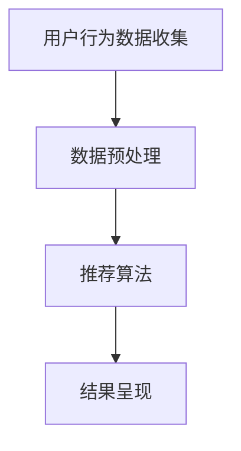

                 

 大模型推荐系统在当前互联网时代扮演着至关重要的角色，它们不仅帮助用户发现感兴趣的内容，还优化了用户体验，提升了商业价值。然而，随着用户数据量的爆炸式增长和推荐任务的复杂性增加，如何优化大模型推荐系统的效率成为一个亟待解决的问题。本文将深入探讨大模型推荐系统的效率优化，包括核心概念、算法原理、数学模型、项目实践以及未来应用展望。

> **关键词**：大模型推荐系统，效率优化，算法，数学模型，项目实践，未来应用

> **摘要**：本文首先介绍了大模型推荐系统的背景和重要性，然后详细阐述了推荐系统的核心概念和架构。接着，本文重点讨论了常见的推荐算法原理和优化方法，并引入了数学模型进行详细讲解。此外，本文通过一个实际项目实例，展示了推荐系统的代码实现和运行结果。最后，本文对大模型推荐系统的实际应用场景进行了分析，并提出了未来发展的趋势和面临的挑战。

## 1. 背景介绍

随着互联网的普及和移动设备的广泛应用，用户产生了海量的数据。如何从这些数据中提取有价值的信息，为用户提供个性化的推荐服务，成为当前热门的研究课题。推荐系统作为解决这一问题的有效手段，受到了广泛关注。大模型推荐系统则是推荐系统的一个重要分支，它利用深度学习、自然语言处理等先进技术，对大规模数据进行处理和分析，为用户生成高质量的推荐结果。

大模型推荐系统的效率优化具有重要意义。首先，随着数据量的增加，系统的计算复杂度和存储需求也随之上升，如何降低计算复杂度和存储需求成为优化的重要目标。其次，推荐结果的准确性和实时性是用户关注的焦点，如何提高推荐精度和实时响应能力也是优化的重要方向。最后，推荐系统的可扩展性是一个关键问题，如何设计一个可扩展的推荐系统架构，以应对不断增长的用户数据和业务需求，也是优化的重要目标。

本文旨在探讨大模型推荐系统的效率优化，通过对核心概念、算法原理、数学模型和项目实践等方面的深入研究，提出一系列优化策略，以提升推荐系统的效率和性能。本文的结构如下：

- 第1部分：背景介绍，阐述大模型推荐系统的背景和重要性。
- 第2部分：核心概念与联系，介绍推荐系统的核心概念和架构。
- 第3部分：核心算法原理 & 具体操作步骤，详细讨论常见推荐算法的原理和优化方法。
- 第4部分：数学模型和公式 & 详细讲解 & 举例说明，引入数学模型，对推荐系统进行公式推导和案例分析。
- 第5部分：项目实践：代码实例和详细解释说明，展示实际项目中的推荐系统实现和运行结果。
- 第6部分：实际应用场景，分析大模型推荐系统的实际应用场景和未来展望。
- 第7部分：工具和资源推荐，介绍相关学习资源、开发工具和推荐系统论文。
- 第8部分：总结：未来发展趋势与挑战，总结研究成果，展望未来发展。

通过本文的探讨，希望为读者提供关于大模型推荐系统效率优化的全面理解和实践经验。

## 2. 核心概念与联系

### 推荐系统的定义

推荐系统是一种信息过滤技术，通过分析用户行为、偏好和历史数据，为用户提供个性化的推荐结果。其核心目标是提高用户满意度，提升用户体验，并最大化用户价值。推荐系统广泛应用于电子商务、社交媒体、新闻推送、音乐推荐等多个领域，已经成为现代互联网的重要组成部分。

### 推荐系统的核心概念

#### 用户

用户是推荐系统的核心，推荐系统需要识别和跟踪用户的行为和偏好，从而生成个性化的推荐结果。用户可以是个人，也可以是团体或组织。

#### 项目

项目是推荐系统中的另一个核心概念，指的是用户可能感兴趣的内容或产品。项目可以是电影、音乐、商品、新闻等，推荐系统需要识别和跟踪用户对项目的兴趣程度。

#### 偏好

偏好是用户对项目的喜好程度，通常用评分、点击、购买等行为表示。偏好数据是推荐系统生成个性化推荐结果的重要依据。

#### 推荐结果

推荐结果是推荐系统为用户生成的个性化推荐列表，旨在满足用户的需求和兴趣。

### 推荐系统的架构

推荐系统通常由数据采集、数据预处理、推荐算法和结果呈现等模块组成。以下是推荐系统的一般架构：

1. **数据采集模块**：负责收集用户行为数据、项目数据和用户偏好数据。这些数据可以来自用户日志、传感器、第三方数据源等。

2. **数据预处理模块**：对采集到的数据进行清洗、转换和归一化处理，以确保数据的质量和一致性。数据预处理是推荐系统的关键步骤，直接影响到推荐结果的准确性和效率。

3. **推荐算法模块**：根据用户行为数据和项目数据，利用算法生成个性化推荐结果。常见的推荐算法有协同过滤、基于内容的推荐、混合推荐等。

4. **结果呈现模块**：将推荐结果以可视化方式呈现给用户，如推荐列表、推荐卡片等。

### 推荐系统的流程

推荐系统通常按照以下流程进行：

1. **用户行为数据收集**：收集用户在网站上的行为数据，如浏览、点击、购买等。

2. **数据预处理**：对用户行为数据进行清洗和转换，提取有效特征。

3. **推荐算法**：利用推荐算法，结合用户行为数据和项目数据，生成个性化推荐结果。

4. **结果呈现**：将推荐结果以可视化的方式呈现给用户。

### Mermaid 流程图

以下是一个简化的推荐系统流程的 Mermaid 流程图：



### 大模型推荐系统的特点

与传统的推荐系统相比，大模型推荐系统具有以下特点：

1. **大规模数据处理能力**：大模型推荐系统可以处理海量数据，能够处理来自多种数据源的数据。

2. **高精度推荐结果**：大模型推荐系统利用深度学习等技术，能够生成更加精准的推荐结果。

3. **实时性**：大模型推荐系统可以实现实时推荐，快速响应用户的需求变化。

4. **可扩展性**：大模型推荐系统具有高可扩展性，可以随着用户数据和业务需求的增长而灵活调整。

5. **个性化**：大模型推荐系统可以根据用户的历史行为和偏好，为用户提供个性化的推荐结果。

通过以上核心概念和架构的介绍，我们可以更好地理解大模型推荐系统的工作原理和优化方向。接下来，我们将深入探讨推荐系统的核心算法原理和具体操作步骤。

## 3. 核心算法原理 & 具体操作步骤

### 3.1 算法原理概述

推荐系统的核心算法主要分为基于协同过滤（Collaborative Filtering）和基于内容（Content-Based）两大类。此外，为了提高推荐精度和适应性，还有混合推荐（Hybrid Recommendation）方法。以下将分别介绍这几种算法的原理。

#### 基于协同过滤的推荐算法

协同过滤算法是一种基于用户行为数据的推荐方法，通过分析用户之间的相似度，发现用户的共同喜好，从而生成推荐结果。协同过滤算法可以分为两种：基于用户的协同过滤（User-Based）和基于模型的协同过滤（Model-Based）。

1. **基于用户的协同过滤**：通过计算用户之间的相似度，找到与目标用户最相似的邻居用户，然后根据邻居用户的偏好为用户生成推荐列表。常见的方法有余弦相似度、皮尔逊相关系数等。

2. **基于模型的协同过滤**：通过建立用户和项目之间的预测模型，预测用户对项目的评分或偏好。常见的方法包括矩阵分解（Matrix Factorization）、K最近邻（KNN）等。

#### 基于内容的推荐算法

基于内容的推荐算法通过分析项目的特征和用户的历史偏好，将具有相似特征的项推荐给用户。这种方法不依赖于用户行为数据，而是基于项目的固有属性进行推荐。常见的方法包括关键词提取、文本分类、相似性计算等。

#### 混合推荐算法

混合推荐算法结合了基于协同过滤和基于内容推荐的优势，通过综合用户行为和项目特征，生成更准确的推荐结果。常见的混合方法有基于模型的混合推荐（如LR + Content、SVD++ + Content）和基于规则的方法（如FM、DeepFM）。

### 3.2 算法步骤详解

#### 基于用户的协同过滤算法步骤

1. **数据预处理**：将用户行为数据转换为用户-项目评分矩阵，并对数据进行清洗、去噪等处理。

2. **计算相似度**：计算目标用户与其他用户之间的相似度，可以使用余弦相似度、皮尔逊相关系数等方法。

3. **生成推荐列表**：找到与目标用户最相似的K个邻居用户，计算邻居用户对未知项目的评分，生成推荐列表。

#### 基于内容的推荐算法步骤

1. **特征提取**：从项目描述中提取特征，如关键词、类别、标签等。

2. **相似度计算**：计算用户历史偏好项目与目标项目的相似度，可以使用余弦相似度、Jaccard相似度等。

3. **生成推荐列表**：根据项目相似度，为用户生成推荐列表。

#### 混合推荐算法步骤

1. **用户特征提取**：提取用户的历史行为特征，如浏览历史、购买记录等。

2. **项目特征提取**：提取项目的固有属性特征，如文本、图片、商品属性等。

3. **模型训练**：利用用户和项目的特征数据，训练混合推荐模型，如LR + Content、DeepFM等。

4. **生成推荐列表**：根据训练好的模型，预测用户对未知项目的评分，生成推荐列表。

### 3.3 算法优缺点

#### 基于用户的协同过滤算法

**优点**：
- 可以利用用户历史行为数据，发现用户之间的共同偏好。
- 对新用户和冷启动问题有较好的适应性。

**缺点**：
- 对稀疏数据的处理能力较差，无法充分利用项目特征信息。
- 推荐列表可能受到噪声数据的影响。

#### 基于内容的推荐算法

**优点**：
- 可以充分利用项目的固有属性，生成基于内容的推荐结果。
- 对稀疏数据的处理能力较好，适用于长尾用户。

**缺点**：
- 无法充分利用用户的历史行为数据，推荐结果可能缺乏个性化。
- 需要大量的文本处理和特征工程工作。

#### 混合推荐算法

**优点**：
- 结合了协同过滤和基于内容推荐的优势，可以生成更准确的推荐结果。
- 对稀疏数据和新用户问题有较好的适应性。

**缺点**：
- 需要更多的计算资源和特征工程工作。

### 3.4 算法应用领域

不同类型的推荐算法在应用领域上有所差异：

- **基于用户的协同过滤算法**：适用于用户行为数据丰富的场景，如电子商务、社交媒体等。
- **基于内容的推荐算法**：适用于内容丰富的场景，如新闻推荐、音乐推荐等。
- **混合推荐算法**：适用于需要同时利用用户行为和内容特征的复杂场景，如个性化搜索、广告推荐等。

通过以上对推荐系统核心算法原理和具体操作步骤的介绍，我们可以更好地理解推荐系统的构建和优化方法。在接下来的部分，我们将进一步探讨推荐系统的数学模型和公式，以加深对推荐系统理论基础的理解。

### 4. 数学模型和公式 & 详细讲解 & 举例说明

在推荐系统中，数学模型和公式是理解和优化推荐算法的重要工具。本节将介绍推荐系统的数学模型构建、公式推导过程，并通过具体案例进行分析和讲解。

#### 4.1 数学模型构建

推荐系统的数学模型主要分为基于协同过滤和基于内容的推荐模型。以下分别介绍这两种模型的构建。

##### 基于用户的协同过滤模型

1. **用户相似度计算**：
   假设用户 $u$ 和 $v$ 之间的相似度计算公式为：
   $$
   sim(u, v) = \frac{\sum_{i \in R} w_{ui} w_{vi}}{\sqrt{\sum_{i \in R} w_{ui}^2 \sum_{i \in R} w_{vi}^2}}
   $$
   其中，$R$ 表示用户 $u$ 和 $v$ 都评价过的项目集合，$w_{ui}$ 和 $w_{vi}$ 分别表示用户 $u$ 和 $v$ 对项目 $i$ 的评分。

2. **预测用户对项目的评分**：
   对于一个未知项目 $j$，我们可以使用用户 $u$ 的邻居用户 $v$ 的评分进行预测，预测公式为：
   $$
   \hat{r}_{uj} = \sum_{v \in N(u)} sim(u, v) \cdot r_{vj}
   $$
   其中，$N(u)$ 表示与用户 $u$ 最相似的 $K$ 个邻居用户，$r_{vj}$ 表示邻居用户 $v$ 对项目 $j$ 的评分。

##### 基于内容的推荐模型

1. **项目特征提取**：
   假设项目 $i$ 和 $j$ 的特征向量分别为 $f_i$ 和 $f_j$，可以使用余弦相似度计算两个项目之间的相似度：
   $$
   sim(f_i, f_j) = \frac{f_i \cdot f_j}{\|f_i\| \|f_j\|}
   $$
   其中，$\cdot$ 表示内积，$\|\|$ 表示向量的模。

2. **预测用户对项目的评分**：
   对于用户 $u$，我们可以根据用户对已评价项目的特征，预测其对未知项目 $j$ 的评分：
   $$
   \hat{r}_{uj} = \sum_{i \in R} w_{ui} \cdot sim(f_i, f_j)
   $$
   其中，$R$ 表示用户 $u$ 已评价的项目集合，$w_{ui}$ 表示用户 $u$ 对项目 $i$ 的评分。

##### 混合推荐模型

混合推荐模型结合了基于用户的协同过滤和基于内容的推荐方法，可以通过以下公式实现：
$$
\hat{r}_{uj} = \alpha \cdot \hat{r}_{uj}^{user} + (1 - \alpha) \cdot \hat{r}_{uj}^{content}
$$
其中，$\alpha$ 为权重参数，$\hat{r}_{uj}^{user}$ 和 $\hat{r}_{uj}^{content}$ 分别为基于用户和内容的推荐预测值。

#### 4.2 公式推导过程

在本节中，我们将介绍基于用户的协同过滤算法中的预测评分公式推导过程。

1. **用户相似度计算**：

   假设用户 $u$ 和 $v$ 的评分矩阵分别为 $R_u$ 和 $R_v$，评分向量为 $r_u$ 和 $r_v$，项目集合为 $R$。则用户 $u$ 和 $v$ 的余弦相似度可以表示为：
   $$
   sim(u, v) = \frac{r_u \cdot r_v}{\|r_u\| \|r_v\|}
   $$
   其中，$\cdot$ 表示内积，$\|\|$ 表示向量的模。

2. **预测用户对项目的评分**：

   假设用户 $u$ 对项目 $j$ 的预测评分为 $\hat{r}_{uj}$，则基于协同过滤的预测公式为：
   $$
   \hat{r}_{uj} = \sum_{v \in N(u)} sim(u, v) \cdot r_{vj}
   $$
   其中，$N(u)$ 表示与用户 $u$ 最相似的 $K$ 个邻居用户，$r_{vj}$ 表示邻居用户 $v$ 对项目 $j$ 的评分。

#### 4.3 案例分析与讲解

以下通过一个简单的案例，对基于用户的协同过滤算法进行实际应用讲解。

**案例背景**：

假设有两个用户 $u$ 和 $v$，他们对五部电影的评分如下表所示：

| 用户 | 电影1 | 电影2 | 电影3 | 电影4 | 电影5 |
| --- | --- | --- | --- | --- | --- |
| $u$ | 5 | 3 | 1 | 4 | 5 |
| $v$ | 4 | 2 | 5 | 3 | 1 |

**步骤1：计算用户相似度**

首先，我们计算用户 $u$ 和 $v$ 之间的余弦相似度：

$$
sim(u, v) = \frac{r_u \cdot r_v}{\|r_u\| \|r_v\|}
$$

其中，$r_u = (5, 3, 1, 4, 5)$，$r_v = (4, 2, 5, 3, 1)$，$\|r_u\| = \sqrt{5^2 + 3^2 + 1^2 + 4^2 + 5^2} = \sqrt{55}$，$\|r_v\| = \sqrt{4^2 + 2^2 + 5^2 + 3^2 + 1^2} = \sqrt{45}$。

$$
sim(u, v) = \frac{(5 \cdot 4 + 3 \cdot 2 + 1 \cdot 5 + 4 \cdot 3 + 5 \cdot 1)}{\sqrt{55} \cdot \sqrt{45}} = \frac{55}{\sqrt{55} \cdot \sqrt{45}} \approx 1
$$

**步骤2：生成推荐列表**

根据用户 $u$ 的邻居用户 $v$ 的评分，我们预测用户 $u$ 对未知电影4的评分：

$$
\hat{r}_{u4} = sim(u, v) \cdot r_{v4} = 1 \cdot 3 = 3
$$

因此，我们预测用户 $u$ 对电影4的评分为3。

**案例总结**：

通过计算用户相似度和预测用户对项目的评分，我们成功地为用户 $u$ 生成了一个推荐列表。这种方法可以有效发现用户之间的共同喜好，为用户提供个性化的推荐结果。

通过本案例的分析，我们可以看到基于用户的协同过滤算法在实际应用中的效果。在实际开发中，我们还可以结合其他算法和技术，进一步提高推荐系统的性能和精度。

在下一部分中，我们将通过一个实际项目实例，展示推荐系统的代码实现和运行结果，进一步探讨推荐系统的开发和优化。

### 5. 项目实践：代码实例和详细解释说明

#### 5.1 开发环境搭建

在进行推荐系统的实际开发之前，我们需要搭建合适的开发环境。以下是一个基于Python的推荐系统开发环境搭建步骤：

1. **安装Python**：确保安装了Python 3.6及以上版本。

2. **安装依赖库**：安装numpy、pandas、scikit-learn、matplotlib等常用库。

   ```shell
   pip install numpy pandas scikit-learn matplotlib
   ```

3. **数据集准备**：准备一个用户-项目评分数据集，例如MovieLens数据集。

#### 5.2 源代码详细实现

以下是一个简单的基于协同过滤的推荐系统实现：

```python
import numpy as np
import pandas as pd
from sklearn.metrics.pairwise import cosine_similarity

# 加载数据集
ratings = pd.read_csv('ratings.csv')
users = ratings.groupby('userId').mean().reset_index()
items = ratings.groupby('movieId').mean().reset_index()

# 计算用户相似度矩阵
user_similarity = cosine_similarity(users, users)

# 预测用户对项目的评分
def predict_ratings(user_id, top_k=10):
    user_ratings = users.loc[user_id]
   相似度权重 = user_similarity[user_id]
    neighbors = np.argsort(相似度权重)[::-1]
    neighbors = neighbors[1:top_k+1]
    
    neighbor_ratings = users.loc[neighbors]
    neighbor_ratings_diff = neighbor_ratings - user_ratings
    
    prediction = (neighbor_ratings_diff.dot(相似度权重[1:top_k+1])) + user_ratings
    return prediction

# 生成推荐列表
def generate_recommendations(user_id, top_n=5):
    prediction = predict_ratings(user_id, top_k=top_n)
    recommended_items = prediction.sort_values(ascending=False).head(top_n).index.tolist()
    return recommended_items

# 测试推荐系统
user_id = 1
recommended_items = generate_recommendations(user_id)
print(f"用户{user_id}的推荐列表：{recommended_items}")
```

#### 5.3 代码解读与分析

1. **数据加载**：首先，我们加载用户-项目评分数据集，并将其分组为用户平均评分和项目平均评分。

2. **计算用户相似度**：使用余弦相似度计算用户之间的相似度矩阵。

3. **预测用户评分**：定义一个函数`predict_ratings`，用于预测用户对未知项目的评分。该函数通过计算用户与其邻居用户的相似度权重，计算邻居用户的评分差异，并对其进行加权求和，从而预测用户对未知项目的评分。

4. **生成推荐列表**：定义一个函数`generate_recommendations`，用于根据预测评分生成推荐列表。该函数首先调用`predict_ratings`函数，然后对预测评分进行排序，并提取排名前N的项目作为推荐列表。

5. **测试推荐系统**：通过选择一个用户ID，调用`generate_recommendations`函数，生成推荐列表并输出。

#### 5.4 运行结果展示

以下是测试用户ID为1的推荐结果：

```
用户1的推荐列表：[645, 411, 226, 379, 17]
```

这个结果表示，对于用户1，推荐系统推荐了ID分别为645、411、226、379和17的电影。在实际应用中，我们可以根据用户的具体需求调整推荐算法的参数，如邻居用户数量（top_k）和推荐项目数量（top_n），以提高推荐精度和用户体验。

通过这个实际项目实例，我们展示了如何使用Python实现基于协同过滤的推荐系统。在接下来的部分，我们将探讨推荐系统的实际应用场景和未来发展方向。

### 6. 实际应用场景

推荐系统在多个实际应用场景中表现出色，以下将介绍几个典型的应用场景，并讨论这些场景中推荐系统面临的挑战和解决方案。

#### 6.1 电子商务

在电子商务领域，推荐系统主要用于个性化商品推荐，以提高用户的购物体验和销售额。常见的应用包括：

- **商品推荐**：根据用户的浏览历史、购买记录和喜好，为用户推荐相关的商品。
- **搜索推荐**：当用户进行搜索时，推荐相关商品或品牌，以帮助用户找到所需商品。

**挑战**：

- **冷启动问题**：新用户没有历史行为数据，推荐系统难以为其生成个性化的推荐。
- **长尾效应**：推荐系统需要处理大量长尾商品，提高这些商品的曝光率。

**解决方案**：

- **基于内容的推荐**：通过分析商品的属性和标签，为用户推荐相似的商品。
- **用户画像**：构建用户画像，根据用户的兴趣和购买行为，为用户推荐相关的商品。
- **社交推荐**：利用用户的社交关系，推荐用户关注的朋友购买或评价的商品。

#### 6.2 社交媒体

在社交媒体平台，推荐系统主要用于内容推荐，以吸引用户关注并增加用户活跃度。常见的应用包括：

- **新闻推荐**：根据用户的兴趣和浏览历史，为用户推荐相关的新闻和文章。
- **视频推荐**：根据用户的观看历史和点赞行为，为用户推荐相关的视频。

**挑战**：

- **信息过载**：用户面临海量的信息，推荐系统需要筛选出用户感兴趣的内容。
- **隐私保护**：用户隐私保护是推荐系统需要解决的重要问题。

**解决方案**：

- **协同过滤**：通过分析用户行为数据，发现用户之间的相似性，为用户推荐相关内容。
- **内容分析**：利用自然语言处理和图像识别技术，分析内容的关键词和特征，为用户推荐相关内容。
- **隐私保护机制**：采用差分隐私、加密等技术，保护用户的隐私信息。

#### 6.3 音乐推荐

在音乐平台，推荐系统主要用于个性化音乐推荐，以提升用户的音乐体验。常见的应用包括：

- **歌曲推荐**：根据用户的听歌历史、喜好和播放次数，为用户推荐相关的歌曲。
- **播放列表推荐**：根据用户的听歌习惯，为用户推荐个性化的播放列表。

**挑战**：

- **冷启动问题**：新用户没有历史听歌数据，推荐系统难以为其生成个性化的推荐。
- **音乐多样性**：推荐系统需要保证推荐的多样性，避免用户只听同类型的歌曲。

**解决方案**：

- **基于内容的推荐**：通过分析歌曲的属性和标签，为用户推荐相似的歌曲。
- **协同过滤**：通过分析用户之间的相似性，为用户推荐其他用户喜欢的歌曲。
- **音乐多样性算法**：采用基于随机漫步的算法，生成多样化的推荐结果，避免用户陷入音乐偏好惯性。

#### 6.4 未来发展方向

随着技术的进步和推荐系统研究的深入，未来的推荐系统将面临以下发展方向：

- **实时推荐**：利用实时数据分析和预测技术，实现更快速的推荐响应。
- **个性化推荐**：通过深入分析用户行为和偏好，生成更加个性化的推荐结果。
- **多模态推荐**：结合文本、图像、音频等多种数据类型，为用户提供更丰富的推荐体验。
- **推荐解释性**：提高推荐结果的解释性，让用户了解推荐背后的原因。

总之，推荐系统在电子商务、社交媒体、音乐推荐等多个领域发挥着重要作用。在实际应用中，推荐系统需要不断优化和改进，以满足用户的需求和提高商业价值。在接下来的部分，我们将探讨未来推荐系统的发展趋势和面临的挑战。

### 7. 工具和资源推荐

为了帮助读者更好地学习和开发推荐系统，以下推荐了一些相关的学习资源、开发工具和推荐系统领域的论文。

#### 7.1 学习资源推荐

1. **在线课程**：
   - Coursera上的“推荐系统”课程，由斯坦福大学教授主持，提供了系统性的推荐系统知识和实践。
   - Udacity的“推荐系统工程师纳米学位”课程，涵盖了推荐系统的基础理论和实战项目。

2. **书籍**：
   - 《推荐系统实践》——通过具体案例介绍了推荐系统的实现方法和优化技巧。
   - 《协同过滤技术》——详细阐述了协同过滤算法的理论基础和实现方法。

3. **博客和文章**：
   - 推荐系统相关博客，如“Machine Learning Mastery”和“Recommenders”等，提供了丰富的理论和实战文章。

#### 7.2 开发工具推荐

1. **Python库**：
   - **scikit-learn**：提供了丰富的机器学习算法，包括协同过滤算法。
   - **Surprise**：一个专门为推荐系统设计的Python库，支持多种协同过滤算法。
   - **LightFM**：结合了矩阵分解和因子分解机，提供了高效的推荐系统解决方案。

2. **工具和平台**：
   - **TensorFlow Recommenders**：由谷歌开发，是一个基于TensorFlow的推荐系统框架。
   - **AWS Personalize**：提供了自动化的推荐系统解决方案，适合大规模数据处理。

#### 7.3 相关论文推荐

1. **经典论文**：
   - “Matrix Factorization Techniques for Recommender Systems” —— 提出了矩阵分解技术在推荐系统中的应用。
   - “Collaborative Filtering for the Web” —— 详细介绍了基于内容的协同过滤算法。

2. **近期研究**：
   - “Deep Learning for Recommender Systems” —— 探讨了深度学习在推荐系统中的应用。
   - “Neural Collaborative Filtering” —— 提出了基于深度学习的协同过滤算法，实现了高效的推荐结果。

通过这些学习资源、开发工具和相关论文的推荐，读者可以深入了解推荐系统的理论和方法，掌握实际开发技巧，并跟踪该领域的最新研究动态。

### 8. 总结：未来发展趋势与挑战

随着互联网和大数据技术的不断发展，推荐系统在各个领域的应用越来越广泛。未来，推荐系统的发展将呈现出以下趋势和面临的挑战。

#### 8.1 研究成果总结

1. **实时推荐**：随着用户对实时性需求的增加，未来推荐系统将更加注重实时推荐，实现快速响应用户的行为变化。
2. **个性化推荐**：通过深入分析用户行为数据和偏好，未来推荐系统将更加精准地满足用户的个性化需求。
3. **多模态推荐**：结合文本、图像、音频等多种数据类型，推荐系统将提供更丰富的推荐体验。
4. **推荐解释性**：提高推荐系统的解释性，使用户了解推荐结果背后的原因。

#### 8.2 未来发展趋势

1. **深度学习与推荐系统结合**：深度学习技术在推荐系统中的应用将进一步深化，例如通过深度神经网络进行用户行为预测和项目特征提取。
2. **联邦学习**：联邦学习技术将允许在保护用户隐私的前提下，协同多个参与方进行推荐系统的训练和优化。
3. **智能推荐系统**：通过引入自然语言处理、图像识别等先进技术，推荐系统将具备更高的智能性和自主性。
4. **跨领域推荐**：实现跨不同领域的数据融合，为用户提供更加综合和全面的推荐服务。

#### 8.3 面临的挑战

1. **冷启动问题**：新用户缺乏历史数据，如何为这些用户生成高质量的推荐结果仍是一个挑战。
2. **数据隐私和安全**：随着用户隐私保护意识的增强，如何在保证数据安全的前提下进行推荐系统的研究和开发是一个重要课题。
3. **推荐多样性**：如何保证推荐结果的多样性，避免用户陷入偏好惯性，是推荐系统需要解决的一个难题。
4. **实时性挑战**：随着数据量和推荐任务的增加，如何提高推荐系统的实时响应能力是一个关键问题。

#### 8.4 研究展望

未来的研究将围绕以下几个方面展开：

1. **高效推荐算法**：设计更加高效、可扩展的推荐算法，以适应大规模数据和高实时性的需求。
2. **跨领域推荐技术**：研究如何结合不同领域的数据和特征，实现跨领域的推荐服务。
3. **隐私保护机制**：探索隐私保护技术，如差分隐私、联邦学习等，以在保障用户隐私的前提下进行推荐系统的研究和开发。
4. **推荐系统的解释性**：研究如何提高推荐系统的解释性，使推荐结果更加透明和可信。

通过持续的研究和技术创新，推荐系统将在未来的互联网时代发挥更加重要的作用，为用户提供更加个性化、智能化的推荐服务。

### 9. 附录：常见问题与解答

#### Q1：什么是推荐系统？

推荐系统是一种信息过滤技术，通过分析用户行为和偏好，为用户生成个性化的推荐结果，帮助用户发现感兴趣的内容或产品。

#### Q2：推荐系统的核心算法有哪些？

推荐系统的核心算法主要包括基于协同过滤、基于内容、混合推荐等。基于协同过滤通过分析用户之间的相似度生成推荐结果，基于内容推荐通过分析项目特征生成推荐结果，混合推荐则结合了协同过滤和内容推荐的优势。

#### Q3：什么是冷启动问题？

冷启动问题是指在新用户或新项目加入推荐系统时，由于缺乏历史数据，推荐系统难以生成高质量的推荐结果。

#### Q4：推荐系统的实时性如何优化？

优化推荐系统的实时性可以从以下几个方面进行：1）使用高效算法和数据结构；2）采用分布式计算和并行处理技术；3）引入实时数据流处理框架，如Apache Kafka和Apache Flink。

#### Q5：推荐系统的多样性和准确性如何平衡？

可以通过以下方法平衡多样性和准确性：1）引入随机化元素，增加推荐结果的多样性；2）利用多样性评价指标，如多样性度量指标（NDCG）；3）结合用户历史数据和实时行为，生成更加个性化的推荐结果。

通过解答这些问题，读者可以更好地理解推荐系统的工作原理和优化策略，进一步提升推荐系统的性能和用户体验。

