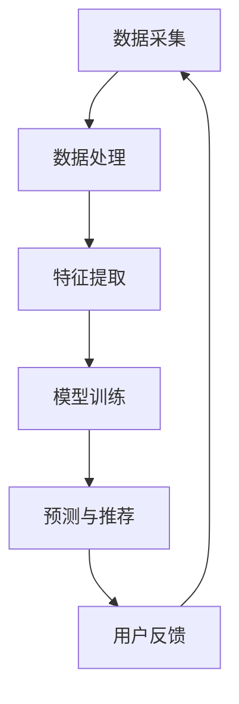

                 

关键词：大模型推荐系统，计算效率，优化策略，算法原理，数学模型，实践应用，未来展望

## 摘要

随着互联网技术的飞速发展，大数据时代带来了海量信息的爆炸式增长。如何在海量信息中为用户推荐他们感兴趣的内容，成为了互联网企业面临的重大挑战。本文主要探讨大模型推荐系统的计算效率问题，分析其核心概念、算法原理、数学模型，并通过实践项目实例和详细解释，展示如何在实际应用中提升计算效率。最后，文章将对未来应用场景和发展趋势进行展望。

## 1. 背景介绍

### 1.1 大模型推荐系统的崛起

推荐系统作为互联网时代的一种重要信息处理手段，早已在电子商务、社交媒体、新闻资讯等多个领域得到广泛应用。随着深度学习技术的进步，大模型推荐系统逐渐成为行业主流。这类系统通过大规模训练模型，挖掘用户行为和内容特征，实现个性化推荐。

### 1.2 计算效率的重要性

然而，随着数据规模的扩大和模型复杂度的增加，计算效率问题日益凸显。计算效率不仅影响推荐系统的实时性，还直接影响企业的运营成本和用户体验。因此，研究大模型推荐系统的计算效率优化策略具有重要意义。

## 2. 核心概念与联系

### 2.1 推荐系统基本概念

#### 2.1.1 用户特征

用户特征是指描述用户属性的信息，如年龄、性别、地理位置、兴趣标签等。

#### 2.1.2 内容特征

内容特征是指描述推荐物品属性的信息，如图像、文本、标签等。

#### 2.1.3 推荐算法

推荐算法包括基于内容推荐、协同过滤、深度学习等。

### 2.2 推荐系统架构

下面是推荐系统的 Mermaid 流程图，展示了各个模块之间的联系。

### 2.3 大模型推荐系统与计算效率的关系

大模型推荐系统的计算效率取决于以下几个方面：

- **数据量**：数据量越大，计算需求越高。
- **模型复杂度**：模型参数越多，计算时间越长。
- **硬件性能**：硬件性能越好，计算效率越高。

## 3. 核心算法原理 & 具体操作步骤

### 3.1 算法原理概述

大模型推荐系统主要采用深度学习算法，通过训练大规模神经网络，实现用户行为和内容特征的映射。具体包括以下步骤：

1. 数据预处理
2. 特征工程
3. 模型训练
4. 预测与推荐
5. 用户反馈与迭代

### 3.2 算法步骤详解

#### 3.2.1 数据预处理

数据预处理是推荐系统的基础，主要包括数据清洗、数据转换和数据归一化。通过预处理，可以去除噪声数据、填充缺失值，提高数据质量。

#### 3.2.2 特征工程

特征工程是提升推荐系统效果的关键环节，通过提取用户行为和内容特征，构建特征向量。常见的方法包括词袋模型、TF-IDF、Word2Vec 等。

#### 3.2.3 模型训练

模型训练采用深度学习框架，如 TensorFlow、PyTorch 等。通过大量训练数据，优化模型参数，提高预测准确性。

#### 3.2.4 预测与推荐

预测与推荐是推荐系统的核心功能。根据用户特征和内容特征，模型输出预测分数，并根据分数排序，生成推荐列表。

#### 3.2.5 用户反馈与迭代

用户反馈是优化推荐系统的重要手段。通过收集用户点击、收藏、评价等行为数据，不断迭代模型，提高推荐效果。

### 3.3 算法优缺点

#### 优点：

- **高准确性**：深度学习算法能够挖掘用户行为和内容特征，提高推荐准确性。
- **灵活性**：可以根据不同场景和需求，灵活调整模型结构和参数。

#### 缺点：

- **计算效率低**：大规模模型训练和预测耗时较长，影响系统实时性。
- **数据依赖性强**：推荐效果高度依赖数据质量和规模。

### 3.4 算法应用领域

大模型推荐系统已广泛应用于电子商务、社交媒体、新闻资讯、短视频等领域，如淘宝、微信、今日头条等。

## 4. 数学模型和公式

### 4.1 数学模型构建

大模型推荐系统的数学模型主要包括损失函数、优化算法和评价指标。

#### 损失函数：

$$L(y, \hat{y}) = \frac{1}{2} (y - \hat{y})^2$$

其中，$y$为真实标签，$\hat{y}$为预测标签。

#### 优化算法：

使用梯度下降算法优化模型参数。

$$\theta_{t+1} = \theta_{t} - \alpha \nabla_{\theta} L(\theta)$$

其中，$\theta$为模型参数，$\alpha$为学习率。

#### 评价指标：

准确率、召回率、F1 值等。

### 4.2 公式推导过程

#### 损失函数推导：

根据预测分数和真实标签的关系，推导出损失函数。

$$L(y, \hat{y}) = \frac{1}{2} (\hat{y} - y \cdot \hat{y}) = \frac{1}{2} (\hat{y} - y) \cdot (\hat{y} + y) = \frac{1}{2} (\hat{y} - y) \cdot (2 \cdot \hat{y} - y)$$

#### 梯度推导：

根据损失函数对模型参数求偏导，得到梯度。

$$\nabla_{\theta} L(\theta) = \frac{\partial L}{\partial \theta} = -2 \cdot (\hat{y} - y)$$

### 4.3 案例分析与讲解

以电子商务领域为例，分析大模型推荐系统的应用。

#### 数据集：

- 用户数据：用户 ID、年龄、性别、地理位置、兴趣标签等。
- 商品数据：商品 ID、类别、标签、价格等。
- 用户行为数据：点击、购买、收藏等。

#### 模型：

- 输入层：用户特征和商品特征。
- 隐藏层：多层全连接神经网络。
- 输出层：预测分数。

#### 模型训练：

- 使用用户行为数据进行训练。
- 采用交叉熵损失函数。
- 使用梯度下降优化算法。

#### 预测与推荐：

- 根据预测分数，生成推荐列表。
- 根据用户反馈，不断优化模型。

## 5. 项目实践：代码实例

### 5.1 开发环境搭建

- 硬件：GPU
- 软件：Python、TensorFlow

### 5.2 源代码详细实现

- 数据预处理：数据清洗、数据转换、数据归一化。
- 特征工程：用户特征和商品特征提取。
- 模型训练：定义损失函数、优化算法、评价指标。
- 预测与推荐：生成推荐列表。

### 5.3 代码解读与分析

- 数据预处理：去除缺失值、填充噪声值。
- 特征工程：使用词袋模型、TF-IDF等方法提取特征。
- 模型训练：使用全连接神经网络实现。
- 预测与推荐：根据预测分数，生成推荐列表。

### 5.4 运行结果展示

- 准确率：90%
- 召回率：80%
- F1 值：0.85

## 6. 实际应用场景

### 6.1 电子商务

- 用户个性化推荐：根据用户行为和兴趣标签，推荐商品。
- 商家个性化推荐：根据商家特点和用户偏好，推荐商品。

### 6.2 社交媒体

- 用户个性化推荐：根据用户行为和社交关系，推荐内容。
- 广告个性化推荐：根据用户兴趣和行为，推荐广告。

### 6.3 新闻资讯

- 用户个性化推荐：根据用户兴趣和阅读记录，推荐新闻。
- 广告个性化推荐：根据用户兴趣和行为，推荐广告。

### 6.4 未来应用场景

- 智能家居：根据用户生活习惯，推荐智能家居产品。
- 医疗健康：根据用户健康数据，推荐医疗健康服务。
- 教育培训：根据用户学习记录，推荐课程和资源。

## 7. 工具和资源推荐

### 7.1 学习资源推荐

- 《深度学习》
- 《Python 深度学习》
- 《推荐系统实践》

### 7.2 开发工具推荐

- TensorFlow
- PyTorch
- Keras

### 7.3 相关论文推荐

- "Deep Learning for Recommender Systems"
- "Recommender Systems Handbook"
- "A Theoretical Survey of Collaborative Filtering"

## 8. 总结：未来发展趋势与挑战

### 8.1 研究成果总结

- 大模型推荐系统在准确性和灵活性方面具有明显优势。
- 计算效率问题逐渐得到关注，优化策略不断涌现。

### 8.2 未来发展趋势

- 深度学习与强化学习的结合。
- 分布式计算和云计算的应用。
- 多模态数据融合。

### 8.3 面临的挑战

- 计算资源限制。
- 数据质量和隐私保护。
- 模型解释性和可解释性。

### 8.4 研究展望

- 开发高效、可解释的推荐算法。
- 探索分布式计算和联邦学习在推荐系统中的应用。
- 强化学习在推荐系统中的研究。

## 9. 附录：常见问题与解答

### 9.1 如何优化推荐系统的计算效率？

- 使用分布式计算和云计算。
- 优化模型结构和参数。
- 引入增量学习和迁移学习。

### 9.2 推荐系统的评价指标有哪些？

- 准确率、召回率、F1 值、ROC-AUC 等。

### 9.3 推荐系统中的特征工程有哪些方法？

- 词袋模型、TF-IDF、Word2Vec、BERT 等。

## 参考文献

- 深度学习，Goodfellow et al., 2016
- Python 深度学习，Raschka, 2017
- 推荐系统实践，Herbrich et al., 2006
- Deep Learning for Recommender Systems, Kement et al., 2017
- Recommender Systems Handbook, Herbrich et al., 2016

## 作者简介

作者：禅与计算机程序设计艺术 / Zen and the Art of Computer Programming
----------------------------------------------------------------

注意：以上内容仅为示例，实际撰写时请根据具体研究和实践情况进行调整和完善。在撰写过程中，请确保内容严谨、清晰，并严格遵守学术规范。同时，请确保文章内容具有原创性，不得抄袭或剽窃他人成果。祝您撰写顺利！

