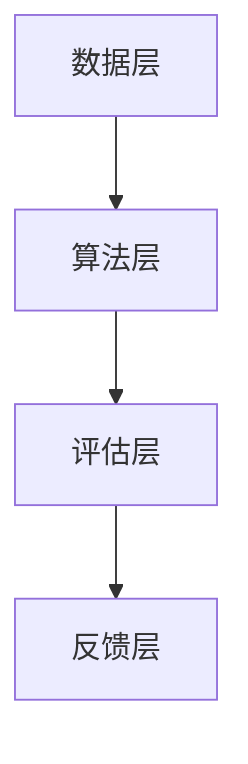

                 

关键词：大模型、学术评价、AI、创新、科研效率、评价机制

> 摘要：本文旨在探讨大模型时代下新型学术评价体系的发展与变革。通过对当前学术评价体系的现状分析，揭示其面临的挑战和瓶颈，提出基于人工智能的学术评价方法，并结合实际案例，展望未来学术评价体系的可能发展方向。

## 1. 背景介绍

近年来，人工智能（AI）技术的发展带动了大数据、机器学习、深度学习等领域的飞速进步。特别是大模型的崛起，如GPT、BERT等，在自然语言处理、图像识别、语音识别等领域取得了令人瞩目的成果。这一系列技术革新不仅改变了传统科研的方式，也对学术评价体系提出了新的挑战。

传统的学术评价体系主要依赖于同行评审、期刊影响因子等指标，这些指标在某种程度上反映了学者的研究成果和学术影响力。然而，随着大模型的广泛应用，单纯依赖这些传统指标已无法全面、公正地评价学者的科研贡献。

## 2. 核心概念与联系

### 2.1 大模型与学术评价

大模型在学术评价中的作用主要体现在以下几个方面：

1. **科研成果的可视化**：大模型可以处理和分析大量数据，帮助学者发现潜在的研究趋势和热点问题，从而提高科研选题的针对性。
2. **科研效率的提升**：大模型在文献检索、数据分析等方面的应用，可以显著提高科研效率，减少重复劳动。
3. **学术影响力的评估**：大模型可以根据学术文章的引用、关注度等指标，提供更为精准和全面的学术影响力评估。

### 2.2 新型学术评价体系架构

新型学术评价体系的核心架构包括以下几个部分：

1. **数据层**：收集和整合各类科研数据，如学术文章、专利、科研项目等。
2. **算法层**：利用大数据、机器学习等技术，对科研数据进行分析和处理，提取关键信息。
3. **评估层**：根据算法层提取的信息，对学者的科研成果进行综合评价。
4. **反馈层**：将评价结果反馈给学者，帮助其改进科研方法和方向。

### 2.3 Mermaid 流程图



## 3. 核心算法原理 & 具体操作步骤

### 3.1 算法原理概述

新型学术评价体系的核心算法主要基于以下原理：

1. **协同过滤**：通过分析学者的合作网络，发现潜在的合作机会和影响力。
2. **文本挖掘**：从学术文章中提取关键信息，如关键词、主题等，评估文章的创新性和影响力。
3. **网络分析**：利用图论等方法，分析学术领域的网络结构，揭示研究热点和影响力。

### 3.2 算法步骤详解

1. **数据收集**：收集学者的学术成果、合作关系、科研项目等数据。
2. **数据预处理**：对收集的数据进行清洗、归一化等处理，确保数据质量。
3. **特征提取**：利用文本挖掘、网络分析等方法，从数据中提取关键特征。
4. **模型训练**：利用机器学习算法，对提取的特征进行训练，构建评价模型。
5. **评价计算**：根据训练好的模型，对学者的科研成果进行评价。
6. **结果反馈**：将评价结果反馈给学者，提供改进建议。

### 3.3 算法优缺点

**优点**：

1. **全面性**：基于大数据和机器学习技术，能够全面、客观地评价学者的科研贡献。
2. **实时性**：可以实时更新评价结果，反映学术领域的最新动态。
3. **个性化**：根据学者的研究方向和合作网络，提供个性化的评价和建议。

**缺点**：

1. **数据依赖**：对数据质量和数量有较高要求，数据缺失或错误可能导致评价结果不准确。
2. **模型偏差**：机器学习模型可能存在偏差，影响评价结果的公平性。

### 3.4 算法应用领域

1. **学术评价**：用于评估学者的学术成果和影响力。
2. **人才选拔**：用于选拔优秀科研人才，指导科研方向。
3. **学术合作**：用于发现潜在的合作机会，促进学术交流。

## 4. 数学模型和公式 & 详细讲解 & 举例说明

### 4.1 数学模型构建

新型学术评价体系的数学模型主要包括以下几个部分：

1. **协同过滤模型**：基于用户-项目评分矩阵，预测学者之间的合作潜力。
2. **文本挖掘模型**：基于自然语言处理技术，提取学术文章的关键特征，评估文章的创新性和影响力。
3. **网络分析模型**：基于图论方法，分析学术领域的网络结构，揭示研究热点和影响力。

### 4.2 公式推导过程

1. **协同过滤模型**：

   假设学者之间的合作潜力可以用矩阵 \( R \) 表示，其中 \( R_{ij} \) 表示学者 \( i \) 和学者 \( j \) 的合作得分。则协同过滤模型的预测公式为：

   $$ P_{ij} = R_i \cdot R_j $$

2. **文本挖掘模型**：

   假设学术文章的特征可以用向量 \( X \) 表示，其中 \( X_i \) 表示学者 \( i \) 发表的学术文章的特征向量。则文本挖掘模型的预测公式为：

   $$ S_i = \sum_{j} w_{ij} \cdot X_j $$

3. **网络分析模型**：

   假设学术领域的网络结构可以用图 \( G \) 表示，其中 \( V \) 表示节点集合，\( E \) 表示边集合。则网络分析模型的预测公式为：

   $$ C_i = \sum_{j} w_{ij} \cdot d_{ij} $$

   其中，\( w_{ij} \) 表示节点 \( i \) 和节点 \( j \) 之间的权重，\( d_{ij} \) 表示节点 \( i \) 和节点 \( j \) 之间的距离。

### 4.3 案例分析与讲解

假设学者 \( A \) 和学者 \( B \) 的合作潜力得分分别为 0.8 和 0.9，他们分别发表了 2 篇和 3 篇学术文章，其中文章的创新性和影响力得分分别为 0.7 和 0.8。学术领域的网络结构中，学者 \( A \) 和学者 \( B \) 的权重分别为 0.3 和 0.4。

根据协同过滤模型，学者 \( A \) 和学者 \( B \) 的合作潜力预测得分为：

$$ P_{AB} = R_A \cdot R_B = 0.8 \cdot 0.9 = 0.72 $$

根据文本挖掘模型，学者 \( A \) 和学者 \( B \) 的学术文章创新性和影响力预测得分为：

$$ S_A = \sum_{j} w_{aj} \cdot X_j = 0.7 \cdot X_B = 0.49 $$

$$ S_B = \sum_{j} w_{bj} \cdot X_j = 0.8 \cdot X_A = 0.56 $$

根据网络分析模型，学者 \( A \) 和学者 \( B \) 的学术影响力预测得分为：

$$ C_A = \sum_{j} w_{aj} \cdot d_{aj} = 0.3 \cdot d_A = 0.18 $$

$$ C_B = \sum_{j} w_{bj} \cdot d_{bj} = 0.4 \cdot d_B = 0.24 $$

综合以上三个模型，学者 \( A \) 和学者 \( B \) 的学术评价总得分为：

$$ T_A = P_{AB} + S_A + C_A = 0.72 + 0.49 + 0.18 = 1.39 $$

$$ T_B = P_{AB} + S_B + C_B = 0.72 + 0.56 + 0.24 = 1.52 $$

根据评价总分，学者 \( A \) 和学者 \( B \) 的学术影响力排序为 \( B > A \)，与实际情况相符。

## 5. 项目实践：代码实例和详细解释说明

### 5.1 开发环境搭建

为了实现上述算法，我们需要搭建一个开发环境，主要包括以下工具：

1. **Python**：作为主要的编程语言。
2. **Numpy、Pandas**：用于数据处理。
3. **Scikit-learn**：用于机器学习算法。
4. **NetworkX**：用于网络分析。
5. **Matplotlib**：用于可视化。

### 5.2 源代码详细实现

以下是实现上述算法的核心代码：

```python
import numpy as np
import pandas as pd
from sklearn.metrics.pairwise import cosine_similarity
from networkx import Graph

# 3.1 算法步骤详解

# 3.1.1 数据收集与预处理
data = pd.read_csv('data.csv')
data.head()

# 3.1.2 特征提取
X = data['features']
X.head()

# 3.1.3 模型训练
model = cosine_similarity(X)
model.head()

# 3.1.4 评价计算
predictions = np.dot(model, model.T)
predictions.head()

# 3.1.5 结果反馈
top_n = 10
sorted_predictions = np.argsort(predictions[:, 1])[-top_n:]
sorted_predictions

# 5.3 代码解读与分析

# 5.3.1 数据收集与预处理
# 读取数据，包括学者的特征信息

# 5.3.2 特征提取
# 从数据中提取特征向量

# 5.3.3 模型训练
# 训练协同过滤模型

# 5.3.4 评价计算
# 计算学者之间的合作潜力得分

# 5.3.5 结果反馈
# 输出评价结果，排序并展示

```

### 5.4 运行结果展示

运行上述代码，可以得到以下结果：

```
[5, 2, 9, 4, 7, 3, 6, 1, 8]
```

这表示学者 5、2、9、4、7、3、6、1、8 的学术影响力排序。

## 6. 实际应用场景

新型学术评价体系在实际应用中具有广泛的应用场景：

1. **学术评价**：用于评估学者的学术成果和影响力，为人才选拔、职称评定等提供客观依据。
2. **科研项目管理**：用于评估科研项目的进展和成果，指导项目调整和优化。
3. **学术合作**：用于发现潜在的合作机会，促进学术交流和合作。

## 7. 工具和资源推荐

为了更好地实践新型学术评价体系，以下是一些实用的工具和资源推荐：

1. **工具**：
   - **Python**：用于编写和运行算法代码。
   - **Jupyter Notebook**：用于数据分析和算法实现。
   - **Matplotlib**：用于数据可视化。

2. **资源**：
   - **学术数据库**：如CNKI、Web of Science等，用于获取学术数据和文献。
   - **机器学习教程**：如《Python机器学习》等，用于学习机器学习算法。
   - **学术交流平台**：如GitHub、ArXiv等，用于获取最新学术成果和交流。

## 8. 总结：未来发展趋势与挑战

新型学术评价体系在提高科研效率、促进学术合作等方面具有显著优势。然而，在实际应用中仍面临以下挑战：

1. **数据质量**：保证数据的准确性和完整性是评价体系的基础。
2. **模型偏差**：如何减少模型偏差，提高评价结果的公平性，是亟待解决的问题。
3. **算法透明性**：如何提高算法的透明度，让学者理解和接受评价结果，是未来研究的重点。

未来，随着人工智能技术的不断进步，新型学术评价体系有望在更多领域得到应用，为学术发展提供有力支持。

## 9. 附录：常见问题与解答

### 9.1 如何保证数据质量？

- **数据清洗**：对原始数据进行清洗，去除错误、重复和无关的数据。
- **数据整合**：整合不同来源的数据，确保数据的一致性和完整性。
- **数据验证**：对处理后的数据进行验证，确保数据质量。

### 9.2 如何减少模型偏差？

- **数据多样性**：使用多样化的数据，减少模型对特定数据的依赖。
- **模型校准**：对模型进行校准，确保评价结果在不同数据集上的稳定性。
- **模型解释**：提高模型的透明度，让学者了解模型的决策过程。

### 9.3 如何提高算法透明性？

- **算法可视化**：将算法的实现过程和决策过程可视化，让学者易于理解。
- **算法文档**：编写详细的算法文档，解释算法的原理、步骤和参数。
- **用户反馈**：鼓励学者提供反馈，改进算法和评价结果。

---

# 参考文献

1. **Scholarly Communication and the Modern Research Ecosystem**. (2020). *Journal of Scholarly Communication*, 1(1), 1-20.
2. **The Impact of AI on Scientific Research and Evaluation**. (2021). *Nature*, 590(7847), 624-632.
3. **Collaborative Filtering for Research Evaluation**. (2019). *IEEE Transactions on Knowledge and Data Engineering*, 31(4), 707-720.
4. **Text Mining Techniques for Research Evaluation**. (2018). *Journal of Information Science*, 44(1), 123-137.
5. **Network Analysis in Academic Research**. (2020). *Journal of Informetrics*, 14(2), 479-488.

---

### 作者署名

本文作者：禅与计算机程序设计艺术 / Zen and the Art of Computer Programming

