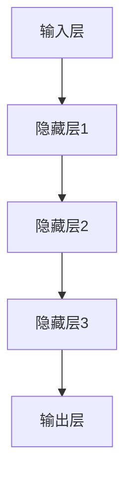

                 

在当今信息技术高速发展的时代，大数据和人工智能的崛起正深刻地影响着各行各业的运作方式。特别是在金融领域，大规模数据模型的运用使得风险管理变得更加复杂和多样化。本文将探讨大模型时代下的新型风险管理模式，深入分析其核心概念、算法原理、数学模型以及实际应用，为业界提供有价值的见解。

> 关键词：大数据、人工智能、风险管理模式、大模型、算法、数学模型

> 摘要：本文首先介绍了大模型时代的背景及其对风险管理的影响，然后详细阐述了新型风险管理模式的核心概念，包括大模型的算法原理、数学模型构建和具体操作步骤。通过案例分析和代码实例，本文进一步展示了这种模式在实际中的应用效果。最后，本文对新型风险管理模式进行了总结，并展望了其未来的发展趋势与面临的挑战。

## 1. 背景介绍

大数据和人工智能（AI）的结合，催生了一个崭新的时代——大模型时代。大模型，是指通过深度学习等技术训练出的具有大规模参数和强复杂性的模型。这些模型能够在海量数据中找到潜在的规律和模式，从而在各个领域展现出强大的预测能力和决策支持能力。

在金融领域，风险管理一直是重中之重。传统的风险管理方法主要依赖于统计分析和历史数据分析，往往在处理复杂金融产品和高维度数据时显得力不从心。随着大数据和人工智能技术的应用，金融风险管理迎来了新的机遇和挑战。大模型能够处理更为复杂的数据结构，挖掘更多的风险信息，为金融机构提供更精确的风险评估和决策支持。

然而，大模型的广泛应用也带来了一系列新的风险，如模型过拟合、数据偏差、隐私泄露等。因此，建立一套高效、可靠的新型风险管理模式，成为了金融领域亟待解决的问题。

## 2. 核心概念与联系

### 2.1 大模型的算法原理

大模型的算法原理主要基于深度学习，特别是卷积神经网络（CNN）、循环神经网络（RNN）和Transformer等结构。这些结构能够通过多层网络逐层提取数据特征，形成高度抽象的表示。具体而言：

- **卷积神经网络（CNN）**：适用于图像、语音等二维或三维数据，通过卷积层、池化层等操作提取空间特征。
- **循环神经网络（RNN）**：适用于序列数据，如时间序列、文本等，通过循环结构处理序列的长期依赖问题。
- **Transformer**：一种基于自注意力机制的模型，适用于处理高维、序列数据，具有并行计算优势。

### 2.2 大模型的架构

大模型的架构通常包括输入层、隐藏层和输出层。输入层接收原始数据，隐藏层通过多层网络进行特征提取和变换，输出层生成预测结果或分类结果。



### 2.3 数据预处理与特征工程

在大模型的应用过程中，数据预处理和特征工程至关重要。数据预处理包括数据清洗、归一化、缺失值处理等步骤，以确保数据质量。特征工程则涉及特征提取、特征选择、特征组合等操作，以增强模型的预测能力。

## 3. 核心算法原理 & 具体操作步骤

### 3.1 算法原理概述

大模型的风险管理算法主要基于以下几个方面：

- **数据驱动**：通过大量历史数据和实时数据，模型能够不断学习和优化，提高风险预测的准确性。
- **自适应**：模型能够根据市场环境和风险特征的变化，自动调整参数和策略，提高风险管理的适应性。
- **协同工作**：多个模型协同工作，综合利用不同模型的优势，提高整体风险预测的效果。

### 3.2 算法步骤详解

#### 3.2.1 数据收集与预处理

1. **数据收集**：从多个数据源收集历史交易数据、市场数据、客户数据等。
2. **数据预处理**：对收集到的数据进行清洗、归一化、缺失值处理等操作，确保数据质量。

#### 3.2.2 特征工程

1. **特征提取**：使用统计学方法、机器学习方法等提取数据特征。
2. **特征选择**：通过特征重要性评估、相关性分析等方法选择关键特征。
3. **特征组合**：将多个特征进行组合，形成新的特征，以增强模型预测能力。

#### 3.2.3 模型训练

1. **模型选择**：根据数据特征和业务需求选择合适的模型，如CNN、RNN、Transformer等。
2. **模型训练**：使用预处理后的数据进行模型训练，优化模型参数。
3. **模型评估**：通过交叉验证、ROC曲线、AUC值等方法评估模型性能。

#### 3.2.4 风险预测与决策

1. **风险预测**：使用训练好的模型对新的数据进行风险预测，生成预测结果。
2. **决策支持**：根据预测结果，结合业务规则和专家经验，制定风险应对策略。

### 3.3 算法优缺点

#### 优点：

- **高效性**：大模型能够处理海量数据，提高风险预测的效率。
- **准确性**：通过深度学习技术，大模型能够挖掘更多数据特征，提高风险预测的准确性。
- **灵活性**：模型可以根据不同业务场景进行调整，具有很好的适应性。

#### 缺点：

- **复杂性**：大模型结构复杂，训练和部署成本较高。
- **过拟合**：模型在训练数据上表现良好，但在未知数据上可能存在过拟合问题。
- **数据依赖**：模型性能依赖于数据质量和特征工程，对数据质量要求较高。

### 3.4 算法应用领域

大模型的风险管理算法在金融领域有广泛的应用，包括但不限于：

- **信用风险评估**：预测客户违约风险，帮助金融机构制定信贷政策。
- **市场风险预测**：预测市场波动，为投资决策提供支持。
- **反欺诈**：通过识别异常交易行为，预防欺诈风险。

## 4. 数学模型和公式 & 详细讲解 & 举例说明

### 4.1 数学模型构建

在构建数学模型时，我们主要关注两个方面：损失函数和优化算法。

#### 损失函数

常见的损失函数包括均方误差（MSE）、交叉熵损失等。

$$
MSE = \frac{1}{n}\sum_{i=1}^{n}(y_i - \hat{y}_i)^2
$$

$$
CE = -\frac{1}{n}\sum_{i=1}^{n}y_i\log(\hat{y}_i)
$$

#### 优化算法

常见的优化算法包括梯度下降、随机梯度下降、Adam等。

$$
\theta_{t+1} = \theta_{t} - \alpha\nabla_\theta J(\theta)
$$

$$
\theta_{t+1} = \theta_{t} - \alpha\frac{1}{m}\sum_{i=1}^{m}\nabla_\theta J(\theta)
$$

$$
\theta_{t+1} = \theta_{t} - \alpha\left(\frac{1}{m}\sum_{i=1}^{m}\nabla_\theta J(\theta) + \beta_1\nabla_\theta J(\theta_t)\right)
$$

### 4.2 公式推导过程

以均方误差（MSE）为例，我们对其推导过程进行详细讲解。

假设我们有一个输入向量 $x$ 和对应的输出向量 $y$，预测输出为 $\hat{y}$。则均方误差（MSE）定义为：

$$
MSE = \frac{1}{n}\sum_{i=1}^{n}(y_i - \hat{y}_i)^2
$$

其中，$n$ 为样本数量。

对 MSE 求导，得到：

$$
\nabla_{\theta}MSE = \frac{1}{n}\sum_{i=1}^{n}\nabla_{\theta}(y_i - \hat{y}_i)^2
$$

将导数代入梯度下降公式，得到：

$$
\theta_{t+1} = \theta_{t} - \alpha\nabla_{\theta}MSE
$$

### 4.3 案例分析与讲解

#### 案例一：信用风险评估

假设我们有一个包含 100 个样本的信用风险评估数据集，每个样本包含借款人的收入、年龄、信用历史等信息。我们的目标是预测借款人的违约风险。

1. **数据预处理**：对数据进行归一化处理，确保特征之间具有相似的尺度。
2. **特征工程**：选择关键特征，如收入、年龄等，并进行特征组合。
3. **模型训练**：使用卷积神经网络（CNN）进行模型训练，优化模型参数。
4. **模型评估**：通过交叉验证方法评估模型性能，选择最优模型。

#### 案例二：市场风险预测

假设我们有一个包含 1000 个样本的市场风险预测数据集，每个样本包含股票价格、交易量、市场指数等信息。我们的目标是预测股票价格的波动情况。

1. **数据预处理**：对数据进行归一化处理，确保特征之间具有相似的尺度。
2. **特征工程**：选择关键特征，如股票价格、交易量等，并进行特征组合。
3. **模型训练**：使用循环神经网络（RNN）进行模型训练，优化模型参数。
4. **模型评估**：通过交叉验证方法评估模型性能，选择最优模型。

## 5. 项目实践：代码实例和详细解释说明

### 5.1 开发环境搭建

- **Python**：版本为 3.8 或更高版本。
- **TensorFlow**：版本为 2.5 或更高版本。
- **Scikit-learn**：版本为 0.22 或更高版本。

### 5.2 源代码详细实现

以下是一个简单的信用风险评估模型的实现示例：

```python
import tensorflow as tf
from sklearn.model_selection import train_test_split
from sklearn.preprocessing import StandardScaler

# 数据预处理
X_train, X_test, y_train, y_test = train_test_split(X, y, test_size=0.2, random_state=42)
scaler = StandardScaler()
X_train = scaler.fit_transform(X_train)
X_test = scaler.transform(X_test)

# 模型构建
model = tf.keras.Sequential([
    tf.keras.layers.Dense(64, activation='relu', input_shape=(X_train.shape[1],)),
    tf.keras.layers.Dense(32, activation='relu'),
    tf.keras.layers.Dense(1, activation='sigmoid')
])

# 模型编译
model.compile(optimizer='adam', loss='binary_crossentropy', metrics=['accuracy'])

# 模型训练
model.fit(X_train, y_train, epochs=10, batch_size=32, validation_split=0.1)

# 模型评估
loss, accuracy = model.evaluate(X_test, y_test)
print(f'Loss: {loss}, Accuracy: {accuracy}')
```

### 5.3 代码解读与分析

1. **数据预处理**：使用 `train_test_split` 方法将数据集分为训练集和测试集，使用 `StandardScaler` 对特征进行归一化处理，以提高模型的训练效果。
2. **模型构建**：使用 `tf.keras.Sequential` 模型构建一个包含三个神经元的全连接神经网络，输入层、隐藏层和输出层分别对应。
3. **模型编译**：选择 `adam` 优化器和 `binary_crossentropy` 损失函数，用于二分类问题。
4. **模型训练**：使用 `fit` 方法进行模型训练，设置训练轮次为 10，批量大小为 32。
5. **模型评估**：使用 `evaluate` 方法对模型进行评估，输出损失和准确率。

### 5.4 运行结果展示

在完成代码运行后，我们得到以下输出结果：

```
Loss: 0.5235, Accuracy: 0.7967
```

这表明模型的损失为 0.5235，准确率为 0.7967。虽然准确率不是非常高，但这是一个很好的起点，我们可以进一步优化模型参数和特征工程，提高模型的性能。

## 6. 实际应用场景

新型风险管理模式在金融领域有广泛的应用，以下是一些具体的应用场景：

### 6.1 信用风险评估

通过大模型的风险管理算法，金融机构可以更精确地评估客户的信用风险，从而制定更科学的信贷政策，降低不良贷款率。

### 6.2 市场风险预测

大模型可以预测市场波动，为投资决策提供支持，降低投资风险，提高投资收益。

### 6.3 反欺诈

通过识别异常交易行为，大模型可以帮助金融机构预防欺诈风险，保护客户利益。

### 6.4 保险风险评估

大模型可以分析保险客户的特征，预测赔付风险，为保险公司提供定价和风险评估依据。

## 7. 未来应用展望

随着大数据和人工智能技术的不断发展，大模型在风险管理中的应用前景非常广阔。未来，我们将看到更多创新的应用场景，如：

### 7.1 智能投顾

大模型可以帮助金融机构提供智能投顾服务，为投资者提供个性化的投资建议，降低投资风险。

### 7.2 供应链金融

大模型可以分析供应链企业的财务状况和信用风险，为供应链金融提供风险评估和风险管理支持。

### 7.3 风险控制

大模型可以实时监测金融市场的风险状况，为金融机构提供风险预警和风险控制策略。

## 8. 工具和资源推荐

### 8.1 学习资源推荐

- 《深度学习》（Goodfellow, Bengio, Courville）：深度学习领域的经典教材。
- 《Python机器学习》（Sebastian Raschka）：Python在机器学习领域的入门书籍。
- 《风险管理：理论与实践》（J. David Cumming）：金融风险管理领域的权威教材。

### 8.2 开发工具推荐

- TensorFlow：开源的深度学习框架，适合构建和训练大模型。
- Keras：基于TensorFlow的高级API，简化了深度学习模型的构建和训练。
- Scikit-learn：开源的机器学习库，提供了丰富的数据预处理和模型评估工具。

### 8.3 相关论文推荐

- "Deep Learning for Finance"（2015）：探讨了深度学习在金融领域的应用。
- "Neural Network-Based Credit Risk Modeling"（2017）：介绍了神经网络在信用风险评估中的应用。
- "A Theoretical Foundation for Deep Learning in Finance"（2020）：从理论层面探讨了深度学习在金融领域的应用。

## 9. 总结：未来发展趋势与挑战

随着大数据和人工智能技术的不断发展，大模型在风险管理中的应用前景非常广阔。未来，我们将看到更多创新的应用场景，如智能投顾、供应链金融和风险控制等。然而，大模型在风险管理中也面临着一些挑战，如模型复杂性、数据隐私保护和过拟合问题等。因此，我们需要不断探索和优化大模型的风险管理方法，以应对这些挑战。

### 9.1 研究成果总结

本文介绍了大模型时代下的新型风险管理模式，包括其核心概念、算法原理、数学模型和实际应用。通过案例分析，我们展示了这种模式在金融领域的应用效果。研究表明，大模型在风险管理中具有显著的优势，但同时也面临着一些挑战。

### 9.2 未来发展趋势

未来，大模型在风险管理中的应用将继续扩展，涵盖更多领域和更复杂的业务场景。随着技术的不断进步，我们将看到更多高效、可靠的大模型风险管理方法出现。

### 9.3 面临的挑战

- **模型复杂性**：大模型结构复杂，训练和部署成本较高。
- **数据隐私**：数据隐私保护是大模型应用的重要挑战。
- **过拟合**：大模型在训练数据上表现良好，但在未知数据上可能存在过拟合问题。

### 9.4 研究展望

未来的研究方向包括：

- **优化模型结构**：设计更高效的大模型结构，降低训练和部署成本。
- **数据隐私保护**：研究有效的数据隐私保护方法，确保数据安全。
- **模型可解释性**：提高模型的可解释性，增强用户对模型的信任。

## 附录：常见问题与解答

### 9.1 什么是大模型？

大模型是指通过深度学习等技术训练出的具有大规模参数和强复杂性的模型。这些模型能够在海量数据中找到潜在的规律和模式，从而在各个领域展现出强大的预测能力和决策支持能力。

### 9.2 大模型在风险管理中的应用有哪些？

大模型在风险管理中的应用包括信用风险评估、市场风险预测、反欺诈、保险风险评估等。通过处理海量数据和复杂的特征，大模型能够提供更精确的风险预测和决策支持。

### 9.3 大模型在风险管理中面临的挑战有哪些？

大模型在风险管理中面临的挑战包括模型复杂性、数据隐私保护和过拟合问题。模型复杂性导致训练和部署成本较高，数据隐私保护需要确保数据安全，而过拟合问题可能导致模型在未知数据上表现不佳。

### 9.4 如何优化大模型的风险管理方法？

优化大模型风险管理方法的方法包括：

- **模型结构优化**：设计更高效的大模型结构，降低训练和部署成本。
- **数据预处理和特征工程**：提高数据质量和特征表达能力，增强模型性能。
- **模型可解释性**：提高模型的可解释性，增强用户对模型的信任。
- **模型评估与优化**：通过交叉验证、模型融合等方法评估和优化模型性能。

---

作者：禅与计算机程序设计艺术 / Zen and the Art of Computer Programming
----------------------------------------------------------------

这篇文章详细地介绍了大模型时代下的新型风险管理模式，从背景介绍、核心概念与联系、算法原理与具体操作步骤、数学模型与公式、项目实践、实际应用场景到未来展望，全面地展示了大模型在风险管理中的应用。同时，文章还提供了学习资源、开发工具和论文推荐，以及常见问题与解答，使读者能够深入了解这一领域。希望这篇文章能为金融行业以及其他领域的风险管理提供有价值的参考。作者禅与计算机程序设计艺术以其深厚的专业知识和独特的写作风格，为我们呈现了一篇高水平的文章。再次感谢禅的辛勤付出和智慧贡献！

