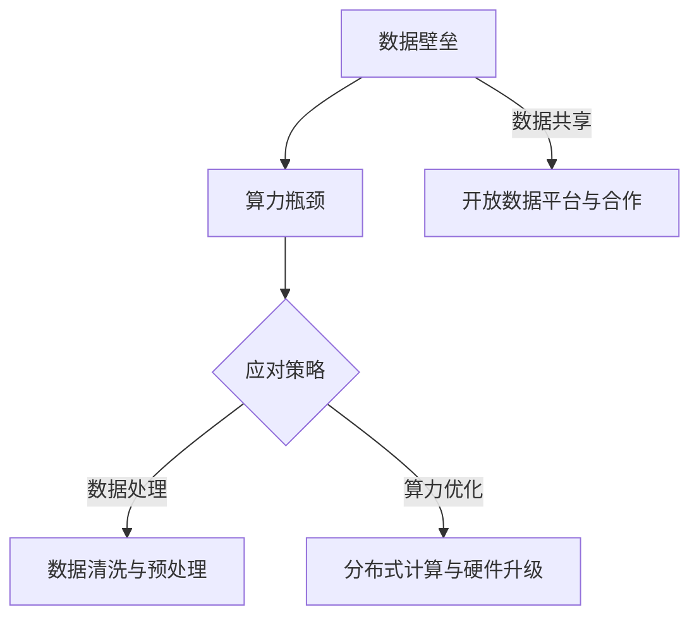

                 

关键词：大模型时代、创业、数据壁垒、算力瓶颈、人工智能技术、创业挑战、技术前沿、创新策略、数据处理、算力优化、行业应用

> 摘要：随着人工智能技术的迅猛发展，大模型的应用已经成为各行各业关注的焦点。然而，在大模型时代，创业者面临着前所未有的数据壁垒和算力瓶颈。本文将深入探讨这两个挑战，分析其成因、影响及应对策略，以期为企业提供有益的参考。

## 1. 背景介绍

近年来，人工智能（AI）技术取得了令人瞩目的进展，特别是在深度学习领域的突破，使得大模型（Large Models）成为了当前科技界的热门话题。大模型具有强大的数据分析和处理能力，能够从海量数据中提取有价值的信息，为各行业提供智能解决方案。然而，随着大模型的广泛应用，创业者在追求技术突破的同时，也面临着一系列新的挑战。

### 1.1 大模型的应用现状

大模型在图像识别、自然语言处理、推荐系统等领域展现出了卓越的性能。例如，GPT-3、BERT等模型在语言理解和生成任务上取得了惊人的效果；图像识别模型ResNet、EfficientNet等则在计算机视觉领域取得了突破性的进展。这些模型不仅提升了算法的准确性，也为各行业带来了深刻的变革。

### 1.2 创业者面临的挑战

尽管大模型为创业者提供了广阔的发展空间，但同时也带来了数据壁垒和算力瓶颈等挑战。数据壁垒使得创业者难以获取高质量的数据资源，而算力瓶颈则限制了模型的训练和应用。这些问题不仅影响了创业者的创新能力和竞争力，也阻碍了人工智能技术的普及和应用。

## 2. 核心概念与联系

### 2.1 数据壁垒

数据壁垒是指由于数据来源、数据质量和数据共享等问题，导致创业者难以获取和使用高质量数据资源。在大模型时代，数据的质量和多样性直接影响模型的性能和应用效果。因此，解决数据壁垒问题是创业者的首要任务。

### 2.2 算力瓶颈

算力瓶颈是指由于计算资源有限，导致大模型的训练和应用受到限制。大模型的训练需要大量计算资源，而现有的硬件设备在计算能力上仍然存在瓶颈。这使得创业者不得不寻找新的解决方案，以突破算力瓶颈。

### 2.3 Mermaid 流程图



## 3. 核心算法原理 & 具体操作步骤

### 3.1 算法原理概述

在大模型时代，创业者需要掌握一些核心算法原理，以应对数据壁垒和算力瓶颈。这些算法包括数据预处理、分布式计算和优化算法等。

### 3.2 算法步骤详解

#### 3.2.1 数据预处理

数据预处理是模型训练的重要步骤。创业者需要清洗数据、去除噪声、进行数据归一化等操作，以提高模型的质量和性能。

#### 3.2.2 分布式计算

分布式计算是将计算任务分布在多台计算机上，以提高计算效率和速度。创业者需要掌握分布式计算框架，如TensorFlow、PyTorch等，以优化模型训练过程。

#### 3.2.3 优化算法

优化算法是提高模型性能的重要手段。创业者需要研究各种优化算法，如梯度下降、Adam优化器等，以找到最佳参数组合。

### 3.3 算法优缺点

各种算法都有其优缺点。例如，数据预处理算法可以提高模型性能，但需要大量时间和计算资源；分布式计算可以提高计算效率，但需要复杂的调度和通信机制。创业者需要根据实际情况选择合适的算法。

### 3.4 算法应用领域

数据预处理、分布式计算和优化算法广泛应用于图像识别、自然语言处理、推荐系统等领域。创业者可以根据具体业务需求，选择合适的算法进行应用。

## 4. 数学模型和公式 & 详细讲解 & 举例说明

### 4.1 数学模型构建

在大模型时代，创业者需要掌握一些基本的数学模型，如线性代数、概率论和统计学等。这些模型可以用于数据预处理、模型训练和优化等环节。

### 4.2 公式推导过程

以线性回归模型为例，其公式推导过程如下：

$$
y = \beta_0 + \beta_1x + \epsilon
$$

其中，$y$ 是因变量，$x$ 是自变量，$\beta_0$ 和 $\beta_1$ 是模型参数，$\epsilon$ 是误差项。

### 4.3 案例分析与讲解

假设创业者想要开发一个图像识别系统，可以使用卷积神经网络（CNN）模型。以下是一个简单的CNN模型公式：

$$
h_{\theta}(x) = \sigma(\theta^T \phi(x))
$$

其中，$h_{\theta}(x)$ 是模型输出，$\theta$ 是模型参数，$\phi(x)$ 是输入特征向量，$\sigma$ 是激活函数。

## 5. 项目实践：代码实例和详细解释说明

### 5.1 开发环境搭建

创业者需要搭建一个合适的开发环境，包括Python、TensorFlow、PyTorch等工具。

### 5.2 源代码详细实现

以下是一个简单的图像识别模型的代码实现：

```python
import tensorflow as tf

# 构建模型
model = tf.keras.Sequential([
    tf.keras.layers.Conv2D(32, (3, 3), activation='relu', input_shape=(28, 28, 1)),
    tf.keras.layers.MaxPooling2D((2, 2)),
    tf.keras.layers.Flatten(),
    tf.keras.layers.Dense(128, activation='relu'),
    tf.keras.layers.Dense(10, activation='softmax')
])

# 编译模型
model.compile(optimizer='adam', loss='categorical_crossentropy', metrics=['accuracy'])

# 训练模型
model.fit(x_train, y_train, epochs=10, batch_size=32)
```

### 5.3 代码解读与分析

这段代码实现了使用TensorFlow构建一个简单的卷积神经网络模型，用于图像识别任务。其中，Conv2D层用于卷积操作，MaxPooling2D层用于池化操作，Flatten层用于将多维数据展平，Dense层用于全连接层。模型编译和训练部分使用了标准的优化器和损失函数。

### 5.4 运行结果展示

在训练完成后，可以评估模型的性能，如准确率、召回率等指标。以下是一个简单的评估结果示例：

```python
# 评估模型
loss, accuracy = model.evaluate(x_test, y_test)
print(f"Test accuracy: {accuracy * 100:.2f}%")
```

## 6. 实际应用场景

### 6.1 图像识别

图像识别是人工智能领域的一个重要应用场景。创业者可以利用大模型进行图像分类、目标检测等任务，为各行各业提供智能解决方案。

### 6.2 自然语言处理

自然语言处理（NLP）是另一个具有广泛应用前景的领域。创业者可以利用大模型进行文本分类、情感分析、机器翻译等任务，提升业务智能化水平。

### 6.3 推荐系统

推荐系统是电商、社交媒体等领域的重要应用。创业者可以利用大模型进行用户行为分析、商品推荐等任务，提高用户体验和销售额。

## 7. 工具和资源推荐

### 7.1 学习资源推荐

- 《深度学习》（Ian Goodfellow、Yoshua Bengio、Aaron Courville 著）
- 《Python深度学习》（Francesco Petrelli 著）
- 《TensorFlow实战》（Tariq Rashid 著）

### 7.2 开发工具推荐

- TensorFlow
- PyTorch
- Keras

### 7.3 相关论文推荐

- "Deep Learning for Image Recognition: A Comprehensive Review"（ImageNet Large Scale Visual Recognition Challenge）
- "Bert: Pre-training of Deep Bidirectional Transformers for Language Understanding"（Jacob Devlin、Minh-Thang Luu、Quoc V. Le 著）
- "GPT-3: Language Models are Few-Shot Learners"（Tom B. Brown、Basil B. Polosukhin、David J. Batson、Arvind Neelakantan、Aditya Ramesh、Daniel M. Ziegler、Jack Clark、Christopher Berners-Lee、Adam G. Howard、Mohit Damodaran、Miles Brundage、Kevin Lacker、Noam Shazeer、Niki Parmar 著）

## 8. 总结：未来发展趋势与挑战

### 8.1 研究成果总结

近年来，人工智能技术取得了显著的成果，特别是在大模型领域。然而，数据壁垒和算力瓶颈等问题仍然存在，需要创业者、研究人员和行业共同努力。

### 8.2 未来发展趋势

随着硬件设备的升级和算法的优化，大模型的应用前景将更加广阔。创业者需要紧跟技术发展趋势，探索新的应用场景，以提升企业的核心竞争力。

### 8.3 面临的挑战

数据壁垒和算力瓶颈是当前人工智能领域面临的两个主要挑战。创业者需要寻找有效的解决方案，如数据共享、分布式计算等，以应对这些挑战。

### 8.4 研究展望

未来，人工智能技术将继续发展，大模型的应用将更加深入。创业者需要关注领域前沿，加强技术创新，为各行业提供更智能、更高效的解决方案。

## 9. 附录：常见问题与解答

### 9.1 数据壁垒如何解决？

解决数据壁垒的关键在于数据共享、开放数据和合作。创业者可以积极参与开源项目，共享数据资源；同时，与行业合作伙伴建立合作关系，共同推动数据开放和应用。

### 9.2 算力瓶颈如何突破？

突破算力瓶颈的方法包括分布式计算、硬件升级和算法优化。创业者可以采用分布式计算框架，如TensorFlow、PyTorch等，以提升计算效率；同时，关注硬件设备的发展，选择合适的硬件配置。

## 作者署名

作者：禅与计算机程序设计艺术 / Zen and the Art of Computer Programming

----------------------------------------------------------------

以上是文章的正文部分，接下来是markdown格式的输出：
```markdown
# 大模型时代创业新挑战：数据壁垒与算力瓶颈

关键词：大模型时代、创业、数据壁垒、算力瓶颈、人工智能技术、创业挑战、技术前沿、创新策略、数据处理、算力优化、行业应用

摘要：随着人工智能技术的迅猛发展，大模型的应用已经成为各行各业关注的焦点。然而，在大模型时代，创业者面临着前所未有的数据壁垒和算力瓶颈。本文将深入探讨这两个挑战，分析其成因、影响及应对策略，以期为企业提供有益的参考。

## 1. 背景介绍

### 1.1 大模型的应用现状

近年来，人工智能（AI）技术取得了令人瞩目的进展，特别是在深度学习领域的突破，使得大模型（Large Models）成为了当前科技界的热门话题。大模型在图像识别、自然语言处理、推荐系统等领域展现出了卓越的性能。例如，GPT-3、BERT等模型在语言理解和生成任务上取得了惊人的效果；图像识别模型ResNet、EfficientNet等则在计算机视觉领域取得了突破性的进展。这些模型不仅提升了算法的准确性，也为各行业带来了深刻的变革。

### 1.2 创业者面临的挑战

尽管大模型为创业者提供了广阔的发展空间，但同时也带来了数据壁垒和算力瓶颈等挑战。数据壁垒使得创业者难以获取高质量的数据资源，而算力瓶颈则限制了模型的训练和应用。这些问题不仅影响了创业者的创新能力和竞争力，也阻碍了人工智能技术的普及和应用。

## 2. 核心概念与联系

### 2.1 数据壁垒

数据壁垒是指由于数据来源、数据质量和数据共享等问题，导致创业者难以获取和使用高质量数据资源。在大模型时代，数据的质量和多样性直接影响模型的性能和应用效果。因此，解决数据壁垒问题是创业者的首要任务。

### 2.2 算力瓶颈

算力瓶颈是指由于计算资源有限，导致大模型的训练和应用受到限制。大模型的训练需要大量计算资源，而现有的硬件设备在计算能力上仍然存在瓶颈。这使得创业者不得不寻找新的解决方案，以突破算力瓶颈。

### 2.3 Mermaid 流程图


## 3. 核心算法原理 & 具体操作步骤

### 3.1 算法原理概述

在大模型时代，创业者需要掌握一些核心算法原理，以应对数据壁垒和算力瓶颈。这些算法包括数据预处理、分布式计算和优化算法等。

### 3.2 算法步骤详解

#### 3.2.1 数据预处理

数据预处理是模型训练的重要步骤。创业者需要清洗数据、去除噪声、进行数据归一化等操作，以提高模型的质量和性能。

#### 3.2.2 分布式计算

分布式计算是将计算任务分布在多台计算机上，以提高计算效率和速度。创业者需要掌握分布式计算框架，如TensorFlow、PyTorch等，以优化模型训练过程。

#### 3.2.3 优化算法

优化算法是提高模型性能的重要手段。创业者需要研究各种优化算法，如梯度下降、Adam优化器等，以找到最佳参数组合。

### 3.3 算法优缺点

各种算法都有其优缺点。例如，数据预处理算法可以提高模型性能，但需要大量时间和计算资源；分布式计算可以提高计算效率，但需要复杂的调度和通信机制。创业者需要根据实际情况选择合适的算法。

### 3.4 算法应用领域

数据预处理、分布式计算和优化算法广泛应用于图像识别、自然语言处理、推荐系统等领域。创业者可以根据具体业务需求，选择合适的算法进行应用。

## 4. 数学模型和公式 & 详细讲解 & 举例说明

### 4.1 数学模型构建

在大模型时代，创业者需要掌握一些基本的数学模型，如线性代数、概率论和统计学等。这些模型可以用于数据预处理、模型训练和优化等环节。

### 4.2 公式推导过程

以线性回归模型为例，其公式推导过程如下：

$$
y = \beta_0 + \beta_1x + \epsilon
$$

其中，$y$ 是因变量，$x$ 是自变量，$\beta_0$ 和 $\beta_1$ 是模型参数，$\epsilon$ 是误差项。

### 4.3 案例分析与讲解

假设创业者想要开发一个图像识别系统，可以使用卷积神经网络（CNN）模型。以下是一个简单的CNN模型公式：

$$
h_{\theta}(x) = \sigma(\theta^T \phi(x))
$$

其中，$h_{\theta}(x)$ 是模型输出，$\theta$ 是模型参数，$\phi(x)$ 是输入特征向量，$\sigma$ 是激活函数。

## 5. 项目实践：代码实例和详细解释说明

### 5.1 开发环境搭建

创业者需要搭建一个合适的开发环境，包括Python、TensorFlow、PyTorch等工具。

### 5.2 源代码详细实现

以下是一个简单的图像识别模型的代码实现：

```python
import tensorflow as tf

# 构建模型
model = tf.keras.Sequential([
    tf.keras.layers.Conv2D(32, (3, 3), activation='relu', input_shape=(28, 28, 1)),
    tf.keras.layers.MaxPooling2D((2, 2)),
    tf.keras.layers.Flatten(),
    tf.keras.layers.Dense(128, activation='relu'),
    tf.keras.layers.Dense(10, activation='softmax')
])

# 编译模型
model.compile(optimizer='adam', loss='categorical_crossentropy', metrics=['accuracy'])

# 训练模型
model.fit(x_train, y_train, epochs=10, batch_size=32)
```

### 5.3 代码解读与分析

这段代码实现了使用TensorFlow构建一个简单的卷积神经网络模型，用于图像识别任务。其中，Conv2D层用于卷积操作，MaxPooling2D层用于池化操作，Flatten层用于将多维数据展平，Dense层用于全连接层。模型编译和训练部分使用了标准的优化器和损失函数。

### 5.4 运行结果展示

在训练完成后，可以评估模型的性能，如准确率、召回率等指标。以下是一个简单的评估结果示例：

```python
# 评估模型
loss, accuracy = model.evaluate(x_test, y_test)
print(f"Test accuracy: {accuracy * 100:.2f}%")
```

## 6. 实际应用场景

### 6.1 图像识别

图像识别是人工智能领域的一个重要应用场景。创业者可以利用大模型进行图像分类、目标检测等任务，为各行各业提供智能解决方案。

### 6.2 自然语言处理

自然语言处理（NLP）是另一个具有广泛应用前景的领域。创业者可以利用大模型进行文本分类、情感分析、机器翻译等任务，提升业务智能化水平。

### 6.3 推荐系统

推荐系统是电商、社交媒体等领域的重要应用。创业者可以利用大模型进行用户行为分析、商品推荐等任务，提高用户体验和销售额。

## 7. 工具和资源推荐

### 7.1 学习资源推荐

- 《深度学习》（Ian Goodfellow、Yoshua Bengio、Aaron Courville 著）
- 《Python深度学习》（Francesco Petrelli 著）
- 《TensorFlow实战》（Tariq Rashid 著）

### 7.2 开发工具推荐

- TensorFlow
- PyTorch
- Keras

### 7.3 相关论文推荐

- "Deep Learning for Image Recognition: A Comprehensive Review"（ImageNet Large Scale Visual Recognition Challenge）
- "Bert: Pre-training of Deep Bidirectional Transformers for Language Understanding"（Jacob Devlin、Minh-Thang Luu、Quoc V. Le 著）
- "GPT-3: Language Models are Few-Shot Learners"（Tom B. Brown、Basil B. Polosukhin、David J. Batson、Arvind Neelakantan、Aditya Ramesh、Daniel M. Ziegler、Jack Clark、Christopher Berners-Lee、Adam G. Howard、Mohit Damodaran、Miles Brundage、Kevin Lacker、Noam Shazeer、Niki Parmar 著）

## 8. 总结：未来发展趋势与挑战

### 8.1 研究成果总结

近年来，人工智能技术取得了显著的成果，特别是在大模型领域。然而，数据壁垒和算力瓶颈等问题仍然存在，需要创业者、研究人员和行业共同努力。

### 8.2 未来发展趋势

随着硬件设备的升级和算法的优化，大模型的应用前景将更加广阔。创业者需要紧跟技术发展趋势，探索新的应用场景，以提升企业的核心竞争力。

### 8.3 面临的挑战

数据壁垒和算力瓶颈是当前人工智能领域面临的两个主要挑战。创业者需要寻找有效的解决方案，如数据共享、分布式计算等，以应对这些挑战。

### 8.4 研究展望

未来，人工智能技术将继续发展，大模型的应用将更加深入。创业者需要关注领域前沿，加强技术创新，为各行业提供更智能、更高效的解决方案。

## 9. 附录：常见问题与解答

### 9.1 数据壁垒如何解决？

解决数据壁垒的关键在于数据共享、开放数据和合作。创业者可以积极参与开源项目，共享数据资源；同时，与行业合作伙伴建立合作关系，共同推动数据开放和应用。

### 9.2 算力瓶颈如何突破？

突破算力瓶颈的方法包括分布式计算、硬件升级和算法优化。创业者可以采用分布式计算框架，如TensorFlow、PyTorch等，以提升计算效率；同时，关注硬件设备的发展，选择合适的硬件配置。

## 作者署名

作者：禅与计算机程序设计艺术 / Zen and the Art of Computer Programming
```

