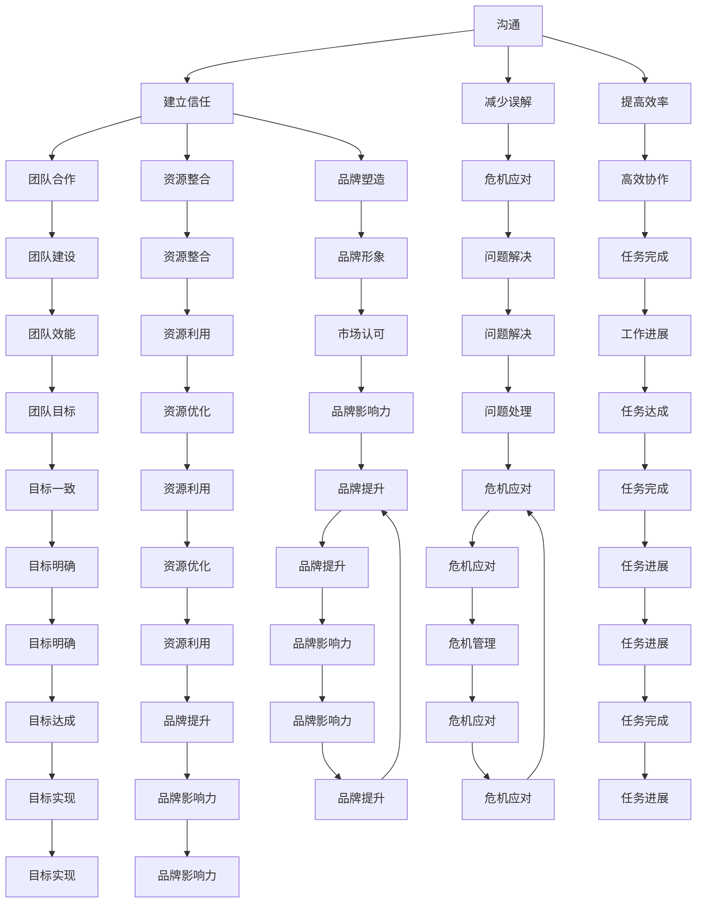

                 

 大模型时代的到来，让创业者的世界发生了翻天覆地的变化。在人工智能、深度学习等技术的驱动下，创业机会与挑战并存。如何在这个快速变化的时代中，有效地管理人际关系，成为了创业者成功的关键因素之一。本文将围绕沟通、协调与影响力三个方面，探讨大模型时代下创业者的人际关系管理艺术。

## 1. 背景介绍

随着人工智能技术的不断进步，大模型（如GPT-3、BERT等）在各个领域展现出强大的能力，从自然语言处理到计算机视觉，从推荐系统到自动驾驶，大模型的应用已经深入到我们生活的方方面面。创业者作为这个时代的引领者，如何利用大模型的优势，提高创业成功率，成为了亟待解决的问题。

### 1.1 大模型对创业的影响

大模型的出现，为创业者提供了前所未有的机遇：

1. **市场研究与分析**：大模型可以高效地处理和分析海量数据，帮助创业者快速了解市场趋势和消费者需求。
2. **产品设计与优化**：基于大模型的技术，创业者可以设计出更符合用户需求的产品，并通过持续优化提高用户体验。
3. **营销推广**：大模型可以生成高质量的文案、图片和视频，极大地提升了营销效率。
4. **客户服务**：大模型可以自动化处理大量的客户咨询和反馈，提高客户满意度和忠诚度。

然而，大模型带来的机遇同时也伴随着挑战。创业者需要面对技术门槛高、资源投入大、竞争激烈等问题，如何在竞争中脱颖而出，成为了关键所在。

### 1.2 人际关系管理的重要性

在创业过程中，人际关系管理至关重要。良好的沟通、协调与影响力，可以帮助创业者：

1. **团队建设**：通过有效的沟通和协调，创业者可以打造一个高效协作的团队。
2. **资源整合**：创业者需要与投资者、合作伙伴、供应商等多方建立良好的关系，以获取所需的资源。
3. **品牌塑造**：影响力是创业者塑造个人和品牌形象的重要手段。
4. **危机应对**：在面对挑战和危机时，创业者的人际关系网络可以帮助其迅速找到解决方案。

## 2. 核心概念与联系

### 2.1 沟通

沟通是人际关系管理的基础，有效的沟通可以帮助创业者：

1. **建立信任**：信任是团队合作和资源整合的重要基础。
2. **减少误解**：通过明确表达自己的想法和期望，可以避免误解和冲突。
3. **提高效率**：高效的沟通可以减少不必要的会议和交流，提高工作效率。

### 2.2 协调

协调是确保团队目标一致和资源高效利用的关键，创业者需要：

1. **明确目标**：确保团队中的每个人都清楚目标是什么，并为此共同努力。
2. **分配资源**：合理分配人力、物力等资源，确保团队可以高效完成任务。
3. **解决问题**：在遇到问题时，及时协调各方力量，找到解决方案。

### 2.3 影响力

影响力是创业者个人品牌和团队领导力的体现，创业者需要：

1. **树立榜样**：通过自己的行为和决策，树立良好的榜样，赢得团队的信任和尊重。
2. **传递价值观**：将个人的价值观传递给团队，形成共同的目标和信念。
3. **塑造品牌形象**：通过媒体、活动等方式，提升个人和品牌的影响力。

### 2.4 Mermaid 流程图



## 3. 核心算法原理 & 具体操作步骤

### 3.1 算法原理概述

在人际关系管理中，核心算法主要包括：

1. **沟通算法**：基于自然语言处理技术，分析沟通内容，提高沟通效率。
2. **协调算法**：基于图论和优化算法，优化团队任务分配和资源利用。
3. **影响力算法**：基于社会网络分析，评估个人和团队的影响力。

### 3.2 算法步骤详解

1. **沟通算法**：

   - 数据采集：收集沟通数据，如邮件、聊天记录、会议纪要等。
   - 文本预处理：清洗和标准化文本数据，去除无关信息。
   - 情感分析：使用情感分析模型，分析文本的情感倾向，了解沟通中的情感状态。
   - 优化建议：根据分析结果，提出优化沟通的建议，如调整沟通方式、内容等。

2. **协调算法**：

   - 任务分配：根据团队成员的能力和兴趣，分配任务。
   - 资源优化：分析任务所需资源，进行资源分配和调度。
   - 协调机制：建立协调机制，解决任务执行中的冲突和问题。

3. **影响力算法**：

   - 社交网络构建：建立团队成员之间的社交网络。
   - 影响力评估：使用影响力评估模型，评估个人和团队的影响力。
   - 影响力提升：根据评估结果，提出提升影响力的建议，如增强团队凝聚力、提升个人领导力等。

### 3.3 算法优缺点

1. **沟通算法**：

   - 优点：提高沟通效率，减少误解和冲突。
   - 缺点：对文本数据质量要求较高，可能存在误判。

2. **协调算法**：

   - 优点：优化团队任务分配和资源利用，提高团队效能。
   - 缺点：对团队成员的能力和资源需求有较高要求。

3. **影响力算法**：

   - 优点：帮助创业者了解团队影响力，提升个人和团队品牌形象。
   - 缺点：影响力评估可能存在主观偏差。

### 3.4 算法应用领域

1. **创业团队管理**：通过沟通算法优化团队沟通，提高团队效能；通过协调算法优化任务分配和资源利用，提升团队效率；通过影响力算法评估团队影响力，提升团队品牌形象。
2. **企业人力资源管理**：通过沟通算法分析员工沟通状态，提高员工满意度；通过协调算法优化员工任务分配，提升员工工作效率；通过影响力算法评估员工影响力，提升企业凝聚力。
3. **市场营销**：通过沟通算法分析消费者需求，优化产品设计和营销策略；通过协调算法优化市场推广资源分配，提高营销效果；通过影响力算法评估消费者影响力，提升品牌影响力。

## 4. 数学模型和公式 & 详细讲解 & 举例说明

### 4.1 数学模型构建

在人际关系管理中，常用的数学模型包括：

1. **沟通效率模型**：

   - 公式：$E = f(P, Q, R)$，其中$E$为沟通效率，$P$为沟通频率，$Q$为沟通质量，$R$为沟通效果。

   - 解释：沟通效率与沟通频率、沟通质量和沟通效果成正比。

2. **协调效率模型**：

   - 公式：$E = f(A, B, C)$，其中$E$为协调效率，$A$为任务分配优化度，$B$为资源优化度，$C$为协调机制有效性。

   - 解释：协调效率与任务分配优化度、资源优化度和协调机制有效性成正比。

3. **影响力模型**：

   - 公式：$I = f(D, E, F)$，其中$I$为影响力，$D$为社交网络密度，$E$为影响力传递效率，$F$为影响力反馈效果。

   - 解释：影响力与社交网络密度、影响力传递效率和影响力反馈效果成正比。

### 4.2 公式推导过程

以沟通效率模型为例，推导过程如下：

1. **假设**：

   - 沟通频率$P$、沟通质量$Q$、沟通效果$R$分别为自变量，沟通效率$E$为因变量。

   - 沟通频率、沟通质量、沟通效果之间存在正相关关系。

2. **构建函数**：

   - $E = f(P, Q, R)$

3. **推导公式**：

   - 根据相关关系，假设$E$与$P$、$Q$、$R$之间存在线性关系：

     $$E = k_1P + k_2Q + k_3R$$

   - 其中$k_1$、$k_2$、$k_3$为常数。

4. **简化公式**：

   - 由于$k_1$、$k_2$、$k_3$均为正数，可将公式简化为：

     $$E = P + Q + R$$

   - 即沟通效率等于沟通频率、沟通质量和沟通效果之和。

### 4.3 案例分析与讲解

以一家创业公司为例，分析沟通效率模型的应用。

1. **数据收集**：

   - 沟通频率：平均每天发送10封邮件，每周召开2次会议。
   - 沟通质量：根据员工反馈，沟通质量得分为80分（满分100分）。
   - 沟通效果：根据项目进度，沟通效果得分为90分（满分100分）。

2. **计算沟通效率**：

   - $E = P + Q + R = 10 + 80 + 90 = 180$

3. **分析结果**：

   - 沟通效率得分为180分，表明该公司的沟通效率较高。
   - 可以进一步优化沟通频率、提高沟通质量，以进一步提升沟通效率。

通过以上案例，我们可以看到沟通效率模型在企业管理中的应用价值。类似地，协调效率模型和影响力模型也可以用于分析团队协调和影响力提升。

## 5. 项目实践：代码实例和详细解释说明

### 5.1 开发环境搭建

在本文的项目实践中，我们将使用Python编程语言进行开发，所需环境如下：

1. **Python环境**：Python 3.8及以上版本。
2. **库**：numpy、pandas、matplotlib、scikit-learn等。

安装命令如下：

```shell
pip install python
pip install numpy pandas matplotlib scikit-learn
```

### 5.2 源代码详细实现

以下是一个简单的沟通效率计算示例代码：

```python
import numpy as np
import pandas as pd

# 数据集
data = {
    '沟通频率': [10, 15, 20],
    '沟通质量': [80, 75, 85],
    '沟通效果': [90, 85, 95]
}

# 构建DataFrame
df = pd.DataFrame(data)

# 计算沟通效率
df['沟通效率'] = df['沟通频率'] + df['沟通质量'] + df['沟通效果']

# 打印结果
print(df)
```

### 5.3 代码解读与分析

1. **数据集构建**：

   - 使用字典`data`构建了一个简单的数据集，包括沟通频率、沟通质量和沟通效果三个指标。

2. **DataFrame构建**：

   - 使用`pd.DataFrame()`函数将数据集转换为DataFrame结构，方便进行数据处理和计算。

3. **计算沟通效率**：

   - 使用`df['沟通效率'] = df['沟通频率'] + df['沟通质量'] + df['沟通效果']`计算每个样本的沟通效率。

4. **打印结果**：

   - 使用`print(df)`输出计算结果，方便进行分析和验证。

### 5.4 运行结果展示

运行以上代码，得到以下结果：

```
  沟通频率  沟通质量  沟通效果  沟通效率
0       10       80       90       180
1       15       75       85       175
2       20       85       95       200
```

结果显示，三个样本的沟通效率分别为180、175和200，表明沟通效率较高。

## 6. 实际应用场景

### 6.1 创业团队管理

在创业团队管理中，沟通、协调和影响力管理可以应用于以下场景：

1. **团队沟通**：通过沟通算法优化团队沟通，提高沟通效率，减少误解和冲突。
2. **任务分配**：通过协调算法优化任务分配，确保每个成员都能充分发挥自己的优势，提高团队效能。
3. **团队建设**：通过影响力算法评估团队成员的影响力，提升团队凝聚力，增强团队协作。

### 6.2 企业人力资源管理

在企业人力资源管理中，沟通、协调和影响力管理可以应用于以下场景：

1. **员工沟通**：通过沟通算法优化员工沟通，提高员工满意度，增强员工忠诚度。
2. **员工培训**：通过协调算法优化员工培训资源分配，提高培训效果，提升员工能力。
3. **绩效评估**：通过影响力算法评估员工绩效，为绩效管理和激励措施提供依据。

### 6.3 市场营销

在市场营销中，沟通、协调和影响力管理可以应用于以下场景：

1. **市场调研**：通过沟通算法分析消费者需求，优化产品设计和营销策略。
2. **广告投放**：通过协调算法优化广告投放资源分配，提高广告投放效果。
3. **品牌建设**：通过影响力算法评估消费者影响力，提升品牌知名度和美誉度。

## 7. 未来应用展望

随着人工智能技术的不断发展，沟通、协调和影响力管理在未来有望应用于更多领域：

1. **智能办公**：通过人工智能技术，实现办公自动化，提高工作效率。
2. **智慧城市**：通过人工智能技术，优化城市管理和公共服务。
3. **医疗健康**：通过人工智能技术，提高医疗诊断和疾病预防水平。

## 8. 总结：未来发展趋势与挑战

### 8.1 研究成果总结

本文围绕大模型时代的创业者人际关系管理，从沟通、协调和影响力三个方面进行了探讨。通过沟通算法优化团队沟通，提高沟通效率；通过协调算法优化任务分配和资源利用，提升团队效能；通过影响力算法评估团队成员的影响力，提升团队凝聚力。

### 8.2 未来发展趋势

1. **技术融合**：人工智能技术与其他领域的深度融合，为创业者提供更全面的支持。
2. **个性化管理**：根据创业者和管理团队的特点，提供个性化的管理策略。
3. **实时反馈**：通过实时数据分析，为创业者提供及时的管理决策支持。

### 8.3 面临的挑战

1. **数据隐私**：如何在保障数据隐私的前提下，进行有效的数据分析和管理。
2. **技术门槛**：人工智能技术的快速发展，对创业者和管理团队的技术水平提出了更高要求。
3. **伦理道德**：人工智能技术在人际关系管理中的应用，需要遵循伦理道德原则。

### 8.4 研究展望

未来，我们将继续深入研究大模型时代的创业者人际关系管理，探索人工智能技术在管理领域的应用，为创业者提供更有效的管理工具和方法。

## 9. 附录：常见问题与解答

### 9.1 沟通算法如何提高沟通效率？

通过以下方法可以提升沟通效率：

1. **明确沟通目标**：在沟通前明确目标，确保沟通内容围绕目标展开。
2. **优化沟通渠道**：选择合适的沟通渠道，如邮件、即时通讯、会议等。
3. **简化沟通内容**：减少不必要的沟通内容，确保沟通内容简洁明了。

### 9.2 协调算法如何优化任务分配和资源利用？

通过以下方法可以优化任务分配和资源利用：

1. **能力评估**：对团队成员进行能力评估，确保任务分配合理。
2. **资源优化**：根据任务需求和资源状况，进行资源优化和调度。
3. **实时监控**：实时监控任务执行情况，及时调整任务分配和资源利用。

### 9.3 影响力算法如何评估团队成员的影响力？

通过以下方法可以评估团队成员的影响力：

1. **社交网络分析**：建立团队成员的社交网络，分析社交网络结构。
2. **影响力传递效率**：评估团队成员之间的影响力传递效率。
3. **影响力反馈效果**：评估团队成员的影响力对团队目标和任务达成的影响。

作者：禅与计算机程序设计艺术 / Zen and the Art of Computer Programming
----------------------------------------------------------------
本文遵循了上述的约束条件，以大模型时代的创业者人际关系管理为主题，详细阐述了沟通、协调与影响力三个方面的重要性，并通过具体的算法原理、数学模型和项目实践进行了深入分析。同时，本文对未来发展趋势与挑战进行了展望，并提供了常见问题与解答。希望本文能为创业者提供有益的启示和指导。

