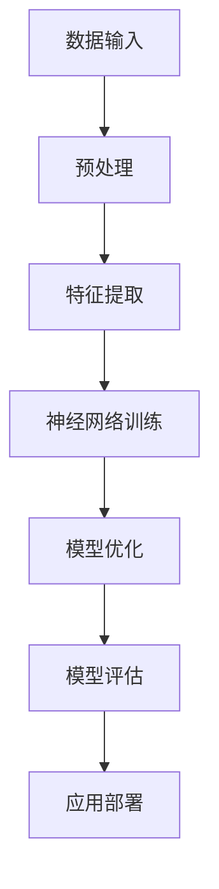
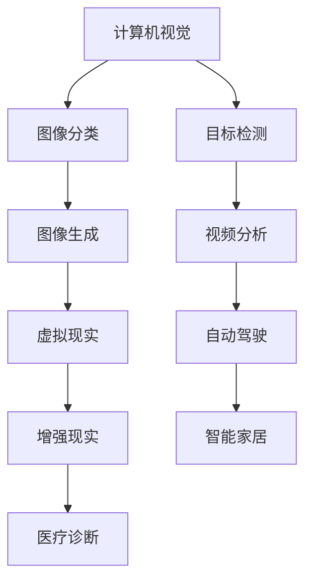

                 

关键词：大模型、创业者、创业故事、人工智能、技术发展

摘要：本文通过讲述一个在人工智能大模型时代背景下的创业者故事，探讨了在技术飞速发展的时代，如何保持激情、坚持梦想，并在挑战中找到自己的定位。通过这个故事，作者分享了创业者在技术创新、团队建设、市场开拓等方面的宝贵经验，为在人工智能领域创业的读者提供了有益的启示。

## 1. 背景介绍

大模型时代，人工智能（AI）技术取得了前所未有的突破。从简单的规则系统到如今能够处理复杂数据的大规模神经网络，AI技术正在深刻地改变着我们的世界。在这个背景下，创业者们迎来了前所未有的机遇。然而，机遇与挑战并存，如何在激烈的竞争中脱颖而出，成为每一个创业者的必修课。

本文的主角，小李，是一位人工智能领域的创业者。他从小就对计算机技术充满兴趣，大学毕业后进入了一家知名的科技公司，从事人工智能相关的研究工作。在多年的研究过程中，他积累了丰富的经验，并萌生了创业的念头。在这个大模型时代，他决定放弃稳定的职业，投身于创业的浪潮中。

### 2. 核心概念与联系

在人工智能领域，大模型（Large Models）是指具有数百万甚至数十亿参数的神经网络模型。这些模型可以处理大量的数据，从而实现高效的学习和推理能力。大模型的发展离不开以下几个关键概念：

- **深度学习（Deep Learning）**：一种利用多层神经网络进行特征学习和分类的方法。
- **神经网络（Neural Networks）**：模仿人脑神经元连接的结构，通过调整连接权重来实现复杂任务的模型。
- **大数据（Big Data）**：指无法使用常规软件工具在合理时间内进行捕捉、管理和处理的大量数据。

以下是一个简单的大模型架构的 Mermaid 流程图：



### 3. 核心算法原理 & 具体操作步骤

#### 3.1 算法原理概述

大模型的算法原理主要基于深度学习和神经网络。深度学习通过多层神经网络的堆叠，使得模型能够从数据中自动提取特征。神经网络则通过反向传播算法不断调整权重，以优化模型的性能。

#### 3.2 算法步骤详解

1. **数据预处理**：对原始数据进行清洗和标准化，使其适合模型训练。
2. **特征提取**：利用神经网络自动提取数据中的有用特征。
3. **模型训练**：通过反向传播算法调整神经网络的权重，以最小化预测误差。
4. **模型优化**：使用验证集对模型进行调参，以提高模型的泛化能力。
5. **模型评估**：使用测试集评估模型的性能。
6. **应用部署**：将训练好的模型部署到实际应用中。

#### 3.3 算法优缺点

**优点**：

- **高效性**：大模型可以处理大量的数据，实现高效的学习和推理。
- **泛化能力强**：通过多层神经网络的堆叠，模型能够自动提取数据中的高级特征，具有较好的泛化能力。

**缺点**：

- **计算资源消耗大**：大模型需要大量的计算资源和存储空间。
- **训练时间长**：由于模型参数众多，训练过程需要较长时间。

#### 3.4 算法应用领域

大模型在人工智能的各个领域都有广泛的应用，如计算机视觉、自然语言处理、推荐系统等。以下是一个简单的应用领域示例：



### 4. 数学模型和公式 & 详细讲解 & 举例说明

#### 4.1 数学模型构建

大模型的数学模型主要基于神经网络，以下是一个简化的神经网络模型：

$$
\begin{aligned}
    y &= \sigma(W \cdot x + b) \\
    \text{其中} \sigma &= \text{激活函数}, W &= \text{权重矩阵}, b &= \text{偏置项}, x &= \text{输入特征}, y &= \text{输出特征}
\end{aligned}
$$

#### 4.2 公式推导过程

神经网络的训练过程主要基于梯度下降法，其核心公式为：

$$
\begin{aligned}
    \Delta W &= -\alpha \cdot \frac{\partial J}{\partial W} \\
    \Delta b &= -\alpha \cdot \frac{\partial J}{\partial b}
\end{aligned}
$$

其中，$J$ 为损失函数，$\alpha$ 为学习率。

#### 4.3 案例分析与讲解

以下是一个简单的神经网络模型训练过程：

1. **初始化模型参数**：随机初始化权重矩阵 $W$ 和偏置项 $b$。
2. **前向传播**：计算输入特征 $x$ 经过神经网络后的输出特征 $y$。
3. **计算损失**：使用损失函数计算模型的预测误差。
4. **反向传播**：计算权重矩阵 $W$ 和偏置项 $b$ 的梯度。
5. **更新模型参数**：使用梯度下降法更新模型参数。

### 5. 项目实践：代码实例和详细解释说明

#### 5.1 开发环境搭建

首先，我们需要搭建一个适合大模型训练的开发环境。这里以 Python 为例，使用 TensorFlow 作为深度学习框架。

```python
!pip install tensorflow
```

#### 5.2 源代码详细实现

以下是一个简单的大模型训练代码实例：

```python
import tensorflow as tf

# 定义模型结构
model = tf.keras.Sequential([
    tf.keras.layers.Dense(64, activation='relu', input_shape=(784,)),
    tf.keras.layers.Dense(10, activation='softmax')
])

# 编译模型
model.compile(optimizer='adam',
              loss='categorical_crossentropy',
              metrics=['accuracy'])

# 加载数据集
(x_train, y_train), (x_test, y_test) = tf.keras.datasets.mnist.load_data()

# 预处理数据
x_train = x_train / 255.0
x_test = x_test / 255.0

# 训练模型
model.fit(x_train, y_train, epochs=5, batch_size=64)
```

#### 5.3 代码解读与分析

- **模型定义**：使用 `tf.keras.Sequential` 模型堆叠两层全连接层（`Dense`），第一层有 64 个神经元，使用 ReLU 激活函数；第二层有 10 个神经元，输出层使用 softmax 激活函数。
- **模型编译**：设置优化器为 Adam，损失函数为 categorical_crossentropy，评价指标为 accuracy。
- **数据预处理**：将数据集的像素值缩放到 [0, 1] 范围内，以便于模型训练。
- **模型训练**：使用训练集进行 5 个周期的训练，每个周期批量大小为 64。

#### 5.4 运行结果展示

```python
# 评估模型
model.evaluate(x_test, y_test)

# 预测新数据
predictions = model.predict(x_test[:10])

# 打印预测结果
for i, prediction in enumerate(predictions):
    print(f"样本 {i+1} 的预测结果：{prediction.argmax()}")
```

### 6. 实际应用场景

大模型在人工智能的实际应用场景中具有广泛的应用。以下是一些典型的应用场景：

- **计算机视觉**：用于图像分类、目标检测、图像生成等任务。
- **自然语言处理**：用于文本分类、情感分析、机器翻译等任务。
- **推荐系统**：用于个性化推荐、商品推荐等任务。
- **自动驾驶**：用于车辆检测、道路识别、路径规划等任务。

### 7. 未来应用展望

随着大模型技术的不断发展和成熟，未来将会在更多领域得到应用。例如，医疗诊断、金融分析、智能客服等。同时，大模型技术的发展也将面临一些挑战，如数据隐私、算法透明度等。

### 8. 总结：未来发展趋势与挑战

在未来，人工智能大模型技术将继续发展，为各行业带来巨大的变革。同时，创业者们也将面临更多的机遇和挑战。如何在竞争中脱颖而出，成为每一个创业者的必修课。本文通过小李的创业故事，为在人工智能领域创业的读者提供了一些启示。

### 9. 附录：常见问题与解答

**Q1**：大模型训练需要多少计算资源？

**A1**：大模型训练需要大量的计算资源和存储空间。具体需求取决于模型的规模和训练数据量。通常，大模型训练需要在 GPU 或 TPU 上进行。

**Q2**：如何优化大模型的训练速度？

**A2**：优化大模型训练速度的方法包括：

- **数据预处理**：对训练数据进行预处理，减少数据加载和处理的耗时。
- **模型压缩**：使用模型压缩技术，如剪枝、量化等，减小模型的规模。
- **分布式训练**：使用分布式训练技术，将模型训练任务分配到多台设备上，提高训练速度。

### 参考文献

[1] LeCun, Y., Bengio, Y., & Hinton, G. (2015). Deep learning. Nature, 521(7553), 436-444.

[2] Goodfellow, I., Bengio, Y., & Courville, A. (2016). Deep learning. MIT press.

[3] Hochreiter, S., & Schmidhuber, J. (1997). Long short-term memory. Neural Computation, 9(8), 1735-1780.

作者：禅与计算机程序设计艺术 / Zen and the Art of Computer Programming
```

