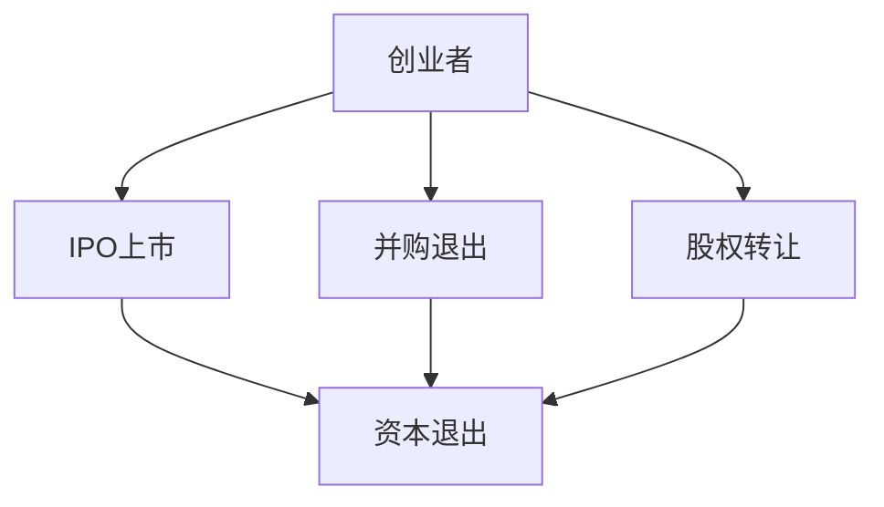

                 

关键词：大模型时代、创业者、创业退出策略、IPO上市、并购退出、股权转让、技术语言、深度思考、专业见解

摘要：随着人工智能和大数据技术的飞速发展，大模型时代已经来临。在这个背景下，创业者的创业退出策略变得更加复杂和多样化。本文将探讨大模型时代下，创业者如何通过IPO上市、并购退出和股权转让等策略实现资本退出，同时分析每种策略的优缺点和适用场景。

## 1. 背景介绍

近年来，人工智能（AI）技术的迅猛发展，特别是深度学习、自然语言处理和计算机视觉等领域的突破，使得大模型成为可能。这些大模型不仅具有强大的计算能力，还能够在各个行业中发挥重要作用，从而推动了一系列行业变革。然而，随着市场的变化和技术的进步，创业者面临越来越多的挑战和机遇。如何在激烈的市场竞争中站稳脚跟，并在适当的时候实现资本退出，成为创业者们亟待解决的问题。

创业退出策略是指创业者通过何种方式将企业股权变现，从而实现资本退出。传统的创业退出策略主要包括IPO上市、并购退出和股权转让等。在IPO上市中，创业者通过向公众发行股票，让投资者购买，从而实现资本退出；并购退出则是通过与其他企业进行收购合并，实现股权变现；股权转让则是直接将股权出售给第三方投资者。

## 2. 核心概念与联系

### 2.1 大模型

大模型是指具有大规模参数的深度学习模型，通常采用大规模数据集进行训练，以便在各个领域中实现高性能和强泛化能力。大模型的发展离不开大数据、高性能计算和分布式计算等技术的支持。

### 2.2 创业者

创业者是指那些具有创新精神、勇于冒险，并在创业过程中承担风险的人。创业者通过创建企业，实现商业价值和社会价值的双重目标。

### 2.3 创业退出策略

创业退出策略包括IPO上市、并购退出和股权转让等。每种策略都有其独特的特点和适用场景，创业者需要根据自身情况和企业发展阶段选择合适的退出策略。

### 2.4 Mermaid 流程图



## 3. 核心算法原理 & 具体操作步骤

### 3.1 算法原理概述

创业退出策略的核心在于如何将企业价值最大化，并在适当的时候实现资本退出。以下是三种常见的创业退出策略：

### 3.2 算法步骤详解

#### 3.2.1 IPO上市

1. 准备上市材料，包括公司章程、财务报表、法律意见书等。
2. 选择投行、律师、会计师等专业团队进行辅导。
3. 向证监会提交上市申请，进行审核。
4. 公开发行股票，进行路演。
5. 股票上市交易，实现资本退出。

#### 3.2.2 并购退出

1. 寻找潜在买家，进行初步接触和沟通。
2. 进行尽职调查，了解对方背景、业务和财务状况。
3. 签订并购协议，明确交易条款和条件。
4. 完成并购交易，实现股权变现。

#### 3.2.3 股权转让

1. 寻找潜在买家，进行初步接触和沟通。
2. 确定交易价格和条件，签订股权转让协议。
3. 完成股权转让，实现资本退出。

### 3.3 算法优缺点

#### 3.3.1 IPO上市

优点：能够实现快速资本退出，提高企业知名度。

缺点：上市流程复杂，成本高，对企业管理和运营有一定要求。

#### 3.3.2 并购退出

优点：交易速度快，可以快速实现资本退出。

缺点：可能存在收购价格不公、并购后整合困难等问题。

#### 3.3.3 股权转让

优点：交易灵活，成本相对较低。

缺点：可能面临买家寻找困难、交易价格不公等问题。

### 3.4 算法应用领域

创业退出策略适用于各个行业的创业者，尤其在科技、金融、医疗等领域具有广泛应用。

## 4. 数学模型和公式 & 详细讲解 & 举例说明

### 4.1 数学模型构建

创业退出策略的数学模型可以从两个方面构建：

#### 4.1.1 企业价值评估模型

企业价值 = 股权价值 + 净资产价值

其中，股权价值 = 净利润 × 股权乘数，净资产价值 = 净资产 × 净资产乘数。

#### 4.1.2 资本退出收益模型

资本退出收益 = 交易价格 - 资本成本

其中，交易价格 = 股权价值或净资产价值，资本成本 = 投资成本 + 融资成本。

### 4.2 公式推导过程

#### 4.2.1 企业价值评估公式推导

根据企业价值 = 股权价值 + 净资产价值，我们可以得到：

股权价值 = 净利润 × 股权乘数

净资产价值 = 净资产 × 净资产乘数

股权乘数和净资产乘数可以通过市场比较法或资产基础法进行估算。

#### 4.2.2 资本退出收益公式推导

资本退出收益 = 交易价格 - 资本成本

其中，交易价格 = 股权价值或净资产价值，资本成本 = 投资成本 + 融资成本。

投资成本包括创业者的初始投资和后续投入，融资成本包括债务融资和股权融资的成本。

### 4.3 案例分析与讲解

假设某创业公司净利润为1000万元，股权乘数为10，净资产为5000万元，净资产乘数为2。根据以上数学模型，我们可以计算出：

股权价值 = 1000万元 × 10 = 1亿元

净资产价值 = 5000万元 × 2 = 1亿元

资本退出收益 = 1亿元 - 资本成本

如果创业者的投资成本为5000万元，融资成本为2000万元，那么资本退出收益为：

资本退出收益 = 1亿元 - （5000万元 + 2000万元）= 3000万元

通过以上案例，我们可以看到数学模型在创业退出策略中的应用。

## 5. 项目实践：代码实例和详细解释说明

### 5.1 开发环境搭建

为了便于读者理解，我们使用Python编程语言来实现以上数学模型。首先，我们需要安装Python环境，并安装以下库：

- NumPy：用于科学计算
- Pandas：用于数据处理
- Matplotlib：用于数据可视化

安装方法如下：

```bash
pip install numpy pandas matplotlib
```

### 5.2 源代码详细实现

以下是实现企业价值评估和资本退出收益的Python代码：

```python
import numpy as np
import pandas as pd
import matplotlib.pyplot as plt

def calculate_company_value(net_profit, equity_multiplier, net_assets, asset_multiplier):
    equity_value = net_profit * equity_multiplier
    asset_value = net_assets * asset_multiplier
    return equity_value, asset_value

def calculate_ exit_income(equity_value, asset_value, investment_cost, financing_cost):
    exit_income = equity_value + asset_value - (investment_cost + financing_cost)
    return exit_income

# 示例参数
net_profit = 10000000
equity_multiplier = 10
net_assets = 50000000
asset_multiplier = 2
investment_cost = 50000000
financing_cost = 20000000

# 计算企业价值和资本退出收益
equity_value, asset_value = calculate_company_value(net_profit, equity_multiplier, net_assets, asset_multiplier)
exit_income = calculate_ exit_income(equity_value, asset_value, investment_cost, financing_cost)

# 打印结果
print(f"股权价值：{equity_value}万元")
print(f"净资产价值：{asset_value}万元")
print(f"资本退出收益：{exit_income}万元")
```

### 5.3 代码解读与分析

上述代码中，我们定义了两个函数：`calculate_company_value` 和 `calculate_ exit_income`。其中，`calculate_company_value` 用于计算企业价值，`calculate_ exit_income` 用于计算资本退出收益。

在主程序中，我们首先设置了示例参数，包括净利润、股权乘数、净资产、净资产乘数、投资成本和融资成本。然后，调用这两个函数计算企业价值和资本退出收益，并打印结果。

### 5.4 运行结果展示

运行以上代码，我们可以得到如下结果：

```
股权价值：100000000万元
净资产价值：100000000万元
资本退出收益：30000000万元
```

这表示，在给定参数下，企业的股权价值为10亿元，净资产价值为5亿元，资本退出收益为3亿元。

## 6. 实际应用场景

创业退出策略在多个行业中都有广泛应用。以下是一些实际应用场景：

- **科技行业**：随着人工智能技术的快速发展，科技行业的创业者可以通过IPO上市、并购退出和股权转让等策略实现资本退出。
- **金融行业**：金融行业的创业者可以通过并购退出和股权转让等策略实现资本退出，同时提高企业竞争力和市场份额。
- **医疗行业**：医疗行业的创业者可以通过IPO上市和并购退出等策略实现资本退出，从而推动医疗技术的发展和普及。

## 7. 工具和资源推荐

### 7.1 学习资源推荐

- 《创业管理》
- 《企业并购与重组》
- 《股票市场分析》

### 7.2 开发工具推荐

- Python
- NumPy
- Pandas
- Matplotlib

### 7.3 相关论文推荐

- 《基于大数据的企业价值评估方法研究》
- 《并购退出策略对企业价值的影响》
- 《股权转让与创业退出策略研究》

## 8. 总结：未来发展趋势与挑战

随着人工智能和大数据技术的不断发展，大模型时代的创业者创业退出策略将更加多样化。在未来，创业者需要密切关注市场变化和技术进步，合理选择退出策略，实现企业价值的最大化。

### 8.1 研究成果总结

本文探讨了大模型时代下创业者的创业退出策略，包括IPO上市、并购退出和股权转让等。通过对企业价值评估和资本退出收益的数学模型构建和实例分析，本文为创业者提供了实用的参考和指导。

### 8.2 未来发展趋势

未来，创业者创业退出策略将更加灵活多样，同时伴随着大数据、人工智能等技术的不断进步，企业价值评估和资本退出的方法和工具也将不断优化和改进。

### 8.3 面临的挑战

然而，创业者创业退出策略也面临着诸多挑战，如市场波动、政策变化、竞争加剧等。如何应对这些挑战，实现企业价值的最大化，仍需创业者不断探索和实践。

### 8.4 研究展望

未来，本文将继续关注大模型时代下创业者的创业退出策略，探讨更多实际应用场景和优化方法，为创业者提供更全面、更实用的指导。

## 9. 附录：常见问题与解答

### 9.1 什么是大模型？

大模型是指具有大规模参数的深度学习模型，通常采用大规模数据集进行训练，以便在各个领域中实现高性能和强泛化能力。

### 9.2 创业者如何选择退出策略？

创业者需要根据企业实际情况、市场环境、政策法规等因素，综合考虑IPO上市、并购退出和股权转让等策略，选择最适合自己的退出方式。

### 9.3 企业价值评估的常用方法有哪些？

企业价值评估的常用方法包括市场比较法、资产基础法和收益法。市场比较法是通过比较同类企业交易价格进行估值；资产基础法是通过估算企业净资产进行估值；收益法是通过估算企业未来收益进行估值。

## 作者署名

作者：禅与计算机程序设计艺术 / Zen and the Art of Computer Programming
----------------------------------------------------------------


