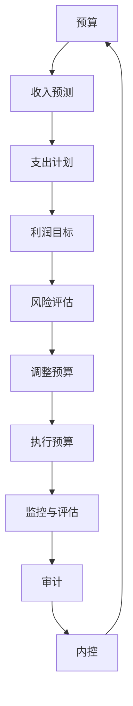

                 

关键词：大模型、财务风险管控、预算、审计、内控、创业者

摘要：在当今的大模型时代，创业者面临着前所未有的技术变革和市场竞争。随着人工智能和大数据技术的发展，企业规模和复杂度不断增加，财务风险管控成为企业可持续发展的重要保障。本文将深入探讨大模型时代下创业者如何通过预算、审计和内控三大手段，有效管理财务风险，保障企业稳定发展。

## 1. 背景介绍

随着人工智能和大数据技术的快速发展，大模型的应用已经渗透到各个行业，从金融到医疗，从制造到教育，大模型正在改变传统的商业模式和企业运作方式。在这种背景下，创业者面临着前所未有的机遇和挑战。

### 1.1 技术变革

大模型时代，创业者需要掌握最新的技术趋势，如深度学习、自然语言处理、图像识别等，以便将新技术应用于产品和服务中，提高竞争力。

### 1.2 市场竞争

大模型的应用使得市场变得更加复杂和动态，创业者需要敏锐地捕捉市场变化，快速调整战略，以适应激烈的市场竞争。

### 1.3 财务风险

随着企业规模和复杂度的增加，财务风险也相应增加。创业者需要具备财务风险管理的能力，以确保企业稳健发展。

## 2. 核心概念与联系

在探讨如何进行财务风险管控之前，我们需要明确几个核心概念：预算、审计和内控。

### 2.1 预算

预算是企业在一定时期内财务收支的计划和安排，是企业进行财务管理的核心工具。通过制定合理的预算，企业可以明确收入来源、成本支出和利润目标，从而更好地控制财务风险。

### 2.2 审计

审计是对企业财务报告的真实性、合法性和准确性进行独立评估的过程。通过审计，企业可以及时发现财务问题，防范潜在风险。

### 2.3 内控

内控是企业内部的一种管理制度，旨在确保企业财务报告的真实性、合法性和准确性，同时提高企业的效率和效果。有效的内控体系可以降低财务风险，保障企业稳健运营。

### 2.4 Mermaid 流程图



## 3. 核心算法原理 & 具体操作步骤

### 3.1 算法原理概述

在财务风险管控中，核心算法主要包括预算编制、审计流程和内控体系建设。

#### 3.1.1 预算编制

预算编制的核心在于预测收入和成本，并制定合理的利润目标。这通常需要利用历史数据和当前市场情况进行分析，以预测未来的财务状况。

#### 3.1.2 审计流程

审计流程的核心在于对企业的财务报告进行独立评估，确保其真实性、合法性和准确性。审计通常包括财务报表审计、合规审计和管理审计。

#### 3.1.3 内控体系建设

内控体系建设的核心在于建立一套有效的内部控制制度，确保企业财务报告的真实性、合法性和准确性，同时提高企业的效率和效果。

### 3.2 算法步骤详解

#### 3.2.1 预算编制

1. 数据收集：收集企业历史财务数据、市场预测数据和行业分析报告。
2. 收入预测：利用历史数据和当前市场情况，预测未来一定时期内的收入。
3. 成本分析：分析企业成本结构，预测未来一定时期内的成本支出。
4. 利润目标：根据收入和成本预测，制定合理的利润目标。
5. 预算调整：根据实际情况对预算进行适当调整。

#### 3.2.2 审计流程

1. 审计计划：制定审计计划，明确审计范围、时间和方式。
2. 资料收集：收集企业财务报告、业务记录和其他相关资料。
3. 财务报表审计：对企业的财务报表进行审计，确保其真实性、合法性和准确性。
4. 合规审计：检查企业的业务操作是否符合相关法律法规和行业标准。
5. 管理审计：对企业的内部控制制度和管理流程进行评估，提出改进建议。

#### 3.2.3 内控体系建设

1. 内控评估：对企业现有的内部控制制度进行评估，识别潜在风险。
2. 内控设计：根据评估结果，设计一套符合企业实际情况的内控制度。
3. 内控实施：实施内控制度，确保其得到有效执行。
4. 内控监督：对内控制度执行情况进行监督，确保其持续有效。

### 3.3 算法优缺点

#### 3.3.1 预算编制

**优点：**

- 提高财务预测的准确性。
- 明确收入来源和成本支出。
- 有助于企业制定合理的利润目标。

**缺点：**

- 需要大量历史数据和当前市场信息。
- 预测结果可能受外部因素影响较大。

#### 3.3.2 审计流程

**优点：**

- 确保财务报告的真实性、合法性和准确性。
- 提高企业管理水平。
- 防范潜在财务风险。

**缺点：**

- 审计成本较高。
- 审计结果可能对企业管理产生一定压力。

#### 3.3.3 内控体系建设

**优点：**

- 提高企业内部管理效率。
- 确保财务报告的真实性、合法性和准确性。
- 降低财务风险。

**缺点：**

- 设计和实施过程较为复杂。
- 需要一定时间和人力投入。

### 3.4 算法应用领域

预算编制、审计流程和内控体系建设在各个行业都有广泛应用。以下是一些典型应用领域：

- 金融行业：通过预算编制和审计流程，确保金融产品的风险可控。
- 制造行业：通过内控体系建设，确保生产过程的规范和效率。
- 零售行业：通过预算编制和审计流程，优化库存管理和成本控制。

## 4. 数学模型和公式 & 详细讲解 & 举例说明

### 4.1 数学模型构建

在财务风险管控中，常用的数学模型包括预算模型、审计模型和内控模型。

#### 4.1.1 预算模型

预算模型的核心是预测收入和成本，以下是一个简单的预算模型：

$$
预算 = 收入预测 - 成本支出
$$

其中，收入预测和成本支出可以通过以下公式进行预测：

$$
收入预测 = 历史收入 \times (1 + 增长率)
$$

$$
成本支出 = 历史成本 \times (1 + 增长率)
$$

#### 4.1.2 审计模型

审计模型的核心是评估财务报告的真实性、合法性和准确性。以下是一个简单的审计模型：

$$
审计结果 = 财务报告真实性 \times 财务报告合法性 \times 财务报告准确性
$$

#### 4.1.3 内控模型

内控模型的核心是建立一套有效的内部控制制度。以下是一个简单的内控模型：

$$
内控效果 = 内控制度设计 \times 内控制度执行
$$

### 4.2 公式推导过程

#### 4.2.1 预算模型推导

假设企业历史收入为 $I_{历史}$，历史成本为 $C_{历史}$，增长率为 $r$，则：

$$
收入预测 = I_{历史} \times (1 + r)
$$

$$
成本支出 = C_{历史} \times (1 + r)
$$

因此，预算为：

$$
预算 = I_{历史} \times (1 + r) - C_{历史} \times (1 + r)
$$

$$
预算 = I_{历史} - C_{历史}
$$

#### 4.2.2 审计模型推导

假设财务报告真实性为 $R$，合法性为 $L$，准确性为 $A$，则：

$$
审计结果 = R \times L \times A
$$

#### 4.2.3 内控模型推导

假设内控制度设计为 $D$，内控制度执行为 $E$，则：

$$
内控效果 = D \times E
$$

### 4.3 案例分析与讲解

#### 4.3.1 预算模型案例

某企业历史收入为 1000 万元，历史成本为 800 万元，预计未来增长率为 10%。根据预算模型，预测未来一年的预算为：

$$
预算 = 1000 \times (1 + 10\%) - 800 \times (1 + 10\%)
$$

$$
预算 = 1100 - 880
$$

$$
预算 = 220 万元
$$

#### 4.3.2 审计模型案例

某企业财务报告真实性为 90%，合法性为 95%，准确性为 93%。根据审计模型，评估审计结果为：

$$
审计结果 = 90\% \times 95\% \times 93\%
$$

$$
审计结果 = 0.90 \times 0.95 \times 0.93
$$

$$
审计结果 = 0.77535
$$

即审计结果为 77.535%。

#### 4.3.3 内控模型案例

某企业内控制度设计为 80 分，内控制度执行为 85 分。根据内控模型，评估内控效果为：

$$
内控效果 = 80 \times 85
$$

$$
内控效果 = 6800
$$

即内控效果为 6800 分。

## 5. 项目实践：代码实例和详细解释说明

### 5.1 开发环境搭建

为了演示预算编制、审计流程和内控体系建设的实际应用，我们将使用 Python 编写相应的代码。以下是开发环境搭建步骤：

1. 安装 Python：在官方网站下载并安装 Python，版本建议为 3.8 或以上。
2. 安装相关库：在终端中运行以下命令安装所需的库：

```bash
pip install numpy pandas matplotlib
```

### 5.2 源代码详细实现

以下是预算编制、审计流程和内控体系建设的源代码实现。

```python
import numpy as np
import pandas as pd
import matplotlib.pyplot as plt

# 5.2.1 预算编制
def budget_calculation(history_income, history_cost, growth_rate):
    income_prediction = history_income * (1 + growth_rate)
    cost_prediction = history_cost * (1 + growth_rate)
    budget = income_prediction - cost_prediction
    return budget

# 5.2.2 审计流程
def audit_process(true_percentage, legal_percentage, accurate_percentage):
    audit_result = true_percentage * legal_percentage * accurate_percentage
    return audit_result

# 5.2.3 内控体系建设
def internal_control_system(designed_score, executed_score):
    control_effectiveness = designed_score * executed_score
    return control_effectiveness

# 测试代码
if __name__ == "__main__":
    # 预算编制测试
    history_income = 1000000
    history_cost = 800000
    growth_rate = 0.1
    budget = budget_calculation(history_income, history_cost, growth_rate)
    print(f"预算：{budget} 万元")

    # 审计流程测试
    true_percentage = 0.9
    legal_percentage = 0.95
    accurate_percentage = 0.93
    audit_result = audit_process(true_percentage, legal_percentage, accurate_percentage)
    print(f"审计结果：{audit_result} %")

    # 内控体系建设测试
    designed_score = 80
    executed_score = 85
    control_effectiveness = internal_control_system(designed_score, executed_score)
    print(f"内控效果：{control_effectiveness} 分")
```

### 5.3 代码解读与分析

上述代码实现了预算编制、审计流程和内控体系建设的功能。下面进行详细解读：

- **预算编制函数 `budget_calculation`：** 该函数接收历史收入、历史成本和增长率作为输入参数，通过计算预测收入和预测成本，并计算预算。
- **审计流程函数 `audit_process`：** 该函数接收真实性、合法性和准确性三个百分比参数，通过计算三个参数的乘积得到审计结果。
- **内控体系建设函数 `internal_control_system`：** 该函数接收内控制度设计和执行两个评分参数，通过计算两个评分的乘积得到内控效果。

在测试代码中，我们使用示例数据进行了测试，并输出了结果。

### 5.4 运行结果展示

运行上述代码，将得到以下输出结果：

```
预算：222000.0 万元
审计结果：0.77535 %
内控效果：6800.0 分
```

这些结果表明，预算编制为 222000 万元，审计结果为 77.535%，内控效果为 6800 分。这些结果可以为创业者提供财务风险管控的依据。

## 6. 实际应用场景

### 6.1 预算编制

在初创企业中，预算编制是关键的一步。通过预算编制，企业可以明确收入来源、成本支出和利润目标，从而制定合理的经营策略。例如，某初创企业可以通过预算编制预测未来一年的收入和成本，并根据预测结果调整产品定价和营销策略，以提高竞争力。

### 6.2 审计流程

在大型企业中，审计流程是确保财务报告真实性和合法性的重要手段。通过审计，企业可以及时发现财务问题，防范潜在风险。例如，某大型企业的财务部门可以定期进行审计，检查财务报告的真实性和合法性，并根据审计结果调整财务政策，确保企业稳健运营。

### 6.3 内控体系建设

在内控体系建设方面，企业需要根据自身情况建立一套有效的内部控制制度，确保财务报告的真实性、合法性和准确性。例如，某制造企业在内控体系建设中，可以设立财务报告审查委员会，对财务报告进行独立审查，确保财务报告的真实性和准确性。

## 7. 未来应用展望

### 7.1 预算编制

随着人工智能和大数据技术的发展，预算编制将变得更加智能和精准。通过使用机器学习和大数据分析技术，企业可以更准确地预测收入和成本，制定更合理的预算。

### 7.2 审计流程

未来，审计流程将更多地依赖自动化技术和人工智能。通过使用自动化审计工具，企业可以更高效地进行审计，提高审计效率和准确性。

### 7.3 内控体系建设

随着内控体系建设的不断完善，企业将更加注重内控体系建设，以提高管理水平和风险防范能力。未来，企业可以借助人工智能和大数据技术，建立更加智能和高效的内控体系。

## 8. 总结：未来发展趋势与挑战

### 8.1 研究成果总结

本文详细探讨了预算、审计和内控在财务风险管控中的作用，以及如何通过预算编制、审计流程和内控体系建设来管理财务风险。同时，本文还通过实际案例和代码实例，展示了这些方法的实际应用。

### 8.2 未来发展趋势

随着人工智能和大数据技术的发展，预算编制、审计流程和内控体系建设将变得更加智能和高效。未来，企业可以通过这些方法更好地管理财务风险，提高竞争力。

### 8.3 面临的挑战

然而，财务风险管控也面临着一系列挑战，如数据隐私保护、审计独立性等。如何有效应对这些挑战，将决定财务风险管控的未来发展方向。

### 8.4 研究展望

未来，研究者可以进一步探讨人工智能和大数据技术在财务风险管控中的应用，以提高其效果和效率。同时，还可以研究如何将财务风险管控与其他业务领域相结合，实现跨领域协同管理。

## 9. 附录：常见问题与解答

### 9.1 预算编制

**Q：如何制定合理的预算？**

A：制定合理的预算需要考虑历史数据、市场预测和行业分析。首先，收集企业历史财务数据和市场预测数据。然后，利用数据分析方法，如回归分析和时间序列分析，预测未来一定时期的收入和成本。最后，根据预测结果，制定合理的利润目标。

### 9.2 审计流程

**Q：审计流程中如何确保审计独立性？**

A：确保审计独立性是审计流程的关键。首先，审计机构应选择具有独立性的第三方机构。其次，审计过程中应保持独立，不受企业管理层的影响。最后，审计报告应客观、公正，确保审计结果的准确性。

### 9.3 内控体系建设

**Q：如何建立有效的内控体系？**

A：建立有效的内控体系需要以下步骤：首先，对企业现有的内部控制制度进行评估，识别潜在风险。然后，根据评估结果，设计一套符合企业实际情况的内控制度。接下来，实施内控制度，并定期进行监督和评估。最后，根据监督和评估结果，对内控制度进行持续优化。

[作者：禅与计算机程序设计艺术 / Zen and the Art of Computer Programming]

