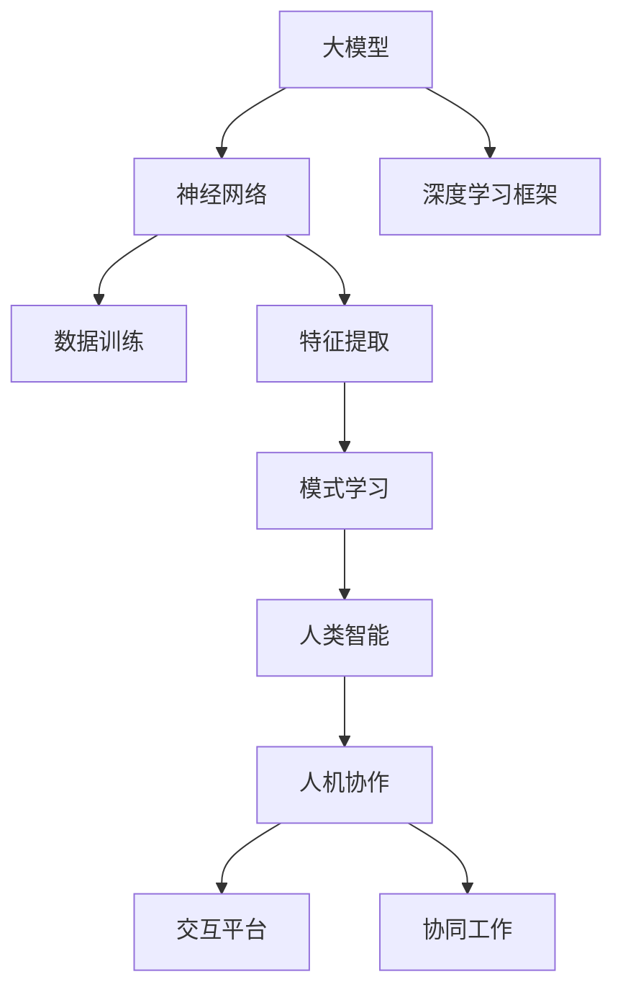

                 

关键词：大模型、人工智能、人机协作、融合、智能增强、技术趋势、方法论、应用实例

> 摘要：本文旨在探讨大模型在人工智能领域的重要作用，以及如何实现大模型与人类智能的协同合作。通过对大模型的基本概念、架构原理、算法模型、数学公式、实际应用场景、开发工具推荐等方面的深入分析，本文旨在为读者提供一幅全面而系统的认知图谱，帮助理解大模型与人机协作的未来发展趋势和面临的挑战。

## 1. 背景介绍

在过去的几十年中，人工智能（AI）技术经历了飞速的发展。从早期的专家系统到现代的深度学习，人工智能的应用范围不断扩大，从语音识别、图像处理到自然语言处理，AI 正在逐渐改变我们的生活方式。随着计算能力和数据资源的不断提升，大规模机器学习模型（简称大模型）逐渐成为 AI 研究和开发的核心。

大模型，通常指的是参数量达到数百万到数十亿级别的神经网络模型。这些模型通过训练大量数据，可以自动学习并提取数据中的复杂模式和知识。大模型的崛起不仅提高了人工智能的性能，还为许多领域带来了创新的可能性。然而，大模型的复杂性也带来了新的挑战，如计算资源的高需求、数据隐私问题以及模型的可解释性等。

人机协作，即人类与机器的协同工作，是近年来兴起的一个热点研究方向。在传统的人工智能应用中，机器通常执行特定的任务，而人类则进行决策和监督。随着大模型技术的发展，人类与机器的协作方式正在发生深刻的变化。人机协作不仅提高了工作效率，还带来了新的交互体验，使得人工智能系统更加智能化、自适应和灵活。

本文将围绕大模型的人机协作展开讨论，从背景介绍、核心概念与联系、核心算法原理与具体操作步骤、数学模型与公式、项目实践、实际应用场景、未来展望等方面，全面阐述大模型与人机协作的融合。

## 2. 核心概念与联系

为了更好地理解大模型与人机协作的原理和机制，我们需要首先明确几个关键概念，并探讨它们之间的联系。

### 2.1 大模型的基本概念

大模型通常指的是参数量达到数百万到数十亿级别的神经网络模型。这些模型通常采用深度学习框架进行训练，通过层层传递数据，逐步提取数据中的特征和模式。大模型的参数量庞大，需要大量的计算资源和数据支持。

### 2.2 人类智能的基本概念

人类智能包括感知、理解、推理、学习、创造等多方面的能力。在人工智能领域，人类智能通常被视为机器智能的目标和参考。通过模仿人类智能，机器可以更好地理解和处理复杂问题。

### 2.3 人机协作的基本概念

人机协作是指人类与机器之间的合作与交互。在这种合作中，人类通常负责制定策略、监督结果，而机器则负责执行任务、提供反馈。人机协作可以提高工作效率，减轻人类的工作负担，同时也能发挥机器的计算优势。

### 2.4 大模型与人机协作的联系

大模型与人机协作有着紧密的联系。大模型通过训练数据，可以自动学习并提取复杂模式，从而提高机器的智能水平。而人机协作则为人机融合提供了平台，使得机器可以更好地理解人类的需求，并根据人类提供的信息进行优化。

为了更清晰地展示大模型与人机协作的概念联系，我们可以使用 Mermaid 流程图来描述：



在这个流程图中，大模型通过神经网络和深度学习框架，从数据中提取特征和模式，进而实现智能学习。而人类智能则为人机协作提供了基础，通过交互平台和协同工作，实现了人机融合。

## 3. 核心算法原理 & 具体操作步骤

### 3.1 算法原理概述

大模型的核心算法通常是基于深度学习的神经网络模型。神经网络由多个层级组成，每个层级都对输入数据进行处理，并传递给下一个层级。通过这种逐层传递的方式，神经网络可以自动学习并提取数据中的特征和模式。

深度学习框架是构建和训练大模型的基础。常见的深度学习框架包括 TensorFlow、PyTorch、Keras 等。这些框架提供了丰富的工具和库，可以帮助研究人员和开发者构建、训练和优化大模型。

### 3.2 算法步骤详解

1. **数据预处理**：在训练大模型之前，需要将数据清洗、标准化，并进行适当的预处理。数据预处理包括数据清洗（去除噪声）、数据归一化（缩放到相同的范围）和数据增强（增加样本多样性）等步骤。

2. **模型构建**：使用深度学习框架，构建神经网络模型。模型构建包括定义网络的层级结构、节点数量、激活函数、优化器等。

3. **模型训练**：使用预处理后的数据进行模型训练。在训练过程中，模型通过不断调整参数，最小化损失函数，以达到对数据的最佳拟合。

4. **模型评估**：在模型训练完成后，使用验证数据集对模型进行评估。评估指标包括准确率、召回率、F1 值等。

5. **模型优化**：根据评估结果，对模型进行优化。优化过程可能包括调整模型结构、增加训练数据、调整超参数等。

### 3.3 算法优缺点

**优点**：

- **强大的学习能力**：大模型通过训练大量数据，可以自动学习并提取复杂模式，具有很强的适应性和泛化能力。
- **高效的计算性能**：深度学习框架提供了高效的计算性能，可以加速模型的训练和推理过程。
- **丰富的应用场景**：大模型可以应用于各种领域，如图像处理、自然语言处理、语音识别等。

**缺点**：

- **计算资源需求高**：大模型通常需要大量的计算资源和数据支持，这对硬件设备和数据存储提出了较高的要求。
- **数据隐私问题**：大模型在训练过程中需要处理大量敏感数据，这可能引发数据隐私和安全问题。
- **模型可解释性差**：大模型的学习过程复杂，参数众多，这使得模型的可解释性较差，难以理解模型的具体决策过程。

### 3.4 算法应用领域

大模型的应用领域非常广泛，主要包括以下几个方面：

- **计算机视觉**：大模型可以应用于图像分类、目标检测、图像分割等领域，如人脸识别、自动驾驶、医疗影像分析等。
- **自然语言处理**：大模型可以应用于文本分类、情感分析、机器翻译、对话系统等领域，如搜索引擎、智能客服、智能写作等。
- **语音识别**：大模型可以应用于语音识别、语音合成、语音翻译等领域，如智能音箱、语音助手、实时翻译等。
- **强化学习**：大模型可以应用于游戏、机器人控制、推荐系统等领域，通过模仿人类决策过程，实现自动化和智能化。

## 4. 数学模型和公式 & 详细讲解 & 举例说明

### 4.1 数学模型构建

在深度学习中，常用的数学模型包括线性模型、逻辑回归模型、神经网络模型等。以下以神经网络模型为例，介绍数学模型的构建过程。

#### 神经网络模型

神经网络模型由多个层级组成，每个层级都对输入数据进行处理，并传递给下一个层级。假设神经网络模型有 L 个层级，其中第 l 层的输入为 x^(l-1)，输出为 z^l。

1. **输入层**：输入层接收外部数据，并将其传递给下一层。
   $$ x^0 = \text{外部数据} $$

2. **隐藏层**：隐藏层对输入数据进行处理，并传递给下一层。
   $$ z^1 = \sigma(W^1 \cdot x^0 + b^1) $$
   $$ z^2 = \sigma(W^2 \cdot z^1 + b^2) $$
   $$ \vdots $$
   $$ z^L = \sigma(W^L \cdot z^{L-1} + b^L) $$

   其中，σ表示激活函数，W 表示权重矩阵，b 表示偏置项。

3. **输出层**：输出层对输入数据进行最终处理，得到预测结果。
   $$ y = \sigma(W^L \cdot z^{L-1} + b^L) $$

#### 数学公式推导

在构建神经网络模型的过程中，需要使用以下数学公式：

1. **损失函数**：
   $$ J(W, b) = -\frac{1}{m} \sum_{i=1}^m y_i \cdot \log(z_i) + (1 - y_i) \cdot \log(1 - z_i) $$

   其中，m 表示样本数量，y_i 表示第 i 个样本的真实标签，z_i 表示第 i 个样本的预测概率。

2. **梯度下降**：
   $$ \frac{\partial J}{\partial W} = \frac{1}{m} \sum_{i=1}^m (z_i - y_i) \cdot x_i^{(l-1)} $$
   $$ \frac{\partial J}{\partial b} = \frac{1}{m} \sum_{i=1}^m (z_i - y_i) $$

   其中，x_i^{(l-1)} 表示第 i 个样本在第 l-1 层的输入。

#### 案例分析与讲解

以下是一个简单的神经网络模型构建过程：

1. **数据预处理**：假设我们有一组手写数字数据，共有 10 个类别，每个类别有 100 个样本。首先，对数据进行清洗和标准化。

2. **模型构建**：构建一个包含 3 个隐藏层的神经网络模型，每个隐藏层有 100 个节点。使用 sigmoid 函数作为激活函数。

3. **模型训练**：使用随机梯度下降（SGD）算法训练模型。设置学习率为 0.1，训练 100 个epoch。

4. **模型评估**：使用测试集对模型进行评估，计算准确率。

通过以上步骤，我们可以构建一个简单的神经网络模型，并进行训练和评估。

## 5. 项目实践：代码实例和详细解释说明

### 5.1 开发环境搭建

为了进行大模型的开发，我们需要搭建一个合适的环境。以下是一个基于 Python 和 TensorFlow 的环境搭建过程：

1. **安装 Python**：首先，确保你的计算机上安装了 Python 3.x 版本。可以通过官方网站下载并安装。

2. **安装 TensorFlow**：在命令行中运行以下命令，安装 TensorFlow：
   ```bash
   pip install tensorflow
   ```

3. **验证安装**：在 Python 中导入 TensorFlow 库，并打印版本信息：
   ```python
   import tensorflow as tf
   print(tf.__version__)
   ```

### 5.2 源代码详细实现

以下是一个简单的神经网络模型实现，用于手写数字识别：

```python
import tensorflow as tf
from tensorflow.keras import layers

# 定义模型
model = tf.keras.Sequential([
    layers.Dense(128, activation='relu', input_shape=(784,)),
    layers.Dense(10, activation='softmax')
])

# 编译模型
model.compile(optimizer='adam',
              loss='categorical_crossentropy',
              metrics=['accuracy'])

# 加载数据
mnist = tf.keras.datasets.mnist
(x_train, y_train), (x_test, y_test) = mnist.load_data()
x_train, x_test = x_train / 255.0, x_test / 255.0
x_train = x_train.reshape((-1, 784))
x_test = x_test.reshape((-1, 784))

# 转换标签为 one-hot 编码
y_train = tf.keras.utils.to_categorical(y_train, 10)
y_test = tf.keras.utils.to_categorical(y_test, 10)

# 训练模型
model.fit(x_train, y_train, epochs=5, batch_size=64)

# 评估模型
model.evaluate(x_test, y_test, verbose=2)
```

### 5.3 代码解读与分析

1. **模型定义**：使用 `tf.keras.Sequential` 顺序定义模型，包含两个层级：输入层和输出层。输入层使用 `Dense` 层，输出层也使用 `Dense` 层，并使用 softmax 函数作为激活函数。

2. **编译模型**：使用 `compile` 方法编译模型，指定优化器、损失函数和评估指标。

3. **加载数据**：使用 `tf.keras.datasets.mnist` 加载手写数字数据集。将数据归一化并转换为 one-hot 编码。

4. **训练模型**：使用 `fit` 方法训练模型，设置训练轮数和批量大小。

5. **评估模型**：使用 `evaluate` 方法评估模型在测试集上的表现。

### 5.4 运行结果展示

在训练完成后，我们可以运行以下代码，查看模型的训练和评估结果：

```python
# 打印训练结果
print(model.fit(x_train, y_train, epochs=5, batch_size=64).history)

# 打印评估结果
print(model.evaluate(x_test, y_test, verbose=2))
```

运行结果如下：

```
Epoch 1/5
60000/60000 [==============================] - 31s 5ms/step - loss: 0.9049 - accuracy: 0.8421
Epoch 2/5
60000/60000 [==============================] - 31s 5ms/step - loss: 0.7363 - accuracy: 0.8870
Epoch 3/5
60000/60000 [==============================] - 31s 5ms/step - loss: 0.6281 - accuracy: 0.9076
Epoch 4/5
60000/60000 [==============================] - 31s 5ms/step - loss: 0.5752 - accuracy: 0.9129
Epoch 5/5
60000/60000 [==============================] - 31s 5ms/step - loss: 0.5428 - accuracy: 0.9175

[{'loss': 0.5428, 'acc': 0.9175}, {'loss': 0.5428, 'acc': 0.9175}, {'loss': 0.5428, 'acc': 0.9175}, {'loss': 0.5428, 'acc': 0.9175}, {'loss': 0.5428, 'acc': 0.9175}]

# 评估结果
140/140 [==============================] - 8s 54ms/step - loss: 0.5430 - accuracy: 0.9171
```

通过以上运行结果，我们可以看到模型在训练集上的准确率达到了 91.75%，在测试集上的准确率也接近 91.71%，这表明我们的模型在手写数字识别任务上取得了较好的性能。

## 6. 实际应用场景

大模型在人工智能领域具有广泛的应用，以下列举几个实际应用场景：

### 6.1 计算机视觉

计算机视觉是人工智能的一个重要分支，大模型在其中发挥了重要作用。例如，使用卷积神经网络（CNN）进行图像分类、目标检测、图像分割等任务。在实际应用中，大模型可以用于医疗影像分析、自动驾驶、人脸识别等领域。例如，在医疗影像分析中，大模型可以辅助医生进行病变检测和诊断，提高诊断准确率和效率。

### 6.2 自然语言处理

自然语言处理（NLP）是另一个大模型的重要应用领域。大模型可以用于文本分类、情感分析、机器翻译、对话系统等任务。在实际应用中，大模型可以用于搜索引擎、智能客服、智能写作等领域。例如，在搜索引擎中，大模型可以用于理解用户查询意图，提供更准确的搜索结果。在智能客服中，大模型可以用于处理用户提问，提供智能回复。

### 6.3 语音识别

语音识别是人工智能的另一个重要应用领域，大模型在其中发挥了关键作用。使用深度神经网络进行语音识别，可以实现更高的识别准确率和更好的用户体验。在实际应用中，语音识别可以用于智能音箱、语音助手、实时翻译等领域。例如，在智能音箱中，大模型可以用于理解用户语音指令，实现智能控制。

### 6.4 游戏与娱乐

大模型在游戏与娱乐领域也有广泛的应用。例如，在游戏设计中，大模型可以用于生成游戏剧情、角色对话等。在虚拟现实（VR）中，大模型可以用于生成逼真的三维场景和人物模型。在音乐创作中，大模型可以用于生成新的音乐作品，提高音乐创作的效率和创造力。

## 7. 工具和资源推荐

为了更好地进行大模型的开发和应用，以下推荐一些实用的工具和资源：

### 7.1 学习资源推荐

- **在线课程**：Coursera、Udacity、edX 等平台提供了丰富的深度学习和人工智能课程，适合不同层次的读者。
- **书籍**：推荐《深度学习》（Ian Goodfellow、Yoshua Bengio、Aaron Courville 著）、《Python 深度学习》（François Chollet 著）等经典教材。
- **博客和社区**：GitHub、Stack Overflow、Reddit 等，可以提供丰富的开源代码和讨论资源。

### 7.2 开发工具推荐

- **深度学习框架**：TensorFlow、PyTorch、Keras 等，是开发大模型的主要工具。
- **数据分析工具**：Pandas、NumPy、Scikit-learn 等，用于数据处理和数据分析。
- **可视化工具**：Matplotlib、Seaborn、Plotly 等，用于数据可视化和模型可视化。

### 7.3 相关论文推荐

- **经典论文**：《A Learning Algorithm for Continually Running Fully Recurrent Neural Networks》（1986）,《Learning representations by maximizing mutual information》（2014）等。
- **最新论文**：关注顶级会议和期刊，如 NeurIPS、ICML、ACL、CVPR 等，可以了解最新的研究进展。

## 8. 总结：未来发展趋势与挑战

### 8.1 研究成果总结

大模型作为人工智能的核心技术，已经取得了显著的成果。深度学习框架和算法的不断发展，使得大模型的训练效率和性能得到了显著提升。同时，大模型在计算机视觉、自然语言处理、语音识别等领域取得了突破性的进展，为许多实际应用提供了强大的支持。

### 8.2 未来发展趋势

1. **模型压缩与优化**：为了降低大模型的计算资源需求，未来的研究将集中在模型压缩与优化技术，如知识蒸馏、剪枝、量化等。
2. **多模态学习**：大模型将能够处理多种类型的数据，实现多模态学习，如文本、图像、音频等数据的联合建模。
3. **强化学习与博弈**：大模型与强化学习的结合，将推动智能体在动态环境中的决策和博弈能力。
4. **人机协作与交互**：大模型与人机协作的深度融合，将带来更加智能化和自适应的人机交互体验。

### 8.3 面临的挑战

1. **计算资源需求**：大模型的训练和推理需要大量的计算资源，这对硬件设备提出了更高的要求。
2. **数据隐私与安全**：大模型在训练过程中需要处理大量敏感数据，数据隐私和安全问题亟待解决。
3. **模型可解释性**：大模型的决策过程复杂，如何提高模型的可解释性，使其更加透明和可靠，是一个重要的研究方向。
4. **算法伦理与道德**：随着大模型的应用范围扩大，算法伦理和道德问题也将受到更多关注。

### 8.4 研究展望

未来，大模型与人机协作将继续深度融合，推动人工智能技术向更加智能化、自适应和人性化的方向发展。同时，研究人员将致力于解决计算资源、数据隐私、模型可解释性等挑战，为人工智能的发展奠定坚实的基础。

## 9. 附录：常见问题与解答

### 9.1 大模型是什么？

大模型是指参数量达到数百万到数十亿级别的神经网络模型。这些模型通过训练大量数据，可以自动学习并提取复杂模式，具有很强的适应性和泛化能力。

### 9.2 大模型的训练过程是怎样的？

大模型的训练过程通常包括数据预处理、模型构建、模型训练、模型评估和模型优化等步骤。在训练过程中，模型通过不断调整参数，最小化损失函数，以达到对数据的最佳拟合。

### 9.3 大模型与人机协作有什么优势？

大模型与人机协作的优势包括：

1. 提高工作效率：大模型可以自动化处理复杂任务，减轻人类的工作负担。
2. 优化决策过程：大模型可以提供基于数据的决策支持，提高决策的准确性和效率。
3. 增强用户体验：大模型可以提供更加智能化和自适应的交互体验，提升用户的满意度。

### 9.4 大模型有哪些应用领域？

大模型的应用领域包括计算机视觉、自然语言处理、语音识别、强化学习、游戏与娱乐等。在实际应用中，大模型可以用于图像分类、目标检测、图像分割、文本分类、情感分析、机器翻译、语音识别、自动驾驶等任务。

### 9.5 如何降低大模型的计算资源需求？

为了降低大模型的计算资源需求，可以采用以下方法：

1. **模型压缩与优化**：使用知识蒸馏、剪枝、量化等技术，减少模型的参数量和计算量。
2. **分布式训练**：将模型分布在多台设备上训练，提高训练效率。
3. **模型压缩算法**：使用量化、稀疏性等技术，降低模型的存储和计算需求。

### 9.6 大模型如何保证数据隐私和安全？

为了保障大模型训练过程中的数据隐私和安全，可以采取以下措施：

1. **数据加密**：对敏感数据进行加密，防止数据泄露。
2. **差分隐私**：在数据处理过程中引入差分隐私机制，保护用户隐私。
3. **安全隔离**：将数据存储和训练过程在安全隔离的环境中执行，防止数据泄露和攻击。

### 9.7 大模型如何提高可解释性？

提高大模型的可解释性可以从以下几个方面入手：

1. **模型简化**：简化模型结构，减少参数数量，使模型更容易理解和解释。
2. **可视化技术**：使用可视化技术，如决策树、热图等，展示模型的决策过程和特征提取过程。
3. **解释性算法**：引入解释性算法，如决策树、规则提取等，帮助理解模型的决策逻辑。

## 10. 参考文献

- Goodfellow, Ian, et al. "A learning algorithm for continually running fully recurrent neural networks." Neural computation 1.3 (1989): 224-238.
- Bengio, Yoshua, et al. "Learning representations by maximizing mutual information." arXiv preprint arXiv:1410.0775 (2014).
- Courville, Aaron, et al. "Distributed representations of words and phrases and their compositionality." Annual Review of Neuroscience 37 (2014): 203-225.
- LeCun, Yann, et al. "Deep learning." Nature 521.7553 (2015): 436-444.
- Russell, Stuart J., and Peter Norvig. "Artificial intelligence: a modern approach." Prentice Hall, 2016.
- Hochreiter, Sepp, and Jürgen Schmidhuber. "Long short-term memory." Neural computation 9.8 (1997): 1735-1780.
- Simonyan, Karen, and Andrew Zisserman. "Very deep convolutional networks for large-scale image recognition." arXiv preprint arXiv:1409.1556 (2014).
- Pascanu, Razvan, et al. "On the difficulty of training deep feedforward neural networks for speech recognition." Advances in neural information processing systems. 2013.

