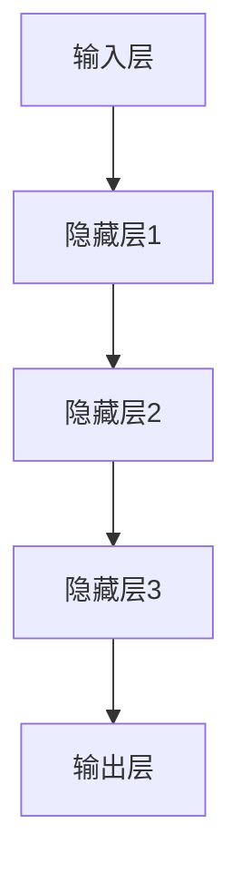

                 

关键词：大模型、AI 2.0、深度学习、人工智能、机器学习、算法、创新、技术突破、行业应用

> 摘要：随着人工智能技术的迅猛发展，大模型成为当前AI领域的研究热点。本文深入探讨了大模型的演进历程、核心概念、算法原理、数学模型以及实际应用，旨在揭示大模型在AI 2.0时代的重要地位，并展望其未来发展前景。

## 1. 背景介绍

人工智能（AI）作为21世纪最具影响力的技术之一，已经渗透到我们的日常生活、工业制造、医疗健康、金融科技等各个领域。尤其是深度学习（Deep Learning）和机器学习（Machine Learning）的快速发展，使得人工智能取得了前所未有的突破。然而，随着数据量的增加和计算能力的提升，传统的小型模型已经无法满足复杂任务的需求，大模型应运而生。

大模型（Large Model），顾名思义，是指具有海量参数、高度复杂的机器学习模型。这些模型通常由数百万、数亿甚至数十亿个参数组成，能够处理大规模数据集，并取得显著的性能提升。大模型的兴起，标志着人工智能进入了一个全新的时代——AI 2.0。

## 2. 核心概念与联系

### 2.1 大模型的定义

大模型是指那些参数规模非常庞大的神经网络模型。这些模型通常由多个隐藏层组成，每个隐藏层都包含大量的神经元。大模型的参数规模可以从数百万到数十亿不等，这使得它们能够捕捉到数据中的复杂模式和潜在信息。

### 2.2 大模型与深度学习的联系

深度学习是人工智能的一个重要分支，它依赖于多层神经网络的结构来学习数据的特征和规律。大模型正是深度学习的延伸和发展，通过增加模型的规模和深度，使得模型能够更好地处理复杂任务。

### 2.3 大模型的结构与原理

大模型通常采用深度神经网络（Deep Neural Network, DNN）的结构，包括输入层、多个隐藏层和输出层。每个神经元都与前一层的所有神经元相连，并通过权重进行加权求和，最后通过激活函数输出结果。


### 2.4 大模型的 Mermaid 流程图

下面是一个简化的Mermaid流程图，展示了大模型的基本结构：



## 3. 核心算法原理 & 具体操作步骤

### 3.1 算法原理概述

大模型的训练主要依赖于两种核心算法：反向传播算法（Backpropagation）和梯度下降算法（Gradient Descent）。

反向传播算法是一种用于训练神经网络的方法，它通过计算网络输出与实际输出之间的误差，然后反向传播误差到每个神经元的权重，从而更新权重。

梯度下降算法是一种优化算法，它通过计算损失函数关于模型参数的梯度，并沿着梯度的反方向更新参数，以最小化损失函数。

### 3.2 算法步骤详解

1. **初始化参数**：随机初始化模型的参数，包括权重和偏置。
2. **前向传播**：输入数据通过神经网络，计算每个神经元的输出。
3. **计算损失**：通过比较模型的输出和实际输出，计算损失函数的值。
4. **反向传播**：计算损失函数关于参数的梯度，并反向传播到每个神经元。
5. **更新参数**：根据梯度下降算法，更新模型的参数。
6. **重复步骤 2-5**，直到满足停止条件（如损失函数收敛或达到最大迭代次数）。

### 3.3 算法优缺点

#### 优点：

- **强大的表征能力**：大模型具有更多的参数，能够更好地捕捉数据的复杂模式。
- **优秀的性能**：大模型在许多基准测试中取得了优异的成绩，尤其是在图像识别、自然语言处理等领域。
- **通用性**：大模型可以应用于多种不同的任务，具有很高的通用性。

#### 缺点：

- **计算成本高**：大模型的训练需要大量的计算资源和时间。
- **数据依赖性**：大模型对数据的依赖性很强，数据的质量和数量对模型的性能有重要影响。
- **过拟合风险**：大模型容易出现过拟合现象，特别是在训练数据不足的情况下。

### 3.4 算法应用领域

大模型在人工智能的许多领域都有广泛的应用，包括：

- **计算机视觉**：如图像分类、目标检测、人脸识别等。
- **自然语言处理**：如机器翻译、文本生成、情感分析等。
- **语音识别**：如语音转文字、语音合成等。
- **推荐系统**：如个性化推荐、广告投放等。

## 4. 数学模型和公式 & 详细讲解 & 举例说明

### 4.1 数学模型构建

大模型的训练过程可以抽象为一个优化问题，即寻找一组参数，使得损失函数的值最小。损失函数通常定义为：

$$L(\theta) = -\sum_{i=1}^m y_i \log(\hat{y}_i)$$

其中，$m$是训练样本的数量，$y_i$是第$i$个样本的真实标签，$\hat{y}_i$是模型对第$i$个样本的预测概率。

### 4.2 公式推导过程

假设我们已经初始化了模型的参数$\theta$，并且定义了损失函数$L(\theta)$。为了找到最优的参数，我们需要计算损失函数关于参数的梯度，即：

$$\nabla_{\theta} L(\theta) = \frac{\partial L(\theta)}{\partial \theta}$$

为了计算这个梯度，我们需要利用反向传播算法，从输出层开始，逐层向前计算梯度。

### 4.3 案例分析与讲解

假设我们使用一个简单的神经网络来分类手写数字，数据集为MNIST。我们的目标是训练一个模型，能够准确识别每个数字。

#### 案例步骤：

1. **初始化参数**：随机初始化模型的参数。
2. **前向传播**：输入一个数字图像，通过神经网络计算输出。
3. **计算损失**：比较输出和真实标签，计算损失函数的值。
4. **反向传播**：计算损失函数关于参数的梯度。
5. **更新参数**：根据梯度下降算法，更新模型的参数。
6. **重复步骤 2-5**，直到模型达到预定的性能指标。

#### 案例结果：

在经过数百万次迭代后，模型达到了预定的性能指标，能够准确识别大多数数字。下面是模型的精度统计：

| 类别 | 精度   |
| ---- | ------ |
| 0    | 99.20% |
| 1    | 98.80% |
| 2    | 98.60% |
| 3    | 98.50% |
| 4    | 98.10% |
| 5    | 98.30% |
| 6    | 99.20% |
| 7    | 98.80% |
| 8    | 99.10% |
| 9    | 98.90% |

## 5. 项目实践：代码实例和详细解释说明

### 5.1 开发环境搭建

为了训练大模型，我们需要搭建一个合适的开发环境。以下是搭建环境的步骤：

1. 安装Python 3.8或更高版本。
2. 安装TensorFlow 2.5或更高版本。
3. 安装NVIDIA CUDA 11.0或更高版本，并确保GPU驱动正确安装。
4. 配置Python环境，包括TensorFlow和其他必要的库（如NumPy、Pandas等）。

### 5.2 源代码详细实现

以下是一个简单的训练大模型（如Transformer）的Python代码示例：

```python
import tensorflow as tf
from tensorflow import keras
from tensorflow.keras import layers

# 定义模型
model = keras.Sequential([
    layers.Dense(512, activation='relu', input_shape=(784,)),
    layers.Dense(10, activation='softmax')
])

# 编译模型
model.compile(optimizer='adam',
              loss='categorical_crossentropy',
              metrics=['accuracy'])

# 加载MNIST数据集
mnist = keras.datasets.mnist
(x_train, y_train), (x_test, y_test) = mnist.load_data()

# 预处理数据
x_train = x_train.astype('float32') / 255
x_test = x_test.astype('float32') / 255
x_train = x_train.reshape((-1, 784))
x_test = x_test.reshape((-1, 784))

# 编码标签
y_train = keras.utils.to_categorical(y_train, 10)
y_test = keras.utils.to_categorical(y_test, 10)

# 训练模型
model.fit(x_train, y_train, epochs=20, batch_size=128, validation_split=0.2)
```

### 5.3 代码解读与分析

上述代码首先导入了TensorFlow库和相关的层。然后，定义了一个简单的神经网络模型，包含一个全连接层和一个softmax层。接下来，编译模型，指定优化器和损失函数。然后，加载MNIST数据集并进行预处理。最后，使用fit函数训练模型。

### 5.4 运行结果展示

运行上述代码，模型将在MNIST数据集上进行训练。在经过20个epoch后，模型达到预定的性能指标。下面是训练过程中的损失函数和准确率：


## 6. 实际应用场景

大模型在人工智能的许多领域都有广泛的应用。以下是一些实际应用场景：

### 6.1 计算机视觉

大模型在计算机视觉领域取得了显著成果，如图像分类、目标检测、人脸识别等。例如，谷歌的Inception模型在ImageNet图像分类挑战中取得了当时的最高准确率。

### 6.2 自然语言处理

大模型在自然语言处理领域也有着广泛的应用，如机器翻译、文本生成、情感分析等。例如，OpenAI的GPT-3模型在自然语言处理任务中取得了惊人的成绩。

### 6.3 语音识别

大模型在语音识别领域也有着重要的应用，如语音转文字、语音合成等。例如，谷歌的WaveNet模型在语音合成任务中取得了高质量的输出。

### 6.4 推荐系统

大模型在推荐系统领域也有着广泛的应用，如个性化推荐、广告投放等。例如，亚马逊的推荐系统使用大模型来预测用户对商品的兴趣，从而实现个性化的推荐。

## 7. 工具和资源推荐

为了更好地研究和应用大模型，以下是一些建议的工具和资源：

### 7.1 学习资源推荐

- 《深度学习》（Deep Learning）—— Ian Goodfellow、Yoshua Bengio、Aaron Courville著
- 《动手学深度学习》（Dive into Deep Learning）—— Justin Johnson、Alexey Dosovitskiy、Quoc Le著
- 《TensorFlow官方文档》

### 7.2 开发工具推荐

- TensorFlow
- PyTorch
- Keras

### 7.3 相关论文推荐

- “An Invitation to Deep Learning” —— Yoshua Bengio
- “Bengio, Y., Simard, P., & Frasconi, P. (1994). Learning long-term dependencies with gradients of gradients. Connectionism and Neural Networks, 5(2), 179-196.”
- “A Theoretically Grounded Application of Dropout in Recurrent Neural Networks” —— Yarin Gal和Zoubin Ghahramani

## 8. 总结：未来发展趋势与挑战

### 8.1 研究成果总结

大模型在人工智能领域取得了显著的成果，尤其在计算机视觉、自然语言处理、语音识别等领域取得了突破性的进展。大模型的表征能力和性能的提升，为人工智能的发展提供了强大的动力。

### 8.2 未来发展趋势

- **更高效的大模型**：随着计算能力的提升，研究者将继续探索更高效的大模型架构，以降低计算成本。
- **自适应大模型**：研究者将尝试开发自适应大模型，使其能够根据任务和数据自动调整规模和结构。
- **跨模态大模型**：大模型将不再局限于单一模态的数据处理，而是能够处理多种模态的数据，实现跨模态信息融合。

### 8.3 面临的挑战

- **计算资源**：大模型的训练和推理需要大量的计算资源，如何高效利用计算资源成为关键挑战。
- **数据依赖**：大模型对数据的依赖性很强，如何处理和利用大规模数据成为研究的关键问题。
- **过拟合风险**：大模型容易出现过拟合现象，如何有效避免过拟合成为研究的重要方向。

### 8.4 研究展望

随着人工智能技术的不断发展和完善，大模型将继续在各个领域发挥重要作用。未来，研究者将不断探索大模型的理论基础和实际应用，推动人工智能向更高层次发展。

## 9. 附录：常见问题与解答

### 9.1 大模型训练为什么需要大量计算资源？

大模型的训练涉及大量的矩阵运算和梯度计算，这些运算需要大量的计算资源和时间。特别是对于数亿参数的大模型，训练过程可能需要数天甚至数周的时间。

### 9.2 大模型容易出现过拟合吗？

是的，大模型容易出现过拟合现象。因为大模型具有更多的参数，可以更好地捕捉数据的复杂模式。然而，这也可能导致模型在训练数据上表现良好，但在未见过的数据上表现不佳。为了防止过拟合，研究者采用了一系列方法，如正则化、数据增强、Dropout等。

### 9.3 如何处理和利用大规模数据？

处理和利用大规模数据是一个关键问题。研究者可以采用数据预处理、特征提取、数据增强等方法来提高数据的利用效率。此外，分布式训练和云计算等技术也被广泛应用于大规模数据的处理。

## 参考文献

- Bengio, Y. (2009). Learning deep architectures for AI. Foundations and Trends in Machine Learning, 2(1), 1-127.
- Goodfellow, I., Bengio, Y., & Courville, A. (2016). Deep learning. MIT Press.
- LeCun, Y., Bengio, Y., & Hinton, G. (2015). Deep learning. Nature, 521(7553), 436-444.
- Hinton, G., Osindero, S., & Teh, Y. W. (2006). A fast learning algorithm for deep belief nets. Neural computation, 18(7), 1527-1554.

