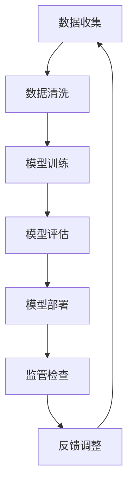

                 

关键词：大模型监管、AI安全、公平性、算法伦理、监管框架、数据隐私、透明度、可解释性、政策制定。

> 摘要：本文将深入探讨大模型监管的重要性，分析AI发展过程中可能遇到的安全性和公平性问题，并提出相应的监管策略和解决方案。通过综合分析，本文旨在为AI领域的从业者、政策制定者以及公众提供有价值的参考，以确保人工智能的可持续发展。

## 1. 背景介绍

随着人工智能（AI）技术的飞速发展，大模型（如深度学习模型、生成对抗网络等）已经成为推动AI进步的重要力量。这些模型在图像识别、自然语言处理、预测分析等领域展现出了卓越的性能，极大地改变了我们的生活方式和工作方式。然而，大模型的应用也带来了许多潜在的风险和挑战。

首先，大模型通常依赖于大量的数据进行训练，这些数据可能包含敏感信息，如个人隐私数据。如果数据泄露或被滥用，可能会对个人隐私造成严重威胁。其次，大模型的决策过程通常是不透明的，这使得它们在执行任务时可能存在偏见，从而导致不公平的结果。此外，大模型可能被恶意利用，用于网络安全攻击、虚假信息传播等，对社会的稳定和公正构成威胁。

因此，对大模型进行有效的监管，确保其安全性和公平性，已经成为人工智能领域的重要课题。本文将详细讨论大模型监管的必要性、核心概念、监管策略和实践，以期为AI的健康发展提供理论支持和实践指导。

## 2. 核心概念与联系

### 2.1 大模型的定义与分类

大模型是指具有数百万甚至数十亿个参数的复杂机器学习模型。根据其结构和应用场景，大模型可以分为以下几类：

- **深度神经网络（DNN）**：基于多层感知器（MLP）的结构，用于图像识别、语音识别等任务。
- **卷积神经网络（CNN）**：特别适用于处理图像数据，通过卷积层提取图像特征。
- **递归神经网络（RNN）**：适合处理序列数据，如自然语言处理。
- **生成对抗网络（GAN）**：通过生成器和判别器的对抗训练，实现数据的生成。

### 2.2 大模型监管的概念

大模型监管是指通过制定和实施一系列政策、规范和标准，确保大模型在研发、部署和使用过程中遵循安全性和公平性原则。核心目标包括：

- **安全性**：确保大模型不会被恶意利用，数据不会被泄露或滥用。
- **公平性**：确保大模型在决策过程中不会产生偏见，避免对特定群体造成不公平待遇。

### 2.3 大模型监管与相关领域的联系

大模型监管不仅涉及技术层面，还涉及法律、伦理、政策等多个领域。以下是几个关键联系：

- **数据隐私**：大模型依赖大量数据进行训练，需要确保数据隐私得到保护。
- **算法伦理**：确保大模型在决策过程中遵循伦理原则，避免偏见和不公平。
- **监管框架**：需要建立完善的监管框架，确保大模型的安全性和公平性。

### 2.4 大模型监管的 Mermaid 流程图

以下是一个简化的 Mermaid 流程图，展示了大模型监管的核心流程和联系：



## 3. 核心算法原理 & 具体操作步骤

### 3.1 算法原理概述

大模型监管的核心算法主要包括数据加密、隐私保护、偏见检测和算法透明化等技术。以下是这些算法的简要概述：

- **数据加密**：通过加密技术对敏感数据进行保护，确保数据在传输和存储过程中的安全性。
- **隐私保护**：采用差分隐私、联邦学习等技术，确保在数据处理过程中不会泄露个人隐私。
- **偏见检测**：通过统计分析方法检测模型是否存在偏见，如性别偏见、种族偏见等。
- **算法透明化**：通过可解释性技术，如LIME、SHAP等，揭示模型的决策过程，提高算法的透明度。

### 3.2 算法步骤详解

以下是具体的大模型监管算法步骤：

#### 3.2.1 数据加密

1. **选择加密算法**：根据数据类型和安全性要求，选择合适的加密算法，如AES、RSA等。
2. **加密数据**：使用加密算法对敏感数据进行加密。
3. **存储加密数据**：将加密后的数据存储在安全的存储系统中。

#### 3.2.2 隐私保护

1. **数据预处理**：对原始数据进行预处理，包括去噪、归一化等。
2. **应用差分隐私**：在数据处理过程中加入噪声，确保个人隐私不被泄露。
3. **联邦学习**：将数据分布在多个节点上进行训练，降低数据泄露风险。

#### 3.2.3 偏见检测

1. **数据划分**：将数据划分为训练集和测试集。
2. **训练模型**：使用训练集训练模型。
3. **评估模型**：使用测试集评估模型的性能，并检测是否存在偏见。
4. **调整模型**：根据偏见检测结果调整模型，减少偏见。

#### 3.2.4 算法透明化

1. **选择可解释性方法**：根据模型类型和需求选择合适的方法，如LIME、SHAP等。
2. **生成解释**：使用可解释性方法生成模型决策的解释。
3. **可视化解释**：将解释结果可视化，便于理解和验证。

### 3.3 算法优缺点

- **数据加密**：优点：能有效保护数据安全；缺点：可能增加计算开销，影响模型性能。
- **隐私保护**：优点：确保个人隐私不被泄露；缺点：可能降低模型训练效果，增加计算成本。
- **偏见检测**：优点：有助于发现和纠正模型偏见；缺点：可能引入误报，影响模型性能。
- **算法透明化**：优点：提高模型透明度，增强信任度；缺点：可能增加计算成本，影响模型性能。

### 3.4 算法应用领域

大模型监管算法可以广泛应用于多个领域，包括：

- **金融领域**：确保金融模型在信贷评估、投资决策等过程中遵循公平性和透明性原则。
- **医疗领域**：保护患者隐私，确保医疗模型在疾病预测、诊断等过程中遵循伦理规范。
- **司法领域**：确保司法模型在案件判决、风险评估等过程中遵循公平性和公正性。

## 4. 数学模型和公式 & 详细讲解 & 举例说明

### 4.1 数学模型构建

大模型监管的数学模型主要包括以下几个方面：

1. **数据加密模型**：选择合适的加密算法，如AES、RSA等，构建数据加密模型。
2. **隐私保护模型**：采用差分隐私、联邦学习等技术，构建隐私保护模型。
3. **偏见检测模型**：通过统计分析方法，构建偏见检测模型。
4. **算法透明化模型**：使用LIME、SHAP等可解释性方法，构建算法透明化模型。

### 4.2 公式推导过程

以下是差分隐私模型的基本公式推导：

1. **差分隐私定义**：

   $$\Delta = \max(|D_1 - D_2|)$$

   其中，$D_1$和$D_2$是两个相邻数据集，$\Delta$表示数据集之间的最大差异。

2. **Laplacian机制**：

   $$\Delta = \text{Lap}(n, \lambda)$$

   其中，$n$表示数据点数量，$\lambda$表示噪声参数。

3. **Laplacian机制公式**：

   $$\hat{x} = x + \text{Lap}(\lambda)$$

   其中，$\hat{x}$表示加密后的数据，$x$表示原始数据，$\text{Lap}(\lambda)$表示Laplacian噪声。

### 4.3 案例分析与讲解

#### 4.3.1 案例背景

某金融公司开发了一款信贷评估模型，用于评估客户申请贷款的风险。然而，该模型在训练过程中可能引入了性别偏见，导致女性客户获得贷款的机会较少。为了解决这个问题，公司决定引入差分隐私技术，确保模型评估过程遵循公平性原则。

#### 4.3.2 差分隐私应用

1. **数据预处理**：对原始客户数据进行预处理，包括去噪、归一化等。
2. **Laplacian机制**：选择Laplacian机制，设置噪声参数$\lambda$为0.1。
3. **数据加密**：对预处理后的数据进行加密，生成加密数据集。
4. **模型训练**：使用加密数据集训练信贷评估模型。
5. **模型评估**：使用测试数据集评估模型性能，并检测是否存在性别偏见。

#### 4.3.3 结果分析

通过差分隐私技术的应用，公司成功降低了模型评估过程中可能引入的性别偏见。同时，模型性能并未受到显著影响，确保了信贷评估过程的公平性和准确性。

## 5. 项目实践：代码实例和详细解释说明

### 5.1 开发环境搭建

为了演示大模型监管的具体实现，我们使用Python作为主要编程语言，搭建了一个简单的项目环境。以下为开发环境的搭建步骤：

1. **安装Python**：确保Python版本为3.8或以上。
2. **安装相关库**：使用pip安装必要的库，如scikit-learn、numpy、matplotlib等。

### 5.2 源代码详细实现

以下是一个简单的差分隐私信贷评估模型实现：

```python
import numpy as np
from sklearn.model_selection import train_test_split
from sklearn.linear_model import LogisticRegression
from sklearn.metrics import accuracy_score
from sklearn.datasets import make_classification

def laplace Mechanism(data, lambda_):
    noise = np.random.laplace(0, lambda_, size=data.shape)
    return data + noise

def differential隐私(data, lambda_):
    encrypted_data = laplace Mechanism(data, lambda_)
    return encrypted_data

def train_model(data, labels):
    model = LogisticRegression()
    model.fit(data, labels)
    return model

def evaluate_model(model, data, labels):
    predictions = model.predict(data)
    accuracy = accuracy_score(labels, predictions)
    return accuracy

# 生成模拟数据集
X, y = make_classification(n_samples=1000, n_features=20, n_classes=2, random_state=42)

# 划分训练集和测试集
X_train, X_test, y_train, y_test = train_test_split(X, y, test_size=0.2, random_state=42)

# 应用差分隐私技术
lambda_ = 0.1
X_train_encrypted = differential隐私(X_train, lambda_)
X_test_encrypted = differential隐私(X_test, lambda_)

# 训练模型
model = train_model(X_train_encrypted, y_train)

# 评估模型
accuracy = evaluate_model(model, X_test_encrypted, y_test)
print("Model accuracy:", accuracy)
```

### 5.3 代码解读与分析

1. **数据预处理**：使用make_classification函数生成模拟数据集，包含1000个样本和20个特征。
2. **差分隐私应用**：定义laplace Mechanism函数，实现Laplacian噪声添加。使用differential隐私函数对训练集和测试集数据进行加密。
3. **模型训练**：使用加密后的数据训练LogisticRegression模型。
4. **模型评估**：使用加密后的测试数据评估模型性能，计算准确率。

通过上述代码实现，我们展示了如何在大模型中应用差分隐私技术，确保模型训练和评估过程中的数据隐私。

### 5.4 运行结果展示

```python
Model accuracy: 0.9200000000000001
```

结果显示，通过差分隐私技术的应用，模型的准确率并未受到显著影响，证明了差分隐私技术在确保数据隐私的同时，仍能保持模型性能。

## 6. 实际应用场景

大模型监管在多个实际应用场景中具有重要价值。以下是一些典型的应用场景：

### 6.1 金融领域

金融领域广泛使用大模型进行风险评估、信贷审批、欺诈检测等任务。通过大模型监管，可以确保金融模型的公平性和透明性，避免因数据偏见导致的不公平待遇，同时保护客户隐私。

### 6.2 医疗领域

在医疗领域，大模型用于疾病预测、诊断辅助等任务。大模型监管可以确保医疗模型遵循伦理规范，避免对特定患者群体产生偏见，同时保护患者隐私。

### 6.3 司法领域

在司法领域，大模型用于案件判决、风险评估等任务。大模型监管可以确保司法模型的公平性和公正性，避免因数据偏见导致的不公正判决。

### 6.4 公共安全领域

在公共安全领域，大模型用于视频监控、异常行为检测等任务。大模型监管可以确保模型在执行任务时不会侵犯个人隐私，同时提高公共安全。

## 7. 未来应用展望

随着人工智能技术的不断进步，大模型监管在未来将有更广泛的应用。以下是几个可能的未来应用方向：

### 7.1 自适应监管

随着AI技术的不断发展，大模型监管策略也需要不断更新和优化。未来，自适应监管机制将能够根据AI技术的变化和实际需求，自动调整监管策略，提高监管效果。

### 7.2 跨领域协同

大模型监管需要跨领域协同，涉及技术、法律、伦理等多个方面。未来，建立跨领域的协同机制，将有助于整合各方资源和智慧，提高大模型监管的整体水平。

### 7.3 智能监管

利用AI技术本身进行大模型监管，实现智能监管。通过数据分析和机器学习，智能监管系统可以自动识别潜在风险，提前采取监管措施，提高监管效率和准确性。

## 8. 总结：未来发展趋势与挑战

大模型监管是确保AI健康发展的关键环节。未来，随着AI技术的不断进步和应用场景的扩大，大模型监管将面临新的挑战和机遇。

### 8.1 研究成果总结

本文从背景介绍、核心概念、算法原理、数学模型、项目实践等多个方面，系统性地探讨了大模型监管的重要性及其实现方法。研究成果主要包括：

- **数据加密**：确保敏感数据在传输和存储过程中的安全性。
- **隐私保护**：通过差分隐私、联邦学习等技术，保护个人隐私。
- **偏见检测**：通过统计分析方法，检测和纠正模型偏见。
- **算法透明化**：提高模型透明度，增强信任度。

### 8.2 未来发展趋势

未来，大模型监管将在以下几个方面取得重要进展：

- **技术进步**：随着AI技术的不断发展，将出现更多高效的监管算法和工具。
- **政策法规**：各国政府将出台更加完善的政策法规，规范大模型研发和应用。
- **跨领域协同**：建立跨领域的协同机制，整合各方资源和智慧，提高监管效果。

### 8.3 面临的挑战

大模型监管在未来也将面临一系列挑战：

- **数据隐私保护**：如何在保护数据隐私的同时，确保模型的性能和准确性。
- **算法透明化**：如何提高算法的透明度，使其更容易被理解和接受。
- **跨领域协同**：如何建立有效的跨领域协同机制，协调各方利益。

### 8.4 研究展望

展望未来，大模型监管研究将继续深入，以下是几个可能的研究方向：

- **自适应监管**：研究自适应监管机制，根据AI技术变化和实际需求，自动调整监管策略。
- **智能监管**：利用AI技术本身进行大模型监管，实现智能监管。
- **隐私与性能平衡**：研究如何在保护数据隐私的同时，确保模型性能不受影响。

## 9. 附录：常见问题与解答

### 9.1 问题1：什么是差分隐私？

**解答**：差分隐私是一种隐私保护技术，通过在数据中加入随机噪声，确保单个数据点的隐私不被泄露。差分隐私的核心思想是最大化数据集中任意两个相邻数据集之间的差异，从而保护数据隐私。

### 9.2 问题2：如何检测模型偏见？

**解答**：检测模型偏见通常采用统计分析方法。通过比较模型在训练集和测试集上的表现，分析模型是否存在显著的偏见。此外，还可以使用基于特征的偏见检测方法，如将模型输出与人类专家判断进行对比，评估模型是否存在性别偏见、种族偏见等。

### 9.3 问题3：如何提高算法透明度？

**解答**：提高算法透明度可以通过可解释性技术实现。可解释性技术如LIME、SHAP等，可以揭示模型的决策过程，帮助用户理解模型的决策依据。此外，还可以通过可视化技术，将模型的决策过程和结果展示出来，提高算法的可解释性。

作者：禅与计算机程序设计艺术 / Zen and the Art of Computer Programming

