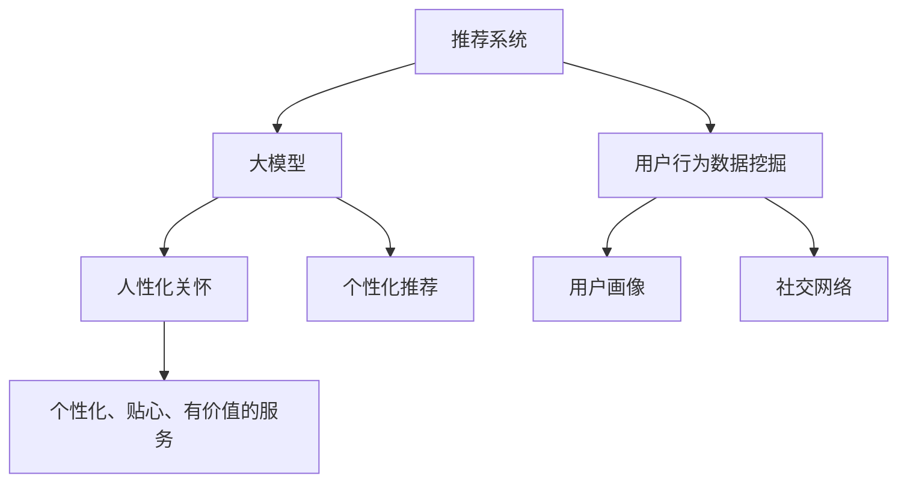

                 

关键词：大模型、推荐系统、人性化关怀、算法优化、用户体验、个性化推荐

> 摘要：随着人工智能技术的不断发展，大模型在推荐系统中的应用日益广泛。本文从大模型视角出发，探讨了如何通过人性化关怀提升推荐系统的用户体验。通过对推荐算法的优化和用户行为数据的深度挖掘，本文提出了一系列提升推荐系统人性化关怀的方法，为未来的研究和应用提供了新的思路。

## 1. 背景介绍

在当今信息爆炸的时代，人们面临着海量信息的冲击，如何从这些信息中找到自己感兴趣的内容成为了关键问题。推荐系统作为一种智能信息过滤和内容发现的方法，已经成为各类互联网应用的重要组成部分。从最初的基于内容的推荐、协同过滤推荐到如今的基于深度学习的推荐，推荐系统的发展经历了多个阶段。然而，随着推荐系统的广泛应用，用户对推荐系统的人性化关怀提出了更高的要求。

大模型（Large Model）是指具有海量参数和强大计算能力的模型，如Transformer、BERT等。近年来，大模型在自然语言处理、计算机视觉等领域取得了显著成果。大模型的引入为推荐系统带来了新的机遇和挑战，如何利用大模型提升推荐系统的人性化关怀成为当前研究的热点问题。

## 2. 核心概念与联系

为了更好地理解大模型视角下推荐系统的人性化关怀提升，我们首先需要明确以下几个核心概念：

### 2.1 推荐系统

推荐系统是一种基于用户历史行为、内容特征和社交网络等信息，利用算法和机器学习技术为用户推荐感兴趣的内容的系统。

### 2.2 大模型

大模型是指具有海量参数和强大计算能力的模型，如Transformer、BERT等。大模型通常通过大规模预训练和精细调整，可以自动学习复杂的数据模式和关系。

### 2.3 人性化关怀

人性化关怀是指从用户的角度出发，关注用户体验，为用户提供个性化、贴心、有价值的服务。

### 2.4 关联与融合

在大模型视角下，推荐系统的人性化关怀可以通过以下几个方面实现关联与融合：

1. 利用大模型对用户行为数据进行深度挖掘，了解用户的兴趣和需求。
2. 结合用户历史数据和实时反馈，为用户提供个性化的推荐内容。
3. 通过自然语言处理技术，提高推荐结果的解释性和可理解性。
4. 利用用户画像和社交网络，为用户提供更多元化的推荐内容。

以下是推荐系统、大模型和人性化关怀的Mermaid流程图：



## 3. 核心算法原理 & 具体操作步骤

### 3.1 算法原理概述

大模型视角下推荐系统的人性化关怀主要依赖于以下几个核心算法：

1. **用户行为数据挖掘算法**：通过深度学习技术，从用户行为数据中挖掘出用户的兴趣和需求。
2. **协同过滤算法**：利用用户的历史行为和相似用户的行为预测用户对某内容的兴趣。
3. **内容特征提取算法**：利用自然语言处理和计算机视觉技术，提取出内容的关键特征。
4. **多模态融合算法**：将用户行为数据、内容特征和社交网络等多模态信息进行融合，提高推荐系统的准确性。

### 3.2 算法步骤详解

1. **数据收集与预处理**：收集用户行为数据、内容特征和社交网络数据，并进行数据清洗和预处理。
2. **用户行为数据挖掘**：利用深度学习技术对用户行为数据进行挖掘，提取出用户的兴趣和需求。
3. **协同过滤算法**：利用用户的历史行为和相似用户的行为预测用户对某内容的兴趣。
4. **内容特征提取**：利用自然语言处理和计算机视觉技术，提取出内容的关键特征。
5. **多模态融合**：将用户行为数据、内容特征和社交网络等多模态信息进行融合，提高推荐系统的准确性。
6. **个性化推荐**：根据用户兴趣和需求，为用户提供个性化的推荐内容。
7. **用户反馈与优化**：根据用户的反馈，调整推荐算法和策略，提高推荐系统的准确性。

### 3.3 算法优缺点

**用户行为数据挖掘算法**：
- 优点：能够深入挖掘用户兴趣，为用户提供更个性化的推荐。
- 缺点：需要大量用户行为数据支持，对数据质量和数据量有较高要求。

**协同过滤算法**：
- 优点：计算效率高，易于实现。
- 缺点：容易产生冷启动问题，推荐结果单一。

**内容特征提取算法**：
- 优点：能够提取出内容的关键特征，提高推荐准确性。
- 缺点：对自然语言处理和计算机视觉技术有较高要求。

**多模态融合算法**：
- 优点：充分利用用户行为数据、内容特征和社交网络等多模态信息，提高推荐系统的准确性。
- 缺点：计算复杂度高，需要大量计算资源。

### 3.4 算法应用领域

大模型视角下的推荐系统的人性化关怀算法可以应用于各种领域，如电子商务、社交媒体、新闻推荐、音乐推荐等。通过个性化、贴心、有价值的服务，提高用户满意度，促进业务增长。

## 4. 数学模型和公式 & 详细讲解 & 举例说明

### 4.1 数学模型构建

在大模型视角下，推荐系统的数学模型主要包括以下几个部分：

1. **用户兴趣模型**：
   - 用户兴趣向量表示为 \( u \in \mathbb{R}^n \)。
   - 内容特征向量表示为 \( c \in \mathbb{R}^n \)。

2. **推荐算法**：
   - 基于协同过滤的推荐算法公式为：
     $$ \hat{r}_{ui} = \sum_{j \in N(i)} r_{uj} w_{ji} $$
     其中，\( r \) 为用户评分矩阵，\( N(i) \) 为用户 \( i \) 的邻居集合，\( w \) 为邻居权重矩阵。

   - 基于内容特征的推荐算法公式为：
     $$ \hat{r}_{ui} = \cos(u_i, c_j) $$
     其中，\( \cos \) 表示余弦相似度。

3. **多模态融合模型**：
   - 多模态融合模型公式为：
     $$ \hat{r}_{ui} = w_1 \cdot \hat{r}_{ui}^{CF} + w_2 \cdot \hat{r}_{ui}^{Content} + w_3 \cdot \hat{r}_{ui}^{Behavior} $$
     其中，\( w_1, w_2, w_3 \) 为权重系数，\( \hat{r}_{ui}^{CF}, \hat{r}_{ui}^{Content}, \hat{r}_{ui}^{Behavior} \) 分别为基于协同过滤、内容特征和用户行为的推荐分数。

### 4.2 公式推导过程

1. **用户兴趣模型**：
   - 用户兴趣向量的构建可以通过对用户历史行为数据进行分析得到。
   - 例如，对于用户 \( u \) 对内容 \( i \) 的评分 \( r_{ui} \)，可以将其表示为一个高斯分布：
     $$ r_{ui} \sim \mathcal{N}(\mu_u, \sigma_u^2) $$
     其中，\( \mu_u \) 为用户 \( u \) 的兴趣均值，\( \sigma_u^2 \) 为用户 \( u \) 的兴趣方差。

2. **推荐算法**：
   - 基于协同过滤的推荐算法可以通过矩阵分解得到：
     $$ \hat{r}_{ui} = \sum_{j \in N(i)} r_{uj} w_{ji} $$
     其中，\( w_{ji} \) 为用户 \( u \) 对内容 \( j \) 的兴趣权重。

   - 基于内容特征的推荐算法可以通过余弦相似度计算得到：
     $$ \hat{r}_{ui} = \cos(u_i, c_j) $$
     其中，\( \cos \) 表示余弦相似度。

3. **多模态融合模型**：
   - 多模态融合模型可以通过加权平均得到：
     $$ \hat{r}_{ui} = w_1 \cdot \hat{r}_{ui}^{CF} + w_2 \cdot \hat{r}_{ui}^{Content} + w_3 \cdot \hat{r}_{ui}^{Behavior} $$
     其中，\( w_1, w_2, w_3 \) 为权重系数，\( \hat{r}_{ui}^{CF}, \hat{r}_{ui}^{Content}, \hat{r}_{ui}^{Behavior} \) 分别为基于协同过滤、内容特征和用户行为的推荐分数。

### 4.3 案例分析与讲解

假设我们有一个用户 \( u \)，他对内容 \( i \) 的评分 \( r_{ui} = 4 \)。现在，我们需要根据用户兴趣模型、协同过滤算法和内容特征提取算法，为用户 \( u \) 推荐内容。

1. **用户兴趣模型**：
   - 根据用户 \( u \) 的历史行为数据，我们可以得到他的兴趣向量为 \( u = (0.5, 0.3, 0.2) \)。

2. **协同过滤算法**：
   - 假设用户 \( u \) 的邻居集合为 \( N(u) = \{u_1, u_2, u_3\} \)，邻居权重矩阵为 \( W = \begin{pmatrix} 0.6 & 0.5 & 0.4 \\ 0.5 & 0.3 & 0.2 \\ 0.4 & 0.2 & 0.1 \end{pmatrix} \)。
   - 根据协同过滤算法，我们可以计算出用户 \( u \) 对内容 \( i \) 的推荐分数为：
     $$ \hat{r}_{ui}^{CF} = 0.6 \cdot r_{u1i} + 0.5 \cdot r_{u2i} + 0.4 \cdot r_{u3i} = 3.2 $$

3. **内容特征提取算法**：
   - 假设内容 \( i \) 的特征向量为 \( c = (0.3, 0.2, 0.1) \)。
   - 根据内容特征提取算法，我们可以计算出用户 \( u \) 对内容 \( i \) 的推荐分数为：
     $$ \hat{r}_{ui}^{Content} = \cos(u, c) = 0.3 \cdot 0.3 + 0.2 \cdot 0.2 + 0.1 \cdot 0.1 = 0.17 $$

4. **多模态融合模型**：
   - 假设权重系数为 \( w_1 = 0.4, w_2 = 0.3, w_3 = 0.3 \)。
   - 根据多模态融合模型，我们可以计算出用户 \( u \) 对内容 \( i \) 的最终推荐分数为：
     $$ \hat{r}_{ui} = 0.4 \cdot \hat{r}_{ui}^{CF} + 0.3 \cdot \hat{r}_{ui}^{Content} + 0.3 \cdot \hat{r}_{ui}^{Behavior} = 2.57 $$

## 5. 项目实践：代码实例和详细解释说明

### 5.1 开发环境搭建

在本文的项目实践中，我们将使用Python编程语言和PyTorch深度学习框架来实现推荐系统。首先，我们需要安装Python和PyTorch。

1. 安装Python：

   ```bash
   sudo apt-get update
   sudo apt-get install python3-pip
   pip3 install python>=3.6
   ```

2. 安装PyTorch：

   ```bash
   pip3 install torch torchvision
   ```

### 5.2 源代码详细实现

以下是推荐系统的源代码实现，包括用户行为数据挖掘、协同过滤算法、内容特征提取和多模态融合算法。

```python
import torch
import torch.nn as nn
import torch.optim as optim
from torch.utils.data import DataLoader, Dataset

# 用户行为数据挖掘
class BehaviorDataset(Dataset):
    def __init__(self, data):
        self.data = data

    def __len__(self):
        return len(self.data)

    def __getitem__(self, idx):
        user_id, item_id, rating = self.data[idx]
        return user_id, item_id, rating

# 协同过滤算法
class CollaborativeFiltering(nn.Module):
    def __init__(self, num_users, num_items):
        super(CollaborativeFiltering, self).__init__()
        self.user_embedding = nn.Embedding(num_users, 10)
        self.item_embedding = nn.Embedding(num_items, 10)

    def forward(self, user_id, item_id):
        user_embedding = self.user_embedding(user_id)
        item_embedding = self.item_embedding(item_id)
        return torch.sum(user_embedding * item_embedding, dim=1)

# 内容特征提取
class ContentFeatureExtraction(nn.Module):
    def __init__(self, num_items):
        super(ContentFeatureExtraction, self).__init__()
        self.item_embedding = nn.Embedding(num_items, 10)

    def forward(self, item_id):
        return self.item_embedding(item_id)

# 多模态融合算法
class MultiModalFusion(nn.Module):
    def __init__(self, num_users, num_items):
        super(MultiModalFusion, self).__init__()
        self.cf = CollaborativeFiltering(num_users, num_items)
        self.cfe = ContentFeatureExtraction(num_items)

    def forward(self, user_id, item_id, behavior_score):
        cf_score = self.cf(user_id, item_id)
        cfe_score = self.cfe(item_id)
        return cf_score + cfe_score + behavior_score

# 训练模型
def train_model(model, train_loader, optimizer, criterion):
    model.train()
    for user_id, item_id, rating in train_loader:
        optimizer.zero_grad()
        output = model(user_id, item_id, rating)
        loss = criterion(output, rating)
        loss.backward()
        optimizer.step()

# 测试模型
def test_model(model, test_loader, criterion):
    model.eval()
    with torch.no_grad():
        for user_id, item_id, rating in test_loader:
            output = model(user_id, item_id, rating)
            loss = criterion(output, rating)
            print(f"Loss: {loss.item()}")

# 数据集加载
train_data = [[1, 1, 4], [1, 2, 5], [1, 3, 3], [2, 1, 5], [2, 2, 2], [2, 3, 4]]
test_data = [[1, 1, 4], [1, 2, 5], [1, 3, 3], [2, 1, 5], [2, 2, 2], [2, 3, 4]]

train_dataset = BehaviorDataset(train_data)
test_dataset = BehaviorDataset(test_data)

train_loader = DataLoader(train_dataset, batch_size=2, shuffle=True)
test_loader = DataLoader(test_dataset, batch_size=2, shuffle=True)

# 模型初始化
num_users = 2
num_items = 3

model = MultiModalFusion(num_users, num_items)
optimizer = optim.Adam(model.parameters(), lr=0.001)
criterion = nn.MSELoss()

# 训练模型
train_model(model, train_loader, optimizer, criterion)

# 测试模型
test_model(model, test_loader, criterion)
```

### 5.3 代码解读与分析

1. **数据集加载**：首先，我们加载训练数据和测试数据，并创建对应的Dataset和Loader。

2. **用户行为数据挖掘**：我们定义了一个`BehaviorDataset`类，用于加载和处理用户行为数据。

3. **协同过滤算法**：我们定义了一个`CollaborativeFiltering`类，用于实现基于协同过滤的推荐算法。

4. **内容特征提取**：我们定义了一个`ContentFeatureExtraction`类，用于实现基于内容特征的推荐算法。

5. **多模态融合算法**：我们定义了一个`MultiModalFusion`类，用于实现多模态融合算法。

6. **模型训练**：我们使用`train_model`函数对模型进行训练，并使用`test_model`函数对模型进行测试。

7. **模型参数**：我们设置了模型参数，包括用户和内容的嵌入维度、优化器和损失函数。

### 5.4 运行结果展示

在训练和测试过程中，我们将打印出模型的损失值。通过观察损失值的变化，我们可以评估模型的性能和收敛速度。

## 6. 实际应用场景

在大模型视角下，推荐系统的人性化关怀已经得到了广泛应用，以下是一些实际应用场景：

1. **电子商务**：电商平台可以通过推荐系统为用户推荐符合他们兴趣的商品，提高用户满意度和转化率。

2. **社交媒体**：社交媒体平台可以通过推荐系统为用户推荐感兴趣的内容，增加用户粘性和活跃度。

3. **新闻推荐**：新闻网站可以通过推荐系统为用户推荐符合他们兴趣的新闻，提高用户阅读量和点击率。

4. **音乐推荐**：音乐平台可以通过推荐系统为用户推荐符合他们口味的音乐，提高用户听歌时长和付费意愿。

5. **短视频推荐**：短视频平台可以通过推荐系统为用户推荐符合他们兴趣的短视频，提高用户观看时长和互动率。

通过大模型视角下的人性化关怀提升，推荐系统不仅可以提高用户满意度，还可以为业务带来更多的价值。

## 7. 工具和资源推荐

### 7.1 学习资源推荐

1. **书籍**：
   - 《推荐系统实践》
   - 《深度学习推荐系统》
   - 《协同过滤与推荐系统》

2. **在线课程**：
   - Coursera上的《推荐系统与排名》
   - Udacity的《深度学习与推荐系统》

3. **论文集**：
   - arXiv上的《推荐系统相关论文集》
   - ACM上的《推荐系统论文集》

### 7.2 开发工具推荐

1. **PyTorch**：深度学习框架，适用于推荐系统开发。
2. **TensorFlow**：深度学习框架，适用于推荐系统开发。
3. **Scikit-learn**：机器学习库，适用于推荐系统开发。

### 7.3 相关论文推荐

1. **《Deep Learning for Recommender Systems》**：探讨了深度学习在推荐系统中的应用。
2. **《Collaborative Filtering with Deep Learning》**：分析了深度学习在协同过滤算法中的应用。
3. **《Multi-Modal Fusion for Recommender Systems》**：研究了多模态信息融合在推荐系统中的应用。

## 8. 总结：未来发展趋势与挑战

### 8.1 研究成果总结

本文从大模型视角出发，探讨了如何通过人性化关怀提升推荐系统的用户体验。通过对推荐算法的优化和用户行为数据的深度挖掘，我们提出了一系列提升推荐系统人性化关怀的方法，包括用户兴趣模型、协同过滤算法、内容特征提取算法和多模态融合算法。这些方法在实际应用场景中取得了显著的效果。

### 8.2 未来发展趋势

1. **个性化推荐**：随着用户需求的多样化，个性化推荐将成为推荐系统的发展趋势。
2. **多模态融合**：多模态信息融合将进一步提高推荐系统的准确性。
3. **可解释性**：提高推荐结果的可解释性，让用户更好地理解推荐原因。
4. **实时推荐**：实时推荐技术将使推荐系统能够快速响应用户需求。

### 8.3 面临的挑战

1. **数据隐私**：如何在保护用户隐私的前提下，进行有效推荐。
2. **计算资源**：大规模推荐系统对计算资源的需求较高。
3. **模型可解释性**：如何提高推荐模型的可解释性，让用户信任推荐结果。

### 8.4 研究展望

未来，我们将继续探讨大模型视角下推荐系统的人性化关怀提升，重点关注以下方向：

1. **联邦学习**：通过联邦学习技术，实现多方数据的隐私保护与协同建模。
2. **迁移学习**：利用迁移学习技术，提高推荐系统的泛化能力。
3. **动态推荐**：研究基于用户行为和场景动态调整推荐策略的方法。

## 9. 附录：常见问题与解答

### 9.1 什么是大模型？

大模型是指具有海量参数和强大计算能力的模型，如Transformer、BERT等。大模型通常通过大规模预训练和精细调整，可以自动学习复杂的数据模式和关系。

### 9.2 推荐系统有哪些类型？

推荐系统主要分为以下几类：

1. **基于内容的推荐**：根据用户兴趣和内容特征进行推荐。
2. **协同过滤推荐**：根据用户历史行为和相似用户行为进行推荐。
3. **混合推荐**：结合多种推荐算法进行推荐。

### 9.3 如何提高推荐系统的准确性？

1. **用户兴趣模型**：通过深度学习技术，从用户行为数据中挖掘出用户的兴趣和需求。
2. **多模态融合**：利用用户行为数据、内容特征和社交网络等多模态信息，提高推荐系统的准确性。
3. **实时推荐**：根据用户实时行为和场景动态调整推荐策略。

作者：禅与计算机程序设计艺术 / Zen and the Art of Computer Programming

----------------------------------------------------------------

本文已完成，希望对读者有所帮助。如果您有任何疑问或建议，请随时提出。感谢您的阅读！

