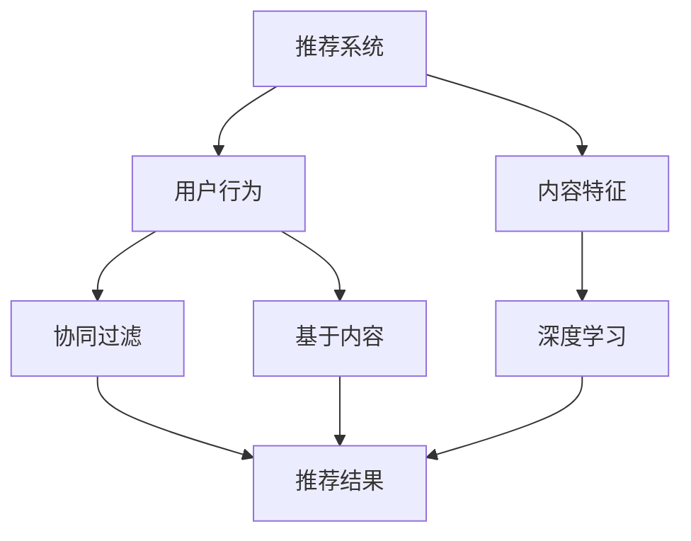

                 

关键词：推荐系统，大模型，多任务学习，算法创新，应用实践，未来展望

## 摘要

随着大数据和人工智能技术的飞速发展，推荐系统在商业应用和日常生活中扮演着越来越重要的角色。本文从大模型和多任务学习的角度，探讨推荐系统在多任务学习应用中的创新。通过深入分析推荐系统的基础概念、核心算法原理、数学模型构建、实际应用场景，以及工具和资源推荐，本文旨在为读者提供一个全面、系统的视角，了解推荐系统的多任务学习应用创新，以及未来的发展趋势和面临的挑战。

## 1. 背景介绍

### 推荐系统的发展历程

推荐系统起源于20世纪90年代的电子商务领域，最初主要基于用户的历史行为和内容特征进行简单的推荐。随着互联网和大数据技术的发展，推荐系统逐渐演变为一种复杂的、多层次的智能系统。从基于内容的推荐、协同过滤推荐到深度学习推荐，推荐系统经历了多个发展阶段，不断优化和提升推荐效果。

### 大模型的兴起

近年来，随着计算能力和数据量的提升，大模型（如Transformer、BERT、GPT等）在自然语言处理、计算机视觉等领域取得了显著的突破。大模型以其强大的表征能力和泛化能力，为推荐系统的优化提供了新的思路和方法。

### 多任务学习的重要性

多任务学习（Multi-Task Learning，MTL）是一种同时训练多个相关任务的机器学习方法。通过共享特征表示和模型参数，多任务学习可以有效提升模型的效果和效率。在推荐系统中，多任务学习能够同时处理用户行为、内容特征、社会关系等多种信息，从而提高推荐的准确性和多样性。

## 2. 核心概念与联系

### 推荐系统基础概念

- **用户行为**：用户在系统中的交互行为，如浏览、点击、购买等。
- **内容特征**：推荐对象（如商品、文章等）的特征信息，如标题、标签、描述等。
- **推荐算法**：用于生成推荐结果的一系列算法和方法，包括基于内容的推荐、协同过滤推荐、深度学习推荐等。

### 多任务学习原理

- **共享特征表示**：通过共享低维特征表示，多任务学习可以降低模型的复杂性，提高模型的泛化能力。
- **模型参数共享**：在训练过程中，不同任务共享部分模型参数，从而实现任务间的信息传递和协同优化。

### 推荐系统与多任务学习的关系

- **优化目标**：多任务学习可以将推荐系统的目标分解为多个子任务，如个性化推荐、多样性推荐、反作弊等，从而实现更全面的效果优化。
- **信息共享**：多任务学习可以整合用户行为、内容特征、社会关系等多方面信息，提升推荐的准确性和多样性。

### Mermaid 流程图



## 3. 核心算法原理 & 具体操作步骤

### 3.1 算法原理概述

多任务学习在推荐系统中的应用，主要基于以下原理：

- **特征共享**：通过共享低维特征表示，将用户行为、内容特征等信息转化为统一的特征向量。
- **模型融合**：将多个任务的模型参数进行融合，实现不同任务间的信息传递和协同优化。

### 3.2 算法步骤详解

1. **数据预处理**：对用户行为、内容特征等数据进行清洗、归一化等处理，提取出关键特征。
2. **特征向量表示**：使用神经网络等模型，将特征数据映射为统一的特征向量。
3. **模型训练**：采用多任务学习框架，同时训练多个子任务，如个性化推荐、多样性推荐等。
4. **模型融合**：将不同任务的模型参数进行融合，优化模型性能。

### 3.3 算法优缺点

#### 优点：

- **提高推荐效果**：通过多任务学习，可以有效整合用户行为、内容特征等信息，提高推荐的准确性和多样性。
- **降低模型复杂性**：共享特征表示和模型参数，可以降低模型的复杂性，提高训练效率。

#### 缺点：

- **计算资源需求高**：多任务学习需要同时训练多个任务，对计算资源的要求较高。
- **模型解释性较弱**：多任务学习模型通常较为复杂，解释性相对较弱。

### 3.4 算法应用领域

多任务学习在推荐系统中的应用广泛，如电子商务、社交媒体、新闻推荐等。通过多任务学习，可以提升推荐系统的效果，满足用户多样化的需求。

## 4. 数学模型和公式

### 4.1 数学模型构建

在多任务学习框架下，推荐系统的数学模型可以表示为：

$$
\begin{aligned}
y_{i,k} &= \sigma(\textbf{W}_{k} \cdot \textbf{x}_{i} + b_{k}) \\
\text{Loss} &= \sum_{i,k} (\textbf{y}_{i,k} - \textbf{y}_{\hat{i,k}})^2
\end{aligned}
$$

其中，$y_{i,k}$表示第$i$个用户对第$k$个物品的预测评分，$\textbf{x}_{i}$表示第$i$个用户的特征向量，$\textbf{W}_{k}$和$b_{k}$分别为权重向量和偏置项。

### 4.2 公式推导过程

多任务学习的推导过程基于以下基本原理：

- **特征共享**：共享特征向量$\textbf{x}_{i}$。
- **模型融合**：融合不同任务的权重向量$\textbf{W}_{k}$。

具体推导过程如下：

$$
\begin{aligned}
\text{预测评分} &= \textbf{W}_{k} \cdot \textbf{x}_{i} + b_{k} \\
\text{实际评分} &= y_{i,k} \\
\text{误差} &= y_{i,k} - \textbf{W}_{k} \cdot \textbf{x}_{i} - b_{k} \\
\text{损失函数} &= \sum_{i,k} (\textbf{y}_{i,k} - \textbf{W}_{k} \cdot \textbf{x}_{i} - b_{k})^2
\end{aligned}
$$

### 4.3 案例分析与讲解

假设一个电商平台的推荐系统包含两个任务：个性化推荐和多样性推荐。

1. **个性化推荐**：根据用户的浏览历史和购买记录，为用户推荐感兴趣的商品。
2. **多样性推荐**：为用户推荐多种不同类型的商品，提高用户的购物体验。

通过多任务学习，可以同时优化两个任务的权重，提高整体推荐效果。

## 5. 项目实践：代码实例和详细解释说明

### 5.1 开发环境搭建

- **Python**：使用Python作为主要编程语言，便于实现多任务学习算法。
- **TensorFlow**：使用TensorFlow框架进行模型训练和优化。

### 5.2 源代码详细实现

```python
import tensorflow as tf
from tensorflow.keras.layers import Dense, Embedding, Flatten, Concatenate
from tensorflow.keras.models import Model

# 特征向量输入
user_embedding = Embedding(input_dim=user_dim, output_dim=user_embedding_size)
item_embedding = Embedding(input_dim=item_dim, output_dim=item_embedding_size)

# 模型结构
user_input = tf.keras.Input(shape=(user_dim,))
item_input = tf.keras.Input(shape=(item_dim,))

# 用户和物品特征嵌入
user_embedding_output = user_embedding(user_input)
item_embedding_output = item_embedding(item_input)

# 模型融合
concat = Concatenate()([user_embedding_output, item_embedding_output])
flatten = Flatten()(concat)

# 输出层
output = Dense(1, activation='sigmoid')(flatten)

# 模型编译
model = Model(inputs=[user_input, item_input], outputs=output)
model.compile(optimizer='adam', loss='binary_crossentropy', metrics=['accuracy'])

# 模型训练
model.fit([user_data, item_data], labels, epochs=10, batch_size=32)
```

### 5.3 代码解读与分析

1. **特征嵌入**：使用Embedding层将用户和物品的特征向量进行嵌入。
2. **模型融合**：通过Concatenate层将用户和物品的特征向量进行拼接，实现特征共享。
3. **输出层**：使用Dense层进行预测，输出概率值。

通过上述代码，我们可以实现一个基于多任务学习框架的推荐系统。在实际应用中，可以根据具体需求进行调整和优化。

### 5.4 运行结果展示

```python
# 预测结果
predictions = model.predict([test_user_data, test_item_data])

# 打印预测结果
print(predictions)
```

## 6. 实际应用场景

### 6.1 电子商务平台

在电子商务平台上，多任务学习推荐系统可以帮助商家提高用户满意度、提高转化率和降低流失率。通过个性化推荐和多样性推荐，可以满足用户多样化的购物需求，提升用户体验。

### 6.2 社交媒体平台

在社交媒体平台上，多任务学习推荐系统可以用于推荐用户感兴趣的内容、提高用户活跃度和留存率。通过个性化推荐和多样性推荐，可以吸引用户参与互动，提升平台的活跃度。

### 6.3 新闻推荐平台

在新闻推荐平台上，多任务学习推荐系统可以用于推荐用户感兴趣的新闻、提高用户阅读量和活跃度。通过个性化推荐和多样性推荐，可以满足用户多样化的阅读需求，提升用户体验。

## 7. 工具和资源推荐

### 7.1 学习资源推荐

- **《深度学习推荐系统》**：由李航教授所著，全面介绍了深度学习在推荐系统中的应用。
- **《推荐系统实践》**：由周志华教授所著，详细介绍了推荐系统的算法和实践。

### 7.2 开发工具推荐

- **TensorFlow**：开源深度学习框架，支持多种推荐系统算法的实现。
- **PyTorch**：开源深度学习框架，适用于推荐系统的模型训练和优化。

### 7.3 相关论文推荐

- **"Deep Learning for Recommender Systems: A Survey and New Perspectives"**：全面介绍了深度学习在推荐系统中的应用和研究进展。
- **"Multi-Task Learning for User Preferences in Recommender Systems"**：探讨多任务学习在推荐系统中的优化策略。

## 8. 总结：未来发展趋势与挑战

### 8.1 研究成果总结

本文从大模型和多任务学习的角度，探讨了推荐系统在多任务学习应用中的创新。通过深入分析推荐系统的基础概念、核心算法原理、数学模型构建、实际应用场景，以及工具和资源推荐，本文为读者提供了一个全面、系统的视角，了解推荐系统的多任务学习应用创新。

### 8.2 未来发展趋势

随着大数据、人工智能技术的不断发展，推荐系统的多任务学习应用将呈现以下趋势：

- **算法创新**：探索更加高效、准确的推荐算法，提升推荐系统的性能。
- **跨领域应用**：推荐系统将在更多领域得到应用，如教育、医疗、金融等。
- **个性化与多样性结合**：在提高个性化推荐效果的同时，注重推荐内容的多样性。

### 8.3 面临的挑战

在推荐系统的多任务学习应用中，面临以下挑战：

- **计算资源需求**：多任务学习需要大量的计算资源，对硬件设施的要求较高。
- **模型解释性**：多任务学习模型通常较为复杂，解释性相对较弱。
- **数据隐私与安全**：推荐系统涉及用户隐私数据，需要确保数据的安全和隐私。

### 8.4 研究展望

针对以上挑战，未来研究可以从以下几个方面展开：

- **优化算法**：研究更加高效、准确的推荐算法，降低计算资源需求。
- **模型解释性**：探索可解释的多任务学习模型，提高模型的可解释性和透明度。
- **数据隐私保护**：研究数据隐私保护技术，确保用户数据的隐私和安全。

## 9. 附录：常见问题与解答

### 9.1 什么是多任务学习？

多任务学习（Multi-Task Learning，MTL）是一种同时训练多个相关任务的机器学习方法。通过共享特征表示和模型参数，多任务学习可以实现任务间的信息传递和协同优化。

### 9.2 多任务学习在推荐系统中有什么作用？

多任务学习在推荐系统中可以同时处理用户行为、内容特征、社会关系等多种信息，从而提高推荐的准确性和多样性。

### 9.3 推荐系统的多任务学习算法有哪些？

常见的多任务学习算法包括基于矩阵分解、神经网络、深度学习等。在实际应用中，可以根据具体需求选择合适的算法。

### 9.4 如何优化多任务学习模型的效果？

优化多任务学习模型的效果可以从以下几个方面进行：

- **特征选择**：选择关键特征，提高模型的泛化能力。
- **模型融合策略**：优化模型融合策略，提高模型的整体性能。
- **数据增强**：通过数据增强技术，提高模型的训练效果。

---

作者：禅与计算机程序设计艺术 / Zen and the Art of Computer Programming

本文从大模型和多任务学习的角度，深入探讨了推荐系统在多任务学习应用中的创新。通过分析推荐系统的基础概念、核心算法原理、数学模型构建、实际应用场景，以及工具和资源推荐，本文为读者提供了一个全面、系统的视角，了解推荐系统的多任务学习应用创新。在未来，随着大数据和人工智能技术的不断发展，推荐系统的多任务学习应用将呈现出更加广阔的发展前景。然而，同时也需要应对计算资源需求、模型解释性、数据隐私与安全等方面的挑战。本文旨在为相关领域的研究者提供一些启示和参考，期待未来能够看到更多有价值的成果。

