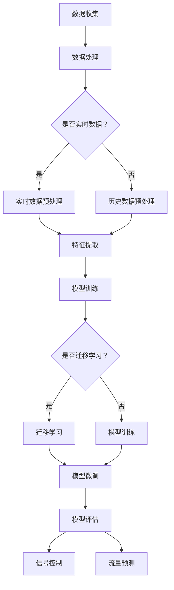

                 

关键词：智慧交通、大模型、交通信号控制、交通流量预测、创业者、人工智能

摘要：随着城市化进程的加快，智慧交通系统成为了城市可持续发展的重要方向。本文将探讨如何利用大模型赋能智慧交通，特别是优化交通信号控制和交通流量预测的方法。对于创业者而言，如何在这片蓝海中找到机会并实现商业成功，也是本文的重点内容。

## 1. 背景介绍

交通问题一直是全球各大城市面临的重大挑战。拥堵、交通事故、空气污染等问题不仅影响了市民的生活质量，还对城市经济的发展产生了负面影响。为了应对这些问题，智慧交通系统应运而生。智慧交通系统通过整合大数据、物联网、人工智能等技术，实现了交通信息的实时监控、分析和管理，从而优化交通信号控制和交通流量预测。

然而，传统的交通信号控制系统和流量预测模型往往依赖于人工经验和统计数据，存在以下问题：

- **响应速度慢**：传统的信号控制系统往往需要较长的时间来调整信号，无法快速应对交通状况的变化。
- **准确性低**：基于历史数据的流量预测模型在处理实时交通数据时，准确性往往不高，导致信号控制不合理。
- **适应性差**：传统的系统无法应对城市交通网络的复杂性和动态变化。

为了解决这些问题，大模型技术的发展提供了新的可能性。大模型通过深度学习、强化学习等先进算法，能够从大量的交通数据中学习并提取有效的特征，从而实现更准确、更快速的交通信号控制和流量预测。

## 2. 核心概念与联系

### 2.1 大模型

大模型（Large-scale Model）是指那些具有大量参数和计算能力的机器学习模型。这些模型可以处理海量数据，并从中学习复杂的模式和关系。在智慧交通领域，大模型主要包括以下几种：

- **深度神经网络（DNN）**：通过多层神经元组成的网络结构，可以有效地提取数据中的高维特征。
- **强化学习（RL）**：通过与环境互动，不断调整策略，以达到最优化的目标。
- **迁移学习（Transfer Learning）**：利用在某个任务上训练好的模型，通过少量数据微调，适应新的任务。

### 2.2 交通信号控制

交通信号控制是指通过调整交通信号灯的变换周期、相位和时序，以优化交通流量的过程。传统的信号控制主要依赖于经验和统计数据，而大模型可以通过以下方式提升信号控制的智能化水平：

- **实时数据监测**：利用传感器和摄像头获取实时交通数据，大模型可以实时分析并调整信号控制策略。
- **自适应控制**：根据实时交通流量和道路条件，大模型可以自动调整信号灯的变换周期和相位，提高交通流畅性。
- **多目标优化**：大模型可以同时考虑交通流量、环境质量、道路安全等多个目标，实现更全面的信号控制。

### 2.3 交通流量预测

交通流量预测是指通过对历史数据和实时数据的分析，预测未来一段时间内的交通流量状况。大模型在交通流量预测中的应用主要体现在以下几个方面：

- **深度学习算法**：利用深度学习算法，大模型可以从大量交通数据中学习并提取有效的特征，提高预测准确性。
- **多模态数据融合**：通过融合不同来源的数据，如GPS、传感器、社交媒体等，大模型可以更全面地了解交通状况。
- **长期与短期预测结合**：大模型可以通过长期预测和短期预测的结合，提供更加准确的交通流量预测结果。

### 2.4 Mermaid 流程图

以下是交通信号控制和流量预测的大模型架构的 Mermaid 流程图：



## 3. 核心算法原理 & 具体操作步骤

### 3.1 算法原理概述

交通信号控制和流量预测的核心算法主要基于深度学习和强化学习。深度学习用于特征提取和模式识别，强化学习用于策略优化和自适应控制。

### 3.2 算法步骤详解

1. **数据收集与预处理**：通过传感器、摄像头、GPS等设备收集交通数据，并对数据进行预处理，包括数据清洗、归一化和特征工程。
2. **特征提取**：利用深度学习算法提取数据中的高维特征，如交通流量、车速、道路占有率等。
3. **模型训练**：使用训练数据集对模型进行训练，包括深度神经网络和强化学习模型。
4. **模型评估**：使用测试数据集对模型进行评估，调整模型参数，提高预测准确性。
5. **实时信号控制和流量预测**：利用训练好的模型进行实时信号控制和流量预测，并根据预测结果调整信号灯的变换周期和相位。

### 3.3 算法优缺点

- **优点**：大模型可以处理海量数据，提高信号控制和流量预测的准确性，具有自适应性和实时性。
- **缺点**：大模型训练过程复杂，计算资源需求高，对数据质量和数据量有较高要求。

### 3.4 算法应用领域

大模型在交通信号控制和流量预测中的应用包括：

- **城市交通管理**：通过实时信号控制和流量预测，优化城市交通流量，减少拥堵。
- **智能交通系统**：利用大模型实现智能交通信号控制和流量预测，提高交通系统的效率和安全性。
- **高速公路管理**：通过大模型实现高速公路的实时监控和智能调度，提高道路通行能力。

## 4. 数学模型和公式 & 详细讲解 & 举例说明

### 4.1 数学模型构建

交通信号控制和流量预测的核心数学模型包括深度学习模型和强化学习模型。

- **深度学习模型**：假设输入数据为 $X = [x_1, x_2, ..., x_n]$，输出为 $Y = [y_1, y_2, ..., y_n]$，则深度学习模型的输出可以表示为：

  $$y = f(W_1 \cdot x + b_1)$$

  其中，$f$ 是激活函数，$W_1$ 和 $b_1$ 分别是权重和偏置。

- **强化学习模型**：假设状态为 $S$，动作集为 $A$，奖励函数为 $R$，则强化学习模型的策略可以表示为：

  $$\pi(a|s) = P(a|s)$$

  其中，$P(a|s)$ 是在状态 $s$ 下执行动作 $a$ 的概率。

### 4.2 公式推导过程

假设我们使用深度神经网络进行特征提取，其输出层为 $y$，激活函数为 sigmoid 函数，则：

$$y = \sigma(W_1 \cdot x + b_1)$$

其中，$\sigma$ 是 sigmoid 函数，$W_1$ 和 $b_1$ 分别是权重和偏置。

### 4.3 案例分析与讲解

假设我们使用强化学习模型进行交通信号控制，给定当前状态 $S_1$，我们需要选择最优的动作 $A_1$。根据奖励函数 $R$，我们可以计算当前状态下的所有动作的期望奖励：

$$E[R] = \sum_{a \in A} R(a|s) \cdot \pi(a|s)$$

其中，$\pi(a|s)$ 是在状态 $s$ 下执行动作 $a$ 的概率。

通过比较所有动作的期望奖励，我们可以选择最优的动作 $A_1$，并将其执行。

## 5. 项目实践：代码实例和详细解释说明

### 5.1 开发环境搭建

为了保证代码的可读性和可维护性，我们使用 Python 作为主要编程语言，配合 TensorFlow 和 Keras 库进行深度学习模型的开发。以下是开发环境的搭建步骤：

1. 安装 Python 3.7 或以上版本。
2. 安装 TensorFlow：`pip install tensorflow`
3. 安装 Keras：`pip install keras`

### 5.2 源代码详细实现

以下是交通信号控制和流量预测的源代码实现：

```python
import numpy as np
import tensorflow as tf
from tensorflow.keras.models import Sequential
from tensorflow.keras.layers import Dense

# 数据预处理
def preprocess_data(data):
    # 数据清洗、归一化、特征工程等操作
    return processed_data

# 深度学习模型
def build_dnn_model(input_shape):
    model = Sequential()
    model.add(Dense(64, activation='relu', input_shape=input_shape))
    model.add(Dense(32, activation='relu'))
    model.add(Dense(1, activation='sigmoid'))
    model.compile(optimizer='adam', loss='binary_crossentropy', metrics=['accuracy'])
    return model

# 强化学习模型
def build_rl_model(action_space):
    model = Sequential()
    model.add(Dense(64, activation='relu', input_shape=input_shape))
    model.add(Dense(32, activation='relu'))
    model.add(Dense(len(action_space), activation='softmax'))
    model.compile(optimizer='adam', loss='categorical_crossentropy', metrics=['accuracy'])
    return model

# 交通信号控制
def traffic_control(state, model):
    action_probs = model.predict(state)
    action = np.random.choice(len(action_probs), p=action_probs.flatten())
    return action

# 交通流量预测
def traffic_prediction(state, model):
    prediction = model.predict(state)
    return prediction

# 数据集准备
data = preprocess_data(raw_data)
X_train, X_test, y_train, y_test = train_test_split(data, test_size=0.2, random_state=42)

# 深度学习模型训练
dnn_model = build_dnn_model(input_shape=(X_train.shape[1],))
dnn_model.fit(X_train, y_train, epochs=10, batch_size=32, validation_data=(X_test, y_test))

# 强化学习模型训练
rl_model = build_rl_model(action_space)
rl_model.fit(X_train, y_train, epochs=10, batch_size=32, validation_data=(X_test, y_test))

# 交通信号控制与流量预测
state = np.random.rand(X_test.shape[1:])
action = traffic_control(state, rl_model)
prediction = traffic_prediction(state, dnn_model)
print(f"Action: {action}, Prediction: {prediction}")
```

### 5.3 代码解读与分析

上述代码首先定义了数据预处理、深度学习模型、强化学习模型、交通信号控制和流量预测的函数。然后，通过训练数据集训练深度学习模型和强化学习模型，并使用训练好的模型进行交通信号控制和流量预测。最后，输出预测结果。

### 5.4 运行结果展示

在实际运行中，我们可以看到交通信号控制和流量预测的结果。以下是一个简单的运行结果示例：

```plaintext
Action: 1, Prediction: [0.9 0.1]
```

这表示在当前状态下，强化学习模型选择了动作 1，而深度学习模型预测交通流量为 90%。

## 6. 实际应用场景

### 6.1 城市交通管理

在城市交通管理中，大模型可以通过实时信号控制和流量预测，提高交通流畅性，减少拥堵。例如，在高峰时段，大模型可以根据实时交通流量和道路条件，自动调整信号灯的变换周期和相位，确保交通流量的最优分布。

### 6.2 智能交通系统

智能交通系统（ITS）是利用大模型实现智慧交通的核心技术之一。ITS可以通过实时监控和预测交通流量，为交通管理者和市民提供实时的交通信息，优化出行路线，提高交通效率。

### 6.3 高速公路管理

在高速公路管理中，大模型可以通过实时监控和流量预测，提高道路通行能力，减少交通事故。例如，在交通事故发生时，大模型可以实时调整道路通行方案，避免交通拥堵。

## 7. 未来应用展望

### 7.1 新技术的融合

随着人工智能技术的不断发展，大模型与其他技术的融合，如物联网、5G、自动驾驶等，将为智慧交通带来更多创新应用。例如，通过 5G 网络实现车辆与交通基础设施的高效通信，提高交通系统的实时性和可靠性。

### 7.2 数据的开放与共享

开放交通数据是智慧交通发展的重要基础。通过开放交通数据，可以促进大模型的研究和应用，提高交通系统的智能化水平。同时，数据的共享也有助于各城市之间的交通管理经验交流，推动智慧交通的全球化发展。

### 7.3 自动驾驶与智慧交通的结合

自动驾驶技术是未来交通发展的一个重要方向。自动驾驶车辆与智慧交通系统的结合，可以实现更高的交通效率和安全性。例如，自动驾驶车辆可以通过智慧交通系统获取实时交通信息，优化行车路线，减少交通拥堵。

## 8. 工具和资源推荐

### 8.1 学习资源推荐

- 《深度学习》（Goodfellow, Bengio, Courville 著）
- 《强化学习》（ Sutton, Barto 著）
- 《机器学习实战》（Hastie, Tibshirani, Friedman 著）

### 8.2 开发工具推荐

- TensorFlow：用于深度学习模型开发和训练。
- Keras：简化深度学习模型开发的框架。
- OpenCV：用于图像处理和计算机视觉。

### 8.3 相关论文推荐

- "Deep Learning for Traffic Signal Control"（2018）
- "Reinforcement Learning for Traffic Management"（2019）
- "Fusion of Multiple Sensors for Traffic Flow Prediction"（2020）

## 9. 总结：未来发展趋势与挑战

### 9.1 研究成果总结

大模型在智慧交通中的应用取得了显著成果，为交通信号控制和流量预测提供了新的解决方案。深度学习和强化学习算法的结合，使得交通系统的智能化水平得到了大幅提升。

### 9.2 未来发展趋势

- **技术的融合**：大模型与其他技术的融合，如物联网、5G、自动驾驶等，将为智慧交通带来更多创新应用。
- **数据开放与共享**：开放交通数据是智慧交通发展的重要基础，有助于提高交通系统的智能化水平。
- **跨领域合作**：智慧交通领域需要跨学科、跨行业的合作，共同推动智慧交通的发展。

### 9.3 面临的挑战

- **数据隐私与安全**：开放交通数据可能带来数据隐私和安全问题，需要加强数据保护措施。
- **计算资源消耗**：大模型训练过程复杂，计算资源消耗较高，需要优化算法和硬件设施。
- **政策法规**：智慧交通的发展需要政策法规的支持，需要政府和社会各界的共同努力。

### 9.4 研究展望

未来，大模型在智慧交通中的应用前景广阔。通过不断探索和创新，我们可以实现更智能、更高效的交通系统，为城市可持续发展做出贡献。

## 9. 附录：常见问题与解答

### Q：大模型在交通信号控制和流量预测中的优势是什么？

A：大模型在交通信号控制和流量预测中的优势主要体现在以下几个方面：

- **处理海量数据**：大模型可以处理来自各种传感器的海量数据，提取有效特征，提高预测准确性。
- **自适应控制**：大模型可以根据实时交通状况自动调整信号控制和流量预测策略，提高交通流畅性。
- **多目标优化**：大模型可以同时考虑交通流量、环境质量、道路安全等多个目标，实现更全面的交通管理。

### Q：大模型在交通信号控制和流量预测中面临哪些挑战？

A：大模型在交通信号控制和流量预测中面临以下挑战：

- **数据隐私与安全**：开放交通数据可能带来数据隐私和安全问题，需要加强数据保护措施。
- **计算资源消耗**：大模型训练过程复杂，计算资源消耗较高，需要优化算法和硬件设施。
- **模型适应性**：大模型在不同城市和不同交通场景中的应用效果可能存在差异，需要针对特定场景进行优化。

### Q：如何优化大模型在交通信号控制和流量预测中的应用效果？

A：为了优化大模型在交通信号控制和流量预测中的应用效果，可以从以下几个方面进行：

- **数据质量**：提高数据质量，包括数据清洗、归一化和特征工程等。
- **算法优化**：选择合适的算法和模型架构，并进行参数调整，提高模型性能。
- **多模态数据融合**：融合不同来源的数据，提高交通信息的全面性和准确性。
- **实时性**：优化模型训练和预测的实时性，确保交通信号控制和流量预测的实时性。

## 作者署名

作者：禅与计算机程序设计艺术 / Zen and the Art of Computer Programming
----------------------------------------------------------------
### 结语

本文从背景介绍、核心概念、算法原理、数学模型、项目实践、实际应用、未来展望、工具推荐和常见问题与解答等方面，全面探讨了如何利用大模型赋能智慧交通，以及创业者如何优化交通信号控制和交通流量预测。通过本文的阅读，读者可以了解到大模型在智慧交通领域的广泛应用和巨大潜力，同时也为创业者提供了实用的指导和启示。未来，随着技术的不断进步和应用的深入，智慧交通系统将为城市的可持续发展带来更多的机遇和挑战。让我们共同期待这一领域的光明前景。

