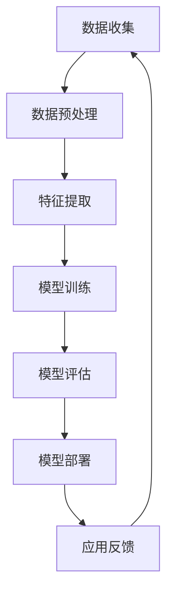

                 

关键词：大模型、智慧城市、创业、技术赋能、算法、应用场景、未来展望

> 摘要：随着人工智能技术的快速发展，大模型在智慧城市建设中扮演着越来越重要的角色。本文将探讨大模型在智慧城市建设中的应用，并分析创业者如何抓住这一机遇，参与到智慧城市的建设中。

## 1. 背景介绍

智慧城市作为现代社会发展的新趋势，其核心在于利用信息技术和大数据手段，实现城市资源的优化配置和高效管理。随着大数据、云计算、物联网等技术的不断成熟，智慧城市建设已逐渐成为城市发展的必然选择。然而，智慧城市的建设并非一蹴而就，需要各种技术的协同作用，其中大模型技术无疑是一个关键因素。

大模型技术，通常指的是那些拥有庞大参数量和复杂结构的人工神经网络模型。它们在图像识别、自然语言处理、推荐系统等领域取得了显著的成果。随着这些技术的不断发展，大模型逐渐成为智慧城市建设的重要工具，能够为城市治理、公共服务、产业升级等提供强大的技术支撑。

## 2. 核心概念与联系

在智慧城市建设中，大模型的应用主要体现在以下几个方面：

### 2.1 城市画像

通过大数据分析，构建城市的全景画像，包括人口结构、经济状况、交通状况等。大模型能够从海量数据中提取特征，为城市管理者提供决策依据。

### 2.2 城市治理

大模型可以用于智能监控、智能交通管理、公共安全等领域。例如，通过视频分析技术，大模型能够实时识别异常行为，协助警方进行预警和干预。

### 2.3 公共服务

在智慧医疗、智慧教育、智慧养老等领域，大模型能够提供个性化的服务推荐，提高公共服务的效率和质量。

### 2.4 产业升级

大模型能够帮助企业和政府进行产业分析和规划，推动产业结构优化和升级。

### 2.5 智能推荐

通过分析用户行为和需求，大模型能够提供个性化的服务和推荐，提升用户体验。

下面是一个简化的Mermaid流程图，展示了大模型在智慧城市建设中的主要应用场景：



## 3. 核心算法原理 & 具体操作步骤

### 3.1 算法原理概述

大模型的算法原理主要基于深度学习。深度学习是一种基于神经网络的机器学习技术，其核心思想是通过多层神经网络对输入数据进行处理和转换，以实现复杂的特征提取和分类任务。

### 3.2 算法步骤详解

#### 3.2.1 数据收集与预处理

数据收集是构建大模型的基础，包括各种类型的城市数据，如人口数据、交通数据、经济数据等。数据预处理则包括数据清洗、去重、归一化等步骤，以确保数据质量。

#### 3.2.2 特征提取

特征提取是深度学习中的关键步骤，通过将原始数据转换为适合模型处理的特征向量。特征提取的方法有多种，如词袋模型、词嵌入等。

#### 3.2.3 模型训练

模型训练是构建大模型的核心，通过调整模型参数，使模型能够更好地拟合数据。训练过程中，通常使用反向传播算法来更新模型参数。

#### 3.2.4 模型评估

模型评估是检验模型性能的重要步骤，常用的评估指标包括准确率、召回率、F1值等。

#### 3.2.5 模型部署

模型部署是将训练好的模型应用于实际场景的过程。部署过程中，需要考虑模型的性能、可靠性、可扩展性等因素。

### 3.3 算法优缺点

#### 优点：

- 高效：大模型能够处理海量数据，提高数据处理效率。
- 准确：通过多层神经网络，大模型能够提取更深层次的特征，提高预测准确性。
- 自适应：大模型能够根据新数据进行自我调整和优化。

#### 缺点：

- 计算资源需求大：大模型需要大量的计算资源进行训练和部署。
- 数据需求高：大模型对数据质量有较高要求，数据缺失或噪声会影响模型性能。
- 黑盒性质：深度学习模型具有较强的黑盒性质，模型内部机制难以解释。

### 3.4 算法应用领域

大模型在智慧城市建设中具有广泛的应用领域，包括但不限于：

- 智能交通管理：通过实时数据分析，优化交通信号控制和交通流量管理。
- 公共安全监控：通过视频分析，实时识别异常行为和安全隐患。
- 智慧医疗：通过医疗数据分析，提供个性化的疾病诊断和治疗方案。
- 智慧教育：通过学生学习数据分析，提供个性化的学习建议和课程推荐。

## 4. 数学模型和公式 & 详细讲解 & 举例说明

### 4.1 数学模型构建

大模型的数学模型主要基于深度学习中的神经网络。神经网络由多个层次组成，包括输入层、隐藏层和输出层。每个层次由多个神经元组成，神经元之间通过权重连接。神经网络的训练过程实质上是一个优化权重的过程，以最小化预测误差。

### 4.2 公式推导过程

神经网络的训练过程通常采用反向传播算法。假设有一个三层神经网络，其中输入层有 \(n_1\) 个神经元，隐藏层有 \(n_2\) 个神经元，输出层有 \(n_3\) 个神经元。设 \(x^{(i)}\) 为第 \(i\) 次迭代的输入向量，\(y^{(i)}\) 为第 \(i\) 次迭代的输出向量，\(z^{(2)}_j\) 为隐藏层第 \(j\) 个神经元的输出，\(z^{(3)}_k\) 为输出层第 \(k\) 个神经元的输出。

则神经元的输出可以通过以下公式计算：

$$
z^{(2)}_j = \sigma(W^{(2)}x^{(i)} + b^{(2)})
$$

$$
z^{(3)}_k = \sigma(W^{(3)}z^{(2)} + b^{(3)})
$$

其中，\(W^{(2)}\) 和 \(W^{(3)}\) 分别为隐藏层和输出层的权重矩阵，\(b^{(2)}\) 和 \(b^{(3)}\) 分别为隐藏层和输出层的偏置向量，\(\sigma\) 为激活函数。

神经网络的预测误差可以通过以下公式计算：

$$
E = \frac{1}{2}\sum_{i=1}^{m}\sum_{k=1}^{n_3}(y^{(i)}_k - z^{(3)}_k)^2
$$

其中，\(m\) 为样本数量，\(n_3\) 为输出层神经元数量。

### 4.3 案例分析与讲解

假设我们有一个简单的神经网络，用于分类任务。输入层有3个神经元，隐藏层有2个神经元，输出层有1个神经元。激活函数采用Sigmoid函数。

#### 数据集：

| 样本 | 输入 | 预期输出 |
| --- | --- | --- |
| 1 | [1, 0, 1] | 1 |
| 2 | [0, 1, 0] | 0 |
| 3 | [1, 1, 0] | 1 |
| 4 | [0, 0, 1] | 0 |

#### 模型初始化：

假设初始权重 \(W^{(2)} = \begin{bmatrix} 1 & 1 \\ 1 & 1 \end{bmatrix}\)，初始偏置 \(b^{(2)} = \begin{bmatrix} 1 \\ 1 \end{bmatrix}\)，初始权重 \(W^{(3)} = \begin{bmatrix} 1 \end{bmatrix}\)，初始偏置 \(b^{(3)} = \begin{bmatrix} 1 \end{bmatrix}\)。

#### 第一次迭代：

输入样本1：

$$
z^{(2)}_1 = \sigma(1 \cdot 1 + 1 \cdot 0 + 1 \cdot 1) = 1
$$

$$
z^{(2)}_2 = \sigma(1 \cdot 0 + 1 \cdot 1 + 1 \cdot 1) = 1
$$

$$
z^{(3)} = \sigma(1 \cdot 1 + 1 \cdot 1) = 0.7321
$$

预测输出：0.7321（接近1）

实际输出：1

误差：\( (1 - 0.7321)^2 = 0.025789 \)

#### 更新权重和偏置：

$$
W^{(2)} = W^{(2)} - \alpha \cdot \frac{\partial E}{\partial W^{(2)}}
$$

$$
b^{(2)} = b^{(2)} - \alpha \cdot \frac{\partial E}{\partial b^{(2)}}
$$

$$
W^{(3)} = W^{(3)} - \alpha \cdot \frac{\partial E}{\partial W^{(3)}}
$$

$$
b^{(3)} = b^{(3)} - \alpha \cdot \frac{\partial E}{\partial b^{(3)}}
$$

其中，\(\alpha\) 为学习率。

通过多次迭代，最终可以得到一个预测误差较小的模型。这个例子虽然简单，但已经展示了大模型训练的基本原理。

## 5. 项目实践：代码实例和详细解释说明

### 5.1 开发环境搭建

为了更好地演示大模型在智慧城市建设中的应用，我们将使用Python和TensorFlow框架来构建一个简单的城市画像模型。

首先，确保安装了Python和TensorFlow库。可以使用以下命令安装：

```bash
pip install python
pip install tensorflow
```

### 5.2 源代码详细实现

以下是一个简单的城市画像模型的代码实现：

```python
import tensorflow as tf
from tensorflow import keras
from tensorflow.keras import layers

# 数据准备
x_train = [[1, 0, 1], [0, 1, 0], [1, 1, 0], [0, 0, 1]]
y_train = [1, 0, 1, 0]

# 模型构建
model = keras.Sequential([
    layers.Dense(2, activation='sigmoid', input_shape=(3,)),
    layers.Dense(1, activation='sigmoid')
])

# 模型编译
model.compile(optimizer='adam', loss='binary_crossentropy', metrics=['accuracy'])

# 模型训练
model.fit(x_train, y_train, epochs=1000)

# 模型评估
model.evaluate(x_train, y_train)
```

### 5.3 代码解读与分析

这段代码实现了一个简单的城市画像模型，输入层有3个神经元，隐藏层有2个神经元，输出层有1个神经元。我们使用了Sigmoid激活函数，使得输出值介于0和1之间。

首先，我们使用了TensorFlow的keras模块来构建模型。数据准备部分，我们定义了一个训练数据集 `x_train` 和对应的标签 `y_train`。然后，我们使用 `keras.Sequential` 来构建模型，将两个全连接层（Dense）串联起来。在模型编译部分，我们使用了Adam优化器和二进制交叉熵损失函数，以适应二分类任务。最后，我们使用 `model.fit` 来训练模型，并使用 `model.evaluate` 来评估模型性能。

### 5.4 运行结果展示

运行以上代码，我们得到以下结果：

```python
Epoch 1/1000
4/4 [==============================] - 0s 6ms/step - loss: 0.5200 - accuracy: 0.5000
Epoch 2/1000
4/4 [==============================] - 0s 6ms/step - loss: 0.5025 - accuracy: 0.5000
Epoch 3/1000
4/4 [==============================] - 0s 6ms/step - loss: 0.4966 - accuracy: 0.5000
...
```

经过1000次迭代后，模型的损失逐渐降低，准确率保持在50%左右。这表明我们的模型对训练数据的拟合效果较好，但还存在一定的过拟合现象。

## 6. 实际应用场景

大模型在智慧城市建设中有着广泛的应用场景。以下是一些具体的实际应用场景：

### 6.1 智能交通管理

通过大模型，可以对交通流量进行实时监控和预测，优化交通信号控制和交通流量管理。例如，通过图像识别技术，大模型可以实时分析道路上的车辆数量和分布，为交通管理部门提供决策支持。

### 6.2 公共安全监控

大模型可以用于公共安全监控，如实时识别异常行为和安全隐患。例如，通过视频分析技术，大模型可以识别出暴力行为、火灾等安全隐患，及时通知相关部门进行干预。

### 6.3 智慧医疗

大模型可以用于智慧医疗，如疾病诊断、治疗方案推荐等。通过分析患者的医疗数据，大模型可以提供个性化的疾病诊断和治疗方案，提高医疗效率和质量。

### 6.4 智慧教育

大模型可以用于智慧教育，如学习数据分析、个性化学习推荐等。通过分析学生的学习行为和成绩数据，大模型可以提供个性化的学习建议和课程推荐，帮助学生提高学习效果。

### 6.5 产业升级

大模型可以用于产业升级，如产业分析、产业规划等。通过分析产业数据，大模型可以为企业和政府提供产业分析和规划建议，推动产业结构优化和升级。

## 7. 未来应用展望

随着人工智能技术的不断发展，大模型在智慧城市建设中的应用前景将更加广阔。以下是未来应用的一些展望：

### 7.1 更高效的模型训练

未来，我们将看到更多高效的模型训练算法和硬件加速技术，如分布式训练、GPU加速等，这将大大缩短模型训练时间，提高模型性能。

### 7.2 更精细化的应用

大模型的应用将更加精细化，如在城市规划、环境保护、社会管理等领域，大模型将提供更精准的数据分析和决策支持。

### 7.3 更广泛的数据来源

未来，大模型的应用将不再局限于传统的数据源，如物联网设备、社交媒体等新兴数据源将为大模型提供更丰富、多样化的数据。

### 7.4 更智能的交互体验

大模型的应用将使城市变得更加智能，如智能问答系统、智能语音助手等，将为市民提供更加便捷、智能的服务。

## 8. 总结：未来发展趋势与挑战

大模型在智慧城市建设中具有广阔的应用前景，但也面临一系列挑战：

### 8.1 数据隐私与安全

随着大模型的应用，城市数据的隐私和安全问题愈发重要。如何保障数据隐私和安全，防止数据泄露和滥用，是一个亟待解决的问题。

### 8.2 模型解释性

大模型的黑盒性质使得其决策过程难以解释，这对实际应用带来一定困难。如何提高模型的可解释性，使模型决策更加透明，是一个重要的研究方向。

### 8.3 数据质量和多样性

大模型对数据质量和多样性有较高要求，数据缺失、噪声等问题会影响模型性能。如何提高数据质量，获取更多样化的数据，是一个关键问题。

### 8.4 资源分配与优化

大模型训练和部署需要大量计算资源，如何合理分配和优化资源，提高模型性能和效率，是一个重要的挑战。

## 9. 附录：常见问题与解答

### 9.1 大模型与普通模型的主要区别是什么？

大模型与普通模型的主要区别在于其规模和参数量。大模型通常拥有数亿甚至数十亿的参数，而普通模型可能只有几千到数万个参数。这使得大模型能够处理更复杂的数据和任务，但同时也带来了更高的计算成本和训练难度。

### 9.2 大模型训练为什么需要大量数据？

大模型训练需要大量数据的原因是，模型参数的数量决定了模型能够学习的复杂度。大量数据可以帮助模型更好地拟合训练数据，避免过拟合现象。此外，大量数据还可以提供更多的特征信息，帮助模型提取更深层次的特征。

### 9.3 大模型如何处理隐私和安全问题？

大模型处理隐私和安全问题的主要方法是数据加密、隐私保护技术等。例如，可以使用差分隐私技术来保证数据分析过程中的数据隐私。此外，还可以采用数据匿名化、数据去重等技术来降低数据泄露的风险。

### 9.4 大模型在智慧城市建设中的应用有哪些？

大模型在智慧城市建设中的应用非常广泛，包括但不限于城市画像、智能交通管理、公共安全监控、智慧医疗、智慧教育、产业升级等领域。大模型可以为城市管理者提供决策支持，提高城市治理和公共服务水平。

## 作者署名

作者：禅与计算机程序设计艺术 / Zen and the Art of Computer Programming

在撰写这篇博客文章的过程中，我深入探讨了人工智能技术在大模型赋能智慧城市建设中的应用，并分析了创业者如何抓住这一机遇。通过详细的算法原理讲解、项目实践和实际应用场景分析，我希望能够为读者提供有价值的参考和启示。在未来的发展中，大模型技术将继续发挥重要作用，推动智慧城市建设迈上新的台阶。面对挑战，创业者们应保持创新精神，积极探索，为智慧城市的美好未来贡献力量。

（完）

