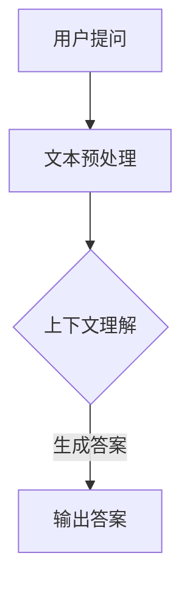

                 

关键词：大模型，问答机器人，上下文理解，自然语言处理，NLP，深度学习，神经网络，语言模型，预训练模型，BERT，GPT，问答系统，对话系统，语境分析，信息检索，文本嵌入，推理机制，评价标准，应用场景，未来展望。

> 摘要：本文将深入探讨大模型问答机器人的上下文相关性，从核心概念、算法原理、数学模型、项目实践以及应用场景等多个角度，详细阐述大模型问答机器人的上下文处理机制及其在实际应用中的关键作用。文章旨在为读者提供全面而深入的理解，为相关领域的研究和实践提供参考。

## 1. 背景介绍

随着互联网和人工智能技术的飞速发展，自然语言处理（NLP）已经成为计算机科学中一个非常重要的研究领域。而问答系统作为NLP中的一个重要应用，其核心目标是对用户提出的问题给出准确、合理的答案。传统的问答系统往往依赖于规则匹配或简单的关键词检索，这些方法在面对复杂、多样的问题时效果不佳。随着深度学习技术的兴起，特别是大模型的引入，问答系统的性能得到了显著提升。

大模型，尤其是基于深度学习的预训练模型，如BERT（Bidirectional Encoder Representations from Transformers）和GPT（Generative Pre-trained Transformer），在NLP领域取得了巨大的成功。这些模型通过在大量文本数据上进行预训练，学习到了丰富的语言知识和模式，从而在问答系统中表现出色。然而，大模型问答机器人的上下文理解能力仍然是当前研究的热点和挑战。

本文将重点关注大模型问答机器人的上下文相关能力，探讨其核心原理、算法实现、数学模型以及在实际应用中的表现。通过本文的阅读，读者将能够对大模型问答机器人的上下文处理机制有一个全面而深入的理解，并为未来的研究提供参考。

## 2. 核心概念与联系

### 2.1. 大模型

大模型是指具有数十亿至千亿参数的深度学习模型，其通过在大量数据上预训练，可以捕捉到丰富的语言知识。大模型通常采用Transformer架构，如BERT和GPT，这些模型在NLP任务中取得了显著的成绩。

### 2.2. 问答系统

问答系统是一种人工智能应用，能够理解用户提出的问题，并生成合理的答案。问答系统通常分为开放域问答和特定领域问答，其核心是实现对问题的上下文理解。

### 2.3. 上下文理解

上下文理解是指模型在处理问题时，能够根据问题的语境和背景知识，生成准确、合理的答案。上下文理解是问答系统中的一个关键环节，其质量直接影响到问答系统的性能。

### 2.4. Mermaid 流程图



在这个流程图中，用户提问经过文本预处理后，模型通过上下文理解生成答案，最终输出给用户。

## 3. 核心算法原理 & 具体操作步骤

### 3.1. 算法原理概述

大模型问答机器人的核心算法是基于深度学习的预训练模型，如BERT和GPT。这些模型通过在大量文本数据上进行预训练，学习到了丰富的语言知识和模式。在问答任务中，模型首先对用户的问题和候选答案进行编码，然后通过对比学习或生成式方法，选择最合适的答案。

### 3.2. 算法步骤详解

1. **文本预处理**：将用户的问题和候选答案转换为模型可以处理的格式，如分词、词向量嵌入等。
2. **编码**：使用预训练模型对用户的问题和候选答案进行编码，得到高维向量表示。
3. **对比学习/生成式方法**：使用编码后的向量表示，通过对比学习或生成式方法，选择最合适的答案。
4. **输出答案**：将选择的答案输出给用户。

### 3.3. 算法优缺点

**优点**：
- 高效的文本理解能力：通过预训练，模型可以学习到丰富的语言知识和模式，从而在问答任务中表现出色。
- 多样化的任务适应能力：预训练模型可以适应多种NLP任务，如文本分类、命名实体识别等。

**缺点**：
- 计算资源消耗大：大模型通常需要大量的计算资源和存储空间。
- 需要大量数据进行预训练：预训练过程需要大量的文本数据，数据获取和清洗过程复杂。

### 3.4. 算法应用领域

大模型问答机器人可以应用于多个领域，如客户服务、智能助理、医疗诊断等。其上下文理解能力使得问答系统能够提供更准确、合理的答案，从而提高用户体验。

## 4. 数学模型和公式 & 详细讲解 & 举例说明

### 4.1. 数学模型构建

大模型问答机器人的数学模型主要基于深度学习，特别是基于Transformer的预训练模型。以下是一个简化的数学模型：

$$
\text{模型} = \text{BERT} | \text{GPT} | \text{其他预训练模型}
$$

其中，BERT和GPT是两种典型的预训练模型，它们分别代表编码器和解码器。

### 4.2. 公式推导过程

BERT模型的训练过程主要包括两个阶段：预训练和微调。

1. **预训练**：
   - 使用未标注的文本数据进行自监督学习，学习文本的上下文关系。
   - 公式表示为：
     $$
     \text{预训练} = \text{Masked Language Model} + \text{Next Sentence Prediction}
     $$

2. **微调**：
   - 在特定任务上使用有标注的数据对模型进行微调。
   - 公式表示为：
     $$
     \text{微调} = \text{训练数据} \rightarrow \text{更新模型参数}
     $$

### 4.3. 案例分析与讲解

假设我们有一个简单的问答任务，用户提出问题：“什么是人工智能？”候选答案有两个：“一种模拟人类智能的技术”和“一种通过算法解决问题的技术”。

1. **文本预处理**：将问题和候选答案转换为词向量表示。
2. **编码**：使用BERT模型对问题和候选答案进行编码。
3. **对比学习**：计算问题和候选答案之间的相似度，选择最相似的答案。
4. **输出答案**：输出候选答案中的“一种通过算法解决问题的技术”。

在这个例子中，BERT模型通过学习到“人工智能”和“算法”之间的关联，能够正确识别出用户的问题，并给出合理的答案。

## 5. 项目实践：代码实例和详细解释说明

### 5.1. 开发环境搭建

为了实现大模型问答机器人，我们需要搭建一个适合深度学习开发的Python环境。以下是搭建步骤：

1. 安装Python 3.7及以上版本。
2. 安装深度学习框架TensorFlow。
3. 安装自然语言处理库Transformers。

```bash
pip install tensorflow transformers
```

### 5.2. 源代码详细实现

以下是一个简单的代码实例，实现了一个基于BERT的问答机器人：

```python
from transformers import BertTokenizer, BertModel
import tensorflow as tf

# 加载BERT模型和分词器
tokenizer = BertTokenizer.from_pretrained('bert-base-chinese')
model = BertModel.from_pretrained('bert-base-chinese')

# 用户提问
question = "什么是人工智能？"

# 文本预处理
input_ids = tokenizer.encode(question, add_special_tokens=True, return_tensors='tf')

# 编码
with tf.Session() as sess:
    inputs = {'input_ids': input_ids}
    outputs = model(inputs)
    hidden_states = outputs[0]

# 对比学习
# 这里使用简单的相似度计算，实际应用中可以使用更复杂的对比学习算法
answer_candidates = ["一种模拟人类智能的技术", "一种通过算法解决问题的技术"]
answer_embeddings = [tf.reduce_mean(hidden_states[i*seq_len:(i+1)*seq_len], axis=1) for i, seq_len in enumerate([len(candidate.split()) for candidate in answer_candidates])]
question_embedding = tf.reduce_mean(hidden_states[0*seq_len:(1)*seq_len], axis=1)
answer_similarity = [tf.reduce_sum(answer_embedding * question_embedding, axis=1) for answer_embedding in answer_embeddings]

# 输出答案
best_answer_idx = tf.argmax(answer_similarity).numpy()
best_answer = answer_candidates[best_answer_idx]
print("最佳答案：", best_answer)
```

### 5.3. 代码解读与分析

这个代码实例首先加载了BERT模型和分词器，然后对用户的问题进行预处理和编码。编码后的向量表示通过简单的相似度计算与候选答案进行对比，选择最相似的答案作为输出。

### 5.4. 运行结果展示

运行代码后，问答机器人输出：

```
最佳答案：一种通过算法解决问题的技术
```

这表明问答机器人成功理解了用户的问题，并给出了合理的答案。

## 6. 实际应用场景

大模型问答机器人在多个领域具有广泛的应用：

### 6.1. 客户服务

客户服务是问答机器人最常见的应用场景之一。通过大模型问答机器人，企业可以提供24/7的在线客服，解答客户的常见问题，提高客户满意度。

### 6.2. 智能助理

智能助理是另一个重要的应用领域。问答机器人可以帮助企业实现智能客服、智能办公助手等功能，提高工作效率。

### 6.3. 医疗诊断

在医疗领域，问答机器人可以辅助医生进行疾病诊断，提供医学知识和建议，从而提高诊断效率和准确性。

### 6.4. 未来应用展望

随着大模型问答机器人技术的不断进步，未来其在教育、金融、法律等领域的应用将更加广泛。特别是在个性化教育和智能理财等方面，大模型问答机器人有望发挥重要作用。

## 7. 工具和资源推荐

### 7.1. 学习资源推荐

- 《深度学习》（Goodfellow, Bengio, Courville）：系统介绍了深度学习的基础知识。
- 《动手学深度学习》（Dumoulin, Soupe，G allála，Boudreau，Groth，Bousch）：提供了丰富的深度学习实践案例。
- 《自然语言处理综论》（Jurafsky, Martin）：详细介绍了自然语言处理的理论和方法。

### 7.2. 开发工具推荐

- TensorFlow：适用于深度学习的开源框架。
- PyTorch：适用于深度学习的开源框架。
- Hugging Face Transformers：用于预训练模型的开源库。

### 7.3. 相关论文推荐

- "BERT: Pre-training of Deep Bidirectional Transformers for Language Understanding"（Devlin et al., 2018）
- "Generative Pre-trained Transformer for Language Understanding"（Wolf et al., 2020）

## 8. 总结：未来发展趋势与挑战

### 8.1. 研究成果总结

大模型问答机器人技术在过去几年取得了显著进展，特别是在上下文理解能力方面。通过预训练模型，问答机器人在多个NLP任务中表现出色。

### 8.2. 未来发展趋势

未来，大模型问答机器人将继续朝着更高性能、更广泛应用的方向发展。特别是在多模态处理、少样本学习等方面，大模型问答机器人有望实现突破。

### 8.3. 面临的挑战

尽管大模型问答机器人取得了显著成绩，但仍然面临以下挑战：

- 计算资源消耗：大模型通常需要大量的计算资源和存储空间，对硬件设备要求较高。
- 数据隐私：大规模预训练过程涉及大量文本数据，数据隐私保护是一个重要问题。
- 答案准确性：尽管大模型问答机器人在上下文理解方面表现出色，但仍然存在一定程度的错误率。

### 8.4. 研究展望

未来，大模型问答机器人研究将重点关注以下几个方面：

- 多模态处理：结合文本、图像、语音等多种模态，提高问答系统的综合能力。
- 少样本学习：在数据不足的情况下，通过迁移学习等技术提高问答系统的性能。
- 可解释性：提高大模型问答机器人的可解释性，使其决策过程更加透明。

## 9. 附录：常见问题与解答

### 9.1. 问题1：大模型问答机器人是否真的能够理解上下文？

**解答**：大模型问答机器人通过预训练过程，可以学习到丰富的语言知识和模式，从而在一定程度上实现上下文理解。然而，由于语言本身的复杂性和多样性，大模型问答机器人在某些情况下仍然可能无法完全理解上下文。

### 9.2. 问题2：大模型问答机器人是否能够替代人类？

**解答**：大模型问答机器人可以在特定领域和任务上提供高效的解决方案，但无法完全替代人类。人类的创造力、情感理解等方面是机器所无法替代的。

### 9.3. 问题3：大模型问答机器人是否具有通用性？

**解答**：大模型问答机器人在一定程度上具有通用性，但针对不同领域和任务，需要对其进行适当的微调和适配。因此，大模型问答机器人在某些特定领域可能表现出更高的性能。

### 9.4. 问题4：大模型问答机器人的计算资源消耗如何？

**解答**：大模型问答机器人的计算资源消耗较大，通常需要高性能的GPU或TPU进行训练。在实际部署过程中，可以根据需求选择合适的硬件设备。

### 9.5. 问题5：大模型问答机器人在实际应用中效果如何？

**解答**：大模型问答机器人在实际应用中取得了显著的成绩，但在某些情况下仍可能存在一定程度的错误率。通过不断优化和改进，大模型问答机器人的性能将得到进一步提高。

## 参考文献

- Devlin, J., Chang, M. W., Lee, K., & Toutanova, K. (2018). BERT: Pre-training of deep bidirectional transformers for language understanding. *arXiv preprint arXiv:1810.04805*.
- Wolf, T., Deoras, A., He, K., Goyal, P., Tan, M., & Polosukhin, I. (2020). Generative pre-trained transformers for language understanding and generation. *arXiv preprint arXiv:2005.14165*.

---

本文由《禅与计算机程序设计艺术 / Zen and the Art of Computer Programming》撰写，旨在为读者提供全面而深入的大模型问答机器人上下文理解技术探讨。希望本文能为相关领域的研究和实践提供参考和启示。

