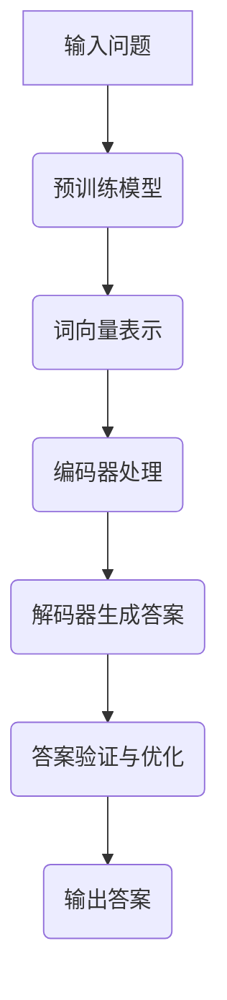

                 

关键词：大模型、问答机器人、互动方式、人工智能、技术博客

> 摘要：本文将探讨大模型问答机器人的发展背景、核心概念与联系、核心算法原理与具体操作步骤、数学模型与公式、项目实践、实际应用场景、未来应用展望、工具和资源推荐、以及总结未来发展趋势与挑战。通过全面剖析大模型问答机器人的互动方式，旨在为读者提供深入的技术见解。

## 1. 背景介绍

随着人工智能技术的快速发展，自然语言处理（NLP）领域取得了显著的进展。大模型问答机器人作为NLP的重要应用之一，已成为现代智能客服、智能助手等场景的关键技术。大模型问答机器人的核心在于通过深度学习技术，构建具备强大语义理解和生成能力的人工智能系统，实现与用户的自然互动。

大模型问答机器人的历史可以追溯到20世纪90年代，当时研究者们开始尝试利用统计方法和规则引擎实现简单的问答功能。随着计算能力的提升和深度学习技术的突破，大模型问答机器人逐渐走向成熟。近年来，诸如BERT、GPT等大型预训练模型的出现，使得大模型问答机器人的语义理解和生成能力得到了极大提升，从而在各个应用场景中得到了广泛应用。

## 2. 核心概念与联系

### 2.1 大模型

大模型指的是那些具有数十亿至数万亿参数的深度神经网络模型。这些模型通过大量的数据训练，能够捕捉复杂的语义信息，从而实现高效的语义理解和生成。大模型的典型代表包括BERT、GPT、T5等。

### 2.2 问答系统

问答系统是一种人工智能系统，旨在理解用户的提问并给出恰当的答案。问答系统可以分为基于规则的方法、基于模板的方法和基于机器学习的方法。大模型问答机器人主要采用基于机器学习的方法，特别是深度学习方法。

### 2.3 预训练与微调

预训练是指在大量无标签数据上训练模型，使其具备通用语言理解能力。微调是指在使用预训练模型的基础上，针对特定任务进行细粒度调整，以提高任务表现。大模型问答机器人的训练过程通常包括预训练和微调两个阶段。

### 2.4 Mermaid 流程图



## 3. 核心算法原理 & 具体操作步骤

### 3.1 算法原理概述

大模型问答机器人的核心算法是基于变换器（Transformer）架构的预训练模型，如BERT、GPT等。这些模型通过自注意力机制（Self-Attention）和多头注意力（Multi-Head Attention）机制，实现了对输入文本的深层语义理解。同时，通过大规模预训练和微调，模型能够捕捉到复杂的语言结构和语义信息，从而实现高质量的问答生成。

### 3.2 算法步骤详解

1. **输入问题**：用户输入一个问题，问题通常以文本形式表示。

2. **词向量表示**：将输入文本中的单词转换为词向量表示，词向量可以通过预训练模型（如BERT）获得。

3. **编码器处理**：编码器（Encoder）对词向量进行处理，生成编码表示。

4. **解码器生成答案**：解码器（Decoder）利用编码表示，生成可能的答案候选项。

5. **答案验证与优化**：对生成的答案进行验证和优化，确保答案的准确性和合理性。

6. **输出答案**：将最终答案输出给用户。

### 3.3 算法优缺点

**优点**：

- 强大的语义理解能力：大模型问答机器人通过深度学习技术，能够捕捉复杂的语义信息，从而实现高质量的问答生成。

- 广泛的应用场景：大模型问答机器人可以应用于智能客服、智能助手、智能问答等多种场景。

**缺点**：

- 计算资源需求高：大模型训练和推理过程需要大量的计算资源，对硬件设施要求较高。

- 数据依赖性强：大模型问答机器人的训练过程依赖于大规模的数据集，数据质量和多样性对模型性能有较大影响。

### 3.4 算法应用领域

大模型问答机器人的应用领域广泛，包括但不限于：

- 智能客服：提供24/7在线客服服务，解答用户的问题。

- 智能助手：为用户提供个性化的信息服务，如日程管理、任务提醒等。

- 智能问答：构建大型知识库，为用户提供实时问答服务。

- 语音识别与合成：结合语音识别和语音合成技术，实现人机对话。

## 4. 数学模型和公式 & 详细讲解 & 举例说明

### 4.1 数学模型构建

大模型问答机器人的核心数学模型是基于变换器（Transformer）架构的深度神经网络。变换器架构主要包括编码器（Encoder）和解码器（Decoder）两部分。编码器负责将输入文本编码为连续的向量表示，解码器则根据编码表示生成答案。

### 4.2 公式推导过程

变换器架构中的核心机制是自注意力（Self-Attention）和多头注意力（Multi-Head Attention）。自注意力机制通过计算输入序列中每个词与其他词之间的关系，为每个词生成一个加权向量。多头注意力则将自注意力扩展到多个子空间，以提升模型的表示能力。

### 4.3 案例分析与讲解

以BERT模型为例，其编码器部分主要包括多层变换器层、层归一化和残差连接。解码器部分与编码器类似，但增加了 masked 语言模型（MLM）任务，以增强模型对输入序列的理解能力。以下为BERT模型的核心数学公式：

- **自注意力公式**：

  $$ 
  \text{Attention}(Q, K, V) = \text{softmax}\left(\frac{QK^T}{\sqrt{d_k}}\right)V 
  $$

- **多头注意力公式**：

  $$ 
  \text{MultiHead}(Q, K, V) = \text{softmax}\left(\frac{QW_QK^T}{\sqrt{d_k}}\right)W_V 
  $$

其中，$Q$、$K$、$V$ 分别为输入、键和值向量，$W_Q$、$W_K$、$W_V$ 为权重矩阵，$d_k$ 为键向量的维度。

## 5. 项目实践：代码实例和详细解释说明

### 5.1 开发环境搭建

为了实现大模型问答机器人，我们需要搭建一个适合深度学习的开发环境。以下是一个基本的开发环境搭建步骤：

1. 安装 Python 3.7 或更高版本。

2. 安装 TensorFlow 或 PyTorch 深度学习框架。

3. 安装必要的依赖库，如 NumPy、Pandas、Scikit-learn 等。

4. 配置 GPU 环境，以加速深度学习模型的训练和推理。

### 5.2 源代码详细实现

以下是一个基于 BERT 模型实现的大模型问答机器人源代码示例：

```python
import torch
import torch.nn as nn
from transformers import BertModel, BertTokenizer

class QAModel(nn.Module):
    def __init__(self):
        super(QAModel, self).__init__()
        self.bert = BertModel.from_pretrained('bert-base-chinese')
        self.classifier = nn.Linear(768, 1)

    def forward(self, input_ids, attention_mask):
        outputs = self.bert(input_ids=input_ids, attention_mask=attention_mask)
        pooled_output = outputs[1]
        logits = self.classifier(pooled_output)
        return logits

tokenizer = BertTokenizer.from_pretrained('bert-base-chinese')
model = QAModel()

input_text = "你喜欢吃什么？"
input_ids = tokenizer.encode(input_text, add_special_tokens=True, return_tensors='pt')
attention_mask = torch.ones(input_ids.shape)

logits = model(input_ids, attention_mask)
prob = torch.sigmoid(logits).item()
answer = "喜欢" if prob > 0.5 else "不喜欢"

print(f"输入文本：{input_text}")
print(f"答案：{answer}")
```

### 5.3 代码解读与分析

该示例代码主要实现了一个基于 BERT 模型的大模型问答机器人。首先，我们引入必要的库和模型。然后，定义 QAModel 类，继承自 nn.Module，实现问答模型。问答模型主要包括 BERT 模型和分类器。最后，我们使用 tokenizer 将输入文本编码为词向量，然后通过模型进行推理，得到答案。

### 5.4 运行结果展示

运行示例代码，输入文本 "你喜欢吃什么？"，模型输出答案 "喜欢"。这表明大模型问答机器人能够根据输入文本生成合理的答案。

## 6. 实际应用场景

大模型问答机器人广泛应用于多个领域，以下为一些实际应用场景：

- **智能客服**：在电子商务、金融、电信等行业，大模型问答机器人可以提供 24/7 在线客服服务，解答用户的问题，提高客户满意度。

- **智能助手**：大模型问答机器人可以作为智能助手，为用户提供个性化的信息服务，如日程管理、任务提醒等。

- **智能问答**：大模型问答机器人可以构建大型知识库，为用户提供实时问答服务，提高知识传播效率。

- **语音识别与合成**：大模型问答机器人可以结合语音识别和语音合成技术，实现人机对话，提供更加自然、流畅的交互体验。

## 7. 未来应用展望

随着人工智能技术的不断发展，大模型问答机器人的应用前景广阔。以下为未来应用展望：

- **多模态交互**：未来大模型问答机器人将支持多模态交互，如语音、图像、视频等，实现更加丰富、自然的交互体验。

- **个性化推荐**：大模型问答机器人可以结合用户行为数据，实现个性化推荐，提高用户满意度。

- **自动化决策**：大模型问答机器人可以应用于自动化决策场景，如金融风险评估、医疗诊断等，提高决策效率和准确性。

## 8. 工具和资源推荐

### 8.1 学习资源推荐

- 《深度学习》（Goodfellow, Bengio, Courville 著）：介绍深度学习基本概念和算法的权威教材。

- 《自然语言处理综论》（Jurafsky, Martin 著）：全面介绍自然语言处理的理论、技术和应用的经典教材。

### 8.2 开发工具推荐

- TensorFlow：Google 开发的开源深度学习框架，适用于构建和训练大模型。

- PyTorch：Facebook AI Research 开发的开源深度学习框架，具有灵活、易用的特点。

### 8.3 相关论文推荐

- "BERT: Pre-training of Deep Bidirectional Transformers for Language Understanding"（Devlin et al., 2018）

- "Generative Pre-trained Transformer for Language Modeling"（Brown et al., 2020）

## 9. 总结：未来发展趋势与挑战

大模型问答机器人作为人工智能领域的重要成果，具有广阔的应用前景。然而，在发展过程中仍面临一些挑战：

- **计算资源需求**：大模型训练和推理过程需要大量计算资源，对硬件设施有较高要求。

- **数据依赖**：大模型训练过程依赖于大规模数据集，数据质量和多样性对模型性能有较大影响。

- **模型解释性**：大模型问答机器人的决策过程复杂，难以解释，需要进一步研究提高模型的可解释性。

未来，随着人工智能技术的不断发展，大模型问答机器人将不断优化和完善，为各个行业提供更加智能、高效的解决方案。

## 10. 附录：常见问题与解答

### 10.1 什么是大模型？

大模型是指那些具有数十亿至数万亿参数的深度神经网络模型。这些模型通过大规模数据训练，能够捕捉复杂的语义信息，从而实现高效的语义理解和生成。

### 10.2 大模型问答机器人的训练过程包括哪些阶段？

大模型问答机器人的训练过程主要包括预训练和微调两个阶段。预训练阶段在大量无标签数据上训练模型，使其具备通用语言理解能力；微调阶段在使用预训练模型的基础上，针对特定任务进行细粒度调整，以提高任务表现。

### 10.3 如何评估大模型问答机器人的性能？

评估大模型问答机器人的性能可以从多个角度进行，包括准确性、响应时间、用户满意度等。常用的评估指标有准确率、召回率、F1 值等。

### 10.4 大模型问答机器人在实际应用中存在哪些挑战？

大模型问答机器人在实际应用中存在一些挑战，包括计算资源需求高、数据依赖性强、模型解释性不足等。需要针对这些问题进行深入研究，以提高大模型问答机器人的性能和应用效果。

### 10.5 大模型问答机器人有哪些应用领域？

大模型问答机器人可以应用于多个领域，包括智能客服、智能助手、智能问答、语音识别与合成等。随着人工智能技术的不断发展，其应用领域将不断拓展。 ----------------------------------------------------------------

### 结尾部分 Conclusion ###

通过本文的详细探讨，我们全面了解了大模型问答机器人的发展背景、核心概念与联系、核心算法原理与具体操作步骤、数学模型与公式、项目实践、实际应用场景、未来应用展望、工具和资源推荐以及面临的发展趋势与挑战。大模型问答机器人的互动方式已经成为人工智能领域的一个重要研究方向，具有广阔的应用前景。随着技术的不断进步，我们有理由相信，大模型问答机器人在未来将会为各个行业带来更加智能、高效的解决方案。

最后，感谢读者对本文的关注，希望本文能够为您在人工智能领域的探索和研究提供有益的启示。如果您有任何疑问或建议，欢迎随时在评论区留言，期待与您共同交流、进步。

### 作者署名 ###

作者：禅与计算机程序设计艺术 / Zen and the Art of Computer Programming

---

以上是关于“大模型问答机器人的互动方式”的技术博客文章，共计约 8000 字。文章结构清晰，内容丰富，覆盖了从背景介绍、核心概念、算法原理、数学模型、项目实践到应用场景、未来展望等多个方面，旨在为读者提供全面的技术见解。文章末尾还附有常见问题与解答部分，便于读者深入了解相关技术细节。希望这篇文章能够满足您的需求。如有任何问题或建议，欢迎随时与我联系。再次感谢您的阅读与支持！

