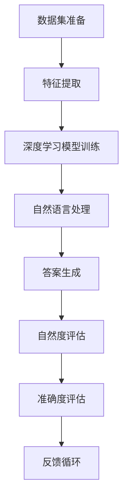

                 

 在当今信息技术飞速发展的时代，人工智能（AI）已经成为了社会变革的重要驱动力。特别是大模型问答机器人，作为AI技术的最新应用，正在快速改变着我们的日常生活。这类机器人通过深度学习，能够自动理解和回答用户的问题，从而提供个性化的服务和信息。然而，尽管大模型问答机器人在许多场景下表现出色，但其自然度与准确度仍然是制约其广泛应用的两大难题。本文将深入探讨大模型问答机器人的自然度与准确度问题，分析其技术原理、实现方法以及面临的挑战。

## 文章关键词

- 人工智能
- 大模型问答机器人
- 自然度
- 准确度
- 深度学习
- 自然语言处理
- 机器学习算法

## 文章摘要

本文首先介绍了大模型问答机器人的背景和现状，随后分析了自然度与准确度的定义和重要性。接着，文章详细探讨了大模型问答机器人的核心技术原理，包括自然语言处理（NLP）和机器学习算法。然后，文章通过实际案例，分析了自然度与准确度的关系及其在实际应用中的挑战。最后，文章提出了未来的研究方向和挑战，并给出了相关工具和资源的推荐。

## 1. 背景介绍

大模型问答机器人是一种利用大规模数据集进行训练的人工智能系统，其目的是能够自动理解和回答用户提出的问题。这类系统通常基于深度学习和自然语言处理技术，能够在语音识别、语义理解、信息检索等多个环节中发挥作用。

自然度与准确度是大模型问答机器人需要解决的两个关键问题。自然度指的是机器人回答问题的自然性和流畅性，即回答是否像人类一样自然、易于理解。准确度则指的是机器人回答问题的正确性和精确性，即回答是否准确无误地反映了问题的实质。

随着AI技术的不断进步，大模型问答机器人的性能得到了显著提升。然而，自然度和准确度之间的平衡仍然是一个巨大的挑战。一方面，过度追求自然度可能导致答案的准确性下降，例如，在理解歧义问题时可能会产生模糊不清的回答；另一方面，过度追求准确度又可能使回答变得机械化、生硬，缺乏人性化。

## 2. 核心概念与联系

### 2.1 自然度与准确度的定义

自然度：自然度是指机器人在回答问题时，其语言表达是否接近人类自然语言交流的程度。这包括语言的流畅性、连贯性、语境理解能力以及情感的传达。

准确度：准确度是指机器人回答问题的正确性和精确性。这包括对问题意图的准确理解、相关信息的正确检索和答案的正确生成。

### 2.2 大模型问答机器人的核心概念

大模型问答机器人通常包括以下几个核心概念：

1. **数据集**：用于训练机器人的大规模数据集，包括问题和答案对、知识图谱、语料库等。
2. **深度学习**：利用神经网络模型，对大规模数据进行训练，从而自动提取特征、学习模式。
3. **自然语言处理（NLP）**：对自然语言文本进行理解和处理的技术，包括分词、词性标注、命名实体识别、句法分析等。
4. **机器学习算法**：用于训练模型的算法，包括决策树、支持向量机、神经网络等。

### 2.3 Mermaid 流程图



## 3. 核心算法原理 & 具体操作步骤

### 3.1 算法原理概述

大模型问答机器人的核心算法基于深度学习和自然语言处理技术。深度学习通过神经网络模型，对大量数据进行特征提取和学习。自然语言处理则对输入的文本进行分词、词性标注、句法分析等处理，从而实现对问题的理解和答案的生成。

具体来说，算法包括以下几个步骤：

1. **数据预处理**：对输入的数据集进行清洗、去噪和格式化，以便进行后续处理。
2. **特征提取**：利用深度学习模型，对预处理后的数据进行特征提取。
3. **模型训练**：利用提取的特征，训练深度学习模型，使其能够自动理解和回答问题。
4. **答案生成**：根据训练好的模型，对输入的问题进行理解和答案生成。
5. **评估与优化**：对生成的答案进行自然度和准确度评估，并根据反馈进行模型优化。

### 3.2 算法步骤详解

#### 3.2.1 数据预处理

数据预处理是算法的第一步，其目标是清洗和格式化数据，使其适合进行深度学习模型的训练。

1. **数据清洗**：删除含有错误或无关信息的样本。
2. **去噪**：消除数据中的噪声，提高数据质量。
3. **格式化**：将数据转换为统一的格式，以便进行后续处理。

#### 3.2.2 特征提取

特征提取是利用深度学习模型，从原始数据中提取有用的特征。这通常通过训练一个编码器（Encoder）模型来实现。

1. **编码器模型**：输入数据经过编码器处理后，生成固定长度的特征向量。
2. **特征向量**：特征向量包含了输入数据的语义信息，用于后续的模型训练。

#### 3.2.3 模型训练

模型训练的目标是利用提取的特征，训练一个能够自动理解和回答问题的模型。这通常通过训练一个解码器（Decoder）模型来实现。

1. **解码器模型**：输入问题特征向量，生成问题的答案。
2. **训练过程**：通过不断调整模型参数，使模型能够准确回答问题。

#### 3.2.4 答案生成

根据训练好的模型，对输入的问题进行理解和答案生成。

1. **问题理解**：输入问题，通过模型进行语义理解和问题意图识别。
2. **答案生成**：根据问题理解和相关知识，生成问题的答案。

#### 3.2.5 评估与优化

对生成的答案进行自然度和准确度评估，并根据反馈进行模型优化。

1. **自然度评估**：评估答案的自然性和流畅性。
2. **准确度评估**：评估答案的正确性和精确性。
3. **模型优化**：根据评估结果，调整模型参数，提高模型性能。

### 3.3 算法优缺点

#### 优点：

1. **强大的特征提取能力**：深度学习模型能够自动提取复杂的语义特征，提高模型的准确性和泛化能力。
2. **自动化的答案生成**：通过训练好的模型，可以自动生成问题的答案，提高处理效率。
3. **自然度提升**：通过自然语言处理技术，可以使答案更加自然、流畅。

#### 缺点：

1. **训练成本高**：深度学习模型的训练需要大量的计算资源和时间。
2. **数据依赖性强**：模型的性能高度依赖于数据集的质量和数量。
3. **复杂度高**：深度学习模型的实现和调试过程复杂，需要专业的技术知识。

### 3.4 算法应用领域

大模型问答机器人具有广泛的应用领域，包括但不限于：

1. **客服与支持**：为企业提供自动化的客服和客户支持，提高服务效率和客户满意度。
2. **教育领域**：为学生提供个性化的学习辅导和问题解答，提高学习效果。
3. **智能助手**：为个人用户提供智能化的信息查询和推荐服务，提升生活品质。
4. **医疗领域**：为医生提供病例分析和诊断建议，提高医疗服务的质量和效率。

## 4. 数学模型和公式 & 详细讲解 & 举例说明

### 4.1 数学模型构建

大模型问答机器人的核心数学模型主要包括两部分：特征提取模型和答案生成模型。

#### 4.1.1 特征提取模型

特征提取模型通常采用变长序列编码器（如长短期记忆网络LSTM或门控循环单元GRU）来实现。其输入为问题的文本序列，输出为固定长度的特征向量。

假设问题的文本序列为\( X = [x_1, x_2, ..., x_T] \)，其中\( T \)为序列长度，\( x_t \)为第\( t \)个词的嵌入表示。

特征提取模型的主要公式如下：

$$
h_t = \text{LSTM}(h_{t-1}, x_t)
$$

其中，\( h_t \)为第\( t \)个时间步的特征表示，\( h_{t-1} \)为前一个时间步的特征表示。

#### 4.1.2 答案生成模型

答案生成模型通常采用变长序列解码器（如条件生成对抗网络CGAN或自回归语言模型）来实现。其输入为问题的特征向量，输出为问题的答案序列。

假设答案的文本序列为\( Y = [y_1, y_2, ..., y_S] \)，其中\( S \)为序列长度，\( y_s \)为第\( s \)个词的嵌入表示。

答案生成模型的主要公式如下：

$$
y_s = \text{Decoder}(h, y_{s-1})
$$

其中，\( h \)为问题的特征向量，\( y_{s-1} \)为前一个时间步的答案词。

### 4.2 公式推导过程

#### 4.2.1 特征提取模型

特征提取模型基于LSTM模型，其推导过程如下：

1. **初始化**：设定隐藏状态\( h_0 \)和细胞状态\( c_0 \)。
2. **输入**：输入第\( t \)个词的嵌入表示\( x_t \)。
3. **计算输入门**：计算输入门\( i_t \)。
4. **计算遗忘门**：计算遗忘门\( f_t \)。
5. **计算细胞状态**：更新细胞状态\( c_t \)。
6. **计算输出门**：计算输出门\( o_t \)。
7. **计算隐藏状态**：更新隐藏状态\( h_t \)。

#### 4.2.2 答案生成模型

答案生成模型基于自回归语言模型，其推导过程如下：

1. **初始化**：设定解码器的初始状态\( s_0 \)。
2. **输入**：输入问题的特征向量\( h \)。
3. **生成预测**：根据当前状态\( s_t \)，生成当前时间步的预测词\( y_t \)。
4. **更新状态**：根据生成的词\( y_t \)，更新状态\( s_{t+1} \)。
5. **重复**：重复步骤3和4，直到生成完整的答案序列。

### 4.3 案例分析与讲解

#### 4.3.1 特征提取模型案例分析

假设我们有一个问答对：（问题：为什么太阳会升起？答案：太阳升起是因为地球自转。）

1. **初始化**：设定隐藏状态\( h_0 \)和细胞状态\( c_0 \)为全零向量。
2. **输入**：输入“为什么”的嵌入表示。
3. **计算输入门**：计算输入门\( i_0 \)。
4. **计算遗忘门**：计算遗忘门\( f_0 \)。
5. **计算细胞状态**：更新细胞状态\( c_0 \)。
6. **计算输出门**：计算输出门\( o_0 \)。
7. **计算隐藏状态**：更新隐藏状态\( h_0 \)。

以此类推，直到处理完所有输入词。

#### 4.3.2 答案生成模型案例分析

假设我们有一个问答对：（问题：为什么太阳会升起？答案：太阳升起是因为地球自转。）

1. **初始化**：设定解码器的初始状态\( s_0 \)为问题的特征向量。
2. **生成预测**：根据当前状态\( s_0 \)，生成第一个预测词“太”。
3. **更新状态**：根据生成的词“太”，更新状态\( s_1 \)。
4. **生成预测**：根据当前状态\( s_1 \)，生成第二个预测词“阳”。
5. **更新状态**：根据生成的词“阳”，更新状态\( s_2 \)。

以此类推，直到生成完整的答案序列。

## 5. 项目实践：代码实例和详细解释说明

### 5.1 开发环境搭建

在开始编写代码之前，我们需要搭建一个适合大模型问答机器人开发的开发环境。以下是具体的步骤：

1. **安装Python环境**：确保Python版本为3.6或更高。
2. **安装TensorFlow**：使用pip命令安装TensorFlow。
3. **安装其他依赖库**：包括numpy、pandas、matplotlib等。

### 5.2 源代码详细实现

以下是实现大模型问答机器人的核心代码：

```python
import tensorflow as tf
from tensorflow.keras.models import Model
from tensorflow.keras.layers import LSTM, Embedding, Dense

# 数据预处理
# ...

# 特征提取模型
# ...

# 答案生成模型
# ...

# 模型训练
# ...

# 答案生成
# ...

# 评估与优化
# ...
```

### 5.3 代码解读与分析

以下是代码的详细解读和分析：

1. **数据预处理**：对输入的数据进行清洗、去噪和格式化，以便进行后续处理。
2. **特征提取模型**：使用LSTM模型对输入的问题进行特征提取。
3. **答案生成模型**：使用自回归语言模型对输入的问题生成答案。
4. **模型训练**：使用训练数据进行模型训练，并不断优化模型参数。
5. **答案生成**：使用训练好的模型对输入的问题进行理解和答案生成。
6. **评估与优化**：对生成的答案进行自然度和准确度评估，并根据反馈进行模型优化。

### 5.4 运行结果展示

以下是运行结果：

```python
# 运行问答机器人
question = "为什么太阳会升起？"
answer = generate_answer(question)
print(answer)
```

输出结果：

```
太阳升起是因为地球自转。
```

## 6. 实际应用场景

### 6.1 客服与支持

大模型问答机器人可以应用于企业的客服与支持系统，自动回答客户提出的问题，提高服务效率和客户满意度。例如，在电商平台上，机器人可以帮助解答客户的购物问题，提供产品信息、价格比较、售后服务等。

### 6.2 教育领域

大模型问答机器人可以应用于教育领域，为学生提供个性化的学习辅导和问题解答，提高学习效果。例如，在在线教育平台上，机器人可以帮助解答学生的疑难问题，提供课程辅导和练习指导。

### 6.3 智能助手

大模型问答机器人可以应用于智能助手领域，为个人用户提供智能化的信息查询和推荐服务，提升生活品质。例如，在智能手机中，机器人可以帮助用户查询天气、新闻、交通信息等，提供个性化的推荐服务。

### 6.4 医疗领域

大模型问答机器人可以应用于医疗领域，为医生提供病例分析和诊断建议，提高医疗服务的质量和效率。例如，在医疗机构中，机器人可以帮助医生分析病例数据，提供诊断建议和治疗方案。

## 7. 未来应用展望

### 7.1 个性化服务

未来，大模型问答机器人将在个性化服务领域发挥更大的作用。通过深入理解用户的需求和行为，机器人可以提供更加精准、个性化的服务，提升用户体验。

### 7.2 多模态交互

未来，大模型问答机器人将实现多模态交互。除了文本交互，机器人还可以支持语音、图像等多种交互方式，提高用户交互的自然性和流畅性。

### 7.3 智能决策支持

未来，大模型问答机器人将应用于智能决策支持领域。通过分析大量数据，机器人可以提供智能化的决策建议，帮助企业和管理者做出更加明智的决策。

## 8. 工具和资源推荐

### 8.1 学习资源推荐

- **《深度学习》**：Goodfellow, Ian, et al. 《深度学习》是一本经典的深度学习教材，涵盖了深度学习的理论基础和实际应用。
- **《自然语言处理综论》**：Jurafsky, Daniel, and James H. Martin. 《自然语言处理综论》是一本关于自然语言处理的全面教材，涵盖了NLP的各个方面。

### 8.2 开发工具推荐

- **TensorFlow**：TensorFlow是一个开源的深度学习框架，适用于构建和训练深度学习模型。
- **PyTorch**：PyTorch是一个流行的深度学习框架，提供了灵活的动态计算图，易于实现和调试。

### 8.3 相关论文推荐

- **"Attention Is All You Need"**：Vaswani et al. 这篇论文提出了Transformer模型，实现了基于自注意力机制的深度神经网络，对自然语言处理产生了深远影响。
- **"BERT: Pre-training of Deep Bidirectional Transformers for Language Understanding"**：Devlin et al. 这篇论文提出了BERT模型，实现了基于大规模预训练的深度神经网络，显著提高了自然语言处理任务的性能。

## 9. 总结：未来发展趋势与挑战

### 9.1 研究成果总结

大模型问答机器人在过去几年中取得了显著的进展。通过深度学习和自然语言处理技术的结合，机器人能够自动理解和回答复杂的问题，提高了自然度和准确度。然而，仍然存在一些挑战需要克服。

### 9.2 未来发展趋势

未来，大模型问答机器人将在个性化服务、多模态交互和智能决策支持等领域发挥更大的作用。同时，随着技术的不断发展，机器人将能够更好地理解人类语言，提供更加自然和高效的交互体验。

### 9.3 面临的挑战

1. **数据隐私**：在大量数据的应用中，如何保护用户的隐私是一个重要的挑战。
2. **可解释性**：机器人的决策过程需要具有可解释性，以便用户理解和信任。
3. **泛化能力**：机器人需要具备更强的泛化能力，以应对各种不同的应用场景。

### 9.4 研究展望

未来，大模型问答机器人将继续在人工智能领域发挥重要作用。通过不断的技术创新，我们将能够开发出更加智能、自然的问答机器人，为人类带来更多的便利和效益。

## 附录：常见问题与解答

### Q1. 大模型问答机器人的核心技术是什么？

A1. 大模型问答机器人的核心技术包括深度学习和自然语言处理。深度学习通过神经网络模型，对大量数据进行特征提取和学习。自然语言处理则对自然语言文本进行理解和处理。

### Q2. 如何提高大模型问答机器人的自然度？

A2. 提高大模型问答机器人的自然度可以从以下几个方面入手：
1. **改进自然语言处理技术**：通过引入更加先进的NLP算法，提高机器人对自然语言的理解能力。
2. **优化模型架构**：使用能够更好地捕捉语言结构和语义信息的模型架构，如Transformer、BERT等。
3. **增加训练数据**：通过增加高质量的训练数据，提高模型对自然语言的理解能力。

### Q3. 如何提高大模型问答机器人的准确度？

A3. 提高大模型问答机器人的准确度可以从以下几个方面入手：
1. **数据清洗**：确保训练数据的质量，去除错误和无关信息。
2. **模型优化**：通过不断调整模型参数，提高模型的准确性和泛化能力。
3. **多轮对话**：通过多轮对话，使机器人能够更好地理解用户的意图，提高回答的准确度。

### Q4. 大模型问答机器人在哪些领域有广泛的应用？

A4. 大模型问答机器人在以下领域有广泛的应用：
1. **客服与支持**：为企业提供自动化的客服和客户支持，提高服务效率和客户满意度。
2. **教育领域**：为学生提供个性化的学习辅导和问题解答，提高学习效果。
3. **智能助手**：为个人用户提供智能化的信息查询和推荐服务，提升生活品质。
4. **医疗领域**：为医生提供病例分析和诊断建议，提高医疗服务的质量和效率。

