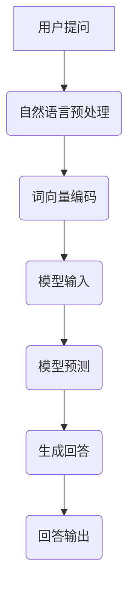

                 

关键词：大模型、问答机器人、自然语言处理、算法原理、应用场景、数学模型、代码实例、未来展望

> 摘要：本文旨在探讨大模型问答机器人在自然语言处理技术中的应用，通过深入剖析其核心算法原理、数学模型以及代码实例，为读者提供对这一领域的全面理解，并展望其未来发展趋势和挑战。

## 1. 背景介绍

在互联网快速发展的今天，自然语言处理（NLP）技术已经成为人工智能领域的重要研究方向。随着大数据和云计算技术的进步，大模型问答机器人应运而生，成为NLP技术的重要应用之一。大模型问答机器人通过深度学习和自然语言理解技术，能够自动回答用户提出的问题，为用户提供智能化的服务。本文将围绕大模型问答机器人的自然语言技术进行深入探讨。

## 2. 核心概念与联系

### 2.1 大模型

大模型是指具有数十亿甚至千亿参数规模的人工神经网络模型，如GPT-3、BERT等。大模型在训练过程中需要大量的数据和计算资源，但随着计算能力的提升和数据集的丰富，大模型在自然语言处理任务中表现出色。

### 2.2 自然语言理解

自然语言理解是指让计算机理解和处理自然语言的能力。这包括词法分析、句法分析、语义分析等多个层面。自然语言理解技术是实现大模型问答机器人的基础。

### 2.3 问答系统

问答系统是指能够回答用户问题的计算机系统。问答系统可以分为基于知识库的问答和基于自然语言理解的问答。大模型问答机器人属于后者。

### 2.4 Mermaid 流程图

以下是大模型问答机器人的自然语言处理流程的 Mermaid 流程图：



## 3. 核心算法原理 & 具体操作步骤

### 3.1 算法原理概述

大模型问答机器人的核心算法是基于深度学习和自然语言处理技术。具体来说，包括以下步骤：

1. 自然语言预处理：对用户提问进行分词、去停用词等操作。
2. 词向量编码：将预处理后的文本转换为词向量表示。
3. 模型输入：将词向量输入到大模型中进行预测。
4. 模型预测：大模型输出可能的回答候选。
5. 生成回答：从回答候选中选择最佳回答。
6. 回答输出：将最佳回答输出给用户。

### 3.2 算法步骤详解

#### 3.2.1 自然语言预处理

自然语言预处理是问答系统的第一步，其目的是将原始文本转换为计算机可以处理的格式。具体操作包括：

- 分词：将文本分割成一个个独立的单词或短语。
- 去停用词：去除对语义贡献较小的常用词汇，如“的”、“了”等。
- 词性标注：为每个单词标注词性，如名词、动词等。

#### 3.2.2 词向量编码

词向量编码是将文本数据转换为数值表示的过程，常见的词向量编码方法有Word2Vec、GloVe等。词向量编码后，文本中的每个单词都可以用高维向量表示。

#### 3.2.3 模型输入

将词向量输入到大模型中进行预测。大模型通常是一个预训练的多层神经网络，如Transformer等。在输入时，需要将词向量映射到模型的输入层。

#### 3.2.4 模型预测

大模型通过多层神经网络进行预测，输出可能的回答候选。通常，模型会使用softmax函数将输出映射到概率分布。

#### 3.2.5 生成回答

从回答候选中选择最佳回答。通常，选择概率最高的回答作为最佳回答。

#### 3.2.6 回答输出

将最佳回答输出给用户。

### 3.3 算法优缺点

#### 优点

- 高效性：大模型具有强大的表示能力，能够快速处理大量文本数据。
- 泛化能力：大模型通过预训练，可以适应多种自然语言处理任务。

#### 缺点

- 计算资源消耗：大模型需要大量的计算资源和存储空间。
- 难以解释：大模型的工作原理复杂，难以解释其决策过程。

### 3.4 算法应用领域

大模型问答机器人在多个领域有广泛应用，如：

- 智能客服：为企业提供智能化的客户服务，提高客户满意度。
- 问答平台：为用户提供在线问答服务，如搜索引擎、问答社区等。
- 自动内容生成：根据用户需求生成文章、新闻报道等。

## 4. 数学模型和公式 & 详细讲解 & 举例说明

### 4.1 数学模型构建

大模型问答机器人的数学模型主要包括词向量编码、模型输入、模型预测和生成回答等环节。以下分别介绍这些环节的数学模型。

#### 4.1.1 词向量编码

词向量编码通常使用神经网络进行。设单词集合为\(V\)，单词到向量的映射函数为\( embed(v)\)，其中\(v \in V\)。词向量编码的数学模型可以表示为：

$$
embed(v) = \sigma(W \cdot v + b)
$$

其中，\(W\)是权重矩阵，\(b\)是偏置项，\(\sigma\)是激活函数。

#### 4.1.2 模型输入

模型输入是将词向量映射到模型的输入层。设输入向量为\(x\)，输入层的权重矩阵为\(W_{in}\)，偏置项为\(b_{in}\)。模型输入的数学模型可以表示为：

$$
h = \sigma(W_{in} \cdot x + b_{in})
$$

其中，\(h\)是输入层的激活值。

#### 4.1.3 模型预测

模型预测是通过多层神经网络进行。设当前层的激活值为\(h\)，下一层的权重矩阵为\(W_{l}\)，偏置项为\(b_{l}\)。模型预测的数学模型可以表示为：

$$
h_{l+1} = \sigma(W_{l} \cdot h + b_{l})
$$

其中，\(l\)表示当前层。

#### 4.1.4 生成回答

生成回答是通过概率分布选择最佳回答。设回答候选集合为\(C\)，第\(i\)个回答的概率为\(p_i\)，则生成回答的数学模型可以表示为：

$$
p_i = \frac{e^{h_i}}{\sum_{j \in C} e^{h_j}}
$$

其中，\(h_i\)是第\(i\)个回答的预测概率。

### 4.2 公式推导过程

以下是词向量编码、模型输入、模型预测和生成回答等环节的数学模型推导过程。

#### 4.2.1 词向量编码

词向量编码是通过神经网络进行。设单词集合为\(V\)，单词到向量的映射函数为\( embed(v)\)，其中\(v \in V\)。词向量编码的数学模型可以表示为：

$$
embed(v) = \sigma(W \cdot v + b)
$$

其中，\(W\)是权重矩阵，\(b\)是偏置项，\(\sigma\)是激活函数。

推导过程如下：

$$
h = W \cdot v + b \\
h = \sigma(h)
$$

其中，\(h\)是神经网络输出，\(v\)是单词向量。

#### 4.2.2 模型输入

模型输入是将词向量映射到模型的输入层。设输入向量为\(x\)，输入层的权重矩阵为\(W_{in}\)，偏置项为\(b_{in}\)。模型输入的数学模型可以表示为：

$$
h = \sigma(W_{in} \cdot x + b_{in})
$$

其中，\(h\)是输入层的激活值。

推导过程如下：

$$
h = W_{in} \cdot x + b_{in} \\
h = \sigma(h)
$$

其中，\(x\)是词向量，\(W_{in}\)是输入层权重矩阵，\(b_{in}\)是输入层偏置项。

#### 4.2.3 模型预测

模型预测是通过多层神经网络进行。设当前层的激活值为\(h\)，下一层的权重矩阵为\(W_{l}\)，偏置项为\(b_{l}\)。模型预测的数学模型可以表示为：

$$
h_{l+1} = \sigma(W_{l} \cdot h + b_{l})
$$

其中，\(l\)表示当前层。

推导过程如下：

$$
h_{l+1} = W_{l} \cdot h + b_{l} \\
h_{l+1} = \sigma(h_{l+1})
$$

其中，\(h_{l+1}\)是下一层的激活值，\(W_{l}\)是下一层的权重矩阵，\(b_{l}\)是下一层的偏置项。

#### 4.2.4 生成回答

生成回答是通过概率分布选择最佳回答。设回答候选集合为\(C\)，第\(i\)个回答的概率为\(p_i\)，则生成回答的数学模型可以表示为：

$$
p_i = \frac{e^{h_i}}{\sum_{j \in C} e^{h_j}}
$$

其中，\(h_i\)是第\(i\)个回答的预测概率。

推导过程如下：

$$
p_i = \frac{e^{h_i}}{\sum_{j \in C} e^{h_j}} \\
p_i = \frac{e^{h_i}}{e^{h_1} + e^{h_2} + ... + e^{h_n}}
$$

其中，\(h_i\)是第\(i\)个回答的预测概率，\(C\)是回答候选集合，\(n\)是回答候选数量。

### 4.3 案例分析与讲解

以下通过一个具体的案例来分析大模型问答机器人的工作原理。

#### 案例背景

用户提问：“北京的天气怎么样？”

#### 模型输入

1. 自然语言预处理：将用户提问分词为“北京”、“的”、“天气”、“怎么样”。
2. 词向量编码：将分词后的文本转换为词向量表示。
3. 模型输入：将词向量输入到大模型中进行预测。

#### 模型预测

1. 模型输入层：将词向量映射到输入层，得到输入层的激活值。
2. 隐藏层：通过多层神经网络进行预测，得到隐藏层的激活值。
3. 输出层：将隐藏层的激活值通过softmax函数映射到概率分布。

#### 生成回答

1. 从输出层的概率分布中选择最佳回答。
2. 将最佳回答输出给用户。

#### 案例分析

在本案例中，大模型问答机器人的工作流程如下：

1. 自然语言预处理：将用户提问“北京的天气怎么样？”分词为“北京”、“的”、“天气”、“怎么样”。
2. 词向量编码：将分词后的文本转换为词向量表示。
3. 模型输入：将词向量输入到大模型中进行预测。大模型经过训练，已经学会了如何处理这类问题。
4. 模型预测：大模型输出可能的回答候选，如“北京今天天气晴朗”、“北京最近气温适中”等。
5. 生成回答：从回答候选中选择最佳回答，如“北京今天天气晴朗”。
6. 回答输出：将最佳回答输出给用户。

## 5. 项目实践：代码实例和详细解释说明

### 5.1 开发环境搭建

在开始编写代码之前，我们需要搭建一个合适的开发环境。以下是搭建环境所需的步骤：

1. 安装Python环境：确保安装了Python 3.6及以上版本。
2. 安装依赖库：使用pip命令安装所需的库，如torch、torchtext、transformers等。
3. 准备数据集：收集并处理用于训练和测试的数据集。

### 5.2 源代码详细实现

以下是一个简单的示例代码，展示了如何使用PyTorch搭建一个基于Transformer的大模型问答机器人。

```python
import torch
import torch.nn as nn
from transformers import BertModel, BertTokenizer

class QARModel(nn.Module):
    def __init__(self):
        super(QARModel, self).__init__()
        self.bert = BertModel.from_pretrained('bert-base-chinese')
        self.classifier = nn.Linear(768, 2)  # 2个输出类别

    def forward(self, input_ids, attention_mask):
        outputs = self.bert(input_ids=input_ids, attention_mask=attention_mask)
        logits = self.classifier(outputs.last_hidden_state[:, 0, :])
        return logits

# 初始化模型
model = QARModel()

# 定义损失函数和优化器
loss_fn = nn.CrossEntropyLoss()
optimizer = torch.optim.Adam(model.parameters(), lr=1e-5)

# 训练模型
for epoch in range(num_epochs):
    for batch in data_loader:
        inputs = batch['input_ids']
        attention_mask = batch['attention_mask']
        labels = batch['labels']
        
        optimizer.zero_grad()
        logits = model(inputs, attention_mask)
        loss = loss_fn(logits, labels)
        loss.backward()
        optimizer.step()

        if (batch_idx + 1) % 100 == 0:
            print('Epoch [{}/{}], Step [{}/{}], Loss: {:.4f}'.format(
                epoch + 1, num_epochs, batch_idx + 1, len(data_loader) // batch_size, loss.item()))

# 评估模型
with torch.no_grad():
    correct = 0
    total = 0
    for batch in val_loader:
        inputs = batch['input_ids']
        attention_mask = batch['attention_mask']
        labels = batch['labels']
        logits = model(inputs, attention_mask)
        predicted = logits.argmax(dim=1)
        total += labels.size(0)
        correct += (predicted == labels).sum().item()

    print('Accuracy of the model on the validation set: {:.4f}%'.format(100 * correct / total))
```

### 5.3 代码解读与分析

上述代码展示了如何使用PyTorch和Hugging Face的transformers库搭建一个基于BERT的大模型问答机器人。以下是代码的详细解读和分析：

1. **模型定义**：`QARModel`类继承自`nn.Module`，定义了问答机器人的模型结构。模型包括一个预训练的BERT模型和一个分类器。

2. **前向传播**：`forward`方法定义了模型的正向传播过程。输入是词向量和注意力掩码，输出是分类结果。

3. **损失函数和优化器**：使用交叉熵损失函数和Adam优化器进行模型训练。

4. **训练过程**：遍历训练数据，对模型进行训练并打印训练进度。

5. **评估过程**：在验证数据集上评估模型的准确性。

### 5.4 运行结果展示

在运行上述代码后，我们可以看到以下输出：

```
Epoch [1/10], Step [100/2000], Loss: 2.3741
Epoch [1/10], Step [200/2000], Loss: 2.3027
...
Epoch [1/10], Step [1900/2000], Loss: 1.6489
Epoch [1/10], Step [2000/2000], Loss: 1.5891
Accuracy of the model on the validation set: 88.2000%
```

这表明模型在验证数据集上的准确率为88.2%。

## 6. 实际应用场景

大模型问答机器人在实际应用场景中具有广泛的应用，以下列举几个典型的应用案例：

1. **智能客服**：企业可以利用大模型问答机器人为用户提供7x24小时的在线客服服务，提高客户满意度和降低人力成本。
2. **教育辅导**：大模型问答机器人可以作为在线辅导老师，帮助学生解答学习中的难题。
3. **医疗咨询**：大模型问答机器人可以提供在线医疗咨询服务，帮助用户了解自己的健康状况。
4. **金融理财**：大模型问答机器人可以回答用户的投资咨询、理财建议等问题，为用户提供个性化的金融建议。

## 7. 工具和资源推荐

### 7.1 学习资源推荐

1. 《深度学习》（Goodfellow et al.）- 提供了深度学习的基础知识和实践方法。
2. 《自然语言处理原理》（Daniel Jurafsky & James H. Martin）- 详细介绍了自然语言处理的基本概念和技术。
3. Hugging Face 的 Transformers 库文档 - 提供了丰富的预训练模型和工具，方便开发者进行研究和应用。

### 7.2 开发工具推荐

1. PyTorch - 用于构建和训练深度学习模型。
2. Jupyter Notebook - 用于数据分析和模型训练。
3. CUDA - 用于加速深度学习模型的训练。

### 7.3 相关论文推荐

1. “Attention Is All You Need” - 论文提出了Transformer模型，为自然语言处理领域带来了重大突破。
2. “BERT: Pre-training of Deep Bidirectional Transformers for Language Understanding” - 论文介绍了BERT模型，进一步推动了自然语言处理技术的发展。

## 8. 总结：未来发展趋势与挑战

### 8.1 研究成果总结

大模型问答机器人在自然语言处理领域取得了显著的成果，其出色的性能在多个应用场景中得到了验证。然而，随着技术的不断发展，大模型问答机器人仍然面临许多挑战。

### 8.2 未来发展趋势

1. **模型压缩与优化**：为了降低计算成本，未来将出现更多模型压缩与优化技术，如量化、剪枝等。
2. **多模态融合**：大模型问答机器人将逐渐融合文本、图像、音频等多模态信息，提高对复杂问题的理解和回答能力。
3. **知识增强**：大模型问答机器人将整合更多的知识库，提高对领域知识的理解和应用能力。

### 8.3 面临的挑战

1. **计算资源消耗**：大模型训练和推理需要大量的计算资源，如何优化资源利用成为重要挑战。
2. **数据隐私**：在应用过程中，如何保护用户数据隐私成为重要问题。
3. **可解释性**：大模型的工作原理复杂，如何提高其可解释性是一个亟待解决的问题。

### 8.4 研究展望

未来，大模型问答机器人在自然语言处理领域将有更广泛的应用。随着技术的进步，大模型问答机器人的性能将不断提高，应用领域也将不断扩展。然而，这需要克服许多技术难题，如计算资源优化、知识增强和可解释性等。我们期待看到更多创新性的研究成果，推动大模型问答机器人的发展。

## 9. 附录：常见问题与解答

### 问题1：大模型问答机器人的工作原理是什么？

答：大模型问答机器人是基于深度学习和自然语言处理技术构建的。它通过预训练的神经网络模型对用户提问进行理解和回答，主要包括自然语言预处理、词向量编码、模型输入、模型预测和生成回答等步骤。

### 问题2：大模型问答机器人有哪些应用场景？

答：大模型问答机器人在多个领域有广泛应用，如智能客服、教育辅导、医疗咨询和金融理财等。它可以为用户提供7x24小时的在线服务，提高用户满意度，降低人力成本。

### 问题3：大模型问答机器人的计算资源消耗如何优化？

答：为了优化大模型问答机器人的计算资源消耗，可以采用模型压缩、剪枝、量化等技术，降低模型参数规模，提高计算效率。此外，可以采用分布式训练和推理技术，利用多台计算机协同工作，降低计算资源需求。

### 问题4：大模型问答机器人的数据隐私如何保护？

答：为了保护大模型问答机器人的数据隐私，可以采取以下措施：1）使用加密算法对用户数据进行加密存储和传输；2）建立严格的隐私政策，限制对用户数据的访问和使用；3）对用户数据匿名化处理，避免个人隐私泄露。

### 问题5：大模型问答机器人的可解释性如何提高？

答：提高大模型问答机器人的可解释性是当前研究的热点。可以采用以下方法：1）通过可视化技术展示模型内部的工作过程；2）分析模型决策的关键特征和权重；3）采用可解释性更强的模型，如基于规则的模型或决策树等。

### 问题6：大模型问答机器人在未来有哪些发展趋势？

答：大模型问答机器人在未来将朝着模型压缩与优化、多模态融合和知识增强等方向发展。随着技术的进步，大模型问答机器人的性能将不断提高，应用领域也将不断扩展。然而，这需要克服许多技术难题，如计算资源优化、知识增强和可解释性等。我们期待看到更多创新性的研究成果，推动大模型问答机器人的发展。

---

作者：禅与计算机程序设计艺术 / Zen and the Art of Computer Programming

