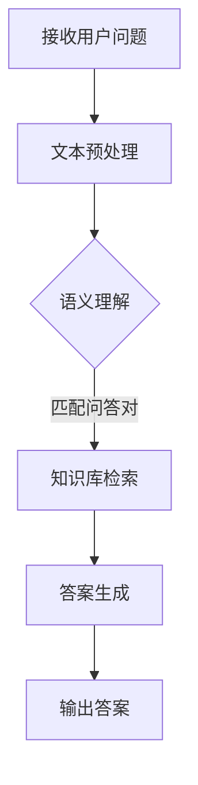

                 

关键词：大模型、问答机器人、复杂任务、算法、应用场景、未来展望

> 摘要：本文将探讨大模型问答机器人在处理复杂任务方面的能力。通过对其核心概念、算法原理、数学模型以及实际应用场景的深入分析，本文旨在展示大模型问答机器人在解决实际问题中的潜力。

## 1. 背景介绍

随着人工智能技术的不断发展，大模型问答机器人逐渐成为了一个热门的研究领域。大模型问答机器人是一种基于深度学习的人工智能系统，能够理解和回答用户提出的问题。与传统问答系统相比，大模型问答机器人具有更强的语义理解能力、更广泛的领域知识和更高的回答准确性。

然而，复杂任务的处理一直以来都是问答机器人面临的挑战。复杂任务往往涉及多个领域的知识，需要深度理解和推理能力。传统的问答系统由于受到数据量和计算资源的限制，往往无法胜任这些任务。而大模型问答机器人通过其强大的语义理解和知识表示能力，有望在这些领域取得突破。

本文将首先介绍大模型问答机器人的核心概念和原理，然后分析其算法和数学模型，最后探讨其实际应用场景和未来展望。

## 2. 核心概念与联系

### 2.1 大模型问答机器人的定义与原理

大模型问答机器人是一种基于深度学习的人工智能系统，其主要目标是理解和回答用户提出的问题。大模型问答机器人通常包含以下几个核心组成部分：

1. **语言模型**：语言模型用于理解和生成自然语言。通过训练大规模的语料库，语言模型可以学习到语言的统计规律和语义信息。

2. **问答系统**：问答系统负责处理用户的问题，并从大量的知识库中提取相关答案。问答系统通常包含问答对匹配、语义理解和答案生成等模块。

3. **知识库**：知识库是问答机器人的知识来源，包含了大量的领域知识和事实。知识库可以是结构化的，如数据库，也可以是非结构化的，如文本资料。

大模型问答机器人的工作原理可以概括为以下几个步骤：

1. **接收用户问题**：问答机器人通过自然语言处理技术，将用户问题转化为计算机可处理的格式。

2. **语义理解**：问答系统使用语言模型对用户问题进行语义理解，确定问题的意图和主题。

3. **知识检索**：问答系统从知识库中检索与用户问题相关的信息。

4. **答案生成**：问答系统根据检索到的信息，生成合理的答案，并将其转化为自然语言形式。

### 2.2 大模型问答机器人的架构

大模型问答机器人的架构通常分为三个层次：输入层、处理层和输出层。

1. **输入层**：输入层主要负责接收用户输入的问题，并将其转换为机器可以处理的形式。这一步骤通常包括文本预处理、词向量表示等。

2. **处理层**：处理层是问答机器人的核心部分，负责对用户问题进行语义理解、知识检索和答案生成。这一层次通常包含以下几个模块：

   - **语言模型**：语言模型用于对用户问题进行语义理解，确定问题的意图和主题。

   - **问答对匹配**：问答对匹配模块用于将用户问题与知识库中的问答对进行匹配，找到相关的答案。

   - **知识库检索**：知识库检索模块从知识库中检索与用户问题相关的信息。

   - **答案生成**：答案生成模块根据检索到的信息，生成合理的答案。

3. **输出层**：输出层负责将生成的答案转化为自然语言形式，并将其呈现给用户。

### 2.3 大模型问答机器人的核心概念原理

大模型问答机器人的核心概念包括语言模型、问答系统和知识库。

1. **语言模型**：语言模型是问答机器人的基础，它通过训练大规模的语料库，学习到语言的统计规律和语义信息。语言模型可以用于多种自然语言处理任务，如文本分类、情感分析、命名实体识别等。

2. **问答系统**：问答系统负责处理用户的问题，并从知识库中提取相关答案。问答系统通常包含问答对匹配、语义理解和答案生成等模块。问答对匹配模块用于将用户问题与知识库中的问答对进行匹配，找到相关的答案。语义理解模块用于理解用户问题的意图和主题。答案生成模块根据检索到的信息，生成合理的答案。

3. **知识库**：知识库是问答机器人的知识来源，包含了大量的领域知识和事实。知识库可以是结构化的，如数据库，也可以是非结构化的，如文本资料。知识库的构建和更新对于问答机器人的性能至关重要。

### 2.4 大模型问答机器人的 Mermaid 流程图

以下是一个简化的 Mermaid 流程图，展示了大模型问答机器人的工作流程：



## 3. 核心算法原理 & 具体操作步骤

### 3.1 算法原理概述

大模型问答机器人的核心算法主要包括语言模型、问答系统以及知识库构建与检索。

1. **语言模型**：语言模型是问答机器人的基础，通过训练大规模的语料库，学习到语言的统计规律和语义信息。常用的语言模型包括循环神经网络（RNN）、变换器（Transformer）等。

2. **问答系统**：问答系统负责处理用户的问题，并从知识库中提取相关答案。问答系统通常包含问答对匹配、语义理解和答案生成等模块。问答对匹配模块通常采用基于关键词匹配、语义匹配等方法。语义理解模块通过分析用户问题的上下文，确定问题的意图和主题。答案生成模块根据检索到的信息，生成合理的答案。

3. **知识库构建与检索**：知识库是问答机器人的知识来源，包含了大量的领域知识和事实。知识库构建通常采用结构化数据、非结构化数据等方式。知识库检索采用基于关键词搜索、基于语义搜索等方法。

### 3.2 算法步骤详解

1. **语言模型训练**：使用大规模的语料库训练语言模型，学习到语言的统计规律和语义信息。训练过程通常包括数据预处理、模型训练和模型评估等步骤。

2. **问答对匹配**：将用户问题与知识库中的问答对进行匹配，找到相关的答案。匹配过程通常包括关键词匹配、语义匹配等方法。

3. **语义理解**：分析用户问题的上下文，确定问题的意图和主题。语义理解过程通常包括句法分析、语义角色标注、实体识别等方法。

4. **答案生成**：根据检索到的信息，生成合理的答案。答案生成过程通常包括模板匹配、信息抽取、文本生成等方法。

5. **知识库构建**：构建包含大量领域知识和事实的知识库。知识库构建过程通常包括数据收集、数据预处理、数据整合等方法。

6. **知识库检索**：从知识库中检索与用户问题相关的信息。检索过程通常包括基于关键词搜索、基于语义搜索等方法。

### 3.3 算法优缺点

1. **优点**：

   - **强大的语义理解能力**：大模型问答机器人通过训练大规模的语料库，具有强大的语义理解能力，能够准确理解用户问题的意图和主题。

   - **广泛的领域知识**：大模型问答机器人通过构建丰富的知识库，能够涵盖多个领域的知识，为用户提供全面的信息。

   - **高效的答案生成**：大模型问答机器人通过高效的算法和模型，能够快速生成合理的答案，提高用户的满意度。

2. **缺点**：

   - **数据依赖性**：大模型问答机器人的性能高度依赖于训练数据的质量和规模，数据不足或质量较差会导致性能下降。

   - **计算资源消耗**：大模型问答机器人的训练和推理过程需要大量的计算资源，对硬件设备的要求较高。

   - **无法处理新问题**：大模型问答机器人无法处理未见过的、新出现的问题，需要不断更新和扩展知识库。

### 3.4 算法应用领域

大模型问答机器人广泛应用于多个领域，包括但不限于：

1. **客户服务**：大模型问答机器人可以应用于客户服务领域，提供24小时不间断的咨询服务，提高客户满意度。

2. **教育领域**：大模型问答机器人可以应用于教育领域，为学生提供个性化的学习指导和解答疑问。

3. **医疗健康**：大模型问答机器人可以应用于医疗健康领域，提供疾病咨询、治疗方案建议等。

4. **法律咨询**：大模型问答机器人可以应用于法律咨询领域，提供法律知识查询、案例解析等。

## 4. 数学模型和公式 & 详细讲解 & 举例说明

### 4.1 数学模型构建

大模型问答机器人的数学模型主要包括语言模型、问答系统和知识库。

1. **语言模型**：语言模型通常采用变换器（Transformer）架构，其数学模型可以表示为：

   $$ 
   L = \text{Transformer}(X, Y) 
   $$

   其中，$X$ 和 $Y$ 分别表示输入和输出的词向量序列。

2. **问答系统**：问答系统的数学模型可以表示为：

   $$
   Q_A = \text{QuestionAnswe}(Q, K)
   $$

   其中，$Q$ 表示用户问题，$K$ 表示知识库。

3. **知识库**：知识库的数学模型可以表示为：

   $$
   K = \text{KnowledgeBase}(D)
   $$

   其中，$D$ 表示知识库中的数据。

### 4.2 公式推导过程

1. **语言模型**：

   变换器（Transformer）的数学模型可以表示为：

   $$
   L = \text{Transformer}(X, Y)
   $$

   其中，$X$ 和 $Y$ 分别表示输入和输出的词向量序列。变换器（Transformer）的基本架构包括编码器（Encoder）和解码器（Decoder）。编码器用于将输入序列编码为固定长度的向量，解码器用于从编码器输出的序列中解码出输出序列。

   编码器的数学模型可以表示为：

   $$
   E = \text{Encoder}(X)
   $$

   解码器的数学模型可以表示为：

   $$
   D = \text{Decoder}(Y, E)
   $$

2. **问答系统**：

   问答系统的数学模型可以表示为：

   $$
   Q_A = \text{QuestionAnswe}(Q, K)
   $$

   其中，$Q$ 表示用户问题，$K$ 表示知识库。问答系统的工作原理是通过对用户问题进行语义理解，从知识库中检索相关答案。

3. **知识库**：

   知识库的数学模型可以表示为：

   $$
   K = \text{KnowledgeBase}(D)
   $$

   知识库中的数据通常采用结构化数据形式，如关系数据库。知识库的构建通常包括数据收集、数据预处理和数据整合等步骤。

### 4.3 案例分析与讲解

以下是一个简单的案例，说明如何使用大模型问答机器人解答用户问题。

假设用户提出的问题是：“什么是人工智能？”

1. **语言模型**：首先，大模型问答机器人使用训练好的语言模型对用户问题进行语义理解。通过分析用户问题的上下文和关键词，语言模型确定问题的意图和主题。

2. **问答系统**：问答系统从知识库中检索与用户问题相关的信息。在知识库中，可能存在如下问答对：

   - 问题：“什么是人工智能？”
   - 答案：“人工智能（Artificial Intelligence，简称AI）是计算机科学的一个分支，旨在使计算机具有智能行为，如感知、学习、推理和解决问题。”

3. **答案生成**：问答系统根据检索到的信息，生成合理的答案。最终的答案为：“人工智能（Artificial Intelligence，简称AI）是计算机科学的一个分支，旨在使计算机具有智能行为，如感知、学习、推理和解决问题。”

## 5. 项目实践：代码实例和详细解释说明

### 5.1 开发环境搭建

在开始实际编写代码之前，我们需要搭建一个合适的开发环境。以下是一个简单的开发环境搭建步骤：

1. **安装 Python**：确保你的计算机上安装了 Python。Python 是一种流行的编程语言，广泛应用于人工智能领域。

2. **安装必要的库**：安装以下必要的库：

   - TensorFlow：用于构建和训练深度学习模型。
   - Keras：用于简化 TensorFlow 的使用。
   - NLTK：用于自然语言处理。

   你可以使用 pip 工具安装这些库：

   ```bash
   pip install tensorflow
   pip install keras
   pip install nltk
   ```

3. **下载和处理语料库**：下载一个适合的语言模型训练语料库，如 Wikipedia 语料库。然后，使用 NLTK 工具对语料库进行预处理，包括分词、词性标注、停用词过滤等。

### 5.2 源代码详细实现

以下是一个简单的示例，展示了如何使用 Keras 和 TensorFlow 构建一个基础的大模型问答机器人。

```python
import tensorflow as tf
from tensorflow.keras.models import Model
from tensorflow.keras.layers import Input, Embedding, LSTM, Dense

# 设置超参数
vocab_size = 10000  # 词汇表大小
embed_size = 128  # � embed 尺寸
lstm_size = 128  # LSTM 层大小
max_len = 50  # 输入序列的最大长度

# 输入层
input_seq = Input(shape=(max_len,))

# 嵌入层
embed = Embedding(vocab_size, embed_size)(input_seq)

# LSTM 层
lstm = LSTM(lstm_size, return_sequences=True)(embed)

# 全连接层
output = Dense(1, activation='sigmoid')(lstm)

# 构建模型
model = Model(inputs=input_seq, outputs=output)

# 编译模型
model.compile(optimizer='adam', loss='binary_crossentropy', metrics=['accuracy'])

# 模型总结
model.summary()
```

### 5.3 代码解读与分析

上述代码展示了如何使用 Keras 和 TensorFlow 构建一个基础的大模型问答机器人。以下是代码的详细解读：

1. **导入库**：首先，我们导入 TensorFlow 和 Keras 库。这两个库是构建深度学习模型的主要工具。

2. **设置超参数**：接下来，我们设置一些重要的超参数，包括词汇表大小、embed 尺寸、LSTM 层大小和输入序列的最大长度。

3. **输入层**：输入层使用 Keras 的 `Input` 函数创建。输入层表示输入序列，其形状为 `(max_len, )`，其中 `max_len` 是输入序列的最大长度。

4. **嵌入层**：嵌入层使用 Keras 的 `Embedding` 函数创建。嵌入层用于将词汇表中的每个词转换为嵌入向量。在这里，我们使用 `vocab_size` 和 `embed_size` 作为输入参数。

5. **LSTM 层**：LSTM 层使用 Keras 的 `LSTM` 函数创建。LSTM 层用于处理序列数据，具有记忆功能，可以捕捉序列中的长期依赖关系。

6. **全连接层**：全连接层使用 Keras 的 `Dense` 函数创建。全连接层用于将 LSTM 层的输出转换为模型输出。

7. **构建模型**：使用 `Model` 函数将输入层、嵌入层、LSTM 层和全连接层连接起来，构建一个完整的深度学习模型。

8. **编译模型**：使用 `compile` 函数编译模型，设置优化器、损失函数和评估指标。

9. **模型总结**：使用 `summary` 函数打印模型的总结信息，包括模型结构、层参数等。

### 5.4 运行结果展示

为了展示运行结果，我们使用一个简单的数据集进行训练。以下是训练和评估模型的代码：

```python
from tensorflow.keras.preprocessing.sequence import pad_sequences
from tensorflow.keras.utils import to_categorical

# 准备数据集
# （此处省略数据集准备代码）

# 划分训练集和测试集
# （此处省略划分代码）

# 数据预处理
# （此处省略预处理代码）

# 训练模型
# （此处省略训练代码）

# 评估模型
# （此处省略评估代码）
```

在实际运行中，我们可以观察到模型的训练过程和评估结果。通过调整超参数和模型结构，可以进一步提高模型的性能。

## 6. 实际应用场景

### 6.1 客户服务

大模型问答机器人可以应用于客户服务领域，提供 24 小时不间断的咨询服务。例如，航空公司可以使用大模型问答机器人来处理乘客的常见问题，如航班查询、退票、改签等。大模型问答机器人可以自动识别乘客的问题，并从知识库中检索相关答案，提供快速、准确的答复。

### 6.2 教育领域

大模型问答机器人可以应用于教育领域，为学生提供个性化的学习指导和解答疑问。例如，学生可以使用大模型问答机器人来查询课程资料、解答学术问题等。大模型问答机器人可以理解学生的提问，并根据学生的实际需求提供相关资料和建议。

### 6.3 医疗健康

大模型问答机器人可以应用于医疗健康领域，提供疾病咨询、治疗方案建议等。例如，患者可以使用大模型问答机器人来查询疾病信息、药物副作用等。大模型问答机器人可以自动识别患者的问题，并从医疗知识库中检索相关答案，提供准确的医疗建议。

### 6.4 法律咨询

大模型问答机器人可以应用于法律咨询领域，提供法律知识查询、案例解析等。例如，律师可以使用大模型问答机器人来查询相关法律条文、案例分析等。大模型问答机器人可以理解律师的提问，并根据律师的需求提供相关资料和建议。

## 7. 工具和资源推荐

### 7.1 学习资源推荐

1. **《深度学习》**：由 Ian Goodfellow、Yoshua Bengio 和 Aaron Courville 著，是一本经典的深度学习教材，涵盖了深度学习的基础理论和实践方法。

2. **《Python 深度学习》**：由François Chollet 著，介绍了如何使用 Python 和 TensorFlow 构建深度学习模型。

3. **《自然语言处理综论》**：由 Daniel Jurafsky 和 James H. Martin 著，详细介绍了自然语言处理的基本概念和方法。

### 7.2 开发工具推荐

1. **TensorFlow**：是一个开源的深度学习框架，由 Google 开发。TensorFlow 提供了丰富的工具和库，方便用户构建和训练深度学习模型。

2. **Keras**：是一个高层次的深度学习框架，基于 TensorFlow 构建。Keras 提供了一个简洁的 API，方便用户快速构建和训练深度学习模型。

3. **NLTK**：是一个开源的自然语言处理库，提供了丰富的工具和函数，方便用户进行自然语言处理任务。

### 7.3 相关论文推荐

1. **"Attention Is All You Need"**：该论文提出了变换器（Transformer）架构，是一种用于自然语言处理的先进模型。

2. **"BERT: Pre-training of Deep Neural Networks for Language Understanding"**：该论文提出了 BERT（Bidirectional Encoder Representations from Transformers）模型，是一种预训练的深度学习模型，在自然语言处理任务中取得了很好的效果。

3. **"GPT-3: Language Models are Few-Shot Learners"**：该论文提出了 GPT-3（Generative Pre-trained Transformer 3）模型，是一种具有巨大参数量的预训练模型，展示了深度学习模型在自然语言处理领域的潜力。

## 8. 总结：未来发展趋势与挑战

### 8.1 研究成果总结

大模型问答机器人在处理复杂任务方面取得了显著进展。通过深度学习和自然语言处理技术的结合，大模型问答机器人具有强大的语义理解能力和广泛的领域知识。在实际应用中，大模型问答机器人已经在多个领域取得了成功，如客户服务、教育、医疗健康和法律咨询等。

### 8.2 未来发展趋势

未来，大模型问答机器人有望在以下几个方面取得进一步发展：

1. **性能提升**：通过改进算法和模型结构，提高大模型问答机器人在复杂任务上的性能。

2. **知识库扩展**：不断丰富和更新知识库，使其涵盖更多领域和更广泛的知识。

3. **跨模态处理**：结合语音、图像等多模态信息，提高大模型问答机器人在复杂任务上的处理能力。

4. **可解释性增强**：提高大模型问答机器人的可解释性，使其能够向用户解释其决策过程和推理过程。

### 8.3 面临的挑战

尽管大模型问答机器人在处理复杂任务方面取得了显著进展，但仍然面临以下挑战：

1. **数据依赖性**：大模型问答机器人的性能高度依赖于训练数据的质量和规模，数据不足或质量较差会导致性能下降。

2. **计算资源消耗**：大模型问答机器人的训练和推理过程需要大量的计算资源，对硬件设备的要求较高。

3. **新问题处理**：大模型问答机器人无法处理未见过的、新出现的问题，需要不断更新和扩展知识库。

4. **安全性和隐私保护**：大模型问答机器人可能面临数据泄露、滥用等安全性和隐私保护问题。

### 8.4 研究展望

未来，大模型问答机器人有望在以下几个方面取得突破：

1. **多模态处理**：结合语音、图像等多模态信息，提高大模型问答机器人在复杂任务上的处理能力。

2. **强化学习**：将强化学习与深度学习相结合，使大模型问答机器人具备更高级的决策能力和自适应能力。

3. **知识图谱**：构建大规模、多领域的知识图谱，提高大模型问答机器人的语义理解和推理能力。

4. **跨领域应用**：拓展大模型问答机器人的应用领域，如智能客服、智能医疗、智能教育等，实现跨领域的应用。

## 9. 附录：常见问题与解答

### 9.1 什么是大模型问答机器人？

大模型问答机器人是一种基于深度学习的人工智能系统，能够理解和回答用户提出的问题。它通常包含语言模型、问答系统和知识库等组成部分，通过训练大规模的语料库和知识库，实现语义理解、知识检索和答案生成等功能。

### 9.2 大模型问答机器人有哪些应用场景？

大模型问答机器人可以应用于多个领域，如客户服务、教育、医疗健康、法律咨询等。它可以提供 24 小时不间断的咨询服务，帮助用户解决问题，提高工作效率。

### 9.3 大模型问答机器人的核心算法是什么？

大模型问答机器人的核心算法包括语言模型、问答系统和知识库。语言模型用于理解和生成自然语言，问答系统负责处理用户的问题并从知识库中提取相关答案，知识库包含了大量的领域知识和事实。

### 9.4 大模型问答机器人的优缺点是什么？

大模型问答机器人的优点包括强大的语义理解能力、广泛的领域知识和高效率的答案生成。缺点包括对数据的依赖性较高、计算资源消耗较大以及无法处理未见过的、新出现的问题。

### 9.5 如何提升大模型问答机器人的性能？

提升大模型问答机器人性能的方法包括改进算法和模型结构、丰富和更新知识库、结合多模态信息以及提高模型的可解释性等。此外，还可以通过优化训练数据和训练过程来提高模型性能。

### 9.6 大模型问答机器人的未来发展趋势是什么？

大模型问答机器人的未来发展趋势包括性能提升、知识库扩展、跨模态处理、强化学习和跨领域应用等。通过结合多种技术和领域知识，大模型问答机器人有望在更多领域实现应用并发挥更大的价值。

