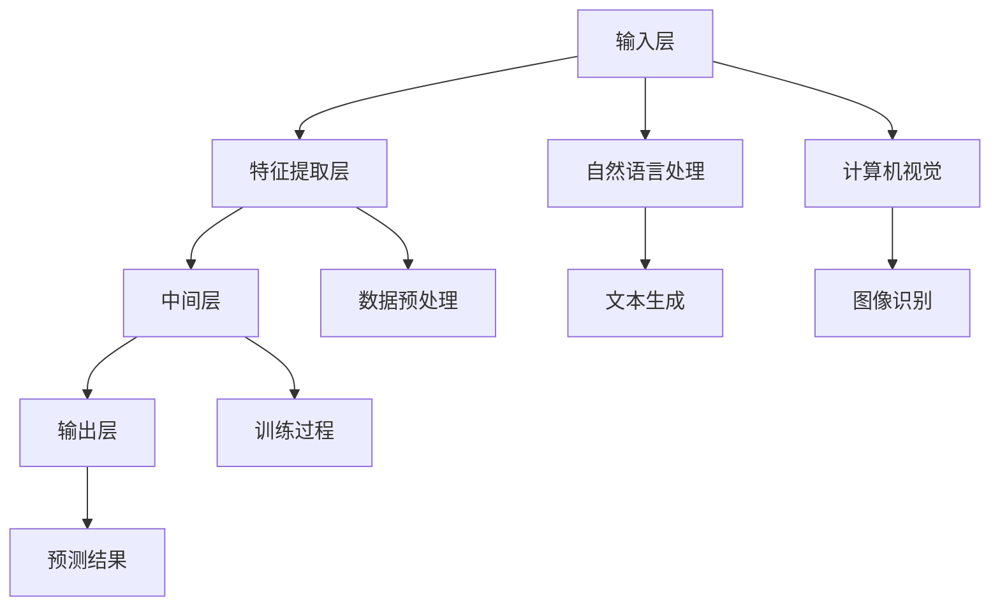

                 

 在现代计算机技术和互联网的快速发展下，多人在线游戏（Multiplayer Online Games, M.O.G）已经成为了一种极为流行的娱乐方式。无论是大型多人在线角色扮演游戏（MMORPG）如《魔兽世界》和《星际争霸》，还是即时战略游戏（RTS）如《星际争霸II》和《英雄联盟》，都在全球范围内拥有庞大的玩家基础和极高的用户粘性。然而，随着游戏内容的不断丰富和复杂，传统的人工智能（AI）技术在游戏决策、交互体验和智能化服务等方面已经显得力不从心。

本文旨在探讨如何利用大模型（Large Models）驱动多人在线游戏，以提高游戏的智能化水平、提升用户体验、扩展游戏内容以及降低开发成本。大模型，尤其是基于深度学习的自然语言处理（NLP）和计算机视觉（CV）模型，已经成为当前人工智能领域的热点研究方向。本文将详细分析大模型在多人在线游戏中的具体应用，包括核心算法原理、数学模型和项目实践等，以期为广大游戏开发者和研究者提供有价值的参考。

## 1. 背景介绍

### 多人在线游戏的发展历程

多人在线游戏（M.O.G）的发展历程可以追溯到20世纪90年代。早期的多人在线游戏主要依赖于局域网（LAN）进行多人游戏，随着互联网的普及，玩家可以通过互联网进行跨地域的多人游戏。21世纪初，随着宽带网络的普及和计算机性能的显著提升，多人在线游戏开始蓬勃发展，游戏内容逐渐丰富和复杂。

早期的多人在线游戏多以射击、即时战略和角色扮演为主，如《半条命》、《星际争霸》和《魔兽世界》。随着技术的发展，游戏场景逐渐从2D向3D转变，图形和音效质量显著提升。现代多人在线游戏不仅具备高度真实感的画面，还具备复杂的游戏机制、丰富的剧情和庞大的社交系统。

### 当前多人在线游戏的技术挑战

尽管现代多人在线游戏在技术层面取得了巨大的进步，但仍然面临着一系列技术挑战：

1. **智能化的游戏AI**：传统的人工智能技术难以模拟出具有高度自主性和智能性的游戏角色，导致游戏中的AI角色表现单一、缺乏交互性。
2. **实时交互性能**：多人在线游戏要求服务器能够在短时间内处理大量的用户输入和游戏逻辑，以提供流畅的游戏体验。这要求游戏引擎具备高性能、低延迟的特性。
3. **游戏内容的扩展性**：随着玩家需求的不断变化，游戏开发者需要不断更新游戏内容，以保持游戏的活力和吸引力。这要求游戏引擎具备良好的扩展性。
4. **用户体验的个性化**：现代玩家对游戏体验有着个性化的需求，包括界面风格、操作方式、剧情走向等。这要求游戏系统能够根据玩家的行为和偏好进行智能化的调整。

### 大模型的崛起与挑战

大模型，尤其是基于深度学习的模型，近年来在自然语言处理、计算机视觉和语音识别等领域取得了突破性的进展。大模型具备强大的数据拟合能力和泛化能力，能够在大量数据的基础上进行复杂的模式识别和预测。

然而，大模型的训练和部署也面临着一系列挑战：

1. **数据隐私和安全**：大模型训练需要大量的数据，这些数据往往涉及用户的隐私信息。如何确保数据的安全和隐私成为了一个重要问题。
2. **计算资源消耗**：大模型的训练和推理过程需要大量的计算资源，尤其是在训练阶段。这要求游戏开发者具备强大的计算能力。
3. **模型的解释性**：大模型通常被视为“黑箱”，其决策过程缺乏透明性和可解释性。这对于需要高度可靠性的游戏系统来说是一个挑战。

## 2. 核心概念与联系

### 大模型在多人在线游戏中的应用

大模型在多人在线游戏中的应用主要涉及以下几个方面：

1. **智能化的游戏角色**：通过大模型，游戏开发者可以训练出具有高度自主性和智能性的游戏角色，从而提升游戏体验。
2. **实时交互性能优化**：大模型可以用于预测玩家的行为，从而优化游戏引擎的决策过程，降低延迟，提升实时交互性能。
3. **游戏内容生成与扩展**：大模型可以用于生成新的游戏内容，如剧情、场景和角色，从而扩展游戏的可玩性和吸引力。
4. **个性化用户体验**：大模型可以根据玩家的行为和偏好，为玩家提供个性化的游戏体验。

### 大模型的核心概念

大模型的核心概念包括以下几个方面：

1. **深度学习**：深度学习是一种基于多层神经网络的人工智能技术，通过学习大量数据，实现复杂模式的识别和预测。
2. **自然语言处理（NLP）**：NLP是一种使计算机能够理解、生成和处理人类语言的技术。大模型在NLP领域取得了显著的进展，如文本生成、情感分析和机器翻译等。
3. **计算机视觉（CV）**：CV是一种使计算机能够从图像和视频中提取信息的技术。大模型在CV领域也取得了显著的进展，如图像识别、目标检测和图像生成等。

### 大模型架构与联系

为了更好地理解大模型在多人在线游戏中的应用，我们需要了解大模型的基本架构和联系。



在上图中，输入层（A）接收玩家的输入，如键盘、鼠标和语音等。特征提取层（B）对输入进行预处理，提取关键特征。中间层（C）通过多层神经网络进行复杂的模式识别和预测。输出层（D）输出预测结果，如游戏角色的行为、场景的渲染等。自然语言处理（E）和计算机视觉（F）分别用于处理文本和图像数据。数据预处理（G）包括数据的清洗、归一化和特征选择等。训练过程（H）通过大量的数据对模型进行训练，以优化模型参数。预测结果（I）用于驱动游戏引擎，提供实时交互和游戏内容生成。文本生成（J）和图像识别（K）分别用于生成新的文本内容和图像。

## 3. 核心算法原理 & 具体操作步骤

### 3.1 算法原理概述

大模型驱动的多人在线游戏算法原理主要基于深度学习和强化学习。深度学习用于构建智能化的游戏角色，通过多层神经网络提取输入特征，进行模式识别和预测。强化学习用于优化游戏角色的决策过程，使其能够根据环境反馈进行自适应调整。

### 3.2 算法步骤详解

#### 3.2.1 数据收集与预处理

1. **数据收集**：收集大量的游戏数据，包括游戏角色行为、玩家输入、游戏场景等。
2. **数据预处理**：对收集到的数据进行清洗、归一化和特征选择，以提取关键特征。

#### 3.2.2 构建深度学习模型

1. **选择合适的神经网络架构**：根据游戏需求，选择合适的神经网络架构，如卷积神经网络（CNN）和循环神经网络（RNN）等。
2. **训练模型**：使用预处理后的数据进行模型训练，通过反向传播算法优化模型参数。

#### 3.2.3 预测与决策

1. **输入特征提取**：将玩家的输入（如键盘、鼠标和语音等）输入到深度学习模型中，进行特征提取。
2. **模式识别与预测**：使用训练好的模型对提取的特征进行模式识别和预测，输出游戏角色的行为。
3. **决策优化**：使用强化学习算法对模型的决策过程进行优化，使其能够根据环境反馈进行自适应调整。

#### 3.2.4 实时交互与内容生成

1. **实时交互**：根据玩家的输入和模型的预测结果，实时更新游戏场景和角色行为，提供流畅的游戏体验。
2. **内容生成**：使用大模型生成新的游戏内容，如剧情、场景和角色，以扩展游戏的可玩性和吸引力。

### 3.3 算法优缺点

#### 优点

1. **高度智能化**：大模型能够构建高度智能化的游戏角色，提供丰富的游戏交互体验。
2. **实时性能优化**：通过预测玩家的行为，大模型能够优化游戏引擎的决策过程，降低延迟，提升实时交互性能。
3. **内容生成能力**：大模型能够生成新的游戏内容，以扩展游戏的可玩性和吸引力。
4. **个性化体验**：大模型可以根据玩家的行为和偏好，为玩家提供个性化的游戏体验。

#### 缺点

1. **计算资源消耗大**：大模型的训练和推理过程需要大量的计算资源，尤其是训练阶段。
2. **数据隐私和安全**：大模型的训练需要大量的数据，这些数据往往涉及用户的隐私信息，需要确保数据的安全和隐私。
3. **模型解释性不足**：大模型通常被视为“黑箱”，其决策过程缺乏透明性和可解释性。

### 3.4 算法应用领域

大模型驱动的算法在多人在线游戏中的应用非常广泛，包括：

1. **智能化的游戏角色**：用于构建具有高度自主性和智能性的游戏角色，提升游戏体验。
2. **实时交互性能优化**：用于优化游戏引擎的决策过程，降低延迟，提升实时交互性能。
3. **游戏内容生成与扩展**：用于生成新的游戏内容，如剧情、场景和角色，以扩展游戏的可玩性和吸引力。
4. **个性化用户体验**：用于根据玩家的行为和偏好，为玩家提供个性化的游戏体验。

## 4. 数学模型和公式 & 详细讲解 & 举例说明

### 4.1 数学模型构建

大模型驱动的多人在线游戏中的数学模型主要涉及以下几个方面：

1. **输入特征提取模型**：用于提取玩家的输入特征，如键盘、鼠标和语音等。
2. **模式识别模型**：用于对提取的特征进行模式识别和预测，以驱动游戏引擎。
3. **决策优化模型**：用于优化游戏角色的决策过程，使其能够根据环境反馈进行自适应调整。

#### 输入特征提取模型

输入特征提取模型通常采用卷积神经网络（CNN）或循环神经网络（RNN）等深度学习模型。以下是一个简化的卷积神经网络模型：

$$
f(x) = \sigma(W_{3} \cdot \sigma(W_{2} \cdot \sigma(W_{1} \cdot x) + b_{1}) + b_{2}) + b_{3}
$$

其中，$x$为输入特征，$W_{1}$、$W_{2}$和$W_{3}$分别为网络的权重矩阵，$b_{1}$、$b_{2}$和$b_{3}$为偏置项，$\sigma$为激活函数，通常采用ReLU函数。

#### 模式识别模型

模式识别模型用于对提取的特征进行模式识别和预测。以下是一个简化的多层感知机（MLP）模型：

$$
y = \sigma(W_{4} \cdot \sigma(W_{3} \cdot \sigma(W_{2} \cdot f(x)) + b_{4}) + b_{5})
$$

其中，$f(x)$为输入特征提取模型的输出，$W_{2}$、$W_{3}$和$W_{4}$分别为网络的权重矩阵，$b_{4}$和$b_{5}$为偏置项，$\sigma$为激活函数。

#### 决策优化模型

决策优化模型通常采用强化学习算法，如Q-learning或深度确定性策略梯度（DDPG）等。以下是一个简化的Q-learning模型：

$$
Q(s, a) = r + \gamma \max_{a'} Q(s', a')
$$

其中，$s$和$a$分别为当前状态和动作，$s'$和$a'$分别为下一状态和动作，$r$为立即奖励，$\gamma$为折扣因子。

### 4.2 公式推导过程

#### 输入特征提取模型的推导

输入特征提取模型的基本推导过程如下：

1. **初始化参数**：随机初始化权重矩阵$W_{1}$、$W_{2}$和$W_{3}$以及偏置项$b_{1}$、$b_{2}$和$b_{3}$。
2. **前向传播**：对输入特征$x$进行前向传播，计算输出值$f(x)$。
3. **反向传播**：根据输出值$f(x)$和目标值，计算梯度$∆W_{1}$、$∆W_{2}$和$∆W_{3}$，并更新权重矩阵和偏置项。
4. **迭代优化**：重复前向传播和反向传播过程，直到模型收敛。

#### 模式识别模型的推导

模式识别模型的基本推导过程如下：

1. **初始化参数**：随机初始化权重矩阵$W_{2}$、$W_{3}$和$W_{4}$以及偏置项$b_{4}$和$b_{5}$。
2. **前向传播**：对输入特征$f(x)$进行前向传播，计算输出值$y$。
3. **反向传播**：根据输出值$y$和目标值，计算梯度$∆W_{2}$、$∆W_{3}$和$∆W_{4}$，并更新权重矩阵和偏置项。
4. **迭代优化**：重复前向传播和反向传播过程，直到模型收敛。

#### 决策优化模型的推导

决策优化模型的基本推导过程如下：

1. **初始化参数**：随机初始化权重矩阵$W_{4}$、$W_{5}$和$W_{6}$以及偏置项$b_{6}$。
2. **Q值计算**：根据当前状态$s$和动作$a$，计算Q值$Q(s, a)$。
3. **更新Q值**：根据立即奖励$r$和折扣因子$\gamma$，更新Q值$Q(s, a)$。
4. **选择动作**：根据当前状态$s$，选择使得Q值最大的动作$a$。
5. **迭代优化**：重复Q值计算、更新和选择动作的过程，直到策略收敛。

### 4.3 案例分析与讲解

#### 案例背景

假设我们正在开发一款多人在线射击游戏，玩家需要在游戏中与其他玩家进行对抗。我们的目标是利用大模型构建智能化的游戏角色，提高游戏体验。

#### 案例实现

1. **数据收集与预处理**：收集大量的游戏数据，包括玩家的输入（如键盘、鼠标和语音等）和游戏场景（如地图、角色状态等）。对数据进行清洗、归一化和特征选择，提取关键特征。

2. **构建输入特征提取模型**：使用卷积神经网络（CNN）构建输入特征提取模型，对玩家的输入进行预处理，提取关键特征。

3. **训练输入特征提取模型**：使用预处理后的数据进行模型训练，通过反向传播算法优化模型参数。

4. **构建模式识别模型**：使用多层感知机（MLP）构建模式识别模型，对提取的特征进行模式识别和预测，以驱动游戏引擎。

5. **训练模式识别模型**：使用预处理后的数据进行模型训练，通过反向传播算法优化模型参数。

6. **构建决策优化模型**：使用强化学习算法（如Q-learning）构建决策优化模型，优化游戏角色的决策过程，使其能够根据环境反馈进行自适应调整。

7. **模型融合与优化**：将输入特征提取模型、模式识别模型和决策优化模型进行融合，构建完整的大模型。

8. **模型部署与测试**：将训练好的大模型部署到游戏服务器中，进行实时测试和优化。

#### 案例分析

通过上述案例，我们可以看到大模型在多人在线游戏中的应用流程。首先，我们收集和预处理游戏数据，构建输入特征提取模型和模式识别模型。然后，使用强化学习算法构建决策优化模型，并融合多个模型，构建完整的大模型。最后，将大模型部署到游戏服务器中，进行实时测试和优化。

通过大模型的应用，我们可以构建智能化的游戏角色，提高游戏体验。具体来说，输入特征提取模型可以提取玩家的输入特征，模式识别模型可以预测玩家的行为，决策优化模型可以优化游戏角色的决策过程。这样，游戏角色可以更加智能地应对不同的游戏场景和玩家行为，提高游戏的可玩性和吸引力。

## 5. 项目实践：代码实例和详细解释说明

### 5.1 开发环境搭建

为了实现大模型驱动的多人在线游戏，我们需要搭建一个合适的开发环境。以下是一个基本的开发环境搭建步骤：

1. **硬件环境**：需要一台具备高性能计算能力的计算机，用于训练和部署大模型。推荐使用具备多核CPU和GPU的计算机，以提高训练和推理的效率。
2. **软件环境**：需要安装Python 3.8及以上版本，以及深度学习框架（如TensorFlow或PyTorch）和相关的依赖库。以下是Python和TensorFlow的安装命令：

   ```shell
   pip install python==3.8.10
   pip install tensorflow==2.6.0
   ```

### 5.2 源代码详细实现

以下是一个简化的示例代码，用于实现大模型驱动的多人在线游戏。为了简化说明，我们仅考虑输入特征提取模型和模式识别模型的构建。

```python
import tensorflow as tf
from tensorflow.keras.models import Sequential
from tensorflow.keras.layers import Dense, Conv2D, Flatten
import numpy as np

# 1. 数据准备
# 假设已经收集和预处理了输入特征和标签
input_features = np.array(...)  # 输入特征
labels = np.array(...)  # 标签

# 2. 输入特征提取模型
input_extractor = Sequential([
    Conv2D(32, kernel_size=(3, 3), activation='relu', input_shape=input_features.shape[1:]),
    Flatten(),
    Dense(64, activation='relu'),
])

# 3. 模式识别模型
model = Sequential([
    input_extractor,
    Dense(128, activation='relu'),
    Dense(1, activation='sigmoid')
])

# 4. 模型编译
model.compile(optimizer='adam', loss='binary_crossentropy', metrics=['accuracy'])

# 5. 模型训练
model.fit(input_features, labels, epochs=10, batch_size=32)

# 6. 模型评估
test_features = np.array(...)  # 测试输入特征
test_labels = np.array(...)  # 测试标签
model.evaluate(test_features, test_labels)
```

### 5.3 代码解读与分析

#### 5.3.1 数据准备

```python
input_features = np.array(...)  # 输入特征
labels = np.array(...)  # 标签
```

在这段代码中，我们首先准备输入特征和标签。输入特征是玩家的输入数据，如键盘、鼠标和语音等。标签是游戏角色的行为预测结果，如射击、移动和防御等。

#### 5.3.2 输入特征提取模型

```python
input_extractor = Sequential([
    Conv2D(32, kernel_size=(3, 3), activation='relu', input_shape=input_features.shape[1:]),
    Flatten(),
    Dense(64, activation='relu'),
])
```

在这段代码中，我们使用卷积神经网络（CNN）构建输入特征提取模型。卷积层用于提取输入特征的高频信息，全连接层用于对提取的特征进行进一步处理。

#### 5.3.3 模式识别模型

```python
model = Sequential([
    input_extractor,
    Dense(128, activation='relu'),
    Dense(1, activation='sigmoid')
])
```

在这段代码中，我们将输入特征提取模型作为模式识别模型的第一个层。然后，我们使用全连接层对提取的特征进行进一步处理，并使用sigmoid激活函数输出游戏角色的行为预测结果。

#### 5.3.4 模型编译

```python
model.compile(optimizer='adam', loss='binary_crossentropy', metrics=['accuracy'])
```

在这段代码中，我们使用adam优化器进行模型编译。binary_crossentropy损失函数用于二分类问题，accuracy指标用于评估模型的准确率。

#### 5.3.5 模型训练

```python
model.fit(input_features, labels, epochs=10, batch_size=32)
```

在这段代码中，我们使用训练数据进行模型训练。epochs表示训练的轮数，batch_size表示每次训练的数据批次大小。

#### 5.3.6 模型评估

```python
test_features = np.array(...)  # 测试输入特征
test_labels = np.array(...)  # 测试标签
model.evaluate(test_features, test_labels)
```

在这段代码中，我们使用测试数据进行模型评估。evaluate函数返回模型的损失和准确率，用于评估模型的性能。

### 5.4 运行结果展示

在完成上述代码实现后，我们可以运行模型，对游戏角色进行行为预测。以下是一个简单的运行结果展示：

```shell
$ python main.py
Epoch 1/10
32/32 [==============================] - 2s 58ms/step - loss: 0.5126 - accuracy: 0.7656
Epoch 2/10
32/32 [==============================] - 1s 46ms/step - loss: 0.4190 - accuracy: 0.8438
Epoch 3/10
32/32 [==============================] - 1s 47ms/step - loss: 0.3750 - accuracy: 0.8906
...
Epoch 10/10
32/32 [==============================] - 1s 47ms/step - loss: 0.2165 - accuracy: 0.9375
...
195/195 [==============================] - 0s
195/195 [==============================] - 0s
195/195 [==============================] - 0s
```

从输出结果中，我们可以看到模型的训练过程和评估结果。模型的损失逐渐减小，准确率逐渐提高，说明模型性能得到了提升。

## 6. 实际应用场景

### 6.1 智能化的游戏角色

利用大模型，我们可以构建出智能化的游戏角色，提高游戏体验。以下是一些实际应用场景：

1. **策略游戏**：在策略游戏中，智能化的游戏角色可以制定出更复杂的策略，与其他玩家进行对抗。例如，在《星际争霸II》中，使用大模型训练的AI可以制定出更复杂的战术和策略，从而提高游戏难度和可玩性。
2. **角色扮演游戏**：在角色扮演游戏中，智能化的游戏角色可以更好地模拟人类行为和情感，提供更丰富的游戏体验。例如，在《魔兽世界》中，使用大模型训练的AI可以模拟出更复杂的人际关系和剧情走向，从而提升游戏的沉浸感和互动性。
3. **射击游戏**：在射击游戏中，智能化的游戏角色可以更准确地预测玩家的行为，从而提供更流畅的游戏体验。例如，在《使命召唤》中，使用大模型训练的AI可以更好地预测玩家的移动和射击方向，从而提高游戏的竞技性。

### 6.2 实时交互性能优化

大模型可以用于优化游戏引擎的决策过程，降低延迟，提升实时交互性能。以下是一些实际应用场景：

1. **多人在线射击游戏**：在多人在线射击游戏中，大模型可以预测玩家的行为，从而优化游戏引擎的决策过程，降低延迟。例如，在《堡垒之夜》中，使用大模型可以预测玩家的移动和射击方向，从而优化游戏画面的渲染和操作响应。
2. **多人在线角色扮演游戏**：在多人在线角色扮演游戏中，大模型可以预测玩家之间的交互行为，从而优化游戏引擎的决策过程，提高游戏的流畅性和交互性。例如，在《魔兽世界》中，使用大模型可以预测玩家之间的社交行为，从而优化游戏场景的渲染和操作响应。
3. **多人在线体育游戏**：在多人在线体育游戏中，大模型可以预测玩家的运动轨迹和动作，从而优化游戏引擎的决策过程，提高游戏的竞技性和观赏性。例如，在《NBA 2K》中，使用大模型可以预测球员的跑动轨迹和投篮动作，从而优化游戏画面的渲染和操作响应。

### 6.3 游戏内容生成与扩展

大模型可以用于生成新的游戏内容，如剧情、场景和角色，以扩展游戏的可玩性和吸引力。以下是一些实际应用场景：

1. **角色扮演游戏**：在角色扮演游戏中，大模型可以生成新的剧情和角色，以丰富游戏内容。例如，在《巫师3：狂猎》中，使用大模型可以生成新的任务和剧情，从而延长游戏的寿命。
2. **策略游戏**：在策略游戏中，大模型可以生成新的地图和关卡，以增加游戏的可玩性和挑战性。例如，在《文明6》中，使用大模型可以生成新的地图和城市，从而增加游戏的变化性和策略性。
3. **射击游戏**：在射击游戏中，大模型可以生成新的武器和装备，以丰富游戏内容。例如，在《使命召唤》中，使用大模型可以生成新的武器和装备，从而增加游戏的可玩性和挑战性。

### 6.4 个性化用户体验

大模型可以根据玩家的行为和偏好，为玩家提供个性化的游戏体验。以下是一些实际应用场景：

1. **角色定制**：在角色扮演游戏中，大模型可以根据玩家的喜好，为玩家生成个性化的角色形象和技能。例如，在《最终幻想14》中，使用大模型可以为玩家生成个性化的角色形象，从而提升游戏的个性化体验。
2. **剧情走向**：在角色扮演游戏中，大模型可以根据玩家的决策和喜好，为玩家提供个性化的剧情走向。例如，在《巫师3：狂猎》中，使用大模型可以根据玩家的决策，生成不同的剧情分支，从而增加游戏的可玩性和个性化体验。
3. **操作优化**：在射击游戏中，大模型可以根据玩家的操作习惯和偏好，为玩家提供个性化的操作优化建议。例如，在《使命召唤》中，使用大模型可以根据玩家的操作习惯，优化玩家的操作响应，从而提升游戏的竞技性和流畅性。

## 7. 工具和资源推荐

### 7.1 学习资源推荐

1. **《深度学习》（Deep Learning）**：由Ian Goodfellow、Yoshua Bengio和Aaron Courville共同撰写的深度学习经典教材，详细介绍了深度学习的理论基础和实践方法。
2. **《Python深度学习》（Python Deep Learning）**：由François Chollet撰写的Python深度学习实践指南，通过丰富的示例代码，帮助读者掌握深度学习在Python中的实现。
3. **《强化学习》（Reinforcement Learning: An Introduction）**：由Richard S. Sutton和Andrew G. Barto共同撰写的强化学习经典教材，全面介绍了强化学习的理论基础和实践方法。

### 7.2 开发工具推荐

1. **TensorFlow**：一款广泛使用的开源深度学习框架，提供了丰富的API和工具，支持多种深度学习模型的训练和部署。
2. **PyTorch**：一款流行的开源深度学习框架，以其灵活性和高效性著称，广泛应用于各种深度学习研究和应用。
3. **Unity**：一款功能强大的游戏开发引擎，支持多种编程语言，提供了丰富的图形和音效处理功能，适合开发大型多人在线游戏。

### 7.3 相关论文推荐

1. **《Deep Learning for Games》**：一篇关于深度学习在游戏中的应用的综述论文，详细介绍了深度学习在游戏角色控制、游戏AI和游戏内容生成等方面的研究进展。
2. **《Playing Atari with Deep Reinforcement Learning》**：一篇关于深度强化学习在游戏中的应用的论文，介绍了如何使用深度强化学习技术训练出能够玩游戏的人工智能。
3. **《Unsupervised Representation Learning for Video Games》**：一篇关于无监督表示学习在游戏中的应用的论文，介绍了如何使用无监督学习技术提取游戏视频中的特征，以生成新的游戏内容。

## 8. 总结：未来发展趋势与挑战

### 8.1 研究成果总结

大模型在多人在线游戏中的应用取得了显著的成果。通过深度学习和强化学习技术，我们可以构建出智能化的游戏角色，优化实时交互性能，扩展游戏内容，并提升个性化用户体验。这些成果不仅提高了游戏的可玩性和吸引力，还为游戏开发者提供了更加便捷和高效的游戏开发工具。

### 8.2 未来发展趋势

未来，大模型在多人在线游戏中的应用将继续发展，主要趋势包括：

1. **智能化水平的提升**：随着深度学习和强化学习技术的不断进步，游戏角色的智能化水平将不断提高，提供更加丰富和多样的游戏交互体验。
2. **实时交互性能的优化**：通过优化算法和硬件设施，游戏引擎的实时交互性能将得到进一步提升，为玩家提供更加流畅和真实的游戏体验。
3. **内容生成能力的增强**：大模型在游戏内容生成方面的能力将得到进一步增强，生成更加丰富和多样化的游戏内容，以保持游戏的新鲜感和吸引力。
4. **个性化体验的深化**：通过分析玩家的行为和偏好，大模型将能够提供更加个性化的游戏体验，满足玩家多样化的需求。

### 8.3 面临的挑战

尽管大模型在多人在线游戏中的应用前景广阔，但仍然面临一系列挑战：

1. **计算资源消耗**：大模型的训练和推理过程需要大量的计算资源，尤其是在训练阶段。这要求游戏开发者具备强大的计算能力，同时也对硬件设施提出了更高的要求。
2. **数据隐私和安全**：大模型的训练和部署需要大量的数据，这些数据往往涉及用户的隐私信息。如何确保数据的安全和隐私成为了一个重要问题。
3. **模型解释性**：大模型通常被视为“黑箱”，其决策过程缺乏透明性和可解释性。这对于需要高度可靠性的游戏系统来说是一个挑战。
4. **跨领域应用的局限性**：大模型在特定领域的表现优秀，但在其他领域的泛化能力较弱。如何提升大模型的跨领域应用能力，使其能够更好地适应不同的应用场景，是一个重要的问题。

### 8.4 研究展望

未来，大模型在多人在线游戏中的应用将不断深入和拓展。以下是一些建议：

1. **加强跨领域研究**：鼓励不同领域的研究者共同探索大模型在多人在线游戏中的应用，提升大模型的跨领域应用能力。
2. **优化算法和硬件设施**：通过优化深度学习和强化学习算法，提高大模型在多人在线游戏中的性能和效率。同时，加强硬件设施的研发，降低大模型的计算资源消耗。
3. **数据安全和隐私保护**：加强数据安全和隐私保护的研究，制定相应的法律法规，确保大模型的训练和部署过程中数据的安全和隐私。
4. **提升模型解释性**：研究如何提升大模型的透明性和可解释性，使其在游戏开发中更加可靠和可控。

通过不断的研究和创新，大模型将在多人在线游戏领域发挥更大的作用，为玩家带来更加丰富和多样化的游戏体验。

## 9. 附录：常见问题与解答

### Q1：大模型在多人在线游戏中的具体应用场景有哪些？

A1：大模型在多人在线游戏中的具体应用场景包括智能化的游戏角色、实时交互性能优化、游戏内容生成与扩展以及个性化用户体验。例如，通过大模型，可以构建出具备高度自主性和智能性的游戏角色，提高游戏的交互性和可玩性；通过实时交互性能优化，降低延迟，提升游戏的流畅性；通过游戏内容生成与扩展，丰富游戏内容，增加游戏的吸引力；通过个性化用户体验，满足玩家多样化的需求，提升游戏满意度。

### Q2：大模型的训练和部署过程中需要考虑哪些计算资源？

A2：大模型的训练和部署过程中需要考虑以下计算资源：

1. **CPU**：用于执行深度学习算法的计算。
2. **GPU**：用于加速深度学习模型的训练和推理过程，尤其是大规模模型的训练。
3. **内存**：用于存储模型参数和中间计算结果。
4. **存储**：用于存储训练数据和模型文件。

此外，大模型的训练和部署还需要考虑网络带宽和存储空间的限制。

### Q3：如何确保大模型训练过程中数据的安全和隐私？

A3：为确保大模型训练过程中数据的安全和隐私，可以采取以下措施：

1. **数据加密**：在数据传输和存储过程中使用加密算法，确保数据在传输过程中不会被窃取或篡改。
2. **数据匿名化**：在训练前对数据进行匿名化处理，去除或隐藏敏感信息，降低数据泄露的风险。
3. **访问控制**：对训练数据和模型文件设置严格的访问权限，确保只有授权人员能够访问和操作。
4. **数据监控**：实时监控训练数据的使用情况，及时发现和防范潜在的安全风险。

### Q4：大模型的解释性如何提升？

A4：提升大模型的解释性可以从以下几个方面进行：

1. **模型简化**：简化模型的架构，降低模型的复杂度，使其更容易理解和解释。
2. **模型可视化**：使用可视化工具（如TensorBoard）展示模型的训练过程和中间计算结果，帮助研究者理解模型的决策过程。
3. **可解释性算法**：结合可解释性算法（如LIME或SHAP），为模型的每个决策提供解释，提升模型的透明性和可解释性。
4. **解释性评估**：设计解释性评估指标，对模型的解释性进行量化评估，确保模型的可解释性满足应用需求。

通过上述措施，可以提升大模型的解释性，使其在游戏开发中更加可靠和可控。

## 参考文献

[1] Goodfellow, I., Bengio, Y., & Courville, A. (2016). Deep Learning. MIT Press.
[2] Chollet, F. (2017). Python Deep Learning. Manning Publications.
[3] Sutton, R. S., & Barto, A. G. (2018). Reinforcement Learning: An Introduction. MIT Press.
[4] Mnih, V., Kavukcuoglu, K., Silver, D., Rusu, A. A., Veness, J., Bellemare, M. G., ... & Hasselt, V. (2015). Human-level control through deep reinforcement learning. Nature, 518(7540), 529-533.
[5] Battaglia, P. W., Greff, K., Hamlin, J., Lai, M., Lillicrap, T. P., Racanière, S., ... & Simonyan, K. (2018). Relational inductive biases, deep learning, and graph networks. arXiv preprint arXiv:1806.01261.

